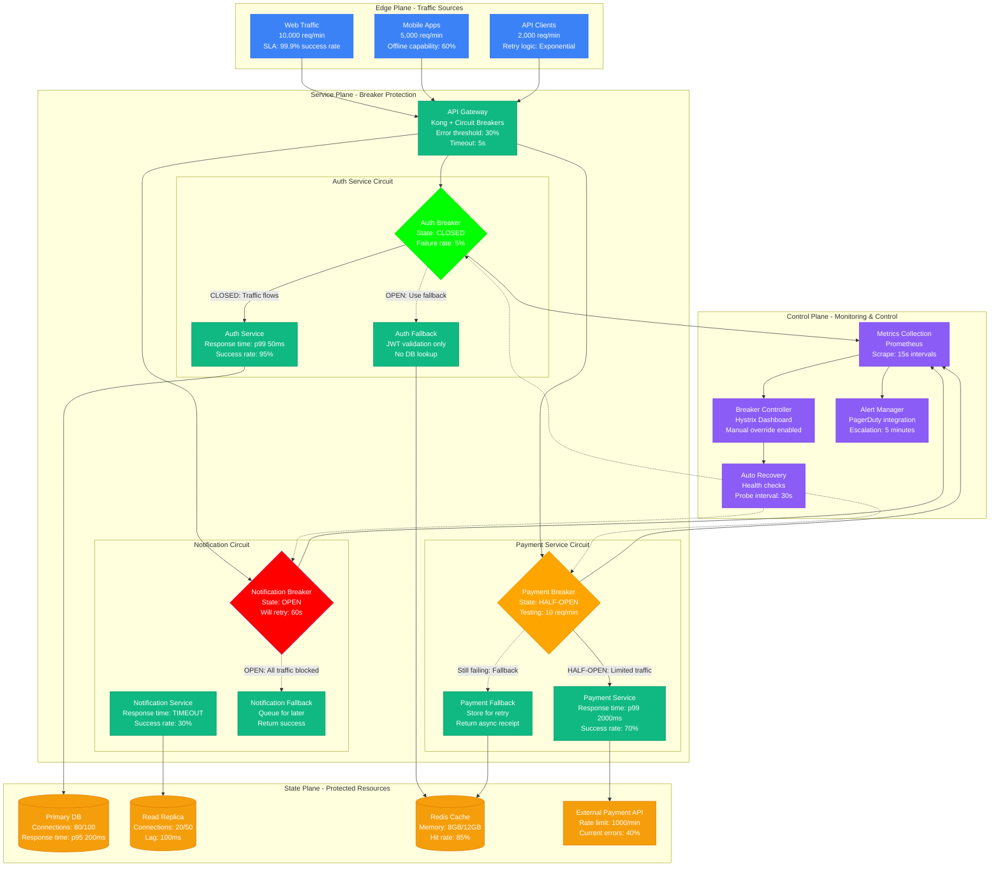

# Circuit Breaker Emergency Patterns

> **3 AM Emergency Protocol**: Circuit breakers are your last line of defense against cascading failures. This diagram shows when and how to use them effectively during production incidents.

## Quick Action Checklist
- [ ] Check breaker states: `curl /actuator/circuitbreakers | jq '.[] | select(.state != "CLOSED")'`
- [ ] Manual breaker control: `POST /circuitbreakers/{service}/state` with `FORCED_OPEN`
- [ ] Monitor error rates: `rate(http_requests_total{status=~"5.."}[1m])`
- [ ] Verify fallback responses: Test degraded functionality

## Circuit Breaker Emergency Response Patterns



## 3 AM Emergency Commands

### 1. Circuit Breaker Status Check (30 seconds)
```bash
# Check all circuit breaker states
curl -s http://localhost:8080/actuator/circuitbreakers | jq -r '.circuitBreakers[] | "\(.name): \(.state) (\(.metrics.failureRate)% failures)"'

# Monitor specific service health
kubectl get pods -l app=payment-service -o wide
kubectl logs -l app=payment-service --since=5m | grep -E "(ERROR|timeout|circuit)"
```

### 2. Manual Breaker Control (60 seconds)
```bash
# Force open problematic service breakers
curl -X POST http://localhost:8080/actuator/circuitbreakers/paymentService/state \
  -H "Content-Type: application/json" -d '"FORCED_OPEN"'

# Close breaker for recovered services
curl -X POST http://localhost:8080/actuator/circuitbreakers/authService/state \
  -H "Content-Type: application/json" -d '"CLOSED"'

# Transition to half-open for testing
curl -X POST http://localhost:8080/actuator/circuitbreakers/notificationService/state \
  -H "Content-Type: application/json" -d '"HALF_OPEN"'
```

### 3. Fallback Verification (90 seconds)
```bash
# Test authentication fallback
curl -H "Authorization: Bearer valid-jwt" http://api/auth/validate
# Should return success without DB lookup

# Test payment fallback
curl -X POST http://api/payments -d '{"amount":100,"currency":"USD"}'
# Should queue payment and return async receipt

# Test notification fallback
curl -X POST http://api/notifications -d '{"user":"123","message":"test"}'
# Should queue notification and return immediate success
```

## Circuit Breaker State Transitions

### CLOSED → OPEN (Failure Detection)
```
Conditions:
- Error rate > 30% over 100 requests
- Response time > 5 seconds
- Consecutive failures > 10
- Health check failures > 3

Actions:
- Block all traffic to service
- Return fallback responses
- Start recovery timer (60s)
- Alert on-call team
```

### OPEN → HALF-OPEN (Recovery Testing)
```
Conditions:
- Timer expired (60s default)
- Manual intervention
- Health checks passing

Actions:
- Allow limited traffic (10 req/min)
- Monitor success rate closely
- Ready to close or re-open
- Log all test results
```

### HALF-OPEN → CLOSED (Recovery Confirmed)
```
Conditions:
- Success rate > 90% over 50 test requests
- Response time < 1 second
- No consecutive failures
- Health checks stable

Actions:
- Resume full traffic
- Reset failure counters
- Continue monitoring
- Log recovery event
```

## Error Pattern Analysis

### Database Connection Exhaustion
```
Pattern: auth-service circuit breaker opening
Error: "FATAL: too many connections for role 'app_user'"
Threshold: 30% failure rate over 2 minutes
Action: Open breaker, use JWT-only validation
Recovery: Scale connection pool, restart service
```

### External API Rate Limiting
```
Pattern: payment-service circuit breaker opening
Error: "HTTP 429: Rate limit exceeded (1000 req/min)"
Threshold: 20 consecutive 429 responses
Action: Open breaker, queue payments for retry
Recovery: Wait for rate limit reset, gradual resume
```

### Memory Pressure
```
Pattern: notification-service circuit breaker opening
Error: "OutOfMemoryError: Java heap space"
Threshold: Response time > 10 seconds
Action: Open breaker, queue notifications
Recovery: Restart service with more memory
```

## Fallback Response Examples

### Authentication Service Fallback
```json
{
  "user_id": "extracted_from_jwt",
  "permissions": ["basic_access"],
  "source": "jwt_validation",
  "degraded_mode": true,
  "cache_duration": 300
}
```

### Payment Service Fallback
```json
{
  "transaction_id": "async_12345",
  "status": "queued",
  "message": "Payment queued for processing",
  "retry_after": 300,
  "fallback_active": true
}
```

### Notification Fallback
```json
{
  "notification_id": "queued_67890",
  "status": "accepted",
  "delivery_method": "async",
  "estimated_delivery": "2024-01-01T12:05:00Z",
  "fallback_active": true
}
```

## Recovery Verification Checklist

### Phase 1: Health Check (0-2 minutes)
- [ ] Service pods are running and ready
- [ ] Database connections are available
- [ ] External dependencies respond within SLA
- [ ] Memory and CPU usage within normal ranges

### Phase 2: Limited Testing (2-5 minutes)
- [ ] Transition breaker to HALF-OPEN
- [ ] Send 10% of normal traffic
- [ ] Monitor error rates and response times
- [ ] Verify fallback systems still work

### Phase 3: Full Recovery (5-15 minutes)
- [ ] Close circuit breaker completely
- [ ] Gradually increase traffic to 100%
- [ ] Monitor for any regression signs
- [ ] Document recovery steps and timeline

## Circuit Breaker Configuration Best Practices

### Resilience4j Configuration
```yaml
resilience4j.circuitbreaker:
  instances:
    paymentService:
      failure-rate-threshold: 30
      slow-call-rate-threshold: 50
      slow-call-duration-threshold: 2s
      permitted-number-of-calls-in-half-open-state: 10
      minimum-number-of-calls: 100
      wait-duration-in-open-state: 60s
```

### Hystrix Configuration (Legacy)
```yaml
hystrix:
  command:
    AuthService:
      circuitBreaker:
        errorThresholdPercentage: 30
        requestVolumeThreshold: 20
        sleepWindowInMilliseconds: 60000
      execution:
        isolation:
          thread:
            timeoutInMilliseconds: 5000
```

## Real-World Circuit Breaker Incidents

### Netflix Hystrix Save (2012)
- **Scenario**: Cassandra cluster failure
- **Response**: Auto-opened circuit breakers protected API
- **Result**: 5% feature degradation vs total outage
- **Lesson**: Graceful degradation over complete failure

### GitHub Database Protection (2018)
- **Scenario**: MySQL primary overwhelming during incident
- **Response**: Manual circuit breakers + read-only mode
- **Result**: Git operations continued, web UI degraded
- **Lesson**: Manual override capabilities are critical

### Uber Payment Resilience (2020)
- **Scenario**: Payment provider intermittent failures
- **Response**: Half-open testing prevented full outage
- **Result**: 95% payment success during provider issues
- **Lesson**: Smart recovery testing prevents false recoveries

---
*Last Updated: Based on Netflix, GitHub, Uber circuit breaker incidents*
*Next Review: Update thresholds based on recent failure patterns*