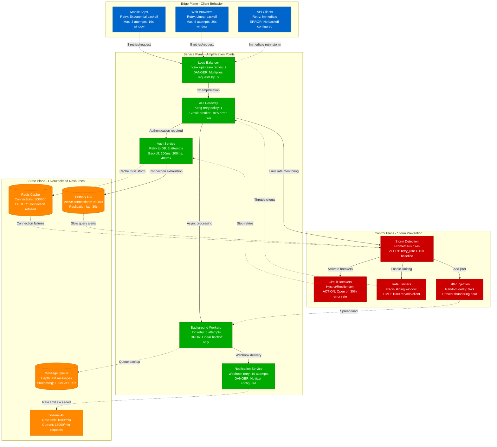

# Retry Storm Detection and Prevention

> **3 AM Emergency Protocol**: Retry storms can amplify failures exponentially. This diagram shows how to detect and stop retry amplification before it overwhelms your systems.

## Quick Detection Checklist
- [ ] Monitor retry metrics: `rate(http_requests_total{status=~"5.."}[1m]) > baseline * 10`
- [ ] Check queue depths: `rabbitmq_queue_depth > 10000`
- [ ] Watch for retry loops: `grep "retry attempt" /var/log/app.log | tail -100`
- [ ] Alert on exponential backoff failures: `retry_backoff_exceeded_total`

## Retry Storm Detection and Mitigation



## 3 AM Response Commands

### 1. Storm Detection (30 seconds)
```bash
# Check retry rates across services
kubectl logs -l app=api-gateway --since=5m | grep -c "retry attempt"

# Monitor queue depths
rabbitmqctl list_queues name messages | awk '$2 > 1000 {print $1 ": " $2}'

# Check circuit breaker states
curl -s http://localhost:8080/actuator/health | jq '.components.circuitBreakers'
```

### 2. Emergency Storm Breaking (60 seconds)
```bash
# Open all circuit breakers manually
curl -X POST http://localhost:8080/actuator/circuitbreakers/authService/state -d "FORCED_OPEN"
curl -X POST http://localhost:8080/actuator/circuitbreakers/paymentService/state -d "FORCED_OPEN"

# Enable aggressive rate limiting
kubectl patch configmap rate-limits -p '{"data":{"max_requests_per_minute":"100"}}'

# Stop non-critical background jobs
kubectl scale deployment background-workers --replicas=0
```

### 3. Traffic Shedding (90 seconds)
```bash
# Enable maintenance mode for non-critical endpoints
kubectl patch ingress api-ingress --type='json' -p='[{"op":"add","path":"/metadata/annotations/nginx.ingress.kubernetes.io~1server-snippet","value":"if ($uri ~ ^/api/v1/analytics) { return 503; }"}]'

# Drain problematic client IPs
iptables -A INPUT -s 192.168.1.100 -j DROP
iptables -A INPUT -s 10.0.0.0/8 -m limit --limit 10/min -j ACCEPT
```

## Storm Pattern Recognition

### Exponential Amplification Pattern
```
Time    Client_Requests    Service_Requests    Queue_Depth
10:00   1,000             1,000               0
10:01   1,000             3,000               2,000          # LB retry (3x)
10:02   1,000             9,000               8,000          # Service retry (3x)
10:03   1,000             27,000              26,000         # STORM DETECTED
```

### Linear Retry Pattern
```
Time    Error_Rate    Retry_Attempts    Total_Load
10:00   5%           50/min            1,000 req/min
10:01   10%          200/min           1,200 req/min
10:02   25%          1,000/min         2,000 req/min
10:03   50%          5,000/min         6,000 req/min    # OVERLOAD
```

## Error Message Patterns

### Redis Connection Storm
```
ERROR: Redis connection pool exhausted, retrying in 100ms
PATTERN: Exponential growth in connection attempts
LOCATION: /var/log/redis/redis.log, application logs
ACTION: Enable connection limiting and circuit breakers
```

### Database Retry Storm
```
ERROR: Connection timed out, attempt 3 of 5
PATTERN: Linear growth in connection attempts during outage
LOCATION: PostgreSQL logs, application error logs
ACTION: Reduce max retry attempts, increase backoff intervals
```

### Webhook Retry Storm
```
ERROR: Webhook delivery failed, scheduling retry #7 in 12800ms
PATTERN: External service timeout causing internal queue backup
LOCATION: Webhook service logs, dead letter queues
ACTION: Disable webhooks temporarily, implement exponential backoff
```

## Storm Prevention Configuration

### Proper Exponential Backoff
```yaml
# Spring Boot Retry Configuration
retry:
  attempts: 3
  backoff:
    initial: 1000    # 1 second
    max: 16000       # 16 seconds max
    multiplier: 2.0
    random: true     # Add jitter
```

### Circuit Breaker Tuning
```yaml
# Resilience4j Configuration
circuitbreaker:
  failure-rate-threshold: 30%    # Open after 30% failures
  wait-duration-in-open-state: 60s
  sliding-window-size: 100
  minimum-number-of-calls: 10
```

### Rate Limiting Rules
```yaml
# Kong Rate Limiting
rate-limiting:
  minute: 1000
  hour: 10000
  policy: "redis"
  fault_tolerant: true
  hide_client_headers: false
```

## Recovery Procedures

### Phase 1: Stop the Storm (0-5 minutes)
- [ ] Open all circuit breakers manually
- [ ] Enable aggressive rate limiting (10% of normal)
- [ ] Stop non-critical background jobs
- [ ] Clear stuck message queues

### Phase 2: Gradual Recovery (5-30 minutes)
- [ ] Close circuit breakers one by one
- [ ] Increase rate limits by 20% every 5 minutes
- [ ] Monitor queue processing rates
- [ ] Test critical user journeys

### Phase 3: Post-Storm Analysis (30+ minutes)
- [ ] Review retry configuration across all services
- [ ] Implement missing exponential backoff
- [ ] Add jitter to prevent thundering herds
- [ ] Update monitoring and alerting thresholds

## Real-World Storm Examples

### AWS Lambda Retry Storm (2019)
- **Trigger**: DynamoDB throttling caused Lambda retries
- **Amplification**: 1,000 requests → 100,000 requests in 2 minutes
- **Resolution**: Exponential backoff + DLQ configuration

### Slack Webhook Storm (2020)
- **Trigger**: Customer webhook endpoint timeout
- **Amplification**: 10 webhooks/sec → 10,000 retries/sec
- **Resolution**: Circuit breakers + webhook disabling

### GitHub Actions Retry Storm (2021)
- **Trigger**: Container registry timeout
- **Amplification**: 500 builds → 50,000 retry attempts
- **Resolution**: Build queue throttling + retry limits

---
*Last Updated: Based on AWS, Slack, GitHub production retry storms*
*Next Review: Monitor for new retry amplification patterns*