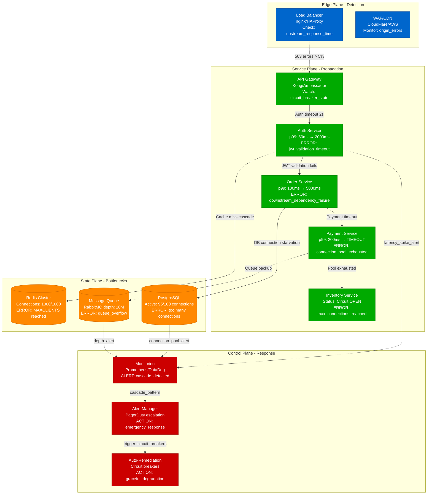

# Service Cascading Failure Detection and Response

> **3 AM Emergency Protocol**: Service cascade failures can take down entire platforms within minutes. This diagram shows exactly what to look for and how to stop the cascade.

## Quick Detection Checklist
- [ ] Check service mesh error rates: `kubectl get vs -o wide | grep -E "5[0-9][0-9]"`
- [ ] Monitor connection pool exhaustion: `netstat -an | grep TIME_WAIT | wc -l`
- [ ] Watch circuit breaker status: `curl http://service-health/hystrix.stream`
- [ ] Alert on cascade patterns: Error rate > 10% AND latency > 2x baseline

## Cascade Detection Flow



## 3 AM Response Commands

### 1. Immediate Detection (30 seconds)
```bash
# Check overall health
curl -s http://health-endpoint/status | jq '.services[] | select(.status != "healthy")'

# Monitor error rates
kubectl top pods --selector=tier=service | grep -E "CPU|Memory"

# Check circuit breaker status
curl -s http://hystrix-dashboard/api/circuit-breakers | jq '.[] | select(.state != "CLOSED")'
```

### 2. Stop the Cascade (60 seconds)
```bash
# Enable circuit breakers manually
kubectl patch deployment auth-service -p '{"spec":{"template":{"metadata":{"annotations":{"circuit-breaker":"OPEN"}}}}}'

# Scale up critical services
kubectl scale deployment auth-service --replicas=20
kubectl scale deployment order-service --replicas=15

# Drain problematic nodes
kubectl drain node-xyz --ignore-daemonsets --delete-emptydir-data
```

### 3. Database Protection (90 seconds)
```bash
# Check DB connections
psql -h db-host -c "SELECT state, count(*) FROM pg_stat_activity GROUP BY state;"

# Enable read-only mode if needed
psql -h db-host -c "ALTER SYSTEM SET default_transaction_read_only = on; SELECT pg_reload_conf();"

# Clear connection pools
pgbouncer -R /etc/pgbouncer/pgbouncer.ini
```

## Error Message Patterns

### Redis Connection Exhaustion
```
ERROR: MAXCLIENTS Redis connection limit reached
LOCATION: /var/log/redis/redis-server.log
ACTION: Increase maxclients or kill idle connections
COMMAND: redis-cli CONFIG SET maxclients 20000
```

### Database Connection Pool
```
ERROR: FATAL: too many connections for role "app_user"
LOCATION: PostgreSQL logs, application logs
ACTION: Scale connection pools or enable read replicas
COMMAND: kubectl scale deployment pgbouncer --replicas=5
```

### Circuit Breaker Activation
```
ERROR: CircuitBreakerOpenException: auth-service
LOCATION: Application logs, service mesh logs
ACTION: Check downstream health, consider manual bypass
COMMAND: curl -X POST http://circuit-breaker/force-close/auth-service
```

## Recovery Checklist

### Phase 1: Immediate (0-5 minutes)
- [ ] Activate all circuit breakers
- [ ] Scale up healthy services 2x
- [ ] Enable graceful degradation modes
- [ ] Notify all stakeholders

### Phase 2: Stabilize (5-15 minutes)
- [ ] Clear Redis connection pools
- [ ] Restart unhealthy service instances
- [ ] Enable read-only database mode
- [ ] Implement request throttling

### Phase 3: Recovery (15-60 minutes)
- [ ] Gradually increase traffic limits
- [ ] Monitor cascade indicators
- [ ] Test critical user journeys
- [ ] Document incident timeline

## Real-World Examples

### Slack February 2022 Cascade
- **Trigger**: Authentication service latency spike
- **Cascade**: WebSocket connections → Message delivery → File uploads
- **Detection**: p99 latency 50ms → 3000ms in 2 minutes
- **Resolution**: Circuit breakers + service restarts

### GitHub October 2021 Database Cascade
- **Trigger**: MySQL connection pool exhaustion
- **Cascade**: API responses → Git operations → CI/CD pipelines
- **Detection**: Connection count 95/100 → timeouts
- **Resolution**: Read replica promotion + connection scaling

---
*Last Updated: Based on incidents from Slack, GitHub, Stripe production outages*
*Next Review: Monitor for new cascade patterns in incident reports*