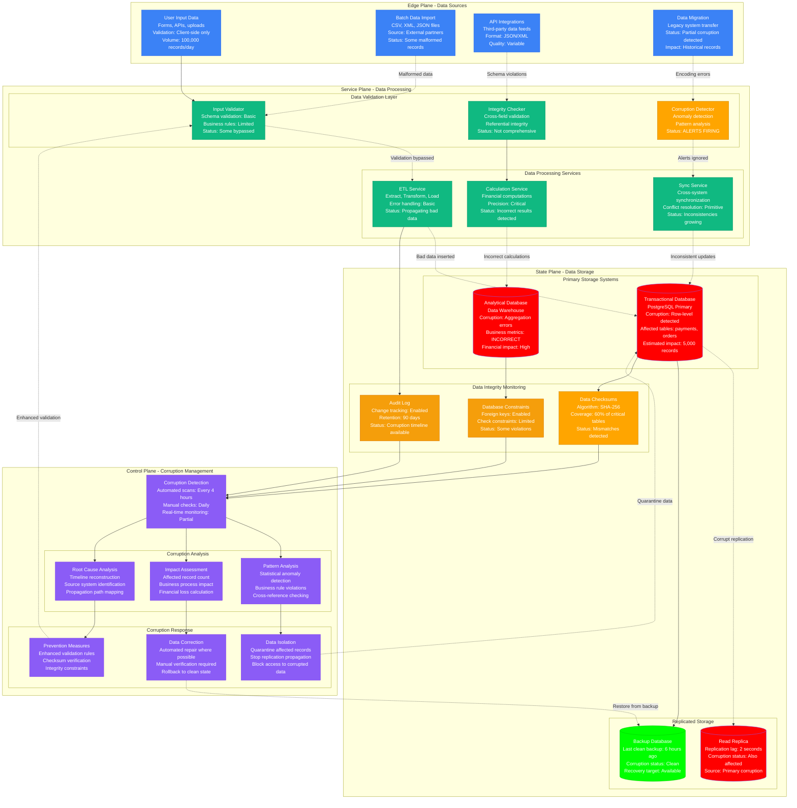

# Data Corruption Detection and Emergency Response

> **3 AM Emergency Protocol**: Data corruption can silently spread through systems, causing incorrect business logic and financial losses. This diagram shows how to detect, isolate, and recover from data corruption incidents.

## Quick Detection Checklist
- [ ] Run data integrity checks: `CHECKSUM TABLE` for MySQL, `VACUUM VERBOSE` for PostgreSQL
- [ ] Monitor application-level checksums: Compare calculated vs stored checksums
- [ ] Check replication consistency: Compare master vs replica data samples
- [ ] Alert on anomalous data patterns: Unexpected nulls, format violations, constraint violations

## Data Corruption Detection and Recovery



## 3 AM Emergency Response Commands

### 1. Data Corruption Assessment (30 seconds)
```sql
-- MySQL data integrity checks
CHECKSUM TABLE payments, orders, users;
CHECK TABLE payments, orders, users;
SHOW TABLE STATUS WHERE Engine='InnoDB';

-- PostgreSQL corruption detection
VACUUM (VERBOSE, ANALYZE) payments;
SELECT schemaname, tablename, n_tup_ins, n_tup_upd, n_tup_del
FROM pg_stat_user_tables WHERE schemaname = 'public';

-- Check for constraint violations
SELECT COUNT(*) FROM payments WHERE amount < 0;  -- Business rule violation
SELECT COUNT(*) FROM orders WHERE customer_id NOT IN (SELECT id FROM customers);  -- Referential integrity

-- Monitor recent changes
SELECT table_name, column_name, data_type FROM information_schema.columns
WHERE table_schema = 'public' AND is_nullable = 'NO'
AND column_default IS NULL;
```

### 2. Emergency Data Isolation (60 seconds)
```sql
-- Quarantine corrupted data
CREATE TABLE payments_quarantine AS
SELECT * FROM payments
WHERE amount < 0 OR amount > 1000000 OR created_at > NOW();

-- Stop replication to prevent spread
-- MySQL
STOP SLAVE;
-- PostgreSQL
SELECT pg_promote();  -- Promote replica to prevent further corruption

-- Block application access to corrupted tables
REVOKE ALL ON payments FROM app_user;
REVOKE ALL ON orders FROM app_user;

-- Create read-only view with clean data
CREATE VIEW payments_clean AS
SELECT * FROM payments
WHERE amount > 0 AND amount <= 1000000 AND created_at <= NOW();

GRANT SELECT ON payments_clean TO app_user;
```

### 3. Data Recovery Initiation (90 seconds)
```bash
# Stop application services to prevent further corruption
kubectl scale deployment payment-service --replicas=0
kubectl scale deployment order-service --replicas=0

# Identify last known good backup
ls -la /backups/ | grep $(date -d "yesterday" +%Y-%m-%d)

# Start point-in-time recovery
# MySQL
mysqlbinlog --start-datetime="2024-01-01 08:00:00" \
            --stop-datetime="2024-01-01 09:00:00" \
            /var/log/mysql/mysql-bin.000001 > recovery.sql

# PostgreSQL
pg_restore -d production_clean \
           --verbose \
           /backups/production_2024-01-01_clean.dump

# Compare checksums between clean and corrupted data
md5sum /data/corrupted_export.sql
md5sum /data/clean_backup.sql
```

## Data Corruption Pattern Recognition

### Gradual Data Degradation
```
Time    Clean_Records    Corrupted_Records    Corruption_Rate    Source
08:00   1,000,000       0                    0%                Normal
09:00   999,950         50                   0.005%            API input
10:00   999,500         500                  0.05%             Batch import
11:00   995,000         5,000                0.5%              ETL process
12:00   950,000         50,000               5%                Replication
```

### Sudden Corruption Event
```
Time    Event                    Impact                      Recovery_Time
10:00   Normal operations        Clean data                  N/A
10:01   Bad migration script     500,000 records corrupted  Immediate
10:02   Replication triggered    All replicas affected       30 seconds
10:03   Applications failing     User-facing errors          Immediate
10:04   Recovery initiated       Rollback in progress        15 minutes
```

### Cross-System Corruption Spread
```
System          Corruption_Type    Status        Dependency_Impact
Primary_DB      Row corruption     DETECTED      Downstream systems affected
Read_Replica    Same corruption    AFFECTED      Read queries returning bad data
Data_Warehouse  Aggregation error  DETECTED      Business reports incorrect
Cache_Layer     Stale data        INCONSISTENT  API responses vary
Search_Index    Missing records   DEGRADED      Search results incomplete
```

## Error Message Patterns

### Database Corruption Errors
```
ERROR: Corrupt page detected in table 'payments'
PATTERN: "Page corruption" or "Invalid page header"
LOCATION: Database error logs, system logs
ACTION: Run integrity checks, restore from backup
COMMAND: CHECK TABLE payments; or VACUUM FULL payments;
```

### Checksum Mismatch
```
ERROR: Data checksum verification failed
PATTERN: Calculated checksum != stored checksum
LOCATION: Application logs, data validation logs
ACTION: Identify corruption source, quarantine affected data
MONITORING: Compare checksums across replicas
```

### Constraint Violation Detection
```
ERROR: Foreign key constraint violation
PATTERN: "Cannot add or update a child row: a foreign key constraint fails"
LOCATION: Database logs, application error logs
ACTION: Check referential integrity, fix orphaned records
COMMAND: SELECT * FROM orders WHERE customer_id NOT IN (SELECT id FROM customers);
```

## Data Validation and Integrity Checking

### Comprehensive Data Validation
```python
# Python data validation framework
import hashlib
import pandas as pd
from typing import List, Dict, Any
import logging

class DataIntegrityChecker:
    def __init__(self, database_connection):
        self.db = database_connection
        self.corruption_log = []

    def calculate_checksum(self, table_name: str, columns: List[str]) -> str:
        """Calculate checksum for specified table columns"""
        query = f"SELECT {', '.join(columns)} FROM {table_name} ORDER BY id"
        df = pd.read_sql(query, self.db)

        # Create concatenated string of all values
        data_string = df.to_string(index=False, header=False)

        # Calculate SHA-256 checksum
        return hashlib.sha256(data_string.encode()).hexdigest()

    def validate_business_rules(self, table_name: str) -> List[Dict[str, Any]]:
        """Validate business rules for a table"""
        violations = []

        if table_name == 'payments':
            # Check for negative amounts
            query = "SELECT id, amount FROM payments WHERE amount < 0"
            negative_amounts = pd.read_sql(query, self.db)

            for _, row in negative_amounts.iterrows():
                violations.append({
                    'type': 'negative_payment',
                    'table': 'payments',
                    'record_id': row['id'],
                    'value': row['amount'],
                    'rule': 'payment amount must be positive'
                })

            # Check for excessive amounts
            query = "SELECT id, amount FROM payments WHERE amount > 1000000"
            excessive_amounts = pd.read_sql(query, self.db)

            for _, row in excessive_amounts.iterrows():
                violations.append({
                    'type': 'excessive_payment',
                    'table': 'payments',
                    'record_id': row['id'],
                    'value': row['amount'],
                    'rule': 'payment amount exceeds maximum'
                })

        elif table_name == 'orders':
            # Check for orders without valid customers
            query = """
                SELECT o.id, o.customer_id
                FROM orders o
                LEFT JOIN customers c ON o.customer_id = c.id
                WHERE c.id IS NULL
            """
            orphaned_orders = pd.read_sql(query, self.db)

            for _, row in orphaned_orders.iterrows():
                violations.append({
                    'type': 'orphaned_order',
                    'table': 'orders',
                    'record_id': row['id'],
                    'value': row['customer_id'],
                    'rule': 'order must reference valid customer'
                })

        return violations

    def check_referential_integrity(self) -> List[Dict[str, Any]]:
        """Check foreign key relationships"""
        integrity_violations = []

        # Define foreign key relationships
        relationships = [
            {
                'child_table': 'orders',
                'child_column': 'customer_id',
                'parent_table': 'customers',
                'parent_column': 'id'
            },
            {
                'child_table': 'order_items',
                'child_column': 'order_id',
                'parent_table': 'orders',
                'parent_column': 'id'
            },
            {
                'child_table': 'payments',
                'child_column': 'order_id',
                'parent_table': 'orders',
                'parent_column': 'id'
            }
        ]

        for rel in relationships:
            query = f"""
                SELECT c.{rel['child_column']} as orphaned_id, COUNT(*) as count
                FROM {rel['child_table']} c
                LEFT JOIN {rel['parent_table']} p ON c.{rel['child_column']} = p.{rel['parent_column']}
                WHERE p.{rel['parent_column']} IS NULL
                GROUP BY c.{rel['child_column']}
            """

            orphaned_records = pd.read_sql(query, self.db)

            for _, row in orphaned_records.iterrows():
                integrity_violations.append({
                    'type': 'referential_integrity_violation',
                    'child_table': rel['child_table'],
                    'parent_table': rel['parent_table'],
                    'orphaned_id': row['orphaned_id'],
                    'count': row['count']
                })

        return integrity_violations

    def detect_anomalies(self, table_name: str, column_name: str) -> List[Dict[str, Any]]:
        """Detect statistical anomalies in data"""
        anomalies = []

        # Get column statistics
        query = f"""
            SELECT
                AVG({column_name}) as mean_val,
                STDDEV({column_name}) as std_val,
                MIN({column_name}) as min_val,
                MAX({column_name}) as max_val,
                COUNT(*) as record_count
            FROM {table_name}
            WHERE {column_name} IS NOT NULL
        """

        stats = pd.read_sql(query, self.db)

        if len(stats) > 0:
            mean_val = stats.iloc[0]['mean_val']
            std_val = stats.iloc[0]['std_val']

            # Find outliers (values > 3 standard deviations from mean)
            if std_val and std_val > 0:
                lower_bound = mean_val - 3 * std_val
                upper_bound = mean_val + 3 * std_val

                outlier_query = f"""
                    SELECT id, {column_name}
                    FROM {table_name}
                    WHERE {column_name} < {lower_bound} OR {column_name} > {upper_bound}
                """

                outliers = pd.read_sql(outlier_query, self.db)

                for _, row in outliers.iterrows():
                    anomalies.append({
                        'type': 'statistical_outlier',
                        'table': table_name,
                        'column': column_name,
                        'record_id': row['id'],
                        'value': row[column_name],
                        'expected_range': f"{lower_bound:.2f} to {upper_bound:.2f}"
                    })

        return anomalies

    def run_comprehensive_check(self) -> Dict[str, Any]:
        """Run all integrity checks"""
        results = {
            'timestamp': pd.Timestamp.now(),
            'checksums': {},
            'business_rule_violations': [],
            'referential_integrity_violations': [],
            'anomalies': [],
            'summary': {}
        }

        # Calculate checksums for critical tables
        critical_tables = ['customers', 'orders', 'payments', 'order_items']
        for table in critical_tables:
            try:
                checksum = self.calculate_checksum(table, ['*'])
                results['checksums'][table] = checksum
            except Exception as e:
                logging.error(f"Checksum calculation failed for {table}: {e}")

        # Validate business rules
        for table in critical_tables:
            violations = self.validate_business_rules(table)
            results['business_rule_violations'].extend(violations)

        # Check referential integrity
        integrity_violations = self.check_referential_integrity()
        results['referential_integrity_violations'] = integrity_violations

        # Detect anomalies in numeric columns
        numeric_checks = [
            ('payments', 'amount'),
            ('orders', 'total_amount'),
            ('customers', 'lifetime_value')
        ]

        for table, column in numeric_checks:
            anomalies = self.detect_anomalies(table, column)
            results['anomalies'].extend(anomalies)

        # Generate summary
        results['summary'] = {
            'total_violations': len(results['business_rule_violations']),
            'integrity_violations': len(results['referential_integrity_violations']),
            'anomalies_detected': len(results['anomalies']),
            'overall_status': 'CLEAN' if (
                len(results['business_rule_violations']) == 0 and
                len(results['referential_integrity_violations']) == 0 and
                len(results['anomalies']) == 0
            ) else 'CORRUPTED'
        }

        return results

# Usage example
import psycopg2

# Connect to database
conn = psycopg2.connect(
    host="localhost",
    database="production",
    user="readonly_user",
    password="password"
)

# Run integrity check
checker = DataIntegrityChecker(conn)
integrity_report = checker.run_comprehensive_check()

# Log results
if integrity_report['summary']['overall_status'] == 'CORRUPTED':
    logging.critical(f"Data corruption detected! {integrity_report['summary']}")
    # Trigger alerts, quarantine procedures, etc.
else:
    logging.info("Data integrity check passed")
```

### Automated Corruption Detection
```sql
-- SQL-based corruption detection queries
-- Check for data type inconsistencies
SELECT
    column_name,
    data_type,
    COUNT(*) as inconsistent_count
FROM information_schema.columns c
JOIN (
    SELECT
        table_name,
        column_name,
        COUNT(DISTINCT data_type) as type_variations
    FROM information_schema.columns
    GROUP BY table_name, column_name
    HAVING COUNT(DISTINCT data_type) > 1
) inconsistent ON c.table_name = inconsistent.table_name
AND c.column_name = inconsistent.column_name;

-- Detect encoding corruption
SELECT
    id,
    name,
    LENGTH(name) as byte_length,
    CHAR_LENGTH(name) as char_length
FROM customers
WHERE LENGTH(name) != CHAR_LENGTH(name);  -- Multi-byte character issues

-- Find records with invalid timestamps
SELECT id, created_at, updated_at
FROM orders
WHERE created_at > NOW()
   OR updated_at < created_at
   OR EXTRACT(YEAR FROM created_at) < 2000;

-- Detect duplicate primary keys (should be impossible)
SELECT id, COUNT(*)
FROM payments
GROUP BY id
HAVING COUNT(*) > 1;

-- Check for JSON corruption in JSONB columns
SELECT id, metadata
FROM products
WHERE NOT (metadata::text)::json IS NOT NULL;
```

## Recovery Procedures

### Phase 1: Immediate Containment (0-5 minutes)
- [ ] Stop all write operations to affected systems
- [ ] Isolate corrupted data to prevent further spread
- [ ] Activate read-only mode for affected applications
- [ ] Identify scope and timeline of corruption

### Phase 2: Data Recovery (5-30 minutes)
- [ ] Restore from last known good backup
- [ ] Apply transaction logs up to corruption point
- [ ] Validate recovered data integrity
- [ ] Compare checksums with expected values

### Phase 3: System Restoration (30+ minutes)
- [ ] Gradually restore write operations
- [ ] Implement enhanced validation rules
- [ ] Monitor for corruption recurrence
- [ ] Update backup and validation procedures

## Data Corruption Prevention

### Enhanced Validation Framework
```yaml
# Database schema with integrity constraints
# PostgreSQL example
CREATE TABLE payments (
    id SERIAL PRIMARY KEY,
    customer_id INTEGER NOT NULL REFERENCES customers(id),
    amount DECIMAL(10,2) NOT NULL CHECK (amount > 0),
    currency CHAR(3) NOT NULL CHECK (currency IN ('USD', 'EUR', 'GBP')),
    created_at TIMESTAMP NOT NULL DEFAULT NOW() CHECK (created_at <= NOW()),
    updated_at TIMESTAMP NOT NULL DEFAULT NOW(),
    status VARCHAR(20) NOT NULL CHECK (status IN ('pending', 'completed', 'failed')),
    metadata JSONB,

    -- Ensure updated_at is always >= created_at
    CONSTRAINT valid_timestamps CHECK (updated_at >= created_at),

    -- Prevent future dates
    CONSTRAINT no_future_dates CHECK (created_at <= NOW() + INTERVAL '1 minute')
);

-- Create trigger for checksum calculation
CREATE OR REPLACE FUNCTION calculate_row_checksum()
RETURNS TRIGGER AS $$
BEGIN
    NEW.row_checksum = MD5(
        COALESCE(NEW.customer_id::text, '') ||
        COALESCE(NEW.amount::text, '') ||
        COALESCE(NEW.currency, '') ||
        COALESCE(NEW.status, '')
    );
    RETURN NEW;
END;
$$ LANGUAGE plpgsql;

CREATE TRIGGER payment_checksum_trigger
    BEFORE INSERT OR UPDATE ON payments
    FOR EACH ROW EXECUTE FUNCTION calculate_row_checksum();
```

### Real-time Integrity Monitoring
```python
# Real-time data integrity monitoring
import asyncio
import logging
from datetime import datetime, timedelta

class RealTimeIntegrityMonitor:
    def __init__(self, database_connection, check_interval=300):  # 5 minutes
        self.db = database_connection
        self.check_interval = check_interval
        self.last_checksums = {}
        self.running = False

    async def monitor_checksums(self):
        """Continuously monitor data checksums"""
        while self.running:
            try:
                current_checksums = await self.calculate_all_checksums()

                for table, current_checksum in current_checksums.items():
                    if table in self.last_checksums:
                        if self.last_checksums[table] != current_checksum:
                            # Data changed - verify if legitimate
                            await self.investigate_checksum_change(table)

                    self.last_checksums[table] = current_checksum

                await asyncio.sleep(self.check_interval)

            except Exception as e:
                logging.error(f"Integrity monitoring error: {e}")
                await asyncio.sleep(60)  # Wait before retrying

    async def investigate_checksum_change(self, table_name: str):
        """Investigate unexpected checksum changes"""
        # Check if changes are within expected parameters
        recent_changes = await self.get_recent_changes(table_name)

        if len(recent_changes) == 0:
            # Checksum changed but no recorded changes - potential corruption
            logging.critical(f"Potential corruption detected in {table_name}: checksum changed without recorded modifications")
            await self.trigger_corruption_alert(table_name)
        elif len(recent_changes) > 1000:
            # Unusually high number of changes
            logging.warning(f"High change volume in {table_name}: {len(recent_changes)} records modified")
            await self.validate_change_patterns(table_name, recent_changes)

    async def validate_change_patterns(self, table_name: str, changes):
        """Validate if change patterns are suspicious"""
        # Check for suspicious patterns
        if table_name == 'payments':
            # Check for mass amount changes
            amount_changes = [c for c in changes if 'amount' in c['changed_columns']]
            if len(amount_changes) > 100:
                logging.critical(f"Mass payment amount changes detected: {len(amount_changes)} records")
                await self.trigger_corruption_alert(table_name, 'mass_amount_changes')

    async def trigger_corruption_alert(self, table_name: str, alert_type: str = 'checksum_mismatch'):
        """Trigger corruption detection alert"""
        alert = {
            'timestamp': datetime.now(),
            'table': table_name,
            'alert_type': alert_type,
            'severity': 'critical',
            'action_required': 'immediate_investigation'
        }

        # Send to monitoring system
        logging.critical(f"CORRUPTION ALERT: {alert}")

        # Optionally: automatically quarantine affected data
        # await self.quarantine_table(table_name)

    async def start_monitoring(self):
        """Start the monitoring process"""
        self.running = True
        await self.monitor_checksums()

    def stop_monitoring(self):
        """Stop the monitoring process"""
        self.running = False

# Usage
monitor = RealTimeIntegrityMonitor(database_connection)
asyncio.run(monitor.start_monitoring())
```

## Real-World Data Corruption Incidents

### Knight Capital Data Corruption (2012)
- **Trigger**: Software deployment error caused incorrect trade data
- **Impact**: $440 million loss in 45 minutes due to corrupted trading algorithm
- **Detection**: Abnormal trading patterns + financial monitoring
- **Resolution**: Trading halt + manual correction of trades

### GitLab Database Deletion (2017)
- **Trigger**: Human error during maintenance caused data deletion
- **Impact**: 6 hours of user data lost, 300GB of production data
- **Detection**: Missing data reports + backup verification failure
- **Resolution**: Partial recovery from multiple backup sources

### TSB Bank Data Migration Corruption (2018)
- **Trigger**: Customer data migration between systems corrupted records
- **Impact**: 1.9 million customers unable to access accounts for weeks
- **Detection**: Customer reports + transaction validation failures
- **Resolution**: Gradual data correction + system rebuild

---
*Last Updated: Based on Knight Capital, GitLab, TSB Bank data corruption incidents*
*Next Review: Monitor for new data validation patterns and corruption detection methods*