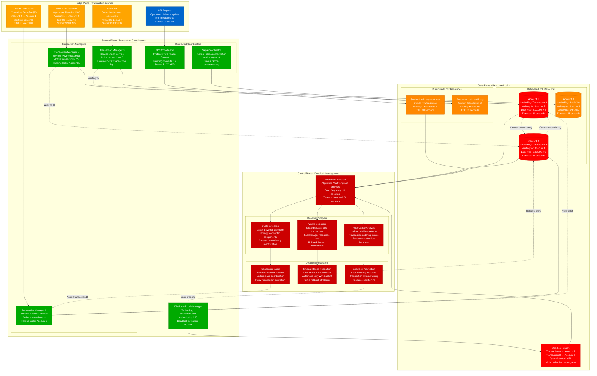

# Distributed Deadlock Detection and Resolution

> **3 AM Emergency Protocol**: Distributed deadlocks can freeze entire transaction systems and bring down multi-service operations. This diagram shows how to detect, analyze, and resolve deadlocks across distributed systems.

## Quick Detection Checklist
- [ ] Monitor hanging transactions: `SELECT * FROM information_schema.innodb_trx WHERE trx_state = 'LOCK WAIT'`
- [ ] Check distributed lock timeouts: Application logs showing lock acquisition failures
- [ ] Watch for circular dependencies: Transaction dependency graphs showing cycles
- [ ] Alert on deadlock frequency: `deadlock_detection_count > baseline * 10`

## Distributed Deadlock Detection and Resolution



## 3 AM Emergency Response Commands

### 1. Deadlock Detection (30 seconds)
```sql
-- MySQL/InnoDB deadlock detection
SHOW ENGINE INNODB STATUS;
SELECT * FROM information_schema.innodb_trx WHERE trx_state = 'LOCK WAIT';
SELECT * FROM information_schema.innodb_locks;
SELECT * FROM information_schema.innodb_lock_waits;

-- PostgreSQL deadlock detection
SELECT blocked_locks.pid AS blocked_pid,
       blocked_activity.usename AS blocked_user,
       blocking_locks.pid AS blocking_pid,
       blocking_activity.usename AS blocking_user,
       blocked_activity.query AS blocked_statement,
       blocking_activity.query AS current_or_recent_statement
FROM pg_catalog.pg_locks blocked_locks
JOIN pg_catalog.pg_stat_activity blocked_activity ON blocked_activity.pid = blocked_locks.pid
JOIN pg_catalog.pg_locks blocking_locks ON blocking_locks.locktype = blocked_locks.locktype
JOIN pg_catalog.pg_stat_activity blocking_activity ON blocking_activity.pid = blocking_locks.pid
WHERE NOT blocked_locks.granted AND blocking_locks.granted;
```

### 2. Emergency Deadlock Breaking (60 seconds)
```bash
# Kill specific deadlocked transactions
# MySQL
mysql -e "KILL [connection_id];"  # From SHOW PROCESSLIST

# PostgreSQL
psql -c "SELECT pg_terminate_backend([blocked_pid]);"

# Application-level distributed lock cleanup
# Redis distributed locks
redis-cli DEL "lock:payment-service:account-1"
redis-cli DEL "lock:account-service:user-123"

# Zookeeper distributed locks
zkCli.sh -server localhost:2181 delete /locks/payment-lock
zkCli.sh -server localhost:2181 delete /locks/audit-lock

# Check for hanging distributed transactions
kubectl logs -l app=transaction-coordinator | grep -E "(deadlock|timeout|abort)"
```

### 3. System-Wide Deadlock Resolution (90 seconds)
```bash
# Restart transaction coordinators if severely deadlocked
kubectl rollout restart deployment transaction-coordinator
kubectl rollout restart deployment payment-service

# Flush all locks and restart critical services
redis-cli FLUSHDB  # WARNING: This removes all Redis data
systemctl restart mysql  # Will abort all transactions
systemctl restart postgresql

# Enable deadlock detection and prevention
mysql -e "SET GLOBAL innodb_deadlock_detect = ON;"
mysql -e "SET GLOBAL innodb_lock_wait_timeout = 10;"  # Reduce wait time

# Scale out to reduce contention
kubectl scale deployment payment-service --replicas=5
kubectl scale deployment account-service --replicas=3
```

## Deadlock Pattern Recognition

### Classic Circular Deadlock
```
Time    Transaction_A         Transaction_B         Lock_Status
10:00   Lock Account 1       -                     A holds Account 1
10:01   -                    Lock Account 2        B holds Account 2
10:02   Wait for Account 2   -                     A waits for B
10:03   -                    Wait for Account 1    B waits for A
10:04   DEADLOCK DETECTED    DEADLOCK DETECTED     Circular dependency
```

### Multi-Resource Deadlock Chain
```
Transaction    Holds           Waits_For       Next_In_Chain
TX_001         Account_1       Account_2       TX_002
TX_002         Account_2       Account_3       TX_003
TX_003         Account_3       Account_4       TX_004
TX_004         Account_4       Account_1       TX_001
Pattern: Resource chain forming cycle
```

### Distributed Service Deadlock
```
Service_A      Service_B       Service_C       Deadlock_Chain
payment-svc    account-svc     audit-svc       A→B→C→A
Holds: Lock_1  Holds: Lock_2   Holds: Lock_3   Circular service dependency
Waits: Lock_2  Waits: Lock_3   Waits: Lock_1   Cross-service deadlock
```

## Error Message Patterns

### MySQL Deadlock Detection
```
ERROR: Deadlock found when trying to get lock; try restarting transaction
PATTERN: "ER_LOCK_DEADLOCK" error code 1213
LOCATION: MySQL error log, application exception logs
ACTION: Retry transaction with exponential backoff
LOG: SHOW ENGINE INNODB STATUS for deadlock details
```

### PostgreSQL Deadlock Detection
```
ERROR: deadlock detected
PATTERN: "DETAIL: Process X waits for ShareLock on transaction Y"
LOCATION: PostgreSQL log files, application error logs
ACTION: Retry transaction, analyze lock acquisition order
COMMAND: SELECT * FROM pg_stat_activity WHERE state = 'active';
```

### Distributed Lock Timeout
```
ERROR: Failed to acquire distributed lock within timeout
PATTERN: Lock acquisition timeout in distributed systems
LOCATION: Application logs, lock manager logs
ACTION: Check lock manager health, increase timeout
MONITORING: Check Zookeeper/etcd connectivity and performance
```

## Deadlock Prevention Strategies

### Lock Ordering Protocol
```python
# Python implementation of ordered lock acquisition
import time
import threading
from typing import List, Any

class OrderedLockManager:
    def __init__(self):
        self.locks = {}
        self.global_lock = threading.Lock()

    def acquire_locks(self, resource_ids: List[str], timeout: float = 30.0) -> bool:
        """Acquire multiple locks in a consistent order to prevent deadlocks"""
        # Sort resource IDs to ensure consistent ordering across all transactions
        sorted_ids = sorted(resource_ids)
        acquired_locks = []
        start_time = time.time()

        try:
            for resource_id in sorted_ids:
                # Check timeout
                if time.time() - start_time > timeout:
                    raise TimeoutError(f"Lock acquisition timeout after {timeout}s")

                # Get or create lock for this resource
                with self.global_lock:
                    if resource_id not in self.locks:
                        self.locks[resource_id] = threading.Lock()
                    lock = self.locks[resource_id]

                # Acquire lock with timeout
                acquired = lock.acquire(timeout=timeout - (time.time() - start_time))
                if not acquired:
                    raise TimeoutError(f"Failed to acquire lock for {resource_id}")

                acquired_locks.append(lock)

            return True

        except (TimeoutError, Exception) as e:
            # Release all acquired locks in reverse order
            for lock in reversed(acquired_locks):
                lock.release()
            return False

    def release_locks(self, resource_ids: List[str]):
        """Release locks in reverse order of acquisition"""
        sorted_ids = sorted(resource_ids, reverse=True)
        for resource_id in sorted_ids:
            if resource_id in self.locks:
                self.locks[resource_id].release()

# Usage example
lock_manager = OrderedLockManager()

def transfer_money(from_account: str, to_account: str, amount: float):
    """Transfer money between accounts with deadlock prevention"""
    accounts = [from_account, to_account]

    if lock_manager.acquire_locks(accounts, timeout=10.0):
        try:
            # Perform transfer operations
            debit_account(from_account, amount)
            credit_account(to_account, amount)
            log_transaction(from_account, to_account, amount)
        finally:
            lock_manager.release_locks(accounts)
    else:
        raise Exception("Failed to acquire locks for transfer")
```

### Timeout-Based Deadlock Resolution
```java
// Java implementation with timeout-based deadlock prevention
public class TimeoutBasedTransactionManager {
    private final Map<String, ReentrantLock> resourceLocks = new ConcurrentHashMap<>();
    private final long defaultTimeoutMs = 30000; // 30 seconds

    public boolean executeTransaction(List<String> resourceIds, Runnable transaction) {
        List<String> sortedIds = resourceIds.stream().sorted().collect(Collectors.toList());
        List<ReentrantLock> acquiredLocks = new ArrayList<>();
        long startTime = System.currentTimeMillis();

        try {
            for (String resourceId : sortedIds) {
                ReentrantLock lock = resourceLocks.computeIfAbsent(resourceId, k -> new ReentrantLock());

                long remainingTimeout = defaultTimeoutMs - (System.currentTimeMillis() - startTime);
                if (remainingTimeout <= 0) {
                    throw new TimeoutException("Transaction timeout before acquiring all locks");
                }

                boolean acquired = lock.tryLock(remainingTimeout, TimeUnit.MILLISECONDS);
                if (!acquired) {
                    throw new TimeoutException("Failed to acquire lock for resource: " + resourceId);
                }

                acquiredLocks.add(lock);
            }

            // Execute transaction with all locks held
            transaction.run();
            return true;

        } catch (InterruptedException | TimeoutException e) {
            // Log deadlock/timeout and prepare for retry
            logger.warn("Transaction failed due to lock timeout: {}", e.getMessage());
            return false;
        } finally {
            // Release locks in reverse order
            Collections.reverse(acquiredLocks);
            acquiredLocks.forEach(ReentrantLock::unlock);
        }
    }

    public void retryTransaction(List<String> resourceIds, Runnable transaction) {
        int maxRetries = 3;
        long baseDelayMs = 100;

        for (int attempt = 1; attempt <= maxRetries; attempt++) {
            if (executeTransaction(resourceIds, transaction)) {
                return; // Success
            }

            if (attempt < maxRetries) {
                try {
                    // Exponential backoff with jitter
                    long delay = baseDelayMs * (1L << (attempt - 1)) +
                                (long) (Math.random() * baseDelayMs);
                    Thread.sleep(delay);
                } catch (InterruptedException e) {
                    Thread.currentThread().interrupt();
                    throw new RuntimeException("Transaction retry interrupted", e);
                }
            }
        }

        throw new RuntimeException("Transaction failed after " + maxRetries + " retries");
    }
}
```

### Distributed Deadlock Detection
```go
// Go implementation of distributed deadlock detection
package main

import (
    "context"
    "fmt"
    "sync"
    "time"
    "github.com/go-redis/redis/v8"
)

type DistributedDeadlockDetector struct {
    redis     *redis.Client
    nodeID    string
    timeout   time.Duration
    detector  *DeadlockGraph
    mu        sync.RWMutex
}

type DeadlockGraph struct {
    waitFor map[string][]string // transaction -> list of resources it waits for
    heldBy  map[string]string   // resource -> transaction that holds it
    mu      sync.RWMutex
}

func NewDistributedDeadlockDetector(redisClient *redis.Client, nodeID string) *DistributedDeadlockDetector {
    return &DistributedDeadlockDetector{
        redis:    redisClient,
        nodeID:   nodeID,
        timeout:  30 * time.Second,
        detector: &DeadlockGraph{
            waitFor: make(map[string][]string),
            heldBy:  make(map[string]string),
        },
    }
}

func (ddd *DistributedDeadlockDetector) AcquireLock(ctx context.Context, txID, resourceID string) error {
    lockKey := fmt.Sprintf("lock:%s", resourceID)
    waitKey := fmt.Sprintf("wait:%s:%s", txID, resourceID)

    // Try to acquire lock
    result := ddd.redis.SetNX(ctx, lockKey, txID, ddd.timeout)
    if result.Val() {
        // Lock acquired successfully
        ddd.updateGraph(txID, resourceID, true)
        return nil
    }

    // Lock not available, register as waiting
    ddd.redis.Set(ctx, waitKey, time.Now().Unix(), ddd.timeout)
    ddd.updateGraph(txID, resourceID, false)

    // Check for deadlock
    if ddd.detectDeadlock(txID) {
        ddd.redis.Del(ctx, waitKey)
        return fmt.Errorf("deadlock detected for transaction %s", txID)
    }

    // Wait for lock with timeout
    ticker := time.NewTicker(1 * time.Second)
    defer ticker.Stop()

    for {
        select {
        case <-ctx.Done():
            ddd.redis.Del(ctx, waitKey)
            return ctx.Err()
        case <-ticker.C:
            // Try to acquire lock again
            result := ddd.redis.SetNX(ctx, lockKey, txID, ddd.timeout)
            if result.Val() {
                ddd.redis.Del(ctx, waitKey)
                ddd.updateGraph(txID, resourceID, true)
                return nil
            }

            // Check for deadlock again
            if ddd.detectDeadlock(txID) {
                ddd.redis.Del(ctx, waitKey)
                return fmt.Errorf("deadlock detected for transaction %s", txID)
            }
        }
    }
}

func (ddd *DistributedDeadlockDetector) detectDeadlock(startTxID string) bool {
    ddd.detector.mu.RLock()
    defer ddd.detector.mu.RUnlock()

    visited := make(map[string]bool)
    recStack := make(map[string]bool)

    return ddd.hasDeadlockCycle(startTxID, visited, recStack)
}

func (ddd *DistributedDeadlockDetector) hasDeadlockCycle(txID string, visited, recStack map[string]bool) bool {
    visited[txID] = true
    recStack[txID] = true

    // Check all resources this transaction is waiting for
    for _, resourceID := range ddd.detector.waitFor[txID] {
        // Find who holds this resource
        if holder, exists := ddd.detector.heldBy[resourceID]; exists && holder != txID {
            if !visited[holder] {
                if ddd.hasDeadlockCycle(holder, visited, recStack) {
                    return true
                }
            } else if recStack[holder] {
                // Found cycle
                return true
            }
        }
    }

    recStack[txID] = false
    return false
}

func (ddd *DistributedDeadlockDetector) updateGraph(txID, resourceID string, acquired bool) {
    ddd.detector.mu.Lock()
    defer ddd.detector.mu.Unlock()

    if acquired {
        // Transaction acquired the resource
        ddd.detector.heldBy[resourceID] = txID
        // Remove from wait list
        if waitList, exists := ddd.detector.waitFor[txID]; exists {
            for i, res := range waitList {
                if res == resourceID {
                    ddd.detector.waitFor[txID] = append(waitList[:i], waitList[i+1:]...)
                    break
                }
            }
        }
    } else {
        // Transaction is waiting for the resource
        ddd.detector.waitFor[txID] = append(ddd.detector.waitFor[txID], resourceID)
    }
}
```

## Deadlock Monitoring and Alerting

### Prometheus Metrics for Deadlock Detection
```yaml
# Prometheus rules for deadlock monitoring
groups:
- name: deadlock_detection
  rules:
  - alert: DatabaseDeadlockSpike
    expr: rate(mysql_global_status_innodb_deadlocks[5m]) > 0.1
    for: 2m
    labels:
      severity: warning
    annotations:
      summary: "High deadlock rate detected"
      description: "Database deadlock rate is {{ $value }} per second"

  - alert: DistributedLockTimeout
    expr: rate(distributed_lock_timeout_total[5m]) > 5
    for: 1m
    labels:
      severity: critical
    annotations:
      summary: "Distributed lock timeouts increasing"
      description: "Distributed lock timeout rate: {{ $value }} per second"

  - alert: TransactionWaitTimeHigh
    expr: histogram_quantile(0.95, rate(transaction_wait_time_seconds_bucket[5m])) > 30
    for: 3m
    labels:
      severity: warning
    annotations:
      summary: "Transaction wait times elevated"
      description: "95th percentile wait time: {{ $value }} seconds"
```

### Deadlock Analysis Dashboard
```json
{
  "dashboard": {
    "title": "Distributed Deadlock Analysis",
    "panels": [
      {
        "title": "Deadlock Detection Rate",
        "type": "graph",
        "targets": [
          {
            "expr": "rate(deadlock_detected_total[5m])",
            "legendFormat": "Deadlocks per second"
          }
        ]
      },
      {
        "title": "Lock Wait Time Distribution",
        "type": "heatmap",
        "targets": [
          {
            "expr": "rate(lock_wait_time_seconds_bucket[5m])",
            "legendFormat": "{{ le }}"
          }
        ]
      },
      {
        "title": "Active Locks by Resource",
        "type": "table",
        "targets": [
          {
            "expr": "sum by (resource) (active_locks)",
            "legendFormat": "{{ resource }}"
          }
        ]
      },
      {
        "title": "Transaction Dependency Graph",
        "type": "node-graph",
        "targets": [
          {
            "expr": "transaction_dependencies",
            "legendFormat": "{{ source }} -> {{ target }}"
          }
        ]
      }
    ]
  }
}
```

## Recovery Procedures

### Phase 1: Immediate Deadlock Breaking (0-2 minutes)
- [ ] Identify deadlocked transactions using database tools
- [ ] Select victim transaction(s) based on cost analysis
- [ ] Abort victim transactions and release their locks
- [ ] Monitor for deadlock resolution

### Phase 2: System Stabilization (2-10 minutes)
- [ ] Analyze deadlock patterns and root causes
- [ ] Adjust lock timeout values if necessary
- [ ] Implement retry logic with exponential backoff
- [ ] Scale services to reduce lock contention

### Phase 3: Prevention Implementation (10+ minutes)
- [ ] Implement lock ordering protocols
- [ ] Deploy timeout-based deadlock prevention
- [ ] Add comprehensive deadlock monitoring
- [ ] Review transaction design for optimization

## Real-World Distributed Deadlock Incidents

### Bank Transfer System Deadlock (2021)
- **Trigger**: Concurrent transfers between same accounts in opposite directions
- **Impact**: Payment processing completely halted for 15 minutes
- **Detection**: Transaction timeout monitoring + user reports
- **Resolution**: Lock ordering implementation + timeout reduction

### E-commerce Inventory Deadlock (2020)
- **Trigger**: Flash sale caused massive concurrent inventory updates
- **Impact**: Order processing blocked, checkout failures
- **Detection**: Database deadlock monitoring + application timeouts
- **Resolution**: Inventory service redesign + optimistic locking

### Microservices Saga Deadlock (2022)
- **Trigger**: Circular dependencies in saga compensation logic
- **Impact**: Order fulfillment stuck in endless compensation loops
- **Detection**: Saga timeout monitoring + manual investigation
- **Resolution**: Saga redesign + dependency breaking + timeout limits

---
*Last Updated: Based on banking, e-commerce, microservices deadlock incidents*
*Next Review: Monitor for new distributed deadlock patterns and prevention strategies*