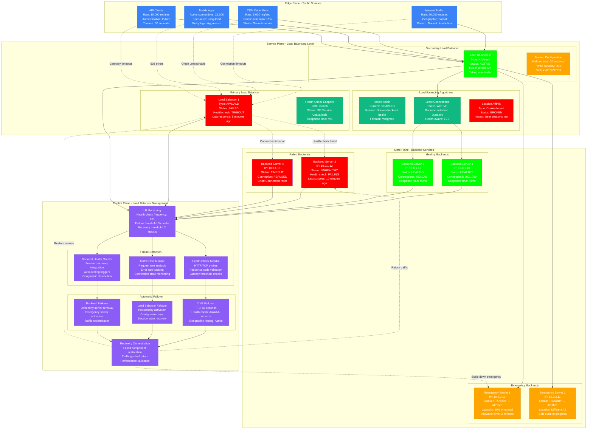

# Load Balancer Failure Emergency Response

> **3 AM Emergency Protocol**: Load balancer failures can cause complete service outages, traffic blackholes, and cascading failures. This diagram shows how to detect, failover, and recover from load balancer failures.

## Quick Detection Checklist
- [ ] Check load balancer health: `curl -I http://lb-health-endpoint/status`
- [ ] Monitor backend connectivity: `netstat -an | grep :80 | grep ESTABLISHED`
- [ ] Verify traffic distribution: Check uneven load patterns across backends
- [ ] Alert on health check failures: `healthy_backends / total_backends < 0.5`

## Load Balancer Failure Detection and Recovery



## 3 AM Emergency Response Commands

### 1. Load Balancer Health Assessment (30 seconds)
```bash
# Check load balancer status
curl -I http://load-balancer-ip/health
dig load-balancer.company.com  # Check DNS resolution

# AWS ALB/NLB status
aws elbv2 describe-load-balancers --names production-alb
aws elbv2 describe-target-health --target-group-arn [target-group-arn]

# HAProxy status
echo "show stat" | socat stdio /var/run/haproxy/admin.sock
echo "show info" | socat stdio /var/run/haproxy/admin.sock

# Nginx status
curl http://load-balancer-ip/nginx_status
nginx -s reload  # If configuration changes needed
```

### 2. Emergency Traffic Rerouting (60 seconds)
```bash
# DNS failover (if using health-checked DNS)
aws route53 change-resource-record-sets --hosted-zone-id Z123456789 --change-batch '{
  "Changes": [{
    "Action": "UPSERT",
    "ResourceRecordSet": {
      "Name": "api.company.com",
      "Type": "A",
      "SetIdentifier": "Primary",
      "Failover": "SECONDARY",
      "TTL": 60,
      "ResourceRecords": [{"Value": "10.0.2.100"}]
    }
  }]
}'

# Update load balancer configuration
# HAProxy - disable failed backends
echo "disable server backend/server3" | socat stdio /var/run/haproxy/admin.sock
echo "enable server emergency/server1" | socat stdio /var/run/haproxy/admin.sock

# Nginx upstream modification
nginx -s reload  # After updating upstream configuration

# Kubernetes service endpoint update
kubectl patch endpoints api-service --type='json' -p='[{"op": "remove", "path": "/subsets/0/addresses/2"}]'
```

### 3. Backend Server Emergency Scaling (90 seconds)
```bash
# Scale up healthy backends
kubectl scale deployment api-service --replicas=8
aws autoscaling update-auto-scaling-group --auto-scaling-group-name api-asg --desired-capacity 6

# Activate standby servers
aws ec2 start-instances --instance-ids i-emergency1 i-emergency2
docker run -d --name emergency-backend api-service:latest

# Update load balancer to include emergency backends
aws elbv2 register-targets --target-group-arn [arn] --targets Id=i-emergency1,Port=80

# Direct traffic bypass (emergency)
kubectl port-forward svc/api-service 8080:80 &  # Temporary direct access
iptables -t nat -A OUTPUT -p tcp --dport 80 -j REDIRECT --to-port 8080
```

## Load Balancer Failure Patterns

### Gradual Backend Degradation
```
Time    Backend_1    Backend_2    Backend_3    Backend_4    LB_Status
10:00   HEALTHY      HEALTHY      HEALTHY      HEALTHY      Normal (100%)
10:15   HEALTHY      HEALTHY      DEGRADED     HEALTHY      Warning (75%)
10:30   HEALTHY      TIMEOUT      FAILED       HEALTHY      Critical (50%)
10:45   OVERLOADED   FAILED       FAILED       FAILED       Emergency (25%)
11:00   FAILED       FAILED       FAILED       FAILED       OUTAGE (0%)
```

### Load Balancer Cascading Failure
```
Component         Status       Impact                    Recovery_Time
Primary ALB       FAILED       100% traffic loss         15 minutes
DNS Failover      TRIGGERED    Switching to backup       2 minutes
Secondary LB      ACTIVE       80% capacity available    Immediate
Backend Servers   OVERLOADED   Response time 10x         5 minutes
Emergency Nodes   SCALING      Additional capacity       3 minutes
```

### Session Affinity Breakdown
```
Time    Session_Store    Sticky_Sessions    User_Impact    Mitigation
10:00   HEALTHY         100% working       None           Normal ops
10:01   DEGRADED        75% working        Login loops    Session backup
10:02   FAILED          0% working         Mass logouts   Stateless mode
10:03   RECOVERING      25% working        Partial        Gradual restore
10:05   HEALTHY         100% working       Resolved       Full recovery
```

## Error Message Patterns

### Load Balancer Connection Refused
```
ERROR: Connection refused to load balancer
PATTERN: "Connection refused" or "No route to host"
LOCATION: Client application logs, connection metrics
CAUSE: Load balancer service down, network partition
ACTION: Activate backup load balancer, check network connectivity
```

### Backend Health Check Failures
```
ERROR: Backend health check failed
PATTERN: "Health check returned HTTP 503" or timeout
LOCATION: Load balancer logs, health check metrics
CAUSE: Backend service degradation, resource exhaustion
ACTION: Remove unhealthy backends, scale healthy ones
```

### Session Affinity Failures
```
ERROR: Session affinity broken - user session lost
PATTERN: Users redirected to different backend losing session
LOCATION: Application session logs, user experience metrics
CAUSE: Backend failure with sticky sessions
ACTION: Implement session replication or stateless design
```

## Load Balancer Configuration Optimization

### HAProxy High Availability Configuration
```haproxy
# /etc/haproxy/haproxy.cfg - Emergency configuration
global
    daemon
    maxconn 20000
    stats socket /var/run/haproxy/admin.sock mode 660
    stats timeout 30s

defaults
    mode http
    timeout connect 5000ms
    timeout client 50000ms
    timeout server 50000ms
    option httplog
    retries 3
    option redispatch

# Health check configuration
backend api_servers
    balance leastconn
    option httpchk GET /health HTTP/1.1\r\nHost:\ api.company.com
    http-check expect status 200

    # Primary backends
    server api1 10.0.1.10:80 check inter 10s fall 3 rise 2 weight 100
    server api2 10.0.1.11:80 check inter 10s fall 3 rise 2 weight 100

    # Emergency backends (lower weight)
    server emergency1 10.0.2.10:80 check inter 10s fall 3 rise 2 weight 50 backup
    server emergency2 10.0.2.11:80 check inter 10s fall 3 rise 2 weight 50 backup

# Frontend with failover
frontend api_frontend
    bind *:80
    bind *:443 ssl crt /etc/ssl/certs/api.pem

    # Health check endpoint
    acl health_check path /haproxy-health
    use_backend health_backend if health_check

    default_backend api_servers

backend health_backend
    http-request return status 200 content-type text/plain string "OK"

# Stats interface for monitoring
listen stats
    bind *:8404
    stats enable
    stats uri /stats
    stats refresh 30s
    stats admin if TRUE
```

### Nginx Load Balancer with Failover
```nginx
# /etc/nginx/nginx.conf - Emergency configuration
upstream api_backend {
    least_conn;

    # Primary servers
    server 10.0.1.10:80 max_fails=3 fail_timeout=30s weight=3;
    server 10.0.1.11:80 max_fails=3 fail_timeout=30s weight=3;

    # Emergency servers (backup)
    server 10.0.2.10:80 max_fails=2 fail_timeout=20s weight=1 backup;
    server 10.0.2.11:80 max_fails=2 fail_timeout=20s weight=1 backup;

    # Health check
    keepalive 16;
}

server {
    listen 80;
    listen 443 ssl http2;
    server_name api.company.com;

    # Health check endpoint
    location /nginx-health {
        access_log off;
        return 200 "OK\n";
        add_header Content-Type text/plain;
    }

    # Main API traffic
    location / {
        proxy_pass http://api_backend;
        proxy_set_header Host $host;
        proxy_set_header X-Real-IP $remote_addr;
        proxy_set_header X-Forwarded-For $proxy_add_x_forwarded_for;
        proxy_set_header X-Forwarded-Proto $scheme;

        # Health check configuration
        proxy_connect_timeout 5s;
        proxy_send_timeout 10s;
        proxy_read_timeout 10s;

        # Retry logic
        proxy_next_upstream error timeout invalid_header http_500 http_502 http_503;
        proxy_next_upstream_tries 3;
        proxy_next_upstream_timeout 10s;
    }

    # Real-time status
    location /nginx_status {
        stub_status on;
        access_log off;
        allow 10.0.0.0/8;
        deny all;
    }
}
```

### Kubernetes Ingress with Multiple Controllers
```yaml
# Multi-controller ingress for high availability
apiVersion: networking.k8s.io/v1
kind: Ingress
metadata:
  name: api-ingress-primary
  annotations:
    kubernetes.io/ingress.class: "nginx-primary"
    nginx.ingress.kubernetes.io/upstream-fail-timeout: "30"
    nginx.ingress.kubernetes.io/upstream-max-fails: "3"
    nginx.ingress.kubernetes.io/proxy-next-upstream: "error timeout invalid_header http_500 http_502 http_503"
spec:
  rules:
  - host: api.company.com
    http:
      paths:
      - path: /
        pathType: Prefix
        backend:
          service:
            name: api-service
            port:
              number: 80
---
# Backup ingress controller
apiVersion: networking.k8s.io/v1
kind: Ingress
metadata:
  name: api-ingress-backup
  annotations:
    kubernetes.io/ingress.class: "nginx-backup"
    nginx.ingress.kubernetes.io/upstream-fail-timeout: "20"
    nginx.ingress.kubernetes.io/upstream-max-fails: "2"
spec:
  rules:
  - host: api-backup.company.com
    http:
      paths:
      - path: /
        pathType: Prefix
        backend:
          service:
            name: api-service-emergency
            port:
              number: 80
```

## Monitoring and Alerting for Load Balancers

### Prometheus Load Balancer Metrics
```yaml
# Prometheus rules for load balancer monitoring
groups:
- name: load_balancer_health
  rules:
  - alert: LoadBalancerDown
    expr: up{job="haproxy"} == 0
    for: 1m
    labels:
      severity: critical
    annotations:
      summary: "Load balancer is down"
      description: "Load balancer {{ $labels.instance }} has been down for more than 1 minute"

  - alert: BackendHealthLow
    expr: (sum(haproxy_server_up) / count(haproxy_server_up)) < 0.5
    for: 2m
    labels:
      severity: critical
    annotations:
      summary: "Less than 50% backends healthy"
      description: "Only {{ $value | humanizePercentage }} of backends are healthy"

  - alert: LoadBalancerHighLatency
    expr: histogram_quantile(0.95, rate(haproxy_http_request_duration_seconds_bucket[5m])) > 2
    for: 5m
    labels:
      severity: warning
    annotations:
      summary: "Load balancer high latency"
      description: "95th percentile latency is {{ $value }}s"

  - alert: LoadBalancerErrorRate
    expr: rate(haproxy_server_http_responses_total{code=~"5.."}[5m]) / rate(haproxy_server_http_responses_total[5m]) > 0.05
    for: 2m
    labels:
      severity: critical
    annotations:
      summary: "High error rate through load balancer"
      description: "Error rate is {{ $value | humanizePercentage }}"
```

### Health Check Automation
```python
# Python health check and failover automation
import requests
import time
import boto3
import logging
from typing import List, Dict

class LoadBalancerMonitor:
    def __init__(self, primary_lb: str, backup_lb: str, backends: List[str]):
        self.primary_lb = primary_lb
        self.backup_lb = backup_lb
        self.backends = backends
        self.route53 = boto3.client('route53')
        self.current_lb = primary_lb
        self.failure_count = 0
        self.failure_threshold = 3

    def check_load_balancer_health(self, lb_url: str) -> bool:
        """Check if load balancer is responding to health checks"""
        try:
            response = requests.get(f"http://{lb_url}/health", timeout=5)
            return response.status_code == 200
        except Exception as e:
            logging.error(f"Load balancer health check failed: {e}")
            return False

    def check_backend_health(self, backend_url: str) -> bool:
        """Direct backend health check"""
        try:
            response = requests.get(f"http://{backend_url}/health", timeout=3)
            return response.status_code == 200
        except Exception as e:
            logging.error(f"Backend health check failed: {e}")
            return False

    def get_healthy_backend_count(self) -> int:
        """Count healthy backends"""
        healthy_count = 0
        for backend in self.backends:
            if self.check_backend_health(backend):
                healthy_count += 1
        return healthy_count

    def failover_to_backup(self):
        """Failover DNS to backup load balancer"""
        try:
            response = self.route53.change_resource_record_sets(
                HostedZoneId='Z123456789',
                ChangeBatch={
                    'Changes': [{
                        'Action': 'UPSERT',
                        'ResourceRecordSet': {
                            'Name': 'api.company.com',
                            'Type': 'A',
                            'TTL': 60,
                            'ResourceRecords': [{'Value': self.backup_lb}]
                        }
                    }]
                }
            )
            self.current_lb = self.backup_lb
            logging.info(f"Failover completed to backup LB: {self.backup_lb}")
            return True
        except Exception as e:
            logging.error(f"Failover failed: {e}")
            return False

    def monitor_and_failover(self):
        """Main monitoring loop with automatic failover"""
        while True:
            try:
                # Check primary load balancer
                if self.current_lb == self.primary_lb:
                    if not self.check_load_balancer_health(self.primary_lb):
                        self.failure_count += 1
                        logging.warning(f"Primary LB failed check {self.failure_count}/{self.failure_threshold}")

                        if self.failure_count >= self.failure_threshold:
                            logging.critical("Primary LB failure threshold reached, initiating failover")
                            self.failover_to_backup()
                    else:
                        self.failure_count = 0  # Reset on successful check

                # Check backend health regardless of current LB
                healthy_backends = self.get_healthy_backend_count()
                total_backends = len(self.backends)
                health_ratio = healthy_backends / total_backends

                if health_ratio < 0.5:
                    logging.critical(f"Only {healthy_backends}/{total_backends} backends healthy")
                    # Trigger emergency scaling here
                    self.trigger_emergency_scaling()

                logging.info(f"Health check: LB={self.current_lb}, Backends={healthy_backends}/{total_backends}")
                time.sleep(30)  # Check every 30 seconds

            except Exception as e:
                logging.error(f"Monitor loop error: {e}")
                time.sleep(10)

    def trigger_emergency_scaling(self):
        """Trigger emergency backend scaling"""
        # This would integrate with your auto-scaling system
        logging.info("Triggering emergency backend scaling")
        # Example: Scale ASG, start emergency instances, etc.

# Usage
monitor = LoadBalancerMonitor(
    primary_lb="10.0.1.100",
    backup_lb="10.0.2.100",
    backends=["10.0.1.10", "10.0.1.11", "10.0.1.12", "10.0.1.13"]
)

monitor.monitor_and_failover()
```

## Recovery Procedures

### Phase 1: Immediate Traffic Preservation (0-2 minutes)
- [ ] Verify backup load balancer is receiving traffic
- [ ] Check DNS propagation and client failover
- [ ] Monitor error rates and response times
- [ ] Activate emergency backend capacity if needed

### Phase 2: Root Cause Investigation (2-15 minutes)
- [ ] Analyze primary load balancer failure logs
- [ ] Check infrastructure dependencies (network, power)
- [ ] Verify backend server health and capacity
- [ ] Assess if failure was isolated or systemic

### Phase 3: Service Restoration (15+ minutes)
- [ ] Restore primary load balancer service
- [ ] Gradually shift traffic back to primary
- [ ] Validate session handling and sticky sessions
- [ ] Scale down emergency resources

## Real-World Load Balancer Incidents

### AWS ALB Mass Failure (2020)
- **Trigger**: Control plane issue affected multiple ALBs across region
- **Impact**: Widespread outages for services using ALB
- **Detection**: CloudWatch health check failures + customer reports
- **Resolution**: Failover to NLB + ALB service restoration

### Cloudflare Load Balancer CPU Exhaustion (2019)
- **Trigger**: DDoS attack overwhelmed load balancer CPU capacity
- **Impact**: Request drops and increased latency globally
- **Detection**: Load balancer CPU metrics + traffic analysis
- **Resolution**: Additional capacity + DDoS mitigation

### Netflix Zuul Gateway Cascade Failure (2018)
- **Trigger**: Backend service slowdown caused Zuul thread exhaustion
- **Impact**: API gateway became unresponsive, blocking all traffic
- **Detection**: Thread pool exhaustion metrics + circuit breaker activation
- **Resolution**: Circuit breaker tuning + backend service optimization

---
*Last Updated: Based on AWS ALB, Cloudflare, Netflix load balancer incidents*
*Next Review: Monitor for new load balancer failure patterns and recovery strategies*