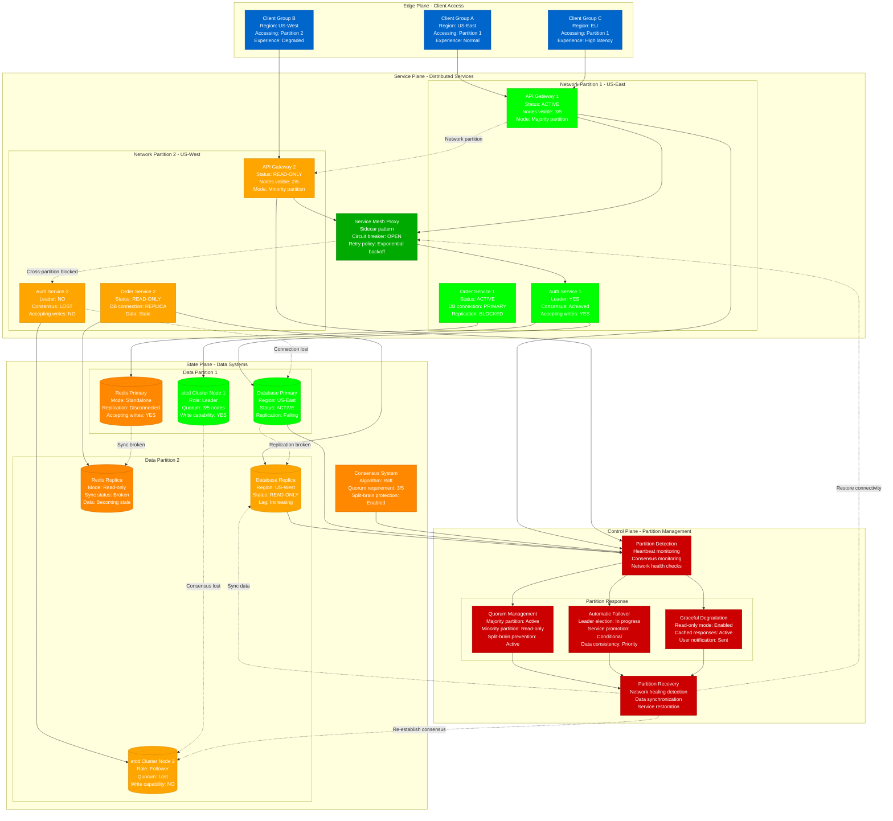

# Network Partition Handling Emergency Response

> **3 AM Emergency Protocol**: Network partitions can split distributed systems, causing data inconsistency and service degradation. This diagram shows how to detect, handle, and recover from network partitions.

## Quick Detection Checklist
- [ ] Check cluster connectivity: `kubectl get nodes` and cluster member status
- [ ] Monitor inter-service communication: `ping` and `telnet` between critical services
- [ ] Verify consensus systems: Raft/Paxos leader election status
- [ ] Alert on partition detection: Split-brain scenarios and isolated nodes

## Network Partition Detection and Handling



## 3 AM Emergency Response Commands

### 1. Partition Detection (30 seconds)
```bash
# Check network connectivity between nodes
ping -c 3 node-east-1
ping -c 3 node-west-1
telnet node-east-1 2379  # etcd port
telnet node-west-1 6443  # Kubernetes API

# Check cluster member status
kubectl get nodes -o wide
etcdctl --endpoints=node1:2379,node2:2379,node3:2379 member list
consul members  # If using Consul

# Check service mesh connectivity
istioctl proxy-status
kubectl get vs,dr -A  # Virtual services and destination rules
```

### 2. Quorum and Leadership Assessment (60 seconds)
```bash
# Check etcd cluster quorum
etcdctl --endpoints=all endpoint status --write-out=table
etcdctl --endpoints=all endpoint health

# Verify Kubernetes control plane
kubectl get componentstatuses
kubectl cluster-info

# Check consensus system status (Raft/Paxos)
# For database clusters:
mysql -e "SHOW REPLICA STATUS;" | grep "Slave_IO_Running\|Slave_SQL_Running"
# For PostgreSQL:
psql -c "SELECT client_addr, state, sync_state FROM pg_stat_replication;"
```

### 3. Emergency Partition Handling (90 seconds)
```bash
# Force quorum if minority partition needs to be active
# WARNING: Only if you're sure about data consistency
etcdctl member remove [minority-member-id]

# Enable read-only mode for minority partition
kubectl patch deployment api-service -p '{"spec":{"template":{"metadata":{"annotations":{"partition-mode":"read-only"}}}}}'

# Route traffic to majority partition
kubectl patch service api-service -p '{"spec":{"selector":{"partition":"majority"}}}'

# Enable graceful degradation
kubectl apply -f - <<EOF
apiVersion: networking.istio.io/v1beta1
kind: VirtualService
metadata:
  name: partition-routing
spec:
  http:
  - match:
    - headers:
        x-partition:
          exact: minority
    fault:
      delay:
        percentage:
          value: 100
        fixedDelay: 5s
    route:
    - destination:
        host: api-service
        subset: read-only
EOF
```

## Partition Detection Patterns

### Network Connectivity Matrix
```
Source\Target    Node1    Node2    Node3    Node4    Node5    Status
Node1 (East)     ✓        ✓        ✓        ✗        ✗        Partition detected
Node2 (East)     ✓        ✓        ✓        ✗        ✗        Majority partition
Node3 (East)     ✓        ✓        ✓        ✗        ✗        Active
Node4 (West)     ✗        ✗        ✗        ✓        ✓        Minority partition
Node5 (West)     ✗        ✗        ✗        ✓        ✓        Read-only mode
```

### Consensus System Behavior
```
Time    Partition_State    Leader    Quorum    Write_Capability
10:00   Healthy           Node1     5/5       All nodes
10:01   Split detected    Node1     3/5       Majority only
10:02   Minority isolated Node1     3/5       Majority only
10:03   Failover needed   Node1     3/5       Majority only
10:04   Recovery started  Node1     5/5       All nodes
```

### Service Degradation Levels
```
Partition_Size    Service_Level         Read_Ops    Write_Ops    Consistency
3/5 (Majority)    Full functionality    ✓           ✓            Strong
2/5 (Minority)    Read-only mode        ✓           ✗            Eventual
1/5 (Isolated)    Cached responses      Limited     ✗            Stale
0/5 (Total loss)  Emergency fallback    Emergency   ✗            Unknown
```

## Error Message Patterns

### etcd Partition Errors
```
ERROR: etcdserver: no leader
PATTERN: "lost the tcp streaming connection"
LOCATION: etcd logs, Kubernetes control plane logs
ACTION: Check network connectivity, verify quorum
COMMAND: etcdctl endpoint status --write-out=table
```

### Database Replication Failures
```
ERROR: MySQL replication broken due to network partition
PATTERN: "Slave_IO_Running: No" in SHOW REPLICA STATUS
LOCATION: MySQL error logs, replication status
ACTION: Check network, consider promoting replica
COMMAND: mysql -e "SHOW REPLICA STATUS\G" | grep Running
```

### Service Mesh Circuit Breaker
```
ERROR: Circuit breaker OPEN due to network partition
PATTERN: "upstream connect error or disconnect/reset before headers"
LOCATION: Envoy proxy logs, service mesh metrics
ACTION: Check connectivity, adjust circuit breaker thresholds
MONITORING: istioctl proxy-config cluster [pod]
```

## Partition-Tolerant Architecture Patterns

### CAP Theorem Considerations
```yaml
# Service configuration for partition tolerance
apiVersion: v1
kind: ConfigMap
metadata:
  name: service-config
data:
  # Choose consistency over availability during partitions
  partition_mode: "cp"  # or "ap" for availability over consistency

  # Quorum requirements
  read_quorum: "2"      # Minimum nodes for read operations
  write_quorum: "3"     # Minimum nodes for write operations

  # Timeout configurations
  network_timeout: "5s"
  consensus_timeout: "10s"
  partition_detection_interval: "30s"
```

### Graceful Degradation Strategy
```python
# Python service with partition awareness
import asyncio
import time
from enum import Enum

class PartitionMode(Enum):
    NORMAL = "normal"
    MAJORITY = "majority"
    MINORITY = "minority"
    ISOLATED = "isolated"

class PartitionAwareService:
    def __init__(self):
        self.partition_mode = PartitionMode.NORMAL
        self.last_heartbeat = {}
        self.quorum_size = 3
        self.total_nodes = 5

    async def detect_partition(self):
        """Detect network partition based on heartbeats"""
        current_time = time.time()
        healthy_nodes = 0

        for node, last_seen in self.last_heartbeat.items():
            if current_time - last_seen < 30:  # 30 second timeout
                healthy_nodes += 1

        if healthy_nodes >= self.quorum_size:
            self.partition_mode = PartitionMode.MAJORITY
        elif healthy_nodes >= 2:
            self.partition_mode = PartitionMode.MINORITY
        elif healthy_nodes >= 1:
            self.partition_mode = PartitionMode.ISOLATED
        else:
            # Total isolation - should not happen
            self.partition_mode = PartitionMode.ISOLATED

    async def handle_read_request(self, request):
        """Handle read requests based on partition mode"""
        if self.partition_mode in [PartitionMode.NORMAL, PartitionMode.MAJORITY]:
            # Full read capability
            return await self.read_from_database(request)
        elif self.partition_mode == PartitionMode.MINORITY:
            # Read from local cache or replica
            return await self.read_from_cache(request)
        else:
            # Return stale data with warning
            return await self.read_stale_data(request)

    async def handle_write_request(self, request):
        """Handle write requests based on partition mode"""
        if self.partition_mode in [PartitionMode.NORMAL, PartitionMode.MAJORITY]:
            # Full write capability
            return await self.write_to_database(request)
        else:
            # Reject writes or queue for later
            raise Exception("Write operations not available during partition")
```

### Circuit Breaker for Cross-Partition Calls
```yaml
# Istio DestinationRule with circuit breaker
apiVersion: networking.istio.io/v1beta1
kind: DestinationRule
metadata:
  name: partition-aware-circuit-breaker
spec:
  host: cross-partition-service
  trafficPolicy:
    connectionPool:
      tcp:
        maxConnections: 10
      http:
        http1MaxPendingRequests: 20
        http2MaxRequests: 100
        maxRequestsPerConnection: 2
        maxRetries: 3
        consecutiveGatewayErrors: 5
    circuitBreaker:
      consecutive5xxErrors: 3
      consecutiveGatewayErrors: 3
      interval: 30s
      baseEjectionTime: 30s
      maxEjectionPercent: 50
      minHealthPercent: 50
```

## Consensus Algorithm Implementation

### Raft Leader Election During Partition
```go
// Go implementation of Raft partition handling
type RaftNode struct {
    ID           int
    State        NodeState
    CurrentTerm  int
    VotedFor     int
    Log          []LogEntry
    CommitIndex  int
    LastApplied  int
    Peers        []Peer
    PartitionMode PartitionMode
}

func (rn *RaftNode) StartElection() {
    // Only start election if we can reach majority
    reachablePeers := rn.countReachablePeers()

    if reachablePeers < len(rn.Peers)/2 {
        log.Printf("Cannot start election: insufficient reachable peers (%d/%d)",
                   reachablePeers, len(rn.Peers))
        rn.State = Follower
        rn.PartitionMode = MinorityPartition
        return
    }

    rn.CurrentTerm++
    rn.State = Candidate
    rn.VotedFor = rn.ID
    rn.PartitionMode = MajorityPartition

    // Send RequestVote RPCs to all reachable peers
    for _, peer := range rn.Peers {
        if rn.isPeerReachable(peer) {
            go rn.sendRequestVote(peer)
        }
    }
}

func (rn *RaftNode) handlePartitionRecovery() {
    // When partition heals, synchronize state
    if rn.PartitionMode == MinorityPartition {
        // Step down if we were in minority
        rn.State = Follower
        rn.VotedFor = -1

        // Synchronize log with majority
        go rn.synchronizeWithMajority()
    }

    rn.PartitionMode = Healthy
}
```

## Partition Recovery Procedures

### Phase 1: Partition Detection (0-2 minutes)
- [ ] Verify network connectivity between all nodes
- [ ] Check consensus system quorum status
- [ ] Identify majority and minority partitions
- [ ] Enable appropriate degradation modes

### Phase 2: Service Continuation (2-10 minutes)
- [ ] Route traffic to majority partition
- [ ] Enable read-only mode for minority partition
- [ ] Activate circuit breakers for cross-partition calls
- [ ] Monitor data consistency and user impact

### Phase 3: Network Recovery (10+ minutes)
- [ ] Restore network connectivity between partitions
- [ ] Synchronize data between partitions
- [ ] Re-establish consensus system quorum
- [ ] Gradually restore full service functionality

## Data Consistency During Partitions

### Vector Clocks for Conflict Resolution
```python
# Vector clock implementation for partition tolerance
class VectorClock:
    def __init__(self, node_id, num_nodes):
        self.node_id = node_id
        self.clock = [0] * num_nodes

    def tick(self):
        """Increment local clock"""
        self.clock[self.node_id] += 1

    def update(self, other_clock):
        """Update clock with received timestamp"""
        for i in range(len(self.clock)):
            self.clock[i] = max(self.clock[i], other_clock.clock[i])
        self.tick()

    def compare(self, other):
        """Compare vector clocks for causality"""
        less_than = all(a <= b for a, b in zip(self.clock, other.clock))
        greater_than = all(a >= b for a, b in zip(self.clock, other.clock))

        if less_than and not greater_than:
            return "before"
        elif greater_than and not less_than:
            return "after"
        else:
            return "concurrent"

# Usage in distributed service
class PartitionTolerantDatabase:
    def __init__(self, node_id, num_nodes):
        self.vector_clock = VectorClock(node_id, num_nodes)
        self.data = {}
        self.conflict_resolver = ConflictResolver()

    def write(self, key, value):
        self.vector_clock.tick()
        timestamp = self.vector_clock.clock.copy()
        self.data[key] = {
            'value': value,
            'timestamp': timestamp,
            'node': self.vector_clock.node_id
        }

    def resolve_conflicts(self, local_data, remote_data):
        """Resolve conflicts when partitions merge"""
        local_clock = VectorClock(0, len(local_data['timestamp']))
        local_clock.clock = local_data['timestamp']

        remote_clock = VectorClock(0, len(remote_data['timestamp']))
        remote_clock.clock = remote_data['timestamp']

        comparison = local_clock.compare(remote_clock)

        if comparison == "after":
            return local_data
        elif comparison == "before":
            return remote_data
        else:
            # Concurrent updates - use conflict resolution strategy
            return self.conflict_resolver.resolve(local_data, remote_data)
```

## Real-World Network Partition Incidents

### AWS DynamoDB Global Tables Partition (2020)
- **Trigger**: Submarine cable cut between US and EU regions
- **Impact**: Global Tables couldn't sync, eventual consistency delayed
- **Detection**: Replication lag monitoring + network connectivity checks
- **Resolution**: Traffic routed within regions, manual sync after repair

### MongoDB Replica Set Split (2019)
- **Trigger**: Network configuration change isolated primary
- **Impact**: New primary elected, old primary became secondary
- **Detection**: Replica set status monitoring + application errors
- **Resolution**: Network restoration + manual data reconciliation

### Kafka Partition Leader Election Failure (2021)
- **Trigger**: Network partition isolated majority of brokers
- **Impact**: Topics became unavailable, producers couldn't write
- **Detection**: Broker connectivity monitoring + partition leader status
- **Resolution**: Network restoration + ISR (In-Sync Replica) rebuilding

---
*Last Updated: Based on AWS DynamoDB, MongoDB, Kafka partition incidents*
*Next Review: Monitor for new partition tolerance patterns and consensus algorithms*