# Robinhood GameStop Trading Crisis - January 28, 2021 - Incident Anatomy

## Incident Overview

**Date**: January 28, 2021
**Duration**: 24 hours of trading restrictions, with lasting impact for weeks
**Impact**: Trading halt on meme stocks affecting millions of retail investors
**Revenue Loss**: ~$500M (legal costs, customer exodus, regulatory fines)
**Root Cause**: Clearinghouse capital requirements overwhelmed liquidity during extreme volatility
**Scope**: US retail trading platform - 13 million users affected
**MTTR**: 24 hours (trading restrictions lifted gradually)
**MTTD**: 2 hours (clearing firm margin call notification)
**RTO**: N/A (business decision vs technical issue)
**RPO**: 0 (no data loss, trading access restriction only)

## Incident Timeline & Response Flow

```mermaid
graph TB
    subgraph Detection[T+0: Crisis Detection - January 28, 2021]
        style Detection fill:#FFE5E5,stroke:#8B5CF6,color:#000

        Start[January 28 03:30<br/>━━━━━<br/>NSCC Margin Call<br/>$3B clearinghouse deposit<br/>GME volatility extreme<br/>10x normal requirement]

        Alert1[January 28 06:00<br/>━━━━━<br/>Liquidity Crisis<br/>Available cash: $700M<br/>Required deposit: $3B<br/>Gap: $2.3B shortfall]

        Alert2[January 28 08:30<br/>━━━━━<br/>Trading Platform Decision<br/>Restrict buy orders<br/>Meme stocks only<br/>Emergency measure]
    end

    subgraph BusinessCrisis[T+2hr: Business Crisis]
        style BusinessCrisis fill:#FFF5E5,stroke:#F59E0B,color:#000

        TradingHalt[January 28 09:30<br/>━━━━━<br/>Trading Restrictions Live<br/>GME, AMC, NOK, BB<br/>Buy orders blocked<br/>Sell only mode]

        PublicOutrage[January 28 10:00<br/>━━━━━<br/>Social Media Explosion<br/>#RobinHood trending<br/>Accusations of market manipulation<br/>Congressional attention]

        CustomerExodus[January 28 12:00<br/>━━━━━<br/>Mass Customer Exodus<br/>Account deletion requests<br/>App store review bombing<br/>1-star ratings flood]
    end

    subgraph LegalCrisis[T+4hr: Legal & Regulatory Crisis]
        style LegalCrisis fill:#FFFFE5,stroke:#CCCC00,color:#000

        RegulatoryScrutiny[January 28 14:00<br/>━━━━━<br/>Regulatory Investigation<br/>SEC inquiry launched<br/>FINRA review initiated<br/>Congressional hearings called]

        ClassActionLawsuits[January 28 16:00<br/>━━━━━<br/>Legal Actions Begin<br/>Multiple class action suits<br/>Market manipulation claims<br/>Damages in billions]

        MediaCoverage[January 28 18:00<br/>━━━━━<br/>Global Media Coverage<br/>Front page news<br/>CEO testimonial requests<br/>Crisis communications mode]
    end

    subgraph Recovery[T+12hr: Recovery Attempts]
        style Recovery fill:#E5FFE5,stroke:#10B981,color:#000

        FundraisingUrgent[January 28 22:00<br/>━━━━━<br/>Emergency Fundraising<br/>$1B credit line secured<br/>Additional $2.4B raised<br/>Liquidity restored]

        GradualRestore[January 29 09:30<br/>━━━━━<br/>Gradual Trading Restoration<br/>Limited buy orders<br/>Position limits imposed<br/>Monitoring volatility]

        DamageControl[February 1<br/>━━━━━<br/>Damage Control Mode<br/>CEO testimony prep<br/>Customer retention efforts<br/>Platform stability focus]
    end

    %% Trading Platform Impact
    subgraph TradingImpact[Trading Platform Impact]
        style TradingImpact fill:#F0F0F0,stroke:#666666,color:#000

        MemeStocks[Restricted Stocks<br/>━━━━━<br/>❌ GameStop (GME): $483 → $193<br/>❌ AMC Entertainment<br/>❌ Nokia (NOK)<br/>❌ BlackBerry (BB)]

        TradingVolume[Trading Volume Impact<br/>━━━━━<br/>❌ Normal: 4M trades/day<br/>❌ Jan 27: 50M trades/day<br/>❌ Jan 28: 15M trades (restricted)<br/>❌ Revenue loss: $25M/day]

        UserExperience[User Experience<br/>━━━━━<br/>❌ Buy button removed<br/>❌ Error messages<br/>❌ App crashes<br/>❌ Customer service overwhelmed]

        MarketMaking[Market Making<br/>━━━━━<br/>❌ Citadel Securities impact<br/>❌ Payment for order flow<br/>❌ Execution quality<br/>❌ Price discovery issues]
    end

    %% Financial System Impact
    subgraph FinancialSystem[Financial System Impact]
        style FinancialSystem fill:#FFE0E0,stroke:#7C3AED,color:#000

        ClearingSystem[Clearing & Settlement<br/>━━━━━<br/>💰 NSCC margin requirements<br/>💰 T+2 settlement risk<br/>💰 Systemic risk concerns<br/>💰 Capital adequacy stress]

        RetailTrading[Retail Trading Ecosystem<br/>━━━━━<br/>⚠️ TD Ameritrade restrictions<br/>⚠️ E*TRADE limitations<br/>⚠️ Webull temporary halt<br/>⚠️ Market access concerns]

        InstitutionalImpact[Institutional Impact<br/>━━━━━<br/>🔥 Hedge fund losses: $13B<br/>🔥 Melvin Capital bailout<br/>🔥 Short squeeze cascade<br/>🔥 Risk management failures]

        RegulatoryResponse[Regulatory Response<br/>━━━━━<br/>🏛️ SEC investigation<br/>🏛️ Congressional hearings<br/>🏛️ FINRA oversight<br/>🏛️ Market structure review]
    end

    %% Technology Infrastructure Stress
    subgraph TechStress[Technology Infrastructure Stress]
        style TechStress fill:#F0F0F0,stroke:#666666,color:#000

        AppPerformance[App Performance<br/>━━━━━<br/>📱 10x normal traffic<br/>📱 Latency spikes<br/>📱 Connection timeouts<br/>📱 Order execution delays]

        DatabaseLoad[Database Systems<br/>━━━━━<br/>🔥 Order processing: overloaded<br/>🔥 Account queries: slow<br/>🔥 Real-time quotes: lagged<br/>🔥 Transaction logs: behind]

        APILimits[API & Integration<br/>━━━━━<br/>⚠️ Market data feeds<br/>⚠️ Clearing firm APIs<br/>⚠️ Bank integration stress<br/>⚠️ Third-party services]
    end

    %% Flow connections
    Start --> Alert1
    Alert1 --> Alert2
    Alert2 --> TradingHalt
    TradingHalt --> PublicOutrage
    PublicOutrage --> CustomerExodus
    CustomerExodus --> RegulatoryScrutiny
    RegulatoryScrutiny --> ClassActionLawsuits
    ClassActionLawsuits --> MediaCoverage
    MediaCoverage --> FundraisingUrgent
    FundraisingUrgent --> GradualRestore
    GradualRestore --> DamageControl

    %% Impact connections
    TradingHalt -.-> MemeStocks
    TradingHalt -.-> TradingVolume
    TradingHalt -.-> UserExperience
    TradingHalt -.-> MarketMaking
    Alert1 -.-> ClearingSystem
    PublicOutrage -.-> RetailTrading
    RegulatoryScrutiny -.-> InstitutionalImpact
    ClassActionLawsuits -.-> RegulatoryResponse
    PublicOutrage -.-> AppPerformance
    TradingHalt -.-> DatabaseLoad
    Alert2 -.-> APILimits

    %% Apply timeline colors
    classDef detectStyle fill:#FFE5E5,stroke:#8B5CF6,color:#000,font-weight:bold
    classDef businessStyle fill:#FFF5E5,stroke:#F59E0B,color:#000,font-weight:bold
    classDef legalStyle fill:#FFFFE5,stroke:#CCCC00,color:#000,font-weight:bold
    classDef recoverStyle fill:#E5FFE5,stroke:#10B981,color:#000,font-weight:bold

    class Start,Alert1,Alert2 detectStyle
    class TradingHalt,PublicOutrage,CustomerExodus businessStyle
    class RegulatoryScrutiny,ClassActionLawsuits,MediaCoverage legalStyle
    class FundraisingUrgent,GradualRestore,DamageControl recoverStyle
```

## Robinhood Trading Architecture - 4-Plane Analysis

```mermaid
graph TB
    subgraph NormalTrading[Normal Trading Operations - Pre-Crisis]
        subgraph EdgeNormal[Edge Plane #3B82F6]
            MobileApp[Robinhood Mobile App<br/>13M users<br/>4M daily trades<br/>Normal load patterns]
            WebPlatform[Web Platform<br/>Browser-based trading<br/>Real-time quotes<br/>Standard performance]
        end

        subgraph ServiceNormal[Service Plane #10B981]
            OrderManagement[Order Management<br/>Trade execution<br/>Market orders<br/>Standard flow]
            AccountServices[Account Services<br/>User authentication<br/>Portfolio management<br/>Standard operations]
            MarketData[Market Data Service<br/>Real-time quotes<br/>Price feeds<br/>Normal latency]
        end

        subgraph StateNormal[State Plane #F59E0B]
            UserAccounts[User Account DB<br/>13M accounts<br/>Portfolio data<br/>Transaction history]
            OrderDatabase[Order Database<br/>Trade records<br/>Execution logs<br/>Standard volume]
            CashManagement[Cash Management<br/>$80B assets<br/>Normal liquidity<br/>Clearing operations]
        end

        subgraph ControlNormal[Control Plane #8B5CF6]
            RiskManagement[Risk Management<br/>Position limits<br/>Margin requirements<br/>Normal controls]
            ComplianceSystem[Compliance System<br/>Regulatory oversight<br/>Trade monitoring<br/>Standard checks]
            LiquidityMonitoring[Liquidity Monitoring<br/>Capital requirements<br/>Clearing margins<br/>Normal levels]
        end
    end

    subgraph CrisisTrading[Crisis Trading - January 28, 2021]
        subgraph EdgeCrisis[Edge Plane #3B82F6]
            MobileAppCrisis[Mobile App OVERLOADED<br/>🔥 50M trades attempted<br/>🔥 Buy button removed<br/>🔥 Customer service flooded]
            WebPlatformCrisis[Web Platform RESTRICTED<br/>🔥 Meme stock trading halt<br/>🔥 Error messages<br/>🔥 Performance degraded]
        end

        subgraph ServiceCrisis[Service Plane #10B981]
            OrderManagementCrisis[Order Management CRISIS<br/>🔥 Buy orders blocked<br/>🔥 Sell-only mode<br/>🔥 Manual restrictions]
            AccountServicesCrisis[Account Services STRAINED<br/>🔥 Mass deletion requests<br/>🔥 Authentication delays<br/>🔥 Support overwhelmed]
            MarketDataCrisis[Market Data DELAYED<br/>🔥 Quote delays<br/>🔥 Price volatility<br/>🔥 Feed instability]
        end

        subgraph StateCrisis[State Plane #F59E0B]
            UserAccountsCrisis[User Accounts EXODUS<br/>🔥 Account closures spike<br/>🔥 Asset transfers out<br/>🔥 Data integrity stress]
            OrderDatabaseCrisis[Order DB OVERLOADED<br/>🔥 50M+ order attempts<br/>🔥 Query performance<br/>🔥 Logging behind]
            CashManagementCrisis[Cash Management CRISIS<br/>🔥 $3B margin call<br/>🔥 $700M available<br/>🔥 LIQUIDITY SHORTFALL]
        end

        subgraph ControlCrisis[Control Plane #8B5CF6]
            RiskManagementCrisis[Risk Management FAILED<br/>🔥 Position limits bypassed<br/>🔥 Concentration risk<br/>🔥 Model breakdown]
            ComplianceSystemCrisis[Compliance OVERWHELMED<br/>🔥 Regulatory inquiries<br/>🔥 Reporting delays<br/>🔥 Investigation mode]
            LiquidityMonitoringCrisis[Liquidity CRITICAL<br/>🔥 NSCC margin call<br/>🔥 Capital inadequacy<br/>🔥 Emergency funding]
        end
    end

    subgraph PostCrisis[Post-Crisis Architecture - Enhanced Controls]
        subgraph EdgePost[Edge Plane #3B82F6]
            MobileAppPost[Mobile App Enhanced<br/>✅ Dynamic buy restrictions<br/>✅ Volatility warnings<br/>✅ Position limit alerts]
            WebPlatformPost[Web Platform Improved<br/>✅ Risk disclaimers<br/>✅ Educational content<br/>✅ Market volatility indicators]
        end

        subgraph ServicePost[Service Plane #10B981]
            OrderManagementPost[Order Management v2<br/>✅ Dynamic position limits<br/>✅ Volatility controls<br/>✅ Risk-based restrictions]
            AccountServicesPost[Account Services Enhanced<br/>✅ Improved customer support<br/>✅ Self-service options<br/>✅ Communication tools]
            MarketDataPost[Market Data Resilient<br/>✅ Multiple feed sources<br/>✅ Latency monitoring<br/>✅ Quote quality controls]
        end

        subgraph StatePost[State Plane #F59E0B]
            UserAccountsPost[User Accounts Secured<br/>✅ Enhanced data protection<br/>✅ Retention programs<br/>✅ Trust rebuilding]
            OrderDatabasePost[Order DB Scaled<br/>✅ Performance optimized<br/>✅ Capacity increased<br/>✅ Query optimization]
            CashManagementPost[Cash Management v2<br/>✅ $3B+ cash reserves<br/>✅ Credit lines secured<br/>✅ Stress testing]
        end

        subgraph ControlPost[Control Plane #8B5CF6]
            RiskManagementPost[Risk Management v2<br/>✅ Real-time monitoring<br/>✅ Concentration limits<br/>✅ Dynamic controls]
            ComplianceSystemPost[Compliance Enhanced<br/>✅ Regulatory liaison<br/>✅ Automated reporting<br/>✅ Audit trails]
            LiquidityMonitoringPost[Liquidity Management<br/>✅ Stress test scenarios<br/>✅ Capital buffers<br/>✅ Funding diversity]
        end
    end

    %% Apply 4-plane architecture colors
    classDef edgeStyle fill:#3B82F6,color:#fff
    classDef serviceStyle fill:#10B981,color:#fff
    classDef stateStyle fill:#F59E0B,color:#fff
    classDef controlStyle fill:#8B5CF6,color:#fff

    class MobileApp,WebPlatform,MobileAppCrisis,WebPlatformCrisis,MobileAppPost,WebPlatformPost edgeStyle
    class OrderManagement,AccountServices,MarketData,OrderManagementCrisis,AccountServicesCrisis,MarketDataCrisis,OrderManagementPost,AccountServicesPost,MarketDataPost serviceStyle
    class UserAccounts,OrderDatabase,CashManagement,UserAccountsCrisis,OrderDatabaseCrisis,CashManagementCrisis,UserAccountsPost,OrderDatabasePost,CashManagementPost stateStyle
    class RiskManagement,ComplianceSystem,LiquidityMonitoring,RiskManagementCrisis,ComplianceSystemCrisis,LiquidityMonitoringCrisis,RiskManagementPost,ComplianceSystemPost,LiquidityMonitoringPost controlStyle
```



## Crisis Management Checklist

### 1. Initial Crisis Detection (T+0 to T+2hr)
- [x] NSCC margin call notification - $3B requirement
- [x] Liquidity assessment - $700M available vs $3B needed
- [x] Risk management evaluation - concentration in meme stocks
- [x] Executive escalation - C-suite emergency meeting

### 2. Business Decision Analysis (T+2hr to T+4hr)
- [x] Legal consultation - market manipulation risks
- [x] Regulatory communication - FINRA/SEC notification
- [x] Customer impact assessment - 13M users affected
- [x] Competitive analysis - other broker actions

### 3. Crisis Response Commands
```bash
# Commands and decisions during the crisis (reconstructed):

# Check clearing firm margin requirements
curl -X GET "https://api.nscc.dtcc.com/margin-requirements" \
  --header "Authorization: Bearer $NSCC_TOKEN"
# Response: {
#   "participant_id": "RHOOD",
#   "required_deposit": "$3,000,000,000",
#   "current_deposit": "$500,000,000",
#   "additional_required": "$2,500,000,000",
#   "deadline": "2021-01-28T10:00:00Z"
# }

# Assess current liquidity position
SELECT
  SUM(cash_balance) as total_cash,
  SUM(available_credit) as credit_lines,
  (SUM(cash_balance) + SUM(available_credit)) as total_liquidity
FROM liquidity_accounts
WHERE account_type = 'operational';
# Result:
# total_cash: $650,000,000
# credit_lines: $200,000,000
# total_liquidity: $850,000,000

# Analyze meme stock exposure
SELECT
  symbol,
  COUNT(*) as positions,
  SUM(market_value) as total_exposure,
  AVG(market_value) as avg_position
FROM user_positions
WHERE symbol IN ('GME', 'AMC', 'NOK', 'BB')
AND position_type = 'long';
# Results:
# GME: 2,100,000 positions, $8.5B exposure, $4,048 avg
# AMC: 1,800,000 positions, $2.1B exposure, $1,167 avg
# NOK: 900,000 positions, $450M exposure, $500 avg
# BB: 600,000 positions, $720M exposure, $1,200 avg

# Emergency trading restriction implementation
UPDATE trading_restrictions
SET restriction_type = 'BUY_DISABLED',
    restriction_reason = 'CLEARING_REQUIREMENTS',
    effective_date = '2021-01-28 09:30:00'
WHERE symbol IN ('GME', 'AMC', 'NOK', 'BB', 'BBBY', 'KOSS', 'EXPR');

# Monitor customer reaction and service metrics
SELECT
  DATE_TRUNC('hour', timestamp) as hour,
  COUNT(*) as app_sessions,
  AVG(response_time_ms) as avg_response_time,
  COUNT(CASE WHEN error_code IS NOT NULL THEN 1 END) as error_count
FROM app_usage_logs
WHERE timestamp >= '2021-01-28 09:30:00'
GROUP BY hour
ORDER BY hour;

# Track account deletion requests
SELECT
  DATE_TRUNC('hour', request_time) as hour,
  COUNT(*) as deletion_requests,
  SUM(account_value) as assets_leaving
FROM account_deletion_requests
WHERE request_time >= '2021-01-28 09:30:00'
GROUP BY hour;
# Result: 500,000+ deletion requests in first 24 hours

# Emergency fundraising coordination
-- Internal communications with investors
-- Credit line activation with banking partners
-- Emergency board meeting coordination
```

### 4. Emergency Fundraising (T+4hr to T+12hr)
- [x] Credit line activation - $1B secured from banks
- [x] Investor outreach - Series G fundraising accelerated
- [x] Clearing firm negotiation - margin requirement reduction attempts
- [x] Asset liquidation planning - contingency preparations

### 5. Communication Strategy (T+12hr ongoing)
- [x] Customer communication - blog post and in-app notifications
- [x] Media response - CEO interviews and statements
- [x] Regulatory liaison - ongoing SEC/FINRA communication
- [x] Congressional testimony preparation - CEO hearing scheduled

## Key Metrics During Crisis

| Metric | Normal (Jan 27) | Crisis (Jan 28) | Recovery (Feb 1) |
|--------|-----------------|-----------------|------------------|
| Daily Trading Volume | 4M trades | 50M attempted | 15M trades |
| GME Stock Price | $347 | $483 → $193 | $225 |
| App Store Rating | 4.2/5 | 1.1/5 | 1.8/5 |
| Account Deletion Requests | 500/day | 500K/day | 50K/day |
| Customer Service Contacts | 2K/day | 300K/day | 100K/day |
| Available Liquidity | $850M | $700M → $3.4B | $3.5B |
| Trading Revenue | $25M/day | $15M/day | $18M/day |
| Market Cap | $20B | $8B (60% drop) | $12B |

## GameStop Trading Mechanics

```mermaid
graph TB
    subgraph TradingMechanics[GameStop Trading Crisis Mechanics]

        subgraph ShortSqueeze[Short Squeeze Dynamics]
            ShortInterest[Short Interest<br/>━━━━━<br/>140% of float<br/>Hedge funds exposed<br/>$13B+ potential losses]

            RetailBuying[Retail Buying Power<br/>━━━━━<br/>Reddit r/wallstreetbets<br/>13M Robinhood users<br/>Coordinated buying]

            PriceSpiral[Price Spiral<br/>━━━━━<br/>$4 → $483 (12,000%)<br/>Gamma squeeze<br/>Market maker hedging]
        end

        subgraph ClearingCrisis[Clearing & Settlement Crisis]
            VolatilitySpike[Volatility Spike<br/>━━━━━<br/>300%+ implied volatility<br/>Risk models broken<br/>Margin requirements explode]

            NSCCRequirements[NSCC Requirements<br/>━━━━━<br/>$3B deposit required<br/>T+2 settlement risk<br/>Systemic risk concerns]

            LiquidityCrunch[Liquidity Crunch<br/>━━━━━<br/>Robinhood: $700M available<br/>Requirement: $3B<br/>Gap: $2.3B shortfall]
        end

        subgraph RestrictionsImpact[Trading Restrictions Impact]
            BuyRestrictions[Buy Restrictions<br/>━━━━━<br/>Robinhood blocks buys<br/>Other brokers follow<br/>Price collapse follows]

            MarketImpact[Market Impact<br/>━━━━━<br/>$483 → $193 (60% drop)<br/>Retail sentiment turns<br/>Congressional attention]

            LegalConsequences[Legal Consequences<br/>━━━━━<br/>Class action lawsuits<br/>SEC investigation<br/>Congressional hearings]
        end

        subgraph RecoveryStrategy[Recovery Strategy]
            EmergencyFunding[Emergency Funding<br/>━━━━━<br/>$1B credit line<br/>$2.4B Series G round<br/>Liquidity restored]

            GradualRestore[Gradual Restoration<br/>━━━━━<br/>Position limits imposed<br/>Fractional shares only<br/>Risk controls enhanced]

            ReputationRepair[Reputation Repair<br/>━━━━━<br/>CEO testimonies<br/>Transparency reports<br/>Feature improvements]
        end
    end

    ShortInterest --> VolatilitySpike
    RetailBuying --> NSCCRequirements
    PriceSpiral --> LiquidityCrunch
    LiquidityCrunch --> BuyRestrictions
    BuyRestrictions --> MarketImpact
    MarketImpact --> LegalConsequences
    LegalConsequences --> EmergencyFunding
    EmergencyFunding --> GradualRestore
    GradualRestore --> ReputationRepair

    classDef squeezeStyle fill:#8B5CF6,color:#fff
    classDef crisisStyle fill:#3B82F6,color:#fff
    classDef restrictionStyle fill:#F59E0B,color:#fff
    classDef recoveryStyle fill:#10B981,color:#fff

    class ShortInterest,RetailBuying,PriceSpiral squeezeStyle
    class VolatilitySpike,NSCCRequirements,LiquidityCrunch crisisStyle
    class BuyRestrictions,MarketImpact,LegalConsequences restrictionStyle
    class EmergencyFunding,GradualRestore,ReputationRepair recoveryStyle
```

## Cost Analysis & Financial Impact

### Direct Robinhood Costs
- **Emergency Fundraising**: $3.4B (Series G round + credit facilities)
- **Legal Defense**: $100M+ (class action settlements, legal fees)
- **Regulatory Fines**: $65M (FINRA settlement)
- **Customer Acquisition**: $200M (incentives to retain users)
- **Infrastructure Scaling**: $50M (technology improvements)

### Revenue Impact Analysis
- **Lost Trading Revenue**: $300M (customer exodus, reduced volume)
- **Market Cap Loss**: $12B (stock price impact, IPO delay)
- **Customer Lifetime Value**: $2B (estimated loss from departed users)
- **Brand Damage**: Estimated $500M in long-term value impact

### Customer Impact (Estimated)
- **Retail Investor Losses**: $3B+ (missed gains due to buy restrictions)
- **Opportunity Cost**: $1B (alternative investment returns)
- **Transaction Costs**: $100M (transferring to other brokers)
- **Legal Fees**: $50M (individual lawsuits and claims)

### Market System Impact
- **Hedge Fund Losses**: $13B (Melvin Capital bailout, short covering)
- **Market Making Impact**: $500M (Citadel Securities, execution quality)
- **Clearing System Stress**: $2B (system-wide margin increases)
- **Regulatory Costs**: $100M (investigation, oversight, rule changes)

### Total Estimated Economic Impact: ~$22B

## Lessons Learned & Action Items

### Immediate Actions (Completed Q1 2021)
1. **Liquidity Buffer**: Increased cash reserves to $6B+ with credit facilities
2. **Risk Management**: Enhanced position concentration monitoring
3. **Communication**: Improved customer communication and transparency
4. **Regulatory Relations**: Dedicated regulatory affairs team

### Long-term Improvements (Completed 2021-2022)
1. **Clearing Innovation**: 24/7 clearing and settlement capabilities
2. **Risk Controls**: Dynamic position limits based on market volatility
3. **Customer Education**: Enhanced options and margin education
4. **Operational Resilience**: Stress testing for extreme market events

## Post-Crisis Analysis

### What Went Well
- Rapid emergency fundraising ($3.4B in 48 hours)
- Technology platform remained stable during extreme load
- No customer data breaches or security incidents
- Gradual restoration of trading capabilities

### What Went Wrong
- Insufficient liquidity buffers for extreme market events
- Poor customer communication during the crisis
- Risk management systems not calibrated for social media-driven volatility
- Concentration risk in meme stocks underestimated

### Human Factors
- Social media coordination of retail investors created unprecedented dynamics
- Regulatory framework not designed for retail-driven short squeezes
- Clear communication failure led to conspiracy theories
- Management underestimated reputational and political risks

### Technical Root Causes
1. **Liquidity Management**: Clearing requirements exceeded available capital
2. **Risk Models**: Volatility models couldn't predict social media effects
3. **Concentration Risk**: Exposure to meme stocks created single points of failure
4. **Communication Systems**: Customer notification systems inadequate for crisis

### Regulatory and Market Structure Changes
```yaml
post_gamestop_changes:
  regulatory_response:
    sec_investigation: ongoing_until_2023
    finra_oversight: enhanced_supervision
    congressional_hearings: market_structure_review
    proposed_rules: retail_investor_protection

  market_structure:
    clearing_and_settlement:
      t1_settlement: under_consideration
      real_time_gross_settlement: pilot_programs
      margin_requirements: dynamic_stress_testing
      systemic_risk_monitoring: enhanced

  robinhood_adaptations:
    liquidity_management:
      cash_reserves: $6B_minimum
      credit_facilities: $10B_available
      stress_testing: daily_scenarios
      clearing_partnerships: diversified

    risk_management:
      position_limits: dynamic_by_volatility
      concentration_monitoring: real_time
      margin_requirements: enhanced_models
      volatility_controls: automatic_triggers

    customer_experience:
      education_content: options_and_risks
      communication: real_time_notifications
      transparency: trade_execution_quality
      support_capacity: 10x_scaling_ability

  technological_improvements:
    platform_resilience:
      capacity_planning: 100x_volume_spikes
      database_optimization: real_time_analytics
      api_rate_limiting: dynamic_throttling
      mobile_app: offline_capability

    monitoring_systems:
      market_volatility: predictive_analytics
      social_sentiment: reddit_twitter_monitoring
      risk_metrics: real_time_dashboards
      regulatory_reporting: automated_compliance

long_term_implications:
  market_democratization:
    retail_access: enhanced_but_regulated
    institutional_advantage: reduced_but_persistent
    market_making: increased_transparency
    payment_for_order_flow: ongoing_debate

  financial_innovation:
    fractional_shares: mainstream_adoption
    social_trading: regulated_implementation
    gamification: balanced_with_education
    crypto_integration: regulatory_clarity_needed

  systemic_risk:
    retail_coordination: new_risk_category
    social_media_impact: market_surveillance
    clearing_system: stress_test_scenarios
    regulatory_framework: adaptive_oversight
```

## Congressional Testimony Analysis

### Key Questions and Responses


## References & Documentation

- [House Financial Services Committee Hearing: Game Stopped](https://financialservices.house.gov/calendar/eventsingle.aspx?EventID=407107)
- [SEC Staff Report: Equity and Options Market Structure Conditions](https://www.sec.gov/files/staff-report-equity-options-market-struction-conditions-early-2021.pdf)
- [FINRA Settlement: Robinhood Financial](https://www.finra.org/media-center/newsreleases/2021/finra-orders-record-financial-penalties-against-robinhood-financial)
- [Robinhood IPO S-1 Filing](https://www.sec.gov/Archives/edgar/data/1783879/000162828021013318/robinhoods-1.htm)
- [Congressional Research Service: GameStop Trading Restrictions](https://crsreports.congress.gov/product/pdf/R/R46748)

---

*Incident Commander: Robinhood Crisis Management Team*
*Post-Mortem Owner: Robinhood Legal, Risk, and Operations Teams*
*Last Updated: January 2021*
*Classification: Public Information - Based on Congressional Testimony, SEC Filings, and Public Statements*