# Robinhood Trading Restrictions - January 28, 2021

**The GameStop Saga: When Clearing House Requirements Broke Retail Trading**

## Incident Overview

| **Metric** | **Value** |
|------------|-----------|
| **Date** | January 28, 2021 |
| **Duration** | Multiple days (restrictions) |
| **Impact** | Complete trading halt on meme stocks |
| **Users Affected** | 13M+ Robinhood users |
| **Financial Impact** | $1B+ in trader losses claimed |
| **Root Cause** | Clearing house capital requirements |
| **MTTR** | 72+ hours (gradual lifting) |
| **Key Issue** | Liquidity crisis during extreme volatility |
| **Stocks Affected** | GME, AMC, BB, NOK, KOSS, others |

## Timeline - The Day Retail Trading Stopped

```mermaid
gantt
    title Robinhood GameStop Crisis - January 28, 2021
    dateFormat HH:mm
    axisFormat %H:%M

    section Pre-Market
    Normal trading prep  :done, prep1, 04:00, 06:30
    Clearing house call  :done, prep2, 06:30, 07:00
    Capital assessment   :done, prep3, 07:00, 09:30

    section Market Open
    Trading halt imposed :done, halt1, 09:30, 09:35
    User outrage begins  :done, halt2, 09:35, 10:00
    Congressional calls  :done, halt3, 10:00, 12:00

    section Crisis Management
    CEO interviews       :done, crisis1, 12:00, 15:00
    Legal team response  :done, crisis2, 15:00, 16:00
    Market close impact  :done, crisis3, 16:00, 16:00

    section Aftermath
    Lawsuit filings     :done, after1, 16:00, 20:00
    Congressional hearing:done, after2, 20:00, 24:00
```



## Financial Infrastructure Under Extreme Stress

```mermaid
graph TB
    subgraph Edge_Plane___Blue__3B82F6[Edge Plane - Blue #3B82F6]
        MOBILE[Robinhood Mobile App<br/>13M+ Users]
        WEB[Robinhood Web Platform<br/>Trading Interface]
        API[Robinhood API<br/>Third-party Access]
    end

    subgraph Service_Plane___Green__10B981[Service Plane - Green #10B981]
        TRADING[Trading Service<br/>Order Processing]
        PORTFOLIO[Portfolio Service<br/>Position Management]
        MARKET[Market Data Service<br/>Real-time Quotes]
        EXECUTION[Execution Service<br/>Order Routing]
    end

    subgraph State_Plane___Orange__F59E0B[State Plane - Orange #F59E0B]
        POSITIONS[(User Positions DB<br/>PostgreSQL)]
        ORDERS[(Order History DB<br/>Time Series)]
        ACCOUNTS[(Account Data<br/>User Balances)]
        CLEARING[(Clearing Records<br/>Settlement Data)]
    end

    subgraph Control_Plane___Red__8B5CF6[Control Plane - Red #8B5CF6]
        RISK[Risk Management<br/>Position Limits]
        COMPLIANCE[Compliance Engine<br/>Regulatory Rules]
        MONITORING[Trading Monitoring<br/>System Health]
    end

    subgraph External_Financial_Infrastructure[External Financial Infrastructure]
        DTCC[DTCC Clearing<br/>Settlement System<br/>LIQUIDITY CRISIS]
        NSCC[NSCC<br/>Central Counterparty]
        BANKS[Backing Banks<br/>Credit Lines]
        MM[Market Makers<br/>Citadel Securities]
    end

    %% Crisis cascade
    DTCC -.->|Extreme volatility<br/>$3B deposit requirement| NSCC
    NSCC -.->|Cannot meet collateral<br/>Insufficient capital| BANKS
    BANKS -.->|Credit line exhausted<br/>Emergency funding needed| RISK

    %% Trading restrictions
    RISK -.->|Risk limits exceeded<br/>Must restrict trading| COMPLIANCE
    COMPLIANCE -.->|Regulatory mandate<br/>Halt buy orders| TRADING
    TRADING -.->|Buy-side blocked<br/>Sell-only mode| EXECUTION

    %% Service degradation
    EXECUTION -.->|Orders rejected<br/>Cannot process buys| PORTFOLIO
    PORTFOLIO -.->|Position updates blocked<br/>Cannot increase holdings| MARKET
    MARKET -.->|Price volatility<br/>Extreme bid/ask spreads| ORDERS

    %% User impact
    TRADING -.->|\"Position closing only\"<br/>13M+ users affected| CUSTOMERS[Retail Traders<br/>Day Traders<br/>Options Traders<br/>Institutional Clients]

    %% Data integrity maintained
    ORDERS --> POSITIONS
    POSITIONS --> ACCOUNTS
    ACCOUNTS --> CLEARING

    %% Apply four-plane colors
    classDef edgeStyle fill:#3B82F6,stroke:#2563EB,color:#fff,stroke-width:3px
    classDef serviceStyle fill:#10B981,stroke:#059669,color:#fff,stroke-width:3px
    classDef stateStyle fill:#F59E0B,stroke:#D97706,color:#fff,stroke-width:3px
    classDef controlStyle fill:#8B5CF6,stroke:#7C3AED,color:#fff,stroke-width:3px
    classDef financialStyle fill:#4B0082,stroke:#301934,color:#fff,stroke-width:4px
    classDef impactStyle fill:#8B0000,stroke:#660000,color:#fff,stroke-width:4px

    class MOBILE,WEB,API edgeStyle
    class TRADING,PORTFOLIO,MARKET,EXECUTION serviceStyle
    class POSITIONS,ORDERS,ACCOUNTS,CLEARING stateStyle
    class RISK,COMPLIANCE,MONITORING controlStyle
    class DTCC,NSCC,BANKS,MM financialStyle
    class CUSTOMERS impactStyle
```

## Minute-by-Minute Crisis Unfold

### Phase 1: The Clearing House Ultimatum (06:30 - 09:30)


### Phase 2: The Trading Halt Shock (09:30 - 12:00)

```mermaid
graph LR
    subgraph Market_Open_Crisis[Market Open Crisis]
        A[09:30 EST<br/>Market opens<br/>GME halted on RH]
        B[09:35 EST<br/>User confusion<br/>\"App broken?\"]
        C[09:45 EST<br/>Social media explosion<br/>\"Market manipulation!\"]
        D[10:15 EST<br/>Other brokers halt<br/>TD Ameritrade, E*Trade]
        E[11:00 EST<br/>Congressional response<br/>Investigation demanded]
        F[12:00 EST<br/>Class action lawsuits<br/>Filed against RH]
    end

    A --> B --> C --> D --> E --> F

    classDef crisisStyle fill:#FF6B6B,stroke:#8B5CF6,color:#fff,stroke-width:2px
    class A,B,C,D,E,F crisisStyle
```

## Technical Deep Dive: Clearing House Liquidity Crisis

### DTCC Deposit Calculation

```yaml
# DTCC Volatility-Based Deposit Formula
clearing_deposit:
  base_calculation:
    formula: "Net Capital Requirement × Risk Multiplier × Volume Factor"
    normal_multiplier: 2.0
    crisis_multiplier: 15.0  # January 28th level

  gamestop_impact:
    date: "2021-01-28"
    volume: "197M shares (vs 5M normal)"
    volatility: "1,800% in 5 days"
    price_range: "$17 → $483 → $193"
    required_deposit: "$3.0B (vs $200M normal)"

  robinhood_position:
    available_capital: "$700M"
    credit_lines: "$500M"
    total_liquidity: "$1.2B"
    shortfall: "$1.8B"

  risk_factors:
    concentrated_exposure: "40% of trades in meme stocks"
    user_leverage: "Options and margin trading"
    settlement_risk: "T+2 clearing cycle"
```

### Clearing House Architecture


## Stock Price Impact Analysis

### GameStop Price Movement During Crisis


### Trading Volume Comparison


## Financial Impact Analysis

### Estimated Trader Losses


### Robinhood Business Impact


## The 3 AM Trading Platform Debugging Playbook

### Trading System Health Checks
```bash
# 1. Order processing status
curl -H "Authorization: Bearer $TOKEN" \
     https://api.robinhood.com/orders/ | jq '.results[0:5]'

# 2. Market data connectivity
curl https://api.robinhood.com/quotes/?symbols=GME,AMC,BB,NOK
ping -c 5 data.robinhood.com

# 3. Clearing house connectivity
telnet clearing.robinhood.com 443
curl -I https://clearing-api.robinhood.com/health

# 4. Risk management system
curl -H "Authorization: Bearer $TOKEN" \
     https://api.robinhood.com/accounts/$ACCOUNT_ID/positions/
```

### Financial Risk Monitoring
```bash
# Monitor position concentrations
psql -d trading -c "
  SELECT symbol, SUM(quantity * price) as exposure
  FROM positions
  WHERE symbol IN ('GME','AMC','BB','NOK')
  GROUP BY symbol
  ORDER BY exposure DESC;"

# Check margin requirements
psql -d trading -c "
  SELECT account_id,
         buying_power,
         margin_balance,
         day_trade_buying_power
  FROM accounts
  WHERE margin_balance > buying_power * 0.5;"
```

### Escalation Triggers for Trading Platforms
- **Immediate**: Clearing house deposit increase >200%
- **5 minutes**: Order rejection rate >25%
- **10 minutes**: Concentrated stock volatility >100%
- **15 minutes**: Margin call rate >10% of users
- **30 minutes**: Regulatory inquiry or media attention

## Lessons Learned & Industry Changes

### What Robinhood Fixed

1. **Capital Management**
   - Increased available capital reserves from $700M to $3B+
   - Established $2B credit facilities with banks
   - Implemented real-time capital monitoring

2. **Clearing Relationships**
   - Diversified clearing house relationships
   - Negotiated better deposit terms
   - Pre-positioned capital for volatility events

3. **Risk Management**
   - Enhanced position concentration limits
   - Improved volatility monitoring systems
   - Better user communication during restrictions

### Industry-Wide Changes


## Congressional Hearing Insights

### Key Testimony Points

```mermaid
timeline
    title Congressional Hearing - February 18, 2021

    section Robinhood Defense
        10:00 : CEO Vlad Tenev testimony
              : "Protecting our customers"
              : Liquidity requirements explanation

    section Clearing House Explanation
        11:00 : DTCC Michael Bodson
              : Risk management procedures
              : Volatility-based deposits

    section Retail Trader Impact
        14:00 : Keith Gill (DFV) testimony
              : Individual investor perspective
              : Market access importance

    section Systemic Risk Discussion
        15:30 : Committee questions
              : Too big to fail brokers?
              : Market structure review needed
```

## The Bottom Line

**This incident revealed that retail trading platforms are constrained by the same capital requirements as institutional firms, but with dramatically different capital bases.**

The Robinhood-GameStop crisis demonstrated that extreme market volatility can effectively shut down retail access to markets through clearing house capital requirements. The incident highlighted the hidden infrastructure dependencies that can break the democratization of trading.

**Key Takeaways:**
- Clearing house capital requirements can instantly halt trading
- Extreme volatility creates systemic liquidity crises
- Retail trading platforms need institutional-level capital reserves
- Communication during trading restrictions is critical for trust
- Financial infrastructure needs transparency for retail investors

**The $1B question:** How much capital should retail trading platforms hold to ensure market access during the next GameStop-level event?

---

*"In production, financial infrastructure is only as democratic as its weakest capital requirement."*

**Sources**: Congressional hearing transcripts, DTCC/NSCC reports, Robinhood SEC filings, Class action lawsuit documents, Financial industry analysis