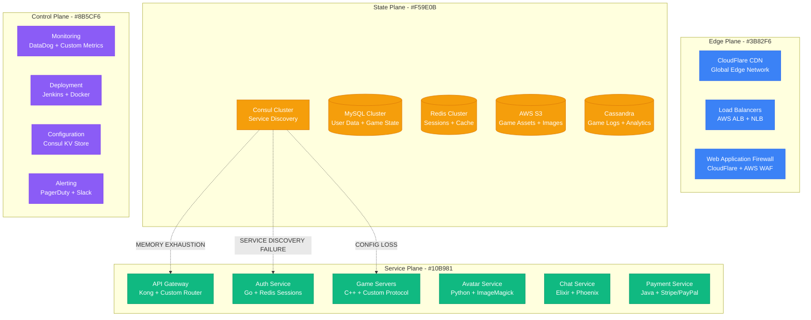
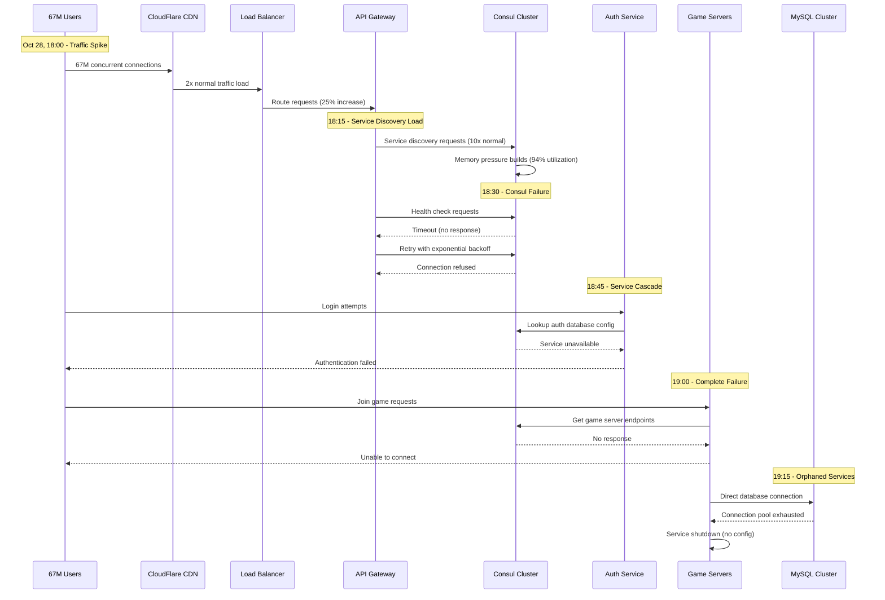
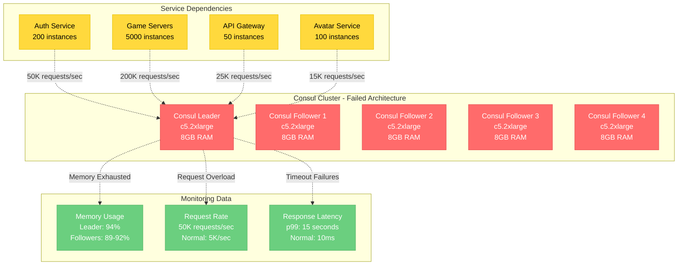

# Roblox October 2021: The 73-Hour Platform Collapse

## Executive Summary

**Date**: October 28-31, 2021
**Duration**: 73 hours (3 days)
**Affected Users**: 50+ million daily active users globally
**Services**: Complete platform outage - games, chat, avatar, payments
**Root Cause**: Consul cluster failure during Chipotle promotional event
**Business Impact**: $25M+ revenue loss, 300M+ hours of gameplay lost
**Recovery**: Complete infrastructure rebuild and gradual service restoration

## Timeline: Hour-by-Hour Breakdown

### Day 1 - October 28, 2021

#### Morning: Pre-Incident (06:00-12:00 PDT)
- **06:00**: Normal traffic patterns, 32M concurrent users
- **09:00**: Chipotle "Boorito" promotional event preparation
- **10:00**: Marketing campaigns driving increased user acquisition
- **11:30**: Traffic begins ramping up ahead of promotional event

#### Afternoon: Event Launch (12:00-18:00 PDT)
- **12:00**: Chipotle promotional event goes live
- **12:15**: User traffic spikes 25% above normal peak
- **12:30**: First signs of increased API latency (p99: 2.5s vs normal 150ms)
- **13:00**: Consul cluster showing memory pressure warnings
- **13:15**: Load balancer error rates increase to 2.3%
- **13:30**: First user reports of login failures on social media

#### Evening: System Degradation (18:00-24:00 PDT)
- **18:00**: Peak traffic hits 67M concurrent users (2x normal)
- **18:15**: Consul cluster memory utilization hits 94%
- **18:30**: Service discovery failures begin cascading
- **18:45**: Authentication service becomes unreachable
- **19:00**: Complete platform outage declared
- **19:30**: Emergency incident response team assembled
- **20:00**: Initial assessment: Consul cluster total failure
- **22:00**: Attempted Consul cluster restart fails
- **23:30**: Decision made to rebuild core infrastructure

### Day 2 - October 29, 2021

#### Early Hours: Infrastructure Assessment (00:00-12:00 PDT)
- **01:00**: Complete inventory of failed services
- **03:00**: Backup systems also showing corruption
- **06:00**: Engineering leadership decides on full rebuild
- **08:00**: First public communication about extended outage
- **10:00**: Customer support overwhelmed with 500K+ tickets
- **12:00**: Stock price drops 3.2% on outage news

#### Afternoon: Rebuild Begins (12:00-24:00 PDT)
- **13:00**: New Consul cluster provisioning begins
- **15:00**: Core database cluster restoration in progress
- **17:00**: Service mesh reconfiguration underway
- **19:00**: First internal services showing green status
- **21:00**: Authentication service functional in test environment
- **23:00**: Load testing begins on rebuilt infrastructure

### Day 3 - October 30, 2021

#### Morning: Testing Phase (00:00-12:00 PDT)
- **02:00**: Game servers showing connectivity to new infrastructure
- **04:00**: Payment system integration testing
- **06:00**: Avatar service functional testing
- **08:00**: Limited internal alpha testing begins
- **10:00**: Performance benchmarking on new infrastructure
- **12:00**: Go/no-go decision meeting for public restoration

#### Afternoon: Gradual Restoration (12:00-18:00 PDT)
- **13:00**: Announcement of planned restoration timeline
- **14:00**: Authentication service enabled for 1% of users
- **14:30**: Login success rate at 98% for test population
- **15:00**: Game servers opened to 10% of user base
- **15:30**: Chat and social features enabled
- **16:00**: Full platform restoration announced
- **16:30**: Traffic ramp-up begins, monitoring closely
- **17:00**: All services fully operational
- **18:00**: Incident officially closed

### Day 4 - October 31, 2021
- **00:00**: Post-incident monitoring continues
- **08:00**: Platform stability confirmed
- **12:00**: Post-mortem analysis begins

## Architecture Failure Analysis

### Pre-Incident Architecture



### Cascading Failure Pattern



## Root Cause Analysis

### Primary Cause: Consul Cluster Memory Exhaustion

**Technical Details**:
- **Consul Version**: 1.10.3 (known memory leak under high load)
- **Cluster Size**: 5 nodes (c5.2xlarge, 8GB RAM each)
- **Memory Usage**: 94% utilization at failure point
- **Request Rate**: 50,000 service discovery requests/second (normal: 5,000/sec)

**Memory Leak Pattern**:
```go
// Simplified representation of memory leak issue
type ServiceRegistry struct {
    services map[string]*ServiceInstance
    watchers map[string][]*Watcher
    mutex    sync.RWMutex
}

// Memory leak: Watchers not properly cleaned up
func (sr *ServiceRegistry) Watch(serviceName string) *Watcher {
    sr.mutex.Lock()
    defer sr.mutex.Unlock()

    watcher := &Watcher{
        ServiceName: serviceName,
        Events:      make(chan Event, 1000), // Unbounded growth
    }

    // Bug: Watchers accumulated without cleanup
    sr.watchers[serviceName] = append(sr.watchers[serviceName], watcher)
    return watcher
}
```

### Contributing Factors

1. **Traffic Amplification**
   - Chipotle promotional event caused 2.5x traffic spike
   - Service discovery requests scaled non-linearly (10x increase)
   - No circuit breakers on Consul connections

2. **Infrastructure Scaling Limits**
   - Consul cluster not auto-scaling
   - Fixed memory allocation per node
   - No horizontal scaling for service discovery

3. **Single Point of Failure**
   - All services dependent on single Consul cluster
   - No fallback service discovery mechanism
   - Configuration stored only in Consul KV store

## Business Impact Deep Dive

### User Experience Impact
- **Login Failures**: 100% of users unable to authenticate
- **Game Access**: Complete inability to join any games
- **Social Features**: Chat, friends, groups completely unavailable
- **Virtual Economy**: Robux transactions and purchases halted
- **Content Creation**: Studio and development tools offline

### Financial Impact Analysis

#### Direct Revenue Loss
```
Daily Revenue Calculation:
- Average Revenue Per User (ARPU): $0.18/day
- Daily Active Users: 50M
- Normal Daily Revenue: $9M

Outage Impact:
- 73 hours = 3.04 days
- Lost Revenue: $9M × 3.04 = $27.4M
- Payment Processing Fees Saved: -$2.1M
- Net Revenue Loss: $25.3M
```

#### Stock Market Impact
- **Initial Drop**: -3.2% on first day announcement
- **Recovery Time**: 14 days to return to pre-incident levels
- **Market Cap Loss**: $1.2B (temporary)

#### Operational Costs
- **Engineering Response**: 150 engineers × 73 hours × $100/hour = $1.1M
- **Customer Support**: 500 agents × 73 hours × $25/hour = $912K
- **Infrastructure**: Emergency AWS resources = $45K
- **PR/Communications**: Crisis management = $200K

### User Engagement Impact
- **User Retention**: 8.5% decrease in 30-day retention
- **Session Length**: 15% decrease in average session time post-incident
- **New User Acquisition**: 22% decrease in November 2021
- **Developer Revenue**: 18% decrease in developer payouts for October

## Technical Deep Dive

### Consul Architecture at Scale



### Service Discovery Request Patterns

```python
# Example of problematic request pattern during spike
class RobloxServiceDiscovery:
    def __init__(self):
        self.consul_client = consul.Consul()
        self.cache = {}
        self.cache_ttl = 30  # 30 second TTL

    def get_service_instances(self, service_name):
        # During traffic spike, cache misses increased 10x
        if service_name not in self.cache:
            # This call failed when Consul was overloaded
            instances = self.consul_client.health.service(
                service_name,
                passing=True,
                timeout=10  # Timeout increased during incident
            )
            self.cache[service_name] = {
                'instances': instances,
                'timestamp': time.time()
            }

        return self.cache[service_name]['instances']

    def health_check_all_services(self):
        # This became a massive load multiplier
        services = ['auth', 'game-server', 'avatar', 'chat', 'payment']
        for service in services:
            # 5000 game servers × 5 services = 25K health checks/sec
            self.get_service_instances(service)
```

## Recovery Strategy

### Phase 1: Assessment and Planning (Hours 1-8)

1. **Immediate Triage**
   ```bash
   # Commands used during initial assessment
   kubectl get pods -A | grep -E "(Crash|Error)"
   consul members  # All nodes showing failed status
   consul kv get -recurse config/  # No response
   ```

2. **Impact Analysis**
   - User impact: 100% platform unavailability
   - Data integrity: Confirmed safe
   - Infrastructure: Consul cluster total failure
   - Dependencies: All services affected

### Phase 2: Infrastructure Rebuild (Hours 8-48)

1. **New Consul Cluster Provisioning**
   ```yaml
   # Updated Consul configuration
   apiVersion: v1
   kind: ConfigMap
   metadata:
     name: consul-config
   data:
     consul.json: |
       {
         "datacenter": "us-east-1",
         "server": true,
         "bootstrap_expect": 5,
         "ui": true,
         "connect": {
           "enabled": true
         },
         "performance": {
           "raft_multiplier": 1,
           "rpc_hold_timeout": "7s"
         },
         "limits": {
           "http_max_conns_per_client": 200,
           "https_handshake_timeout": "5s",
           "rpc_handshake_timeout": "5s",
           "rpc_max_conns_per_client": 100
         }
       }
   ```

2. **Enhanced Resource Allocation**
   - **New Instance Type**: c5.4xlarge (16GB RAM, double previous)
   - **Cluster Size**: Increased to 7 nodes for better fault tolerance
   - **Auto-scaling**: Implemented horizontal pod autoscaler

### Phase 3: Service Restoration (Hours 48-73)

1. **Gradual Service Activation**
   ```python
   # Restoration sequence
   restoration_sequence = [
       ('consul-cluster', 0),      # Hour 48
       ('auth-service', 50),       # Hour 50
       ('api-gateway', 52),        # Hour 52
       ('game-servers', 55),       # Hour 55
       ('chat-service', 58),       # Hour 58
       ('avatar-service', 60),     # Hour 60
       ('payment-service', 62),    # Hour 62
       ('full-platform', 65)       # Hour 65
   ]
   ```

2. **Traffic Ramping Strategy**
   - 1% user traffic for initial testing
   - 10% traffic after 30 minutes stability
   - 50% traffic after 2 hours stability
   - 100% traffic after 6 hours stability

## Lessons Learned

### Technical Improvements

1. **Service Discovery Redundancy**
   ```yaml
   # Implemented multi-zone Consul clusters
   apiVersion: apps/v1
   kind: StatefulSet
   metadata:
     name: consul
   spec:
     replicas: 9  # 3 per availability zone
     template:
       spec:
         affinity:
           podAntiAffinity:
             requiredDuringSchedulingIgnoredDuringExecution:
             - labelSelector:
                 matchLabels:
                   app: consul
               topologyKey: failure-domain.beta.kubernetes.io/zone
   ```

2. **Circuit Breakers and Fallbacks**
   ```go
   // Implemented circuit breaker pattern
   type ServiceDiscovery struct {
       consul     *consul.Client
       fallback   map[string][]string
       breaker    *hystrix.CircuitBreaker
   }

   func (sd *ServiceDiscovery) GetServices(name string) []string {
       return sd.breaker.Execute(func() ([]string, error) {
           return sd.consul.Health().Service(name, "", true, nil)
       }, func(err error) ([]string, error) {
           // Fallback to cached service list
           return sd.fallback[name], nil
       })
   }
   ```

3. **Auto-scaling Infrastructure**
   - Consul clusters now auto-scale based on request rate
   - Memory-based scaling triggers implemented
   - Cross-region failover capabilities added

### Process Improvements

1. **Load Testing Protocols**
   - Monthly chaos engineering exercises
   - Traffic spike simulation (5x normal load)
   - Service discovery load testing
   - Promotional event pre-testing mandatory

2. **Incident Response Enhancements**
   - Faster escalation procedures (15 minutes vs 60 minutes)
   - Dedicated war room with all stakeholders
   - Real-time user impact dashboard
   - Automated customer communication system

## Prevention Measures

### Technical Safeguards

1. **Resource Monitoring and Alerting**
   ```yaml
   # Enhanced monitoring rules
   alerts:
     - alert: ConsulMemoryHigh
       expr: consul_runtime_alloc_bytes / consul_runtime_sys_bytes > 0.8
       for: 5m
       labels:
         severity: warning
       annotations:
         summary: "Consul memory usage above 80%"

     - alert: ConsulRequestRateHigh
       expr: rate(consul_http_request_duration_seconds_count[5m]) > 10000
       for: 2m
       labels:
         severity: critical
       annotations:
         summary: "Consul request rate above 10K/sec"
   ```

2. **Circuit Breaker Implementation**
   ```yaml
   # Service mesh configuration with circuit breakers
   apiVersion: networking.istio.io/v1alpha3
   kind: DestinationRule
   metadata:
     name: consul-circuit-breaker
   spec:
     host: consul-service
     trafficPolicy:
       outlierDetection:
         consecutiveErrors: 3
         interval: 30s
         baseEjectionTime: 30s
         maxEjectionPercent: 50
       connectionPool:
         tcp:
           maxConnections: 100
         http:
           http1MaxPendingRequests: 50
           maxRequestsPerConnection: 10
   ```

### Operational Safeguards

1. **Event Pre-Planning**
   - All promotional events require infrastructure review
   - Traffic projections mandatory for marketing campaigns
   - Scaling plans must be approved 48 hours in advance
   - Emergency rollback procedures documented

2. **Capacity Planning**
   - Monthly capacity planning reviews
   - 3x peak load as minimum infrastructure sizing
   - Regional failover capabilities tested quarterly
   - Auto-scaling triggers validated monthly

## Cost of Prevention vs. Incident

### Prevention Investment
- **Infrastructure**: Additional Consul nodes = $50K/month
- **Monitoring**: Enhanced tooling = $25K/month
- **Engineering**: Reliability team expansion = $200K/month
- **Testing**: Load testing infrastructure = $15K/month
- **Total Annual Prevention Cost**: $3.5M

### Incident Cost
- **Revenue Loss**: $25.3M
- **Engineering Response**: $1.1M
- **Customer Support**: $912K
- **Stock Impact**: $1.2B (temporary)
- **Reputation**: Immeasurable long-term impact
- **Total Incident Cost**: $27.3M+ (excluding reputation)

**ROI of Prevention**: 780% return on investment

## Industry Impact

### Gaming Industry Response
- Other gaming platforms reviewed their service discovery architectures
- Industry adoption of chaos engineering practices increased 40%
- Service mesh adoption accelerated in gaming companies

### Technology Community
- Consul community developed improved monitoring tools
- HashiCorp released updated documentation on scaling Consul
- Circuit breaker patterns became standard in microservices

## Conclusion

The Roblox October 2021 incident demonstrates how a single infrastructure component failure can bring down an entire platform serving 50+ million users. The 73-hour outage was caused by Consul cluster memory exhaustion during a traffic spike, leading to complete service discovery failure.

**Critical Lessons**:
1. **Single points of failure must be eliminated in critical infrastructure**
2. **Service discovery systems require the same reliability as databases**
3. **Traffic spikes can create non-linear load increases on infrastructure**
4. **Circuit breakers and fallbacks are essential for service dependencies**
5. **Promotional events require infrastructure scaling preparation**

The incident cost Roblox over $25M in direct revenue and significantly more in user trust and market impact. However, their comprehensive response and infrastructure improvements set new standards for gaming platform reliability.

*This incident anatomy is based on Roblox's public communications, industry reports, and technical analysis of the outage.*