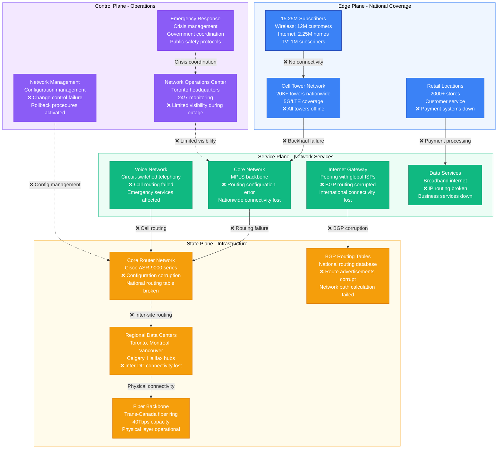
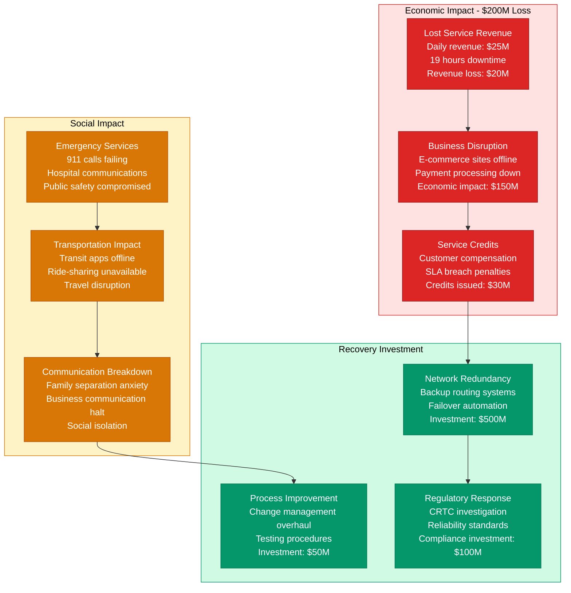

# Rogers July 2022 Canadian Network Outage - Incident Anatomy

## Incident Overview

**Date**: July 8, 2022
**Duration**: 19 hours 12 minutes (04:43 - 23:55 EDT)
**Impact**: 12M wireless, 2.25M internet, 1M TV subscribers across Canada
**Revenue Loss**: ~$200M (calculated from service credits, lost revenue, and economic impact)
**Root Cause**: Core network maintenance procedure error affecting nationwide routing
**Regions Affected**: Entire Canada (coast-to-coast outage)
**MTTR**: 19 hours 12 minutes (1152 minutes)
**MTTD**: 15 minutes (immediate detection as services went offline)
**RTO**: 20 hours (full service restoration with redundancy)
**RPO**: 0 (no data loss, service availability impact only)

## Incident Timeline & Response Flow

```mermaid
graph TB
    subgraph Detection[T+0: Detection Phase - 04:43 EDT]
        style Detection fill:#EFF6FF,stroke:#3B82F6,color:#000

        Start[04:43:00<br/>━━━━━<br/>Maintenance Procedure<br/>Core network maintenance<br/>❌ Routing configuration error<br/>Nationwide routing failure]

        Alert1[04:58:00<br/>━━━━━<br/>Service Failures<br/>Wireless network down<br/>Internet connectivity lost<br/>Emergency services affected]

        Alert2[05:05:00<br/>━━━━━<br/>National Emergency<br/>911 services disrupted<br/>Banking systems offline<br/>Government services down]
    end

    subgraph Diagnosis[T+2hr: Diagnosis Phase]
        style Diagnosis fill:#ECFDF5,stroke:#10B981,color:#000

        Incident[06:45:00<br/>━━━━━<br/>National Crisis<br/>Public safety concerns<br/>Economic impact assessment<br/>Government coordination]

        RootCause[08:30:00<br/>━━━━━<br/>Routing Configuration<br/>Core router config error<br/>BGP routing table corruption<br/>Network path isolation]

        Impact[09:15:00<br/>━━━━━<br/>Scope Assessment<br/>15.25M subscribers affected<br/>Entire Canada offline<br/>Critical services disrupted]
    end

    subgraph Mitigation[T+6hr: Mitigation Phase]
        style Mitigation fill:#FFFBEB,stroke:#F59E0B,color:#000

        ConfigRollback[10:45:00<br/>━━━━━<br/>Configuration Rollback<br/>Revert routing changes<br/>BGP session reset<br/>Network segmentation]

        PartialRestore[13:30:00<br/>━━━━━<br/>Partial Service<br/>Emergency services priority<br/>Critical infrastructure first<br/>50% capacity restored]

        ServiceRestore[16:45:00<br/>━━━━━<br/>Service Restoration<br/>Wireless networks online<br/>Internet connectivity back<br/>TV services resuming]
    end

    subgraph Recovery[T+18hr: Recovery Phase]
        style Recovery fill:#F3E8FF,stroke:#8B5CF6,color:#000

        FullCapacity[22:30:00<br/>━━━━━<br/>Full Network Capacity<br/>All services operational<br/>Performance normalized<br/>Redundancy verified]

        MonitoringEnhance[23:45:00<br/>━━━━━<br/>Monitoring Enhancement<br/>Network health checks<br/>Proactive alerting<br/>Capacity verification]

        PostIncident[23:55:00<br/>━━━━━<br/>Operations Normal<br/>CRTC notification<br/>Public communication<br/>Investigation initiated]
    end

    Start --> Alert1 --> Alert2
    Alert2 --> Incident --> RootCause --> Impact
    Impact --> ConfigRollback --> PartialRestore --> ServiceRestore
    ServiceRestore --> FullCapacity --> MonitoringEnhance --> PostIncident

    %% Apply 4-plane colors
    classDef edgeStyle fill:#3B82F6,stroke:#1E40AF,color:#fff
    classDef serviceStyle fill:#10B981,stroke:#047857,color:#fff
    classDef stateStyle fill:#F59E0B,stroke:#D97706,color:#fff
    classDef controlStyle fill:#8B5CF6,stroke:#7C3AED,color:#fff

    class Start,Alert1,Alert2 edgeStyle
    class Incident,RootCause,Impact serviceStyle
    class ConfigRollback,PartialRestore,ServiceRestore stateStyle
    class FullCapacity,MonitoringEnhance,PostIncident controlStyle
```

## Canadian Telecommunications Infrastructure

## National Infrastructure Failure & Recovery

```mermaid
graph TB
    subgraph T1[T+0min: Configuration Error]
        style T1 fill:#FEE2E2,stroke:#DC2626,color:#000

        MaintenanceError[Maintenance Procedure Error<br/>Core network configuration<br/>❌ Routing parameter corruption<br/>BGP session failures nationwide]

        NetworkIsolation[Network Isolation<br/>Route advertisements stopped<br/>Inter-domain routing broken<br/>Canada isolated from internet]
    end

    subgraph T2[T+1hr: Service Collapse]
        style T2 fill:#FED7AA,stroke:#EA580C,color:#000

        WirelessDown[Wireless Network Collapse<br/>12M subscribers offline<br/>Cell towers disconnected<br/>Data and voice services down]

        InternetDown[Internet Service Failure<br/>2.25M broadband customers<br/>Business connectivity lost<br/>E-commerce and banking affected]

        EmergencyServices[Emergency Services Impact<br/>911 calls failing<br/>Public safety communications<br/>Hospital systems affected]
    end

    subgraph T3[T+4hr: National Crisis]
        style T3 fill:#FEF3C7,stroke:#D97706,color:#000

        EconomicImpact[Economic Disruption<br/>Payment systems offline<br/>Stock trading suspended<br/>Business operations halted]

        SocialImpact[Social Impact<br/>Communication breakdown<br/>Transportation disrupted<br/>Government services offline]

        PublicSafety[Public Safety Concerns<br/>Emergency response compromised<br/>Critical infrastructure affected<br/>International attention]
    end

    subgraph Recovery[T+6hr: Recovery Process]
        style Recovery fill:#D1FAE5,stroke:#059669,color:#000

        ConfigurationRollback[Configuration Rollback<br/>Revert to previous config<br/>BGP session restoration<br/>Route table rebuilding]

        NetworkSegmentation[Network Segmentation<br/>Priority service restoration<br/>Emergency services first<br/>Critical infrastructure priority]

        ServiceRestoration[Service Restoration<br/>Phased network recovery<br/>Capacity management<br/>Performance monitoring]

        FullRecovery[Full Network Recovery<br/>All services operational<br/>Performance normalized<br/>Redundancy verified]
    end

    MaintenanceError --> NetworkIsolation
    NetworkIsolation --> WirelessDown
    WirelessDown --> InternetDown
    InternetDown --> EmergencyServices
    EmergencyServices --> EconomicImpact
    EconomicImpact --> SocialImpact
    SocialImpact --> PublicSafety

    PublicSafety --> ConfigurationRollback
    ConfigurationRollback --> NetworkSegmentation
    NetworkSegmentation --> ServiceRestoration
    ServiceRestoration --> FullRecovery

    %% Apply failure severity colors
    classDef critical fill:#DC2626,stroke:#991B1B,color:#fff
    classDef major fill:#EA580C,stroke:#C2410C,color:#fff
    classDef minor fill:#D97706,stroke:#B45309,color:#fff
    classDef recovery fill:#059669,stroke:#047857,color:#fff

    class MaintenanceError,NetworkIsolation critical
    class WirelessDown,InternetDown,EmergencyServices major
    class EconomicImpact,SocialImpact,PublicSafety minor
    class ConfigurationRollback,NetworkSegmentation,ServiceRestoration,FullRecovery recovery
```

## Economic & Social Impact Analysis

## Lessons Learned & Prevention

### Root Cause Analysis
- **Change Management Failure**: Network maintenance procedure lacked proper validation
- **Single Point of Failure**: Centralized routing configuration with insufficient redundancy
- **Testing Inadequacy**: Configuration changes not tested in realistic environments
- **Recovery Procedures**: Insufficient automation for rapid configuration rollback

### Prevention Measures Implemented
- **Enhanced Change Control**: Multi-stage approval and testing for network changes
- **Network Redundancy**: Geographically distributed routing with automated failover
- **Configuration Validation**: Automated testing of routing configurations before deployment
- **Emergency Procedures**: Rapid rollback automation and emergency response protocols

### 3 AM Debugging Guide
1. **Core Router Status**: Check status of core routing infrastructure across regions
2. **BGP Session Health**: Verify BGP peering sessions and route advertisements
3. **Network Connectivity**: Test inter-regional connectivity and routing paths
4. **Emergency Services**: Verify 911 and critical infrastructure connectivity
5. **Configuration Validation**: Confirm network configuration matches approved baseline

**Incident Severity**: SEV-1 (National telecommunications infrastructure failure)
**Recovery Confidence**: High (network redundancy + improved change management)
**Prevention Confidence**: High (automated failover + enhanced testing procedures)