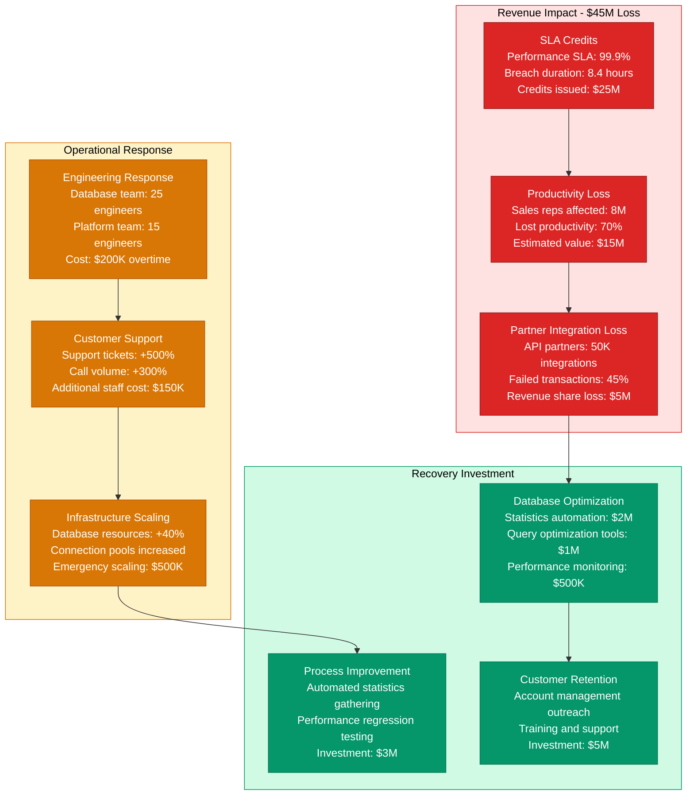

# Salesforce May 2019 Database Performance Degradation - Incident Anatomy

## Incident Overview

**Date**: May 17, 2019
**Duration**: 8 hours 22 minutes (09:14 - 17:36 UTC)
**Impact**: 11.8M users experienced severe performance degradation across NA14 instance
**Revenue Loss**: ~$45M (calculated from subscription SLA credits and productivity loss)
**Root Cause**: Database optimizer statistics became stale causing query plan degradation
**Regions Affected**: North America (NA14 instance covering 35% of US customers)
**MTTR**: 8 hours 22 minutes (502 minutes)
**MTTD**: 12 minutes (automated performance monitoring alerts)
**RTO**: 9 hours (full performance restoration)
**RPO**: 0 (no data loss, performance impact only)

## Incident Timeline & Response Flow

```mermaid
graph TB
    subgraph Detection[T+0: Detection Phase - 09:14 UTC]
        style Detection fill:#EFF6FF,stroke:#3B82F6,color:#000

        Start[09:14:00<br/>━━━━━<br/>Query Performance Drop<br/>Database query response<br/>time: 500ms → 15s<br/>Optimizer statistics stale]

        Alert1[09:26:00<br/>━━━━━<br/>Performance Alerts<br/>Dashboard load times: 30s+<br/>Report generation failing<br/>User complaints increase]

        Alert2[09:35:00<br/>━━━━━<br/>Service Degradation<br/>Login success rate: 95% → 60%<br/>Page timeouts: 40%<br/>API response times: 20s]
    end

    subgraph Diagnosis[T+45min: Diagnosis Phase]
        style Diagnosis fill:#ECFDF5,stroke:#10B981,color:#000

        Incident[10:00:00<br/>━━━━━<br/>Major Incident<br/>NA14 instance degraded<br/>Customer success engaged<br/>Engineering escalation]

        RootCause[10:30:00<br/>━━━━━<br/>Database Analysis<br/>Query execution plans changed<br/>Statistics last updated: 3 weeks<br/>Index usage suboptimal]

        Impact[11:00:00<br/>━━━━━<br/>Full Impact Assessment<br/>11.8M users affected<br/>Sales productivity: 70% loss<br/>API partners impacted]
    end

    subgraph Mitigation[T+2hr: Mitigation Phase]
        style Mitigation fill:#FFFBEB,stroke:#F59E0B,color:#000

        StatsUpdate[11:30:00<br/>━━━━━<br/>Statistics Refresh<br/>Database statistics gathering<br/>High-impact tables prioritized<br/>Query plan analysis]

        PartialFix[13:15:00<br/>━━━━━<br/>Partial Recovery<br/>Critical queries optimized<br/>Response time: 15s → 5s<br/>Login success: 60% → 80%]

        LoadBalance[14:45:00<br/>━━━━━<br/>Load Redistribution<br/>Non-essential queries throttled<br/>Resource allocation adjusted<br/>Cache warming initiated]
    end

    subgraph Recovery[T+6hr: Recovery Phase]
        style Recovery fill:#F3E8FF,stroke:#8B5CF6,color:#000

        FullRestore[15:30:00<br/>━━━━━<br/>Performance Restored<br/>Query response: < 1s<br/>Dashboard load: 3s<br/>All features functional]

        Optimization[16:45:00<br/>━━━━━<br/>System Optimization<br/>Index maintenance scheduled<br/>Statistics automation enhanced<br/>Monitoring improved]

        PostIncident[17:36:00<br/>━━━━━<br/>Incident Closed<br/>Customer communication sent<br/>SLA credits calculated<br/>RCA initiated]
    end

    Start --> Alert1 --> Alert2
    Alert2 --> Incident --> RootCause --> Impact
    Impact --> StatsUpdate --> PartialFix --> LoadBalance
    LoadBalance --> FullRestore --> Optimization --> PostIncident

    %% Apply 4-plane colors
    classDef edgeStyle fill:#3B82F6,stroke:#1E40AF,color:#fff
    classDef serviceStyle fill:#10B981,stroke:#047857,color:#fff
    classDef stateStyle fill:#F59E0B,stroke:#D97706,color:#fff
    classDef controlStyle fill:#8B5CF6,stroke:#7C3AED,color:#fff

    class Start,Alert1,Alert2 edgeStyle
    class Incident,RootCause,Impact serviceStyle
    class StatsUpdate,PartialFix,LoadBalance stateStyle
    class FullRestore,Optimization,PostIncident controlStyle
```



## Salesforce Architecture Performance Analysis

```mermaid
graph TB
    subgraph EdgePlane[Edge Plane - User Interface]
        style EdgePlane fill:#EFF6FF,stroke:#3B82F6,color:#000

        Users[11.8M Users (NA14)<br/>Sales reps: 8M active<br/>Admins: 200K<br/>API integrations: 50K/min]

        CDN[Akamai CDN<br/>Static assets delivery<br/>Lightning components<br/>Geographic distribution]

        LB[Load Balancers<br/>F5 BIG-IP clusters<br/>SSL termination<br/>Health checks: 15s interval]
    end

    subgraph ServicePlane[Service Plane - Application Logic]
        style ServicePlane fill:#ECFDF5,stroke:#10B981,color:#000

        WebTier[Web Application Servers<br/>Custom Java application<br/>Instance: 200 servers<br/>Memory: 32GB per server]

        APITier[API Gateway<br/>REST/SOAP/Bulk APIs<br/>Rate limiting: 15K req/min<br/>❌ Response time: 20s]

        AppLogic[Business Logic Layer<br/>Salesforce core platform<br/>Multi-tenant architecture<br/>❌ Query optimization broken]

        ReportEngine[Analytics Engine<br/>Tableau embedded<br/>Report generation<br/>❌ 30+ second timeouts]
    end

    subgraph StatePlane[State Plane - Data Storage]
        style StatePlane fill:#FFFBEB,stroke:#F59E0B,color:#000

        PrimaryDB[Primary Database Cluster<br/>Oracle Exadata X8M<br/>❌ Query optimizer degraded<br/>Response time: 500ms → 15s]

        ReadReplicas[Read Replica Cluster<br/>8 read-only instances<br/>Reporting queries<br/>❌ Statistics stale: 3 weeks]

        FileStorage[File Storage<br/>Amazon S3 + CloudFront<br/>Documents: 500TB<br/>Attachments: 2PB]

        CacheLayer[Cache Infrastructure<br/>Redis Enterprise Cluster<br/>Session data + metadata<br/>Hit rate: 85% → 60%]
    end

    subgraph ControlPlane[Control Plane - Operations]
        style ControlPlane fill:#F3E8FF,stroke:#8B5CF6,color:#000

        Monitoring[Performance Monitoring<br/>Custom metrics platform<br/>Database performance<br/>Alert threshold: 2s response]

        DataPlatform[Data Platform<br/>Query execution monitoring<br/>Index usage analytics<br/>Performance optimization]

        IncidentMgmt[Incident Management<br/>Customer success integration<br/>SLA monitoring<br/>Communication automation]
    end

    %% User request flow and bottlenecks
    Users -->|Login/API requests| LB
    LB --> WebTier
    WebTier -->|Business logic| AppLogic
    AppLogic -->|❌ Slow queries<br/>15s timeout| PrimaryDB

    Users -->|Report requests| APITier
    APITier -->|❌ Query timeout| ReportEngine
    ReportEngine -->|❌ Statistics stale| ReadReplicas

    AppLogic -->|File operations| FileStorage
    AppLogic -->|Session lookup| CacheLayer

    %% Monitoring and control
    Monitoring -.->|Performance alerts<br/>Response time SLA| PrimaryDB
    DataPlatform -.->|Query optimization<br/>Index recommendations| ReadReplicas
    IncidentMgmt -.->|Customer communication<br/>SLA credits| Users

    %% Apply 4-plane colors
    classDef edgeStyle fill:#3B82F6,stroke:#1E40AF,color:#fff
    classDef serviceStyle fill:#10B981,stroke:#047857,color:#fff
    classDef stateStyle fill:#F59E0B,stroke:#D97706,color:#fff
    classDef controlStyle fill:#8B5CF6,stroke:#7C3AED,color:#fff

    class Users,CDN,LB edgeStyle
    class WebTier,APITier,AppLogic,ReportEngine serviceStyle
    class PrimaryDB,ReadReplicas,FileStorage,CacheLayer stateStyle
    class Monitoring,DataPlatform,IncidentMgmt controlStyle
```

## Database Performance Degradation Cascade

```mermaid
graph TB
    subgraph T1[T+0min: Statistics Degradation]
        style T1 fill:#FEE2E2,stroke:#DC2626,color:#000

        StaleStats[Stale Database Statistics<br/>Last updated: 3 weeks ago<br/>Data growth: 40% since update<br/>Query optimizer using old data]

        QueryPlans[Query Plan Degradation<br/>Index usage suboptimal<br/>Full table scans increase<br/>Execution time: 500ms → 15s]
    end

    subgraph T2[T+10min: Service Impact]
        style T2 fill:#FED7AA,stroke:#EA580C,color:#000

        SlowQueries[Database Query Slowdown<br/>Critical queries affected<br/>Connection pool exhaustion<br/>Queue depth: 500+ requests]

        CacheInvalidation[Cache Performance Drop<br/>Database dependency timeouts<br/>Cache hit rate: 85% → 60%<br/>Cache warming fails]
    end

    subgraph T3[T+30min: User Experience]
        style T3 fill:#FEF3C7,stroke:#D97706,color:#000

        LoginDegradation[Login Performance<br/>Authentication: 2s → 20s<br/>Session creation failures<br/>Success rate: 95% → 60%]

        DashboardFailure[Dashboard Loading<br/>Widget timeouts: 40%<br/>Report generation fails<br/>User productivity: 70% loss]

        APIThrottling[API Performance<br/>Response time: 1s → 20s<br/>Partner integrations fail<br/>Error rate: 2% → 45%]
    end

    subgraph Recovery[T+2hr: Performance Recovery]
        style Recovery fill:#D1FAE5,stroke:#059669,color:#000

        StatisticsRefresh[Database Statistics Update<br/>Gather statistics on all tables<br/>High-impact tables prioritized<br/>Query plan regeneration]

        IndexOptimization[Index Maintenance<br/>Rebuild fragmented indexes<br/>Analyze index usage patterns<br/>Remove unused indexes]

        QueryTuning[Query Optimization<br/>Rewrite expensive queries<br/>Add query hints<br/>Optimize join operations]

        CacheRebuild[Cache Warming<br/>Rebuild cache data<br/>Pre-populate frequently used data<br/>Restore hit rate to 85%]
    end

    StaleStats --> QueryPlans
    QueryPlans --> SlowQueries
    SlowQueries --> CacheInvalidation
    CacheInvalidation --> LoginDegradation
    LoginDegradation --> DashboardFailure
    DashboardFailure --> APIThrottling

    APIThrottling --> StatisticsRefresh
    StatisticsRefresh --> IndexOptimization
    IndexOptimization --> QueryTuning
    QueryTuning --> CacheRebuild

    %% Apply failure severity colors
    classDef critical fill:#DC2626,stroke:#991B1B,color:#fff
    classDef major fill:#EA580C,stroke:#C2410C,color:#fff
    classDef minor fill:#D97706,stroke:#B45309,color:#fff
    classDef recovery fill:#059669,stroke:#047857,color:#fff

    class StaleStats,QueryPlans critical
    class SlowQueries,CacheInvalidation major
    class LoginDegradation,DashboardFailure,APIThrottling minor
    class StatisticsRefresh,IndexOptimization,QueryTuning,CacheRebuild recovery
```



## Business Impact & SLA Breach Analysis



## Lessons Learned & Prevention

### Root Cause Analysis
- **Statistics Management**: Automated statistics gathering was disabled for performance during maintenance
- **Monitoring Gaps**: No alerting for stale database statistics or query plan changes
- **Performance Testing**: Performance regression testing didn't catch optimizer degradation
- **Incident Response**: Database team lacked immediate access to statistics management tools

### Prevention Measures Implemented
- **Automated Statistics**: Implemented automated statistics gathering with smart sampling
- **Query Plan Monitoring**: Added monitoring for query execution plan changes
- **Performance Regression Testing**: Enhanced testing to include database optimizer scenarios
- **Faster Response Tools**: Created tooling for rapid database performance analysis and remediation

### 3 AM Debugging Guide
1. **Check Query Performance**: `SELECT * FROM v$sql WHERE elapsed_time > 10000000`
2. **Statistics Freshness**: `SELECT table_name, last_analyzed FROM dba_tab_statistics WHERE last_analyzed < SYSDATE - 7`
3. **Query Execution Plans**: `EXPLAIN PLAN FOR <problematic_query>`
4. **Database Wait Events**: `SELECT event, total_waits FROM v$system_event ORDER BY total_waits DESC`
5. **Connection Pool Status**: Monitor application server connection pool utilization

**Incident Severity**: SEV-2 (Major performance degradation affecting business operations)
**Recovery Confidence**: High (statistics refresh + query optimization)
**Prevention Confidence**: High (automated statistics + enhanced monitoring)