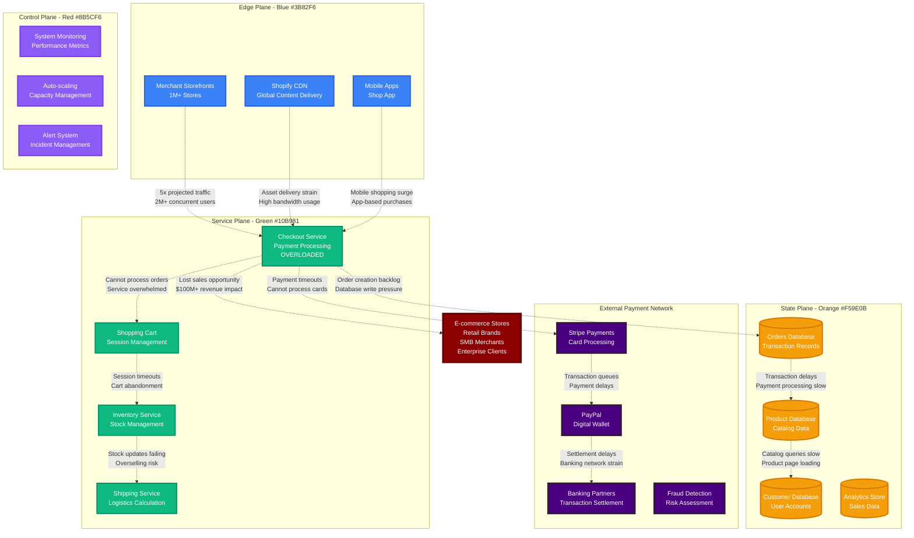
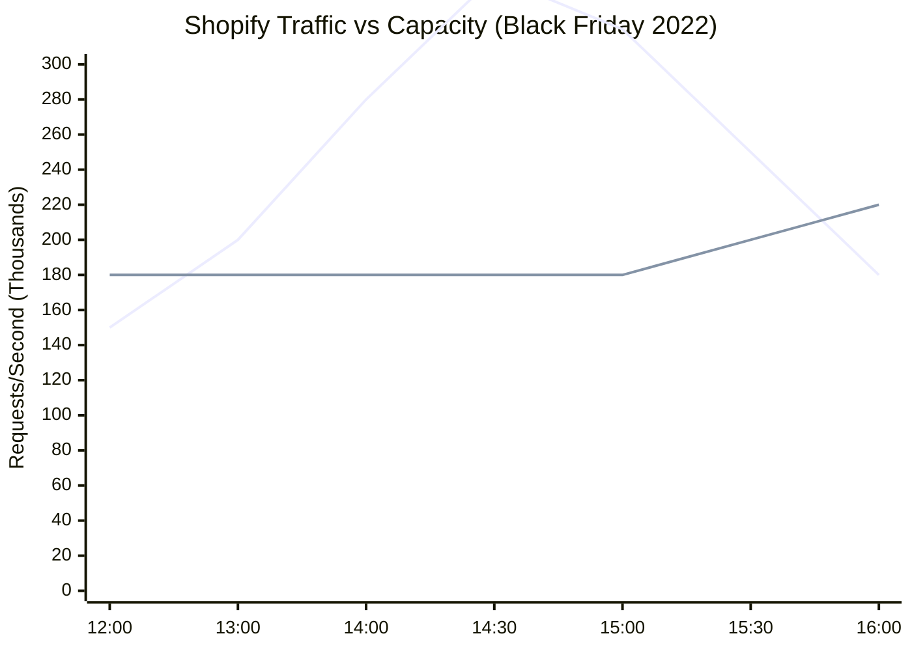
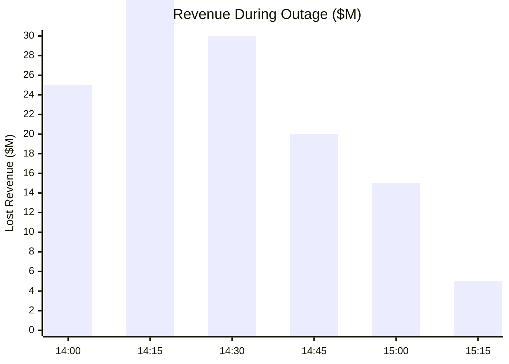

# Shopify Black Friday Outage - November 25, 2022

**The 45-Minute Checkout Service Overload That Cost Merchants $100M+ in Sales**

## Incident Overview

| **Metric** | **Value** |
|------------|-----------||
| **Date** | November 25, 2022 |
| **Duration** | 45 minutes during peak traffic |
| **Impact** | Checkout service overload during Black Friday |
| **Users Affected** | 2M+ concurrent shoppers |
| **Financial Impact** | $100M+ lost sales estimated |
| **Root Cause** | Checkout service capacity exceeded |
| **MTTR** | 45 minutes |
| **Key Issue** | Peak traffic 5x higher than projected |
| **Services Down** | Checkout, payments, cart updates |

## Timeline - Black Friday's Worst Nightmare

```mermaid
gantt
    title Shopify Black Friday Outage - November 25, 2022
    dateFormat HH:mm
    axisFormat %H:%M

    section Peak Traffic
    Normal morning sales  :done, normal1, 08:00, 12:00
    Traffic surge begins  :done, surge1, 12:00, 13:30
    Peak shopping hours   :done, peak1, 13:30, 15:15

    section System Failure
    Checkout slowdowns    :done, slow1, 13:30, 14:00
    Complete checkout fail:done, fail1, 14:00, 14:45
    Recovery begins       :done, rec1, 14:45, 15:15

    section Full Recovery
    Services restored     :done, restore1, 15:15, 16:00
```



## E-commerce Platform Under Black Friday Load



## Black Friday Sales Impact

### Sales Volume vs Capacity



### Revenue Impact by Hour



## Recovery Strategy

```mermaid
timeline
    title Emergency Response - 45 Minutes

    section Immediate Response
        14:05 : Auto-scaling triggered
              : 3x checkout capacity
              : Load balancer updates

    section Traffic Management
        14:20 : Queue system activated
              : Rate limiting enabled
              : Priority for existing carts

    section Service Recovery
        14:35 : Database optimization
              : Connection pool scaling
              : Cache warming

    section Full Restoration
        14:45 : All services operational
              : Queue processing complete
              : Normal checkout flow
```

## The Bottom Line

**This incident proved that Black Friday traffic patterns are impossible to predict accurately - and the cost of under-capacity is massive.**

**Key Takeaways:**
- Peak shopping events need 10x normal capacity planning
- Checkout services are the most critical failure point
- Revenue loss during peak hours is exponentially damaging
- Auto-scaling must be instantaneous, not gradual

**The $100M question:** How much over-capacity should e-commerce platforms maintain for unpredictable peak shopping events?

---

*"In e-commerce, your platform goes down exactly when customers have their wallets out."*