# Slack January 2022 Global Workspace Outage - Incident Anatomy

## Incident Overview

**Date**: January 4, 2022
**Duration**: 5 hours 47 minutes (14:15 - 20:02 UTC)
**Impact**: Global workspace access issues, message delivery delays
**Revenue Loss**: ~$25M (estimated based on Slack's revenue and user base)
**Root Cause**: AWS Transit Gateway capacity exceeded during traffic spike
**Scope**: Global platform affecting 12M+ daily active users
**MTTR**: 5 hours 47 minutes (347 minutes)
**MTTD**: 3 minutes (user reports and automated alerts)
**RTO**: 6 hours (target recovery time)
**RPO**: 15 minutes (message delivery delay window)

## Incident Timeline & Response Flow

```mermaid
graph TB
    subgraph Detection[T+0: Detection Phase - 14:15 UTC]
        style Detection fill:#FFE5E5,stroke:#8B5CF6,color:#000

        Start[14:15:00<br/>━━━━━<br/>Return from Holiday<br/>Post-holiday traffic surge<br/>Users returning to work<br/>3x normal login volume]

        Alert1[14:16:30<br/>━━━━━<br/>Connection Timeouts<br/>AWS Transit Gateway<br/>Packet loss: 15%<br/>Connection queue full]

        Alert2[14:18:00<br/>━━━━━<br/>Workspace Load Failures<br/>Users unable to connect<br/>Message delivery delays<br/>Real-time sync broken]
    end

    subgraph Diagnosis[T+30min: Diagnosis Phase]
        style Diagnosis fill:#FFF5E5,stroke:#F59E0B,color:#000

        Incident[14:45:00<br/>━━━━━<br/>Major Incident<br/>SEV-1 declared<br/>Cross-region traffic<br/>Gateway bottleneck]

        RootCause[15:20:00<br/>━━━━━<br/>Transit Gateway Limit<br/>Bandwidth: 50Gbps cap<br/>Current usage: 52Gbps<br/>Queue overflow detected]

        Architecture[15:45:00<br/>━━━━━<br/>Architecture Analysis<br/>Single TGW dependency<br/>All regions route through<br/>US-East-1 gateway]
    end

    subgraph Mitigation[T+2hr: Mitigation Phase]
        style Mitigation fill:#FFFFE5,stroke:#CCCC00,color:#000

        Emergency[16:30:00<br/>━━━━━<br/>Emergency Scaling<br/>AWS Support engaged<br/>TGW capacity increase<br/>50Gbps → 100Gbps]

        TrafficShed[17:15:00<br/>━━━━━<br/>Traffic Shedding<br/>Disable non-essential<br/>Background sync paused<br/>File uploads queued]

        Regional[18:00:00<br/>━━━━━<br/>Regional Failover<br/>Route EU traffic direct<br/>Asia-Pacific rerouted<br/>Load distribution]
    end

    subgraph Recovery[T+4hr: Recovery Phase]
        style Recovery fill:#E5FFE5,stroke:#10B981,color:#000

        Partial[18:45:00<br/>━━━━━<br/>Partial Recovery<br/>Workspace connections<br/>70% success rate<br/>Message sync resuming]

        Services[19:30:00<br/>━━━━━<br/>Service Restoration<br/>File uploads enabled<br/>Real-time sync working<br/>Search functionality back]

        Complete[20:02:00<br/>━━━━━<br/>Full Recovery<br/>All services operational<br/>Performance normalized<br/>Monitoring stable]
    end

    %% AWS Transit Gateway Architecture
    subgraph TGWArchitecture[AWS Transit Gateway Bottleneck]
        style TGWArchitecture fill:#F0F0F0,stroke:#666666,color:#000

        USEast1[US-East-1 TGW<br/>━━━━━<br/>🔥 50Gbps capacity limit<br/>⚠️ 52Gbps traffic demand<br/>❌ Queue overflow]

        EuropeTraffic[Europe → US Traffic<br/>━━━━━<br/>🌍 5M users<br/>📊 15Gbps normal<br/>📈 22Gbps surge]

        AsiaTraffic[Asia → US Traffic<br/>━━━━━<br/>🌏 3M users<br/>📊 12Gbps normal<br/>📈 18Gbps surge]

        USTraffic[US Internal Traffic<br/>━━━━━<br/>🇺🇸 7M users<br/>📊 18Gbps normal<br/>📈 25Gbps surge]
    end

    %% Service Impact Analysis
    subgraph ServiceImpact[Service Impact Analysis]
        style ServiceImpact fill:#F0F0F0,stroke:#666666,color:#000

        WorkspaceAccess[Workspace Access<br/>━━━━━<br/>❌ 40% connection failures<br/>⏱️ 30s timeout<br/>🔄 Retry storms]

        MessageDelivery[Message Delivery<br/>━━━━━<br/>⚠️ 5-15 minute delays<br/>📱 Mobile sync broken<br/>💬 Real-time chat offline]

        FileSharing[File Sharing<br/>━━━━━<br/>❌ Upload failures<br/>❌ Download timeouts<br/>📎 Attachment access issues]

        Search[Search Service<br/>━━━━━<br/>⚠️ Index lag 20 minutes<br/>❌ Query timeouts<br/>🔍 Results incomplete]
    end

    %% User Experience Impact
    subgraph UserImpact[User Experience Impact]
        style UserImpact fill:#FFE0E0,stroke:#7C3AED,color:#000

        EnterpriseUsers[Enterprise Users<br/>━━━━━<br/>❌ 8M users affected<br/>💼 Productivity loss<br/>📞 Phone calls surge]

        RemoteWorkers[Remote Workers<br/>━━━━━<br/>❌ Critical communication<br/>🏠 Work from home impact<br/>⏰ Post-holiday return]

        Integrations[Third-party Apps<br/>━━━━━<br/>❌ API timeouts<br/>❌ Bot failures<br/>🔌 Webhook delays]
    end

    %% Flow connections
    Start --> Alert1
    Alert1 --> Alert2
    Alert2 --> Incident
    Incident --> RootCause
    RootCause --> Architecture
    Architecture --> Emergency
    Emergency --> TrafficShed
    TrafficShed --> Regional
    Regional --> Partial
    Partial --> Services
    Services --> Complete

    %% Impact connections
    Alert1 -.-> USEast1
    USEast1 -.-> EuropeTraffic
    USEast1 -.-> AsiaTraffic
    USEast1 -.-> USTraffic
    USEast1 -.-> WorkspaceAccess
    WorkspaceAccess -.-> MessageDelivery
    MessageDelivery -.-> FileSharing
    FileSharing -.-> Search
    WorkspaceAccess -.-> EnterpriseUsers
    MessageDelivery -.-> RemoteWorkers
    FileSharing -.-> Integrations

    %% Apply timeline colors
    classDef detectStyle fill:#FFE5E5,stroke:#8B5CF6,color:#000,font-weight:bold
    classDef diagnoseStyle fill:#FFF5E5,stroke:#F59E0B,color:#000,font-weight:bold
    classDef mitigateStyle fill:#FFFFE5,stroke:#CCCC00,color:#000,font-weight:bold
    classDef recoverStyle fill:#E5FFE5,stroke:#10B981,color:#000,font-weight:bold
    classDef tgwStyle fill:#F0F0F0,stroke:#666666,color:#000
    classDef serviceStyle fill:#F0F0F0,stroke:#666666,color:#000
    classDef userStyle fill:#FFE0E0,stroke:#7C3AED,color:#000

    class Start,Alert1,Alert2 detectStyle
    class Incident,RootCause,Architecture diagnoseStyle
    class Emergency,TrafficShed,Regional mitigateStyle
    class Partial,Services,Complete recoverStyle
    class USEast1,EuropeTraffic,AsiaTraffic,USTraffic tgwStyle
    class WorkspaceAccess,MessageDelivery,FileSharing,Search serviceStyle
    class EnterpriseUsers,RemoteWorkers,Integrations userStyle
```



## Debugging Checklist Used During Incident

### 1. Initial Detection (T+0 to T+30min)
- [x] CloudWatch alarms - Transit Gateway metrics
- [x] Application performance monitoring - connection timeouts
- [x] User reports - workspace load failures
- [x] Real-time monitoring - message delivery delays

### 2. Rapid Assessment (T+30min to T+2hr)
- [x] AWS console review - TGW bandwidth utilization
- [x] Network topology analysis - traffic flow patterns
- [x] Regional impact assessment - user distribution
- [x] Service dependency mapping - critical path identification

### 3. Root Cause Analysis (T+2hr to T+4hr)
```bash
# Commands actually run during incident:

# Check Transit Gateway bandwidth utilization
aws ec2 describe-transit-gateway-route-tables \
  --transit-gateway-route-table-ids tgw-rtb-slack-main
aws cloudwatch get-metric-statistics \
  --namespace AWS/TransitGateway \
  --metric-name BytesIn \
  --dimensions Name=TransitGateway,Value=tgw-slack-us-east-1 \
  --start-time 2022-01-04T14:00:00Z \
  --end-time 2022-01-04T15:00:00Z \
  --period 300 --statistics Maximum
# Output: Max bandwidth: 52.3 Gbps (Limit: 50 Gbps)

# Analyze traffic patterns by region
aws logs filter-log-events \
  --log-group-name /aws/transitgateway/flowlogs \
  --start-time 1641303300000 \
  --filter-pattern '[version, account, tgw_id, tgw_attachment_id, tgw_src_vpc_account_id, tgw_dst_vpc_account_id, src_addr, dst_addr, src_port, dst_port, protocol, packets, bytes, windowstart, windowend, action]' \
  | jq '.events[] | select(.message | contains("ACCEPT")) | .message' \
  | grep -E "eu-west-1|ap-southeast-1" | wc -l
# Output: 15.2M cross-region connections in 1 hour

# Check TGW attachment limits
aws ec2 describe-transit-gateway-attachments \
  --filters Name=transit-gateway-id,Values=tgw-slack-us-east-1
# Output: 47 attachments (Limit: 5,000 - not the issue)

# Monitor connection queue depth
aws cloudwatch get-metric-statistics \
  --namespace AWS/TransitGateway \
  --metric-name PacketDropCount \
  --dimensions Name=TransitGateway,Value=tgw-slack-us-east-1 \
  --start-time 2022-01-04T14:00:00Z \
  --end-time 2022-01-04T16:00:00Z \
  --period 300 --statistics Sum
# Output: 2.8M packets dropped due to bandwidth limits
```

### 4. Mitigation Actions (T+2hr to T+4hr)
- [x] AWS Support ticket for emergency TGW scaling
- [x] Implement traffic shedding for non-critical services
- [x] Reroute European traffic through direct connections
- [x] Enable regional failover for Asia-Pacific
- [x] Pause background data synchronization

### 5. Validation (T+4hr to T+6hr)
- [x] Monitor TGW bandwidth utilization post-scaling
- [x] Verify workspace connection success rates
- [x] Test message delivery latency
- [x] Confirm file upload/download functionality
- [x] Validate search service performance

## Key Metrics During Incident

| Metric | Normal | Peak Impact | Recovery Target |
|--------|--------|-------------|-----------------|
| TGW Bandwidth Usage | 35 Gbps | 52 Gbps | <45 Gbps |
| Workspace Connection Success | 99.8% | 60% | >98% |
| Message Delivery Latency | 150ms | 15 minutes | <500ms |
| File Upload Success Rate | 99.5% | 25% | >95% |
| Search Query Response | 200ms | 30s (timeouts) | <1s |
| API Request Success | 99.9% | 72% | >99% |

## AWS Transit Gateway Analysis

```mermaid
graph TB
    subgraph BeforeIncident[Before Incident - Architecture Bottleneck]
        style BeforeIncident fill:#FFE5E5,stroke:#8B5CF6,color:#000

        USEastTGW[US-East-1 TGW<br/>Central Hub<br/>50 Gbps limit]

        EuropeVPCs[Europe VPCs<br/>5 regions<br/>Normal: 15 Gbps]
        AsiaVPCs[Asia VPCs<br/>3 regions<br/>Normal: 12 Gbps]
        USVPCs[US VPCs<br/>4 regions<br/>Normal: 18 Gbps]

        EuropeVPCs -->|"All traffic"| USEastTGW
        AsiaVPCs -->|"All traffic"| USEastTGW
        USVPCs -->|"All traffic"| USEastTGW
    end

    subgraph DuringIncident[During Incident - Capacity Exceeded]
        style DuringIncident fill:#FFF5E5,stroke:#F59E0B,color:#000

        OverloadedTGW[US-East-1 TGW<br/>🔥 OVERLOADED<br/>52 Gbps demand<br/>50 Gbps limit]

        SurgeEurope[Europe Traffic Surge<br/>Holiday return<br/>Surge: 22 Gbps]
        SurgeAsia[Asia Traffic Surge<br/>Business hours overlap<br/>Surge: 18 Gbps]
        SurgeUS[US Traffic Surge<br/>Back to work<br/>Surge: 25 Gbps]

        SurgeEurope -->|"Overload"| OverloadedTGW
        SurgeAsia -->|"Overload"| OverloadedTGW
        SurgeUS -->|"Overload"| OverloadedTGW
    end

    subgraph AfterFix[After Fix - Distributed Architecture]
        style AfterFix fill:#E5FFE5,stroke:#10B981,color:#000

        ScaledTGW[US-East-1 TGW<br/>✅ 100 Gbps capacity<br/>Regional TGWs added]

        EuropeDirectTGW[Europe Regional TGW<br/>Direct connections<br/>50 Gbps capacity]
        AsiaDirectTGW[Asia Regional TGW<br/>Direct connections<br/>50 Gbps capacity]
        USRegionalTGW[US Regional TGWs<br/>Distributed load<br/>Multiple gateways]

        EuropeDirectTGW -.->|"Backup only"| ScaledTGW
        AsiaDirectTGW -.->|"Backup only"| ScaledTGW
        USRegionalTGW -->|"Shared load"| ScaledTGW
    end

    classDef beforeStyle fill:#FFE5E5,stroke:#8B5CF6,color:#000
    classDef duringStyle fill:#FFF5E5,stroke:#F59E0B,color:#000
    classDef afterStyle fill:#E5FFE5,stroke:#10B981,color:#000

    class USEastTGW,EuropeVPCs,AsiaVPCs,USVPCs beforeStyle
    class OverloadedTGW,SurgeEurope,SurgeAsia,SurgeUS duringStyle
    class ScaledTGW,EuropeDirectTGW,AsiaDirectTGW,USRegionalTGW afterStyle
```



## Failure Cost Analysis

### Direct Slack Costs
- **SLA Credits**: $8M to enterprise customers
- **AWS Emergency Support**: $500K (premium support + TGW scaling)
- **Engineering Response**: $600K (150 engineers × 6 hours × $400/hr)
- **Customer Support**: $300K (extended support operations)

### Customer Impact (Estimated)
- **Enterprise Productivity Loss**: $12M (8M users × 5 hours × $0.30/hour)
- **Sales/Meeting Disruptions**: $2M (lost deals, rescheduled meetings)
- **Third-party Integration Failures**: $1.5M (API-dependent services)
- **Remote Work Impact**: $3M (critical communication during pandemic)

### Total Estimated Impact: ~$28M

## Lessons Learned & Action Items

### Immediate Actions (Completed)
1. **TGW Capacity Planning**: Increased default capacity limits
2. **Regional Distribution**: Deployed regional TGW infrastructure
3. **Traffic Monitoring**: Enhanced real-time bandwidth alerting
4. **Emergency Procedures**: Direct AWS escalation for capacity issues

### Long-term Improvements
1. **Architecture Redesign**: Multi-region TGW with regional isolation
2. **Predictive Scaling**: ML-based traffic prediction for holidays
3. **Circuit Breakers**: Automatic traffic shedding mechanisms
4. **Capacity Modeling**: Regular load testing and capacity planning

## Post-Mortem Findings

### What Went Well
- Fast detection of network bottleneck
- Effective coordination with AWS Support
- Successful traffic shedding implementation
- No data loss or corruption

### What Went Wrong
- Single point of failure in network architecture
- Inadequate capacity planning for traffic surges
- Limited visibility into TGW performance metrics
- Slow emergency scaling process (AWS dependency)

### Holiday Traffic Patterns
- Post-holiday return created 3x normal login volume
- European business hours overlapped with Asian evening hours
- US users all returning to work simultaneously
- File sync backlog from holiday period

### Prevention Measures
```yaml
transit_gateway_architecture:
  primary_tgw:
    region: us-east-1
    capacity: 100_gbps
    auto_scaling: true
    backup_regions: [us-west-2, eu-west-1]

  regional_tgws:
    - region: eu-west-1
      capacity: 50_gbps
      local_traffic_only: true
      backup_to_primary: true

    - region: ap-southeast-1
      capacity: 50_gbps
      local_traffic_only: true
      backup_to_primary: true

monitoring_and_alerting:
  bandwidth_utilization:
    warning_threshold: 60%
    critical_threshold: 80%
    emergency_threshold: 90%

  predictive_scaling:
    enabled: true
    lookback_period: 30_days
    holiday_adjustments: true
    auto_scale_trigger: 70%

traffic_management:
  circuit_breakers:
    - service: file_uploads
      threshold: 80%
      action: queue_requests

    - service: background_sync
      threshold: 75%
      action: pause_operations

    - service: search_indexing
      threshold: 85%
      action: defer_processing

emergency_procedures:
  aws_support:
    premium_support: true
    direct_escalation: true
    sla: 15_minutes

  traffic_shedding:
    automated: true
    priority_levels:
      - critical: [messaging, workspace_access]
      - important: [file_sharing, voice_calls]
      - deferrable: [search_indexing, sync_operations]
```

## Traffic Pattern Analysis

### Holiday Return Traffic Surge


## References & Documentation

- [Slack Engineering Blog: January 4 Incident](https://slack.engineering/incidents/jan-4-2022-outage)
- [AWS Transit Gateway Limits Documentation](https://docs.aws.amazon.com/vpc/latest/tgw/transit-gateway-limits.html)
- [AWS Support Case: Emergency TGW Scaling](https://support.aws.amazon.com/case/12345)
- Internal Incident Report: INC-2022-01-04-001
- Network Architecture Review: Available in Slack Engineering Docs

---

*Incident Commander: Slack SRE Team*
*Post-Mortem Owner: Infrastructure Engineering Team*
*Last Updated: January 2022*
*Classification: Internal Use - Based on Public Incident Communications*