# Slack January 4, 2021 - Post-Holiday Transit Gateway Collapse

*"New Year's Monday traffic surge overwhelmed AWS Transit Gateway, cascading through auto-scaling and provisioning systems"*

## Incident Overview

| Attribute | Value |
|-----------|-------|
| **Date** | January 4, 2021 |
| **Duration** | 3 hours, 43 minutes |
| **Trigger Time** | 06:00 PST (14:00 UTC) |
| **Resolution Time** | 10:40 PST (18:40 UTC) |
| **Impact** | Global Slack workspace degradation |
| **Message Success Rate** | Dropped from >99.999% to 99% |
| **Users Affected** | 12M+ daily active users |
| **Estimated Cost** | $25M+ in productivity loss |
| **Root Cause** | AWS Transit Gateway auto-scaling failure |

## The Post-Holiday Perfect Storm


## Architecture Under Stress

```mermaid
graph TB
    subgraph Internet[Global User Traffic - 12M DAU]
        MOBILE[Mobile Apps<br/>📱 Cold cache sync]
        DESKTOP[Desktop Apps<br/>💻 Cold cache sync]
        WEB[Web Clients<br/>🌐 First login Monday]
    end

    subgraph EdgePlane[Edge Plane - #0066CC]
        ALB[Application Load Balancer<br/>✅ Healthy<br/>📊 20x normal traffic]
        CF[CloudFlare CDN<br/>✅ Healthy<br/>📈 Static assets OK]
    end

    subgraph ServicePlane[Service Plane - #00AA00]
        subgraph WebTier[Web Tier - Auto Scaling]
            WEB1[Web Server Pod 1<br/>⚠️ CPU: 15% (waiting)]
            WEB2[Web Server Pod 2<br/>⚠️ CPU: 15% (waiting)]
            WEBN[Web Server Pod N<br/>❌ Provision failed]
        end

        subgraph ServiceTier[Service Tier]
            MSG[Message Service<br/>❌ Network timeouts]
            PRES[Presence Service<br/>❌ WebSocket drops]
            NOTIF[Notification Service<br/>❌ Degraded delivery]
        end
    end

    subgraph NetworkPlane[Network Infrastructure - AWS]
        subgraph TGW[Transit Gateway - BOTTLENECK]
            TGWMAIN[AWS Transit Gateway<br/>❌ Packet loss: 15%<br/>❌ Auto-scale failed<br/>🔥 Manual intervention needed]
        end

        subgraph VPCs[VPC Architecture]
            VPC1[Web Tier VPC<br/>⚠️ Limited bandwidth]
            VPC2[Service Tier VPC<br/>⚠️ Limited bandwidth]
            VPC3[Data Tier VPC<br/>⚠️ Limited bandwidth]
        end
    end

    subgraph StatePlane[State Plane - #FF8800]
        subgraph Databases[Database Layer]
            PG[PostgreSQL Clusters<br/>✅ Healthy but slow<br/>📊 Connection timeouts]
            REDIS[Redis Clusters<br/>✅ Healthy but slow<br/>📊 Network lag]
        end

        subgraph Storage[Storage Layer]
            S3[S3 File Storage<br/>✅ Healthy<br/>📂 File uploads timing out]
        end
    end

    subgraph ControlPlane[Control Plane - #CC0000]
        subgraph Provision[Provisioning Crisis]
            PROV[Provision Service<br/>❌ Linux file limit hit<br/>❌ AWS quota exceeded<br/>💥 Can't add capacity]
        end

        subgraph Monitoring[Monitoring Collapse]
            DASH[Grafana Dashboard<br/>❌ Behind degraded network<br/>❌ Can't see metrics]
            ALERT[PagerDuty<br/>✅ Firing alerts<br/>📢 CPU low paradox]
        end

        subgraph AutoScale[Auto-scaling Confusion]
            ASG[Auto Scaling Groups<br/>❌ Scaling down<br/>❓ Low CPU = Remove servers]
        end
    end

    %% Traffic flow with bottlenecks
    MOBILE --> ALB
    DESKTOP --> ALB
    WEB --> ALB

    ALB --> TGWMAIN
    TGWMAIN -.->|❌ PACKET LOSS| VPC1
    TGWMAIN -.->|❌ PACKET LOSS| VPC2
    TGWMAIN -.->|❌ PACKET LOSS| VPC3

    VPC1 --> WEB1
    VPC1 --> WEB2
    VPC1 -.->|❌ PROVISION FAIL| WEBN

    VPC2 --> MSG
    VPC2 --> PRES
    VPC2 --> NOTIF

    VPC3 --> PG
    VPC3 --> REDIS
    VPC3 --> S3

    %% Control flows
    PROV -.->|❌ CAN'T PROVISION| WEBN
    ASG -.->|❌ WRONG DECISION| WEB1

    %% Apply four-plane colors
    classDef edgeStyle fill:#0066CC,stroke:#004499,color:#fff
    classDef serviceStyle fill:#00AA00,stroke:#007700,color:#fff
    classDef stateStyle fill:#FF8800,stroke:#CC6600,color:#fff
    classDef controlStyle fill:#CC0000,stroke:#990000,color:#fff
    classDef networkStyle fill:#9966CC,stroke:#663399,color:#fff

    class ALB,CF edgeStyle
    class WEB1,WEB2,WEBN,MSG,PRES,NOTIF serviceStyle
    class PG,REDIS,S3 stateStyle
    class PROV,DASH,ALERT,ASG controlStyle
    class TGWMAIN,VPC1,VPC2,VPC3 networkStyle
```

## Detailed Failure Cascade

### Phase 1: The Holiday Pattern (Dec 25 - Jan 3)


### Phase 2: The Monday Morning Surge (06:00-07:00 PST)


### Phase 3: The Infrastructure Cascade (07:00-08:15 PST)

```mermaid
sequenceDiagram
    participant TGW as Transit Gateway
    participant WEB as Web Servers
    participant PROV as Provision Service
    participant ASG as Auto Scaling
    participant MON as Monitoring

    Note over TGW,MON: 7:00 AM PST - Cascade Begins

    TGW->>WEB: High packet loss (15%)
    WEB->>WEB: Waiting for backend responses
    WEB->>WEB: CPU usage drops (waiting state)

    MON->>ASG: 🚨 Low CPU detected
    ASG->>WEB: Scale down! Remove servers
    Note over WEB: Worse performance, more waiting

    ASG->>PROV: Add new instances (panic mode)
    PROV->>PROV: ❌ Hit Linux file descriptor limit
    PROV->>PROV: ❌ Hit AWS quota limits
    PROV->>ASG: ❌ Cannot provision

    Note over TGW,MON: 8:15 AM PST - System in crisis mode
```


### Phase 4: The Recovery (08:15-10:40 PST)

```mermaid
sequenceDiagram
    participant OPS as Slack SRE
    participant AWS_SUP as AWS Support
    participant TGW as Transit Gateway
    participant SLACK as Slack Services
    participant USERS as Users

    Note over OPS,USERS: 8:15 AM PST - Manual Intervention

    OPS->>AWS_SUP: 🚨 Emergency TGW scaling request
    AWS_SUP->>TGW: Manual capacity increase
    TGW->>TGW: ✅ Packet loss drops to 2%

    OPS->>SLACK: Disable auto-scaling down
    OPS->>SLACK: Enable load balancer panic mode
    SLACK->>SLACK: Route around failed instances

    Note over SLACK: 9:15 AM PST - Degraded but functional
    SLACK->>USERS: Message delivery improving
    USERS->>SLACK: ✅ Workspaces loading

    Note over OPS,USERS: 10:40 AM PST - Full recovery
```


## Impact Analysis & Metrics

### Message Success Rate Degradation


### Business Impact Assessment
| Component | Impact | Duration | Est. Cost |
|-----------|--------|----------|-----------|
| **Enterprise Users** | 8M users degraded experience | 3h 43m | $15M |
| **SMB Customers** | 4M users intermittent service | 3h 43m | $5M |
| **Customer Support** | Ticket surge | 8 hours | $2M |
| **SLA Credits** | Enterprise SLA breaches | 3h 43m | $1.5M |
| **Sales Impact** | Demo failures, lost deals | 1 week | $1M |
| **Engineering Time** | Incident response | 200 hours | $0.5M |
| **Total Estimated Cost** | | | **$25M** |

## Technical Deep Dive

### AWS Transit Gateway Scaling Problem

```mermaid
graph TB
    subgraph Normal[Normal Operations - Holiday Period]
        TGW1[Transit Gateway<br/>Capacity: 50 Gbps<br/>Traffic: 10 Gbps<br/>Utilization: 20%]
        VPC1[VPC A] --> TGW1
        VPC2[VPC B] --> TGW1
        VPC3[VPC C] --> TGW1
    end

    subgraph Surge[Monday Morning Surge]
        TGW2[Transit Gateway<br/>Capacity: 50 Gbps<br/>Traffic: 200 Gbps<br/>❌ Utilization: 400%]
        VPC4[VPC A<br/>📈 20x traffic] --> TGW2
        VPC5[VPC B<br/>📈 20x traffic] --> TGW2
        VPC6[VPC C<br/>📈 20x traffic] --> TGW2

        TGW2 --> PACKET[Packet Loss: 15%]
    end

    subgraph Recovery[Manual Scaling]
        TGW3[Transit Gateway<br/>Capacity: 300 Gbps<br/>Traffic: 200 Gbps<br/>✅ Utilization: 67%]
        VPC7[VPC A] --> TGW3
        VPC8[VPC B] --> TGW3
        VPC9[VPC C] --> TGW3
    end

    Normal ==> Surge
    Surge ==> Recovery

    style PACKET fill:#CC0000
    style TGW2 fill:#CC0000
    style TGW3 fill:#00AA00
```


### Provisioning Service Bottlenecks


## Root Cause Analysis

### The Holiday Traffic Pattern Problem


### Contributing Factors Chain


## Remediation & Prevention

### Immediate Actions (Completed)
- [x] **Manual TGW Scaling**: AWS support manually increased capacity
- [x] **Disable Downscaling**: Prevented auto-scaling from removing servers
- [x] **Load Balancer Panic Mode**: Activated LB circuit breakers
- [x] **Provisioning Limits**: Increased file descriptor and AWS quotas

### Short-term Fixes (30 days)
- [x] **Holiday Preparation**: Pre-scale TGW before post-holiday periods
- [x] **Monitoring Relocation**: Move critical dashboards off dependent infrastructure
- [x] **Auto-scaling Logic**: Fix CPU-based scaling for network-bound services
- [x] **Provision Testing**: Regular load testing of provisioning service

### Long-term Solutions (6 months)
- [ ] **Predictive Scaling**: ML-based traffic prediction for holiday patterns
- [ ] **Client Synchronization**: Staggered sync to prevent thundering herd
- [ ] **Network Capacity**: Reserved TGW capacity for peak periods
- [ ] **Multi-region Failover**: Reduce dependency on single TGW instance

## Prevention Framework

### Holiday Traffic Preparation


### Auto-scaling Safety Guards


## Engineering Lessons

### The Counter-Intuitive CPU Pattern

```mermaid
sequenceDiagram
    participant NET as Network
    participant WEB as Web Server
    participant CPU as CPU Metrics
    participant ASG as Auto Scaling

    Note over NET,ASG: Why Low CPU Led to Disaster

    NET->>WEB: High packet loss
    WEB->>WEB: Wait for backend responses
    WEB->>CPU: CPU drops (waiting, not processing)
    CPU->>ASG: 📊 Low CPU utilization
    ASG->>ASG: Servers underutilized!
    ASG->>WEB: Scale down instances
    WEB->>NET: Even worse performance

    Note over NET,ASG: Lesson: Network issues can mask as CPU issues
```


### The Monitoring Dependency Problem


## War Stories & Lessons for 3 AM Engineers

### 🚨 Critical Warning Signs
1. **Post-holiday Monday traffic** = potential infrastructure overload
2. **Low CPU + high latency** = network issues, not capacity issues
3. **Provisioning failures during scaling** = resource limit exhaustion
4. **Can't access monitoring** = monitoring has dependencies

### 🛠️ Emergency Procedures


### 💡 Key Takeaways
- **Holiday patterns** create **unique failure modes**
- **Auto-scaling** can **make incidents worse** if logic is flawed
- **Network bottlenecks** disguise themselves as **CPU issues**
- **Provisioning limits** become **critical during emergency scaling**
- **Your monitoring** can't depend on **what you're monitoring**

---

*"On New Year's Monday, we go from our quietest time of the whole year to one of our biggest days quite literally overnight. Our own serving systems scale quickly to meet these kinds of peaks in demand, however, our Transit Gateways did not scale fast enough."* - Slack Engineering Team

**Quote from incident**: *"While they were in the early stages of investigating, their dashboarding and alerting service became unavailable because of a dependency the SHD administration console has on network infrastructure."*

**Impact**: This incident led to Slack's adoption of predictive scaling for holiday patterns and comprehensive infrastructure dependency mapping, establishing patterns for managing post-holiday traffic surges.