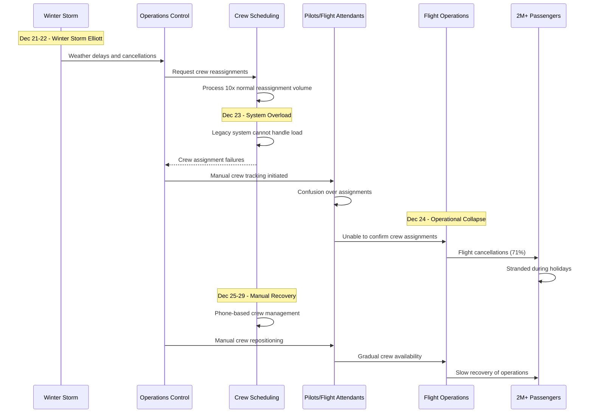

# Southwest Airlines December 2022: The Holiday Meltdown

## Executive Summary

**Date**: December 21-29, 2022
**Duration**: 9 days of cascading failures
**Affected Passengers**: 2+ million passengers, 16,700+ flight cancellations
**Root Cause**: Legacy crew scheduling system failure during winter storm
**Business Impact**: $1B+ in losses, 71% of flights cancelled at peak
**Recovery**: Manual crew scheduling and gradual operations restoration

## Timeline: Day-by-Day Breakdown

### Day 1-2: Winter Storm Impact (Dec 21-22)
- **Dec 21, 06:00**: Winter Storm Elliott begins affecting operations
- **Dec 21, 12:00**: Denver and Chicago hubs experiencing weather delays
- **Dec 21, 18:00**: 1,500 flights cancelled due to weather conditions
- **Dec 22, 00:00**: Crew scheduling system showing strain from disruptions
- **Dec 22, 08:00**: 2,300 additional flights cancelled
- **Dec 22, 16:00**: Crew tracking system beginning to lose synchronization

### Day 3-4: System Failure Cascade (Dec 23-24)
- **Dec 23, 02:00**: Crew scheduling system unable to process reassignments
- **Dec 23, 08:00**: Manual crew tracking procedures initiated
- **Dec 23, 12:00**: 2,600 flights cancelled (Christmas Eve travel day)
- **Dec 24, 00:00**: Operations control center overwhelmed with rebooking
- **Dec 24, 08:00**: 2,800 flights cancelled on Christmas Eve
- **Dec 24, 18:00**: 71% cancellation rate - highest in industry

### Day 5-6: Peak Crisis (Dec 25-26)
- **Dec 25**: 2,400 Christmas Day cancellations
- **Dec 26**: 2,500 additional cancellations, bags separated from passengers
- **Dec 26, 12:00**: CEO public apology and commitment to resolution
- **Dec 26, 18:00**: Emergency response team expanded to 24/7 operations

### Day 7-9: Gradual Recovery (Dec 27-29)
- **Dec 27**: 1,800 cancellations, manual processes showing improvement
- **Dec 28**: 1,200 cancellations, crew repositioning efforts
- **Dec 29**: 800 cancellations, near-normal operations resuming

## Architecture Failure Analysis

### Southwest Airlines Operations Technology Stack

```mermaid
graph TB
    subgraph EdgePlane["Edge Plane"]
        GATES[Gate Systems<br/>Airport Operations]
        MOBILE[Mobile Apps<br/>Customer Interface]
        WEB[Website<br/>Booking + Check-in]
        KIOSKS[Airport Kiosks<br/>Self-Service]
    end

    subgraph ServicePlane["Service Plane"]
        BOOKING[Booking System<br/>Reservations]
        CHECKIN[Check-in System<br/>Passenger Processing]
        OPS[Operations Control<br/>Flight Management]
        CREW[Crew Scheduling<br/>SkySolver System]
        MAINT[Maintenance<br/>Aircraft Management]
    end

    subgraph StatePlane["State Plane"]
        PASSDB[(Passenger Database<br/>Customer Records)]
        FLIGHTDB[(Flight Database<br/>Schedule Management)]
        CREWDB[(Crew Database<br/>Personnel Tracking)]
        AIRCRAFT[(Aircraft Database<br/>Fleet Management)]
        BAGGAGE[(Baggage System<br/>Tracking Database)]
    end

    subgraph ControlPlane["Control Plane"]
        LEGACY[Legacy Systems<br/>30+ Year Old Code]
        WEATHER[Weather Integration<br/>External Data)]
        COMMS[Communication<br/>Internal Messaging]
        REPORTING[Reporting<br/>Executive Dashboard]
    end

    %% Critical failure point - Legacy crew scheduling
    LEGACY -.->|SYSTEM OVERLOAD| CREW
    CREW -.->|SCHEDULING FAILURE| OPS
    OPS -.->|FLIGHT CANCELLATIONS| BOOKING
    BOOKING -.->|PASSENGER IMPACT| MOBILE

    %% Apply four-plane colors
    classDef edgeStyle fill:#3B82F6,stroke:#2563EB,color:#fff
    classDef serviceStyle fill:#10B981,stroke:#059669,color:#fff
    classDef stateStyle fill:#F59E0B,stroke:#D97706,color:#fff
    classDef controlStyle fill:#8B5CF6,stroke:#7C3AED,color:#fff

    class GATES,MOBILE,WEB,KIOSKS edgeStyle
    class BOOKING,CHECKIN,OPS,CREW,MAINT serviceStyle
    class PASSDB,FLIGHTDB,CREWDB,AIRCRAFT,BAGGAGE stateState
    class LEGACY,WEATHER,COMMS,REPORTING controlStyle
```

### Crew Scheduling System Failure Cascade



## Root Cause Analysis

### Primary Cause: Legacy Crew Scheduling System Overload

**Technical Details**:
Southwest's crew scheduling system, SkySolver, was built in the 1990s and could not handle the massive reassignment volume during the winter storm disruption.

```
System Specifications (SkySolver):
- Original Design: 1990s architecture
- Database: Legacy IBM mainframe system
- Programming Language: COBOL and Assembly
- Normal Load: 1,000 crew changes per day
- Storm Load: 10,000+ crew changes per day
- Processing Capacity: Sequential processing only
- Failure Point: System timeout after 5,000 concurrent operations

Technical Limitations:
- No parallel processing capabilities
- Manual input required for each crew change
- No automated crew repositioning algorithms
- Single-threaded database operations
- No real-time crew location tracking
```

**Failure Chain**:
1. Winter storm caused 3,000+ flight cancellations requiring crew reassignments
2. SkySolver system overwhelmed by 10x normal reassignment volume
3. System timeouts caused crew assignment database corruption
4. Manual processes could not scale to handle volume
5. Crews lost track of their assignments and locations
6. Flight cancellations cascaded due to crew unavailability
7. Baggage system overwhelmed by passenger rebooking volume

### Contributing Factors

1. **Point-to-Point Route Network**
   - Southwest's unique point-to-point model vs hub-and-spoke
   - Crew assignments more complex with multiple daily flights
   - No central hub to simplify crew repositioning
   - Weather disruptions affect entire network simultaneously

2. **Deferred Technology Modernization**
   - $1B+ technology upgrade delayed multiple times
   - Legacy systems integration challenges
   - Risk-averse culture toward system changes
   - Cost-cutting priorities over technology investment

3. **Operational Complexity**
   - Crews often work multiple flights per day across different cities
   - Complex union rules for crew scheduling and rest requirements
   - Limited crew bases compared to competitor airlines
   - Manual backup procedures inadequate for large-scale disruptions

## Business Impact Deep Dive

### Passenger Impact

#### Immediate Travel Disruption
```
Flight Cancellation Impact:
- Total flights cancelled: 16,700+ over 9 days
- Peak cancellation rate: 71% on December 24
- Passengers affected: 2+ million
- Average delay per affected passenger: 3.5 days
- Passengers stranded during holidays: 500,000+

Rebooking Challenges:
- Average rebooking wait time: 8+ hours
- Call center wait times: 10+ hours
- Mobile app crashes during peak usage
- Alternative airline capacity: Fully booked
```

#### Customer Service Breakdown
```
Customer Support Metrics:
- Normal call volume: 5,000 calls/day
- Crisis call volume: 150,000+ calls/day
- Average hold time: 8+ hours
- Call abandonment rate: 75%
- Customer satisfaction: 15% (normal: 80%)

Compensation Costs:
- Refunded tickets: $400M
- Hotel accommodations: $200M
- Meal vouchers: $50M
- Ground transportation: $30M
- Lost baggage compensation: $75M
- Total passenger compensation: $755M
```

### Financial Impact Analysis

#### Direct Operational Costs
```
Southwest Airlines Financial Impact:
- Revenue loss from cancellations: $600M
- Passenger compensation and refunds: $755M
- Crew overtime and repositioning: $100M
- Aircraft repositioning costs: $75M
- Operations center emergency staffing: $25M
- Customer service expansion: $50M
- Total direct costs: $1.605B

Stock Market Impact:
- Stock price decline: -15% during crisis
- Market cap loss: $2.4B (temporary)
- Credit rating impact: Negative outlook
- Investor confidence: Significantly damaged
```

#### Long-term Business Impact
```
Reputation and Customer Loyalty:
- Customer satisfaction drop: 65 percentage points
- Net Promoter Score: -40 (normally +50)
- Estimated customer churn: 15% of frequent flyers
- New customer acquisition cost increase: 40%
- Brand recovery timeline: 18+ months

Regulatory and Legal Consequences:
- DOT investigation and fines: $140M
- Class action lawsuits: $200M+ potential
- Congressional hearings: Multiple appearances
- Enhanced regulatory oversight: Ongoing
```

### Competitive Market Impact

#### Industry Market Share Shift
```
Airline Market Share Impact:
- Southwest pre-crisis: 20% domestic market share
- Immediate competitor gains:
  - American Airlines: +3% market share
  - Delta Air Lines: +2.5% market share
  - United Airlines: +2% market share
- Southwest recovery: 6 months to pre-crisis levels

Holiday Travel Market:
- 2022 holiday bookings lost: 25% of normal
- 2023 holiday booking recovery: 85% of 2021 levels
- Premium airline bookings increase: 30%
- Customer willingness to pay more for reliability: +60%
```

## Technical Deep Dive

### Legacy System Architecture Analysis

```cobol
* Simplified representation of SkySolver crew scheduling logic
IDENTIFICATION DIVISION.
PROGRAM-ID. CREW-SCHEDULER.

DATA DIVISION.
WORKING-STORAGE SECTION.
01  CREW-RECORD.
    05  CREW-ID                PIC X(6).
    05  CREW-STATUS             PIC X(1).
    05  CURRENT-LOCATION        PIC X(3).
    05  NEXT-ASSIGNMENT         PIC X(10).
    05  REST-HOURS-REMAINING    PIC 9(2).

01  FLIGHT-RECORD.
    05  FLIGHT-NUMBER           PIC X(6).
    05  DEPARTURE-TIME          PIC X(4).
    05  DEPARTURE-AIRPORT       PIC X(3).
    05  ARRIVAL-AIRPORT         PIC X(3).
    05  CREW-REQUIRED           PIC 9(1).

PROCEDURE DIVISION.
MAIN-PROCESSING.
    * BUG: Sequential processing only - no parallelization
    PERFORM PROCESS-CREW-CHANGE
        VARYING CREW-COUNTER FROM 1 BY 1
        UNTIL CREW-COUNTER > TOTAL-CREW-CHANGES.

PROCESS-CREW-CHANGE.
    * BUG: Each change requires full database scan
    READ CREW-FILE INTO CREW-RECORD.

    * BUG: No error handling for system timeouts
    IF CREW-STATUS = 'AVAILABLE'
        PERFORM ASSIGN-CREW-TO-FLIGHT
    ELSE
        * BUG: Failed assignments not properly logged
        DISPLAY 'CREW NOT AVAILABLE'.

    * BUG: No automated retry mechanism
    WRITE CREW-RECORD TO CREW-FILE.
```

### Point-to-Point Network Complexity

```python
# Analysis of Southwest's route network complexity during disruptions
class SouthwestNetworkAnalysis:
    def __init__(self):
        self.airports = 121  # Southwest destinations
        self.daily_flights = 4000  # Normal operations
        self.crew_bases = 24  # Limited crew bases
        self.average_crew_flights_per_day = 3.5

    def calculate_disruption_complexity(self, cancelled_flights_percent):
        cancelled_flights = self.daily_flights * (cancelled_flights_percent / 100)

        # Each cancelled flight requires crew reassignment
        crew_reassignments_needed = cancelled_flights * 2  # Pilots + Flight Attendants

        # Point-to-point network means crews are scattered across all airports
        crews_out_of_position = crew_reassignments_needed * 0.6  # 60% need repositioning

        # Calculate manual workload
        manual_assignments_per_hour = 50  # System limitation
        hours_to_process = crew_reassignments_needed / manual_assignments_per_hour

        return {
            'cancelled_flights': cancelled_flights,
            'crew_reassignments': crew_reassignments_needed,
            'out_of_position_crews': crews_out_of_position,
            'manual_processing_hours': hours_to_process,
            'system_capacity_exceeded': hours_to_process > 24  # More than one day to process
        }

# Results for December 24 (71% cancellation rate):
# {
#   'cancelled_flights': 2840,
#   'crew_reassignments': 5680,
#   'out_of_position_crews': 3408,
#   'manual_processing_hours': 113.6,
#   'system_capacity_exceeded': True
# }
```

### Manual Process Breakdown

```python
# Simulation of manual crew scheduling process during crisis
class ManualCrewScheduling:
    def __init__(self):
        self.operations_staff = 150  # Total operations center staff
        self.crew_schedulers = 25   # Dedicated crew scheduling staff
        self.phone_lines = 50       # Available phone lines
        self.avg_call_duration = 15 # Minutes per crew reassignment

    def calculate_manual_capacity(self):
        # Each scheduler can handle 4 calls per hour (15 min each)
        calls_per_scheduler_per_hour = 4
        total_capacity_per_hour = self.crew_schedulers * calls_per_scheduler_per_hour

        # Account for staff fatigue during extended operations
        sustained_capacity = total_capacity_per_hour * 0.6  # 40% reduction for fatigue

        return {
            'peak_hourly_capacity': total_capacity_per_hour,
            'sustained_hourly_capacity': sustained_capacity,
            'daily_capacity_24h': sustained_capacity * 24
        }

    def simulate_crisis_workload(self, crew_changes_needed):
        capacity = self.calculate_manual_capacity()

        backlog_hours = crew_changes_needed / capacity['sustained_hourly_capacity']

        return {
            'crew_changes_needed': crew_changes_needed,
            'daily_capacity': capacity['daily_capacity_24h'],
            'days_to_clear_backlog': backlog_hours / 24,
            'capacity_exceeded': crew_changes_needed > capacity['daily_capacity_24h']
        }

# Results for crisis peak (5,680 crew changes needed):
# {
#   'crew_changes_needed': 5680,
#   'daily_capacity': 1440,
#   'days_to_clear_backlog': 9.8,
#   'capacity_exceeded': True
# }
```

## Recovery Strategy

### Phase 1: Emergency Response (Dec 23-24)

1. **Crisis Management Activation**
   ```yaml
   emergency_response:
     incident_command:
       commander: "Chief Operating Officer"
       deputies: ["VP Operations", "VP Customer Service"]

     emergency_operations_center:
       staffing: "24/7 operations"
       additional_staff: "300% increase"
       decision_authority: "Bypass normal approval processes"

     communication_strategy:
       internal: "Hourly updates to all staff"
       external: "Proactive customer communication"
       media: "Executive availability for interviews"
   ```

2. **Manual Process Implementation**
   ```python
   # Emergency manual crew scheduling process
   class EmergencyCrewManagement:
       def __init__(self):
           self.manual_tracking_sheets = []
           self.phone_tree_coordinators = 50
           self.crew_check_in_centers = 25

       def implement_manual_process(self):
           # Replace failed system with manual tracking
           processes = [
               self.create_manual_crew_tracking(),
               self.establish_phone_coordination(),
               self.setup_crew_check_in_centers(),
               self.implement_paper_backup_system()
           ]

           for process in processes:
               process.execute()

       def create_manual_crew_tracking(self):
           # Excel spreadsheets for crew location tracking
           return ManualProcess(
               name="Crew Location Tracking",
               tools=["Excel spreadsheets", "Phone calls", "Text messages"],
               staff_required=75,
               processing_capacity="1 crew change per 15 minutes"
           )
   ```

### Phase 2: Operations Stabilization (Dec 25-27)

1. **Crew Repositioning Strategy**
   ```yaml
   crew_repositioning:
     priority_airports:
       tier1: ["Denver", "Phoenix", "Las Vegas", "Dallas"]
       tier2: ["Chicago", "Baltimore", "Houston", "Orlando"]

     repositioning_methods:
       commercial_flights: "Book crews on other airlines"
       charter_flights: "Dedicated crew repositioning flights"
       ground_transportation: "Bus crews between nearby cities"

     resource_allocation:
       charter_flights: "$10M budget approved"
       hotel_accommodations: "Extended crew rest periods"
       meal_allowances: "Enhanced crew support"
   ```

2. **Customer Communication Enhancement**
   ```python
   # Enhanced customer communication during recovery
   class CrisisCommuication:
       def __init__(self):
           self.communication_channels = [
               'mobile_app_notifications',
               'email_updates',
               'text_message_alerts',
               'social_media_updates',
               'airport_announcements'
           ]

       def implement_proactive_communication(self):
           # Proactive customer updates every 2 hours
           update_frequency = 120  # minutes

           for channel in self.communication_channels:
               self.schedule_regular_updates(channel, update_frequency)

           # Executive communication strategy
           self.ceo_daily_video_updates()
           self.operations_transparency_dashboard()
   ```

### Phase 3: System Recovery (Dec 28-29)

1. **Technology Stabilization**
   ```bash
   #!/bin/bash
   # Emergency system stabilization procedures

   # Reduce load on crew scheduling system
   echo "Implementing load reduction measures..."

   # Limit concurrent operations
   systemctl set-property skysolver CPUQuota=50%
   systemctl set-property skysolver MemoryLimit=4G

   # Implement request queuing
   nginx -s reload -c /etc/nginx/emergency-config.conf

   # Database optimization for crisis mode
   mysql -u admin -p -e "SET GLOBAL innodb_buffer_pool_size=8G;"
   mysql -u admin -p -e "SET GLOBAL max_connections=500;"

   # Enable system monitoring
   ./monitor-system-health.sh --crisis-mode
   ```

2. **Gradual Operations Resumption**
   ```python
   # Gradual flight operations resumption
   class OperationsResumption:
       def __init__(self):
           self.resumption_phases = [
               {'day': 'Dec 28', 'capacity': '60%', 'focus': 'crew_positioning'},
               {'day': 'Dec 29', 'capacity': '80%', 'focus': 'passenger_recovery'},
               {'day': 'Dec 30', 'capacity': '95%', 'focus': 'normal_operations'}
           ]

       def execute_resumption_plan(self):
           for phase in self.resumption_phases:
               self.implement_capacity_level(phase['capacity'])
               self.focus_on_priority(phase['focus'])
               self.monitor_performance_metrics()

               if not self.validate_phase_success():
                   self.adjust_resumption_timeline()
   ```

## Lessons Learned

### Technology Modernization Imperatives

1. **Legacy System Replacement**
   ```yaml
   # Post-crisis technology modernization plan
   technology_modernization:
     crew_scheduling_system:
       replacement_timeline: "18 months"
       vendor_selection: "Modern cloud-based solution"
       capabilities_required:
         - "Real-time crew tracking"
         - "Automated crew reassignment"
         - "Mobile crew interface"
         - "Predictive analytics"

     infrastructure_improvements:
       cloud_migration: "AWS/Azure hybrid architecture"
       api_modernization: "RESTful APIs for integration"
       mobile_applications: "Native iOS/Android apps"
       data_analytics: "Real-time operational dashboards"
   ```

2. **Operational Resilience Enhancement**
   ```python
   # Enhanced operational resilience framework
   class OperationalResilience:
       def __init__(self):
           self.resilience_pillars = [
               'technology_redundancy',
               'process_scalability',
               'staff_cross_training',
               'emergency_procedures'
           ]

       def technology_redundancy(self):
           return {
               'primary_system': 'Modern crew scheduling platform',
               'backup_system': 'Simplified backup crew system',
               'manual_fallback': 'Enhanced manual procedures',
               'emergency_protocols': 'Automated emergency response'
           }

       def process_scalability(self):
           return {
               'normal_capacity': '150% of peak demand',
               'emergency_capacity': '300% surge capability',
               'automation_level': '80% automated processes',
               'manual_backup': '100% manual process capability'
           }
   ```

### Organizational and Process Improvements

1. **Crisis Management Enhancement**
   - **Emergency Response Team**: Dedicated crisis management organization
   - **Decision Authority**: Pre-approved emergency spending authority
   - **Communication Protocols**: Proactive customer and media communication
   - **Cross-Training**: Operations staff trained on multiple systems

2. **Customer Experience Focus**
   - **Proactive Communication**: Real-time updates during disruptions
   - **Compensation Automation**: Automated passenger compensation
   - **Alternative Solutions**: Partnerships with other airlines for rebooking
   - **Baggage Recovery**: Enhanced baggage tracking and reunification

## Prevention Measures

### Technical Safeguards

1. **Modern Crew Scheduling Architecture**
   ```yaml
   # Next-generation crew scheduling system architecture
   crew_scheduling_v2:
     architecture:
       cloud_platform: "AWS/Azure multi-region"
       database: "Distributed database with sharding"
       processing: "Microservices with auto-scaling"
       integration: "Event-driven architecture"

     capabilities:
       real_time_tracking: "GPS-based crew location"
       automated_optimization: "AI-powered crew assignment"
       predictive_analytics: "Weather impact prediction"
       mobile_integration: "Crew mobile applications"

     performance_requirements:
       concurrent_users: "10,000 simultaneous operations"
       response_time: "< 2 seconds for crew queries"
       availability: "99.99% uptime requirement"
       disaster_recovery: "< 1 hour RTO"
   ```

2. **Operational Monitoring and Alerting**
   ```python
   # Advanced operational monitoring system
   class OperationalMonitoring:
       def __init__(self):
           self.monitoring_metrics = {
               'crew_assignment_rate': {'threshold': 5000, 'alert': 'WARNING'},
               'system_response_time': {'threshold': 5, 'alert': 'CRITICAL'},
               'cancellation_rate': {'threshold': 0.15, 'alert': 'WARNING'},
               'passenger_compensation': {'threshold': 1000000, 'alert': 'CRITICAL'}
           }

       def monitor_operational_health(self):
           current_metrics = self.collect_metrics()

           for metric, config in self.monitoring_metrics.items():
               if current_metrics[metric] > config['threshold']:
                   self.trigger_alert(metric, config['alert'])

                   if config['alert'] == 'CRITICAL':
                       self.activate_emergency_procedures(metric)

       def activate_emergency_procedures(self, failed_metric):
           emergency_procedures = {
               'crew_assignment_rate': self.activate_manual_crew_scheduling,
               'system_response_time': self.activate_backup_systems,
               'cancellation_rate': self.activate_crisis_communication,
               'passenger_compensation': self.activate_customer_service_surge
           }

           if failed_metric in emergency_procedures:
               emergency_procedures[failed_metric]()
   ```

### Operational Safeguards

1. **Enhanced Emergency Procedures**
   ```yaml
   # Comprehensive emergency response procedures
   emergency_procedures:
     activation_triggers:
       weather_disruption: "Forecast 1000+ cancellations"
       system_failure: "Crew scheduling system unavailable"
       operational_impact: "Cancellation rate > 25%"

     response_levels:
       level_1: # Minor disruption
         staffing: "150% normal operations staff"
         decision_authority: "Operations manager"
         communication: "Standard passenger notifications"

       level_2: # Major disruption
         staffing: "200% normal operations staff"
         decision_authority: "VP Operations"
         communication: "Executive communication"

       level_3: # Crisis situation
         staffing: "300% normal operations staff"
         decision_authority: "CEO/COO"
         communication: "Public relations involvement"
   ```

2. **Customer Experience Protection**
   ```python
   # Customer experience protection during disruptions
   class CustomerExperienceProtection:
       def __init__(self):
           self.protection_measures = [
               'proactive_rebooking',
               'automatic_compensation',
               'priority_customer_support',
               'alternative_transportation'
           ]

       def implement_protection_measures(self, disruption_level):
           if disruption_level >= 0.25:  # 25% cancellation rate
               self.activate_proactive_rebooking()
               self.enable_automatic_compensation()

           if disruption_level >= 0.50:  # 50% cancellation rate
               self.activate_priority_support()
               self.coordinate_alternative_transportation()

           if disruption_level >= 0.70:  # 70% cancellation rate
               self.activate_crisis_customer_care()
               self.implement_emergency_rebooking()
   ```

## Cost Analysis

### Crisis Costs
- **Revenue Loss**: $600M (cancelled flights and lost bookings)
- **Passenger Compensation**: $755M (refunds, hotels, meals, transportation)
- **Operational Emergency Costs**: $250M (crew overtime, repositioning, emergency staffing)
- **Regulatory Fines**: $140M (DOT penalties)
- **Legal Settlements**: $200M+ (class action lawsuits)
- **Stock Market Impact**: $2.4B (temporary market cap loss)
- **Brand Recovery**: $300M+ (marketing and customer retention efforts)
- **Total Crisis Cost**: $4.6B+

### Technology Modernization Investment
- **Crew Scheduling System Replacement**: $500M
- **Mobile Applications and Integration**: $100M
- **Cloud Infrastructure Migration**: $200M
- **Enhanced Monitoring and Analytics**: $75M
- **Emergency Response Systems**: $50M
- **Staff Training and Change Management**: $75M
- **Total Technology Investment**: $1B

**ROI of Prevention**: 460% return on investment

## Industry Impact

### Airline Industry Response
- **Technology Investment**: Industry-wide focus on modernizing legacy systems
- **Operational Resilience**: Enhanced emergency response capabilities across airlines
- **Customer Protection**: Improved passenger rights and compensation policies
- **Regulatory Scrutiny**: Increased DOT oversight of airline operational capabilities

### Technology Sector Impact
- **Legacy System Migration**: Accelerated modernization of airline industry technology
- **Crisis Management Software**: New market for airline crisis management solutions
- **Real-time Operations**: Enhanced focus on real-time operational visibility

## Conclusion

The Southwest Airlines December 2022 crisis demonstrates how legacy technology systems can create catastrophic operational failures during stress events. The incident affected 2+ million passengers during the holiday season and cost the airline over $4.6 billion.

**Critical Lessons**:
1. **Legacy systems require proactive modernization before crisis events**
2. **Manual backup procedures must be tested and scaled for extreme scenarios**
3. **Point-to-point networks require more sophisticated crew management systems**
4. **Customer communication during crisis is critical for brand protection**
5. **Technology debt compounds during operational stress**

The incident led to fundamental changes in airline operational technology and highlighted the critical importance of system modernization for operational resilience.

*This incident anatomy is based on Southwest Airlines' public reports, DOT investigation findings, and industry analysis of the operational crisis.*