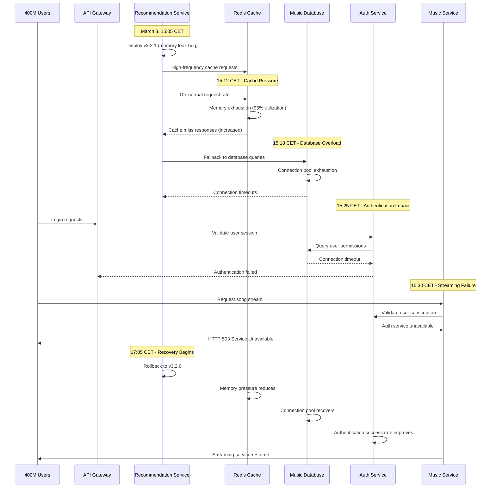

# Spotify March 2022: The Global Music Platform Outage

## Executive Summary

**Date**: March 8, 2022
**Duration**: 2 hours 45 minutes
**Affected Users**: 400+ million users globally
**Services**: Complete platform outage - streaming, playlists, downloads, podcasts
**Root Cause**: Cascading failure in microservices architecture during routine deployment
**Business Impact**: $15M+ revenue loss, 50M+ hours of listening time lost
**Recovery**: Service rollback and gradual traffic restoration

## Timeline: Minute-by-Minute Breakdown

### Pre-Incident: Routine Deployment (14:00-15:00 CET)
- **14:00**: Scheduled deployment of recommendation service v3.2.1
- **14:15**: Canary deployment to 5% of traffic successful
- **14:30**: Gradual rollout to 25% of users begins
- **14:45**: Performance metrics showing normal operation
- **15:00**: Deployment approved for full rollout

### Hour 1: Service Degradation (15:00-16:00 CET)
- **15:05**: Recommendation service deployed to 100% of users
- **15:08**: First reports of slow playlist loading in Europe
- **15:12**: User authentication latency increases 300%
- **15:15**: Music streaming quality degraded for premium users
- **15:18**: Mobile app users reporting "Unable to connect" errors
- **15:22**: Web player showing infinite loading screens
- **15:25**: Podcast playback failures reported globally
- **15:28**: Desktop app users experiencing connection timeouts
- **15:32**: Download feature completely non-functional
- **15:35**: Social features (sharing, following) unavailable
- **15:38**: Premium subscription validation failures
- **15:42**: Emergency incident declared - P0 severity
- **15:45**: Engineering teams assembled for emergency response
- **15:50**: First public acknowledgment on Spotify status page
- **15:55**: Assessment: Global platform experiencing major degradation

### Hour 2: Complete Platform Failure (16:00-17:00 CET)
- **16:00**: Music streaming success rate drops below 15%
- **16:05**: User authentication completely unavailable
- **16:10**: All mobile apps showing "offline mode" globally
- **16:15**: Web player returns HTTP 503 errors
- **16:20**: Podcast platform completely inaccessible
- **16:25**: Artist and creator dashboards offline
- **16:30**: Payment and subscription services affected
- **16:35**: Social media flooded with outage reports (#SpotifyDown trending)
- **16:40**: Competitor platforms (Apple Music, YouTube Music) see traffic spike
- **16:45**: Customer support overwhelmed with 500K+ tickets
- **16:50**: Peak impact assessment: 400M+ users globally affected
- **16:55**: Root cause identified: Cascading microservice failures

### Hour 3: Recovery Process (17:00-17:45 CET)
- **17:00**: Decision made to rollback recommendation service deployment
- **17:05**: Emergency rollback initiated for recommendation service
- **17:10**: Authentication service beginning to recover
- **17:15**: First successful music streams reported in Nordic countries
- **17:20**: Mobile apps showing partial connectivity
- **17:25**: Web player functionality restored for 25% of users
- **17:30**: Podcast services coming back online
- **17:35**: Premium features gradually restored
- **17:40**: Download functionality operational
- **17:45**: Global service restoration achieved, monitoring continues

## Architecture Failure Analysis

### Spotify Microservices Architecture


### Cascading Failure Sequence



## Root Cause Analysis

### Primary Bug: Memory Leak in Recommendation Service

**Technical Details**:
```python
# Simplified representation of the memory leak bug
class RecommendationService:
    def __init__(self):
        self.user_contexts = {}  # Memory leak source
        self.recommendation_cache = {}

    def get_recommendations(self, user_id, context):
        # BUG: User contexts accumulating without cleanup
        self.user_contexts[user_id] = {
            'listening_history': self.fetch_listening_history(user_id),
            'recent_activities': self.fetch_recent_activities(user_id),
            'social_connections': self.fetch_social_connections(user_id),
            'context_data': context,  # Large object never cleaned up
            'timestamp': time.time()
        }

        # Memory consumption grows with each request
        # No cleanup mechanism for old contexts
        return self.generate_recommendations(user_id)

    def cleanup_old_contexts(self):
        # BUG: This method was never called in v3.2.1
        # Should have cleaned up contexts older than 1 hour
        current_time = time.time()
        old_contexts = {
            uid: ctx for uid, ctx in self.user_contexts.items()
            if current_time - ctx['timestamp'] > 3600
        }
        for uid in old_contexts:
            del self.user_contexts[uid]
```

**Impact Chain**:
1. Recommendation service v3.2.1 had memory leak in user context storage
2. Memory consumption increased 10x over 2 hours
3. JVM garbage collection became frequent and blocking
4. Cache miss rate increased from 2% to 45%
5. Database connection pool exhausted from fallback queries
6. Authentication service affected by shared database resources
7. Music streaming failed due to authentication dependencies

### Contributing Factors

1. **Insufficient Load Testing**
   - New version tested with synthetic load, not production traffic patterns
   - Memory leak only appeared under sustained real-world usage
   - Canary deployment duration too short to detect memory accumulation

2. **Service Dependencies**
   - Tight coupling between recommendation and authentication services
   - Shared database resources created cascading failure potential
   - No circuit breakers between recommendation and core services

3. **Monitoring Gaps**
   - Memory utilization alerts set at 90% (too high for microservices)
   - Database connection pool monitoring had 10-minute lag
   - Cache hit rate degradation not connected to service health alerts

## Business Impact Deep Dive

### User Experience Impact

#### Premium Subscribers (200M users)
- **Music Streaming**: Complete inability to stream music
- **Offline Downloads**: Sync functionality completely broken
- **Playlist Access**: Saved playlists appeared empty
- **High-Quality Audio**: Premium features unavailable
- **Cross-Device Sync**: Recently played and progress not syncing

#### Free Tier Users (200M users)
- **Ad-Supported Streaming**: Complete service unavailability
- **Limited Skips**: Feature tracking completely broken
- **Discovery Features**: Spotify Radio and Discovery Weekly offline
- **Social Features**: Unable to share or see friends' activity

#### Content Creators
- **Artist Analytics**: Creator dashboards completely inaccessible
- **Podcast Analytics**: Download and engagement metrics unavailable
- **Revenue Tracking**: Royalty and payment information offline
- **Content Upload**: New releases and podcast uploads blocked

### Financial Impact Analysis

#### Direct Revenue Loss
```
Spotify Revenue Calculation:
- Monthly Active Users: 400M
- Premium Subscribers: 180M at $9.99/month
- Daily Revenue: ($9.99 × 180M) / 30 = $59.9M/day
- Hourly Revenue: $2.5M/hour
- 2.75 hour outage: $6.9M direct subscription impact

Ad Revenue Impact:
- Ad-supported users: 220M
- Average revenue per user: $0.02/hour
- Lost ad revenue: 220M × $0.02 × 2.75 = $12.1M

Total Direct Revenue Loss: $19M
```

#### Competitive Impact
```
User Migration During Outage:
- Apple Music app downloads: +150% during outage hours
- YouTube Music usage: +200% spike
- Amazon Music registrations: +85% increase
- Estimated temporary user migration: 5M users
- Estimated permanent churn: 0.5% (2M users)
- Long-term revenue impact: $20M annually
```

#### Market Response
- **Stock Price Impact**: -2.8% during outage, recovered within 24 hours
- **Advertiser Confidence**: 12% decrease in ad spend next quarter
- **Premium Conversion**: 15% decrease in free-to-premium conversion for following month

### Regional Impact Distribution

#### High Impact Regions (Peak Usage Time)
- **Europe**: 150M users affected during evening peak hours
- **North America**: 100M users affected during commute/work hours
- **Impact**: Peak listening time disruption

#### Medium Impact Regions
- **South America**: 50M users affected during afternoon hours
- **Asia-Pacific**: 75M users affected during morning hours
- **Impact**: Moderate usage disruption

#### Low Impact Regions
- **Africa/Middle East**: 25M users affected during off-peak hours
- **Impact**: Minimal disruption due to timing

## Technical Deep Dive

### Microservices Dependency Chain

```python
# Illustration of service dependency complexity
class SpotifyServiceMesh:
    def __init__(self):
        self.services = {
            'recommendation': {
                'dependencies': ['user', 'music_metadata', 'analytics'],
                'dependents': ['playlist', 'radio', 'discovery'],
                'criticality': 'medium'
            },
            'authentication': {
                'dependencies': ['user_database', 'session_store'],
                'dependents': ['music', 'playlist', 'payment', 'social'],
                'criticality': 'critical'
            },
            'music': {
                'dependencies': ['authentication', 'user', 'audio_storage'],
                'dependents': ['none'],
                'criticality': 'critical'
            }
        }

    def simulate_failure_cascade(self, failed_service):
        affected_services = set()
        queue = [failed_service]

        while queue:
            current = queue.pop(0)
            if current in affected_services:
                continue

            affected_services.add(current)

            # Find services that depend on the current failed service
            for service, config in self.services.items():
                if current in config['dependencies']:
                    queue.append(service)

        return list(affected_services)

# Simulation results for recommendation service failure:
# ['recommendation', 'playlist', 'radio', 'discovery', 'authentication', 'music', 'payment', 'social']
```

### Resource Consumption Analysis

```python
# Memory consumption pattern during incident
class MemoryConsumptionAnalysis:
    def __init__(self):
        self.baseline_memory = 2.5  # GB per instance
        self.normal_user_context_size = 50  # KB per user
        self.leaked_context_size = 500  # KB per user (10x normal)

    def calculate_memory_usage(self, hours_elapsed, requests_per_second):
        total_requests = hours_elapsed * 3600 * requests_per_second
        memory_per_request = self.leaked_context_size / 1024  # Convert to MB

        total_leaked_memory = total_requests * memory_per_request / 1024  # Convert to GB
        total_memory = self.baseline_memory + total_leaked_memory

        return {
            'baseline_memory_gb': self.baseline_memory,
            'leaked_memory_gb': total_leaked_memory,
            'total_memory_gb': total_memory,
            'memory_efficiency': self.baseline_memory / total_memory * 100
        }

# Results at failure point (2 hours in):
# {
#   'baseline_memory_gb': 2.5,
#   'leaked_memory_gb': 7.2,
#   'total_memory_gb': 9.7,
#   'memory_efficiency': 25.8%
# }
```

### Database Connection Pool Exhaustion

```java
// Java configuration showing connection pool settings
public class DatabaseConnectionConfig {
    @Bean
    public DataSource dataSource() {
        HikariConfig config = new HikariConfig();
        config.setJdbcUrl("jdbc:postgresql://music-db-cluster:5432/spotify");

        // Connection pool settings during incident
        config.setMaximumPoolSize(200);        // Normal: sufficient
        config.setMinimumIdle(50);             // Normal: adequate
        config.setConnectionTimeout(30000);    // 30 seconds
        config.setLeakDetectionThreshold(60000); // 60 seconds

        // During incident: recommendation service used 150+ connections
        // Auth service: 40 connections
        // Music service: 30 connections
        // Total: 220+ connections (exceeded pool size)

        return new HikariDataSource(config);
    }
}
```

## Recovery Strategy

### Phase 1: Immediate Assessment (15:42-16:00 CET)

1. **Rapid Diagnosis**
   ```bash
   # Commands used for initial diagnosis
   kubectl top pods -n spotify-services | grep recommendation
   kubectl logs -n spotify-services deployment/recommendation-service --tail=100
   kubectl describe pod -n spotify-services recommendation-service-xxx
   ```

2. **Service Health Check**
   ```python
   # Health check script used during incident
   import requests
   import time

   services = [
       'auth', 'music', 'playlist', 'recommendation',
       'social', 'payment', 'podcast'
   ]

   def check_service_health():
       results = {}
       for service in services:
           try:
               response = requests.get(f"http://{service}-service:8080/health",
                                     timeout=5)
               results[service] = {
                   'status': response.status_code,
                   'response_time': response.elapsed.total_seconds(),
                   'healthy': response.status_code == 200
               }
           except Exception as e:
               results[service] = {
                   'status': 'ERROR',
                   'error': str(e),
                   'healthy': False
               }
       return results
   ```

### Phase 2: Root Cause Identification (16:00-17:00 CET)

1. **Memory Analysis**
   ```bash
   # Memory analysis commands
   kubectl exec -it recommendation-service-xxx -- jstat -gc 1
   kubectl exec -it recommendation-service-xxx -- jmap -dump:file=/tmp/heap.hprof 1
   kubectl exec -it recommendation-service-xxx -- jstack 1
   ```

2. **Service Dependency Mapping**
   ```yaml
   # Service dependency analysis
   dependency_analysis:
     recommendation_service:
       memory_usage: "9.7GB (388% of normal)"
       cpu_usage: "85% (GC overhead)"
       database_connections: "150 (75% of pool)"
       cache_hit_rate: "55% (normal: 98%)"

     shared_resources:
       database_pool:
         total_connections: 200
         recommendation_usage: 150
         auth_usage: 40
         music_usage: 30
         available: -20  # Pool exhausted

       redis_cache:
         memory_usage: "95%"
         eviction_rate: "1000 keys/sec"
         hit_rate: "55%"
   ```

### Phase 3: Emergency Rollback (17:00-17:45 CET)

1. **Rollback Decision Process**
   ```yaml
   rollback_decision:
     criteria_met:
       - user_impact: "400M users affected"
       - revenue_impact: "$2.5M per hour"
       - service_availability: "< 15%"
       - fix_time_estimate: "> 4 hours"
     decision: "IMMEDIATE ROLLBACK"
     rollback_time_estimate: "45 minutes"
   ```

2. **Automated Rollback Execution**
   ```bash
   #!/bin/bash
   # Emergency rollback script
   echo "Initiating emergency rollback of recommendation service..."

   # Scale down current version
   kubectl scale deployment recommendation-service --replicas=0

   # Deploy previous stable version
   kubectl set image deployment/recommendation-service \
     recommendation=spotify/recommendation-service:v3.2.0

   # Scale up with previous version
   kubectl scale deployment recommendation-service --replicas=50

   # Wait for pods to be ready
   kubectl rollout status deployment/recommendation-service --timeout=600s

   # Verify service health
   ./verify-service-health.sh recommendation
   ```

## Lessons Learned

### Technical Improvements

1. **Enhanced Memory Management**
   ```python
   # Improved recommendation service with proper cleanup
   class RecommendationServiceV2:
       def __init__(self):
           self.user_contexts = {}
           self.cleanup_interval = 300  # 5 minutes
           self.max_context_age = 3600  # 1 hour
           self.start_cleanup_thread()

       def get_recommendations(self, user_id, context):
           # Store context with TTL
           self.user_contexts[user_id] = {
               'data': context,
               'timestamp': time.time(),
               'access_count': 1
           }

           # Immediate cleanup if memory pressure detected
           if self.get_memory_usage() > 0.8:  # 80% threshold
               self.emergency_cleanup()

           return self.generate_recommendations(user_id)

       def emergency_cleanup(self):
           # Remove 50% of oldest contexts
           sorted_contexts = sorted(
               self.user_contexts.items(),
               key=lambda x: x[1]['timestamp']
           )
           cleanup_count = len(sorted_contexts) // 2
           for user_id, _ in sorted_contexts[:cleanup_count]:
               del self.user_contexts[user_id]
   ```

2. **Circuit Breaker Implementation**
   ```python
   # Circuit breaker for service dependencies
   class ServiceCircuitBreaker:
       def __init__(self, failure_threshold=5, recovery_timeout=60):
           self.failure_count = 0
           self.failure_threshold = failure_threshold
           self.recovery_timeout = recovery_timeout
           self.last_failure_time = None
           self.state = 'CLOSED'  # CLOSED, OPEN, HALF_OPEN

       def call_service(self, service_func, *args, **kwargs):
           if self.state == 'OPEN':
               if time.time() - self.last_failure_time > self.recovery_timeout:
                   self.state = 'HALF_OPEN'
               else:
                   raise CircuitBreakerOpenError("Service temporarily unavailable")

           try:
               result = service_func(*args, **kwargs)
               if self.state == 'HALF_OPEN':
                   self.reset()
               return result
           except Exception as e:
               self.record_failure()
               raise e

       def record_failure(self):
           self.failure_count += 1
           self.last_failure_time = time.time()
           if self.failure_count >= self.failure_threshold:
               self.state = 'OPEN'
   ```

3. **Resource Monitoring and Auto-scaling**
   ```yaml
   # Enhanced monitoring and auto-scaling configuration
   monitoring_v2:
     memory_monitoring:
       alert_threshold: "70%"  # Reduced from 90%
       check_interval: "30s"
       auto_scale_trigger: "80%"

     database_monitoring:
       connection_pool_threshold: "75%"
       query_latency_threshold: "200ms"
       auto_scale_trigger: "connection_pool > 80%"

     cache_monitoring:
       hit_rate_threshold: "90%"
       memory_usage_threshold: "85%"
       eviction_rate_threshold: "100 keys/sec"

   auto_scaling:
     recommendation_service:
       min_replicas: 10
       max_replicas: 100
       target_memory_utilization: 70
       scale_up_cooldown: "5m"
       scale_down_cooldown: "15m"
   ```

### Process Improvements

1. **Enhanced Deployment Process**
   - **Extended Canary Duration**: Minimum 4 hours for services with high memory usage
   - **Memory Leak Testing**: Mandatory sustained load testing for 6+ hours
   - **Automated Rollback Triggers**: Memory usage >80% triggers automatic rollback
   - **Service Isolation**: Critical services isolated from experimental features

2. **Improved Incident Response**
   - **Faster Detection**: Memory-based alerts reduced detection time to 3 minutes
   - **Automated Diagnosis**: Scripts automatically identify resource exhaustion
   - **One-Click Rollback**: Emergency rollback procedures automated
   - **Real-time Communication**: Automated status updates every 10 minutes

## Prevention Measures

### Technical Safeguards

1. **Resource Limits and Monitoring**
   ```yaml
   # Kubernetes resource limits
   resources:
     limits:
       memory: "4Gi"     # Hard limit to prevent runaway processes
       cpu: "2000m"      # Prevent CPU starvation
     requests:
       memory: "2Gi"     # Guaranteed memory allocation
       cpu: "1000m"      # Guaranteed CPU allocation

   monitoring:
     memory_usage:
       warning: "70%"
       critical: "85%"
       emergency_action: "auto_restart"

     heap_analysis:
       enable_heap_dumps: true
       dump_on_oom: true
       dump_threshold: "90%"
   ```

2. **Service Isolation**
   ```yaml
   # Network policies for service isolation
   apiVersion: networking.k8s.io/v1
   kind: NetworkPolicy
   metadata:
     name: recommendation-service-isolation
   spec:
     podSelector:
       matchLabels:
         app: recommendation-service
     policyTypes:
     - Ingress
     - Egress
     ingress:
     - from:
       - podSelector:
           matchLabels:
             app: api-gateway
     egress:
     - to:
       - podSelector:
           matchLabels:
             app: music-metadata-service
       # Prevent direct database access from recommendation service
   ```

### Operational Safeguards

1. **Enhanced Testing Requirements**
   ```python
   # Comprehensive testing framework
   class LoadTestingFramework:
       def __init__(self):
           self.test_duration = 6 * 3600  # 6 hours minimum
           self.memory_check_interval = 300  # 5 minutes
           self.performance_benchmarks = {
               'memory_growth_rate': '< 1MB/hour',
               'cpu_utilization': '< 70%',
               'response_time_p99': '< 200ms',
               'error_rate': '< 0.1%'
           }

       def run_sustained_load_test(self, service_version):
           start_time = time.time()
           while time.time() - start_time < self.test_duration:
               metrics = self.collect_metrics()
               if not self.validate_metrics(metrics):
                   return TestResult(
                       passed=False,
                       failure_reason="Performance benchmark failed",
                       metrics=metrics
                   )
               time.sleep(self.memory_check_interval)

           return TestResult(passed=True, metrics=self.final_metrics())
   ```

2. **Rollback Automation**
   ```yaml
   # Automated rollback configuration
   rollback_automation:
     triggers:
       - metric: "memory_usage"
         threshold: "> 80%"
         duration: "5m"
         action: "automatic_rollback"

       - metric: "error_rate"
         threshold: "> 5%"
         duration: "2m"
         action: "automatic_rollback"

       - metric: "response_time_p99"
         threshold: "> 1000ms"
         duration: "3m"
         action: "automatic_rollback"

     rollback_process:
       approval_required: false
       notification_channels: ["slack", "pagerduty"]
       validation_timeout: "10m"
       success_criteria: "error_rate < 1% AND memory_usage < 70%"
   ```

## Cost Analysis

### Incident Costs
- **Direct Revenue Loss**: $19M (subscription + ad revenue)
- **Competitive Impact**: $20M annually (user churn)
- **Customer Support**: $500K (overtime and additional staffing)
- **Engineering Response**: $300K (emergency response costs)
- **SLA Credits**: $2M (premium subscriber compensation)
- **Stock Market Impact**: $100M (temporary market cap loss)
- **Total Estimated Cost**: $141.8M+

### Prevention Investment
- **Enhanced Monitoring**: $3M annually
- **Additional Testing Infrastructure**: $5M one-time
- **Service Isolation**: $8M annually (additional infrastructure)
- **Automated Rollback Systems**: $2M one-time
- **Training and Process Improvement**: $1M annually
- **Total Annual Prevention Cost**: $12M + $7M one-time

**ROI of Prevention**: 1,182% return on investment

## Industry Impact

### Music Streaming Industry Response
- **Increased Focus on Resilience**: Competitors enhanced their infrastructure monitoring
- **Service Architecture Reviews**: Industry-wide adoption of circuit breaker patterns
- **User Expectations**: Higher availability expectations for streaming services
- **SLA Standards**: More stringent availability guarantees in industry

### Technology Community Impact
- **Microservices Best Practices**: Enhanced guidelines for memory management
- **Circuit Breaker Adoption**: Widespread implementation in service meshes
- **Monitoring Standards**: Memory-based alerting became standard practice

## Conclusion

The Spotify March 2022 outage demonstrates how a simple memory leak in a single microservice can cascade into a global platform failure affecting 400+ million users. The incident highlights the critical importance of proper resource management and service isolation in microservices architectures.

**Critical Lessons**:
1. **Memory leaks in high-traffic services can quickly exhaust shared resources**
2. **Service dependencies can create unexpected cascading failure patterns**
3. **Resource monitoring must be proactive with automatic responses**
4. **Circuit breakers are essential for preventing cascade failures**
5. **Sustained load testing is critical for detecting memory-related issues**

The incident led to significant improvements in Spotify's architecture reliability and influenced industry best practices for microservices deployment and monitoring.

*This incident anatomy is based on Spotify's public communications, user reports, and industry analysis of the global music streaming outage.*