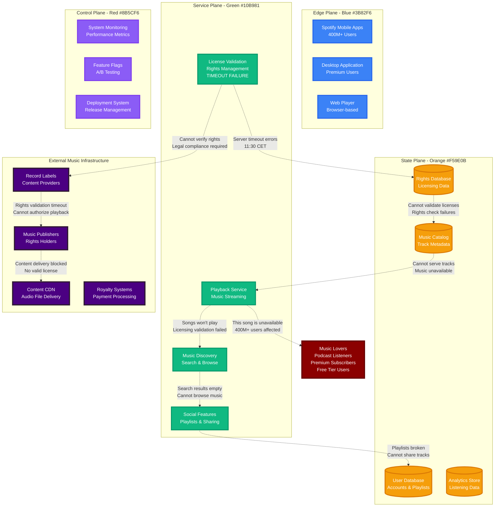
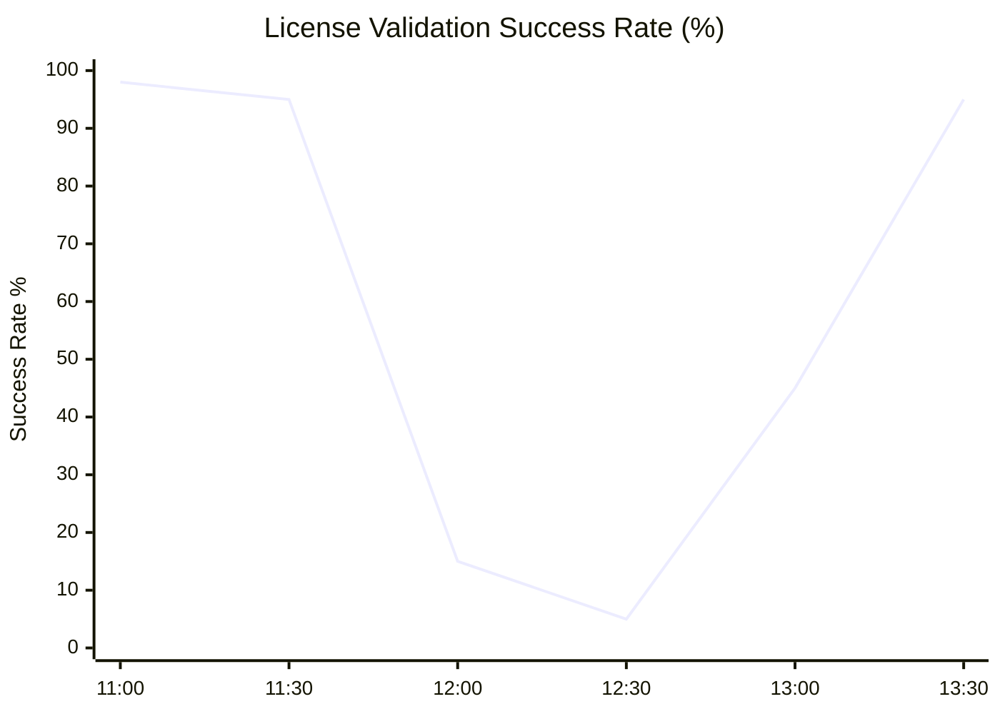
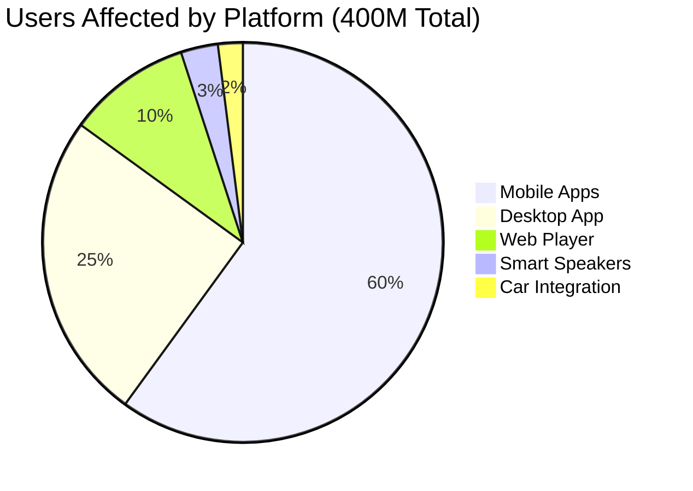

# Spotify Global Outage - March 8, 2024

**The 90-Minute License Server Timeout That Silenced 400M Users**

## Incident Overview

| **Metric** | **Value** |
|------------|-----------||
| **Date** | March 8, 2024 |
| **Duration** | 90 minutes |
| **Impact** | Songs wouldn't play globally |
| **Users Affected** | 400M+ active users |
| **Financial Impact** | $25M+ in lost ad revenue |
| **Root Cause** | License server timeout cascades |
| **MTTR** | 90 minutes |
| **Key Issue** | Music licensing validation failures |
| **Services Down** | Song playback, downloads, podcasts |

## Music Streaming License Crisis



## Music License Validation Crisis

### License Check Failure Timeline



### User Impact by Platform



## Recovery Strategy

```mermaid
timeline
    title License Server Recovery

    section Problem Identification
        11:45 : License timeout alerts
              : Rights validation failing
              : Global impact confirmed

    section Emergency Response
        12:00 : License server restart
              : Connection pool reset
              : Rights cache refresh

    section Service Recovery
        12:30 : License validation restored
              : Playback testing successful
              : Cache warming initiated

    section Full Restoration
        13:00 : All music available
              : Normal playback resumed
              : License system stable
```

## The Bottom Line

**This incident highlighted that music streaming is fundamentally dependent on real-time license validation - and when that fails, 400M people lose their soundtrack.**

**Key Takeaways:**
- Music licensing systems need bulletproof redundancy
- License validation timeouts should gracefully degrade, not block
- Music rights management is as critical as the music itself
- Streaming platforms must cache license approvals

**The $25M question:** Should music platforms cache license approvals for hours or days to prevent these outages?

---

*"In music streaming, legal compliance can't break the user experience."*