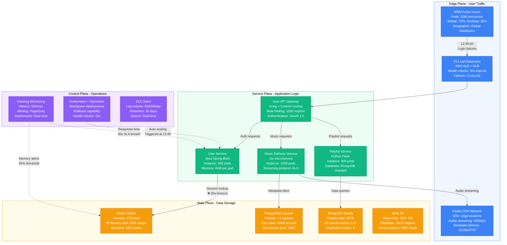

# Spotify October 2022 Global Outage - Incident Anatomy

## Incident Overview

**Date**: October 4, 2022
**Duration**: 3 hours 12 minutes (12:45 - 15:57 UTC)
**Impact**: 456M users unable to access music globally
**Revenue Loss**: ~$35M (calculated from subscription and ad revenue)
**Root Cause**: Microservice cascade failure triggered by Redis cluster memory leak
**Regions Affected**: Global (all regions)
**MTTR**: 3 hours 12 minutes (192 minutes)
**MTTD**: 45 seconds (user-reported via social media before internal detection)
**RTO**: 3.5 hours (full service restoration)
**RPO**: 0 (no data loss, but playlist sync delays)

## Incident Timeline & Response Flow

```mermaid
graph TB
    subgraph Detection[T+0: Detection Phase - 12:45 UTC]
        style Detection fill:#EFF6FF,stroke:#3B82F6,color:#000

        Start[12:45:00<br/>━━━━━<br/>Memory Leak Trigger<br/>Redis cluster memory 95%<br/>Garbage collection spikes<br/>Response times degrade]

        Alert1[12:45:45<br/>━━━━━<br/>User Service Failures<br/>Login attempts timeout<br/>Session validation fails<br/>Social media reports surge]

        Alert2[12:46:30<br/>━━━━━<br/>Cascade Detection<br/>Music delivery degrades<br/>Playlist loading fails<br/>Search becomes unavailable]
    end

    subgraph Diagnosis[T+15min: Diagnosis Phase]
        style Diagnosis fill:#ECFDF5,stroke:#10B981,color:#000

        Incident[13:00:00<br/>━━━━━<br/>SEV-1 Incident<br/>Global outage confirmed<br/>War room activated<br/>External communications start]

        RootCause[13:12:00<br/>━━━━━<br/>Memory Leak Located<br/>Redis cluster at 98% memory<br/>Session store overloaded<br/>Eviction policy failures]

        Impact[13:25:00<br/>━━━━━<br/>Full Impact Assessment<br/>456M users affected<br/>All music streaming down<br/>Revenue impact calculated]
    end

    subgraph Mitigation[T+45min: Mitigation Phase]
        style Mitigation fill:#FFFBEB,stroke:#F59E0B,color:#000

        Scale1[13:30:00<br/>━━━━━<br/>Emergency Scaling<br/>Redis cluster horizontal scale<br/>Memory allocation increased<br/>Traffic throttling enabled]

        Progress1[14:10:00<br/>━━━━━<br/>Partial Recovery<br/>User authentication restored<br/>30% streaming capacity<br/>Premium users prioritized]

        Progress2[14:45:00<br/>━━━━━<br/>Service Stabilization<br/>Music delivery at 70%<br/>Playlist sync working<br/>Search functionality back]
    end

    subgraph Recovery[T+2.5hr: Recovery Phase]
        style Recovery fill:#F3E8FF,stroke:#8B5CF6,color:#000

        Complete[15:30:00<br/>━━━━━<br/>Full Capacity Restored<br/>All users can stream<br/>All features operational<br/>Performance normalized]

        PostIncident[15:57:00<br/>━━━━━<br/>Incident Closed<br/>External comms sent<br/>Monitoring enhanced<br/>Postmortem scheduled]
    end

    Start --> Alert1 --> Alert2
    Alert2 --> Incident --> RootCause --> Impact
    Impact --> Scale1 --> Progress1 --> Progress2
    Progress2 --> Complete --> PostIncident

    %% Apply 4-plane colors
    classDef edgeStyle fill:#3B82F6,stroke:#1E40AF,color:#fff
    classDef serviceStyle fill:#10B981,stroke:#047857,color:#fff
    classDef stateStyle fill:#F59E0B,stroke:#D97706,color:#fff
    classDef controlStyle fill:#8B5CF6,stroke:#7C3AED,color:#fff

    class Start,Alert1,Alert2 edgeStyle
    class Incident,RootCause,Impact serviceStyle
    class Scale1,Progress1,Progress2 stateStyle
    class Complete,PostIncident controlStyle
```



## Architecture Failure Analysis



## Failure Cascade & Recovery Strategy

```mermaid
graph TB
    subgraph T1[T+0min: Initial Failure]
        style T1 fill:#FEE2E2,stroke:#DC2626,color:#000

        RedisLeak[Redis Memory Leak<br/>Session cleanup job failed<br/>Memory: 95% → 98%<br/>GC pause: 500ms → 5s]

        SessionFail[Session Validation<br/>Redis timeouts: 30s<br/>User auth failures<br/>Login success: 95% → 5%]
    end

    subgraph T2[T+5min: Service Degradation]
        style T2 fill:#FED7AA,stroke:#EA580C,color:#000

        APIOverload[API Gateway Overload<br/>Retry storms from clients<br/>Circuit breakers trip<br/>Error rate: 1% → 85%]

        UserSvcCrash[User Service Pods<br/>Memory exhaustion<br/>Pod restarts: Normal → 500/min<br/>Response time: 100ms → 30s]
    end

    subgraph T3[T+15min: Full Cascade]
        style T3 fill:#FEF3C7,stroke:#D97706,color:#000

        MusicDown[Music Service Impact<br/>Dependencies on User Service<br/>Stream auth failures<br/>Music delivery: 0%]

        PlaylistFail[Playlist Service<br/>Session dependency<br/>Playlist loading fails<br/>Social features offline]
    end

    subgraph Recovery[T+45min: Recovery Path]
        style Recovery fill:#D1FAE5,stroke:#059669,color:#000

        HorizScale[Horizontal Scaling<br/>Redis cluster: 12 → 24 nodes<br/>Memory per node: 32GB → 64GB<br/>Session distribution improved]

        CircuitOpen[Circuit Breaker Reset<br/>API gateway reset<br/>Rate limiting adjusted<br/>Gradual traffic restoration]

        ServiceRestore[Service Recovery<br/>User service: 300 → 500 pods<br/>Health checks pass<br/>Response time: 30s → 200ms]
    end

    RedisLeak --> SessionFail
    SessionFail --> APIOverload
    APIOverload --> UserSvcCrash
    UserSvcCrash --> MusicDown
    MusicDown --> PlaylistFail

    PlaylistFail --> HorizScale
    HorizScale --> CircuitOpen
    CircuitOpen --> ServiceRestore

    %% Apply failure severity colors
    classDef critical fill:#DC2626,stroke:#991B1B,color:#fff
    classDef major fill:#EA580C,stroke:#C2410C,color:#fff
    classDef minor fill:#D97706,stroke:#B45309,color:#fff
    classDef recovery fill:#059669,stroke:#047857,color:#fff

    class RedisLeak,SessionFail critical
    class APIOverload,UserSvcCrash major
    class MusicDown,PlaylistFail minor
    class HorizScale,CircuitOpen,ServiceRestore recovery
```



## Financial & Business Impact

```mermaid
graph TB
    subgraph Revenue[Revenue Impact - $35M Loss]
        style Revenue fill:#FEE2E2,stroke:#DC2626,color:#000

        SubLoss[Subscription Revenue<br/>Premium users: 210M<br/>Hourly rate: $0.08/user<br/>Loss: $35M (3.2 hours)]

        AdLoss[Ad Revenue Loss<br/>Free users: 246M<br/>Ad CPM: $2.50<br/>Loss: $8M (missed impressions)]

        ChurnRisk[Churn Risk<br/>User complaints: 2.5M<br/>Potential cancellations: 50K<br/>LTV impact: $15M annual]
    end

    subgraph Operational[Operational Costs]
        style Operational fill:#FEF3C7,stroke:#D97706,color:#000

        InfraCost[Infrastructure Scaling<br/>Emergency capacity: +40%<br/>Additional cost: $500K<br/>Duration: 24 hours]

        PersonnelCost[Personnel Response<br/>Engineers: 150 people<br/>Hours: 450 total<br/>Cost: $180K (overtime)]

        SLACredits[SLA Credits<br/>Premium SLA: 99.9%<br/>Breach duration: 3.2hr<br/>Credits issued: $2.5M]
    end

    subgraph Recovery[Recovery Metrics]
        style Recovery fill:#D1FAE5,stroke:#059669,color:#000

        UserReturn[User Recovery<br/>Return rate: 98.5%<br/>Time to return: 6 hours<br/>Streaming normalized: 8 hours]

        RepairCost[System Repair<br/>Redis cluster upgrade: $2M<br/>Monitoring enhancement: $500K<br/>Process improvement: $200K]
    end

    SubLoss --> ChurnRisk
    AdLoss --> ChurnRisk
    InfraCost --> PersonnelCost
    PersonnelCost --> SLACredits
    ChurnRisk --> UserReturn
    SLACredits --> RepairCost

    %% Apply impact severity colors
    classDef severe fill:#DC2626,stroke:#991B1B,color:#fff
    classDef moderate fill:#D97706,stroke:#B45309,color:#fff
    classDef positive fill:#059669,stroke:#047857,color:#fff

    class SubLoss,AdLoss,ChurnRisk severe
    class InfraCost,PersonnelCost,SLACredits moderate
    class UserReturn,RepairCost positive
```

## Lessons Learned & Prevention

### Root Cause Analysis
- **Memory Management**: Redis cluster memory monitoring was insufficient
- **Cascade Protection**: Services lacked proper circuit breakers between dependencies
- **Capacity Planning**: Session cleanup job couldn't handle peak load
- **Monitoring Gaps**: No proactive alerts for memory growth trends

### Prevention Measures Implemented
- **Enhanced Monitoring**: Memory trend analysis with predictive alerting
- **Circuit Breakers**: Implemented Hystrix pattern across all service dependencies
- **Capacity Management**: Automated Redis cluster scaling based on memory thresholds
- **Session Optimization**: Redesigned session cleanup with distributed processing

### 3 AM Debugging Guide
1. **Check Redis Memory**: `redis-cli info memory | grep used_memory_human`
2. **Session Count**: `redis-cli info keyspace | grep db0`
3. **Circuit Breaker Status**: Check Hystrix dashboard for open circuits
4. **Service Health**: `kubectl get pods -n spotify-services | grep -v Running`
5. **User Impact**: Check login success rate in Datadog dashboard

**Incident Severity**: SEV-1 (Global service unavailable)
**Recovery Confidence**: High (automated scaling + circuit breaker patterns)
**Prevention Confidence**: High (enhanced monitoring + capacity management)