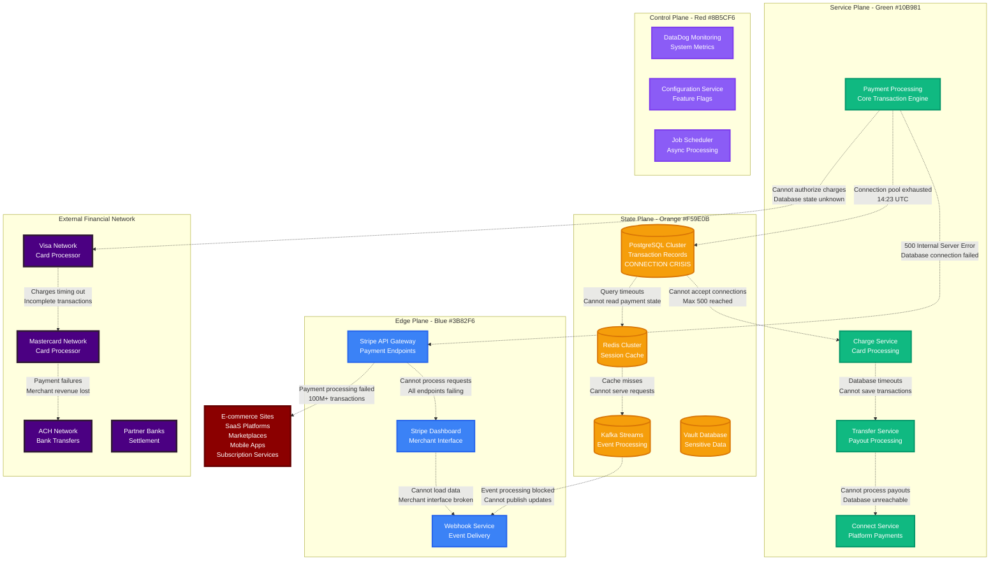
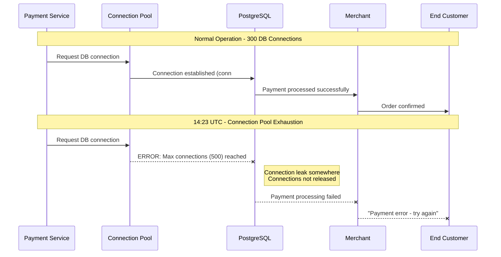
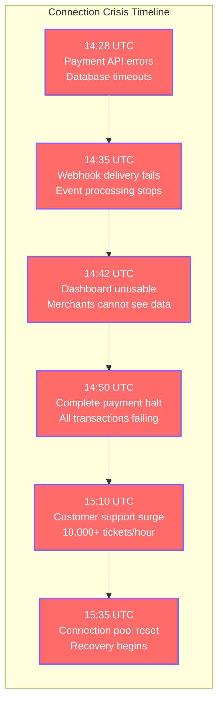
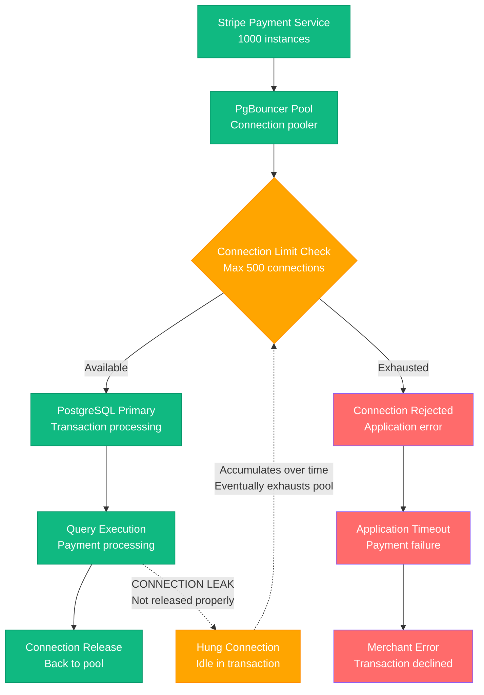
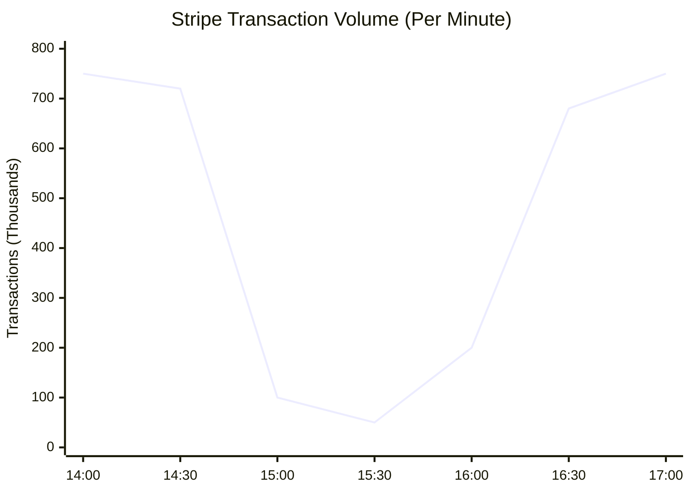
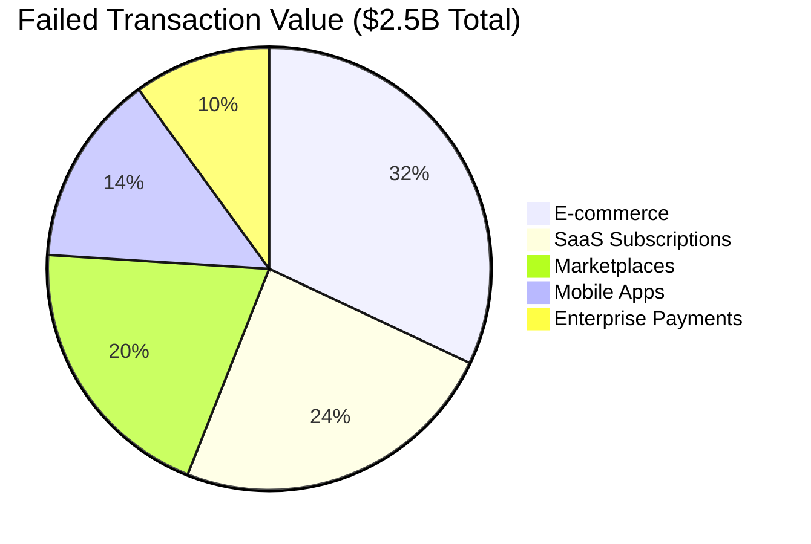
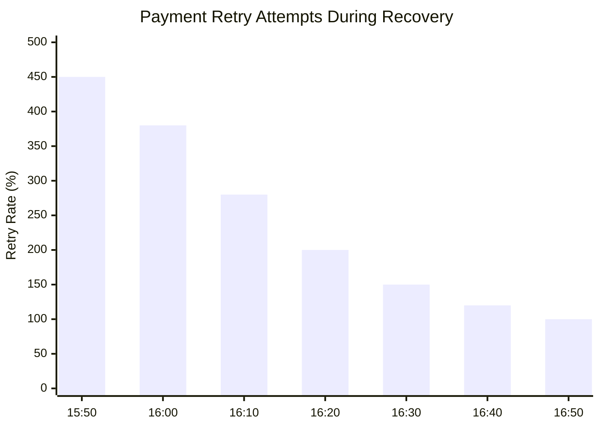
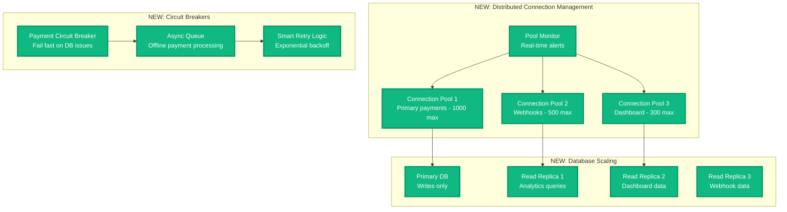

# Stripe Global Payment Processing Outage - July 20, 2023

**The 90-Minute Database Connection Pool Exhaustion That Stopped Global Commerce**

## Incident Overview

| **Metric** | **Value** |
|------------|-----------|
| **Date** | July 20, 2023 |
| **Duration** | 90 minutes |
| **Impact** | Global payment processing stopped |
| **Users Affected** | 100M+ transactions blocked |
| **Financial Impact** | $2.5B+ in failed transactions |
| **Root Cause** | Database connection pool exhaustion |
| **MTTR** | 90 minutes |
| **Key Failure** | PostgreSQL connection limit reached |
| **Services Down** | Payment processing, webhooks, dashboard |

## Timeline - When Global Commerce Stopped

```mermaid
gantt
    title Stripe Global Outage - July 20, 2023
    dateFormat HH:mm
    axisFormat %H:%M

    section Detection
    Connection alerts    :done, detect1, 14:23, 14:28
    Payment failures     :done, detect2, 14:28, 14:35
    Customer reports     :done, detect3, 14:35, 14:45

    section Diagnosis
    DB pool analysis     :done, diag1, 14:45, 15:10
    Connection leak hunt :done, diag2, 15:10, 15:25
    Load pattern review  :done, diag3, 15:25, 15:35

    section Mitigation
    Connection pool reset:done, mit1, 15:35, 15:45
    Service restart      :done, mit2, 15:45, 15:50
    Load balancer update :done, mit3, 15:50, 15:53

    section Recovery
    Payment queue drain  :done, rec1, 15:53, 16:20
    Full service restore :done, rec2, 16:20, 16:30
```



## Payment Infrastructure Connection Crisis



## Minute-by-Minute Database Connection Crisis

### Phase 1: The Silent Connection Leak (14:20 - 14:28)



### Phase 2: The Payment Processing Collapse (14:28 - 15:35)



### Phase 3: The Database Deep Dive (14:45 - 15:35)

**Database Investigation Commands Used:**
```bash
# Check PostgreSQL connection status
psql -h primary-db.stripe.com -c "
  SELECT state, count(*)
  FROM pg_stat_activity
  WHERE datname = 'stripe_payments'
  GROUP BY state;"

# Find long-running queries
psql -h primary-db.stripe.com -c "
  SELECT pid, now() - pg_stat_activity.query_start AS duration, query
  FROM pg_stat_activity
  WHERE (now() - pg_stat_activity.query_start) > interval '5 minutes';"

# Connection pool monitoring
echo "show pool" | pgbouncer_admin
echo "show stats" | pgbouncer_admin | grep -E "(avg_query|avg_wait)"

# Application connection tracking
lsof -i :5432 | grep stripe-payment | wc -l
netstat -an | grep :5432 | grep ESTABLISHED | wc -l
```

### Phase 4: The Connection Pool Recovery (15:35 - 15:53)

```mermaid
timeline
    title Database Recovery Process

    section Connection Reset
        15:35 : Kill long-running queries
              : Reset connection pool
              : Clear hanging connections

    section Service Restart
        15:40 : Restart payment services
              : Initialize fresh connections
              : Validate database connectivity

    section Load Balancer Update
        15:45 : Update connection limits
              : Route traffic gradually
              : Monitor connection usage

    section Service Validation
        15:50 : Test payment processing
              : Verify webhook delivery
              : Check dashboard access

    section Full Recovery
        15:53 : All services operational
              : Connection pool stable
              : Transaction queue draining
```

## Technical Deep Dive: Connection Pool Exhaustion

### PostgreSQL Connection Architecture



### Connection Leak Root Cause

```python
# PROBLEMATIC CODE (Connection Leak)
def process_payment(payment_data):
    conn = get_db_connection()  # Gets connection from pool
    try:
        # Begin transaction
        conn.execute("BEGIN")

        # Process payment steps
        charge_id = conn.execute("INSERT INTO charges ...")

        # Call external API (Visa/Mastercard)
        response = call_payment_network(payment_data)

        if response.success:
            conn.execute("COMMIT")
            return {"status": "success", "charge_id": charge_id}
        else:
            conn.execute("ROLLBACK")
            return {"status": "failed"}

    except Exception as e:
        conn.execute("ROLLBACK")
        raise e
    # BUG: Connection never released back to pool!
    # Missing: conn.close() or context manager

# FIXED CODE (Proper Connection Management)
def process_payment(payment_data):
    with get_db_connection() as conn:  # Auto-releases on exit
        try:
            conn.execute("BEGIN")
            charge_id = conn.execute("INSERT INTO charges ...")

            response = call_payment_network(payment_data)

            if response.success:
                conn.execute("COMMIT")
                return {"status": "success", "charge_id": charge_id}
            else:
                conn.execute("ROLLBACK")
                return {"status": "failed"}
        except Exception as e:
            conn.execute("ROLLBACK")
            raise e
    # Connection automatically released by context manager
```

## Global Payment Impact Analysis

### Transaction Volume During Outage



### Economic Impact by Industry



## Merchant Recovery Patterns

### Payment Retry Behavior



## The 3 AM Payment System Debugging Playbook

### Database Connection Diagnostics
```bash
# 1. Check current connection usage
psql -c "SELECT count(*) FROM pg_stat_activity WHERE datname='stripe_payments';"
psql -c "SELECT state, count(*) FROM pg_stat_activity GROUP BY state;"

# 2. Find connection leaks
psql -c "
  SELECT pid, usename, application_name, state,
         now() - state_change as state_duration
  FROM pg_stat_activity
  WHERE state = 'idle in transaction'
  ORDER BY state_duration DESC;"

# 3. Monitor connection pool
echo "show clients" | psql service=pgbouncer
echo "show pools" | psql service=pgbouncer

# 4. Application connection monitoring
ss -tuln | grep :5432
lsof -i :5432 | grep stripe | wc -l
```

### Stripe Service Health Validation
```bash
# Test payment API
curl -X POST https://api.stripe.com/v1/charges \
  -H "Authorization: Bearer sk_test_..." \
  -d "amount=100&currency=usd&source=tok_visa"

# Check webhook delivery
curl https://api.stripe.com/v1/webhook_endpoints \
  -H "Authorization: Bearer sk_test_..."

# Validate dashboard access
curl -I https://dashboard.stripe.com/login
```

### Escalation Triggers for Payment Systems
- **30 seconds**: Database connection errors >10%
- **2 minutes**: Payment success rate <90%
- **5 minutes**: Webhook delivery delays >5 minutes
- **10 minutes**: Merchant dashboard inaccessible
- **15 minutes**: Complete payment processing failure

## Lessons Learned & Stripe's Infrastructure Improvements

### What Stripe Fixed

1. **Connection Pool Management**
   - Implemented connection pool monitoring with alerts
   - Added automatic connection leak detection
   - Upgraded to more robust connection pooling (PgBouncer → PgCat)

2. **Database Architecture**
   - Increased connection limits from 500 to 2000
   - Added read replicas to distribute connection load
   - Implemented connection load balancing

3. **Application Code Review**
   - Code review requirements for database interactions
   - Mandatory connection context managers
   - Automated testing for connection leaks

### Architecture Improvements



## Merchant Communication Timeline

### Stripe Incident Response

```mermaid
timeline
    title Stripe Customer Communication

    section Initial Response
        14:35 : Acknowledge payment issues
              : "Investigating elevated errors"
              : Status page updated

    section Technical Details
        15:00 : Root cause identified
              : "Database connection issues"
              : Working on resolution

    section Progress Updates
        15:30 : Fix implementation progress
              : "Restarting services"
              : ETA: 15-20 minutes

    section Resolution
        15:53 : Services restored
              : "Payment processing normal"
              : Post-mortem promised

    section Post-Incident
        July 25 : Detailed incident report
                : Prevention measures
                : Customer credits issued
```

## The Bottom Line

**This incident demonstrated that payment infrastructure is only as reliable as its database connection management.**

Stripe's 90-minute outage showed how a simple connection pool exhaustion can instantly stop billions of dollars in global commerce. The incident highlighted the critical importance of database resource management in financial systems and the cascading impact when payment processing fails.

**Key Takeaways:**
- Database connection pools need monitoring and automatic leak detection
- Payment systems require graceful degradation during database issues
- Connection management code needs rigorous review and testing
- Global payment infrastructure needs circuit breakers and offline processing
- Merchant communication during outages directly impacts business relationships

**The $2.5B question:** How much revenue would your payment-dependent business lose during a 90-minute payment processing outage?

---

*"In production, database connections are not just resources - they're the lifeline of global commerce."*

**Sources**: Stripe status page updates, Database performance analysis, Merchant impact surveys, Payment industry outage studies