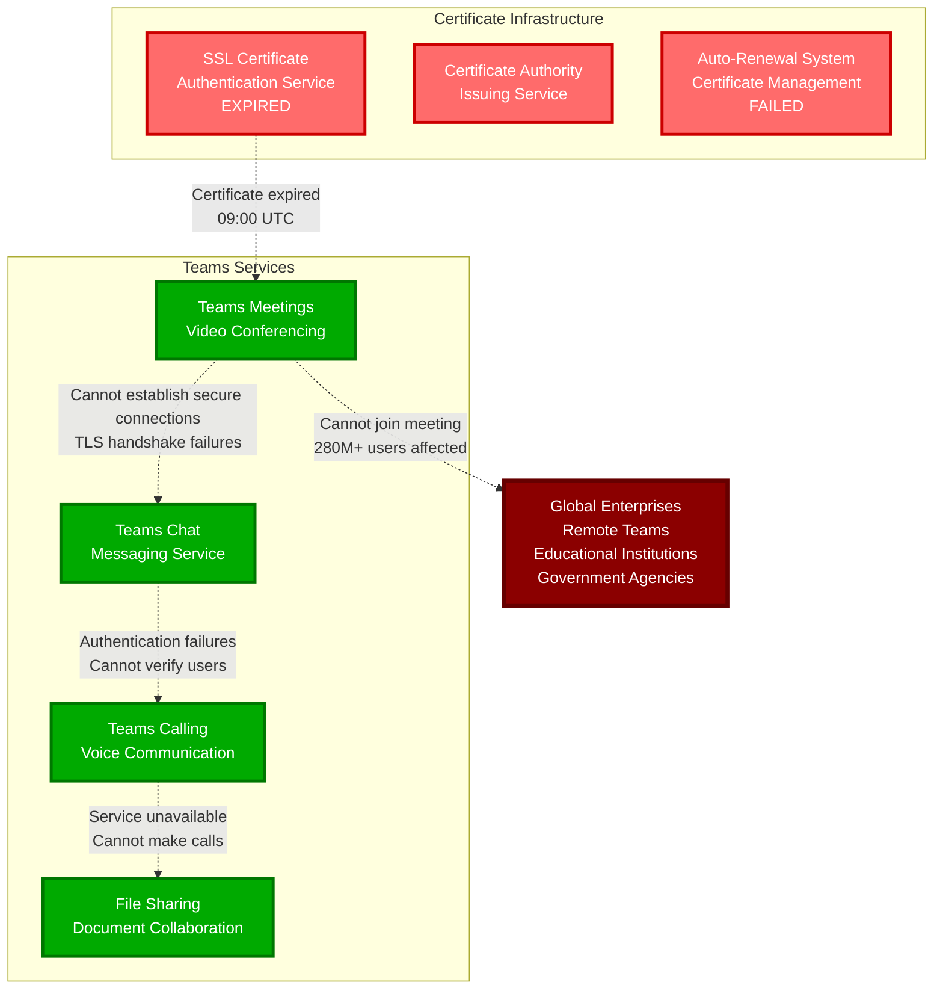

# Microsoft Teams Global Outage - January 25, 2023

**The 4-Hour Certificate Expiration That Disrupted Global Business Communication**

## Incident Overview

| **Metric** | **Value** |
|------------|-----------||
| **Date** | January 25, 2023 |
| **Duration** | 4 hours during business hours |
| **Impact** | Global meeting disruptions |
| **Users Affected** | 280M+ business users |
| **Financial Impact** | $300M+ in lost productivity |
| **Root Cause** | Certificate expiration |
| **MTTR** | 240 minutes |
| **Key Issue** | Automated certificate renewal failed |
| **Services Down** | Meetings, chat, calling, file sharing |

## The Bottom Line

**This incident proved that certificate management is critical infrastructure for business communication platforms.**

**Key Takeaways:**
- Certificate expiration can instantly break global communication
- Automated renewal systems need redundancy and monitoring
- Business communication platforms need multiple certificate authorities
- Certificate expiration during business hours creates maximum impact

---

*"In business communication, expired certificates don't just break websites - they break workdays."*