# Twitter July 2023 Rate Limiting Incident - Incident Anatomy

## Incident Overview

**Date**: July 1, 2023
**Duration**: 8 hours (12:00 - 20:00 UTC)
**Impact**: Aggressive rate limiting effectively blocked most users from viewing tweets
**Revenue Loss**: ~$50M (estimated ad revenue loss and user engagement)
**Root Cause**: Policy change implementation error - rate limits applied to all users including reading tweets
**Scope**: Global platform - all Twitter users affected
**MTTR**: 8 hours (multiple adjustment cycles)
**MTTD**: 5 minutes (immediate user reports and monitoring)
**RTO**: 2 hours (target - significantly missed)
**RPO**: 0 (no data loss, access restriction issue)

## Incident Timeline & Response Flow

```mermaid
graph TB
    subgraph Detection[T+0: Detection Phase - 12:00 UTC]
        style Detection fill:#FFE5E5,stroke:#8B5CF6,color:#000

        Start[12:00:00<br/>━━━━━<br/>Rate Limit Policy<br/>New policy deployment<br/>Anti-scraping measures<br/>Global rate limits]

        Alert1[12:05:30<br/>━━━━━<br/>User Complaints<br/>Cannot view tweets<br/>"Rate limit exceeded"<br/>Timeline not loading]

        Alert2[12:10:00<br/>━━━━━<br/>Massive User Impact<br/>Verified users affected<br/>Basic tweet viewing blocked<br/>API completely restricted]
    end

    subgraph Escalation[T+10min: Escalation Phase]
        style Escalation fill:#FFF5E5,stroke:#F59E0B,color:#000

        PublicResponse[12:15:00<br/>━━━━━<br/>Elon Musk Tweet<br/>"To address extreme<br/>levels of data scraping"<br/>Temporary limits announced]

        LimitDetails[12:30:00<br/>━━━━━<br/>Limit Specifications<br/>Verified: 6,000 posts/day<br/>Unverified: 600 posts/day<br/>New unverified: 300/day]

        UserBacklash[13:00:00<br/>━━━━━<br/>User Outrage<br/>Twitter trending topics<br/>Users cannot browse<br/>Mass user exodus threats]
    end

    subgraph Adjustments[T+1hr: Multiple Adjustment Cycles]
        style Adjustments fill:#FFFFE5,stroke:#CCCC00,color:#000

        FirstAdjust[13:30:00<br/>━━━━━<br/>First Adjustment<br/>Verified: 8,000 posts/day<br/>Unverified: 800 posts/day<br/>New users: 400/day]

        SecondAdjust[15:00:00<br/>━━━━━<br/>Second Adjustment<br/>Verified: 10,000 posts/day<br/>Unverified: 1,000 posts/day<br/>New users: 500/day]

        ThirdAdjust[16:30:00<br/>━━━━━<br/>Third Adjustment<br/>Further increases<br/>User feedback-driven<br/>Still restrictive]
    end

    subgraph Recovery[T+6hr: Partial Recovery]
        style Recovery fill:#E5FFE5,stroke:#10B981,color:#000

        PolicyRevision[18:00:00<br/>━━━━━<br/>Policy Revision<br/>Limits relaxed significantly<br/>Basic browsing restored<br/>Power users still restricted]

        MonitoringMode[19:00:00<br/>━━━━━<br/>Monitoring Mode<br/>Data scraping detection<br/>Selective enforcement<br/>User experience priority]

        NormalService[20:00:00<br/>━━━━━<br/>Service Normalized<br/>Most users can browse<br/>Limits still present<br/>Monitoring continues]
    end

    %% Platform Impact Analysis
    subgraph PlatformImpact[Platform Usage Impact]
        style PlatformImpact fill:#F0F0F0,stroke:#666666,color:#000

        CoreFeatures[Core Features<br/>━━━━━<br/>❌ Timeline viewing blocked<br/>❌ Tweet loading failures<br/>❌ Search functionality<br/>❌ Profile browsing]

        UserExperience[User Experience<br/>━━━━━<br/>❌ Error messages everywhere<br/>❌ Refresh loops<br/>❌ App crashes<br/>❌ Frustration and confusion]

        BusinessImpact[Business Impact<br/>━━━━━<br/>❌ Ad impressions down 70%<br/>❌ User engagement collapse<br/>❌ Creator revenue loss<br/>❌ Advertiser complaints]
    end

    %% User Segment Analysis
    subgraph UserSegments[User Segment Impact]
        style UserSegments fill:#FFE0E0,stroke:#7C3AED,color:#000

        VerifiedUsers[Verified Users<br/>━━━━━<br/>📊 6K → 10K tweets/day<br/>⚠️ Still hit limits quickly<br/>💙 Paying for better access]

        RegularUsers[Regular Users<br/>━━━━━<br/>📊 600 → 1K tweets/day<br/>❌ Severely restricted<br/>😤 Cannot browse normally]

        NewUsers[New Users<br/>━━━━━<br/>📊 300 → 500 tweets/day<br/>❌ Worst experience<br/>🚪 Immediate frustration]

        PowerUsers[Power Users<br/>━━━━━<br/>❌ Hit limits in minutes<br/>❌ API access blocked<br/>🔧 Workflows broken]
    end

    %% Competitive Impact
    subgraph CompetitorGains[Competitor Platform Gains]
        style CompetitorGains fill:#E5FFE5,stroke:#10B981,color:#000

        Mastodon[Mastodon<br/>━━━━━<br/>📈 500% user signup spike<br/>🌐 Decentralized alternative<br/>📊 Server overloads]

        Threads[Meta Threads<br/>━━━━━<br/>📈 Perfect timing launch<br/>📱 100M users in 5 days<br/>💰 Meta's opportunity]

        BlueSky[BlueSky<br/>━━━━━<br/>📈 Invitation demand surge<br/>🔑 Waitlist exploded<br/>📊 Infrastructure scaling]
    end

    %% Flow connections
    Start --> Alert1
    Alert1 --> Alert2
    Alert2 --> PublicResponse
    PublicResponse --> LimitDetails
    LimitDetails --> UserBacklash
    UserBacklash --> FirstAdjust
    FirstAdjust --> SecondAdjust
    SecondAdjust --> ThirdAdjust
    ThirdAdjust --> PolicyRevision
    PolicyRevision --> MonitoringMode
    MonitoringMode --> NormalService

    %% Impact connections
    Alert1 -.-> CoreFeatures
    Alert1 -.-> UserExperience
    Alert1 -.-> BusinessImpact
    Alert2 -.-> VerifiedUsers
    Alert2 -.-> RegularUsers
    Alert2 -.-> NewUsers
    Alert2 -.-> PowerUsers
    UserBacklash -.-> Mastodon
    UserBacklash -.-> Threads
    UserBacklash -.-> BlueSky

    %% Apply colors
    classDef detectStyle fill:#FFE5E5,stroke:#8B5CF6,color:#000,font-weight:bold
    classDef escalateStyle fill:#FFF5E5,stroke:#F59E0B,color:#000,font-weight:bold
    classDef adjustStyle fill:#FFFFE5,stroke:#CCCC00,color:#000,font-weight:bold
    classDef recoverStyle fill:#E5FFE5,stroke:#10B981,color:#000,font-weight:bold

    class Start,Alert1,Alert2 detectStyle
    class PublicResponse,LimitDetails,UserBacklash escalateStyle
    class FirstAdjust,SecondAdjust,ThirdAdjust adjustStyle
    class PolicyRevision,MonitoringMode,NormalService recoverStyle
```

## Debugging Checklist Used During Incident

### 1. Initial Detection (T+0 to T+10min)
- [x] User experience monitoring - rate limit error spike
- [x] Social media monitoring - user complaints trending
- [x] API monitoring - request success rate collapse
- [x] Application metrics - timeline load failures

### 2. Rapid Assessment (T+10min to T+1hr)
- [x] Rate limiting configuration review - policy deployment
- [x] User impact analysis - all user segments affected
- [x] Business metrics assessment - ad revenue impact
- [x] Public relations monitoring - trending negative topics

### 3. Policy Analysis (T+1hr to T+6hr)
```bash
# Approximate commands that would be run (Twitter internal):

# Check rate limiting policy configuration
twitter-admin rate-limits --show-config --global
# Output:
# VERIFIED_USERS: 6000 requests/day
# UNVERIFIED_USERS: 600 requests/day
# NEW_USERS: 300 requests/day
# SCOPE: tweet_read, timeline_read, search

# Monitor rate limit violations
twitter-monitor --rate-limits --violations --last 1h
# Output: "Rate limit violations: 45M (normal: 50K)"
# Output: "Users affected: 95% of daily active users"
# Output: "Sessions terminated: 12M"

# Check user engagement metrics
twitter-analytics --engagement --last 6h --compare-baseline
# Output: "Timeline views: -78% vs baseline"
# Output: "Tweet interactions: -65% vs baseline"
# Output: "Session duration: -82% vs baseline"
# Output: "Ad impressions: -71% vs baseline"

# Monitor user sentiment and feedback
twitter-sentiment --mentions @twitter --last 4h --negative
# Output: "Negative mentions: 2.5M (normal: 15K)"
# Output: "Top keywords: rate_limit, cant_view, broken, leaving"
# Output: "Trending hashtags: #TwitterDown, #RateLimit, #TwitterAlternatives"

# Check competitive platform traffic
external-monitor --competitors --traffic-spike
# Output: "Mastodon signups: +500% last 6 hours"
# Output: "Threads downloads: +300% last 6 hours"
# Output: "BlueSky invite requests: +1000% last 6 hours"
```

### 4. Adjustment Actions (T+1hr to T+6hr)
- [x] Multiple rate limit threshold increases
- [x] User feedback analysis and response
- [x] Public communication about changes
- [x] Business impact assessment

### 5. Policy Revision (T+6hr to T+8hr)
- [x] Fundamental policy revision
- [x] User experience prioritization
- [x] Anti-scraping measures refinement
- [x] Long-term strategy development

## Key Metrics During Incident

| Metric | Normal | Peak Impact | Recovery Target |
|--------|--------|-------------|-----------------|
| Daily Active Users | 238M | 178M (-25%) | >220M |
| Timeline View Success | 99.5% | 22% | >95% |
| Tweet Load Success | 99.8% | 25% | >98% |
| Average Session Duration | 31min | 5min | >25min |
| Ad Impressions per Hour | 2.5B | 725M (-71%) | >2B |
| User Satisfaction Score | 7.2/10 | 2.1/10 | >6/10 |

## Failure Cost Analysis

### Direct Twitter/X Costs
- **Ad Revenue Loss**: $35M (8 hours × 71% reduction × $6.2M/hour)
- **Subscription Revenue Impact**: $5M (users threatening to cancel)
- **Engineering Response**: $1M (emergency policy adjustments)
- **Customer Support**: $2M (handling user complaints)
- **Public Relations Crisis**: $5M (damage control, communications)

### Market Impact (Estimated)
- **User Acquisition Cost**: $10M (users trying competitors)
- **Creator Revenue Loss**: $3M (reduced engagement, ads)
- **Third-party App Disruption**: $2M (API-dependent services)
- **Brand Value Damage**: $20M (reputation and trust impact)

### Competitive Advantage Loss
- **Meta Threads Boost**: Launched during incident, gained 100M users
- **Mastodon Growth**: 500% increase in sign-ups
- **BlueSky Momentum**: Massive invitation request surge

### Total Estimated Impact: ~$83M

## Rate Limiting Architecture Analysis - 4-Plane View

```mermaid
graph TB
    subgraph Before[Before Incident - Existing Rate Limits]
        subgraph EdgeBefore[Edge Plane #3B82F6]
            CDNBefore[CloudFlare CDN<br/>Image/media serving<br/>Basic DDoS protection]
        end

        subgraph ServiceBefore[Service Plane #10B981]
            APIGatewayBefore[API Gateway<br/>API rate limiting<br/>Developer quotas]
            WebAppBefore[Web Application<br/>Basic user limits<br/>Spam protection]
        end

        subgraph StateBefore[State Plane #F59E0B]
            DatabaseBefore[Tweet Database<br/>Timeline queries<br/>Normal access patterns]
            CacheBefore[Redis Cache<br/>Timeline caching<br/>Performance optimization]
        end

        subgraph ControlBefore[Control Plane #8B5CF6]
            MonitoringBefore[Basic Monitoring<br/>API usage tracking<br/>Simple alerting]
        end

        CDNBefore --> WebAppBefore
        WebAppBefore --> APIGatewayBefore
        APIGatewayBefore --> DatabaseBefore
        APIGatewayBefore -.-> CacheBefore
        MonitoringBefore --> APIGatewayBefore
    end

    subgraph During[During Incident - Aggressive Rate Limiting]
        subgraph EdgeDuring[Edge Plane #3B82F6]
            CDNDuring[CloudFlare CDN<br/>⚠️ Cache misses up<br/>⚠️ User retry loops]
        end

        subgraph ServiceDuring[Service Plane #10B981]
            APIGatewayDuring[API Gateway<br/>❌ Aggressive limits<br/>❌ 95% rejection rate]
            WebAppDuring[Web Application<br/>❌ Timeline blocked<br/>❌ Basic browsing fails]
            RateLimiterDuring[New Rate Limiter<br/>❌ 600-6K daily limits<br/>❌ All reads counted]
        end

        subgraph StateDuring[State Plane #F59E0B]
            DatabaseDuring[Tweet Database<br/>📉 Query volume down<br/>🔧 Artificially throttled]
            CacheDuring[Redis Cache<br/>📉 Hit rate decreased<br/>⚠️ User frustration]
        end

        subgraph ControlDuring[Control Plane #8B5CF6]
            MonitoringDuring[Monitoring System<br/>🚨 User complaint spike<br/>📊 Engagement collapse]
        end

        CDNDuring --> WebAppDuring
        WebAppDuring --> RateLimiterDuring
        RateLimiterDuring --> APIGatewayDuring
        APIGatewayDuring --> DatabaseDuring
        APIGatewayDuring -.-> CacheDuring
        MonitoringDuring --> RateLimiterDuring
    end

    subgraph After[After Incident - Balanced Rate Limiting]
        subgraph EdgeAfter[Edge Plane #3B82F6]
            CDNAfter[CloudFlare CDN<br/>✅ Enhanced caching<br/>✅ Bot detection]
        end

        subgraph ServiceAfter[Service Plane #10B981]
            APIGatewayAfter[API Gateway<br/>✅ Selective limiting<br/>✅ Bot vs human detection]
            WebAppAfter[Web Application<br/>✅ Normal browsing<br/>✅ User experience priority]
            SmartLimiter[Smart Rate Limiter<br/>✅ Behavior-based<br/>✅ Anti-scraping focused]
        end

        subgraph StateAfter[State Plane #F59E0B]
            DatabaseAfter[Tweet Database<br/>✅ Normal query patterns<br/>✅ Optimized for humans]
            CacheAfter[Redis Cache<br/>✅ High hit rates<br/>✅ User-friendly caching]
        end

        subgraph ControlAfter[Control Plane #8B5CF6]
            MonitoringAfter[Enhanced Monitoring<br/>✅ User experience metrics<br/>✅ Bot detection ML]
            BotDetection[Bot Detection<br/>✅ ML-based analysis<br/>✅ Behavioral patterns]
        end

        CDNAfter --> WebAppAfter
        WebAppAfter --> SmartLimiter
        SmartLimiter --> APIGatewayAfter
        SmartLimiter --> BotDetection
        APIGatewayAfter --> DatabaseAfter
        APIGatewayAfter -.-> CacheAfter
        MonitoringAfter --> SmartLimiter
        BotDetection --> MonitoringAfter
    end

    %% Apply 4-plane architecture colors
    classDef edgeStyle fill:#3B82F6,color:#fff
    classDef serviceStyle fill:#10B981,color:#fff
    classDef stateStyle fill:#F59E0B,color:#fff
    classDef controlStyle fill:#8B5CF6,color:#fff

    class CDNBefore,CDNDuring,CDNAfter edgeStyle
    class APIGatewayBefore,WebAppBefore,APIGatewayDuring,WebAppDuring,RateLimiterDuring,APIGatewayAfter,WebAppAfter,SmartLimiter serviceStyle
    class DatabaseBefore,CacheBefore,DatabaseDuring,CacheDuring,DatabaseAfter,CacheAfter stateStyle
    class MonitoringBefore,MonitoringDuring,MonitoringAfter,BotDetection controlStyle
```



## Lessons Learned & Action Items

### Immediate Actions (Completed)
1. **User Experience Priority**: Rate limits must not break basic browsing
2. **Gradual Rollout**: New policies deployed gradually with monitoring
3. **Clear Communication**: Transparent communication about policy changes
4. **Behavioral Detection**: Focus on bot behavior rather than raw request counts

### Long-term Improvements
1. **ML-based Bot Detection**: Sophisticated bot vs human detection
2. **Dynamic Rate Limiting**: Adaptive limits based on user behavior
3. **User Feedback Integration**: Real-time user experience monitoring
4. **Competitive Intelligence**: Monitor impact on platform switching

## Post-Mortem Findings

### What Went Well
- Quick policy adjustments based on user feedback
- Transparent communication from leadership
- Technical infrastructure handled the policy changes
- No data loss or security compromise

### What Went Wrong
- Rate limits applied to basic human usage patterns
- Insufficient testing of user experience impact
- Policy deployed without gradual rollout
- Underestimated user backlash and competitive impact

### Business Impact Analysis
- **User Engagement**: 70%+ decrease during peak restriction
- **Ad Revenue**: $35M+ loss in single day
- **Competitive Position**: Significant advantage given to competitors
- **User Trust**: Long-term reputation damage

### Technical Implementation Issues
1. **Over-broad Scope**: Rate limits applied to basic reading behavior
2. **Insufficient Granularity**: No distinction between bots and humans
3. **Poor User Experience**: No graceful degradation or clear messaging
4. **Inadequate Testing**: User experience impact not properly assessed

### Policy Design Flaws
- **One-size-fits-all**: Same limits regardless of user behavior
- **Reading vs Writing**: No distinction between passive and active usage
- **New User Experience**: Harshest limits for users trying the platform
- **Power User Penalty**: Heaviest users (best customers) hit hardest

### Prevention Measures
```yaml
rate_limiting_strategy:
  bot_detection:
    ml_models: behavioral_analysis
    detection_accuracy: ">95%"
    human_override: manual_review
    false_positive_handling: immediate_restoration

  user_segmentation:
    verified_users: enhanced_limits
    regular_users: normal_browsing_protected
    new_users: onboarding_friendly
    power_users: usage_pattern_based

  policy_deployment:
    gradual_rollout: true
    a_b_testing: mandatory
    user_feedback_integration: real_time
    rollback_procedures: automated

anti_scraping_measures:
  behavioral_analysis:
    request_patterns: anomaly_detection
    session_analysis: duration_and_activity
    interaction_patterns: human_vs_bot
    device_fingerprinting: enhanced

  intelligent_throttling:
    dynamic_limits: usage_pattern_based
    progressive_enforcement: escalating_restrictions
    whitelist_management: trusted_users
    appeal_process: human_review

user_experience_protection:
  core_functionality:
    timeline_browsing: always_available
    basic_interactions: protected
    search_functionality: rate_limit_exempt
    profile_viewing: normal_access

  monitoring_integration:
    user_satisfaction: real_time_metrics
    engagement_tracking: immediate_alerts
    competitive_analysis: platform_switching
    feedback_loops: continuous_improvement
```

## User Behavior Analysis During Incident

### User Response Patterns
```mermaid
graph TB
    subgraph UserJourney[User Journey During Rate Limiting]

        subgraph InitialExperience[Initial Experience]
            Login[User Logs In<br/>Normal expectation]
            TimelineLoad[Timeline Load Attempt<br/>Rate limit exceeded error]
            Confusion[User Confusion<br/>"What's happening?"]
        end

        subgraph ResponsePhase[User Response Phase]
            Retry[Retry Attempts<br/>Refresh page multiple times]
            Search[Search for Answers<br/>Check Twitter status/news]
            Frustration[Growing Frustration<br/>Cannot use basic features]
        end

        subgraph ExitBehavior[Exit Behavior]
            Alternative[Try Alternatives<br/>Check other platforms]
            Complaint[Public Complaint<br/>Tweet about the issue]
            Leave[Leave Platform<br/>Temporary or permanent]
        end

        subgraph CompetitorFlow[Competitor Platform Flow]
            Mastodon[Join Mastodon<br/>Sign up for account]
            Threads[Download Threads<br/>Meta's new platform]
            BlueSky[Request BlueSky Invite<br/>Join waitlist]
        end
    end

    Login --> TimelineLoad
    TimelineLoad --> Confusion
    Confusion --> Retry
    Retry --> Search
    Search --> Frustration
    Frustration --> Alternative
    Frustration --> Complaint
    Frustration --> Leave
    Alternative --> Mastodon
    Alternative --> Threads
    Alternative --> BlueSky

    classDef normalStyle fill:#E5FFE5,stroke:#10B981,color:#000
    classDef frustratedStyle fill:#FFE5E5,stroke:#8B5CF6,color:#000
    classDef competitorStyle fill:#FFFFE5,stroke:#CCCC00,color:#000

    class Login,TimelineLoad normalStyle
    class Confusion,Retry,Search,Frustration,Complaint,Leave frustratedStyle
    class Alternative,Mastodon,Threads,BlueSky competitorStyle
```

## References & Documentation

- [Elon Musk Tweet Announcing Rate Limits](https://twitter.com/elonmusk/status/1675187969420828672)
- [Twitter/X Rate Limiting Policy Changes](https://help.twitter.com/en/rules-and-policies/x-api#rate-limiting)
- [User Response Analysis - Social Media Monitoring](https://brandwatch.com/blog/twitter-rate-limiting-user-response/)
- [Competitive Impact: Meta Threads Launch](https://about.fb.com/news/2023/07/introducing-threads-new-app-text-sharing/)
- Internal Twitter Incident Analysis: Available in X Engineering Documentation

---

*Incident Commander: Twitter/X Platform Team*
*Post-Mortem Owner: Product and Engineering Leadership*
*Last Updated: July 2023*
*Classification: Public Information - Based on Public Statements and User Experience*