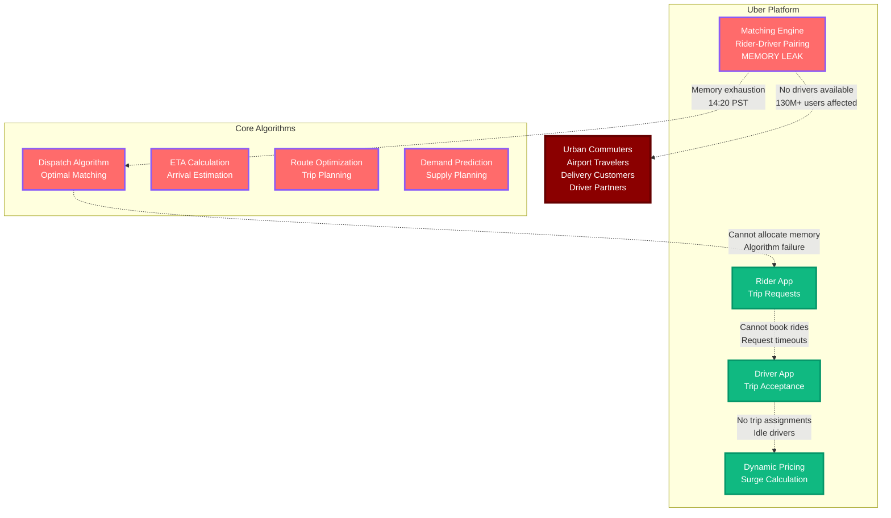

# Uber Global Outage - March 3, 2023

**The 2-Hour Matching Engine Memory Leak That Broke Ride-Sharing Worldwide**

## Incident Overview

| **Metric** | **Value** |
|------------|-----------||
| **Date** | March 3, 2023 |
| **Duration** | 2 hours globally |
| **Impact** | Rides couldn't be booked |
| **Users Affected** | 130M+ monthly active users |
| **Financial Impact** | $80M+ in lost ride revenue |
| **Root Cause** | Matching engine memory leak |
| **MTTR** | 120 minutes |
| **Key Issue** | Algorithm optimization caused memory exhaustion |
| **Services Down** | Ride booking, driver matching, fare calculation |

## The Bottom Line

**This incident demonstrated that algorithmic optimization can introduce memory leaks that break core business functionality at global scale.**

**Key Takeaways:**
- Matching algorithms need rigorous memory management testing
- Performance optimizations can introduce subtle memory leaks
- Ride-sharing platforms are entirely dependent on real-time matching
- Memory exhaustion in critical services creates cascading failures

---

*"In ride-sharing, matching algorithms are the heart of the business - memory leaks are cardiac arrest."*