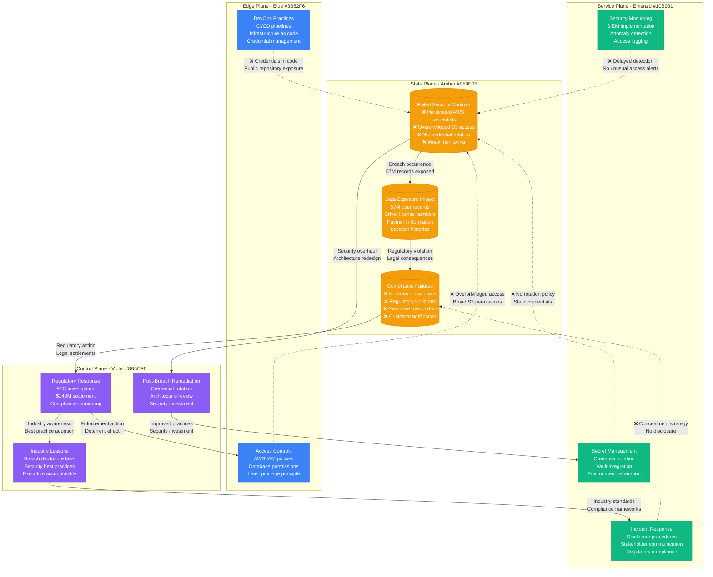

# Uber September 2016 Data Breach

## Overview

The Uber data breach that occurred in September 2016 compromised 57 million rider and driver accounts but was concealed for over a year. This incident demonstrates critical failures in breach disclosure, incident response, and security architecture, ultimately leading to regulatory action and executive changes.

**Impact**: 57 million user accounts compromised (50M riders, 7M drivers)
**Duration**: Breach occurred September 2016, concealed until November 2017
**Root Cause**: Exposed AWS S3 credentials in GitHub repository leading to database access

## Complete Attack Vector and Timeline

```mermaid
graph TB
    subgraph EdgePlane[Edge Plane - Blue #3B82F6]
        HACKER[External Attackers<br/>Cybercriminal group<br/>Data monetization focus<br/>Previous Uber targeting]
        GITHUB[Public GitHub<br/>Code repository<br/>Credential exposure<br/>Open source scanning]
        DARKWEB[Dark Web<br/>Data marketplace<br/>Credential sales<br/>Identity theft rings]
    end

    subgraph ServicePlane[Service Plane - Emerald #10B981]
        UBER_APP[Uber Mobile App<br/>Rider/Driver platforms<br/>50M+ active users<br/>Real-time location data]
        BACKEND[Uber Backend Services<br/>Microservices architecture<br/>API gateway<br/>Authentication services]
        S3_ACCESS[AWS S3 Access<br/>Compromised credentials<br/>Data lake access<br/>Backup repositories]
        ADMIN_PANEL[Admin Panel<br/>Internal tools<br/>Driver management<br/>Operations dashboard]
    end

    subgraph StatePlane[State Plane - Amber #F59E0B]
        USER_DB[(User Database<br/>57M records total<br/>50M riders + 7M drivers<br/>Personal information)]
        DRIVER_DB[(Driver Database<br/>7M driver records<br/>License numbers<br/>Vehicle information)]
        GEO_DATA[(Location Data<br/>Trip histories<br/>Real-time tracking<br/>Movement patterns)]
        PAYMENT_INFO[(Payment Information<br/>Credit card data<br/>Bank account details<br/>Transaction history)]
    end

    subgraph ControlPlane[Control Plane - Violet #8B5CF6]
        SECURITY_TEAM[Security Team<br/>Incident aware Sept 2016<br/>Cover-up decision<br/>Payment to hackers)]
        LEGAL[Legal Department<br/>Regulatory obligations<br/>Disclosure requirements<br/>Compliance failures)]
        EXEC[Executive Leadership<br/>CEO knowledge<br/>Concealment decision<br/>Regulatory consequences)]
        COVERUP[Cover-up Operation<br/>$100K payment<br/>NDA with hackers<br/>Bug bounty facade)]
    end

    %% Attack execution
    HACKER -->|1. Repository Scanning<br/>Automated credential search| GITHUB
    GITHUB -->|2. AWS Credentials Found<br/>S3 access keys exposed| S3_ACCESS
    S3_ACCESS -->|3. Privilege Escalation<br/>Database access gained| BACKEND
    BACKEND -->|4. Data Extraction<br/>57M user records| USER_DB

    %% Data access and exfiltration
    S3_ACCESS -->|Database backup access<br/>Full data lake| DRIVER_DB
    USER_DB -->|Personal information<br/>Names, emails, phones| GEO_DATA
    DRIVER_DB -->|Driver licenses<br/>Vehicle registrations| PAYMENT_INFO

    %% Application compromise
    BACKEND -->|Admin privilege abuse<br/>Internal tool access| ADMIN_PANEL
    ADMIN_PANEL -->|Operational data<br/>Driver management| DRIVER_DB
    UBER_APP -.->|User activity<br/>Location tracking| GEO_DATA

    %% Cover-up and concealment
    SECURITY_TEAM -->|Incident awareness<br/>September 2016| COVERUP
    COVERUP -->|Payment to hackers<br/>$100K Bitcoin| HACKER
    COVERUP -->|NDA agreement<br/>Data deletion claim| HACKER
    HACKER -.->|Data retention<br/>Dark web sales| DARKWEB

    %% Executive involvement
    SECURITY_TEAM -->|Escalation<br/>C-level awareness| EXEC
    EXEC -->|Concealment decision<br/>Avoid disclosure| LEGAL
    LEGAL -.->|Regulatory violation<br/>Disclosure requirements| EXEC

    %% Apply four-plane colors
    classDef edgeStyle fill:#3B82F6,stroke:#2563EB,color:#fff
    classDef serviceStyle fill:#10B981,stroke:#059669,color:#fff
    classDef stateStyle fill:#F59E0B,stroke:#D97706,color:#fff
    classDef controlStyle fill:#8B5CF6,stroke:#7C3AED,color:#fff

    class HACKER,GITHUB,DARKWEB edgeStyle
    class UBER_APP,BACKEND,S3_ACCESS,ADMIN_PANEL serviceStyle
    class USER_DB,DRIVER_DB,GEO_DATA,PAYMENT_INFO stateStyle
    class SECURITY_TEAM,LEGAL,EXEC,COVERUP controlStyle
```

## Security Architecture Failures



## Critical Security Failures

### 1. Credential Management Failure
- **Root Cause**: AWS access keys hardcoded in GitHub repository
- **Impact**: Direct access to production S3 buckets containing sensitive data
- **Scope**: Credentials had broad permissions across multiple AWS services
- **Duration**: Credentials were exposed for months before discovery

### 2. Excessive Privilege Escalation
- **Attack Vector**: S3 credentials provided access beyond intended scope
- **Weakness**: No principle of least privilege implementation
- **Impact**: Access to user database backups and operational data
- **Lesson**: Credentials should be scoped to minimum necessary permissions

### 3. Inadequate Monitoring and Detection
- **Attack Vector**: Unusual access patterns went undetected
- **Weakness**: No real-time monitoring of AWS API calls or database access
- **Impact**: Breach continued for weeks without detection
- **Lesson**: Comprehensive monitoring must include cloud resource access

### 4. Breach Response and Disclosure Failures
- **Attack Vector**: Decision to conceal breach from regulators and users
- **Weakness**: Lack of proper incident response procedures and legal compliance
- **Impact**: Regulatory violations and executive criminal charges
- **Lesson**: Transparent disclosure is legally required and builds trust

## Impact and Consequences

### Customer Impact
- **Affected Users**: 57 million individuals (50M riders, 7M drivers)
- **Data Compromised**: Names, email addresses, mobile phone numbers
- **Driver Data**: License numbers and vehicle registration information
- **Ongoing Risk**: Identity theft, phishing attacks, and account takeovers

### Business Impact
- **Direct Costs**: $148 million FTC settlement plus legal fees
- **Regulatory Action**: Multi-state attorney general investigations
- **Executive Consequences**: Chief Security Officer and Chief Legal Officer fired
- **Reputation Damage**: Loss of user trust and regulatory scrutiny

### Legal and Regulatory Consequences
- **FTC Settlement**: $148 million penalty for inadequate security and concealment
- **Criminal Charges**: Former Chief Security Officer convicted of obstruction
- **Compliance Monitoring**: 20-year consent decree with ongoing audits
- **State Actions**: Multiple state settlements and ongoing monitoring

## Technical Remediation

### Immediate Response (2017-2018)
1. **Credential Rotation**: All AWS credentials invalidated and replaced
2. **Access Review**: Complete audit of all cloud permissions and database access
3. **User Notification**: Individual notification to all 57 million affected users
4. **Security Team Changes**: Complete leadership overhaul and process redesign

### Security Architecture Overhaul (2018-2020)
1. **Secret Management**: Implementation of HashiCorp Vault for credential management
2. **Cloud Security**: AWS CloudTrail and GuardDuty for comprehensive monitoring
3. **Access Controls**: Zero-trust architecture with just-in-time access
4. **Data Protection**: Enhanced encryption and data minimization practices

### Ongoing Security Program (2020+)
1. **Continuous Monitoring**: 24/7 SOC with threat intelligence integration
2. **Bug Bounty**: Expanded program with industry-leading payouts
3. **Compliance Program**: Dedicated privacy and security compliance teams
4. **Incident Response**: Formal procedures with regulatory notification requirements

## Industry Lessons and Best Practices

### Credential Security
```yaml
# Example secure credential management
AWS_IAM_Policy:
  Version: "2012-10-17"
  Statement:
    - Effect: Allow
      Action:
        - "s3:GetObject"
      Resource:
        - "arn:aws:s3:::specific-bucket/specific-path/*"
      Condition:
        IpAddress:
          "aws:SourceIp": "10.0.0.0/8"
        DateGreaterThan:
          "aws:CurrentTime": "2024-01-01T00:00:00Z"
        DateLessThan:
          "aws:CurrentTime": "2024-12-31T23:59:59Z"

Secret_Rotation:
  frequency: "30_days"
  automation: "required"
  monitoring: "real_time"
  scope: "least_privilege"
```

### What Works
- **Automated secret rotation**: Eliminates long-lived credentials
- **Principle of least privilege**: Limits blast radius of compromised credentials
- **Real-time monitoring**: Detects unusual access patterns immediately
- **Transparent disclosure**: Builds trust and meets regulatory requirements

### What Fails
- **Hardcoded credentials**: Any credentials in code repositories
- **Overprivileged access**: Broad permissions that exceed job requirements
- **Delayed detection**: Monthly or quarterly security reviews
- **Concealment strategies**: Hiding breaches violates laws and erodes trust

### Regulatory Impact
- **Disclosure Laws**: All 50 states now have breach notification requirements
- **Executive Accountability**: Personal liability for security and disclosure failures
- **Compliance Monitoring**: Long-term regulatory oversight for violators
- **Industry Standards**: Enhanced security requirements for rideshare companies

### Modern Security Architecture
```yaml
# Current industry standard security controls
Security_Architecture:
  credential_management:
    - vault_integration
    - automated_rotation
    - just_in_time_access
    - principle_of_least_privilege

  monitoring:
    - real_time_siem
    - behavioral_analytics
    - cloud_security_posture
    - threat_intelligence

  incident_response:
    - automated_detection
    - regulatory_notification
    - customer_communication
    - forensic_preservation

  compliance:
    - continuous_assessment
    - third_party_audits
    - executive_oversight
    - transparency_reporting
```

### Future Prevention
- **DevSecOps Integration**: Security built into development lifecycle
- **Cloud-Native Security**: Purpose-built security for cloud architectures
- **AI-Powered Detection**: Machine learning for anomaly detection
- **Privacy by Design**: Data minimization and protection by default

**Sources**:
- Federal Trade Commission Settlement Agreement (2018)
- Department of Justice Criminal Case Documents (2020)
- Uber Security Incident Timeline (Internal Report, 2018)
- Independent Security Assessment (Mandiant, 2018)
- Congressional Testimony Transcripts (2017-2018)