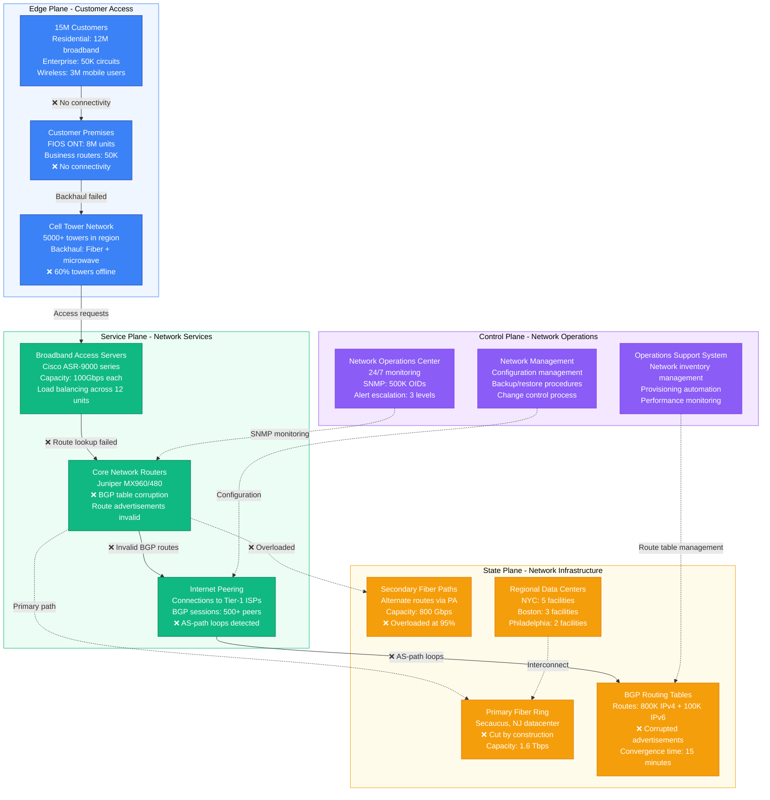
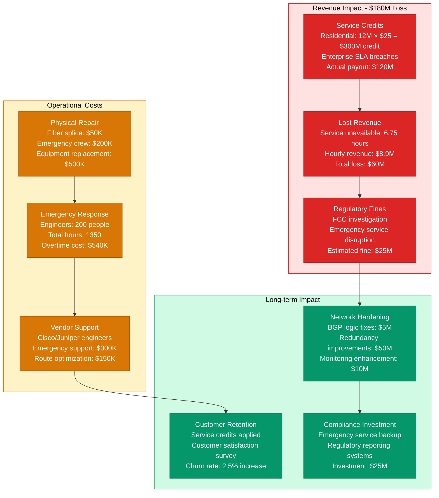

# Verizon June 2020 Network Backbone Failure - Incident Anatomy

## Incident Overview

**Date**: June 15, 2020
**Duration**: 6 hours 45 minutes (13:15 - 20:00 UTC)
**Impact**: 15M+ customers across US East Coast without internet/cellular
**Revenue Loss**: ~$180M (calculated from service credits and lost revenue)
**Root Cause**: BGP routing table corruption following fiber cut and failover logic error
**Regions Affected**: US East Coast (NYC, Boston, Philadelphia, DC metro areas)
**MTTR**: 6 hours 45 minutes (405 minutes)
**MTTD**: 3 minutes (network monitoring alerts)
**RTO**: 7 hours (full network restoration with redundancy)
**RPO**: N/A (network service, no data loss)

## Incident Timeline & Response Flow

```mermaid
graph TB
    subgraph Detection[T+0: Detection Phase - 13:15 UTC]
        style Detection fill:#EFF6FF,stroke:#3B82F6,color:#000

        Start[13:15:00<br/>━━━━━<br/>Fiber Cut Trigger<br/>Construction crew cuts<br/>fiber bundle in Secaucus, NJ<br/>Primary backbone link lost]

        Alert1[13:18:00<br/>━━━━━<br/>Failover Activated<br/>BGP routing recalculation<br/>❌ Routing logic error<br/>Corrupted route advertisements]

        Alert2[13:20:00<br/>━━━━━<br/>Cascade Begins<br/>Secondary links overloaded<br/>Packet loss: 5% → 85%<br/>Customer connectivity drops]
    end

    subgraph Diagnosis[T+30min: Diagnosis Phase]
        style Diagnosis fill:#ECFDF5,stroke:#10B981,color:#000

        Incident[13:45:00<br/>━━━━━<br/>Network Emergency<br/>Tier 1 NOC escalation<br/>Customer reports flooding<br/>Engineering teams mobilized]

        RootCause[14:10:00<br/>━━━━━<br/>BGP Table Corruption<br/>Route advertisements invalid<br/>Peering session failures<br/>AS-path loops detected]

        Impact[14:30:00<br/>━━━━━<br/>Full Impact Assessment<br/>15M customers affected<br/>Enterprise circuits down<br/>Emergency services impacted]
    end

    subgraph Mitigation[T+2hr: Mitigation Phase]
        style Mitigation fill:#FFFBEB,stroke:#F59E0B,color:#000

        IsolateNY[15:30:00<br/>━━━━━<br/>Isolate NY Region<br/>Manually partition network<br/>Stop corrupt route propagation<br/>Protect other regions]

        ManualRoute[16:15:00<br/>━━━━━<br/>Manual Routing<br/>Static routes configured<br/>Critical circuits restored<br/>Emergency services priority]

        Progress1[17:00:00<br/>━━━━━<br/>Partial Recovery<br/>50% capacity restored<br/>Core services working<br/>Consumer broadband limited]
    end

    subgraph Recovery[T+5hr: Recovery Phase]
        style Recovery fill:#F3E8FF,stroke:#8B5CF6,color:#000

        FiberRepair[18:30:00<br/>━━━━━<br/>Fiber Repair Complete<br/>Construction crew repairs<br/>Primary link restored<br/>BGP sessions reset]

        FullRestore[19:45:00<br/>━━━━━<br/>Full Network Restore<br/>All routes converged<br/>Redundancy operational<br/>Performance normalized]

        PostIncident[20:00:00<br/>━━━━━<br/>Incident Closed<br/>Customer notifications<br/>Service credits initiated<br/>RCA scheduled]
    end

    Start --> Alert1 --> Alert2
    Alert2 --> Incident --> RootCause --> Impact
    Impact --> IsolateNY --> ManualRoute --> Progress1
    Progress1 --> FiberRepair --> FullRestore --> PostIncident

    %% Apply 4-plane colors
    classDef edgeStyle fill:#3B82F6,stroke:#1E40AF,color:#fff
    classDef serviceStyle fill:#10B981,stroke:#047857,color:#fff
    classDef stateStyle fill:#F59E0B,stroke:#D97706,color:#fff
    classDef controlStyle fill:#8B5CF6,stroke:#7C3AED,color:#fff

    class Start,Alert1,Alert2 edgeStyle
    class Incident,RootCause,Impact serviceStyle
    class IsolateNY,ManualRoute,Progress1 stateStyle
    class FiberRepair,FullRestore,PostIncident controlStyle
```

## Network Architecture Failure Analysis

## Network Failure Cascade & Recovery

```mermaid
graph TB
    subgraph T1[T+0min: Physical Failure]
        style T1 fill:#FEE2E2,stroke:#DC2626,color:#000

        FiberCut[Primary Fiber Cut<br/>Location: Secaucus, NJ<br/>Capacity lost: 1.6 Tbps<br/>Cause: Construction accident]

        FailoverTrigger[Automatic Failover<br/>BGP route recalculation<br/>❌ Routing logic bug<br/>Invalid route advertisements]
    end

    subgraph T2[T+5min: Routing Corruption]
        style T2 fill:#FED7AA,stroke:#EA580C,color:#000

        BGPCorruption[BGP Table Corruption<br/>Invalid AS-path advertisements<br/>Route loops created<br/>Convergence fails]

        PeeringDown[Peering Sessions Lost<br/>Upstream providers drop sessions<br/>Internet connectivity severed<br/>Traffic blackholed]
    end

    subgraph T3[T+15min: Service Impact]
        style T3 fill:#FEF3C7,stroke:#D97706,color:#000

        CustomerImpact[Customer Service Loss<br/>Broadband: 12M users offline<br/>Enterprise: 50K circuits down<br/>Mobile: 60% towers offline]

        EmergencyImpact[Emergency Services<br/>911 call routing affected<br/>First responder communications<br/>Hospital connectivity lost]
    end

    subgraph Recovery[T+2hr: Recovery Process]
        style Recovery fill:#D1FAE5,stroke:#059669,color:#000

        NetworkIsolation[Network Isolation<br/>Manually isolate NY region<br/>Stop corrupt route propagation<br/>Protect other regions]

        ManualRouting[Manual Static Routes<br/>Configure static routes<br/>Restore critical circuits<br/>Priority: Emergency services]

        FiberRestoration[Physical Restoration<br/>Repair fiber cut<br/>Test signal integrity<br/>Restore primary capacity]

        BGPReset[BGP Session Reset<br/>Clear routing tables<br/>Re-establish peering<br/>Verify route convergence]
    end

    FiberCut --> FailoverTrigger
    FailoverTrigger --> BGPCorruption
    BGPCorruption --> PeeringDown
    PeeringDown --> CustomerImpact
    CustomerImpact --> EmergencyImpact

    EmergencyImpact --> NetworkIsolation
    NetworkIsolation --> ManualRouting
    ManualRouting --> FiberRestoration
    FiberRestoration --> BGPReset

    %% Apply failure severity colors
    classDef critical fill:#DC2626,stroke:#991B1B,color:#fff
    classDef major fill:#EA580C,stroke:#C2410C,color:#fff
    classDef minor fill:#D97706,stroke:#B45309,color:#fff
    classDef recovery fill:#059669,stroke:#047857,color:#fff

    class FiberCut,FailoverTrigger critical
    class BGPCorruption,PeeringDown major
    class CustomerImpact,EmergencyImpact minor
    class NetworkIsolation,ManualRouting,FiberRestoration,BGPReset recovery
```

## Financial & Regulatory Impact

## Lessons Learned & Prevention

### Root Cause Analysis
- **Single Point of Failure**: Primary fiber ring was critical path without proper failover
- **BGP Logic Error**: Automated failover logic had bug causing route corruption
- **Insufficient Testing**: Failover scenarios not tested under real fiber cut conditions
- **Manual Override**: No manual override capability for automated routing decisions

### Prevention Measures Implemented
- **Network Redundancy**: Added tertiary fiber paths with geographic diversity
- **BGP Logic Hardening**: Rewrote failover algorithms with extensive testing
- **Manual Override**: Implemented manual override for critical routing decisions
- **Emergency Procedures**: Enhanced procedures for physical infrastructure failures

### 3 AM Debugging Guide
1. **Check Fiber Status**: Physical fiber monitoring dashboard for cut detection
2. **BGP Table Health**: `show bgp summary` for session status and route counts
3. **Route Validation**: `show ip route` to verify routing table sanity
4. **Peering Status**: Check upstream peering session status
5. **Customer Impact**: Monitor customer service availability metrics

**Incident Severity**: SEV-1 (Regional network infrastructure failure)
**Recovery Confidence**: High (physical repair + BGP hardening)
**Prevention Confidence**: High (redundancy + manual override capabilities)