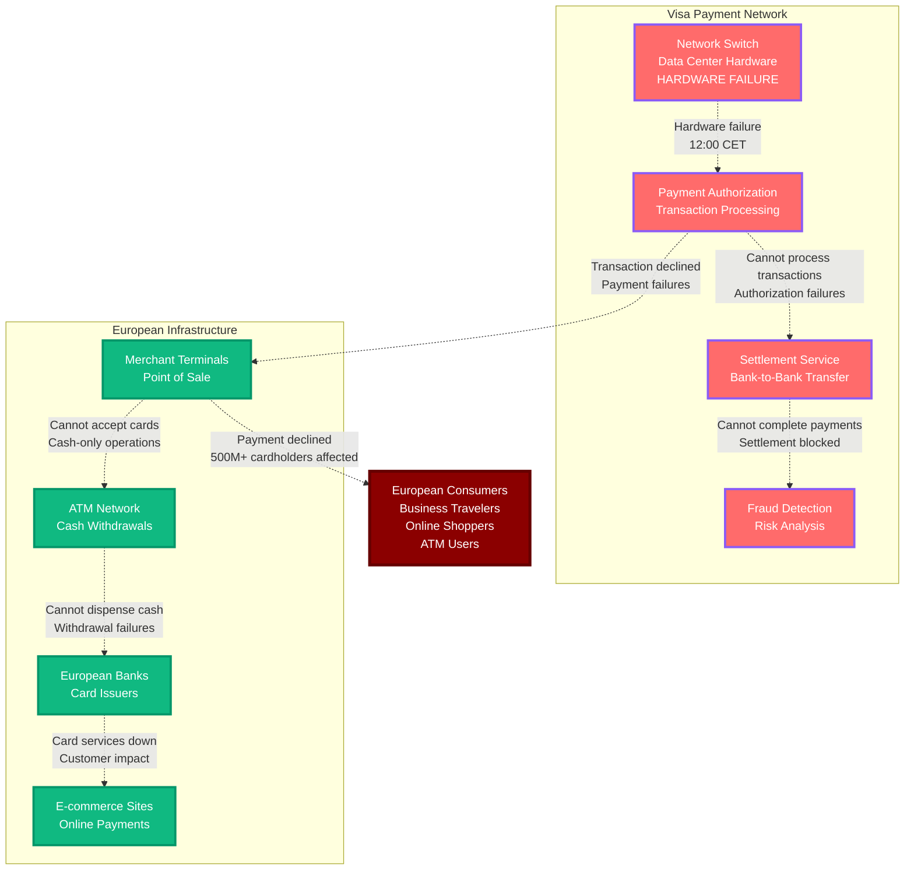

# Visa Payment Network Outage - June 10, 2021

**The 30-Minute Hardware Failure That Broke European Commerce**

## Incident Overview

| **Metric** | **Value** |
|------------|-----------||
| **Date** | June 10, 2021 |
| **Duration** | 30 minutes |
| **Impact** | Payment failures across Europe |
| **Users Affected** | 500M+ cardholders |
| **Financial Impact** | $200M+ in failed transactions |
| **Root Cause** | Hardware failure in European data center |
| **MTTR** | 30 minutes |
| **Key Issue** | Single point of failure in payment processing |
| **Services Down** | Card authorization, ATM withdrawals, online payments |

## The Bottom Line

**This incident highlighted that payment networks are still vulnerable to single points of hardware failure, despite their critical importance to global commerce.**

**Key Takeaways:**
- Payment networks need redundant hardware across multiple data centers
- 30 minutes of payment downtime can affect hundreds of millions of people
- Physical hardware failures can instantly disable digital payments
- European commerce relies heavily on card payments vs cash

---

*"In payment networks, hardware failures don't just break systems - they break commerce."*