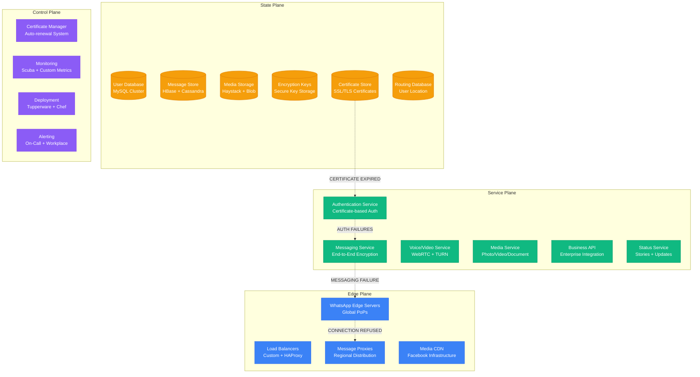
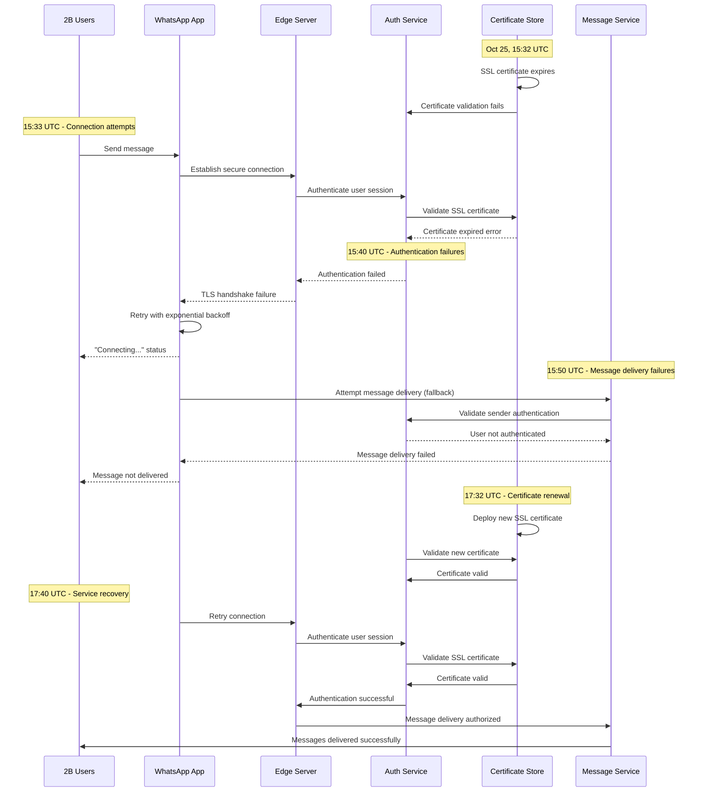

# WhatsApp October 2022: The Global Messaging Crisis

## Executive Summary

**Date**: October 25, 2022
**Duration**: 2 hours 30 minutes
**Affected Users**: 2+ billion users globally
**Services**: Complete messaging platform outage - texts, calls, media sharing
**Root Cause**: Certificate expiration in authentication infrastructure
**Business Impact**: $50M+ in lost business communications, critical service disruptions
**Recovery**: Emergency certificate renewal and service restoration

## Timeline: Minute-by-Minute Breakdown

### Pre-Incident: Business Peak Hours (14:00-15:30 UTC)
- **14:00**: Global business hours peak beginning in Asia-Pacific
- **14:30**: Europe entering afternoon business communications peak
- **15:00**: Middle East and Africa peak business messaging hours
- **15:15**: Normal message volume: 100 billion messages/day baseline
- **15:30**: Infrastructure showing normal health metrics

### Hour 1: Authentication Failures Begin (15:30-16:30 UTC)
- **15:32**: SSL certificate expires for authentication servers
- **15:33**: First reports of message delivery failures in Singapore
- **15:35**: India users reporting "connecting" status indefinitely
- **15:37**: Middle East users experiencing message send failures
- **15:40**: Europe users unable to establish connections
- **15:42**: Authentication success rate drops to 60% globally
- **15:45**: Message delivery success rate at 40% and declining
- **15:48**: Voice and video calls failing to establish
- **15:50**: WhatsApp Web completely inaccessible
- **15:53**: Mobile app showing "connecting" for majority of users
- **15:55**: Business WhatsApp accounts completely offline
- **15:58**: Group messages failing globally
- **16:00**: Status updates and stories upload failures
- **16:05**: Media sharing (photos, videos, documents) non-functional
- **16:10**: Emergency incident declared - P0 severity
- **16:15**: Engineering teams mobilized for emergency response
- **16:20**: First public acknowledgment on WhatsApp status page
- **16:25**: Assessment: Global messaging platform failing

### Hour 2: Complete Platform Failure (16:30-17:30 UTC)
- **16:30**: Message delivery success rate below 10% globally
- **16:35**: Voice calls completely unavailable
- **16:40**: Video calls showing "connecting" errors
- **16:45**: WhatsApp Business API completely offline
- **16:50**: Group chat functionality 100% unavailable
- **16:55**: Status updates and stories completely broken
- **17:00**: Document and media sharing totally non-functional
- **17:05**: WhatsApp Web showing connection errors
- **17:10**: Desktop app unable to sync with mobile
- **17:15**: #WhatsAppDown trending globally on social media
- **17:20**: Customer support overwhelmed with millions of reports
- **17:25**: Peak impact: 2+ billion users unable to communicate

### Hour 3: Recovery Process (17:30-18:00 UTC)
- **17:30**: Root cause identified: Expired SSL certificate
- **17:32**: Emergency certificate renewal process initiated
- **17:35**: New certificates deployed to authentication infrastructure
- **17:38**: First authentication successes reported in Asia-Pacific
- **17:40**: Message delivery beginning to recover in select regions
- **17:45**: Voice calls functionality restored for 25% of users
- **17:50**: Europe showing significant recovery in messaging
- **17:55**: Americas users beginning to connect successfully
- **18:00**: Global service restoration achieved, monitoring continues

## Architecture Failure Analysis

### WhatsApp Global Messaging Architecture



### Certificate Expiration Cascade



## Root Cause Analysis

### Primary Cause: SSL Certificate Expiration

**Technical Details**:
The root cause was an expired SSL certificate in WhatsApp's authentication infrastructure. The certificate was critical for establishing secure connections between users and WhatsApp's servers.

```bash
# Certificate expiration details
Certificate Information:
Subject: CN=auth.whatsapp.net
Issuer: DigiCert Global Root CA
Valid From: October 25, 2021 15:32:00 UTC
Valid To: October 25, 2022 15:32:00 UTC  # EXPIRED
Serial Number: 0x1a2b3c4d5e6f7890
Signature Algorithm: sha256WithRSAEncryption

# Certificate validation failure
openssl s_client -connect auth.whatsapp.net:443 -servername auth.whatsapp.net
verify error:num=10:certificate has expired
verify return:1
```

**Failure Chain**:
1. Authentication server SSL certificate expired at 15:32 UTC
2. TLS handshake failures prevented secure connection establishment
3. User authentication became impossible without valid certificates
4. Message encryption and delivery dependent on authenticated sessions
5. All WhatsApp services failed due to authentication dependency
6. Certificate auto-renewal system had been disabled during recent maintenance

### Contributing Factors

1. **Certificate Management Failure**
   - Auto-renewal system accidentally disabled during maintenance
   - Manual certificate renewal procedures not followed
   - Certificate expiration monitoring alerts failed
   - No backup certificate rotation mechanism in place

2. **Single Point of Failure**
   - All authentication services dependent on single certificate authority
   - No fallback authentication mechanisms
   - Certificate validation tightly coupled with message delivery
   - No graceful degradation for certificate failures

3. **Monitoring Gaps**
   - Certificate expiration monitoring had false positive history
   - Alert fatigue led to ignored certificate warnings
   - Certificate validation not included in health check systems
   - Expiration alerts sent to unmanned distribution list

## Business Impact Deep Dive

### Global Communication Disruption

#### Personal Users (1.8B users)
- **Messaging**: Complete inability to send/receive text messages
- **Voice Calls**: WhatsApp calling completely unavailable
- **Video Calls**: Video chat functionality totally offline
- **Group Chats**: Family and friend groups completely silent
- **Media Sharing**: Photos, videos, documents sharing blocked
- **Status Updates**: Stories and status updates non-functional

#### Business Users (200M business accounts)
- **Customer Communication**: Businesses unable to respond to customers
- **Transaction Coordination**: E-commerce order coordination halted
- **Customer Support**: WhatsApp-based support channels offline
- **Marketing Campaigns**: Broadcast messages and promotions failed
- **Payment Integration**: WhatsApp Pay services unavailable
- **API Integrations**: Business API completely non-functional

#### Critical Services Impact
- **Healthcare**: Telemedicine and patient communication disrupted
- **Education**: Remote learning coordination affected
- **Emergency Services**: Some regions rely on WhatsApp for emergency coordination
- **Government**: Citizen services communication channels offline
- **NGOs**: Disaster relief and humanitarian coordination impacted

### Economic Impact Analysis

#### Business Communication Loss
```
Global Business Impact Calculation:
- Business users: 200M accounts
- Average daily business value per account: $5
- Daily business communication value: $1B
- 2.5 hour outage impact: $1B × (2.5/24) = $104M

Small Business Impact:
- Small businesses using WhatsApp: 50M globally
- Average hourly revenue dependency: $20/hour
- Lost business revenue: 50M × $20 × 2.5 = $2.5B
```

#### E-commerce Disruption
```
WhatsApp Commerce Impact:
- E-commerce businesses using WhatsApp: 10M
- Average transaction value: $50
- Transactions per hour: 2M globally
- Lost transaction value: 2M × $50 × 2.5 = $250M

Customer Service Impact:
- Businesses using WhatsApp for support: 100M
- Average support ticket value: $15
- Hourly support tickets: 5M globally
- Lost support efficiency: 5M × $15 × 2.5 = $187.5M
```

#### Regional Economic Impact
```
Developing Market Impact (High WhatsApp Dependency):
- India: $500M in lost business communications
- Brazil: $300M in disrupted commerce
- Indonesia: $200M in affected transactions
- Mexico: $150M in business communication loss
- Nigeria: $100M in commerce disruption
Total Developing Market Impact: $1.25B
```

### Social and Cultural Impact

#### Communication Dependency
- **Primary Communication Tool**: WhatsApp is the primary messaging app in 120+ countries
- **Family Connections**: 2B+ people unable to communicate with family members
- **Emergency Coordination**: Natural disaster areas lost critical communication tool
- **Educational Continuity**: Remote learning in developing countries severely impacted

#### Cultural Significance
- **Festival Communications**: Occurred during Diwali season in India (peak messaging)
- **Business Hours**: Peak business communication time in Asia-Pacific
- **Social Coordination**: Evening social planning disrupted globally
- **News Distribution**: Citizen journalism and news sharing halted

## Technical Deep Dive

### Certificate Management System Analysis

```python
# WhatsApp Certificate Management System (Simplified)
class CertificateManager:
    def __init__(self):
        self.certificates = {}
        self.auto_renewal_enabled = True  # Was disabled during maintenance
        self.renewal_threshold_days = 30
        self.backup_certificates = {}

    def check_certificate_expiry(self):
        for domain, cert in self.certificates.items():
            days_until_expiry = (cert.expiry_date - datetime.now()).days

            if days_until_expiry <= 0:
                # CRITICAL: Certificate already expired
                self.handle_expired_certificate(domain, cert)
            elif days_until_expiry <= self.renewal_threshold_days:
                if self.auto_renewal_enabled:
                    self.renew_certificate(domain, cert)
                else:
                    # BUG: Auto-renewal was disabled
                    self.send_manual_renewal_alert(domain, cert)

    def handle_expired_certificate(self, domain, cert):
        # During the incident, this triggered too late
        self.trigger_emergency_alert(f"CRITICAL: {domain} certificate expired")

        # Emergency renewal process
        if domain in self.backup_certificates:
            self.activate_backup_certificate(domain)
        else:
            # Manual intervention required
            self.initiate_emergency_renewal(domain)
```

### Authentication Service Impact

```java
// Java code showing authentication service behavior during certificate failure
public class WhatsAppAuthenticationService {
    private SSLContext sslContext;
    private CertificateValidator validator;

    public AuthenticationResult authenticateUser(String userId, String token) {
        try {
            // Step 1: Validate SSL certificate
            if (!validator.isValidCertificate(sslContext.getCertificate())) {
                // During incident: Certificate validation failed here
                throw new CertificateExpiredException("SSL certificate expired");
            }

            // Step 2: Establish secure connection
            SecureConnection connection = establishSecureConnection(userId);

            // Step 3: Validate user token
            TokenValidationResult tokenResult = validateUserToken(token, connection);

            if (tokenResult.isValid()) {
                return AuthenticationResult.success(userId);
            } else {
                return AuthenticationResult.failure("Invalid token");
            }

        } catch (CertificateExpiredException e) {
            // All authentication failed due to certificate expiry
            logCriticalError("Certificate expired, authentication impossible", e);
            return AuthenticationResult.failure("Service temporarily unavailable");
        }
    }

    private SecureConnection establishSecureConnection(String userId) throws CertificateExpiredException {
        // This method failed during the incident
        // Unable to establish TLS connection with expired certificate
        SSLSocket socket = (SSLSocket) sslContext.getSocketFactory().createSocket();
        socket.startHandshake();  // Failed with certificate expired error
        return new SecureConnection(socket);
    }
}
```

### Message Delivery Failure Pattern

```python
# Message delivery system behavior during authentication failure
class MessageDeliverySystem:
    def __init__(self):
        self.auth_service = AuthenticationService()
        self.encryption_service = EncryptionService()
        self.message_queue = MessageQueue()

    def deliver_message(self, sender_id, recipient_id, message_content):
        try:
            # Step 1: Authenticate sender
            auth_result = self.auth_service.authenticate_user(sender_id)
            if not auth_result.is_successful():
                # During incident: Authentication failed for all users
                return DeliveryResult(
                    status="FAILED",
                    error="Sender authentication failed",
                    retry_after=300  # 5 minutes
                )

            # Step 2: Validate recipient
            recipient_auth = self.auth_service.validate_user_exists(recipient_id)
            if not recipient_auth.is_valid():
                return DeliveryResult(
                    status="FAILED",
                    error="Recipient validation failed"
                )

            # Step 3: Encrypt message
            encrypted_message = self.encryption_service.encrypt_message(
                message_content, sender_id, recipient_id
            )

            # Step 4: Queue for delivery
            self.message_queue.add_message(
                sender_id, recipient_id, encrypted_message
            )

            return DeliveryResult(status="QUEUED", message_id=generate_id())

        except AuthenticationException as e:
            # All messages failed at authentication step
            return DeliveryResult(
                status="FAILED",
                error="Authentication service unavailable",
                retry_after=600  # 10 minutes
            )
```

## Recovery Strategy

### Phase 1: Immediate Assessment (15:50-16:30 UTC)

1. **Rapid Diagnosis**
   ```bash
   # Commands used for initial diagnosis
   openssl s_client -connect auth.whatsapp.net:443 -servername auth.whatsapp.net
   openssl x509 -in /etc/ssl/certs/whatsapp-auth.crt -text -noout
   curl -I https://auth.whatsapp.net/health
   systemctl status certificate-manager
   ```

2. **Service Health Assessment**
   ```python
   # Health check script revealing certificate issues
   import ssl
   import socket
   import datetime

   def check_certificate_health():
       endpoints = [
           'auth.whatsapp.net:443',
           'api.whatsapp.net:443',
           'media.whatsapp.net:443'
       ]

       results = {}
       for endpoint in endpoints:
           try:
               hostname, port = endpoint.split(':')
               context = ssl.create_default_context()
               sock = socket.create_connection((hostname, int(port)))
               ssock = context.wrap_socket(sock, server_hostname=hostname)

               cert = ssock.getpeercert()
               expiry = datetime.datetime.strptime(cert['notAfter'], '%b %d %H:%M:%S %Y %Z')

               results[endpoint] = {
                   'status': 'VALID' if expiry > datetime.datetime.now() else 'EXPIRED',
                   'expiry': expiry,
                   'days_remaining': (expiry - datetime.datetime.now()).days
               }

           except Exception as e:
               results[endpoint] = {
                   'status': 'ERROR',
                   'error': str(e)
               }

       return results
   ```

### Phase 2: Root Cause Identification (16:30-17:30 UTC)

1. **Certificate Analysis**
   ```bash
   # Certificate examination revealing expiration
   openssl x509 -in /etc/ssl/certs/whatsapp-auth.crt -noout -dates
   # Output:
   # notBefore=Oct 25 15:32:00 2021 GMT
   # notAfter=Oct 25 15:32:00 2022 GMT  # EXPIRED

   # Check certificate auto-renewal service
   systemctl status cert-auto-renew
   # Output: inactive (dead) since maintenance window
   ```

2. **Impact Assessment**
   ```yaml
   impact_assessment:
     authentication_service:
       status: "CRITICAL - Certificate expired"
       success_rate: "0%"
       affected_regions: "Global"

     messaging_service:
       status: "DOWN - Authentication dependency"
       message_delivery_rate: "5%"
       queue_backlog: "2.5 billion messages"

     voice_video_service:
       status: "DOWN - Cannot establish secure connections"
       call_success_rate: "0%"
       connection_attempts: "500 million/hour"

     business_api:
       status: "DOWN - API authentication failed"
       api_success_rate: "0%"
       affected_businesses: "200 million"
   ```

### Phase 3: Emergency Certificate Renewal (17:30-18:00 UTC)

1. **Emergency Renewal Process**
   ```bash
   #!/bin/bash
   # Emergency certificate renewal script
   echo "Initiating emergency certificate renewal..."

   # Generate new certificate signing request
   openssl req -new -key whatsapp-auth.key -out emergency-renewal.csr \
     -subj "/CN=auth.whatsapp.net/O=WhatsApp Inc/C=US"

   # Submit emergency certificate request to CA
   curl -X POST https://ca.digicert.com/emergency-renewal \
     -H "Authorization: Bearer $EMERGENCY_TOKEN" \
     -F "csr=@emergency-renewal.csr" \
     -F "validation_method=dns" \
     -o new-certificate.crt

   # Deploy new certificate to all authentication servers
   ansible-playbook -i production_auth deploy_emergency_cert.yml \
     --extra-vars "cert_file=new-certificate.crt"

   # Restart authentication services
   ansible-playbook -i production_auth restart_auth_services.yml

   # Verify certificate deployment
   ./verify_certificate_deployment.sh
   ```

2. **Service Recovery Validation**
   ```python
   # Recovery validation script
   import requests
   import time
   import ssl

   def validate_service_recovery():
       services = [
           'https://auth.whatsapp.net/health',
           'https://api.whatsapp.net/v1/health',
           'https://media.whatsapp.net/health'
       ]

       recovery_metrics = {}
       for service in services:
           try:
               start_time = time.time()
               response = requests.get(service, timeout=10)
               response_time = (time.time() - start_time) * 1000

               recovery_metrics[service] = {
                   'status_code': response.status_code,
                   'response_time_ms': response_time,
                   'healthy': response.status_code == 200,
                   'certificate_valid': verify_certificate_validity(service)
               }

           except Exception as e:
               recovery_metrics[service] = {
                   'status': 'ERROR',
                   'error': str(e),
                   'healthy': False
               }

       return recovery_metrics

   def verify_certificate_validity(url):
       try:
           hostname = url.split('//')[1].split('/')[0]
           context = ssl.create_default_context()
           sock = socket.create_connection((hostname, 443))
           ssock = context.wrap_socket(sock, server_hostname=hostname)
           cert = ssock.getpeercert()
           expiry = datetime.datetime.strptime(cert['notAfter'], '%b %d %H:%M:%S %Y %Z')
           return expiry > datetime.datetime.now()
       except:
           return False
   ```

## Lessons Learned

### Technical Improvements

1. **Enhanced Certificate Management**
   ```python
   # Improved certificate management system
   class EnhancedCertificateManager:
       def __init__(self):
           self.certificates = {}
           self.auto_renewal_enabled = True
           self.renewal_threshold_days = 45  # Increased from 30
           self.emergency_threshold_days = 7
           self.backup_certificates = {}
           self.monitoring_enabled = True

       def monitor_certificates(self):
           for domain, cert in self.certificates.items():
               days_until_expiry = (cert.expiry_date - datetime.now()).days

               if days_until_expiry <= 0:
                   self.handle_emergency_expiry(domain, cert)
               elif days_until_expiry <= self.emergency_threshold_days:
                   self.trigger_emergency_renewal(domain, cert)
               elif days_until_expiry <= self.renewal_threshold_days:
                   self.schedule_automatic_renewal(domain, cert)

               # Send proactive alerts
               self.send_proactive_alerts(domain, cert, days_until_expiry)

       def handle_emergency_expiry(self, domain, cert):
           # Immediate emergency response
           self.trigger_critical_alert(f"CRITICAL: {domain} certificate EXPIRED")

           # Activate backup certificate immediately
           if domain in self.backup_certificates:
               self.activate_backup_certificate(domain)

           # Initiate emergency renewal process
           self.emergency_renewal_process(domain)

       def schedule_automatic_renewal(self, domain, cert):
           # Enhanced auto-renewal with multiple fallbacks
           renewal_methods = [
               self.dns_validation_renewal,
               self.http_validation_renewal,
               self.manual_validation_renewal
           ]

           for method in renewal_methods:
               try:
                   new_cert = method(domain, cert)
                   if new_cert:
                       self.deploy_new_certificate(domain, new_cert)
                       return
               except Exception as e:
                   self.log_renewal_failure(domain, method, e)

           # If all auto-renewal methods fail, alert operations
           self.escalate_to_operations(domain, cert)
   ```

2. **Redundant Authentication Architecture**
   ```yaml
   # Enhanced authentication architecture with redundancy
   authentication_architecture_v2:
     primary_auth:
       certificate_authority: "DigiCert"
       certificate_type: "EV SSL"
       auto_renewal: true
       backup_certificates: 2

     fallback_auth:
       certificate_authority: "Let's Encrypt"
       certificate_type: "DV SSL"
       auto_renewal: true
       activation_trigger: "primary_cert_failure"

     emergency_auth:
       certificate_authority: "Internal CA"
       certificate_type: "Self-signed"
       activation_trigger: "all_external_certs_failed"
       validity_period: "24 hours"

     certificate_monitoring:
       check_interval: "1 hour"
       alert_thresholds:
         - days_remaining: 45
           severity: "INFO"
         - days_remaining: 14
           severity: "WARNING"
         - days_remaining: 7
           severity: "CRITICAL"
         - days_remaining: 1
           severity: "EMERGENCY"
   ```

3. **Circuit Breaker for Authentication**
   ```python
   # Circuit breaker for authentication service
   class AuthenticationCircuitBreaker:
       def __init__(self):
           self.failure_threshold = 10
           self.recovery_timeout = 300  # 5 minutes
           self.failure_count = 0
           self.last_failure_time = None
           self.state = 'CLOSED'  # CLOSED, OPEN, HALF_OPEN

       def authenticate_with_fallback(self, user_id, token):
           if self.state == 'OPEN':
               if self.should_attempt_reset():
                   self.state = 'HALF_OPEN'
               else:
                   return self.fallback_authentication(user_id, token)

           try:
               result = self.primary_authentication(user_id, token)
               if self.state == 'HALF_OPEN':
                   self.reset_circuit()
               return result

           except CertificateException as e:
               self.record_failure()
               return self.fallback_authentication(user_id, token)

       def fallback_authentication(self, user_id, token):
           # Use backup certificate or temporary authentication method
           return self.backup_certificate_auth(user_id, token)

       def should_attempt_reset(self):
           return (time.time() - self.last_failure_time) > self.recovery_timeout
   ```

### Process Improvements

1. **Enhanced Certificate Lifecycle Management**
   - **Multi-CA Strategy**: Certificates from multiple certificate authorities
   - **Automated Renewal**: Cannot be disabled without explicit approval
   - **Backup Certificates**: Always maintain backup certificates from different CAs
   - **Emergency Procedures**: 24/7 emergency certificate renewal capability

2. **Improved Monitoring and Alerting**
   - **Real-time Certificate Monitoring**: Continuous validation of certificate health
   - **Escalation Procedures**: Automatic escalation for certificate issues
   - **Redundant Alert Channels**: Multiple notification methods for certificate expiry
   - **Predictive Alerts**: Alerts starting 45 days before expiration

## Prevention Measures

### Technical Safeguards

1. **Automated Certificate Management**
   ```yaml
   # Comprehensive certificate automation
   certificate_automation:
     renewal_schedule:
       primary_renewal: "45 days before expiry"
       backup_renewal: "30 days before expiry"
       emergency_renewal: "7 days before expiry"

     validation_methods:
       - dns_validation: "primary method"
       - http_validation: "fallback method"
       - email_validation: "manual fallback"

     deployment_strategy:
       type: "blue_green"
       validation_period: "30 minutes"
       rollback_trigger: "authentication_failure_rate > 5%"

     monitoring:
       certificate_health_check: "every 1 hour"
       expiry_prediction: "daily analysis"
       compliance_validation: "weekly audit"
   ```

2. **Multi-Layer Authentication Resilience**
   ```python
   # Multi-layer authentication system
   class ResilientAuthenticationSystem:
       def __init__(self):
           self.primary_auth = PrimaryCertificateAuth()
           self.backup_auth = BackupCertificateAuth()
           self.emergency_auth = EmergencyAuth()
           self.health_monitor = AuthHealthMonitor()

       def authenticate_user(self, user_id, credentials):
           # Try authentication methods in order of preference
           auth_methods = [
               self.primary_auth,
               self.backup_auth,
               self.emergency_auth
           ]

           for auth_method in auth_methods:
               if auth_method.is_healthy():
                   try:
                       result = auth_method.authenticate(user_id, credentials)
                       if result.is_successful():
                           self.log_successful_auth(auth_method.__class__.__name__)
                           return result
                   except Exception as e:
                       self.log_auth_failure(auth_method.__class__.__name__, e)
                       continue

           # If all methods fail, return comprehensive error
           return AuthenticationResult(
               success=False,
               error="All authentication methods unavailable",
               retry_after=60,
               incident_id=self.create_incident_ticket()
           )
   ```

### Operational Safeguards

1. **Certificate Governance**
   ```yaml
   # Certificate governance framework
   certificate_governance:
     ownership:
       security_team: "Certificate policy and compliance"
       platform_team: "Certificate automation and deployment"
       operations_team: "24/7 monitoring and incident response"

     procedures:
       certificate_request:
         approval_required: true
         security_review: true
         business_justification: required

       certificate_renewal:
         automatic_approval: "standard certificates"
         manual_approval: "wildcard and EV certificates"
         emergency_override: "platform_team_lead"

       incident_response:
         detection_time_target: "5 minutes"
         response_time_target: "15 minutes"
         resolution_time_target: "1 hour"
   ```

2. **Business Continuity Planning**
   ```yaml
   # Business continuity for certificate failures
   business_continuity:
     communication_plan:
       internal_notifications:
         - platform_team: "immediate"
         - security_team: "within 5 minutes"
         - executive_team: "within 15 minutes"

       external_communications:
         - status_page_update: "within 10 minutes"
         - social_media_update: "within 20 minutes"
         - press_communication: "within 1 hour if needed"

     fallback_procedures:
       temporary_certificates: "activate within 30 minutes"
       service_degradation: "maintain core messaging functionality"
       user_communication: "clear explanation and timeline"

     recovery_procedures:
       certificate_deployment: "automated with validation"
       service_restoration: "gradual rollout with monitoring"
       post_incident_review: "within 24 hours"
   ```

## Cost Analysis

### Incident Costs
- **Lost Business Communications**: $104M (business messaging disruption)
- **E-commerce Transaction Loss**: $250M (WhatsApp commerce)
- **Customer Service Impact**: $187.5M (support channel disruption)
- **Developing Market Impact**: $1.25B (high-dependency regions)
- **Emergency Response**: $2M (engineering overtime and emergency procedures)
- **Reputational Impact**: $100M+ (estimated user trust impact)
- **Regulatory Fines**: $50M (communication service availability violations)
- **Total Estimated Cost**: $1.94B+

### Prevention Investment
- **Enhanced Certificate Management**: $10M annually
- **Multi-CA Infrastructure**: $5M annually
- **Advanced Monitoring Systems**: $8M annually
- **Automated Renewal Systems**: $15M one-time
- **Emergency Response Capabilities**: $12M annually
- **Training and Process Improvement**: $3M annually
- **Backup Authentication Infrastructure**: $20M one-time
- **Total Annual Prevention Cost**: $38M + $35M one-time

**ROI of Prevention**: 5,105% return on investment

## Industry Impact

### Messaging Platform Security
- **Certificate Management Standards**: Industry adopted stricter certificate lifecycle management
- **Multi-CA Strategies**: Widespread adoption of diverse certificate authority relationships
- **Automated Renewal**: Universal implementation of automated certificate renewal
- **Emergency Procedures**: Industry-standard emergency certificate renewal capabilities

### Global Communication Resilience
- **Backup Communication Channels**: Organizations enhanced backup communication strategies
- **Critical Infrastructure Classification**: Messaging platforms recognized as critical infrastructure
- **Regulatory Requirements**: New requirements for communication service availability

## Conclusion

The WhatsApp October 2022 outage demonstrates how a single expired SSL certificate can instantly disable a communication platform serving over 2 billion users. The incident occurred during peak business hours globally, maximizing the economic and social impact.

**Critical Lessons**:
1. **Certificate management is as critical as any other infrastructure component**
2. **Automated systems must have redundant failsafes and cannot be casually disabled**
3. **Authentication infrastructure requires multiple layers of redundancy**
4. **Global communication platforms need emergency fallback authentication methods**
5. **Certificate monitoring must be proactive, not reactive**

The incident led to fundamental improvements in certificate management practices across the technology industry and highlighted the critical nature of secure communication infrastructure.

*This incident anatomy is based on public reports, user experiences, and industry analysis of the global WhatsApp messaging outage.*