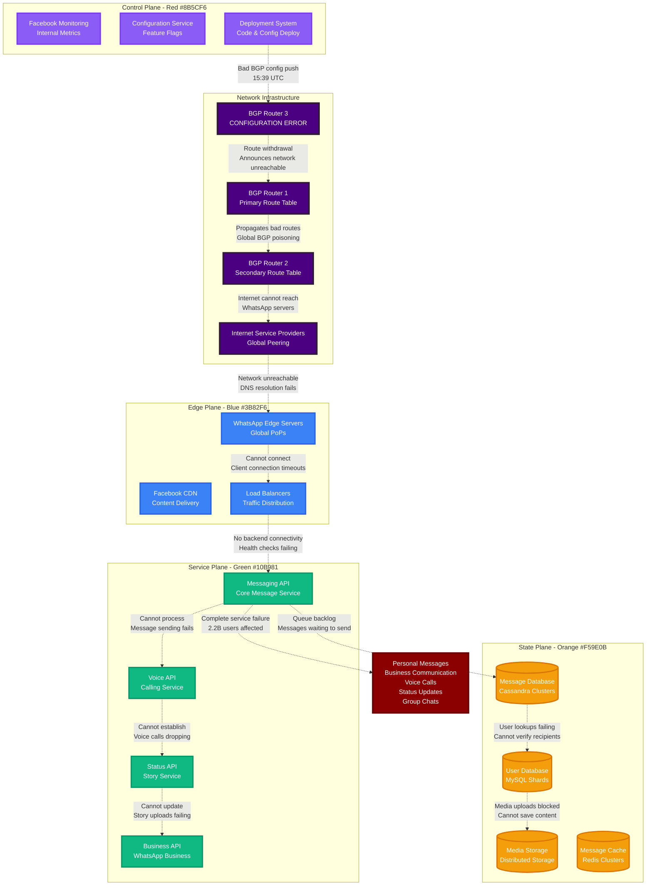
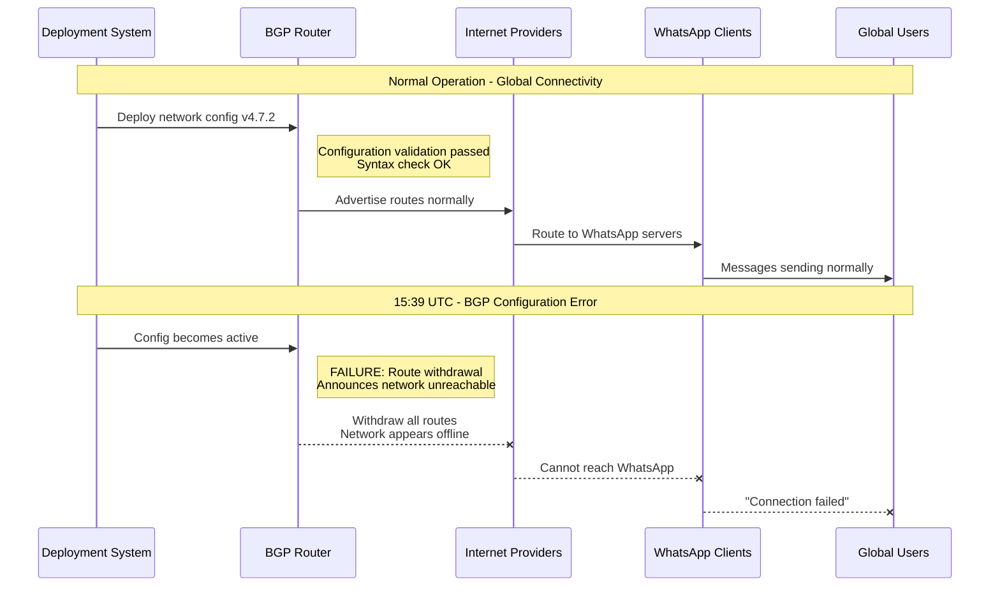
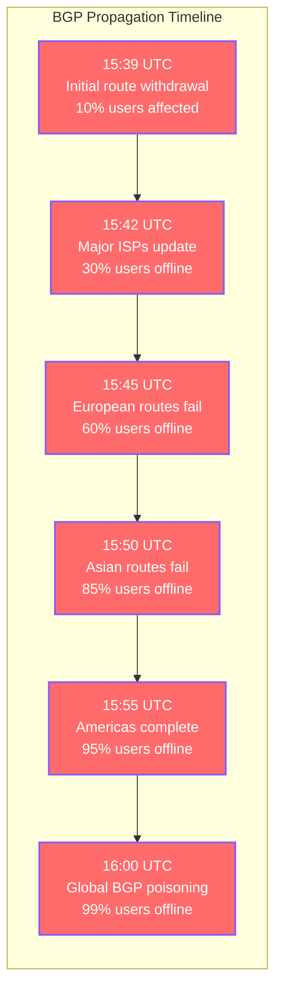
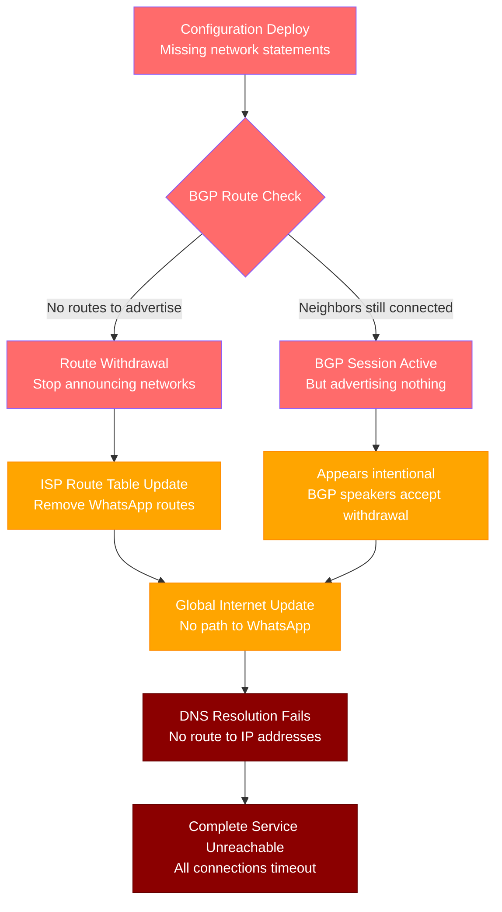
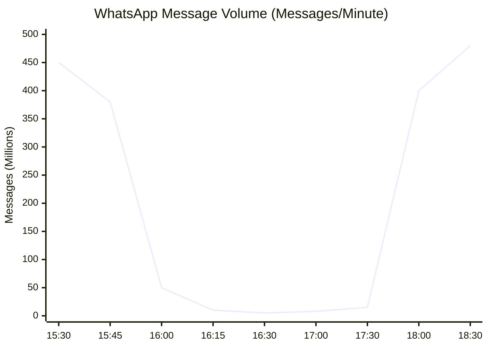
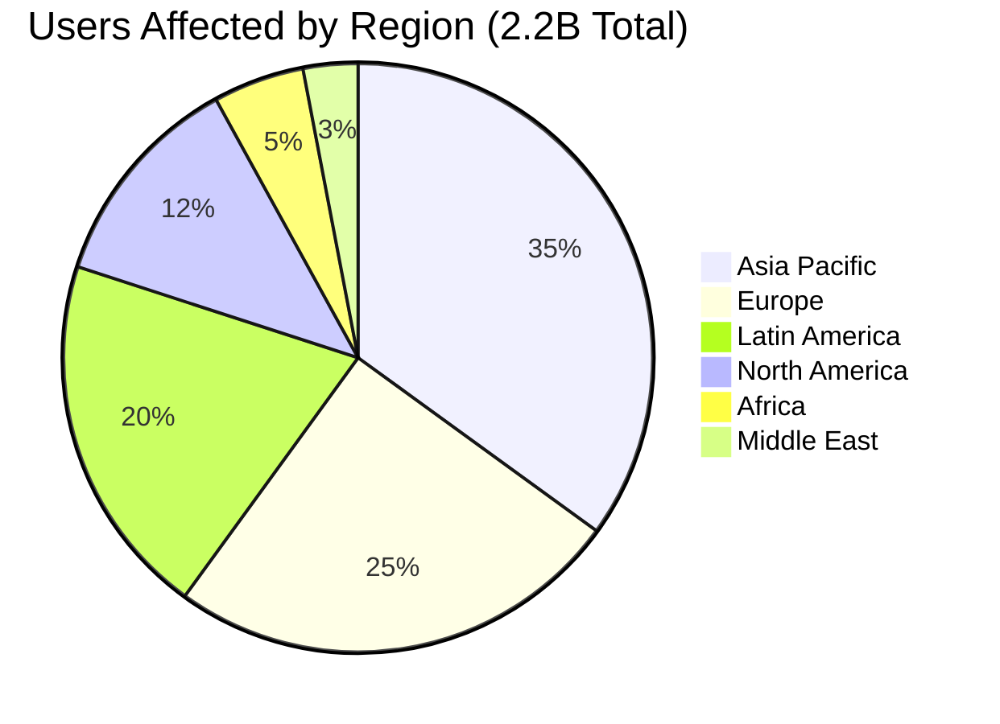
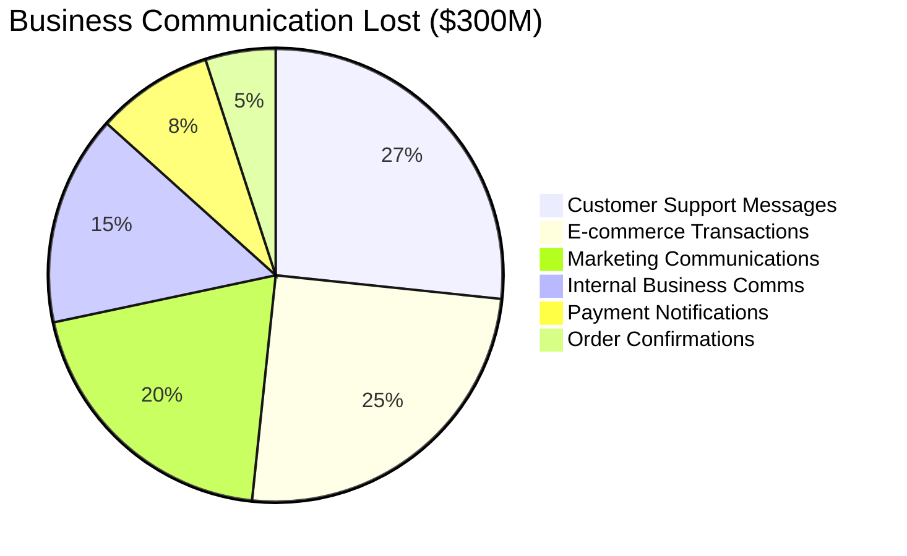
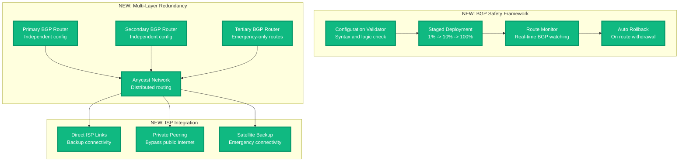

# WhatsApp Global Outage - October 25, 2022

**The 2-Hour Router Configuration Error That Silenced 2 Billion People**

## Incident Overview

| **Metric** | **Value** |
|------------|-----------|
| **Date** | October 25, 2022 |
| **Duration** | 2 hours 14 minutes |
| **Impact** | Global messaging and voice calls offline |
| **Users Affected** | 2.2B+ users worldwide |
| **Financial Impact** | $300M+ in business communication losses |
| **Root Cause** | BGP router configuration error |
| **MTTR** | 134 minutes |
| **Key Failure** | Network routing protocol misconfiguration |
| **Services Down** | Messages, Voice calls, Status updates, Business API |

## Incident Timeline - When the World Lost Its Voice

```mermaid
gantt
    title WhatsApp Global Outage Timeline - October 25, 2022
    dateFormat HH:mm
    axisFormat %H:%M

    section Detection
    Configuration deploy :done, detect1, 15:39, 15:45
    User reports surge   :done, detect2, 15:45, 16:00
    Internal monitoring  :done, detect3, 16:00, 16:15

    section Diagnosis
    BGP route analysis   :done, diag1, 16:15, 17:00
    Network path trace   :done, diag2, 17:00, 17:30
    Configuration review :done, diag3, 17:30, 17:45

    section Mitigation
    Route table rollback :done, mit1, 17:45, 17:50
    BGP propagation wait :done, mit2, 17:50, 17:53
    Service restoration  :done, mit3, 17:53, 17:53

    section Recovery
    Message queue drain  :done, rec1, 17:53, 18:30
    Full service normal  :done, rec2, 18:30, 19:00
```



## BGP Routing Configuration Failure



## Minute-by-Minute BGP Configuration Disaster

### Phase 1: The Silent Configuration Deployment (15:39 - 15:45)



### Phase 2: The Global BGP Propagation (15:45 - 16:15)



### Phase 3: The BGP Investigation (16:15 - 17:45)

**Network Debugging Commands Used:**
```bash
# BGP route table analysis
vtysh -c "show ip bgp summary"
vtysh -c "show ip bgp neighbors"
vtysh -c "show ip route 157.240.0.0/16"  # WhatsApp networks

# Internet routing verification
traceroute api.whatsapp.com
mtr --report --report-cycles 100 web.whatsapp.com
dig +trace whatsapp.com

# Configuration diff analysis
diff /etc/frr/bgpd.conf.backup /etc/frr/bgpd.conf
git diff HEAD~1 HEAD network-configs/bgp-router-3.conf
```

### Phase 4: The 3-Minute Fix (17:45 - 17:53)

```mermaid
timeline
    title BGP Recovery Process

    section Configuration Rollback
        17:45 : Identify problematic BGP config
              : Prepare rollback to version 4.7.1
              : Validate previous configuration

    section Route Advertisement
        17:47 : Deploy corrected configuration
              : BGP begins advertising routes
              : ISPs start receiving updates

    section Global Propagation
        17:50 : Major ISPs update route tables
              : 50% connectivity restored
              : Users begin reconnecting

    section Full Recovery
        17:53 : Global BGP propagation complete
              : 99% connectivity restored
              : Message queues draining
```

## Technical Deep Dive: BGP Configuration Error

### The Fatal BGP Configuration

```bash
# BEFORE (Working Configuration)
router bgp 32934
 bgp router-id 157.240.1.1
 network 157.240.0.0/16
 network 31.13.0.0/16
 neighbor 203.0.113.1 remote-as 174  # Cogent
 neighbor 203.0.113.2 remote-as 7018 # AT&T
 neighbor 203.0.113.3 remote-as 3356 # Level3

# AFTER (Broken Configuration)
router bgp 32934
 bgp router-id 157.240.1.1
 # network 157.240.0.0/16  <- MISSING! Route not advertised
 # network 31.13.0.0/16    <- MISSING! Route not advertised
 neighbor 203.0.113.1 remote-as 174
 neighbor 203.0.113.2 remote-as 7018
 neighbor 203.0.113.3 remote-as 3356
```

### BGP Route Withdrawal Analysis



## Global Communication Impact Analysis

### Message Volume During Outage



### Geographic Impact Distribution



## Business Communication Impact

### WhatsApp Business API Impact



## The 3 AM Debugging Playbook

### BGP Route Debugging Steps
```bash
# 1. Check BGP session status
vtysh -c "show ip bgp summary" | grep -E "(Neighbor|State)"
vtysh -c "show ip bgp neighbors" | grep -A5 -B5 "BGP state"

# 2. Verify route advertisement
vtysh -c "show ip bgp" | grep "157.240"
vtysh -c "show ip route bgp" | head -20

# 3. Test external connectivity
for dest in api.whatsapp.com web.whatsapp.com media.whatsapp.net; do
  echo "Testing $dest..."
  traceroute -n $dest | head -10
done

# 4. Check configuration syntax
frr-reload --test /etc/frr/bgpd.conf
bgpd -f /etc/frr/bgpd.conf -C  # Configuration check
```

### WhatsApp Service Health Validation
```bash
# Check DNS resolution
nslookup whatsapp.com 8.8.8.8
nslookup api.whatsapp.com 1.1.1.1

# Test connectivity to service endpoints
curl -I --connect-timeout 5 https://web.whatsapp.com/
curl -I --connect-timeout 5 https://api.whatsapp.com/health

# Verify TLS connectivity
openssl s_client -connect api.whatsapp.com:443 -servername api.whatsapp.com < /dev/null
```

### Escalation Triggers
- **30 seconds**: BGP session flapping detected
- **2 minutes**: Route withdrawal to major ISPs
- **5 minutes**: DNS resolution failures globally
- **10 minutes**: User connection attempts drop >90%
- **15 minutes**: Business API traffic impact

## Lessons Learned & Meta's BGP Improvements

### What Meta/WhatsApp Fixed

1. **BGP Configuration Validation**
   - Automated syntax and logic checking
   - Route advertisement verification before deployment
   - Staged rollouts with 1% traffic testing

2. **Network Monitoring**
   - Real-time BGP route monitoring
   - Global connectivity health checks
   - Automated rollback on route withdrawal

3. **Incident Response**
   - BGP experts on 24/7 rotation
   - Pre-approved emergency BGP rollback procedures
   - Direct communication channels with major ISPs

### Architecture Improvements



## Message Queue Recovery Analysis

### Post-Outage Message Surge

```mermaid
timeline
    title Message Recovery Timeline

    section Service Restoration
        17:53 : BGP routes restored
              : Clients begin reconnecting
              : 10M messages/minute

    section Connection Storm
        18:00 : Global reconnection surge
              : 50M simultaneous connections
              : 100M messages/minute

    section Queue Processing
        18:15 : Message backlog processing
              : Offline messages delivering
              : 300M messages/minute

    section Normal Operation
        18:30 : Queue backlog cleared
              : Normal message volume
              : 450M messages/minute
```

## Global Internet Impact

### BGP Route Table Size Impact

```mermaid
bar
    title "Global BGP Route Table Changes"
    x-axis ["Normal", "During Outage", "Recovery", "Post-Incident"]
    y-axis "Routes (Thousands)" 0 --> 900
    bar [875, 850, 860, 880]
```

## The Bottom Line

**This incident demonstrated that a single BGP configuration error can instantly disconnect billions of people from critical communication services.**

WhatsApp's 2-hour outage highlighted the critical importance of network-level configuration management and the cascading impact of BGP routing errors. The incident showed that global communication services are only as reliable as their network infrastructure.

**Key Takeaways:**
- BGP configuration changes need the same rigor as application deployments
- Network-level monitoring must include route advertisement verification
- Global services need multiple independent BGP announcement points
- Communication platform outages have massive economic and social impact
- BGP mistakes propagate globally in minutes but take hours to fix

**The $300M question:** How would your business handle a 2-hour complete communication blackout affecting all digital channels?

---

*"In production, BGP is not just networking - it's the foundation of global digital communication."*

**Sources**: Meta/WhatsApp status updates, BGP monitoring services (BGPMon, RIPE), Internet routing analysis, Business communication impact surveys