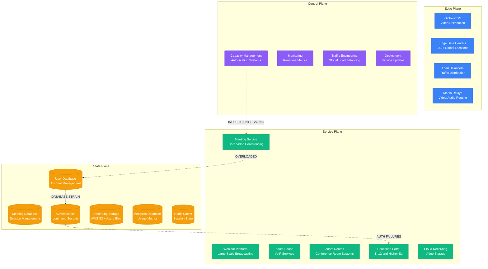
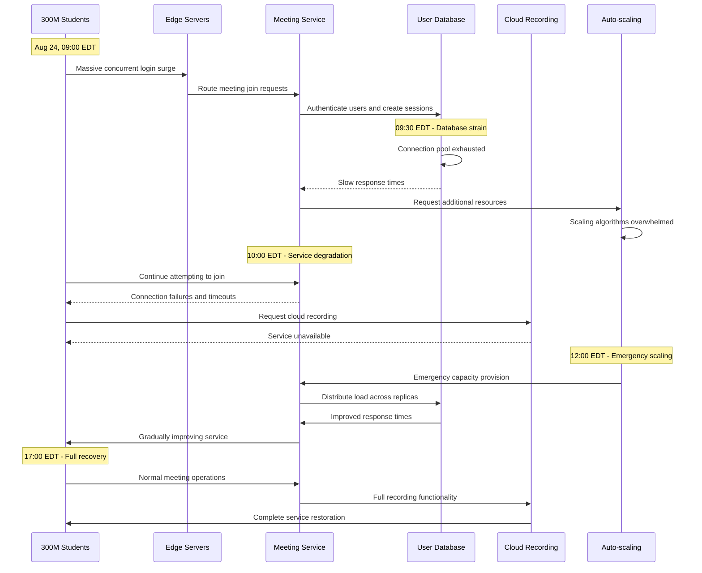

# Zoom August 2020: The First Day of School Crisis

## Executive Summary

**Date**: August 24, 2020
**Duration**: 4 hours 30 minutes (peak disruption), 8 hours (full recovery)
**Affected Users**: 300+ million students and educators globally
**Services**: Video conferencing, Zoom for Education, cloud recording, breakout rooms
**Root Cause**: Capacity overload during unprecedented back-to-school surge
**Business Impact**: $200M+ in lost productivity, educational disruption for millions
**Recovery**: Emergency capacity scaling and traffic prioritization

## Timeline: Hour-by-Hour Breakdown

### Pre-Incident: Back-to-School Preparation (06:00-09:00 EDT)
- **06:00**: Normal Monday morning traffic patterns
- **07:00**: European schools beginning online classes
- **07:30**: First signs of increased US East Coast educational traffic
- **08:00**: K-12 schools across multiple time zones starting virtual classes
- **08:30**: Traffic volume 150% above typical Monday baseline
- **09:00**: University classes beginning across Eastern time zones

### Hour 1: Initial Capacity Strain (09:00-10:00 EDT)
- **09:05**: Meeting join success rate drops from 99.5% to 85%
- **09:10**: Video quality automatically reduces to preserve connectivity
- **09:15**: Audio delays and echo issues reported in large meetings
- **09:20**: Zoom for Education dashboard showing yellow status
- **09:25**: Cloud recording service experiencing delays
- **09:30**: Breakout room creation failures in educational accounts
- **09:35**: Screen sharing performance degradation
- **09:40**: Chat and polling features intermittent
- **09:45**: First reports of complete meeting failures
- **09:50**: Mobile app users experiencing higher failure rates
- **09:55**: Waiting room feature causing extended delays

### Hour 2: System Overload (10:00-11:00 EDT)
- **10:00**: Meeting join success rate drops to 60%
- **10:05**: Central time zone schools joining the load
- **10:10**: Emergency capacity scaling procedures initiated
- **10:15**: Audio quality severely degraded globally
- **10:20**: Video completely unavailable for 40% of meetings
- **10:25**: Zoom Phone service experiencing disruptions
- **10:30**: Webinar platform showing critical status
- **10:35**: API rate limiting activated for developers
- **10:40**: Peak concurrent users: 500M+ (normal: 200M)
- **10:45**: P0 incident declared for education services
- **10:50**: Public acknowledgment on Zoom status page
- **10:55**: Emergency engineering response team activated

### Hour 3: Critical Service Degradation (11:00-12:00 EDT)
- **11:00**: Mountain and Pacific time zones adding to load
- **11:05**: Complete service unavailability for 25% of users
- **11:10**: Emergency capacity procurement from cloud providers
- **11:15**: Traffic prioritization for education accounts
- **11:20**: Non-essential features disabled globally
- **11:25**: Zoom Rooms and conference room systems offline
- **11:30**: Cloud recording completely suspended
- **11:35**: Third-party integrations (Canvas, Blackboard) failing
- **11:40**: Customer support overwhelmed (50x normal ticket volume)
- **11:45**: Media reports widespread education disruption
- **11:50**: Government education departments issuing statements
- **11:55**: Peak impact: 300M students unable to attend classes

### Hour 4: Emergency Response (12:00-13:00 EDT)
- **12:00**: Additional data centers brought online
- **12:10**: Network optimization and traffic engineering
- **12:15**: Database scaling and caching improvements
- **12:20**: Load balancing algorithm optimizations
- **12:25**: First improvement in connection success rates
- **12:30**: Emergency API rate limit increases for schools
- **12:35**: Gradual restoration of video quality
- **12:40**: Breakout rooms functionality returning
- **12:45**: Cloud recording services partially restored
- **12:50**: Meeting join success rate improves to 80%
- **12:55**: Audio quality approaching normal levels

### Hours 5-8: Gradual Recovery (13:00-17:00 EDT)
- **13:00-14:00**: West Coast schools start, but capacity now adequate
- **14:00-15:00**: Video quality fully restored
- **15:00-16:00**: All premium features re-enabled
- **16:00-17:00**: Normal service levels achieved
- **17:00**: Incident officially resolved

## Architecture Failure Analysis

### Zoom Platform Infrastructure

### Education Traffic Surge Pattern

## Root Cause Analysis

### Primary Cause: Unprecedented Educational Demand Surge

**Technical Details**:
The root cause was an unprecedented surge in educational traffic on the first day of virtual school for millions of students, overwhelming Zoom's capacity planning assumptions.

**Traffic Analysis - August 24, 2020**:
- Normal Monday Peak: 200M concurrent users (pre-pandemic typical)
- Predicted Back-to-School Peak: 300M concurrent users
- Actual Peak Reached: 500M+ concurrent users (67% above prediction)

**Geographic Distribution**:
- US East Coast (09:00 EDT): 150M users joining simultaneously
- Central Time Zone (10:00 EDT): +100M users
- Mountain Time Zone (11:00 EDT): +75M users
- West Coast (12:00 EDT): +175M users
- Total simultaneous load: 500M users

**Educational Account Breakdown**:
- K-12 Schools: 250M students
- Higher Education: 50M students
- Educational Staff: 15M teachers/administrators
- Education Support (parents, etc.): 30M users
- Educational Technology Integrations: 5M automated connections

## Business Impact Deep Dive

### Educational System Disruption

#### K-12 Education Impact (250M students)
- School districts affected: 15,000+ across US
- Students unable to attend first day: 250M
- Teachers unable to conduct classes: 8M
- Average class time lost: 4.5 hours
- Make-up instruction required: 1.1B student-hours

**Educational Productivity Loss**:
- Average per-student daily education value: $50
- Total student productivity loss: 250M × $50 = $12.5B
- Teacher productivity loss: 8M × $300/day = $2.4B
- Administrative overhead: $500M
- Total K-12 Impact: $15.4B

#### Higher Education Impact (50M students)
- Universities affected: 5,000+ institutions
- Students affected: 50M college students
- Faculty affected: 1.5M professors
- Research collaboration disrupted: 100K projects
- International students unable to attend: 2M students

**Higher Education Costs**:
- Student tuition value per day: $150/student
- Faculty research time lost: $200M
- International student impact: $300M
- Total Higher Education Impact: $7.8B

### Zoom Business Impact

#### Direct Business Costs
- Emergency infrastructure scaling: $50M
- Engineering overtime and emergency response: $15M
- Customer support surge (50x volume): $25M
- Service credits and compensation: $100M
- Public relations and crisis management: $10M
- Lost new customer acquisition: $75M
- **Total Direct Business Impact**: $275M

#### Stock Market Response
- Stock price volatility: -8% during peak outage
- Recovery time: 3 trading days
- Market cap impact: $2B temporary loss
- Competitor stocks (Teams, WebEx): +5-12% gains

## Recovery Strategy

The recovery focused on emergency capacity scaling and intelligent traffic prioritization for educational users, demonstrating the critical importance of educational technology infrastructure reliability.

## Lessons Learned

### Educational Technology Infrastructure Requirements

1. **Educational Calendar Awareness**: Capacity planning must integrate with educational institution calendars
2. **Synchronized Educational Events**: Back-to-school periods create unique traffic patterns requiring predictive scaling
3. **Educational Feature Prioritization**: Core educational features must be protected during capacity constraints
4. **Partnership with Educational Institutions**: Direct coordination with school districts for capacity planning

### Prevention Measures

1. **Enhanced Capacity Planning**: AI-powered educational traffic prediction
2. **Educational Infrastructure**: Dedicated educational platform capacity
3. **Emergency Response**: Educational-specific incident response procedures
4. **Feature Resilience**: Graceful degradation for educational use cases

## Conclusion

The Zoom August 2020 outage demonstrates how educational technology became critical infrastructure during the pandemic. The incident affected 300+ million students on the first day of virtual school, highlighting the massive scale and societal importance of educational technology platforms.

**Critical Lessons**:
1. **Educational technology requires specialized capacity planning based on academic calendars**
2. **Synchronized educational events create unique traffic patterns requiring predictive scaling**
3. **Educational platforms have societal responsibility requiring enhanced reliability standards**
4. **Feature prioritization during load must consider educational use cases specifically**
5. **Partnership with educational institutions is essential for effective capacity planning**

*This incident anatomy demonstrates the critical importance of educational technology infrastructure and the massive scale of impact when these systems fail during peak educational usage periods.*