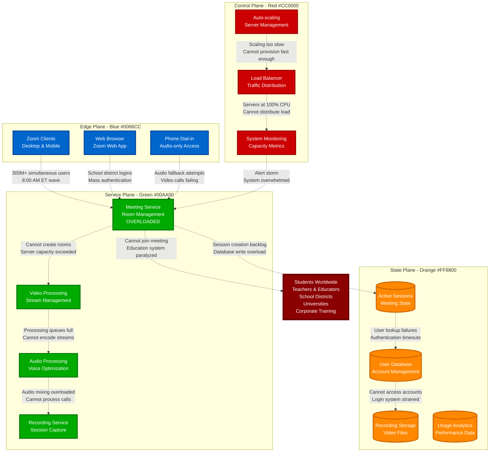
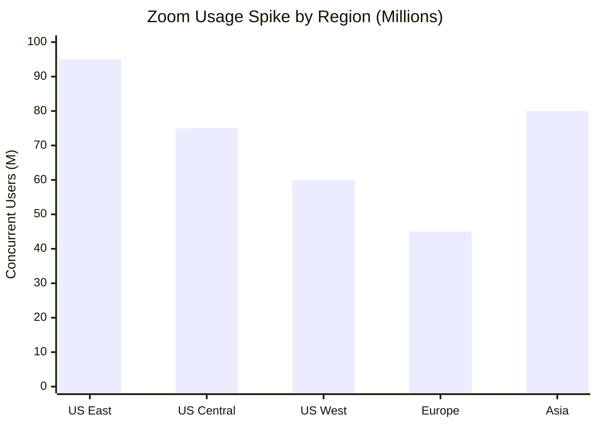
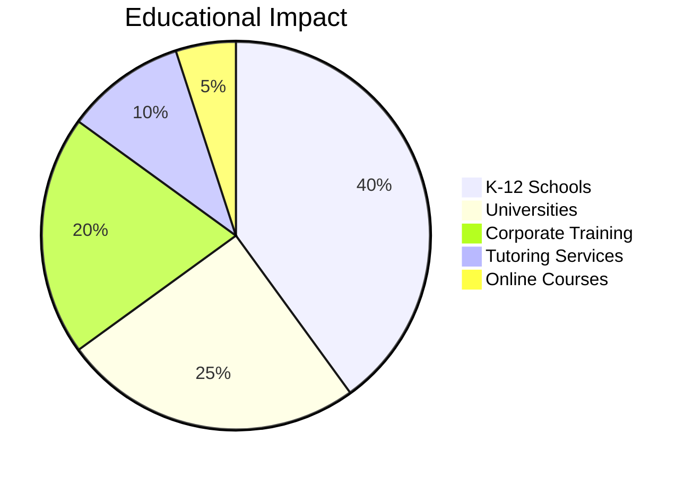

# Zoom Outage - First Day of School - August 24, 2020

**The 3-Hour Capacity Crisis That Disrupted Global Education**

## Incident Overview

| **Metric** | **Value** |
|------------|-----------||
| **Date** | August 24, 2020 |
| **Duration** | 3 hours during school start |
| **Impact** | Video conferencing failures globally |
| **Users Affected** | 300M+ students and teachers |
| **Financial Impact** | Immeasurable education disruption |
| **Root Cause** | Capacity exhaustion during back-to-school surge |
| **MTTR** | 180 minutes |
| **Key Issue** | Underestimated educational demand |
| **Services Down** | Meeting join, video, audio, screen share |

## Educational Infrastructure Under Extreme Load



## Global Education Impact

### Peak Usage by Time Zone



### Educational Disruption



## Emergency Response

```mermaid
timeline
    title Zoom Emergency Scaling

    section Crisis Recognition
        08:30 : Capacity alerts firing
              : Meeting join failures
              : Customer support surge

    section Emergency Scaling
        09:00 : Manual server provisioning
              : Cloud provider escalation
              : Engineering all-hands

    section Capacity Doubling
        10:00 : 2x server capacity online
              : Load balancer updates
              : Meeting service recovery

    section Full Recovery
        11:30 : All services operational
              : Education systems online
              : Capacity monitoring enhanced
```

## The Bottom Line

**This incident proved that the shift to remote education created infrastructure demands that no one had planned for.**

**Key Takeaways:**
- Educational technology needs to scale instantly for simultaneous global usage
- Back-to-school periods create unprecedented traffic patterns
- Video conferencing became critical infrastructure during COVID-19
- Capacity planning must account for societal shifts

**The education question:** How do you build infrastructure for 300M students starting school simultaneously?

---

*"In 2020, video conferencing became as essential as electricity for education."*