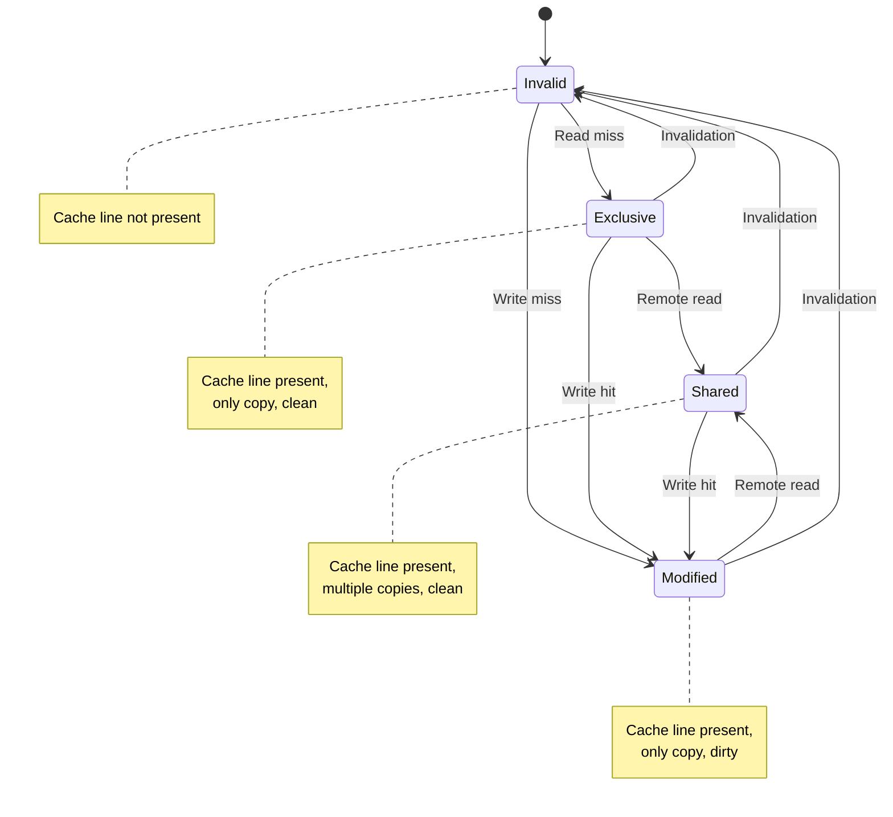
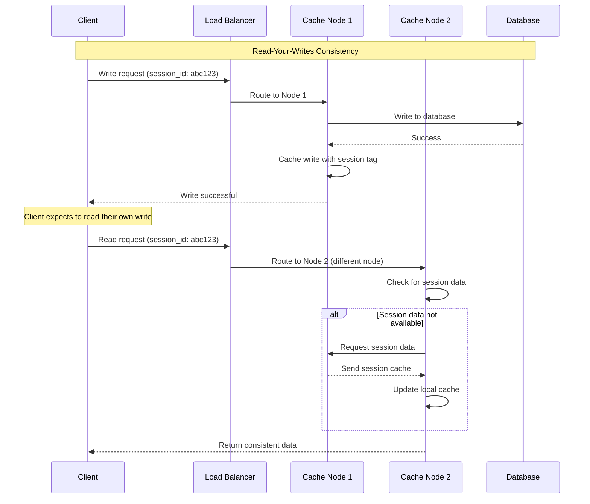

# Cache Consistency and Coherence

## Overview of Cache Consistency

Cache consistency ensures that all cache instances in a distributed system have a coherent view of the data, preventing stale reads and maintaining data integrity across multiple cache layers.

### Consistency Model Spectrum

```mermaid
graph LR
    subgraph Cache_Consistency_Models[""Cache Consistency Models""]
        subgraph Strong_Consistency[""Strong Consistency""]
            STRONG[Strong Consistency<br/>✅ Immediate consistency<br/>✅ No stale reads<br/>❌ Higher latency<br/>❌ Reduced availability]
        end

        subgraph Eventual_Consistency[""Eventual Consistency""]
            EVENTUAL[Eventual Consistency<br/>✅ High availability<br/>✅ Low latency<br/>❌ Temporary inconsistency<br/>❌ Complex conflict resolution]
        end

        subgraph Weak_Consistency[""Weak Consistency""]
            WEAK[Weak Consistency<br/>✅ Maximum performance<br/>✅ High scalability<br/>❌ No consistency guarantees<br/>❌ Application complexity]
        end

        subgraph Session_Consistency[""Session Consistency""]
            SESSION[Session Consistency<br/>✅ Per-session coherence<br/>✅ Good user experience<br/>❌ Cross-session inconsistency<br/>❌ Session management]
        end
    end

    STRONG --> EVENTUAL
    EVENTUAL --> WEAK
    WEAK --> SESSION

    %% Apply 4-plane colors
    classDef edgeStyle fill:#3B82F6,stroke:#2563EB,color:#fff
    classDef serviceStyle fill:#10B981,stroke:#059669,color:#fff
    classDef stateStyle fill:#F59E0B,stroke:#D97706,color:#fff
    classDf controlStyle fill:#8B5CF6,stroke:#7C3AED,color:#fff

    class STRONG edgeStyle
    class EVENTUAL serviceStyle
    class WEAK stateStyle
    class SESSION controlStyle
```

## Cache Coherence Protocols

### MESI Protocol for Distributed Caches



### Cache Coherence Implementation

```python
# Distributed cache coherence protocol implementation
import asyncio
import json
import time
from typing import Dict, Set, Optional, List
from enum import Enum
import redis.asyncio as redis
from dataclasses import dataclass

class CacheLineState(Enum):
    INVALID = "invalid"
    EXCLUSIVE = "exclusive"
    SHARED = "shared"
    MODIFIED = "modified"

@dataclass
class CacheLineMetadata:
    state: CacheLineState
    version: int
    last_modified: float
    owner_node: Optional[str] = None
    sharers: Set[str] = None

    def __post_init__(self):
        if self.sharers is None:
            self.sharers = set()

class DistributedCacheCoherence:
    def __init__(self, node_id: str, redis_url: str):
        self.node_id = node_id
        self.redis = redis.from_url(redis_url)
        self.local_cache: Dict[str, any] = {}
        self.cache_metadata: Dict[str, CacheLineMetadata] = {}
        self.peer_nodes: Set[str] = set()
        self.running = False

    async def start(self):
        """Start the coherence protocol"""
        self.running = True
        await self._register_node()
        asyncio.create_task(self._listen_for_coherence_messages())

    async def stop(self):
        """Stop the coherence protocol"""
        self.running = False
        await self._unregister_node()
        await self.redis.close()

    async def read(self, key: str) -> Optional[any]:
        """Read from cache with coherence protocol"""
        # Check local cache first
        if key in self.local_cache:
            metadata = self.cache_metadata[key]

            if metadata.state in [CacheLineState.EXCLUSIVE,
                                CacheLineState.SHARED,
                                CacheLineState.MODIFIED]:
                return self.local_cache[key]

        # Cache miss - request from peers or source
        return await self._handle_cache_miss(key)

    async def write(self, key: str, value: any) -> bool:
        """Write to cache with coherence protocol"""
        # Get current metadata
        metadata = self.cache_metadata.get(key)

        if metadata is None:
            # New cache line
            await self._handle_write_miss(key, value)
        elif metadata.state == CacheLineState.INVALID:
            # Invalid cache line
            await self._handle_write_miss(key, value)
        elif metadata.state in [CacheLineState.EXCLUSIVE, CacheLineState.MODIFIED]:
            # We own the cache line
            await self._handle_write_hit(key, value)
        elif metadata.state == CacheLineState.SHARED:
            # Need to invalidate other copies
            await self._handle_shared_write(key, value)

        return True

    async def _handle_cache_miss(self, key: str) -> Optional[any]:
        """Handle cache miss by requesting from peers"""
        # Send read request to all peers
        await self._broadcast_read_request(key)

        # Wait for responses
        responses = await self._collect_read_responses(key, timeout=1.0)

        if responses:
            # Choose the most recent version
            best_response = max(responses, key=lambda r: r['version'])
            value = best_response['value']
            version = best_response['version']
            owner = best_response['owner']

            # Update local cache
            self.local_cache[key] = value
            self.cache_metadata[key] = CacheLineMetadata(
                state=CacheLineState.SHARED if responses else CacheLineState.EXCLUSIVE,
                version=version,
                last_modified=time.time(),
                owner_node=owner,
                sharers={self.node_id}
            )

            # Notify owner that we're sharing
            if owner != self.node_id:
                await self._send_share_notification(owner, key)

            return value

        # No peer has the data - would fetch from source here
        return None

    async def _handle_write_miss(self, key: str, value: any):
        """Handle write to non-existent cache line"""
        # Invalidate any existing copies on peers
        await self._broadcast_invalidation(key)

        # Create new cache line in Modified state
        self.local_cache[key] = value
        self.cache_metadata[key] = CacheLineMetadata(
            state=CacheLineState.MODIFIED,
            version=1,
            last_modified=time.time(),
            owner_node=self.node_id
        )

    async def _handle_write_hit(self, key: str, value: any):
        """Handle write to owned cache line"""
        metadata = self.cache_metadata[key]

        # Update value and version
        self.local_cache[key] = value
        metadata.version += 1
        metadata.last_modified = time.time()
        metadata.state = CacheLineState.MODIFIED

    async def _handle_shared_write(self, key: str, value: any):
        """Handle write to shared cache line"""
        # Invalidate all other copies
        await self._broadcast_invalidation(key)

        # Update to Modified state
        metadata = self.cache_metadata[key]
        self.local_cache[key] = value
        metadata.version += 1
        metadata.last_modified = time.time()
        metadata.state = CacheLineState.MODIFIED
        metadata.owner_node = self.node_id
        metadata.sharers = {self.node_id}

    async def _broadcast_read_request(self, key: str):
        """Broadcast read request to all peers"""
        message = {
            'type': 'read_request',
            'key': key,
            'sender': self.node_id,
            'timestamp': time.time()
        }

        channel = "cache_coherence:read_requests"
        await self.redis.publish(channel, json.dumps(message))

    async def _broadcast_invalidation(self, key: str):
        """Broadcast invalidation to all peers"""
        message = {
            'type': 'invalidation',
            'key': key,
            'sender': self.node_id,
            'timestamp': time.time()
        }

        channel = "cache_coherence:invalidations"
        await self.redis.publish(channel, json.dumps(message))

    async def _send_share_notification(self, owner_node: str, key: str):
        """Notify owner that we're sharing the cache line"""
        message = {
            'type': 'share_notification',
            'key': key,
            'sharer': self.node_id,
            'timestamp': time.time()
        }

        channel = f"cache_coherence:node:{owner_node}"
        await self.redis.publish(channel, json.dumps(message))

    async def _collect_read_responses(self, key: str, timeout: float) -> List[Dict]:
        """Collect responses to read request"""
        responses = []
        start_time = time.time()

        # In practice, this would use a proper response collection mechanism
        # For demo, we'll simulate immediate responses
        await asyncio.sleep(0.1)

        return responses

    async def _register_node(self):
        """Register this node in the cluster"""
        await self.redis.sadd("cache_nodes", self.node_id)

        # Get list of peer nodes
        nodes = await self.redis.smembers("cache_nodes")
        self.peer_nodes = {node.decode() for node in nodes if node.decode() != self.node_id}

    async def _unregister_node(self):
        """Unregister this node from the cluster"""
        await self.redis.srem("cache_nodes", self.node_id)

    async def _listen_for_coherence_messages(self):
        """Listen for coherence protocol messages"""
        pubsub = self.redis.pubsub()

        # Subscribe to relevant channels
        await pubsub.subscribe("cache_coherence:read_requests")
        await pubsub.subscribe("cache_coherence:invalidations")
        await pubsub.subscribe(f"cache_coherence:node:{self.node_id}")

        try:
            while self.running:
                message = await pubsub.get_message(timeout=1.0)
                if message and message['type'] == 'message':
                    await self._handle_coherence_message(message)
        except asyncio.CancelledError:
            pass
        finally:
            await pubsub.unsubscribe()

    async def _handle_coherence_message(self, message):
        """Handle incoming coherence protocol message"""
        try:
            data = json.loads(message['data'])
            msg_type = data['type']

            if msg_type == 'read_request':
                await self._handle_read_request(data)
            elif msg_type == 'invalidation':
                await self._handle_invalidation(data)
            elif msg_type == 'share_notification':
                await self._handle_share_notification(data)

        except Exception as e:
            print(f"Error handling coherence message: {e}")

    async def _handle_read_request(self, data: Dict):
        """Handle read request from peer"""
        key = data['key']
        sender = data['sender']

        if key in self.local_cache:
            metadata = self.cache_metadata[key]

            if metadata.state in [CacheLineState.EXCLUSIVE,
                                CacheLineState.SHARED,
                                CacheLineState.MODIFIED]:

                # Send response with data
                response = {
                    'type': 'read_response',
                    'key': key,
                    'value': self.local_cache[key],
                    'version': metadata.version,
                    'owner': metadata.owner_node,
                    'sender': self.node_id
                }

                channel = f"cache_coherence:node:{sender}"
                await self.redis.publish(channel, json.dumps(response))

                # Transition to Shared state if we were Exclusive
                if metadata.state == CacheLineState.EXCLUSIVE:
                    metadata.state = CacheLineState.SHARED
                    metadata.sharers.add(sender)

    async def _handle_invalidation(self, data: Dict):
        """Handle invalidation message"""
        key = data['key']
        sender = data['sender']

        if key in self.cache_metadata:
            # Invalidate our copy
            self.cache_metadata[key].state = CacheLineState.INVALID

            # Optionally remove from local cache to save memory
            if key in self.local_cache:
                del self.local_cache[key]

    async def _handle_share_notification(self, data: Dict):
        """Handle notification that another node is sharing our cache line"""
        key = data['key']
        sharer = data['sharer']

        if key in self.cache_metadata:
            metadata = self.cache_metadata[key]

            # Add sharer and transition to Shared state
            metadata.sharers.add(sharer)
            if metadata.state == CacheLineState.EXCLUSIVE:
                metadata.state = CacheLineState.SHARED

    def get_cache_statistics(self) -> Dict:
        """Get cache coherence statistics"""
        state_counts = {}
        for state in CacheLineState:
            state_counts[state.value] = 0

        for metadata in self.cache_metadata.values():
            state_counts[metadata.state.value] += 1

        return {
            'node_id': self.node_id,
            'total_cache_lines': len(self.cache_metadata),
            'state_distribution': state_counts,
            'peer_nodes': list(self.peer_nodes),
            'local_cache_size': len(self.local_cache)
        }

# Vector clock-based consistency for eventual consistency
class VectorClockCache:
    def __init__(self, node_id: str):
        self.node_id = node_id
        self.cache: Dict[str, Dict] = {}
        self.vector_clock: Dict[str, int] = {}

    def put(self, key: str, value: any, origin_node: str = None) -> Dict[str, int]:
        """Put value with vector clock"""
        origin = origin_node or self.node_id

        # Increment vector clock for origin node
        self.vector_clock[origin] = self.vector_clock.get(origin, 0) + 1

        # Store value with vector clock
        self.cache[key] = {
            'value': value,
            'vector_clock': self.vector_clock.copy(),
            'timestamp': time.time()
        }

        return self.vector_clock.copy()

    def get(self, key: str) -> Optional[Dict]:
        """Get value with vector clock"""
        return self.cache.get(key)

    def merge_concurrent_updates(self, key: str, updates: List[Dict]) -> any:
        """Merge concurrent updates using vector clocks"""
        if not updates:
            return None

        # Find updates that are not causally related (concurrent)
        concurrent_updates = []

        for update in updates:
            is_concurrent = True
            update_vc = update['vector_clock']

            for other_update in updates:
                if update == other_update:
                    continue

                other_vc = other_update['vector_clock']
                if self._vector_clock_less_than(update_vc, other_vc):
                    is_concurrent = False
                    break

            if is_concurrent:
                concurrent_updates.append(update)

        if len(concurrent_updates) == 1:
            return concurrent_updates[0]['value']

        # Application-specific conflict resolution
        return self._resolve_conflicts(key, concurrent_updates)

    def _vector_clock_less_than(self, vc1: Dict[str, int], vc2: Dict[str, int]) -> bool:
        """Check if vc1 < vc2 (happened-before relationship)"""
        all_nodes = set(vc1.keys()) | set(vc2.keys())

        has_smaller = False
        for node in all_nodes:
            v1 = vc1.get(node, 0)
            v2 = vc2.get(node, 0)

            if v1 > v2:
                return False
            elif v1 < v2:
                has_smaller = True

        return has_smaller

    def _resolve_conflicts(self, key: str, concurrent_updates: List[Dict]) -> any:
        """Application-specific conflict resolution"""
        # Last-writer-wins based on timestamp
        latest_update = max(concurrent_updates, key=lambda u: u['timestamp'])
        return latest_update['value']

# Example usage and testing
async def demo_cache_coherence():
    # Create three cache nodes
    node1 = DistributedCacheCoherence("node1", "redis://localhost:6379")
    node2 = DistributedCacheCoherence("node2", "redis://localhost:6379")
    node3 = DistributedCacheCoherence("node3", "redis://localhost:6379")

    try:
        # Start all nodes
        await node1.start()
        await node2.start()
        await node3.start()

        print("=== Cache Coherence Demo ===")

        # Node1 writes a value
        print("\n1. Node1 writes 'hello' to key 'test'")
        await node1.write("test", "hello")
        stats1 = node1.get_cache_statistics()
        print(f"Node1 stats: {stats1}")

        # Node2 reads the same key
        print("\n2. Node2 reads key 'test'")
        value = await node2.read("test")
        print(f"Node2 read value: {value}")
        stats2 = node2.get_cache_statistics()
        print(f"Node2 stats: {stats2}")

        # Node3 writes to the same key
        print("\n3. Node3 writes 'world' to key 'test'")
        await node3.write("test", "world")
        stats3 = node3.get_cache_statistics()
        print(f"Node3 stats: {stats3}")

        # Node1 reads again (should get invalidated)
        print("\n4. Node1 reads key 'test' again")
        value = await node1.read("test")
        print(f"Node1 read value: {value}")

        print("\nCache coherence demo completed")

    finally:
        await node1.stop()
        await node2.stop()
        await node3.stop()

def demo_vector_clock_consistency():
    print("\n=== Vector Clock Consistency Demo ===")

    # Create cache nodes with vector clocks
    cache1 = VectorClockCache("node1")
    cache2 = VectorClockCache("node2")
    cache3 = VectorClockCache("node3")

    # Simulate concurrent updates
    print("\n1. Concurrent updates to same key")

    # Node1 updates
    vc1 = cache1.put("user:123", {"name": "John", "age": 25})
    print(f"Node1 update - Vector clock: {vc1}")

    # Node2 updates concurrently
    vc2 = cache2.put("user:123", {"name": "John", "email": "john@example.com"})
    print(f"Node2 concurrent update - Vector clock: {vc2}")

    # Merge updates
    updates = [
        cache1.get("user:123"),
        cache2.get("user:123")
    ]

    merged_value = cache1.merge_concurrent_updates("user:123", updates)
    print(f"Merged value: {merged_value}")

if __name__ == "__main__":
    asyncio.run(demo_cache_coherence())
    demo_vector_clock_consistency()
```

## Read-Your-Writes Consistency

### Session Consistency Implementation



This comprehensive guide to cache consistency and coherence protocols provides the foundation for maintaining data integrity across distributed cache systems while balancing performance and availability requirements.