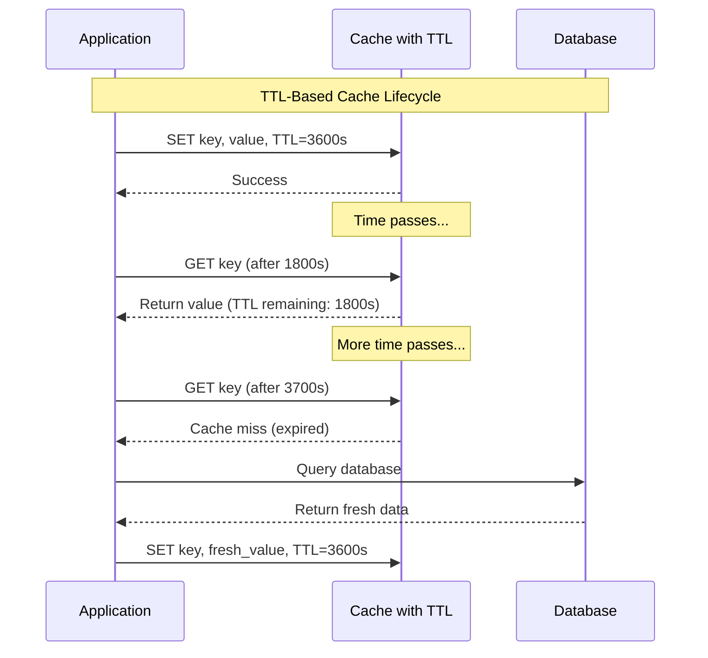
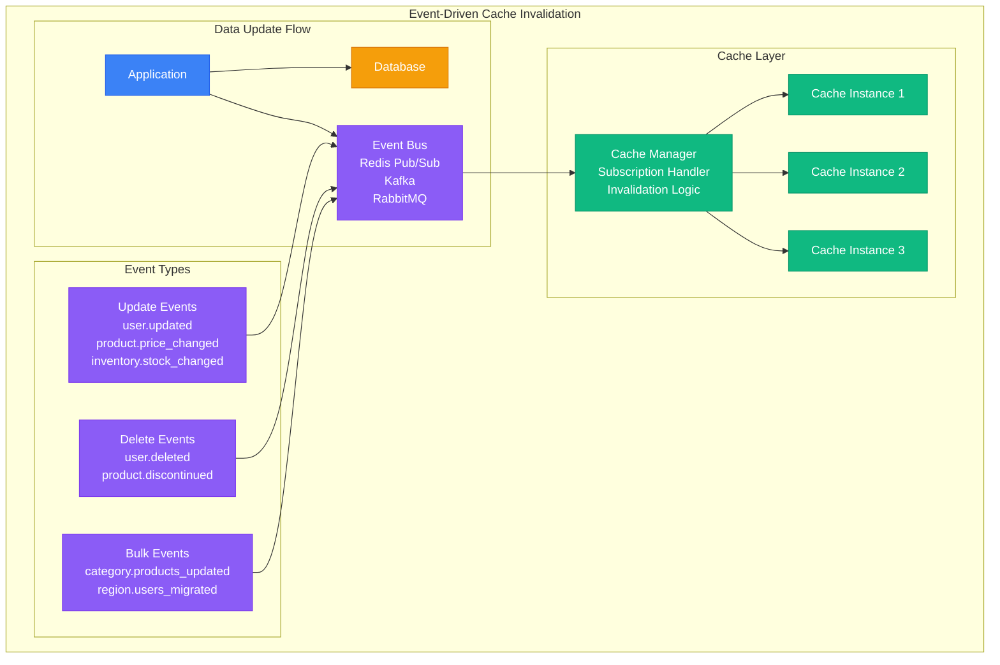

# Cache Invalidation Strategies

## Overview of Invalidation Approaches

Cache invalidation ensures data consistency by removing or updating stale cached data. The choice of invalidation strategy significantly impacts both performance and data accuracy.

### Invalidation Strategy Comparison

```mermaid
graph TB
    subgraph "Cache Invalidation Strategies"
        subgraph "Time-Based Invalidation"
            TTL[Time-To-Live (TTL)<br/>✅ Simple to implement<br/>✅ Automatic cleanup<br/>❌ May serve stale data<br/>❌ Fixed expiration time]
            SLIDING[Sliding Window<br/>✅ Adapts to usage<br/>✅ Keep hot data longer<br/>❌ Complex implementation<br/>❌ Unpredictable expiry]
        end

        subgraph "Event-Driven Invalidation"
            MANUAL[Manual Invalidation<br/>✅ Immediate consistency<br/>✅ Precise control<br/>❌ Complex coordination<br/>❌ Application coupling]
            PUBLISH[Publish-Subscribe<br/>✅ Decoupled invalidation<br/>✅ Multi-cache coordination<br/>❌ Message delivery issues<br/>❌ Network dependency]
        end

        subgraph "Write-Pattern Invalidation"
            WRITE_THROUGH[Write-Through<br/>✅ Always consistent<br/>✅ Simplified reads<br/>❌ Higher write latency<br/>❌ All writes cached]
            WRITE_AROUND[Write-Around<br/>✅ Fast writes<br/>✅ No write amplification<br/>❌ Cache misses on reads<br/>❌ Manual invalidation needed]
        end

        subgraph "Intelligent Invalidation"
            DEPENDENCY[Dependency-Based<br/>✅ Precise invalidation<br/>✅ Minimal cache waste<br/>❌ Complex relationships<br/>❌ Maintenance overhead]
            VERSION[Version-Based<br/>✅ Conflict detection<br/>✅ Concurrent updates<br/>❌ Version management<br/>❌ Storage overhead]
        end
    end

    %% Apply 4-plane colors
    classDef edgeStyle fill:#3B82F6,stroke:#2563EB,color:#fff
    classDef serviceStyle fill:#10B981,stroke:#059669,color:#fff
    classDef stateStyle fill:#F59E0B,stroke:#D97706,color:#fff
    classDef controlStyle fill:#8B5CF6,stroke:#7C3AED,color:#fff

    class TTL,SLIDING edgeStyle
    class MANUAL,PUBLISH serviceStyle
    class WRITE_THROUGH,WRITE_AROUND stateStyle
    class DEPENDENCY,VERSION controlStyle
```

## Time-Based Invalidation (TTL)

### TTL Implementation Patterns



### Smart TTL Implementation

```python
# Intelligent TTL management
import time
import redis
import random
from typing import Optional, Union
from datetime import datetime, timedelta
import json

class SmartTTLCache:
    def __init__(self, redis_client):
        self.cache = redis_client
        self.default_ttl = 3600  # 1 hour
        self.min_ttl = 300      # 5 minutes
        self.max_ttl = 86400    # 24 hours

    def set_with_smart_ttl(self, key: str, value: any,
                          access_frequency: float = 1.0,
                          data_volatility: float = 0.5) -> bool:
        """Set cache entry with TTL based on access patterns and data characteristics"""

        # Calculate TTL based on multiple factors
        base_ttl = self._calculate_base_ttl(access_frequency, data_volatility)

        # Add jitter to prevent thundering herd
        jitter = random.uniform(0.8, 1.2)
        final_ttl = int(base_ttl * jitter)

        # Ensure TTL is within bounds
        final_ttl = max(self.min_ttl, min(final_ttl, self.max_ttl))

        try:
            # Store value with calculated TTL
            serialized_value = json.dumps({
                'data': value,
                'created_at': time.time(),
                'access_count': 0,
                'last_access': time.time()
            })

            return self.cache.setex(key, final_ttl, serialized_value)
        except Exception as e:
            print(f"Failed to set cache key {key}: {e}")
            return False

    def get_with_refresh_ahead(self, key: str, refresh_threshold: float = 0.8) -> Optional[any]:
        """Get value and trigger refresh if near expiry"""
        try:
            # Get value and TTL
            pipe = self.cache.pipeline()
            pipe.get(key)
            pipe.ttl(key)
            results = pipe.execute()

            cached_data = results[0]
            ttl_remaining = results[1]

            if not cached_data:
                return None

            # Deserialize data
            data_wrapper = json.loads(cached_data)
            value = data_wrapper['data']

            # Update access statistics
            data_wrapper['access_count'] += 1
            data_wrapper['last_access'] = time.time()

            # Check if refresh is needed
            if ttl_remaining > 0:
                # Calculate original TTL
                created_at = data_wrapper['created_at']
                age = time.time() - created_at
                estimated_original_ttl = age + ttl_remaining

                # Trigger refresh if near expiry
                if ttl_remaining < (estimated_original_ttl * (1 - refresh_threshold)):
                    self._trigger_refresh(key, data_wrapper)

            # Update access statistics in cache
            self.cache.set(key, json.dumps(data_wrapper), ex=ttl_remaining)

            return value

        except Exception as e:
            print(f"Failed to get cache key {key}: {e}")
            return None

    def _calculate_base_ttl(self, access_frequency: float, data_volatility: float) -> int:
        """Calculate base TTL based on access frequency and data volatility"""

        # More frequent access = longer TTL
        frequency_factor = min(access_frequency, 10.0) / 10.0

        # Lower volatility = longer TTL
        volatility_factor = 1.0 - min(data_volatility, 1.0)

        # Combine factors
        ttl_multiplier = (frequency_factor * 0.7) + (volatility_factor * 0.3)

        return int(self.default_ttl * (0.5 + ttl_multiplier))

    def _trigger_refresh(self, key: str, data_wrapper: dict):
        """Trigger background refresh (would be implemented with async task queue)"""
        print(f"Triggering refresh for key: {key}")
        # In production, this would enqueue a background task
        # to refresh the data from the source

    def get_cache_analytics(self, key: str) -> Optional[dict]:
        """Get analytics for a cached key"""
        try:
            cached_data = self.cache.get(key)
            if not cached_data:
                return None

            data_wrapper = json.loads(cached_data)
            ttl = self.cache.ttl(key)

            age = time.time() - data_wrapper['created_at']

            return {
                'key': key,
                'age_seconds': int(age),
                'ttl_remaining': ttl,
                'access_count': data_wrapper['access_count'],
                'last_access': datetime.fromtimestamp(data_wrapper['last_access']).isoformat(),
                'hit_rate_estimate': min(data_wrapper['access_count'] / max(age / 3600, 1), 100)
            }

        except Exception as e:
            print(f"Failed to get analytics for key {key}: {e}")
            return None

# Example usage with different TTL strategies
class TTLStrategyManager:
    def __init__(self, cache_client):
        self.cache = SmartTTLCache(cache_client)

    def cache_user_profile(self, user_id: int, profile_data: dict):
        """Cache user profile with appropriate TTL"""
        # User profiles are accessed frequently but change infrequently
        return self.cache.set_with_smart_ttl(
            f"user:profile:{user_id}",
            profile_data,
            access_frequency=5.0,  # High frequency
            data_volatility=0.1    # Low volatility
        )

    def cache_product_price(self, product_id: int, price_data: dict):
        """Cache product price with shorter TTL due to volatility"""
        # Prices change frequently and need to be current
        return self.cache.set_with_smart_ttl(
            f"product:price:{product_id}",
            price_data,
            access_frequency=8.0,  # Very high frequency
            data_volatility=0.8    # High volatility
        )

    def cache_analytics_report(self, report_id: str, report_data: dict):
        """Cache analytics report with long TTL"""
        # Reports are expensive to generate but don't change often
        return self.cache.set_with_smart_ttl(
            f"analytics:report:{report_id}",
            report_data,
            access_frequency=1.0,  # Low frequency
            data_volatility=0.1    # Low volatility
        )
```

## Event-Driven Invalidation

### Publish-Subscribe Invalidation



### Event-Driven Invalidation Implementation

```python
# Event-driven cache invalidation system
import asyncio
import json
import redis.asyncio as redis
from typing import Dict, List, Callable, Set
import logging
from enum import Enum

class InvalidationType(Enum):
    DELETE = "delete"
    UPDATE = "update"
    PATTERN = "pattern"
    TAG = "tag"

class CacheInvalidationManager:
    def __init__(self, redis_url: str):
        self.redis = redis.from_url(redis_url)
        self.subscribers: Dict[str, List[Callable]] = {}
        self.running = False
        self.subscription_task = None

    async def start(self):
        """Start the invalidation manager"""
        self.running = True
        self.subscription_task = asyncio.create_task(self._listen_for_events())
        logging.info("Cache invalidation manager started")

    async def stop(self):
        """Stop the invalidation manager"""
        self.running = False
        if self.subscription_task:
            self.subscription_task.cancel()
        await self.redis.close()
        logging.info("Cache invalidation manager stopped")

    async def publish_invalidation_event(self, event_type: str, payload: dict):
        """Publish cache invalidation event"""
        event = {
            'type': event_type,
            'timestamp': asyncio.get_event_loop().time(),
            'payload': payload
        }

        channel = f"cache:invalidation:{event_type}"
        await self.redis.publish(channel, json.dumps(event))
        logging.info(f"Published invalidation event: {event_type}")

    def subscribe_to_events(self, event_pattern: str, handler: Callable):
        """Subscribe to invalidation events"""
        if event_pattern not in self.subscribers:
            self.subscribers[event_pattern] = []
        self.subscribers[event_pattern].append(handler)

    async def _listen_for_events(self):
        """Listen for invalidation events"""
        pubsub = self.redis.pubsub()

        # Subscribe to all cache invalidation channels
        await pubsub.psubscribe("cache:invalidation:*")

        try:
            async for message in pubsub.listen():
                if message['type'] == 'pmessage':
                    await self._handle_invalidation_event(message)
        except asyncio.CancelledError:
            pass
        finally:
            await pubsub.unsubscribe()

    async def _handle_invalidation_event(self, message):
        """Handle incoming invalidation event"""
        try:
            channel = message['channel'].decode()
            event_data = json.loads(message['data'])
            event_type = event_data['type']

            # Find matching subscribers
            for pattern, handlers in self.subscribers.items():
                if self._pattern_matches(pattern, event_type):
                    for handler in handlers:
                        try:
                            await handler(event_data)
                        except Exception as e:
                            logging.error(f"Handler error for {event_type}: {e}")

        except Exception as e:
            logging.error(f"Failed to handle invalidation event: {e}")

    def _pattern_matches(self, pattern: str, event_type: str) -> bool:
        """Check if event type matches subscription pattern"""
        # Simple wildcard matching (could be enhanced with regex)
        if pattern == "*":
            return True
        if pattern.endswith("*"):
            return event_type.startswith(pattern[:-1])
        return pattern == event_type

class SmartCacheInvalidator:
    def __init__(self, cache_client, invalidation_manager: CacheInvalidationManager):
        self.cache = cache_client
        self.invalidation_manager = invalidation_manager
        self.dependency_graph: Dict[str, Set[str]] = {}

        # Subscribe to invalidation events
        self.invalidation_manager.subscribe_to_events("*", self._handle_invalidation)

    async def set_with_dependencies(self, key: str, value: any, dependencies: List[str] = None, ttl: int = 3600):
        """Set cache value with dependency tracking"""
        # Store the value
        await self.cache.setex(key, ttl, json.dumps(value))

        # Track dependencies
        if dependencies:
            self.dependency_graph[key] = set(dependencies)

            # Create reverse mappings for efficient lookup
            for dep in dependencies:
                reverse_key = f"dependents:{dep}"
                await self.cache.sadd(reverse_key, key)

    async def invalidate_by_key(self, key: str, cascade: bool = True):
        """Invalidate cache entry and optionally cascade to dependents"""
        # Remove the key
        await self.cache.delete(key)

        if cascade:
            # Find and invalidate dependent keys
            dependents = await self.cache.smembers(f"dependents:{key}")
            for dependent in dependents:
                await self.invalidate_by_key(dependent.decode(), cascade=True)

        # Clean up dependency tracking
        if key in self.dependency_graph:
            del self.dependency_graph[key]

    async def invalidate_by_pattern(self, pattern: str):
        """Invalidate cache entries matching pattern"""
        cursor = 0
        while True:
            cursor, keys = await self.cache.scan(cursor, match=pattern, count=100)
            if keys:
                await self.cache.delete(*keys)
            if cursor == 0:
                break

    async def invalidate_by_tags(self, tags: List[str]):
        """Invalidate cache entries with specific tags"""
        for tag in tags:
            # Get keys associated with this tag
            tagged_keys = await self.cache.smembers(f"tag:{tag}")
            if tagged_keys:
                keys_to_delete = [key.decode() for key in tagged_keys]
                await self.cache.delete(*keys_to_delete)

                # Clean up tag mappings
                await self.cache.delete(f"tag:{tag}")

    async def set_with_tags(self, key: str, value: any, tags: List[str] = None, ttl: int = 3600):
        """Set cache value with tag associations"""
        # Store the value
        await self.cache.setex(key, ttl, json.dumps(value))

        # Associate with tags
        if tags:
            for tag in tags:
                await self.cache.sadd(f"tag:{tag}", key)

    async def _handle_invalidation(self, event_data: dict):
        """Handle incoming invalidation events"""
        payload = event_data['payload']
        invalidation_type = payload.get('type')

        if invalidation_type == InvalidationType.DELETE.value:
            keys = payload.get('keys', [])
            for key in keys:
                await self.invalidate_by_key(key)

        elif invalidation_type == InvalidationType.PATTERN.value:
            pattern = payload.get('pattern')
            if pattern:
                await self.invalidate_by_pattern(pattern)

        elif invalidation_type == InvalidationType.TAG.value:
            tags = payload.get('tags', [])
            await self.invalidate_by_tags(tags)

# Event publishers for different scenarios
class CacheEventPublisher:
    def __init__(self, invalidation_manager: CacheInvalidationManager):
        self.invalidation_manager = invalidation_manager

    async def user_updated(self, user_id: int, updated_fields: List[str]):
        """Publish user update event"""
        await self.invalidation_manager.publish_invalidation_event(
            "user.updated",
            {
                'type': InvalidationType.DELETE.value,
                'keys': [
                    f"user:profile:{user_id}",
                    f"user:preferences:{user_id}",
                    f"user:permissions:{user_id}"
                ],
                'user_id': user_id,
                'updated_fields': updated_fields
            }
        )

    async def product_price_changed(self, product_id: int, old_price: float, new_price: float):
        """Publish product price change event"""
        await self.invalidation_manager.publish_invalidation_event(
            "product.price_changed",
            {
                'type': InvalidationType.DELETE.value,
                'keys': [
                    f"product:details:{product_id}",
                    f"product:price:{product_id}"
                ],
                'product_id': product_id,
                'old_price': old_price,
                'new_price': new_price
            }
        )

    async def category_products_updated(self, category_id: int):
        """Publish bulk product update event"""
        await self.invalidation_manager.publish_invalidation_event(
            "category.products_updated",
            {
                'type': InvalidationType.PATTERN.value,
                'pattern': f"category:{category_id}:products:*",
                'category_id': category_id
            }
        )

    async def inventory_batch_update(self, warehouse_id: int):
        """Publish inventory batch update event"""
        await self.invalidation_manager.publish_invalidation_event(
            "inventory.batch_updated",
            {
                'type': InvalidationType.TAG.value,
                'tags': [f"warehouse:{warehouse_id}", "inventory"],
                'warehouse_id': warehouse_id
            }
        )

# Example usage
async def demo_event_driven_invalidation():
    # Initialize components
    invalidation_manager = CacheInvalidationManager("redis://localhost:6379")
    cache_client = redis.from_url("redis://localhost:6379")
    cache_invalidator = SmartCacheInvalidator(cache_client, invalidation_manager)
    event_publisher = CacheEventPublisher(invalidation_manager)

    # Start the invalidation manager
    await invalidation_manager.start()

    try:
        # Cache some data with dependencies
        await cache_invalidator.set_with_dependencies(
            "user:profile:123",
            {"name": "John Doe", "email": "john@example.com"},
            dependencies=["user:123"],
            ttl=3600
        )

        # Cache data with tags
        await cache_invalidator.set_with_tags(
            "product:inventory:456",
            {"stock": 100, "reserved": 10},
            tags=["warehouse:1", "inventory"],
            ttl=1800
        )

        # Simulate user update
        await event_publisher.user_updated(123, ["email"])

        # Simulate inventory update
        await event_publisher.inventory_batch_update(1)

        print("Event-driven invalidation demo completed")

    finally:
        await invalidation_manager.stop()
        await cache_client.close()

if __name__ == "__main__":
    asyncio.run(demo_event_driven_invalidation())
```

## Dependency-Based Invalidation

### Dependency Graph Management

```mermaid
graph TB
    subgraph "Cache Dependency Graph"
        subgraph "User Data Dependencies"
            USER_PROFILE[user:profile:123]
            USER_PREFS[user:preferences:123]
            USER_POSTS[user:posts:123]
            USER_FOLLOWERS[user:followers:123]
        end

        subgraph "Derived Data"
            FEED_DATA[feed:user:123]
            RECOMMENDATIONS[recommendations:123]
            NOTIFICATIONS[notifications:123]
        end

        subgraph "Aggregate Data"
            USER_STATS[user:stats:123]
            DASHBOARD[dashboard:user:123]
        end

        subgraph "Invalidation Cascade"
            TRIGGER[User Profile Updated]
            CASCADE[Cascade Invalidation<br/>1. user:profile:123<br/>2. feed:user:123<br/>3. recommendations:123<br/>4. dashboard:user:123]
        end
    end

    USER_PROFILE --> FEED_DATA
    USER_PREFS --> RECOMMENDATIONS
    USER_POSTS --> FEED_DATA
    USER_FOLLOWERS --> NOTIFICATIONS

    FEED_DATA --> USER_STATS
    RECOMMENDATIONS --> DASHBOARD
    USER_STATS --> DASHBOARD

    TRIGGER --> CASCADE
    CASCADE --> USER_PROFILE
    CASCADE --> FEED_DATA
    CASCADE --> RECOMMENDATIONS
    CASCADE --> DASHBOARD

    %% Apply colors
    classDev edgeStyle fill:#3B82F6,stroke:#2563EB,color:#fff
    classDf serviceStyle fill:#10B981,stroke:#059669,color:#fff
    classDef stateStyle fill:#F59E0B,stroke:#D97706,color:#fff
    classDef controlStyle fill:#8B5CF6,stroke:#7C3AED,color:#fff

    class USER_PROFILE,USER_PREFS,USER_POSTS,USER_FOLLOWERS edgeStyle
    class FEED_DATA,RECOMMENDATIONS,NOTIFICATIONS serviceStyle
    class USER_STATS,DASHBOARD stateStyle
    class TRIGGER,CASCADE controlStyle
```

This comprehensive guide to cache invalidation strategies provides the tools and techniques needed to maintain data consistency while optimizing cache performance in distributed systems.