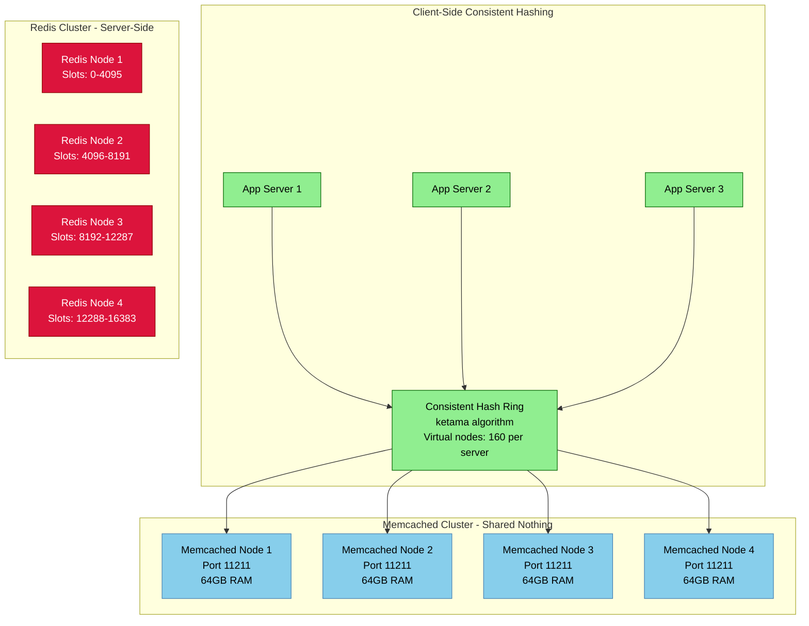
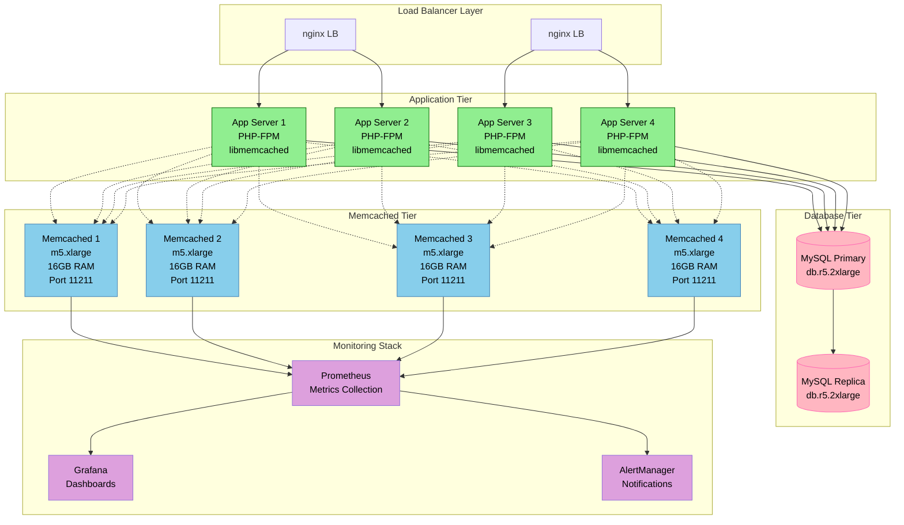
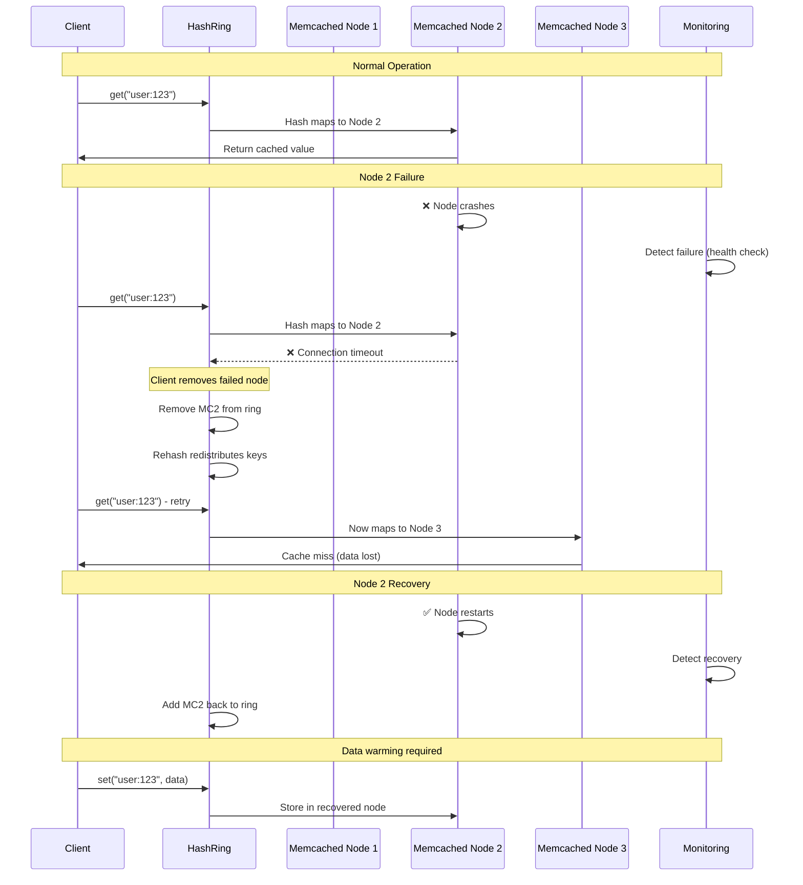

# Memcached Architecture and Scaling

## Overview

Memcached provides a simple, distributed in-memory key-value store designed for caching database query results, API responses, and session data. Unlike Redis, Memcached focuses purely on caching with a simpler data model but excellent horizontal scaling characteristics.

## Memcached vs Redis Architecture



## Client-Side Consistent Hashing Implementation

### Python Memcached Client with Ketama

```python
import hashlib
import bisect
from typing import List, Dict, Optional, Any
import memcache
import logging

class MemcachedCluster:
    """Production-ready Memcached cluster client with consistent hashing"""

    def __init__(self, servers: List[str], virtual_nodes: int = 160):
        self.servers = servers
        self.virtual_nodes = virtual_nodes
        self.ring: Dict[int, str] = {}
        self.sorted_keys: List[int] = []
        self.clients: Dict[str, memcache.Client] = {}

        # Initialize individual Memcached clients
        for server in servers:
            self.clients[server] = memcache.Client(
                [server],
                socket_timeout=1.0,
                server_max_value_length=1024*1024*10,  # 10MB max value
                pickleProtocol=2,
                pickler=pickle.dumps,
                unpickler=pickle.loads
            )

        self._build_ring()
        self.stats = {
            'hits': 0,
            'misses': 0,
            'sets': 0,
            'deletes': 0,
            'errors': 0
        }

        logging.info(f"Memcached cluster initialized with {len(servers)} servers")

    def _build_ring(self):
        """Build the consistent hash ring using ketama algorithm"""
        self.ring.clear()

        for server in self.servers:
            for i in range(self.virtual_nodes):
                # Ketama uses MD5 hash for virtual nodes
                virtual_key = f"{server}:{i}"
                hash_value = int(hashlib.md5(virtual_key.encode()).hexdigest(), 16)
                self.ring[hash_value] = server

        self.sorted_keys = sorted(self.ring.keys())
        logging.info(f"Hash ring built with {len(self.sorted_keys)} virtual nodes")

    def _get_server(self, key: str) -> str:
        """Get the server for a given key using consistent hashing"""
        if not self.ring:
            raise Exception("No servers available")

        # Hash the key using MD5 (ketama standard)
        hash_value = int(hashlib.md5(key.encode()).hexdigest(), 16)

        # Find the first server clockwise on the ring
        idx = bisect.bisect_right(self.sorted_keys, hash_value)
        if idx == len(self.sorted_keys):
            idx = 0  # Wrap around to the beginning

        return self.ring[self.sorted_keys[idx]]

    def get(self, key: str) -> Optional[Any]:
        """Get value from appropriate Memcached server"""
        try:
            server = self._get_server(key)
            client = self.clients[server]
            value = client.get(key)

            if value is not None:
                self.stats['hits'] += 1
                logging.debug(f"Cache HIT: {key} from {server}")
            else:
                self.stats['misses'] += 1
                logging.debug(f"Cache MISS: {key} from {server}")

            return value

        except Exception as e:
            self.stats['errors'] += 1
            logging.error(f"Memcached GET error for key {key}: {e}")
            return None

    def set(self, key: str, value: Any, exptime: int = 3600) -> bool:
        """Set value in appropriate Memcached server"""
        try:
            server = self._get_server(key)
            client = self.clients[server]
            success = client.set(key, value, exptime)

            if success:
                self.stats['sets'] += 1
                logging.debug(f"Cache SET: {key} to {server}")
            else:
                self.stats['errors'] += 1
                logging.warning(f"Cache SET failed: {key} to {server}")

            return success

        except Exception as e:
            self.stats['errors'] += 1
            logging.error(f"Memcached SET error for key {key}: {e}")
            return False

    def delete(self, key: str) -> bool:
        """Delete key from appropriate Memcached server"""
        try:
            server = self._get_server(key)
            client = self.clients[server]
            success = client.delete(key)

            if success:
                self.stats['deletes'] += 1
                logging.debug(f"Cache DELETE: {key} from {server}")

            return success

        except Exception as e:
            self.stats['errors'] += 1
            logging.error(f"Memcached DELETE error for key {key}: {e}")
            return False

    def add_server(self, server: str):
        """Add new server to the cluster"""
        if server not in self.servers:
            self.servers.append(server)
            self.clients[server] = memcache.Client([server])
            self._build_ring()
            logging.info(f"Added server {server} to cluster")

    def remove_server(self, server: str):
        """Remove server from the cluster"""
        if server in self.servers:
            self.servers.remove(server)
            if server in self.clients:
                del self.clients[server]
            self._build_ring()
            logging.info(f"Removed server {server} from cluster")

    def get_stats(self) -> Dict[str, Any]:
        """Get cluster statistics"""
        cluster_stats = {
            'client_stats': self.stats.copy(),
            'servers': len(self.servers),
            'virtual_nodes': len(self.sorted_keys),
            'hit_rate': self.stats['hits'] / (self.stats['hits'] + self.stats['misses'])
                       if (self.stats['hits'] + self.stats['misses']) > 0 else 0
        }

        # Get individual server stats
        server_stats = {}
        for server, client in self.clients.items():
            try:
                stats = client.get_stats()[0]
                server_stats[server] = {
                    'curr_items': int(stats.get('curr_items', 0)),
                    'bytes': int(stats.get('bytes', 0)),
                    'get_hits': int(stats.get('get_hits', 0)),
                    'get_misses': int(stats.get('get_misses', 0)),
                    'cmd_get': int(stats.get('cmd_get', 0)),
                    'cmd_set': int(stats.get('cmd_set', 0)),
                    'uptime': int(stats.get('uptime', 0))
                }
            except Exception as e:
                server_stats[server] = {'error': str(e)}

        cluster_stats['server_stats'] = server_stats
        return cluster_stats

# Example usage for production deployment
if __name__ == "__main__":
    # Production cluster configuration
    servers = [
        '10.0.1.10:11211',  # Memcached node 1
        '10.0.1.11:11211',  # Memcached node 2
        '10.0.1.12:11211',  # Memcached node 3
        '10.0.1.13:11211'   # Memcached node 4
    ]

    # Initialize cluster
    cache = MemcachedCluster(servers, virtual_nodes=160)

    # Cache user sessions
    cache.set('user:12345:session', {'user_id': 12345, 'logged_in': True}, exptime=3600)

    # Cache database query results
    cache.set('product:67890', {'name': 'Widget', 'price': 29.99}, exptime=1800)

    # Retrieve cached data
    session = cache.get('user:12345:session')
    product = cache.get('product:67890')

    # Print cluster statistics
    stats = cache.get_stats()
    print(f"Hit rate: {stats['hit_rate']:.2%}")
    print(f"Total servers: {stats['servers']}")
```

## Production Deployment Architecture



## Memcached Configuration and Tuning

### Production Memcached Configuration

```bash
#!/bin/bash
# /etc/default/memcached

# Memory allocation (80% of available RAM)
MEMORY="12800"  # 12.8GB on 16GB instance

# Maximum connections
CONNECTIONS="1024"

# Interface to listen on
LISTEN="0.0.0.0"

# Port
PORT="11211"

# User to run as
USER="memcache"

# Additional options
OPTIONS="-v -P /var/run/memcached/memcached.pid"

# Startup command
DAEMON="/usr/bin/memcached"
DAEMON_ARGS="-d -u $USER -m $MEMORY -c $CONNECTIONS -l $LISTEN -p $PORT $OPTIONS"

# Start memcached
echo "Starting Memcached with $MEMORY MB memory allocation"
$DAEMON $DAEMON_ARGS
```

### System Configuration for Production

```yaml
# /etc/security/limits.conf
memcache soft nofile 65536
memcache hard nofile 65536

# /etc/sysctl.conf optimizations
net.core.somaxconn = 1024
net.ipv4.tcp_max_syn_backlog = 1024
net.core.netdev_max_backlog = 1000
vm.swappiness = 1
```

### PHP Configuration with libmemcached

```php
<?php
// Production PHP Memcached configuration
class ProductionMemcachedPool {
    private $memcached;
    private $servers = [
        ['10.0.1.10', 11211, 25],  // Weight 25
        ['10.0.1.11', 11211, 25],  // Weight 25
        ['10.0.1.12', 11211, 25],  // Weight 25
        ['10.0.1.13', 11211, 25]   // Weight 25
    ];

    public function __construct() {
        $this->memcached = new Memcached('production_pool');

        // Configure options for production
        $this->memcached->setOptions([
            Memcached::OPT_LIBKETAMA_COMPATIBLE => true,
            Memcached::OPT_DISTRIBUTION => Memcached::DISTRIBUTION_CONSISTENT,
            Memcached::OPT_SERVER_FAILURE_LIMIT => 2,
            Memcached::OPT_REMOVE_FAILED_SERVERS => true,
            Memcached::OPT_RETRY_TIMEOUT => 1,
            Memcached::OPT_CONNECT_TIMEOUT => 1000,  // 1 second
            Memcached::OPT_POLL_TIMEOUT => 1000,
            Memcached::OPT_RECV_TIMEOUT => 1000000,  // 1 second
            Memcached::OPT_SEND_TIMEOUT => 1000000,
            Memcached::OPT_TCP_NODELAY => true,
            Memcached::OPT_COMPRESSION => false,     // Disable for speed
            Memcached::OPT_BINARY_PROTOCOL => true,
            Memcached::OPT_NO_BLOCK => false
        ]);

        // Add servers to pool
        $this->memcached->addServers($this->servers);
    }

    public function get($key) {
        return $this->memcached->get($key);
    }

    public function set($key, $value, $expiration = 3600) {
        return $this->memcached->set($key, $value, $expiration);
    }

    public function getStats() {
        return $this->memcached->getStats();
    }
}
```

## Monitoring and Alerting

### Prometheus Metrics Collection

```python
#!/usr/bin/env python3
"""Memcached metrics exporter for Prometheus"""

import time
import socket
import re
from prometheus_client import start_http_server, Gauge, Counter

class MemcachedExporter:
    def __init__(self, servers):
        self.servers = servers

        # Define Prometheus metrics
        self.bytes_used = Gauge('memcached_bytes_used', 'Bytes used', ['server'])
        self.curr_items = Gauge('memcached_current_items', 'Current items', ['server'])
        self.cmd_get = Counter('memcached_get_total', 'Get commands', ['server'])
        self.cmd_set = Counter('memcached_set_total', 'Set commands', ['server'])
        self.get_hits = Counter('memcached_hits_total', 'Get hits', ['server'])
        self.get_misses = Counter('memcached_misses_total', 'Get misses', ['server'])
        self.hit_rate = Gauge('memcached_hit_rate', 'Hit rate percentage', ['server'])
        self.uptime = Gauge('memcached_uptime_seconds', 'Uptime in seconds', ['server'])
        self.connections = Gauge('memcached_connections_current', 'Current connections', ['server'])
        self.memory_limit = Gauge('memcached_memory_limit_bytes', 'Memory limit', ['server'])

    def get_memcached_stats(self, host, port):
        """Get stats from Memcached server"""
        try:
            sock = socket.socket(socket.AF_INET, socket.SOCK_STREAM)
            sock.settimeout(5)
            sock.connect((host, int(port)))
            sock.send(b'stats\r\n')

            stats = {}
            while True:
                data = sock.recv(1024).decode('utf-8')
                if 'END' in data:
                    break

                for line in data.strip().split('\r\n'):
                    if line.startswith('STAT'):
                        parts = line.split(' ', 2)
                        if len(parts) == 3:
                            stats[parts[1]] = parts[2]

            sock.close()
            return stats

        except Exception as e:
            print(f"Error connecting to {host}:{port}: {e}")
            return {}

    def update_metrics(self):
        """Update Prometheus metrics from all servers"""
        for server in self.servers:
            host, port = server.split(':')
            stats = self.get_memcached_stats(host, port)

            if stats:
                server_label = [server]

                # Update gauges
                self.bytes_used.labels(*server_label).set(int(stats.get('bytes', 0)))
                self.curr_items.labels(*server_label).set(int(stats.get('curr_items', 0)))
                self.uptime.labels(*server_label).set(int(stats.get('uptime', 0)))
                self.connections.labels(*server_label).set(int(stats.get('curr_connections', 0)))
                self.memory_limit.labels(*server_label).set(int(stats.get('limit_maxbytes', 0)))

                # Calculate hit rate
                hits = int(stats.get('get_hits', 0))
                misses = int(stats.get('get_misses', 0))
                total_gets = hits + misses
                hit_rate = (hits / total_gets * 100) if total_gets > 0 else 0
                self.hit_rate.labels(*server_label).set(hit_rate)

    def run(self):
        """Run the metrics exporter"""
        print("Starting Memcached Prometheus exporter on port 8080")
        start_http_server(8080)

        while True:
            self.update_metrics()
            time.sleep(30)  # Update every 30 seconds

if __name__ == '__main__':
    servers = [
        '10.0.1.10:11211',
        '10.0.1.11:11211',
        '10.0.1.12:11211',
        '10.0.1.13:11211'
    ]

    exporter = MemcachedExporter(servers)
    exporter.run()
```

### Grafana Dashboard Configuration

```json
{
  "dashboard": {
    "title": "Memcached Cluster Dashboard",
    "panels": [
      {
        "title": "Hit Rate by Server",
        "type": "stat",
        "targets": [
          {
            "expr": "memcached_hit_rate",
            "legendFormat": "{{server}}"
          }
        ],
        "fieldConfig": {
          "defaults": {
            "unit": "percent",
            "min": 0,
            "max": 100,
            "thresholds": {
              "steps": [
                {"color": "red", "value": 0},
                {"color": "yellow", "value": 70},
                {"color": "green", "value": 90}
              ]
            }
          }
        }
      },
      {
        "title": "Memory Usage",
        "type": "timeseries",
        "targets": [
          {
            "expr": "memcached_bytes_used / memcached_memory_limit_bytes * 100",
            "legendFormat": "{{server}} Memory Usage %"
          }
        ]
      },
      {
        "title": "Current Items",
        "type": "timeseries",
        "targets": [
          {
            "expr": "memcached_current_items",
            "legendFormat": "{{server}} Items"
          }
        ]
      },
      {
        "title": "Commands per Second",
        "type": "timeseries",
        "targets": [
          {
            "expr": "rate(memcached_get_total[5m])",
            "legendFormat": "{{server}} GET/s"
          },
          {
            "expr": "rate(memcached_set_total[5m])",
            "legendFormat": "{{server}} SET/s"
          }
        ]
      }
    ]
  }
}
```

## Failure Scenarios and Recovery

### Memcached Node Failure Handling



### Emergency Procedures

```bash
#!/bin/bash
# Memcached emergency procedures

# 1. Check cluster health
check_memcached_health() {
    servers=("10.0.1.10:11211" "10.0.1.11:11211" "10.0.1.12:11211" "10.0.1.13:11211")

    echo "Checking Memcached cluster health..."
    for server in "${servers[@]}"; do
        host=$(echo $server | cut -d: -f1)
        port=$(echo $server | cut -d: -f2)

        if echo "stats" | nc -w 2 $host $port > /dev/null 2>&1; then
            echo "✅ $server - OK"
        else
            echo "❌ $server - FAILED"
        fi
    done
}

# 2. Flush all cache (emergency cache invalidation)
flush_all_cache() {
    servers=("10.0.1.10:11211" "10.0.1.11:11211" "10.0.1.12:11211" "10.0.1.13:11211")

    echo "WARNING: This will flush ALL cached data!"
    read -p "Are you sure? (yes/no): " confirm

    if [ "$confirm" = "yes" ]; then
        for server in "${servers[@]}"; do
            host=$(echo $server | cut -d: -f1)
            port=$(echo $server | cut -d: -f2)

            echo "flush_all" | nc $host $port
            echo "Flushed cache on $server"
        done
    fi
}

# 3. Get detailed cluster statistics
get_cluster_stats() {
    servers=("10.0.1.10:11211" "10.0.1.11:11211" "10.0.1.12:11211" "10.0.1.13:11211")

    echo "=== Memcached Cluster Statistics ==="
    for server in "${servers[@]}"; do
        echo "--- $server ---"
        host=$(echo $server | cut -d: -f1)
        port=$(echo $server | cut -d: -f2)

        echo "stats" | nc -w 2 $host $port | grep -E "(curr_items|bytes|get_hits|get_misses|cmd_get|cmd_set|uptime)"
        echo ""
    done
}

# 4. Restart failed Memcached nodes
restart_memcached_node() {
    node=$1
    echo "Restarting Memcached on $node"

    ssh $node "sudo systemctl stop memcached"
    sleep 2
    ssh $node "sudo systemctl start memcached"

    # Wait for startup
    sleep 5

    # Verify it's responding
    if echo "stats" | nc -w 2 $node 11211 > /dev/null 2>&1; then
        echo "✅ $node restarted successfully"
    else
        echo "❌ $node failed to restart properly"
    fi
}

# 5. Monitor hit rates and alert on low performance
monitor_hit_rates() {
    servers=("10.0.1.10:11211" "10.0.1.11:11211" "10.0.1.12:11211" "10.0.1.13:11211")
    threshold=80  # Alert if hit rate below 80%

    echo "Monitoring hit rates (threshold: ${threshold}%)"

    for server in "${servers[@]}"; do
        host=$(echo $server | cut -d: -f1)
        port=$(echo $server | cut -d: -f2)

        stats=$(echo "stats" | nc -w 2 $host $port)
        hits=$(echo "$stats" | grep "get_hits" | awk '{print $3}')
        misses=$(echo "$stats" | grep "get_misses" | awk '{print $3}')

        if [ -n "$hits" ] && [ -n "$misses" ]; then
            total=$((hits + misses))
            if [ $total -gt 0 ]; then
                hit_rate=$((hits * 100 / total))
                if [ $hit_rate -lt $threshold ]; then
                    echo "🚨 ALERT: $server hit rate is ${hit_rate}% (below ${threshold}%)"
                else
                    echo "✅ $server hit rate: ${hit_rate}%"
                fi
            fi
        fi
    done
}

# Execute based on command line argument
case "$1" in
    "health")
        check_memcached_health
        ;;
    "flush")
        flush_all_cache
        ;;
    "stats")
        get_cluster_stats
        ;;
    "restart")
        restart_memcached_node $2
        ;;
    "monitor")
        monitor_hit_rates
        ;;
    *)
        echo "Usage: $0 {health|flush|stats|restart <node>|monitor}"
        exit 1
        ;;
esac
```

## Performance Comparison: Memcached vs Redis

| Metric | Memcached | Redis | Use Case |
|--------|-----------|--------|----------|
| **Throughput** | 1M+ ops/sec | 100K ops/sec | Simple key-value caching |
| **Memory Efficiency** | Higher | Lower | Large cache pools |
| **Data Types** | String only | Rich data types | Complex data structures |
| **Persistence** | None | Optional | Session storage |
| **Clustering** | Client-side | Server-side | Different complexity needs |
| **Scalability** | Horizontal | Horizontal + Vertical | Growth patterns |
| **Consistency** | None | Configurable | Data consistency needs |

### When to Choose Memcached

✅ **Choose Memcached for:**
- Simple key-value caching
- Maximum throughput requirements
- Large memory pools (100GB+)
- Minimal operational complexity
- Cost-sensitive deployments

❌ **Avoid Memcached for:**
- Complex data structures needed
- Data persistence required
- Strong consistency requirements
- Advanced features (pub/sub, transactions)

## Production Lessons Learned

### Common Issues and Solutions

1. **Hot Keys**: Some keys get accessed much more frequently
   - **Solution**: Use client-side random jittering for TTL
   - **Monitoring**: Track key access patterns

2. **Memory Fragmentation**: Long-running instances develop fragmentation
   - **Solution**: Regular restarts during maintenance windows
   - **Prevention**: Size objects consistently

3. **Network Partitions**: Client can't reach some nodes
   - **Solution**: Implement circuit breakers
   - **Monitoring**: Track connection failures per node

4. **Cache Stampede**: Multiple requests for same expired key
   - **Solution**: Implement lock-based cache warming
   - **Prevention**: Staggered TTL expiration

This comprehensive guide provides the production-ready knowledge needed to deploy, monitor, and troubleshoot Memcached clusters at scale, focusing on real-world performance characteristics and operational procedures.