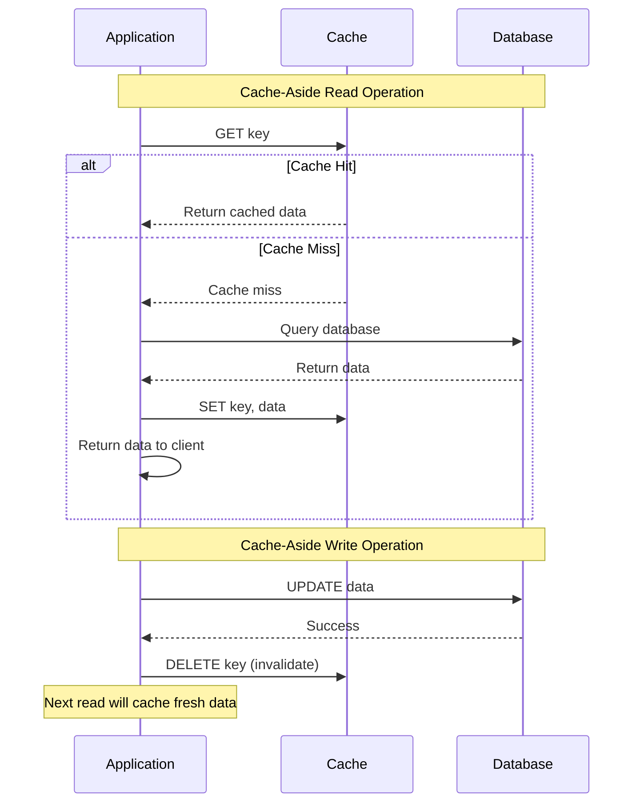
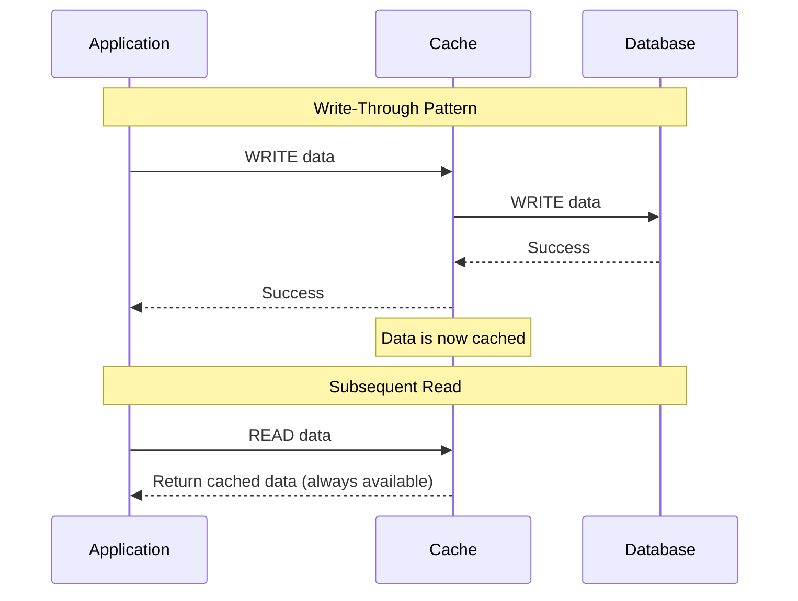
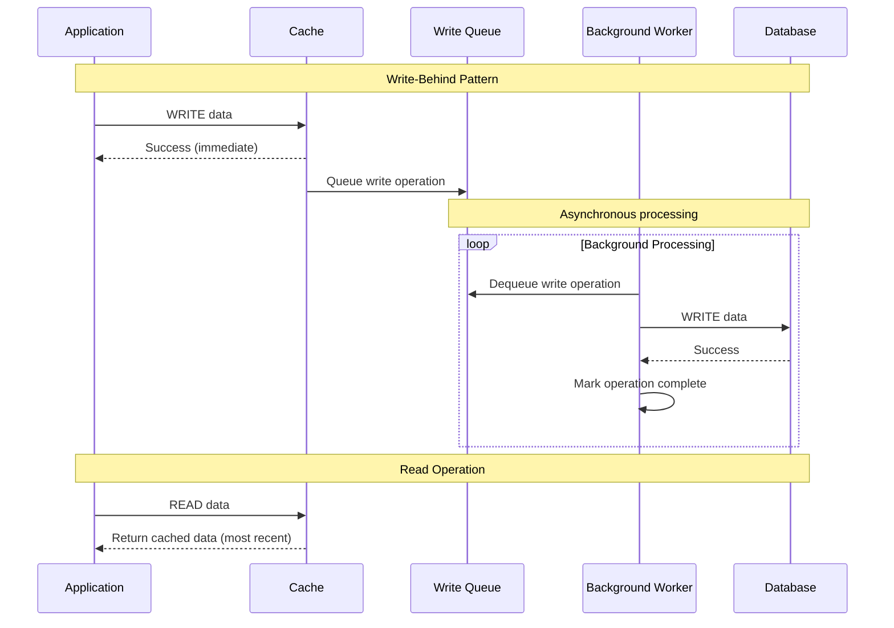
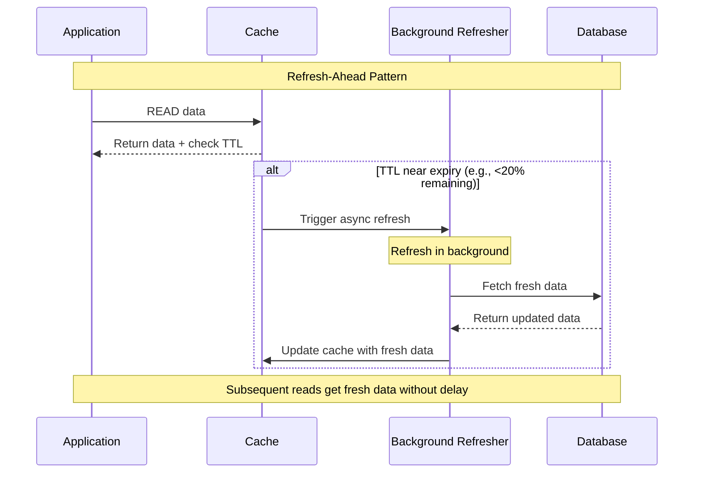

# Caching Patterns

## Overview of Caching Strategies

Caching patterns determine how data flows between applications, caches, and data stores. Each pattern has specific trade-offs regarding consistency, performance, and complexity.

### Cache Pattern Comparison

```mermaid
graph TB
    subgraph Caching Patterns Overview
        subgraph Cache-Aside (Lazy Loading)
            ASIDE[Cache-Aside Pattern<br/>✅ Simple to implement<br/>✅ Fault tolerant<br/>❌ Cache miss penalty<br/>❌ Potential stale data]
        end

        subgraph Cache-Through (Write-Through)
            THROUGH[Write-Through Pattern<br/>✅ Data consistency<br/>✅ Simplified reads<br/>❌ Write latency<br/>❌ Unnecessary caching]
        end

        subgraph Write-Behind (Write-Back)
            BEHIND[Write-Behind Pattern<br/>✅ Low write latency<br/>✅ High throughput<br/>❌ Data loss risk<br/>❌ Complex implementation]
        end

        subgraph Refresh-Ahead
            REFRESH[Refresh-Ahead Pattern<br/>✅ Predictable performance<br/>✅ Proactive updates<br/>❌ Resource overhead<br/>❌ Complex logic]
        end
    end

    %% Apply 4-plane colors
    classDef edgeStyle fill:#3B82F6,stroke:#2563EB,color:#fff
    classDef serviceStyle fill:#10B981,stroke:#059669,color:#fff
    classDef stateStyle fill:#F59E0B,stroke:#D97706,color:#fff
    classDef controlStyle fill:#8B5CF6,stroke:#7C3AED,color:#fff

    class ASIDE edgeStyle
    class THROUGH serviceStyle
    class BEHIND stateStyle
    class REFRESH controlStyle
```

## Cache-Aside Pattern

### Cache-Aside Flow



### Cache-Aside Implementation

```python
# Cache-aside pattern implementation
import redis
import json
import time
from typing import Optional, Any
import mysql.connector
from mysql.connector import Error

class CacheAsideService:
    def __init__(self, redis_host: str = 'localhost', redis_port: int = 6379,
                 mysql_config: dict = None):
        # Redis connection for caching
        self.cache = redis.Redis(
            host=redis_host,
            port=redis_port,
            decode_responses=True,
            socket_connect_timeout=5,
            socket_timeout=5,
            retry_on_timeout=True
        )

        # MySQL connection for persistent storage
        self.mysql_config = mysql_config or {
            'host': 'localhost',
            'database': 'app_db',
            'user': 'app_user',
            'password': 'app_password'
        }

        # Cache configuration
        self.default_ttl = 3600  # 1 hour
        self.cache_key_prefix = "app:"

    def _get_db_connection(self):
        """Get database connection with retry logic"""
        try:
            return mysql.connector.connect(**self.mysql_config)
        except Error as e:
            print(f"Database connection error: {e}")
            raise

    def _cache_key(self, key: str) -> str:
        """Generate cache key with prefix"""
        return f"{self.cache_key_prefix}{key}"

    def get_user(self, user_id: int) -> Optional[dict]:
        """Get user data using cache-aside pattern"""
        cache_key = self._cache_key(f"user:{user_id}")

        # Try cache first
        try:
            cached_data = self.cache.get(cache_key)
            if cached_data:
                print(f"Cache hit for user {user_id}")
                return json.loads(cached_data)
        except redis.RedisError as e:
            print(f"Cache error (falling back to DB): {e}")

        print(f"Cache miss for user {user_id}")

        # Cache miss - query database
        try:
            with self._get_db_connection() as connection:
                cursor = connection.cursor(dictionary=True)
                cursor.execute(
                    "SELECT id, name, email, created_at FROM users WHERE id = %s",
                    (user_id,)
                )
                user_data = cursor.fetchone()

                if user_data:
                    # Convert datetime to string for JSON serialization
                    if user_data.get('created_at'):
                        user_data['created_at'] = user_data['created_at'].isoformat()

                    # Cache the result
                    try:
                        self.cache.setex(
                            cache_key,
                            self.default_ttl,
                            json.dumps(user_data)
                        )
                        print(f"Cached user {user_id}")
                    except redis.RedisError as e:
                        print(f"Failed to cache user {user_id}: {e}")

                return user_data

        except Error as e:
            print(f"Database error: {e}")
            return None

    def update_user(self, user_id: int, updates: dict) -> bool:
        """Update user data and invalidate cache"""
        try:
            with self._get_db_connection() as connection:
                cursor = connection.cursor()

                # Build dynamic UPDATE query
                set_clauses = []
                values = []

                for field, value in updates.items():
                    set_clauses.append(f"{field} = %s")
                    values.append(value)

                if not set_clauses:
                    return False

                values.append(user_id)
                query = f"UPDATE users SET {', '.join(set_clauses)} WHERE id = %s"

                cursor.execute(query, values)
                connection.commit()

                if cursor.rowcount > 0:
                    # Invalidate cache on successful update
                    cache_key = self._cache_key(f"user:{user_id}")
                    try:
                        self.cache.delete(cache_key)
                        print(f"Invalidated cache for user {user_id}")
                    except redis.RedisError as e:
                        print(f"Failed to invalidate cache for user {user_id}: {e}")

                    return True

                return False

        except Error as e:
            print(f"Database error during update: {e}")
            return False

    def get_user_posts(self, user_id: int, page: int = 1, per_page: int = 10) -> list:
        """Get user posts with pagination and caching"""
        cache_key = self._cache_key(f"user:{user_id}:posts:page:{page}:size:{per_page}")

        # Try cache first
        try:
            cached_data = self.cache.get(cache_key)
            if cached_data:
                print(f"Cache hit for user {user_id} posts page {page}")
                return json.loads(cached_data)
        except redis.RedisError as e:
            print(f"Cache error: {e}")

        print(f"Cache miss for user {user_id} posts page {page}")

        # Query database with pagination
        try:
            with self._get_db_connection() as connection:
                cursor = connection.cursor(dictionary=True)
                offset = (page - 1) * per_page

                cursor.execute("""
                    SELECT id, title, content, created_at
                    FROM posts
                    WHERE user_id = %s
                    ORDER BY created_at DESC
                    LIMIT %s OFFSET %s
                """, (user_id, per_page, offset))

                posts = cursor.fetchall()

                # Convert datetime objects for JSON serialization
                for post in posts:
                    if post.get('created_at'):
                        post['created_at'] = post['created_at'].isoformat()

                # Cache results with shorter TTL for paginated data
                try:
                    self.cache.setex(
                        cache_key,
                        900,  # 15 minutes TTL for paginated data
                        json.dumps(posts)
                    )
                except redis.RedisError as e:
                    print(f"Failed to cache posts: {e}")

                return posts

        except Error as e:
            print(f"Database error: {e}")
            return []

    def create_post(self, user_id: int, title: str, content: str) -> Optional[int]:
        """Create new post and invalidate related caches"""
        try:
            with self._get_db_connection() as connection:
                cursor = connection.cursor()

                cursor.execute("""
                    INSERT INTO posts (user_id, title, content, created_at)
                    VALUES (%s, %s, %s, NOW())
                """, (user_id, title, content))

                connection.commit()
                post_id = cursor.lastrowid

                if post_id:
                    # Invalidate user posts cache (all pages)
                    self._invalidate_user_posts_cache(user_id)
                    print(f"Created post {post_id} and invalidated related caches")

                return post_id

        except Error as e:
            print(f"Database error during post creation: {e}")
            return None

    def _invalidate_user_posts_cache(self, user_id: int):
        """Invalidate all cached pages for user posts"""
        try:
            # Find all cache keys for this user's posts
            pattern = self._cache_key(f"user:{user_id}:posts:page:*")
            keys = self.cache.keys(pattern)

            if keys:
                self.cache.delete(*keys)
                print(f"Invalidated {len(keys)} cached pages for user {user_id}")

        except redis.RedisError as e:
            print(f"Failed to invalidate user posts cache: {e}")

    def get_cache_stats(self) -> dict:
        """Get cache statistics and health info"""
        try:
            info = self.cache.info()
            return {
                'connected_clients': info.get('connected_clients', 0),
                'used_memory_human': info.get('used_memory_human', '0B'),
                'hits': info.get('keyspace_hits', 0),
                'misses': info.get('keyspace_misses', 0),
                'hit_rate': round(
                    info.get('keyspace_hits', 0) /
                    max(1, info.get('keyspace_hits', 0) + info.get('keyspace_misses', 0)) * 100,
                    2
                ),
                'evicted_keys': info.get('evicted_keys', 0),
                'expired_keys': info.get('expired_keys', 0)
            }
        except redis.RedisError as e:
            return {'error': str(e)}

# Example usage
def demonstrate_cache_aside():
    # Initialize service
    service = CacheAsideService()

    print("=== Cache-Aside Pattern Demo ===")

    # First read (cache miss)
    print("\n1. First read (should be cache miss):")
    user = service.get_user(1)
    print(f"User data: {user}")

    # Second read (cache hit)
    print("\n2. Second read (should be cache hit):")
    user = service.get_user(1)
    print(f"User data: {user}")

    # Update user (invalidates cache)
    print("\n3. Update user (invalidates cache):")
    success = service.update_user(1, {'name': 'John Updated'})
    print(f"Update success: {success}")

    # Read after update (cache miss)
    print("\n4. Read after update (should be cache miss):")
    user = service.get_user(1)
    print(f"User data: {user}")

    # Get cache statistics
    print("\n5. Cache statistics:")
    stats = service.get_cache_stats()
    for key, value in stats.items():
        print(f"  {key}: {value}")

if __name__ == "__main__":
    demonstrate_cache_aside()
```

## Write-Through Pattern

### Write-Through Flow



### Write-Through Implementation

```python
# Write-through cache implementation
class WriteThroughCache:
    def __init__(self, cache_client, db_client):
        self.cache = cache_client
        self.db = db_client
        self.write_timeout = 5  # seconds

    async def write_through_set(self, key: str, value: dict, ttl: int = 3600) -> bool:
        """Write-through: Write to both cache and database"""
        try:
            # Write to database first (source of truth)
            db_success = await self._write_to_database(key, value)
            if not db_success:
                return False

            # Write to cache
            cache_success = await self._write_to_cache(key, value, ttl)
            if not cache_success:
                # Cache write failed, but DB write succeeded
                # Log warning but don't fail the operation
                print(f"Warning: Cache write failed for key {key}")

            return True

        except Exception as e:
            print(f"Write-through failed for key {key}: {e}")
            return False

    async def write_through_update(self, key: str, updates: dict) -> bool:
        """Write-through update operation"""
        try:
            # Update database
            db_success = await self._update_database(key, updates)
            if not db_success:
                return False

            # Get updated data from database
            updated_data = await self._read_from_database(key)
            if updated_data:
                # Update cache with fresh data
                await self._write_to_cache(key, updated_data, 3600)

            return True

        except Exception as e:
            print(f"Write-through update failed for key {key}: {e}")
            return False

    async def read_with_fallback(self, key: str) -> Optional[dict]:
        """Read with cache fallback to database"""
        try:
            # Try cache first
            cached_data = await self._read_from_cache(key)
            if cached_data:
                return cached_data

            # Cache miss - read from database
            db_data = await self._read_from_database(key)
            if db_data:
                # Populate cache for future reads
                await self._write_to_cache(key, db_data, 3600)

            return db_data

        except Exception as e:
            print(f"Read operation failed for key {key}: {e}")
            return None

    async def _write_to_database(self, key: str, value: dict) -> bool:
        """Write data to database"""
        # Implementation depends on database type
        pass

    async def _write_to_cache(self, key: str, value: dict, ttl: int) -> bool:
        """Write data to cache"""
        # Implementation depends on cache type
        pass

    async def _read_from_cache(self, key: str) -> Optional[dict]:
        """Read data from cache"""
        # Implementation depends on cache type
        pass

    async def _read_from_database(self, key: str) -> Optional[dict]:
        """Read data from database"""
        # Implementation depends on database type
        pass

    async def _update_database(self, key: str, updates: dict) -> bool:
        """Update data in database"""
        # Implementation depends on database type
        pass
```

## Write-Behind (Write-Back) Pattern

### Write-Behind Flow



### Write-Behind Implementation

```python
# Write-behind cache implementation
import asyncio
import json
from collections import deque
from typing import Dict, Any
import time

class WriteBehindCache:
    def __init__(self, cache_client, db_client, flush_interval: int = 5):
        self.cache = cache_client
        self.db = db_client
        self.flush_interval = flush_interval

        # Write queue and tracking
        self.write_queue = deque()
        self.dirty_keys = set()
        self.write_stats = {
            'queued_writes': 0,
            'successful_writes': 0,
            'failed_writes': 0
        }

        # Start background writer
        self._running = True
        self._writer_task = asyncio.create_task(self._background_writer())

    async def write_behind_set(self, key: str, value: dict, ttl: int = 3600) -> bool:
        """Write-behind: Write to cache immediately, queue DB write"""
        try:
            # Write to cache immediately
            cache_success = await self._write_to_cache(key, value, ttl)
            if not cache_success:
                return False

            # Queue database write
            write_operation = {
                'operation': 'SET',
                'key': key,
                'value': value,
                'timestamp': time.time()
            }

            self.write_queue.append(write_operation)
            self.dirty_keys.add(key)
            self.write_stats['queued_writes'] += 1

            return True

        except Exception as e:
            print(f"Write-behind set failed for key {key}: {e}")
            return False

    async def write_behind_update(self, key: str, updates: dict) -> bool:
        """Write-behind update operation"""
        try:
            # Get current cached data
            current_data = await self._read_from_cache(key)
            if not current_data:
                # If not in cache, read from database
                current_data = await self._read_from_database(key)
                if not current_data:
                    return False

            # Apply updates
            updated_data = {**current_data, **updates}

            # Write to cache immediately
            cache_success = await self._write_to_cache(key, updated_data, 3600)
            if not cache_success:
                return False

            # Queue database write
            write_operation = {
                'operation': 'UPDATE',
                'key': key,
                'value': updated_data,
                'updates': updates,
                'timestamp': time.time()
            }

            self.write_queue.append(write_operation)
            self.dirty_keys.add(key)
            self.write_stats['queued_writes'] += 1

            return True

        except Exception as e:
            print(f"Write-behind update failed for key {key}: {e}")
            return False

    async def write_behind_delete(self, key: str) -> bool:
        """Write-behind delete operation"""
        try:
            # Remove from cache immediately
            await self._delete_from_cache(key)

            # Queue database delete
            write_operation = {
                'operation': 'DELETE',
                'key': key,
                'timestamp': time.time()
            }

            self.write_queue.append(write_operation)
            self.dirty_keys.add(key)
            self.write_stats['queued_writes'] += 1

            return True

        except Exception as e:
            print(f"Write-behind delete failed for key {key}: {e}")
            return False

    async def read(self, key: str) -> Optional[dict]:
        """Read from cache (most up-to-date data)"""
        try:
            # Always read from cache first (has latest data)
            cached_data = await self._read_from_cache(key)
            if cached_data:
                return cached_data

            # If not in cache and not dirty, try database
            if key not in self.dirty_keys:
                db_data = await self._read_from_database(key)
                if db_data:
                    # Cache the data
                    await self._write_to_cache(key, db_data, 3600)
                return db_data

            return None

        except Exception as e:
            print(f"Read failed for key {key}: {e}")
            return None

    async def _background_writer(self):
        """Background task to flush writes to database"""
        while self._running:
            try:
                await asyncio.sleep(self.flush_interval)
                await self._flush_writes()
            except Exception as e:
                print(f"Background writer error: {e}")

    async def _flush_writes(self):
        """Flush pending writes to database"""
        if not self.write_queue:
            return

        # Process writes in batches
        batch_size = 10
        processed = 0

        while self.write_queue and processed < batch_size:
            operation = self.write_queue.popleft()
            processed += 1

            try:
                success = await self._execute_database_operation(operation)
                if success:
                    self.write_stats['successful_writes'] += 1
                    # Remove from dirty keys if this was the latest operation
                    if operation['key'] in self.dirty_keys:
                        # Check if there are more operations for this key
                        has_more = any(op['key'] == operation['key'] for op in self.write_queue)
                        if not has_more:
                            self.dirty_keys.discard(operation['key'])
                else:
                    self.write_stats['failed_writes'] += 1
                    # Re-queue failed operations (with exponential backoff)
                    operation['retry_count'] = operation.get('retry_count', 0) + 1
                    if operation['retry_count'] < 3:
                        self.write_queue.append(operation)

            except Exception as e:
                print(f"Failed to execute database operation: {e}")
                self.write_stats['failed_writes'] += 1

    async def _execute_database_operation(self, operation: dict) -> bool:
        """Execute a database operation"""
        try:
            if operation['operation'] == 'SET':
                return await self._write_to_database(operation['key'], operation['value'])
            elif operation['operation'] == 'UPDATE':
                return await self._update_database(operation['key'], operation['updates'])
            elif operation['operation'] == 'DELETE':
                return await self._delete_from_database(operation['key'])
            else:
                print(f"Unknown operation: {operation['operation']}")
                return False
        except Exception as e:
            print(f"Database operation failed: {e}")
            return False

    async def force_flush(self):
        """Force flush all pending writes"""
        while self.write_queue:
            await self._flush_writes()

    async def shutdown(self):
        """Graceful shutdown"""
        self._running = False
        await self.force_flush()
        self._writer_task.cancel()

    def get_stats(self) -> dict:
        """Get write-behind statistics"""
        return {
            **self.write_stats,
            'pending_writes': len(self.write_queue),
            'dirty_keys': len(self.dirty_keys)
        }
```

## Refresh-Ahead Pattern

### Refresh-Ahead Flow



This comprehensive overview of caching patterns provides the foundation for choosing the right strategy based on consistency requirements, performance needs, and operational complexity.