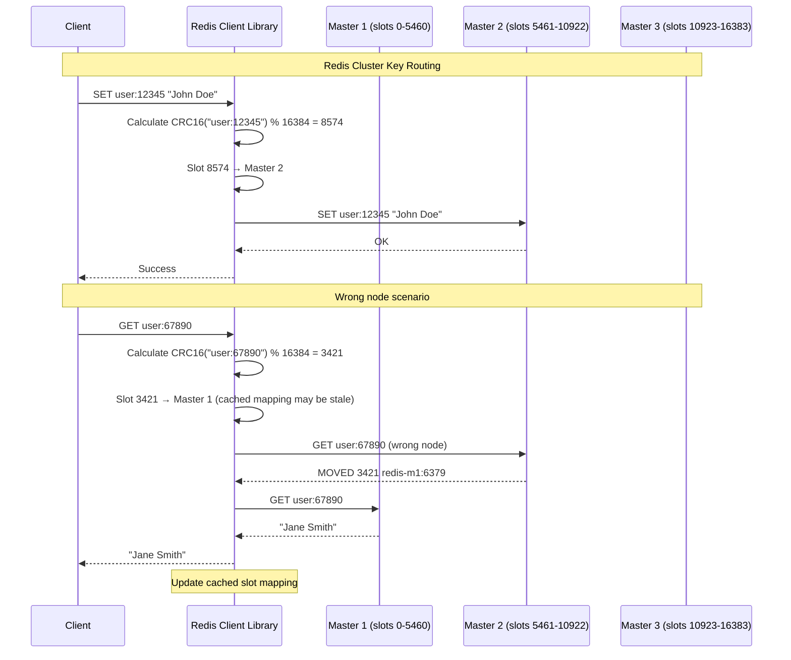
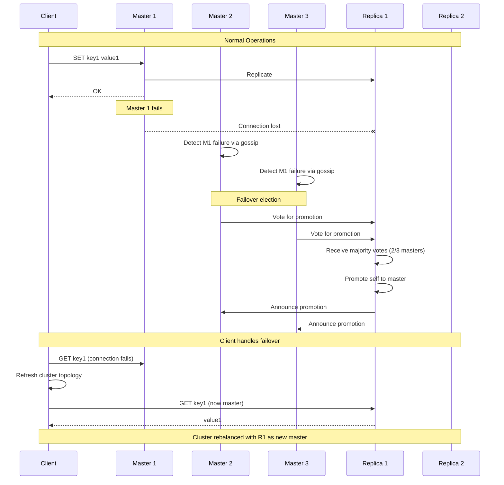

# Redis Cluster Architecture

## Overview of Redis Clustering

Redis Cluster provides automatic data sharding across multiple Redis nodes while maintaining high availability through replication and automatic failover capabilities.

### Redis Cluster Components

```mermaid
graph TB
    subgraph "Redis Cluster Architecture"
        subgraph "Hash Slots (16384 total)"
            SLOTS[Hash Slot Distribution<br/>Node 1: slots 0-5460<br/>Node 2: slots 5461-10922<br/>Node 3: slots 10923-16383]
        end

        subgraph "Master Nodes"
            MASTER1[Master 1<br/>redis-m1:6379<br/>Slots: 0-5460<br/>Keys: ~33.3%]
            MASTER2[Master 2<br/>redis-m2:6379<br/>Slots: 5461-10922<br/>Keys: ~33.3%]
            MASTER3[Master 3<br/>redis-m3:6379<br/>Slots: 10923-16383<br/>Keys: ~33.3%]
        end

        subgraph "Replica Nodes"
            REPLICA1[Replica 1<br/>redis-r1:6379<br/>Replicates Master 1]
            REPLICA2[Replica 2<br/>redis-r2:6379<br/>Replicates Master 2]
            REPLICA3[Replica 3<br/>redis-r3:6379<br/>Replicates Master 3]
        end

        subgraph "Client Interaction"
            CLIENT[Redis Client<br/>Cluster-aware<br/>Smart routing]
            REDIRECT[MOVED/ASK Redirects<br/>Automatic retries<br/>Slot mapping cache]
        end

        subgraph "Cluster Management"
            GOSSIP[Gossip Protocol<br/>Node discovery<br/>Health monitoring<br/>Failover coordination]
            ELECTION[Leader Election<br/>Automatic failover<br/>Split-brain prevention]
        end
    end

    CLIENT --> MASTER1
    CLIENT --> MASTER2
    CLIENT --> MASTER3

    MASTER1 --> REPLICA1
    MASTER2 --> REPLICA2
    MASTER3 --> REPLICA3

    MASTER1 <--> GOSSIP
    MASTER2 <--> GOSSIP
    MASTER3 <--> GOSSIP

    GOSSIP --> ELECTION
    CLIENT --> REDIRECT

    %% Apply 4-plane colors
    classDf edgeStyle fill:#0066CC,stroke:#004499,color:#fff
    classDf serviceStyle fill:#00AA00,stroke:#007700,color:#fff
    classDef stateStyle fill:#FF8800,stroke:#CC6600,color:#fff
    classDef controlStyle fill:#CC0000,stroke:#990000,color:#fff

    class CLIENT,REDIRECT edgeStyle
    class MASTER1,MASTER2,MASTER3,REPLICA1,REPLICA2,REPLICA3 serviceStyle
    class SLOTS stateStyle
    class GOSSIP,ELECTION controlStyle
```

## Hash Slot Distribution

### Key-to-Slot Mapping



### Hash Slot Calculation

```python
# Redis Cluster hash slot calculation
import binascii
from typing import Dict, List, Optional, Tuple

class RedisClusterHashSlot:
    def __init__(self):
        self.slot_count = 16384

    def calculate_slot(self, key: str) -> int:
        """Calculate hash slot for a key using CRC16"""
        # Extract hash tag if present (between {})
        start = key.find('{')
        if start != -1:
            end = key.find('}', start + 1)
            if end != -1 and end != start + 1:
                key = key[start + 1:end]

        # Calculate CRC16
        crc = self._crc16(key.encode('utf-8'))
        return crc % self.slot_count

    def _crc16(self, data: bytes) -> int:
        """CRC16 calculation (CCITT standard)"""
        crc = 0
        for byte in data:
            crc ^= byte << 8
            for _ in range(8):
                if crc & 0x8000:
                    crc = (crc << 1) ^ 0x1021
                else:
                    crc <<= 1
                crc &= 0xFFFF
        return crc

    def keys_in_same_slot(self, keys: List[str]) -> bool:
        """Check if all keys map to the same slot"""
        if not keys:
            return True

        first_slot = self.calculate_slot(keys[0])
        return all(self.calculate_slot(key) == first_slot for key in keys)

    def group_keys_by_slot(self, keys: List[str]) -> Dict[int, List[str]]:
        """Group keys by their hash slots"""
        slot_groups = {}
        for key in keys:
            slot = self.calculate_slot(key)
            if slot not in slot_groups:
                slot_groups[slot] = []
            slot_groups[slot].append(key)
        return slot_groups

class RedisClusterTopology:
    def __init__(self):
        self.slot_calculator = RedisClusterHashSlot()
        self.masters: Dict[str, Dict] = {}  # node_id -> node_info
        self.replicas: Dict[str, Dict] = {}  # node_id -> node_info
        self.slot_map: Dict[int, str] = {}  # slot -> master_node_id

    def add_master(self, node_id: str, host: str, port: int, slots: List[int]):
        """Add a master node with its slot assignments"""
        self.masters[node_id] = {
            'host': host,
            'port': port,
            'slots': set(slots),
            'replicas': set()
        }

        # Update slot mapping
        for slot in slots:
            self.slot_map[slot] = node_id

    def add_replica(self, node_id: str, host: str, port: int, master_id: str):
        """Add a replica node"""
        self.replicas[node_id] = {
            'host': host,
            'port': port,
            'master': master_id
        }

        if master_id in self.masters:
            self.masters[master_id]['replicas'].add(node_id)

    def get_node_for_key(self, key: str) -> Optional[Tuple[str, Dict]]:
        """Get the master node responsible for a key"""
        slot = self.slot_calculator.calculate_slot(key)
        master_id = self.slot_map.get(slot)

        if master_id and master_id in self.masters:
            return master_id, self.masters[master_id]

        return None

    def get_slot_distribution(self) -> Dict[str, Dict]:
        """Get slot distribution across nodes"""
        distribution = {}

        for node_id, node_info in self.masters.items():
            slot_count = len(node_info['slots'])
            distribution[node_id] = {
                'slot_count': slot_count,
                'percentage': (slot_count / 16384) * 100,
                'replica_count': len(node_info['replicas']),
                'host': f"{node_info['host']}:{node_info['port']}"
            }

        return distribution

    def simulate_resharding(self, from_node: str, to_node: str, slot_count: int) -> Dict:
        """Simulate resharding operation"""
        if from_node not in self.masters or to_node not in self.masters:
            return {'error': 'Invalid nodes'}

        from_slots = list(self.masters[from_node]['slots'])
        if len(from_slots) < slot_count:
            return {'error': 'Not enough slots to move'}

        # Select slots to move
        slots_to_move = from_slots[:slot_count]

        # Calculate impact
        keys_affected = 0  # Would need actual key counts
        migration_time = slot_count * 10  # Estimate: 10 seconds per slot

        return {
            'from_node': from_node,
            'to_node': to_node,
            'slots_to_move': slots_to_move,
            'estimated_keys_affected': keys_affected,
            'estimated_migration_time_seconds': migration_time,
            'new_distribution': self._calculate_new_distribution(from_node, to_node, slots_to_move)
        }

    def _calculate_new_distribution(self, from_node: str, to_node: str, slots: List[int]) -> Dict:
        """Calculate distribution after resharding"""
        # Create copy of current distribution
        new_dist = {}
        for node_id, node_info in self.masters.items():
            slot_count = len(node_info['slots'])

            if node_id == from_node:
                slot_count -= len(slots)
            elif node_id == to_node:
                slot_count += len(slots)

            new_dist[node_id] = {
                'slot_count': slot_count,
                'percentage': (slot_count / 16384) * 100
            }

        return new_dist

# Example cluster setup and operations
def demonstrate_redis_cluster():
    # Create cluster topology
    cluster = RedisClusterTopology()

    print("=== Redis Cluster Demo ===")

    # Add master nodes
    cluster.add_master("master1", "10.0.1.10", 6379, list(range(0, 5461)))
    cluster.add_master("master2", "10.0.1.11", 6379, list(range(5461, 10923)))
    cluster.add_master("master3", "10.0.1.12", 6379, list(range(10923, 16384)))

    # Add replica nodes
    cluster.add_replica("replica1", "10.0.1.13", 6379, "master1")
    cluster.add_replica("replica2", "10.0.1.14", 6379, "master2")
    cluster.add_replica("replica3", "10.0.1.15", 6379, "master3")

    print("\n1. Cluster slot distribution:")
    distribution = cluster.get_slot_distribution()
    for node_id, info in distribution.items():
        print(f"  {node_id}: {info['slot_count']} slots ({info['percentage']:.1f}%), "
              f"{info['replica_count']} replicas")

    # Test key routing
    print("\n2. Key routing examples:")
    test_keys = ["user:12345", "product:67890", "session:abcdef", "order:999888"]

    slot_calc = RedisClusterHashSlot()
    for key in test_keys:
        slot = slot_calc.calculate_slot(key)
        node_id, node_info = cluster.get_node_for_key(key)
        print(f"  {key} → slot {slot} → {node_id} ({node_info['host']}:{node_info['port']})")

    # Test hash tags
    print("\n3. Hash tag routing:")
    tagged_keys = ["user:{123}:profile", "user:{123}:preferences", "user:{456}:profile"]
    for key in tagged_keys:
        slot = slot_calc.calculate_slot(key)
        print(f"  {key} → slot {slot}")

    # Group keys by slot
    print("\n4. Multi-key operation grouping:")
    multi_keys = ["user:1", "user:2", "user:3", "product:1", "product:2"]
    groups = slot_calc.group_keys_by_slot(multi_keys)
    for slot, keys in groups.items():
        node_id = cluster.slot_map[slot]
        print(f"  Slot {slot} ({node_id}): {keys}")

    # Simulate resharding
    print("\n5. Resharding simulation:")
    reshard_result = cluster.simulate_resharding("master1", "master3", 1000)
    if 'error' not in reshard_result:
        print(f"  Moving 1000 slots from master1 to master3")
        print(f"  Estimated migration time: {reshard_result['estimated_migration_time_seconds']} seconds")
        print("  New distribution:")
        for node, info in reshard_result['new_distribution'].items():
            print(f"    {node}: {info['slot_count']} slots ({info['percentage']:.1f}%)")

if __name__ == "__main__":
    demonstrate_redis_cluster()
```

## Redis Cluster Setup and Configuration

### Cluster Initialization

```bash
#!/bin/bash
# Redis Cluster setup script

echo "=== Redis Cluster Setup ==="

# Create directories for each node
for i in {1..6}; do
    mkdir -p /opt/redis/cluster/node$i
done

# Generate configuration files for each node
for i in {1..6}; do
    port=$((7000 + i - 1))
    cat > /opt/redis/cluster/node$i/redis.conf << EOF
port $port
bind 0.0.0.0
cluster-enabled yes
cluster-config-file nodes-${port}.conf
cluster-node-timeout 5000
appendonly yes
appendfilename "appendonly-${port}.aof"
dir /opt/redis/cluster/node$i/
logfile /opt/redis/cluster/node$i/redis.log
daemonize yes
protected-mode no

# Memory and performance settings
maxmemory 256mb
maxmemory-policy allkeys-lru

# Cluster settings
cluster-announce-ip 10.0.1.10
cluster-announce-port $port
cluster-announce-bus-port $((port + 10000))

# Replication settings
replica-read-only yes
replica-serve-stale-data yes
replica-priority 100

# Persistence settings
save 900 1
save 300 10
save 60 10000
EOF
done

# Start all Redis instances
echo "Starting Redis instances..."
for i in {1..6}; do
    port=$((7000 + i - 1))
    cd /opt/redis/cluster/node$i/
    redis-server redis.conf
    echo "Started Redis on port $port"
done

# Wait for all instances to start
sleep 5

# Create the cluster
echo "Creating Redis cluster..."
redis-cli --cluster create \
    10.0.1.10:7000 \
    10.0.1.10:7001 \
    10.0.1.10:7002 \
    10.0.1.10:7003 \
    10.0.1.10:7004 \
    10.0.1.10:7005 \
    --cluster-replicas 1 \
    --cluster-yes

echo "Redis cluster setup complete!"

# Display cluster information
echo -e "\n=== Cluster Information ==="
redis-cli -p 7000 cluster nodes
redis-cli -p 7000 cluster info
```

### Production Configuration

```yaml
# docker-compose.yml for Redis Cluster
version: '3.8'

services:
  redis-master-1:
    image: redis:7-alpine
    container_name: redis-master-1
    ports:
      - "7000:7000"
      - "17000:17000"
    volumes:
      - ./redis-master-1:/data
      - ./redis.conf:/usr/local/etc/redis/redis.conf
    command: redis-server /usr/local/etc/redis/redis.conf --port 7000 --cluster-announce-ip redis-master-1
    networks:
      - redis-cluster

  redis-master-2:
    image: redis:7-alpine
    container_name: redis-master-2
    ports:
      - "7001:7001"
      - "17001:17001"
    volumes:
      - ./redis-master-2:/data
      - ./redis.conf:/usr/local/etc/redis/redis.conf
    command: redis-server /usr/local/etc/redis/redis.conf --port 7001 --cluster-announce-ip redis-master-2
    networks:
      - redis-cluster

  redis-master-3:
    image: redis:7-alpine
    container_name: redis-master-3
    ports:
      - "7002:7002"
      - "17002:17002"
    volumes:
      - ./redis-master-3:/data
      - ./redis.conf:/usr/local/etc/redis/redis.conf
    command: redis-server /usr/local/etc/redis/redis.conf --port 7002 --cluster-announce-ip redis-master-3
    networks:
      - redis-cluster

  redis-replica-1:
    image: redis:7-alpine
    container_name: redis-replica-1
    ports:
      - "7003:7003"
      - "17003:17003"
    volumes:
      - ./redis-replica-1:/data
      - ./redis.conf:/usr/local/etc/redis/redis.conf
    command: redis-server /usr/local/etc/redis/redis.conf --port 7003 --cluster-announce-ip redis-replica-1
    networks:
      - redis-cluster

  redis-replica-2:
    image: redis:7-alpine
    container_name: redis-replica-2
    ports:
      - "7004:7004"
      - "17004:17004"
    volumes:
      - ./redis-replica-2:/data
      - ./redis.conf:/usr/local/etc/redis/redis.conf
    command: redis-server /usr/local/etc/redis/redis.conf --port 7004 --cluster-announce-ip redis-replica-2
    networks:
      - redis-cluster

  redis-replica-3:
    image: redis:7-alpine
    container_name: redis-replica-3
    ports:
      - "7005:7005"
      - "17005:17005"
    volumes:
      - ./redis-replica-3:/data
      - ./redis.conf:/usr/local/etc/redis/redis.conf
    command: redis-server /usr/local/etc/redis/redis.conf --port 7005 --cluster-announce-ip redis-replica-3
    networks:
      - redis-cluster

networks:
  redis-cluster:
    driver: bridge
```

## Failover and High Availability

### Automatic Failover Process



### Redis Cluster Management Tools

```python
# Redis Cluster management and monitoring
import redis
import time
from typing import Dict, List, Optional
import json

class RedisClusterManager:
    def __init__(self, startup_nodes: List[Dict[str, any]]):
        self.cluster = redis.RedisCluster(
            startup_nodes=startup_nodes,
            decode_responses=True,
            skip_full_coverage_check=True,
            health_check_interval=30
        )

    def get_cluster_info(self) -> Dict:
        """Get comprehensive cluster information"""
        info = {}

        # Basic cluster info
        cluster_info = self.cluster.cluster_info()
        info['cluster_state'] = cluster_info.get('cluster_state')
        info['cluster_slots_assigned'] = cluster_info.get('cluster_slots_assigned')
        info['cluster_slots_ok'] = cluster_info.get('cluster_slots_ok')
        info['cluster_known_nodes'] = cluster_info.get('cluster_known_nodes')

        # Node information
        nodes = self.cluster.cluster_nodes()
        info['nodes'] = self._parse_cluster_nodes(nodes)

        # Slot distribution
        info['slot_distribution'] = self._get_slot_distribution(info['nodes'])

        return info

    def _parse_cluster_nodes(self, nodes_output: str) -> List[Dict]:
        """Parse CLUSTER NODES output"""
        nodes = []
        for line in nodes_output.strip().split('\n'):
            parts = line.split()
            if len(parts) >= 8:
                node = {
                    'id': parts[0],
                    'address': parts[1],
                    'flags': parts[2].split(','),
                    'master_id': parts[3] if parts[3] != '-' else None,
                    'ping_sent': int(parts[4]),
                    'pong_recv': int(parts[5]),
                    'config_epoch': int(parts[6]),
                    'link_state': parts[7],
                    'slots': []
                }

                # Parse slot ranges
                if len(parts) > 8:
                    for slot_info in parts[8:]:
                        if '-' in slot_info:
                            start, end = map(int, slot_info.split('-'))
                            node['slots'].extend(range(start, end + 1))
                        elif slot_info.isdigit():
                            node['slots'].append(int(slot_info))

                nodes.append(node)

        return nodes

    def _get_slot_distribution(self, nodes: List[Dict]) -> Dict[str, Dict]:
        """Calculate slot distribution across nodes"""
        distribution = {}

        for node in nodes:
            if 'master' in node['flags']:
                node_addr = node['address'].split('@')[0]  # Remove bus port
                distribution[node_addr] = {
                    'node_id': node['id'],
                    'slot_count': len(node['slots']),
                    'percentage': (len(node['slots']) / 16384) * 100,
                    'replica_count': sum(1 for n in nodes if n['master_id'] == node['id'])
                }

        return distribution

    def check_cluster_health(self) -> Dict:
        """Perform comprehensive cluster health check"""
        health = {
            'overall_status': 'healthy',
            'issues': [],
            'warnings': [],
            'node_status': {},
            'timestamp': time.time()
        }

        try:
            # Get cluster info
            cluster_info = self.get_cluster_info()

            # Check cluster state
            if cluster_info['cluster_state'] != 'ok':
                health['issues'].append(f"Cluster state: {cluster_info['cluster_state']}")
                health['overall_status'] = 'unhealthy'

            # Check slot coverage
            if cluster_info['cluster_slots_assigned'] != 16384:
                health['issues'].append(f"Incomplete slot coverage: {cluster_info['cluster_slots_assigned']}/16384")
                health['overall_status'] = 'unhealthy'

            # Check each node
            for node in cluster_info['nodes']:
                node_addr = node['address'].split('@')[0]
                node_health = self._check_node_health(node)
                health['node_status'][node_addr] = node_health

                if node_health['status'] != 'healthy':
                    if node_health['status'] == 'failed':
                        health['issues'].append(f"Node {node_addr} is failed")
                        health['overall_status'] = 'unhealthy'
                    else:
                        health['warnings'].append(f"Node {node_addr} has issues: {node_health['issues']}")

            # Check replication
            replication_health = self._check_replication_health(cluster_info['nodes'])
            if replication_health['issues']:
                health['issues'].extend(replication_health['issues'])
                if replication_health['critical']:
                    health['overall_status'] = 'unhealthy'

        except Exception as e:
            health['issues'].append(f"Health check failed: {str(e)}")
            health['overall_status'] = 'unknown'

        return health

    def _check_node_health(self, node: Dict) -> Dict:
        """Check individual node health"""
        health = {
            'status': 'healthy',
            'issues': []
        }

        # Check node flags
        if 'fail' in node['flags']:
            health['status'] = 'failed'
            health['issues'].append('Node marked as failed')
        elif 'pfail' in node['flags']:
            health['status'] = 'warning'
            health['issues'].append('Node possibly failing')

        # Check link state
        if node['link_state'] != 'connected':
            health['status'] = 'warning'
            health['issues'].append(f"Link state: {node['link_state']}")

        return health

    def _check_replication_health(self, nodes: List[Dict]) -> Dict:
        """Check replication health across the cluster"""
        health = {
            'issues': [],
            'critical': False
        }

        masters = [n for n in nodes if 'master' in n['flags']]
        replicas = [n for n in nodes if 'slave' in n['flags']]

        # Check each master has at least one replica
        for master in masters:
            master_replicas = [r for r in replicas if r['master_id'] == master['id']]
            if not master_replicas:
                health['issues'].append(f"Master {master['address']} has no replicas")
                health['critical'] = True

        return health

    def reshard_cluster(self, source_node: str, target_node: str, slot_count: int) -> Dict:
        """Initiate cluster resharding"""
        try:
            # This would integrate with redis-cli --cluster reshard
            # For demo purposes, we'll return a simulation
            return {
                'status': 'initiated',
                'source_node': source_node,
                'target_node': target_node,
                'slots_to_move': slot_count,
                'estimated_time': slot_count * 5,  # 5 seconds per slot
                'command': f"redis-cli --cluster reshard {source_node} --cluster-from {source_node} --cluster-to {target_node} --cluster-slots {slot_count} --cluster-yes"
            }
        except Exception as e:
            return {'status': 'failed', 'error': str(e)}

    def add_node(self, new_node: str, existing_node: str, as_replica: bool = False) -> Dict:
        """Add a new node to the cluster"""
        try:
            if as_replica:
                # Add as replica
                return {
                    'status': 'initiated',
                    'command': f"redis-cli --cluster add-node {new_node} {existing_node} --cluster-slave"
                }
            else:
                # Add as master
                return {
                    'status': 'initiated',
                    'command': f"redis-cli --cluster add-node {new_node} {existing_node}"
                }
        except Exception as e:
            return {'status': 'failed', 'error': str(e)}

    def remove_node(self, node_id: str, cluster_host: str) -> Dict:
        """Remove a node from the cluster"""
        try:
            return {
                'status': 'initiated',
                'command': f"redis-cli --cluster del-node {cluster_host} {node_id}"
            }
        except Exception as e:
            return {'status': 'failed', 'error': str(e)}

    def get_cluster_metrics(self) -> Dict:
        """Get cluster performance metrics"""
        try:
            info = self.cluster.info()
            return {
                'connected_clients': info.get('connected_clients', 0),
                'used_memory': info.get('used_memory', 0),
                'used_memory_human': info.get('used_memory_human', '0B'),
                'keyspace_hits': info.get('keyspace_hits', 0),
                'keyspace_misses': info.get('keyspace_misses', 0),
                'hit_rate': self._calculate_hit_rate(
                    info.get('keyspace_hits', 0),
                    info.get('keyspace_misses', 0)
                ),
                'total_commands_processed': info.get('total_commands_processed', 0),
                'instantaneous_ops_per_sec': info.get('instantaneous_ops_per_sec', 0)
            }
        except Exception as e:
            return {'error': str(e)}

    def _calculate_hit_rate(self, hits: int, misses: int) -> float:
        """Calculate cache hit rate"""
        total = hits + misses
        return (hits / total * 100) if total > 0 else 0.0

# Example usage
def demo_redis_cluster_management():
    # Cluster connection
    startup_nodes = [
        {"host": "localhost", "port": "7000"},
        {"host": "localhost", "port": "7001"},
        {"host": "localhost", "port": "7002"}
    ]

    manager = RedisClusterManager(startup_nodes)

    print("=== Redis Cluster Management Demo ===")

    try:
        # Get cluster information
        print("\n1. Cluster Information:")
        cluster_info = manager.get_cluster_info()
        print(f"Cluster state: {cluster_info['cluster_state']}")
        print(f"Slots assigned: {cluster_info['cluster_slots_assigned']}/16384")
        print(f"Known nodes: {cluster_info['cluster_known_nodes']}")

        print("\n2. Slot Distribution:")
        for node, info in cluster_info['slot_distribution'].items():
            print(f"  {node}: {info['slot_count']} slots ({info['percentage']:.1f}%), {info['replica_count']} replicas")

        # Health check
        print("\n3. Cluster Health:")
        health = manager.check_cluster_health()
        print(f"Overall status: {health['overall_status']}")
        if health['issues']:
            print(f"Issues: {health['issues']}")
        if health['warnings']:
            print(f"Warnings: {health['warnings']}")

        # Metrics
        print("\n4. Cluster Metrics:")
        metrics = manager.get_cluster_metrics()
        for key, value in metrics.items():
            print(f"  {key}: {value}")

    except Exception as e:
        print(f"Error: {e}")

if __name__ == "__main__":
    demo_redis_cluster_management()
```

This comprehensive guide to Redis Cluster architecture provides the foundation for deploying and managing horizontally scalable Redis deployments with automatic sharding and high availability.