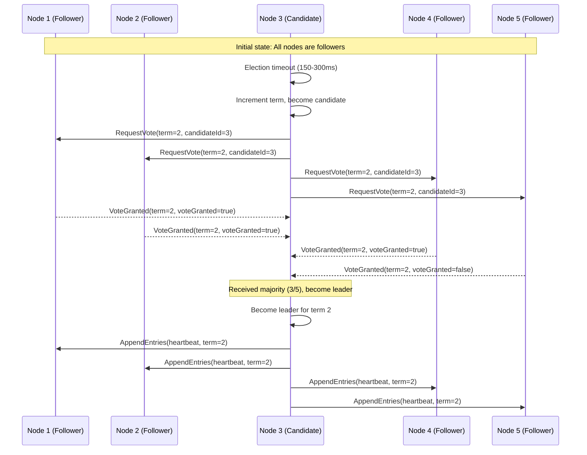
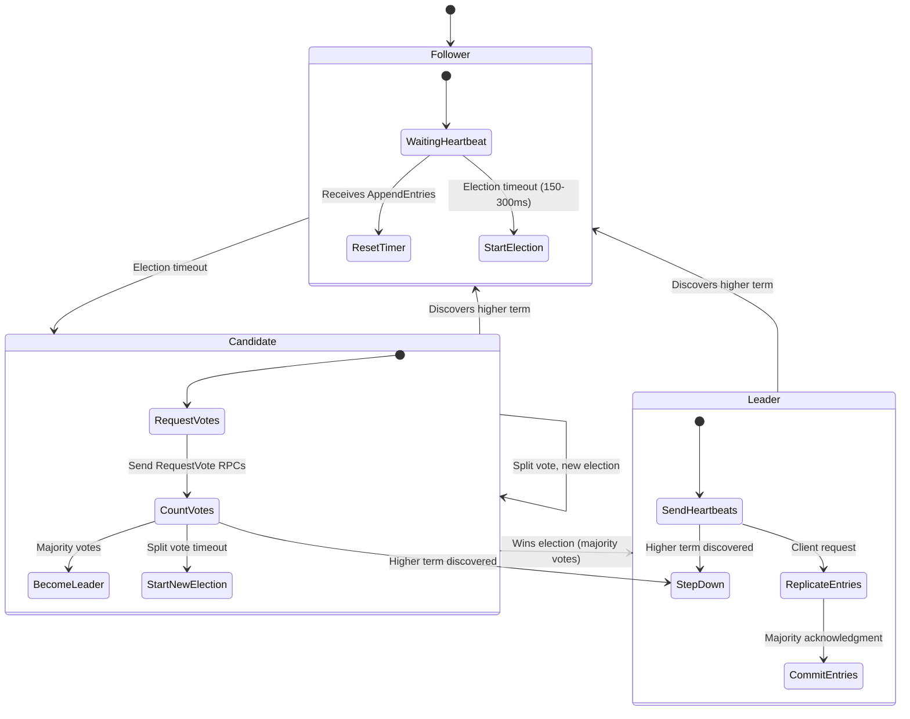
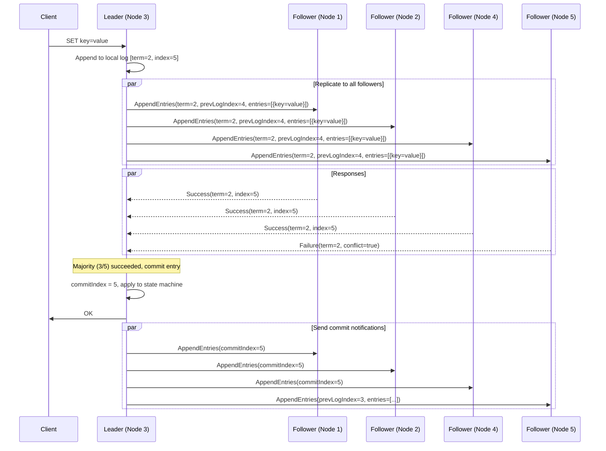
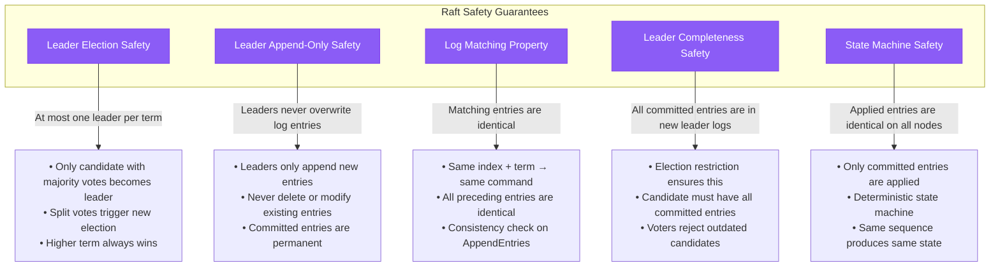

# Raft Consensus Algorithm

## Complete Raft Flow with Leader Election

The Raft consensus algorithm ensures linearizable consistency across distributed nodes through leader election, log replication, and safety guarantees.

### Leader Election Flow



### Complete State Machine



### Log Replication Protocol



### Configuration Parameters

```yaml
# Production Raft Configuration (etcd style)
raft_config:
  # Election timing
  election_timeout_min: 150ms    # Minimum election timeout
  election_timeout_max: 300ms    # Maximum election timeout (randomized)
  heartbeat_interval: 50ms       # Leader heartbeat frequency

  # Log compaction
  snapshot_count: 10000          # Entries before snapshot
  max_log_size: 100MB           # Maximum log file size

  # Network timeouts
  append_entries_timeout: 1s     # AppendEntries RPC timeout
  request_vote_timeout: 500ms    # RequestVote RPC timeout

  # Batch settings
  max_append_entries: 1000       # Max entries per AppendEntries
  max_inflight_rpcs: 64          # Max concurrent RPCs
```

### Safety Properties



### Production Metrics

```mermaid
graph LR
    subgraph Key_Raft_Metrics[Key Raft Metrics]
        TPS[Transactions/sec]
        LAT[Commit Latency p99]
        LEF[Leader Election Frequency]
        LRF[Log Replication Factor]
    end

    subgraph Typical_Production_Values[Typical Production Values]
        TPS_VAL[10,000-50,000 TPS<br/>(etcd: ~10k, Consul: ~5k)]
        LAT_VAL[1-10ms p99<br/>(LAN: 1-3ms, WAN: 5-10ms)]
        LEF_VAL[< 1 per day<br/>(Healthy: 0, Issues: > 10/day)]
        LRF_VAL[3-5 replicas<br/>(Odd numbers only)]
    end

    TPS --> TPS_VAL
    LAT --> LAT_VAL
    LEF --> LEF_VAL
    LRF --> LRF_VAL

    %% Apply state plane color for metrics
    classDef stateStyle fill:#F59E0B,stroke:#D97706,color:#fff
    class TPS,LAT,LEF,LRF,TPS_VAL,LAT_VAL,LEF_VAL,LRF_VAL stateStyle
```

### Implementation Checklist

### Production Cost-Benefit Analysis

| Benefit | Cost | Production Evidence |
|---------|------|---------------------|
| **Linearizable consistency** | 30-50% throughput reduction | etcd: 10K vs 30K ops/sec |
| **Operational simplicity** | Complex implementation | 6-12 months development |
| **Proven safety guarantees** | Higher latency (consensus overhead) | +10-50ms p99 latency |
| **Strong community support** | Resource requirements (odd cluster sizes) | 3-5 nodes minimum |
| **Battle-tested reliability** | Network partition sensitivity | 99.9%+ availability |

Raft has become the consensus algorithm of choice for modern distributed systems, powering trillions of dollars in database transactions and managing millions of Kubernetes clusters worldwide with exceptional safety and reliability guarantees.