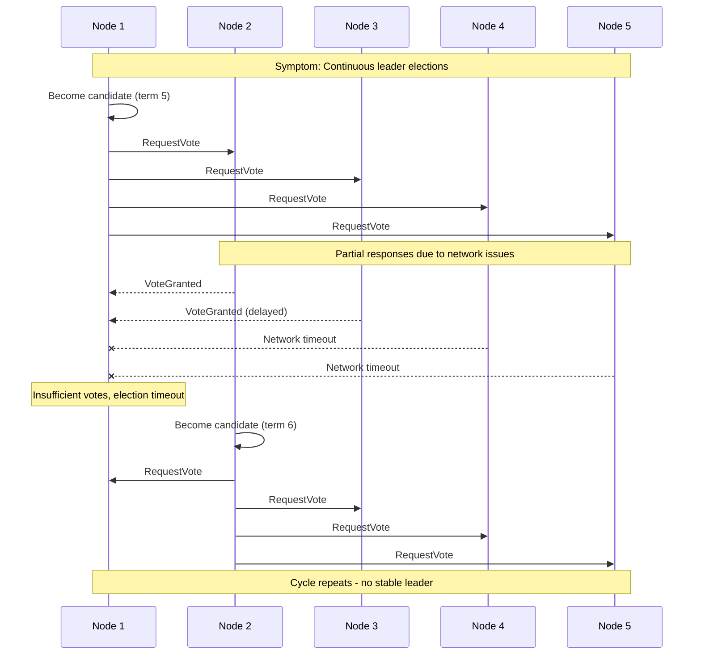
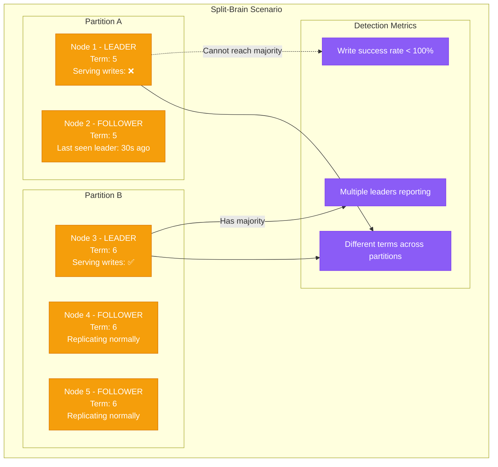
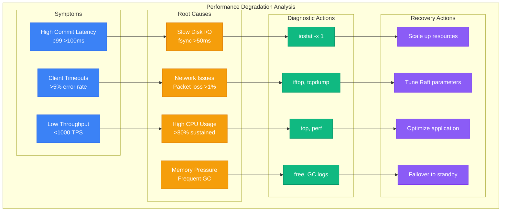

# Raft Debugging Guide

## Common Production Issues

Understanding how to diagnose and fix Raft consensus issues is crucial for maintaining production systems. This guide covers the most frequent problems and their solutions.

### Issue 1: Leader Election Storm

When nodes continuously elect new leaders without stability.



#### Diagnostic Commands

```bash
#!/bin/bash
# election-storm-diagnosis.sh

echo "=== Leader Election Storm Diagnosis ==="

# Check election frequency
echo "Elections in last hour:"
grep "leader election" /var/log/raft/*.log | \
  grep "$(date -d '1 hour ago' '+%Y-%m-%d %H')" | wc -l

# Check current leader status
echo -e "\nCurrent leader status:"
for node in node1 node2 node3; do
  echo "$node: $(curl -s http://$node:8080/status | jq -r '.state')"
done

# Check network connectivity
echo -e "\nNetwork connectivity matrix:"
for source in node1 node2 node3; do
  for target in node1 node2 node3; do
    if [ "$source" != "$target" ]; then
      rtt=$(ping -c 1 -W 1 $target 2>/dev/null | awk '/time=/{print $7}' | cut -d= -f2)
      echo "$source -> $target: ${rtt:-FAIL}"
    fi
  done
done

# Check for clock skew
echo -e "\nClock synchronization:"
for node in node1 node2 node3; do
  time=$(ssh $node 'date +%s')
  skew=$((time - $(date +%s)))
  echo "$node: ${skew}s skew"
done

# Check system load
echo -e "\nSystem load:"
for node in node1 node2 node3; do
  load=$(ssh $node 'uptime | awk "{print \$NF}"')
  echo "$node: $load"
done
```

#### Root Causes and Solutions

```yaml
# Common causes and fixes for election storms
election_storm_fixes:
  network_instability:
    symptoms:
      - "High packet loss between nodes"
      - "Variable latency spikes"
      - "TCP connection drops"
    diagnosis:
      - "ping -f between all node pairs"
      - "tcpdump for connection resets"
      - "iftop for bandwidth usage"
    fixes:
      - "Increase election timeout (300ms -> 500ms)"
      - "Add network buffers"
      - "Use dedicated network for Raft"

  clock_skew:
    symptoms:
      - "Timestamps out of order in logs"
      - "Election timeouts inconsistent"
    diagnosis:
      - "chrony tracking output"
      - "ntpstat on all nodes"
    fixes:
      - "Configure NTP properly"
      - "Use hardware clock sync"
      - "Monitor clock drift"

  cpu_starvation:
    symptoms:
      - "High CPU usage (>90%)"
      - "Go GC pauses >100ms"
      - "Process scheduling delays"
    diagnosis:
      - "top/htop during elections"
      - "GC logs analysis"
      - "CPU flamegraphs"
    fixes:
      - "Dedicated CPU cores for Raft"
      - "Tune GC parameters"
      - "Reduce batch sizes"

  disk_io_blocking:
    symptoms:
      - "fsync() taking >100ms"
      - "High disk queue depth"
      - "WAL write delays"
    diagnosis:
      - "iostat -x 1 during issues"
      - "iotop for process I/O"
      - "Disk latency histograms"
    fixes:
      - "Use faster storage (NVMe)"
      - "Separate WAL from data"
      - "Increase I/O queue depth"
```

### Issue 2: Split-Brain Detection

When multiple nodes believe they are the leader simultaneously.



#### Split-Brain Detection Script

```bash
#!/bin/bash
# split-brain-detector.sh

echo "=== Split-Brain Detection ==="

declare -A leaders
declare -A terms
declare -A serving

# Collect status from all nodes
for node in node1 node2 node3 node4 node5; do
  status=$(curl -s http://$node:8080/status 2>/dev/null)

  if [ $? -eq 0 ]; then
    leaders[$node]=$(echo "$status" | jq -r '.is_leader')
    terms[$node]=$(echo "$status" | jq -r '.current_term')
    serving[$node]=$(echo "$status" | jq -r '.serving_writes')

    echo "$node: Leader=${leaders[$node]}, Term=${terms[$node]}, Serving=${serving[$node]}"
  else
    echo "$node: UNREACHABLE"
    leaders[$node]="unknown"
    terms[$node]="unknown"
    serving[$node]="unknown"
  fi
done

# Count leaders
leader_count=0
for node in "${!leaders[@]}"; do
  if [ "${leaders[$node]}" = "true" ]; then
    ((leader_count++))
    echo "LEADER FOUND: $node"
  fi
done

# Check for split-brain
if [ $leader_count -gt 1 ]; then
  echo "🚨 SPLIT-BRAIN DETECTED: $leader_count leaders!"

  # Find term distribution
  echo "Term distribution:"
  printf "%s\n" "${terms[@]}" | sort | uniq -c

  # Check which leaders are serving writes
  echo "Leaders serving writes:"
  for node in "${!leaders[@]}"; do
    if [ "${leaders[$node]}" = "true" ] && [ "${serving[$node]}" = "true" ]; then
      echo "  $node (DANGEROUS - serving writes)"
    fi
  done

  echo "IMMEDIATE ACTION REQUIRED:"
  echo "1. Stop client writes immediately"
  echo "2. Identify the legitimate leader (highest term + majority partition)"
  echo "3. Manually demote false leaders"

elif [ $leader_count -eq 0 ]; then
  echo "⚠️  NO LEADER: Cluster unavailable for writes"

else
  echo "✅ Single leader detected - normal operation"
fi
```

### Issue 3: Log Replication Lag

When followers fall behind the leader in log replication.

```mermaid
graph LR
    subgraph Log_Replication_Status[Log Replication Status]
        subgraph Leader__Node_1[Leader (Node 1)]
            L_LOG[Log Entries: 1000<br/>Committed: 995<br/>Applied: 995]
        end

        subgraph Healthy_Follower__Node_2[Healthy Follower (Node 2)]
            F1_LOG[Log Entries: 999<br/>Committed: 995<br/>Applied: 995<br/>Lag: 1 entry]
        end

        subgraph Lagging_Follower__Node_3[Lagging Follower (Node 3)]
            F2_LOG[Log Entries: 950<br/>Committed: 945<br/>Applied: 940<br/>Lag: 50 entries]
        end

        subgraph Problematic_Follower__Node_4[Problematic Follower (Node 4)]
            F3_LOG[Log Entries: 800<br/>Committed: 795<br/>Applied: 790<br/>Lag: 200 entries]
        end
    end

    L_LOG --> F1_LOG
    L_LOG -.-> |"Slow replication"| F2_LOG
    L_LOG -.-> |"Very slow replication"| F3_LOG

    %% Apply state plane color for log data
    classDef stateStyle fill:#F59E0B,stroke:#D97706,color:#fff
    class L_LOG,F1_LOG,F2_LOG,F3_LOG stateStyle
```

#### Replication Lag Monitoring

```python
#!/usr/bin/env python3
# replication-lag-monitor.py

import requests
import json
import time
from collections import defaultdict

def check_replication_lag():
    nodes = ['node1', 'node2', 'node3', 'node4', 'node5']
    status = {}

    # Collect status from all nodes
    for node in nodes:
        try:
            response = requests.get(f'http://{node}:8080/status', timeout=5)
            status[node] = response.json()
        except Exception as e:
            print(f"Error connecting to {node}: {e}")
            status[node] = None

    # Find the leader
    leader = None
    leader_log_index = 0

    for node, node_status in status.items():
        if node_status and node_status.get('is_leader'):
            leader = node
            leader_log_index = node_status.get('last_log_index', 0)
            break

    if not leader:
        print("❌ No leader found!")
        return

    print(f"✅ Leader: {leader} (log index: {leader_log_index})")
    print("\nReplication lag analysis:")

    # Check lag for each follower
    for node, node_status in status.items():
        if node == leader or not node_status:
            continue

        follower_log_index = node_status.get('last_log_index', 0)
        lag = leader_log_index - follower_log_index

        if lag == 0:
            print(f"  {node}: ✅ Up to date")
        elif lag <= 10:
            print(f"  {node}: ⚠️  Lag: {lag} entries (normal)")
        elif lag <= 100:
            print(f"  {node}: ⚠️  Lag: {lag} entries (concerning)")
        else:
            print(f"  {node}: 🚨 Lag: {lag} entries (critical)")

            # Additional diagnostics for critical lag
            print(f"    Last heartbeat: {node_status.get('last_heartbeat_ago', 'unknown')}")
            print(f"    Network errors: {node_status.get('network_errors', 'unknown')}")
            print(f"    Disk write latency: {node_status.get('disk_write_latency_p99', 'unknown')}")

def monitor_continuously():
    """Monitor replication lag continuously"""
    print("Starting continuous replication lag monitoring...")
    print("Press Ctrl+C to stop")

    try:
        while True:
            print("\n" + "="*60)
            print(f"Replication Status - {time.strftime('%Y-%m-%d %H:%M:%S')}")
            print("="*60)
            check_replication_lag()
            time.sleep(30)  # Check every 30 seconds
    except KeyboardInterrupt:
        print("\nMonitoring stopped.")

if __name__ == "__main__":
    import sys
    if len(sys.argv) > 1 and sys.argv[1] == "--continuous":
        monitor_continuously()
    else:
        check_replication_lag()
```

### Issue 4: Performance Degradation

Sudden drops in Raft consensus performance.



### Diagnostic Toolkit

```yaml
# Comprehensive Raft debugging toolkit
debugging_tools:
  log_analysis:
    # Extract key metrics from logs
    election_frequency: |
      grep "leader election" /var/log/raft/*.log |
      awk '{print $1, $2}' | uniq -c | sort -nr

    commit_latency: |
      grep "commit latency" /var/log/raft/*.log |
      awk '{print $NF}' | sort -n |
      awk '{arr[NR]=$1} END {print "p50:", arr[int(NR*0.5)], "p99:", arr[int(NR*0.99)]}'

    error_patterns: |
      grep -E "(ERROR|WARN|timeout|failed)" /var/log/raft/*.log |
      awk '{print $5, $6, $7}' | sort | uniq -c | sort -nr

  network_diagnostics:
    connectivity_matrix: |
      for src in node1 node2 node3; do
        for dst in node1 node2 node3; do
          if [ "$src" != "$dst" ]; then
            echo -n "$src->$dst: "
            ping -c 1 -W 1 $dst | grep "time=" | awk '{print $7}' || echo "FAIL"
          fi
        done
      done

    bandwidth_test: |
      # Test bandwidth between nodes
      iperf3 -s -D  # Start server on target
      iperf3 -c target_node -t 10 -P 4  # Test from source

    packet_loss: |
      # Check for packet loss
      ping -c 100 -i 0.1 target_node | grep "packet loss"

  performance_profiling:
    cpu_profiling: |
      # Profile CPU usage during consensus
      perf record -g -p $(pgrep raft-process) -- sleep 30
      perf report --stdio

    memory_profiling: |
      # Memory usage analysis
      valgrind --tool=massif ./raft-process
      ms_print massif.out.*

    io_profiling: |
      # I/O latency analysis
      iotop -ao -d 1 -p $(pgrep raft-process)
      iostat -x 1 5

  cluster_health_check: |
    #!/bin/bash
    # Comprehensive cluster health check

    echo "=== Raft Cluster Health Check ==="

    # Check all nodes are reachable
    echo "Node reachability:"
    for node in node1 node2 node3; do
      if curl -s http://$node:8080/health >/dev/null; then
        echo "  $node: ✅ Reachable"
      else
        echo "  $node: ❌ Unreachable"
      fi
    done

    # Check consensus state
    echo -e "\nConsensus state:"
    leader_count=0
    for node in node1 node2 node3; do
      state=$(curl -s http://$node:8080/status | jq -r '.state')
      term=$(curl -s http://$node:8080/status | jq -r '.current_term')
      echo "  $node: $state (term $term)"

      if [ "$state" = "leader" ]; then
        ((leader_count++))
      fi
    done

    # Validate single leader
    if [ $leader_count -eq 1 ]; then
      echo "  ✅ Single leader (healthy)"
    elif [ $leader_count -eq 0 ]; then
      echo "  ❌ No leader (election in progress?)"
    else
      echo "  🚨 Multiple leaders (split-brain!)"
    fi

    # Check performance metrics
    echo -e "\nPerformance metrics:"
    curl -s http://leader:8080/metrics | grep -E "(raft_commit_duration|raft_append_entries_duration)" |
    while read metric; do
      echo "  $metric"
    done
```

### Emergency Recovery Procedures

```bash
#!/bin/bash
# emergency-recovery.sh

echo "🚨 RAFT EMERGENCY RECOVERY PROCEDURES 🚨"
echo "Choose recovery scenario:"
echo "1. Cluster completely down"
echo "2. Majority of nodes lost"
echo "3. Data corruption detected"
echo "4. Network partition healing"
echo "5. Performance emergency"

read -p "Enter choice (1-5): " choice

case $choice in
  1)
    echo "=== CLUSTER COMPLETELY DOWN ==="
    echo "1. Verify all nodes are actually down"
    echo "2. Check for split-brain in monitoring"
    echo "3. Start nodes one by one, leader first"
    echo "4. Verify data consistency after recovery"

    echo "Commands:"
    echo "  systemctl start raft-service  # On each node"
    echo "  curl http://node:8080/status  # Verify"
    ;;

  2)
    echo "=== MAJORITY OF NODES LOST ==="
    echo "⚠️  WARNING: This creates a new cluster from surviving nodes"
    echo "1. Identify surviving nodes with latest data"
    echo "2. Create new cluster with lower node count"
    echo "3. Add replacement nodes gradually"

    echo "Commands:"
    echo "  raft-admin force-new-cluster --node=survivor"
    echo "  raft-admin add-node --id=new-node --address=ip:port"
    ;;

  3)
    echo "=== DATA CORRUPTION DETECTED ==="
    echo "1. Stop all writes immediately"
    echo "2. Identify uncorrupted replicas"
    echo "3. Restore from backup or rebuild from clean replica"

    echo "Commands:"
    echo "  raft-admin stop-writes"
    echo "  raft-admin verify-data-integrity"
    echo "  raft-admin restore-from-backup --path=/backup/latest"
    ;;

  4)
    echo "=== NETWORK PARTITION HEALING ==="
    echo "1. Verify network connectivity restored"
    echo "2. Check for split-brain condition"
    echo "3. Allow automatic healing or force leader election"

    echo "Commands:"
    echo "  ping -c 5 each-node  # Verify connectivity"
    echo "  raft-admin check-split-brain"
    echo "  raft-admin force-election  # If needed"
    ;;

  5)
    echo "=== PERFORMANCE EMERGENCY ==="
    echo "1. Reduce client load immediately"
    echo "2. Check system resources (CPU, memory, disk, network)"
    echo "3. Apply emergency performance tuning"
    echo "4. Consider failing over to backup cluster"

    echo "Commands:"
    echo "  raft-admin set-batch-size 1000    # Increase batching"
    echo "  raft-admin set-heartbeat-interval 100ms  # Reduce frequency"
    echo "  systemctl restart raft-service    # Last resort"
    ;;

  *)
    echo "Invalid choice"
    exit 1
    ;;
esac

echo -e "\n⚠️  Always verify cluster health after recovery:"
echo "  ./cluster-health-check.sh"
echo "  ./replication-lag-monitor.py"
```

This comprehensive debugging guide provides the tools and procedures needed to diagnose and resolve the most common Raft consensus issues in production environments.