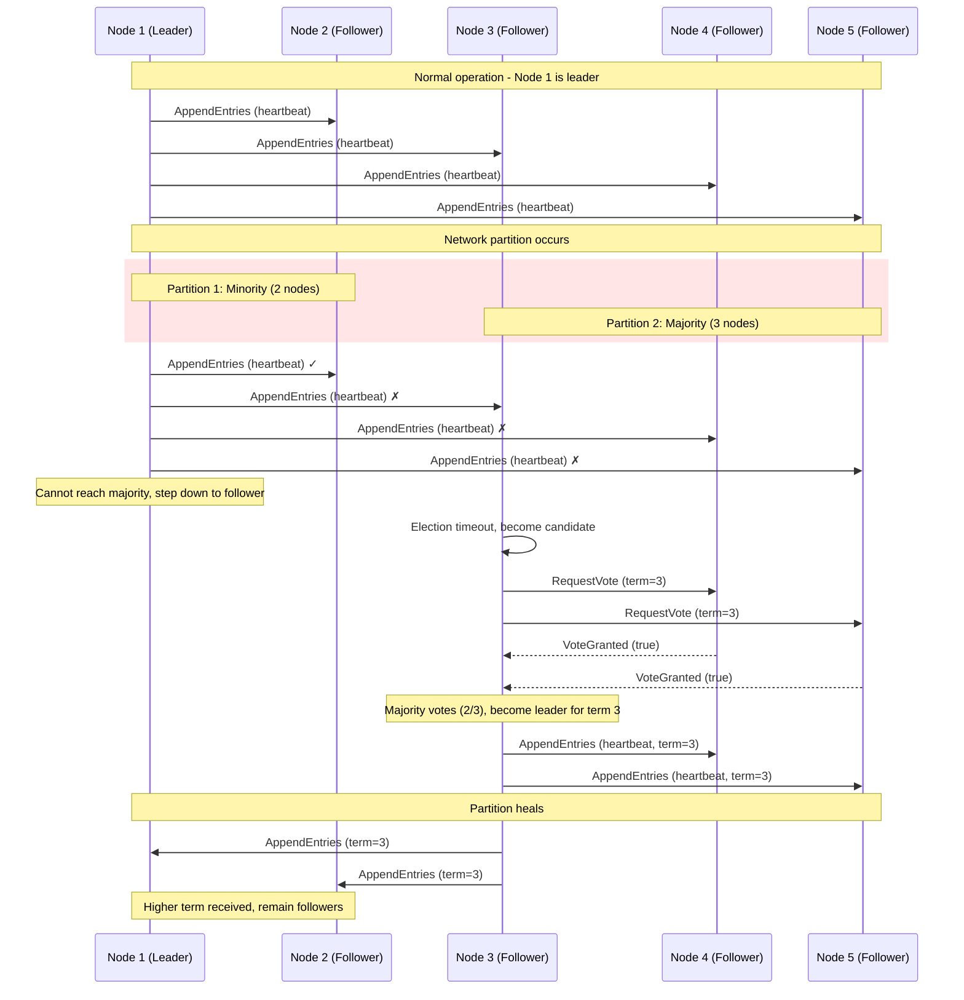
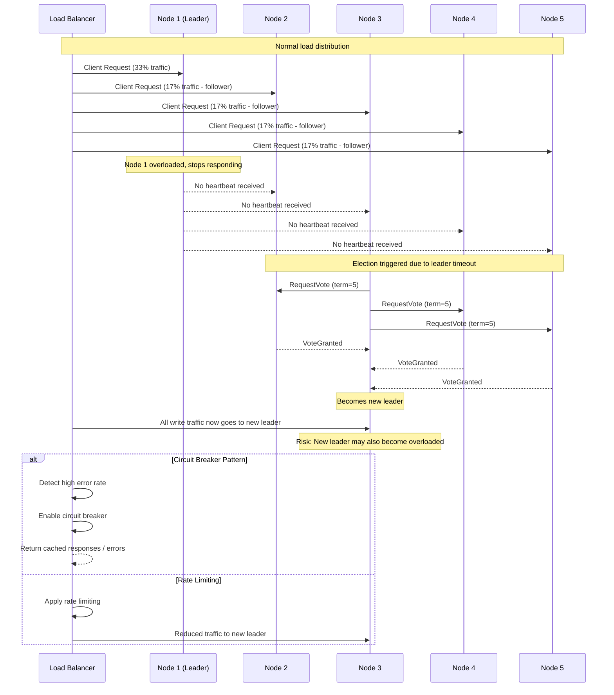

# Raft Failure Modes and Network Partitions

## Network Partition Scenarios

Network partitions are the most challenging failure mode for Raft clusters. Understanding how Raft handles split-brain scenarios is crucial for production deployments.

### Split-Brain Prevention



### Minority Partition Behavior

```mermaid
graph TB
    subgraph Network_Partition_Scenario[Network Partition Scenario]
        subgraph Minority_Partition__2_nodes[Minority Partition (2 nodes)]
            N1[Node 1 - Former Leader]
            N2[Node 2 - Follower]

            N1 -.-> |"Cannot reach majority"| REJECT[Reject Client Writes]
            N2 -.-> WAIT[Wait for Leader]
        end

        subgraph Majority_Partition__3_nodes[Majority Partition (3 nodes)]
            N3[Node 3 - New Leader]
            N4[Node 4 - Follower]
            N5[Node 5 - Follower]

            N3 --> ACCEPT[Accept Client Writes]
            N4 --> REPLICATE[Replicate from Leader]
            N5 --> REPLICATE
        end

        subgraph Client_Impact[Client Impact]
            C1[Clients to Minority]
            C2[Clients to Majority]

            C1 --> UNAVAILABLE[Service Unavailable]
            C2 --> AVAILABLE[Service Available]
        end
    end

    %% Apply 4-plane colors
    classDef edgeStyle fill:#3B82F6,stroke:#2563EB,color:#fff
    classDef serviceStyle fill:#10B981,stroke:#059669,color:#fff
    classDef stateStyle fill:#F59E0B,stroke:#D97706,color:#fff
    classDef controlStyle fill:#8B5CF6,stroke:#7C3AED,color:#fff

    class C1,C2 edgeStyle
    class AVAILABLE,UNAVAILABLE serviceStyle
    class N1,N2,N3,N4,N5 stateStyle
    class REJECT,WAIT,ACCEPT,REPLICATE controlStyle
```

### Byzantine Failure Detection

While Raft doesn't handle Byzantine failures, it can detect certain anomalous behaviors:

```mermaid
flowchart TD
    START[Raft Node Monitoring]

    CHECK_TERM[Check Term Consistency]
    CHECK_LOG[Check Log Consistency]
    CHECK_TIMING[Check Timing Patterns]
    CHECK_VOTE[Check Vote Patterns]

    %% Term checks
    TERM_OK[Term Progression Normal]
    TERM_SKIP[Term Skipping Detected]
    TERM_REGRESS[Term Regression Detected]

    %% Log checks
    LOG_OK[Log Matching Property Holds]
    LOG_MISMATCH[Log Mismatch Detected]
    LOG_MISSING[Missing Log Entries]

    %% Timing checks
    TIMING_OK[Normal Timing Patterns]
    TIMING_FLOOD[Election Flooding]
    TIMING_DELAY[Excessive Delays]

    %% Vote checks
    VOTE_OK[Valid Vote Patterns]
    VOTE_MULTIPLE[Multiple Votes Same Term]
    VOTE_INVALID[Invalid Vote Responses]

    %% Actions
    CONTINUE[Continue Normal Operation]
    INVESTIGATE[Log Anomaly for Investigation]
    QUARANTINE[Remove Node from Cluster]

    START --> CHECK_TERM
    START --> CHECK_LOG
    START --> CHECK_TIMING
    START --> CHECK_VOTE

    CHECK_TERM --> TERM_OK
    CHECK_TERM --> TERM_SKIP
    CHECK_TERM --> TERM_REGRESS

    CHECK_LOG --> LOG_OK
    CHECK_LOG --> LOG_MISMATCH
    CHECK_LOG --> LOG_MISSING

    CHECK_TIMING --> TIMING_OK
    CHECK_TIMING --> TIMING_FLOOD
    CHECK_TIMING --> TIMING_DELAY

    CHECK_VOTE --> VOTE_OK
    CHECK_VOTE --> VOTE_MULTIPLE
    CHECK_VOTE --> VOTE_INVALID

    TERM_OK --> CONTINUE
    LOG_OK --> CONTINUE
    TIMING_OK --> CONTINUE
    VOTE_OK --> CONTINUE

    TERM_SKIP --> INVESTIGATE
    TIMING_FLOOD --> INVESTIGATE
    TIMING_DELAY --> INVESTIGATE

    TERM_REGRESS --> QUARANTINE
    LOG_MISMATCH --> QUARANTINE
    LOG_MISSING --> QUARANTINE
    VOTE_MULTIPLE --> QUARANTINE
    VOTE_INVALID --> QUARANTINE

    %% Apply control plane color for monitoring
    classDef controlStyle fill:#8B5CF6,stroke:#7C3AED,color:#fff
    class START,CHECK_TERM,CHECK_LOG,CHECK_TIMING,CHECK_VOTE,INVESTIGATE,QUARANTINE controlStyle
```



### Cascade Failure Prevention



### Common Failure Scenarios

#### Disk Full / WAL Corruption

```mermaid
graph TB
    subgraph Disk_Failure_Scenario[Disk Failure Scenario]
        subgraph Before_Failure[Before Failure]
            HEALTHY[Normal Operations]
            WAL_WRITE[WAL Writes Successful]
            STATE_APPLY[State Machine Updates]
        end

        subgraph Failure_Detection[Failure Detection]
            DISK_FULL[Disk 95% Full]
            WAL_FAIL[WAL Write Fails]
            FSYNC_TIMEOUT[fsync() Timeout]
        end

        subgraph Recovery_Actions[Recovery Actions]
            STEP_DOWN[Leader Steps Down]
            READ_ONLY[Enter Read-Only Mode]
            ALERT[Alert Operations Team]
            CLEANUP[Log Compaction/Cleanup]
            DISK_EXPAND[Expand Disk Space]
        end

        subgraph Prevention
            MONITORING[Disk Space Monitoring]
            ROTATION[Log Rotation Policy]
            SNAPSHOTS[Regular Snapshots]
            QUOTAS[Disk Quotas]
        end
    end

    HEALTHY --> DISK_FULL
    WAL_WRITE --> WAL_FAIL
    DISK_FULL --> WAL_FAIL
    WAL_FAIL --> FSYNC_TIMEOUT
    FSYNC_TIMEOUT --> STEP_DOWN
    STEP_DOWN --> READ_ONLY
    READ_ONLY --> ALERT
    ALERT --> CLEANUP
    CLEANUP --> DISK_EXPAND

    MONITORING --> DISK_FULL
    ROTATION --> CLEANUP
    SNAPSHOTS --> CLEANUP
    QUOTAS --> DISK_FULL

    %% Apply colors
    classDef edgeStyle fill:#3B82F6,stroke:#2563EB,color:#fff
    classDef serviceStyle fill:#10B981,stroke:#059669,color:#fff
    classDef stateStyle fill:#F59E0B,stroke:#D97706,color:#fff
    classDef controlStyle fill:#8B5CF6,stroke:#7C3AED,color:#fff

    class HEALTHY,WAL_WRITE,STATE_APPLY serviceStyle
    class DISK_FULL,WAL_FAIL,FSYNC_TIMEOUT stateStyle
    class STEP_DOWN,READ_ONLY,ALERT,CLEANUP,DISK_EXPAND controlStyle
    class MONITORING,ROTATION,SNAPSHOTS,QUOTAS edgeStyle
```

### Memory Pressure and GC Issues

```yaml
# JVM tuning for Raft implementations (Java-based systems)
jvm_options:
  heap_size: "8g"                    # Dedicated heap for Raft state
  gc_algorithm: "G1GC"               # Low-latency garbage collector
  gc_max_pause: "10ms"               # Target pause time

  # Memory pressure detection
  heap_threshold: "85%"              # Alert threshold
  gc_frequency_alert: "10/min"       # GC happening too often

  # OutOfMemoryError handling
  oom_action: "restart_node"         # Graceful restart on OOM
  heap_dump: "/var/log/raft/oom/"   # Capture heap dumps

  # Monitoring
  jvm_metrics: true
  gc_logging: true
  allocation_tracking: true
```

### Production Incident Playbook

#### Scenario 1: Split-Brain Detection
```bash
#!/bin/bash
# split-brain-detection.sh

# Check if multiple nodes claim to be leader
LEADERS=$(curl -s http://node1:8080/status | jq -r '.leader')
LEADERS+=$(curl -s http://node2:8080/status | jq -r '.leader')
LEADERS+=$(curl -s http://node3:8080/status | jq -r '.leader')

LEADER_COUNT=$(echo "$LEADERS" | grep -c "true")

if [ "$LEADER_COUNT" -gt 1 ]; then
    echo "ALERT: Multiple leaders detected!"
    echo "Immediate actions:"
    echo "1. Stop all writes to the cluster"
    echo "2. Check network connectivity between nodes"
    echo "3. Verify NTP synchronization"
    echo "4. Check for clock skew"

    # Automated checks
    for node in node1 node2 node3; do
        echo "Node $node status:"
        curl -s http://$node:8080/status | jq '.'
        echo "Current time on $node:"
        ssh $node 'date'
    done
fi
```

#### Scenario 2: Leader Election Storm
```bash
#!/bin/bash
# election-storm-detection.sh

# Monitor election frequency
ELECTIONS_LAST_HOUR=$(grep "leader election" /var/log/raft/*.log | \
    grep "$(date -d '1 hour ago' '+%Y-%m-%d %H')" | wc -l)

if [ "$ELECTIONS_LAST_HOUR" -gt 5 ]; then
    echo "ALERT: Election storm detected ($ELECTIONS_LAST_HOUR elections)"
    echo "Common causes:"
    echo "1. Network instability"
    echo "2. CPU starvation"
    echo "3. Disk I/O blocking"
    echo "4. Clock skew"

    # Diagnostic commands
    echo "Network connectivity:"
    for node in node1 node2 node3; do
        ping -c 3 $node
    done

    echo "CPU and load:"
    uptime
    iostat -x 1 5

    echo "Recent elections:"
    grep "leader election" /var/log/raft/*.log | tail -10
fi
```

### Recovery Procedures

#### Cluster Recovery from Majority Loss

```bash
#!/bin/bash
# cluster-recovery.sh - Use with extreme caution!

# This should ONLY be used when majority of nodes are permanently lost
# and you need to recover from a single remaining node

SURVIVING_NODE="node3"
CLUSTER_NAME="production-cluster"

echo "WARNING: This will create a new cluster from a single node"
echo "All other nodes must be completely wiped and rejoined"
read -p "Are you sure? (type 'DESTROY AND REBUILD'): " confirm

if [ "$confirm" != "DESTROY AND REBUILD" ]; then
    echo "Aborted"
    exit 1
fi

echo "Step 1: Stop all Raft services"
systemctl stop raft-service

echo "Step 2: Backup current state"
cp -r /var/lib/raft /var/lib/raft.backup.$(date +%s)

echo "Step 3: Create new single-node cluster"
cat > /etc/raft/recovery.conf << EOF
# Emergency recovery configuration
bootstrap_expect = 1
node_id = "$SURVIVING_NODE"
cluster_members = ["$SURVIVING_NODE"]
recovery_mode = true
EOF

echo "Step 4: Start service in recovery mode"
systemctl start raft-service

echo "Step 5: Verify cluster is operational"
sleep 10
curl -s http://localhost:8080/status | jq '.'

echo "Step 6: Add new nodes one by one"
echo "Use: raft-admin add-node <new-node-id> <new-node-address>"
```

This comprehensive coverage of Raft failure modes helps operators understand what can go wrong and how to respond effectively during production incidents.