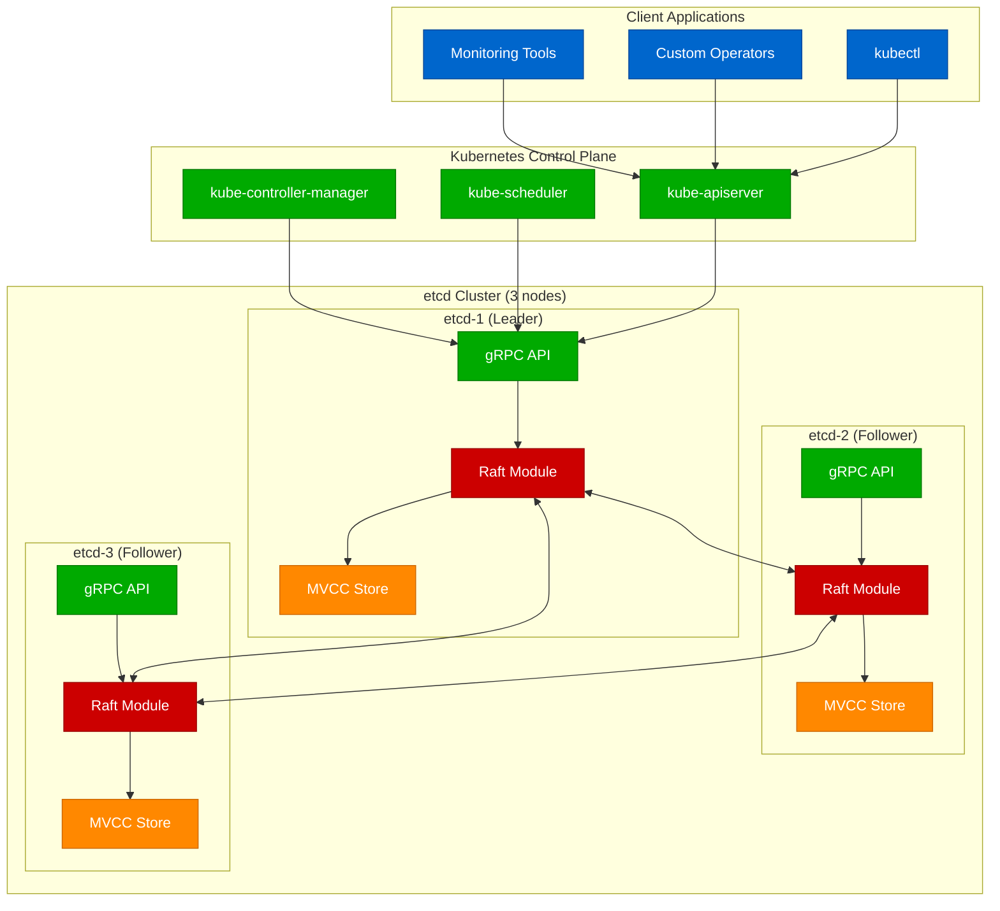
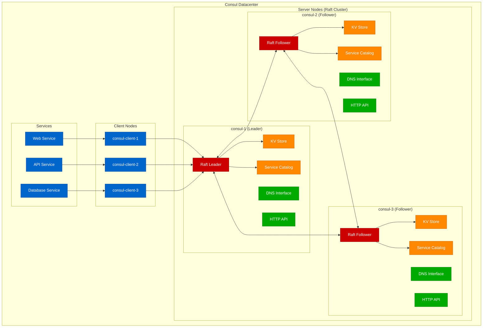
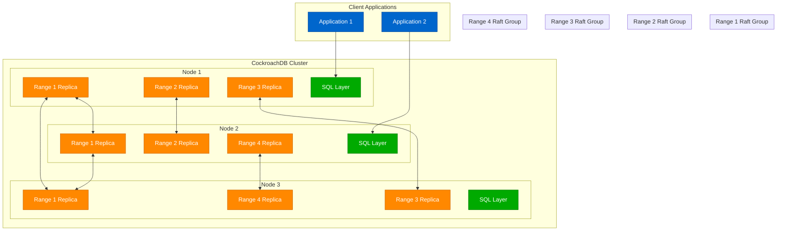
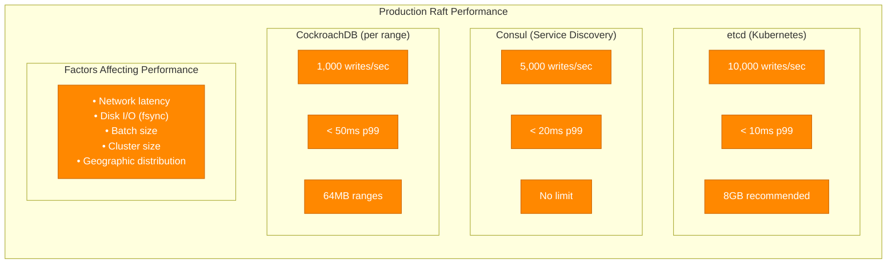
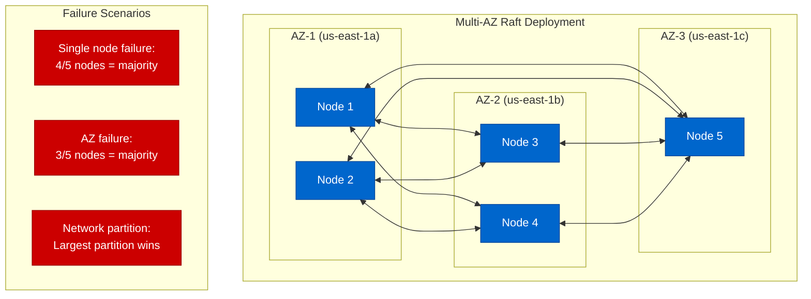

# Raft Production Implementations

## etcd - The Kubernetes Backbone

etcd implements Raft to provide the distributed key-value store that powers Kubernetes cluster state.

### etcd Raft Architecture



### etcd Configuration (Production)

```yaml
# /etc/etcd/etcd.conf
name: etcd-1
data-dir: /var/lib/etcd
wal-dir: /var/lib/etcd/wal

# Cluster configuration
initial-advertise-peer-urls: https://10.0.1.10:2380
listen-peer-urls: https://10.0.1.10:2380
listen-client-urls: https://10.0.1.10:2379,https://127.0.0.1:2379
advertise-client-urls: https://10.0.1.10:2379
initial-cluster: etcd-1=https://10.0.1.10:2380,etcd-2=https://10.0.1.11:2380,etcd-3=https://10.0.1.12:2380
initial-cluster-state: new
initial-cluster-token: etcd-cluster-1

# Raft timing (production tuned)
heartbeat-interval: 100
election-timeout: 1000

# Performance tuning
quota-backend-bytes: 8589934592  # 8GB
auto-compaction-retention: 1h
max-request-bytes: 1572864       # 1.5MB
grpc-keepalive-min-time: 5s
grpc-keepalive-interval: 2h
grpc-keepalive-timeout: 20s

# Security
cert-file: /etc/etcd/server.crt
key-file: /etc/etcd/server.key
peer-cert-file: /etc/etcd/peer.crt
peer-key-file: /etc/etcd/peer.key
trusted-ca-file: /etc/etcd/ca.crt
peer-trusted-ca-file: /etc/etcd/ca.crt
```

### Consul - Service Discovery with Raft

Consul uses Raft for its service catalog and key-value store, providing service discovery and configuration.

### Consul Raft Architecture



### Consul Configuration (Production)

```hcl
# /etc/consul/consul.hcl
datacenter = "dc1"
data_dir = "/opt/consul"
log_level = "INFO"
node_name = "consul-1"
bind_addr = "10.0.1.10"
client_addr = "0.0.0.0"

# Server mode with Raft
server = true
bootstrap_expect = 3
retry_join = ["10.0.1.11", "10.0.1.12"]

# Raft performance tuning
raft_protocol = 3
raft_snapshot_threshold = 8192
raft_snapshot_interval = "5s"
raft_trailing_logs = 10000

# Performance
performance {
  raft_multiplier = 1
}

# Connect for service mesh
connect {
  enabled = true
}

# TLS configuration
verify_incoming = true
verify_outgoing = true
verify_server_hostname = true
ca_file = "/etc/consul/ca.pem"
cert_file = "/etc/consul/consul.pem"
key_file = "/etc/consul/consul-key.pem"

# Monitoring
telemetry {
  prometheus_retention_time = "24h"
  disable_hostname = false
}
```

### CockroachDB - Distributed SQL with Raft

CockroachDB uses Raft for replicating ranges of data across multiple nodes.

### CockroachDB Raft per Range



### Performance Comparison



### Deployment Patterns

#### High Availability Setup (5 nodes)



### Monitoring and Alerting

```yaml
# Prometheus alerts for Raft health
groups:
- name: raft.rules
  rules:
  - alert: RaftLeaderElection
    expr: increase(raft_leader_elections_total[5m]) > 0
    for: 1m
    labels:
      severity: warning
    annotations:
      summary: "Raft leader election occurred"

  - alert: RaftNoLeader
    expr: raft_leader_last_contact_seconds > 5
    for: 30s
    labels:
      severity: critical
    annotations:
      summary: "Raft cluster has no leader"

  - alert: RaftHighCommitLatency
    expr: histogram_quantile(0.99, raft_commit_duration_seconds_bucket) > 0.1
    for: 2m
    labels:
      severity: warning
    annotations:
      summary: "High Raft commit latency"

  - alert: RaftLogReplicationLag
    expr: raft_replication_append_entries_rpc_duration_seconds > 0.05
    for: 2m
    labels:
      severity: warning
    annotations:
      summary: "Slow log replication"
```

### Production Tuning Guidelines

#### Network Optimization
```bash
# Increase TCP buffer sizes
echo 'net.core.rmem_max = 134217728' >> /etc/sysctl.conf
echo 'net.core.wmem_max = 134217728' >> /etc/sysctl.conf
echo 'net.ipv4.tcp_rmem = 4096 65536 134217728' >> /etc/sysctl.conf
echo 'net.ipv4.tcp_wmem = 4096 65536 134217728' >> /etc/sysctl.conf

# Reduce TCP timeouts for faster failure detection
echo 'net.ipv4.tcp_keepalive_time = 30' >> /etc/sysctl.conf
echo 'net.ipv4.tcp_keepalive_intvl = 5' >> /etc/sysctl.conf
echo 'net.ipv4.tcp_keepalive_probes = 3' >> /etc/sysctl.conf
```

#### Disk I/O Optimization
```bash
# Use dedicated SSD for Raft log (WAL)
# Mount with appropriate options
mount -o noatime,nodiratime /dev/nvme1n1 /var/lib/raft/wal

# Ensure fsync performance
echo deadline > /sys/block/nvme1n1/queue/scheduler

# Set appropriate I/O scheduler
echo 1 > /sys/block/nvme1n1/queue/iosched/fifo_batch
```

This covers the major production implementations of Raft, showing how real systems like etcd, Consul, and CockroachDB use Raft to achieve strong consistency in their distributed architectures.