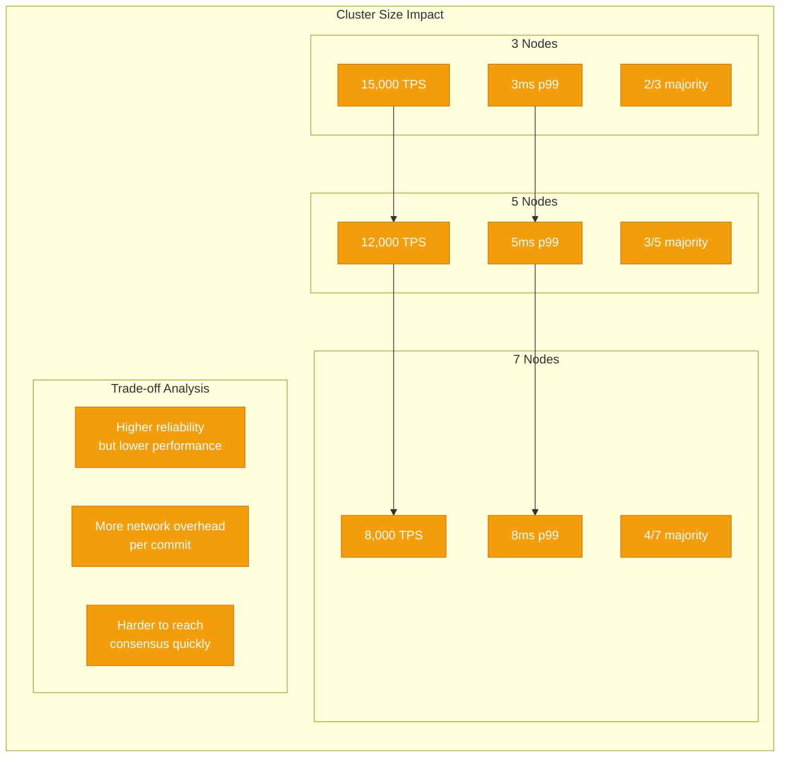
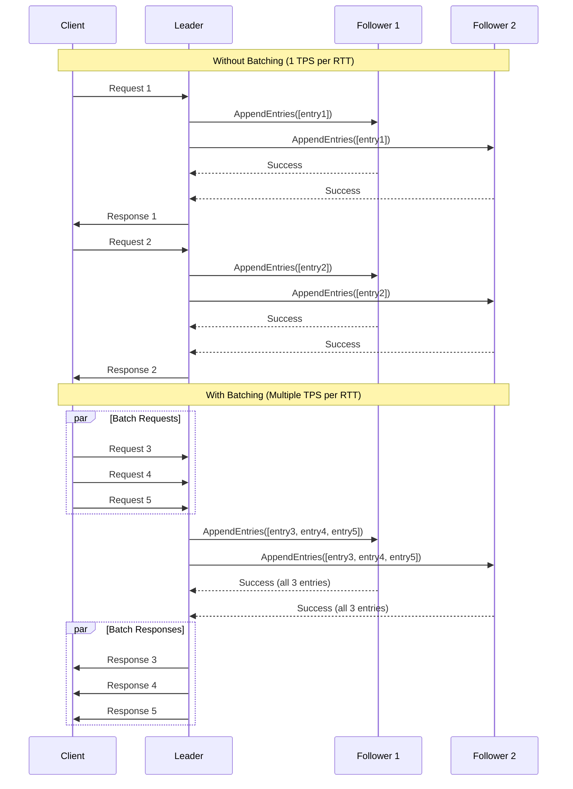
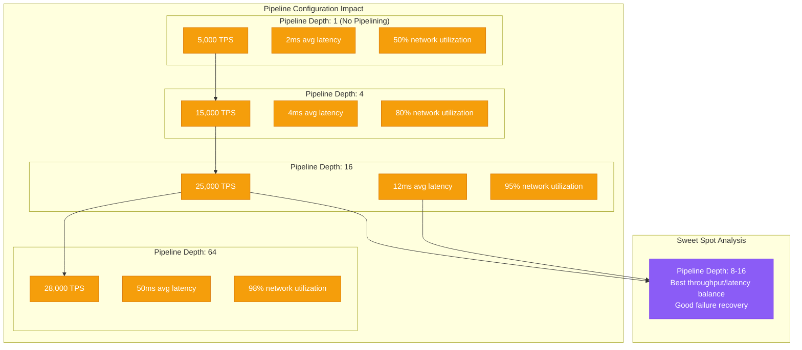
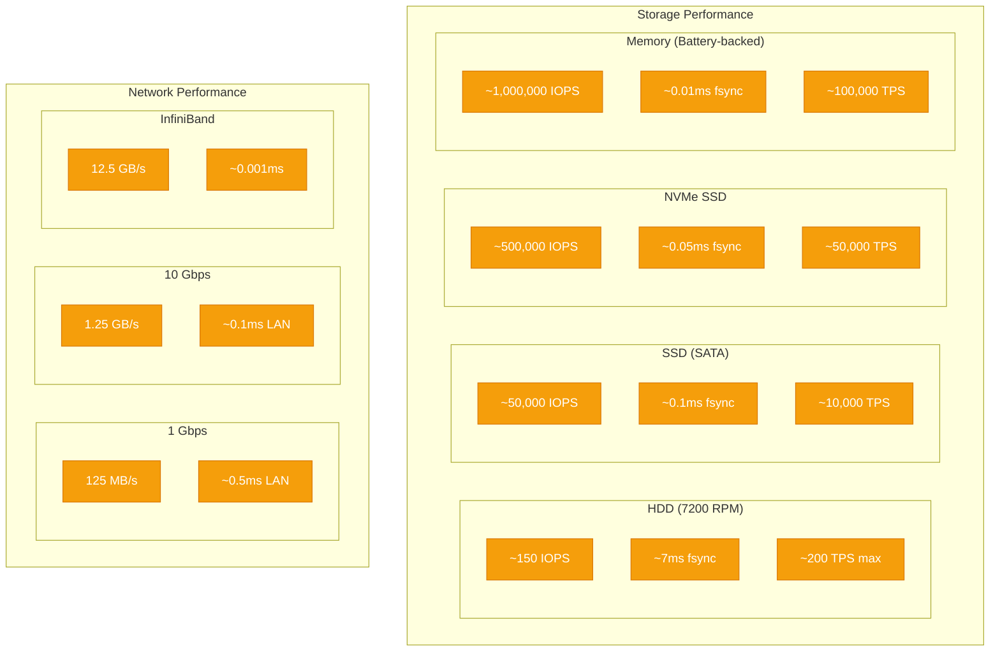
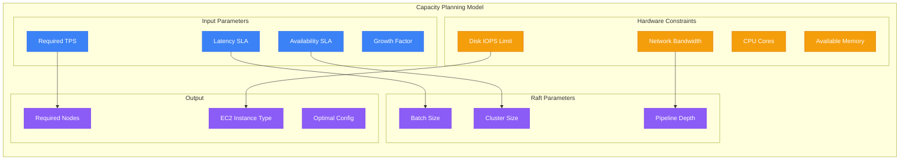

# Raft Performance Analysis

## Throughput vs Latency Tradeoffs

Understanding Raft performance characteristics is crucial for capacity planning and SLA design. The fundamental tradeoff in Raft is between throughput and latency.

### Performance Model

```mermaid
graph TB
    subgraph "Raft Performance Factors"
        subgraph "Network Factors"
            RTT[Network RTT]
            BW[Network Bandwidth]
            JITTER[Network Jitter]
        end

        subgraph "Disk I/O Factors"
            FSYNC[fsync() Latency]
            IOPS[Disk IOPS]
            THROUGHPUT[Disk Throughput]
        end

        subgraph "CPU Factors"
            SERIALIZE[Serialization Cost]
            CRYPTO[Encryption Overhead]
            GC[Garbage Collection]
        end

        subgraph "Algorithm Factors"
            BATCH[Batch Size]
            PIPELINE[Pipeline Depth]
            CLUSTER_SIZE[Cluster Size]
        end
    end

    subgraph "Performance Outcomes"
        COMMIT_LAT[Commit Latency]
        THROUGHPUT_OUT[Transactions/sec]
        AVAILABILITY[Availability %]
    end

    %% Relationships
    RTT --> COMMIT_LAT
    FSYNC --> COMMIT_LAT
    BATCH --> THROUGHPUT_OUT
    PIPELINE --> THROUGHPUT_OUT
    CLUSTER_SIZE --> COMMIT_LAT
    JITTER --> AVAILABILITY

    %% Apply 4-plane colors
    classDef edgeStyle fill:#3B82F6,stroke:#2563EB,color:#fff
    classDef serviceStyle fill:#10B981,stroke:#059669,color:#fff
    classDef stateStyle fill:#F59E0B,stroke:#D97706,color:#fff
    classDef controlStyle fill:#8B5CF6,stroke:#7C3AED,color:#fff

    class RTT,BW,JITTER edgeStyle
    class SERIALIZE,CRYPTO,GC serviceStyle
    class FSYNC,IOPS,THROUGHPUT stateStyle
    class BATCH,PIPELINE,CLUSTER_SIZE,COMMIT_LAT,THROUGHPUT_OUT,AVAILABILITY controlStyle
```

### Latency Breakdown Analysis

```mermaid
gantt
    title Raft Commit Latency Breakdown (typical 5ms total)
    dateFormat X
    axisFormat %s

    section Leader Processing
    Receive Request          :0, 0.2
    Serialize Entry         :0.2, 0.5
    Write to WAL           :0.5, 1.5
    fsync WAL              :1.5, 2.5

    section Network Replication
    Send AppendEntries     :2.5, 2.7
    Network Transit        :2.7, 3.7
    Follower Processing    :3.7, 4.2
    Response Transit       :4.2, 4.7

    section Commit Processing
    Majority Check         :4.7, 4.8
    Apply to State Machine :4.8, 5.0
```



### Performance Benchmarks by Cluster Size



### Batching and Pipelining Optimizations



### Pipeline Depth Optimization



### Hardware Performance Impact



### Real-World Performance Data

```yaml
# Production Performance Measurements
raft_performance_profiles:
  etcd_kubernetes:
    cluster_size: 3
    hardware: "3x c5.2xlarge (8 vCPU, 16GB RAM, gp3 SSD)"
    workload: "Kubernetes API operations"
    measurements:
      write_tps: 8000
      read_tps: 50000
      p50_latency: "2ms"
      p99_latency: "8ms"
      p999_latency: "25ms"

  consul_service_discovery:
    cluster_size: 5
    hardware: "5x m5.large (2 vCPU, 8GB RAM, gp2 SSD)"
    workload: "Service registration/deregistration"
    measurements:
      write_tps: 3000
      read_tps: 20000
      p50_latency: "5ms"
      p99_latency: "15ms"
      p999_latency: "50ms"

  cockroachdb_range:
    cluster_size: 3
    hardware: "3x i3.2xlarge (8 vCPU, 61GB RAM, NVMe SSD)"
    workload: "OLTP transactions"
    measurements:
      write_tps: 12000
      read_tps: 80000
      p50_latency: "3ms"
      p99_latency: "12ms"
      p999_latency: "40ms"
```

### Performance Tuning Parameters

```yaml
# Comprehensive Raft Performance Tuning
raft_tuning:
  # Core timing parameters
  timing:
    heartbeat_interval: "50ms"        # Leader heartbeat frequency
    election_timeout_min: "150ms"     # Minimum election timeout
    election_timeout_max: "300ms"     # Maximum election timeout
    apply_timeout: "1s"               # State machine apply timeout

  # Batching configuration
  batching:
    max_batch_size: 1000              # Max entries per AppendEntries
    max_batch_bytes: "1MB"            # Max bytes per batch
    batch_timeout: "10ms"             # Max time to wait for batch
    enable_batching: true             # Enable batching optimization

  # Pipeline configuration
  pipeline:
    max_inflight: 16                  # Max inflight AppendEntries
    pipeline_buffer_size: 1000        # Pipeline buffer size
    enable_pipeline: true             # Enable pipelining

  # Disk I/O optimization
  storage:
    sync_writes: true                 # Use fsync for WAL
    wal_buffer_size: "64MB"          # WAL buffer size
    wal_segment_size: "64MB"         # WAL segment size
    disable_fsync: false             # NEVER disable in production

  # Network optimization
  network:
    tcp_nodelay: true                # Disable Nagle's algorithm
    tcp_keepalive: true              # Enable TCP keepalive
    compression: "snappy"            # Enable compression
    max_message_size: "10MB"         # Max message size

  # Memory management
  memory:
    log_cache_size: "128MB"          # In-memory log cache
    snapshot_threshold: 10000        # Entries before snapshot
    max_memory_usage: "2GB"          # Max memory for Raft state
```

### Performance Monitoring Queries

```yaml
# Prometheus queries for Raft performance monitoring
prometheus_queries:
  # Throughput metrics
  write_throughput: 'rate(raft_apply_total[5m])'
  read_throughput: 'rate(raft_read_total[5m])'

  # Latency metrics
  commit_latency_p99: 'histogram_quantile(0.99, raft_commit_duration_seconds_bucket)'
  append_latency_p99: 'histogram_quantile(0.99, raft_append_duration_seconds_bucket)'

  # Leader election metrics
  election_frequency: 'increase(raft_leader_elections_total[1h])'
  leadership_changes: 'changes(raft_leader[1h])'

  # Resource utilization
  cpu_usage: 'rate(process_cpu_seconds_total{job="raft"}[5m]) * 100'
  memory_usage: 'process_resident_memory_bytes{job="raft"}'
  disk_usage: 'node_filesystem_avail_bytes{mountpoint="/var/lib/raft"}'

  # Network metrics
  network_latency: 'raft_network_rtt_seconds'
  network_errors: 'rate(raft_network_failures_total[5m])'
```

### Capacity Planning Formula



### Performance Optimization Checklist

#### Hardware Optimization
- [ ] **Storage**: Use NVMe SSDs for WAL, separate from data
- [ ] **Network**: 10Gbps+ for high-throughput clusters
- [ ] **CPU**: Dedicated cores for Raft processing
- [ ] **Memory**: Sufficient RAM for log cache and snapshots

#### Software Optimization
- [ ] **Batching**: Enable with appropriate timeouts
- [ ] **Pipelining**: Configure optimal pipeline depth
- [ ] **Compression**: Enable for network efficiency
- [ ] **Snapshots**: Regular snapshots to bound log size

#### Operational Optimization
- [ ] **Monitoring**: Comprehensive performance dashboards
- [ ] **Alerting**: Proactive alerts on performance degradation
- [ ] **Testing**: Regular performance regression testing
- [ ] **Capacity Planning**: Quarterly capacity reviews

This performance analysis provides the foundation for making informed decisions about Raft cluster sizing, configuration, and optimization strategies.