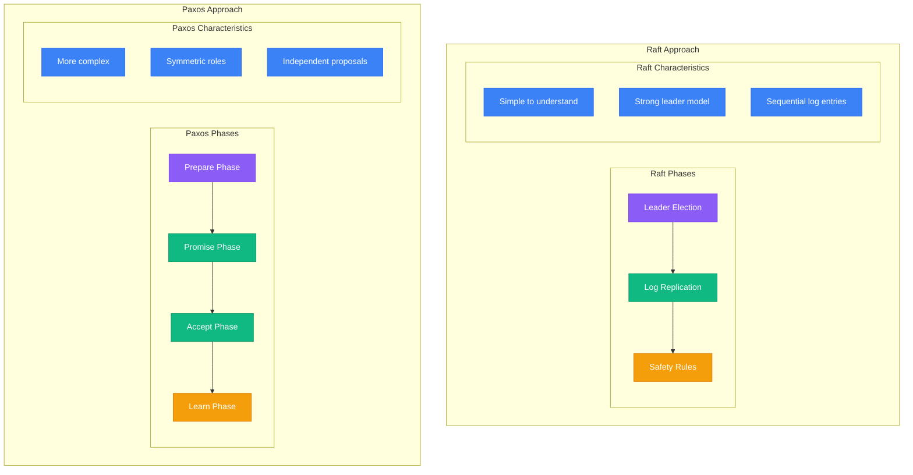
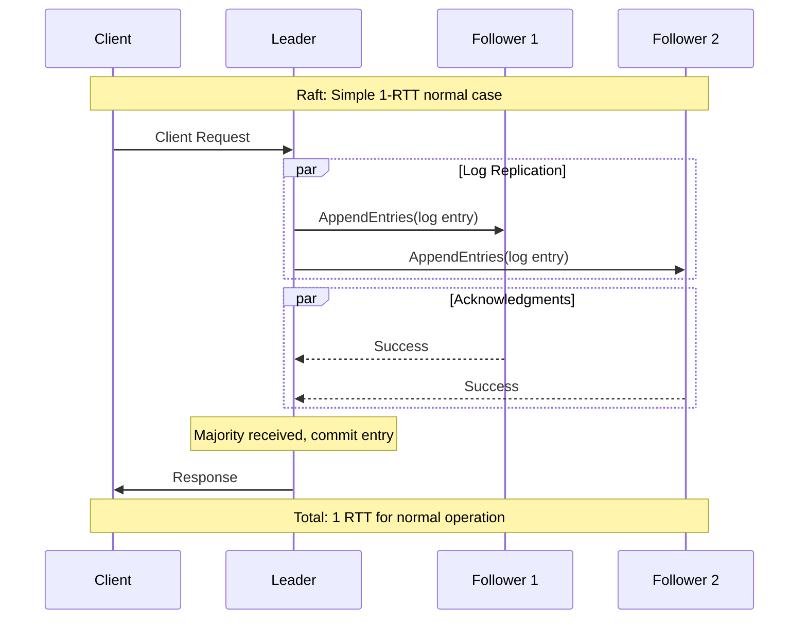
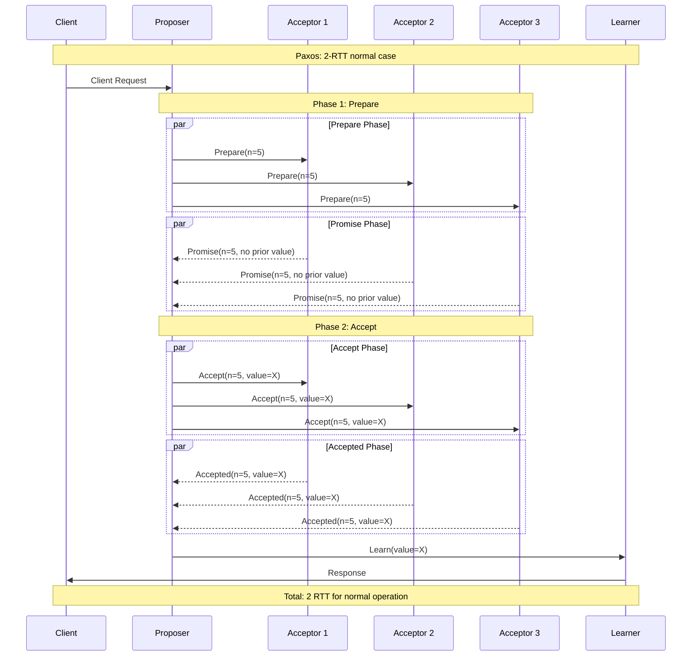
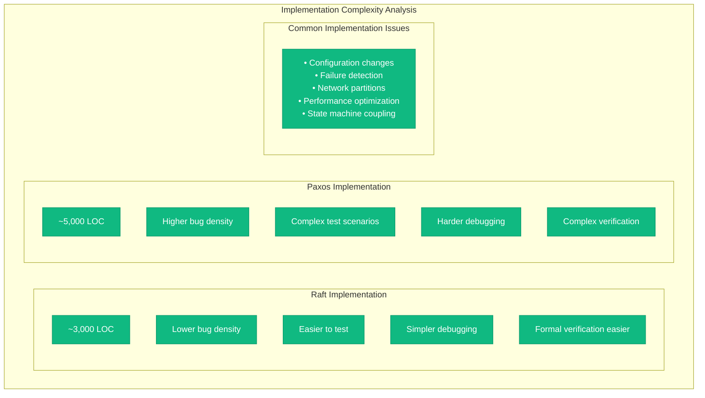
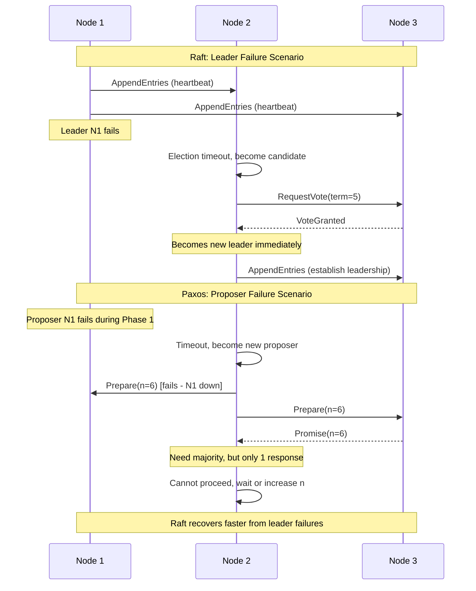
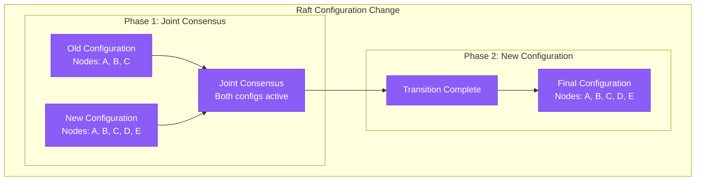

# Raft vs Paxos Comparison

## Algorithmic Differences

Understanding the fundamental differences between Raft and Paxos is crucial for choosing the right consensus algorithm for your distributed system.

### Core Algorithm Comparison



### Message Flow Comparison

#### Raft Normal Operation



#### Paxos Normal Operation



### Performance Benchmarks

```mermaid
graph LR
    subgraph Performance Comparison (3-node cluster)
        subgraph Raft Performance
            R_TPS[15,000 TPS]
            R_LAT[2-5ms p99]
            R_CPU[30% CPU avg]
            R_NET[100 MB/s]
        end

        subgraph Multi-Paxos Performance
            MP_TPS[12,000 TPS]
            MP_LAT[3-8ms p99]
            MP_CPU[40% CPU avg]
            MP_NET[150 MB/s]
        end

        subgraph Basic Paxos Performance
            BP_TPS[6,000 TPS]
            BP_LAT[5-15ms p99]
            BP_CPU[50% CPU avg]
            BP_NET[200 MB/s]
        end

        subgraph Key Factors
            FACTORS[• Leader election overhead<br/>• Message complexity<br/>• CPU for consensus logic<br/>• Network message count]
        end
    end

    R_TPS --> MP_TPS
    MP_TPS --> BP_TPS
    R_LAT --> MP_LAT
    MP_LAT --> BP_LAT

    %% Apply state plane color for metrics
    classDef stateStyle fill:#F59E0B,stroke:#D97706,color:#fff
    class R_TPS,R_LAT,R_CPU,R_NET,MP_TPS,MP_LAT,MP_CPU,MP_NET,BP_TPS,BP_LAT,BP_CPU,BP_NET,FACTORS stateStyle
```

### Implementation Complexity



### Production Usage Comparison

```yaml
# Real-world adoption comparison
production_usage:
  raft_implementations:
    - name: "etcd"
      use_case: "Kubernetes cluster state"
      scale: "Millions of clusters"
      notes: "Production-proven at massive scale"

    - name: "Consul"
      use_case: "Service discovery"
      scale: "Thousands of datacenters"
      notes: "HashiCorp's primary consensus"

    - name: "CockroachDB"
      use_case: "Distributed SQL ranges"
      scale: "Petabyte databases"
      notes: "Per-range Raft groups"

    - name: "TiKV"
      use_case: "Distributed key-value"
      scale: "100+ PB deployments"
      notes: "RocksDB + Raft"

  paxos_implementations:
    - name: "Spanner"
      use_case: "Global distributed database"
      scale: "Google-scale"
      notes: "Paxos for transaction coordination"

    - name: "Megastore"
      use_case: "Structured storage"
      scale: "Google internal"
      notes: "Paxos for entity groups"

    - name: "Chubby"
      use_case: "Lock service"
      scale: "Google infrastructure"
      notes: "Multi-Paxos for coordination"

    - name: "Azure Service Fabric"
      use_case: "Microservices platform"
      scale: "Microsoft cloud"
      notes: "Modified Paxos variant"
```

### Failure Handling Comparison



### Configuration Changes

#### Raft Joint Consensus



#### Paxos Reconfiguration

```mermaid
graph TB
    subgraph Paxos Reconfiguration
        subgraph Challenges
            COORD[Need coordination service]
            GLOBAL[Global knowledge required]
            ATOMIC[Atomic membership change]
        end

        subgraph Solutions
            VERTICAL[Vertical Paxos<br/>(separate reconfiguration)]
            ALPHA[Alpha protocol<br/>(auxiliary master)]
            DYNAMIC[Dynamic Paxos<br/>(complex state machine)]
        end
    end

    COORD --> VERTICAL
    GLOBAL --> ALPHA
    ATOMIC --> DYNAMIC

    %% Apply control plane color
    classDef controlStyle fill:#8B5CF6,stroke:#7C3AED,color:#fff
    class COORD,GLOBAL,ATOMIC,VERTICAL,ALPHA,DYNAMIC controlStyle
```

### When to Choose Each Algorithm

```mermaid
graph LR
    subgraph Decision Matrix
        subgraph Choose Raft When
            R_SIMPLE_REQ[Simplicity is priority]
            R_STRONG_LEAD[Strong leadership model fits]
            R_FAST_DEV[Fast development needed]
            R_MAINTENANCE[Easy maintenance required]
            R_EDUCATION[Team learning curve matters]
        end

        subgraph Choose Paxos When
            P_SYMMETRIC[Symmetric roles needed]
            P_INDEPENDENT[Independent proposals required]
            P_RESEARCH[Research/academic context]
            P_SPECIALIZED[Specialized variants needed]
            P_EXISTING[Existing Paxos infrastructure]
        end

        subgraph Neutral Factors
            PERFORMANCE[Performance (similar)]
            CORRECTNESS[Correctness (both proven)]
            FAULT_TOL[Fault tolerance (equivalent)]
        end
    end

    %% Apply colors based on recommendation
    classDef serviceStyle fill:#10B981,stroke:#059669,color:#fff
    classDef edgeStyle fill:#3B82F6,stroke:#2563EB,color:#fff
    classDef stateStyle fill:#F59E0B,stroke:#D97706,color:#fff

    class R_SIMPLE_REQ,R_STRONG_LEAD,R_FAST_DEV,R_MAINTENANCE,R_EDUCATION serviceStyle
    class P_SYMMETRIC,P_INDEPENDENT,P_RESEARCH,P_SPECIALIZED,P_EXISTING edgeStyle
    class PERFORMANCE,CORRECTNESS,FAULT_TOL stateStyle
```

### Benchmarking Methodology

```yaml
# Standardized benchmark for comparing Raft vs Paxos
benchmark_setup:
  environment:
    instances: "3x c5.2xlarge (8 vCPU, 16GB)"
    network: "10 Gbps, <1ms latency"
    storage: "gp3 SSD, 16,000 IOPS"
    os: "Ubuntu 20.04 LTS"

  test_scenarios:
    - name: "Steady State Performance"
      duration: "10 minutes"
      client_threads: 100
      request_rate: "sustained max"
      metrics: ["tps", "latency_p99", "cpu_usage"]

    - name: "Leader Failure Recovery"
      scenario: "Kill leader during 50% load"
      measure: "Recovery time to full throughput"
      repeat: 10

    - name: "Network Partition"
      scenario: "Isolate minority partition for 30s"
      measure: "Availability degradation"
      repeat: 5

    - name: "Configuration Change"
      scenario: "Add 2 nodes during 25% load"
      measure: "Impact on ongoing operations"
      repeat: 3

  implementation_comparison:
    raft_versions:
      - "etcd v3.5"
      - "Consul v1.12"
      - "Hashicorp Raft v1.3"

    paxos_versions:
      - "libpaxos v3"
      - "OpenReplica"
      - "Custom Multi-Paxos implementation"
```

### Production Lessons Learned

```yaml
# Real-world experience from production deployments
production_insights:
  raft_advantages:
    - "Faster time to production (6 months vs 18 months)"
    - "Fewer consensus-related bugs in production"
    - "Easier debugging during incidents"
    - "Better developer onboarding experience"
    - "More predictable performance characteristics"

  paxos_advantages:
    - "More flexible for specialized use cases"
    - "Better for research and academic work"
    - "Existing optimized implementations (Google)"
    - "Theoretical completeness"

  common_pitfalls:
    - "Network partition handling complexity"
    - "Clock synchronization requirements"
    - "Disk I/O performance criticality"
    - "Configuration change complexity"
    - "Monitoring and alerting challenges"

  recommendations:
    - "Start with Raft unless specific Paxos features needed"
    - "Invest heavily in testing infrastructure"
    - "Plan for configuration changes from day 1"
    - "Monitor consensus metrics closely"
    - "Use proven implementations over custom ones"
```

### Conclusion

While both Raft and Paxos solve the distributed consensus problem with equivalent theoretical guarantees, Raft's simplicity and understandability make it the practical choice for most production systems. Paxos remains valuable for specialized use cases and research contexts where its flexibility outweighs the implementation complexity.