# Load Balancer Failure Scenarios and Recovery

## Overview

Load balancers are critical infrastructure components that can become single points of failure. This guide covers failure scenarios, detection mechanisms, automated recovery strategies, and chaos engineering practices for building resilient load balancing systems.

## Common Load Balancer Failure Scenarios

```mermaid
graph TB
    subgraph FailureTypes[Failure Scenarios]
        LB_FAIL[Load Balancer Failure<br/>• Process crash<br/>• Hardware failure<br/>• Network partition<br/>• Resource exhaustion]
        BACKEND_FAIL[Backend Failures<br/>• Server crash<br/>• Application hang<br/>• Database timeout<br/>• Dependency failure]
        NET_FAIL[Network Failures<br/>• Link failure<br/>• Packet loss<br/>• High latency<br/>• DNS resolution]
        CONFIG_FAIL[Configuration Errors<br/>• Wrong routing rules<br/>• Invalid SSL certs<br/>• Timeout issues<br/>• Weight misconfiguration]
    end

    subgraph Detection[Failure Detection]
        HEALTH[Health Checks<br/>• TCP probes<br/>• HTTP endpoints<br/>• Custom scripts<br/>• Deep health checks]
        METRICS[Metrics Monitoring<br/>• Response times<br/>• Error rates<br/>• Connection counts<br/>• Resource usage]
        LOGS[Log Analysis<br/>• Error patterns<br/>• Performance trends<br/>• Anomaly detection<br/>• Alert correlation]
    end

    subgraph Recovery[Recovery Strategies]
        FAILOVER[Automatic Failover<br/>• Secondary LB<br/>• DNS switchover<br/>• Anycast routing<br/>• Circuit breakers]
        RESTART[Service Restart<br/>• Process restart<br/>• Container restart<br/>• Rolling restart<br/>• Blue-green deploy]
        SCALE[Auto Scaling<br/>• Horizontal scaling<br/>• Vertical scaling<br/>• Load shedding<br/>• Traffic throttling]
        MANUAL[Manual Recovery<br/>• Incident response<br/>• Emergency procedures<br/>• Rollback plans<br/>• Communication]
    end

    LB_FAIL --> HEALTH
    BACKEND_FAIL --> HEALTH
    NET_FAIL --> METRICS
    CONFIG_FAIL --> LOGS

    HEALTH --> FAILOVER
    METRICS --> SCALE
    LOGS --> RESTART
    HEALTH --> MANUAL

    %% Styling
    classDef failure fill:#FFB6C1,stroke:#FF69B4,color:#000
    classDef detection fill:#87CEEB,stroke:#4682B4,color:#000
    classDef recovery fill:#90EE90,stroke:#006400,color:#000

    class LB_FAIL,BACKEND_FAIL,NET_FAIL,CONFIG_FAIL failure
    class HEALTH,METRICS,LOGS detection
    class FAILOVER,RESTART,SCALE,MANUAL recovery
```



## High Availability Load Balancer Architecture

### Active-Passive HA Configuration

```python
import asyncio
import aiohttp
import time
import subprocess
import json
import socket
from typing import Dict, List, Optional, Tuple
from dataclasses import dataclass
from enum import Enum
from datetime import datetime, timedelta

class HAState(Enum):
    PRIMARY = "primary"
    SECONDARY = "secondary"
    FAILOVER = "failover"
    SPLIT_BRAIN = "split_brain"

@dataclass
class HANode:
    node_id: str
    ip_address: str
    priority: int
    state: HAState
    last_heartbeat: datetime
    is_healthy: bool = True

class HighAvailabilityController:
    """High availability controller for load balancer failover"""

    def __init__(self, node_id: str, vip: str, interface: str = "eth0"):
        self.node_id = node_id
        self.virtual_ip = vip
        self.interface = interface
        self.current_state = HAState.SECONDARY
        self.nodes: Dict[str, HANode] = {}
        self.heartbeat_interval = 1.0  # 1 second
        self.failover_timeout = 5.0    # 5 seconds
        self.split_brain_timeout = 10.0  # 10 seconds

        # Failover tracking
        self.last_primary_seen = None
        self.failover_count = 0
        self.in_split_brain_recovery = False

        # Health check configuration
        self.health_checks = {
            'load_balancer_process': self._check_lb_process,
            'virtual_ip_binding': self._check_vip_binding,
            'backend_connectivity': self._check_backend_connectivity,
            'system_resources': self._check_system_resources
        }

    def add_node(self, node: HANode):
        """Add HA node to the cluster"""
        self.nodes[node.node_id] = node
        print(f"Added HA node: {node.node_id} (priority: {node.priority})")

    async def start_ha_controller(self):
        """Start the high availability controller"""
        print(f"Starting HA controller for node {self.node_id}")

        # Start concurrent tasks
        tasks = [
            asyncio.create_task(self._heartbeat_sender()),
            asyncio.create_task(self._heartbeat_monitor()),
            asyncio.create_task(self._health_monitor()),
            asyncio.create_task(self._state_manager())
        ]

        try:
            await asyncio.gather(*tasks)
        except Exception as e:
            print(f"HA controller error: {e}")
        finally:
            await self._cleanup()

    async def _heartbeat_sender(self):
        """Send heartbeat to other nodes"""
        while True:
            try:
                heartbeat_msg = {
                    'node_id': self.node_id,
                    'state': self.current_state.value,
                    'timestamp': datetime.now().isoformat(),
                    'priority': self.nodes.get(self.node_id, HANode('', '', 0, HAState.SECONDARY, datetime.now())).priority,
                    'health_status': await self._get_health_status()
                }

                # Send to all other nodes
                for node_id, node in self.nodes.items():
                    if node_id != self.node_id:
                        await self._send_heartbeat(node.ip_address, heartbeat_msg)

                await asyncio.sleep(self.heartbeat_interval)

            except Exception as e:
                print(f"Heartbeat sender error: {e}")
                await asyncio.sleep(self.heartbeat_interval)

    async def _send_heartbeat(self, target_ip: str, message: Dict):
        """Send heartbeat message to target node"""
        try:
            url = f"http://{target_ip}:8090/heartbeat"
            timeout = aiohttp.ClientTimeout(total=2)

            async with aiohttp.ClientSession(timeout=timeout) as session:
                async with session.post(url, json=message) as response:
                    if response.status == 200:
                        response_data = await response.json()
                        await self._process_heartbeat_response(response_data)

        except Exception as e:
            print(f"Failed to send heartbeat to {target_ip}: {e}")

    async def _process_heartbeat_response(self, response: Dict):
        """Process heartbeat response from other nodes"""
        node_id = response.get('node_id')
        if node_id and node_id in self.nodes:
            node = self.nodes[node_id]
            node.last_heartbeat = datetime.now()
            node.state = HAState(response.get('state', 'secondary'))
            node.is_healthy = response.get('health_status', {}).get('overall') == 'healthy'

    async def _heartbeat_monitor(self):
        """Monitor heartbeats from other nodes"""
        while True:
            try:
                now = datetime.now()

                for node_id, node in self.nodes.items():
                    if node_id == self.node_id:
                        continue

                    # Check if node has missed heartbeats
                    if node.last_heartbeat:
                        time_since_heartbeat = (now - node.last_heartbeat).total_seconds()

                        if time_since_heartbeat > self.failover_timeout:
                            if node.state == HAState.PRIMARY:
                                print(f"Primary node {node_id} missed heartbeat for {time_since_heartbeat:.1f}s")
                                await self._trigger_failover_decision()

                            node.is_healthy = False

                await asyncio.sleep(1.0)

            except Exception as e:
                print(f"Heartbeat monitor error: {e}")
                await asyncio.sleep(1.0)

    async def _health_monitor(self):
        """Monitor local node health"""
        while True:
            try:
                health_status = await self._get_health_status()

                if health_status['overall'] != 'healthy' and self.current_state == HAState.PRIMARY:
                    print("Primary node unhealthy, triggering failover")
                    await self._trigger_graceful_failover()

                await asyncio.sleep(5.0)

            except Exception as e:
                print(f"Health monitor error: {e}")
                await asyncio.sleep(5.0)

    async def _get_health_status(self) -> Dict:
        """Get comprehensive health status"""
        health_results = {}
        overall_healthy = True

        for check_name, check_func in self.health_checks.items():
            try:
                result = await check_func()
                health_results[check_name] = result
                if not result.get('healthy', False):
                    overall_healthy = False
            except Exception as e:
                health_results[check_name] = {'healthy': False, 'error': str(e)}
                overall_healthy = False

        return {
            'overall': 'healthy' if overall_healthy else 'unhealthy',
            'checks': health_results,
            'timestamp': datetime.now().isoformat()
        }

    async def _check_lb_process(self) -> Dict:
        """Check if load balancer process is running"""
        try:
            # Check if nginx/haproxy process is running
            result = subprocess.run(['pgrep', 'nginx'], capture_output=True, text=True)
            process_running = result.returncode == 0

            return {
                'healthy': process_running,
                'process_count': len(result.stdout.strip().split('\n')) if process_running else 0
            }
        except Exception as e:
            return {'healthy': False, 'error': str(e)}

    async def _check_vip_binding(self) -> Dict:
        """Check if virtual IP is bound to interface"""
        try:
            # Check if VIP is bound to interface
            result = subprocess.run(
                ['ip', 'addr', 'show', self.interface],
                capture_output=True, text=True
            )

            vip_bound = self.virtual_ip in result.stdout
            return {'healthy': vip_bound, 'vip_bound': vip_bound}

        except Exception as e:
            return {'healthy': False, 'error': str(e)}

    async def _check_backend_connectivity(self) -> Dict:
        """Check connectivity to backend servers"""
        try:
            # Test connection to backend servers
            backend_servers = ['10.0.1.10:8080', '10.0.1.11:8080', '10.0.1.12:8080']
            healthy_backends = 0

            for backend in backend_servers:
                host, port = backend.split(':')
                try:
                    _, writer = await asyncio.wait_for(
                        asyncio.open_connection(host, int(port)),
                        timeout=2.0
                    )
                    writer.close()
                    await writer.wait_closed()
                    healthy_backends += 1
                except:
                    pass

            connectivity_ratio = healthy_backends / len(backend_servers)
            return {
                'healthy': connectivity_ratio >= 0.5,  # At least 50% backends reachable
                'healthy_backends': healthy_backends,
                'total_backends': len(backend_servers),
                'connectivity_ratio': connectivity_ratio
            }

        except Exception as e:
            return {'healthy': False, 'error': str(e)}

    async def _check_system_resources(self) -> Dict:
        """Check system resource usage"""
        try:
            import psutil

            cpu_percent = psutil.cpu_percent(interval=1)
            memory = psutil.virtual_memory()
            disk = psutil.disk_usage('/')

            # Thresholds for healthy operation
            cpu_healthy = cpu_percent < 90
            memory_healthy = memory.percent < 90
            disk_healthy = disk.percent < 90

            return {
                'healthy': cpu_healthy and memory_healthy and disk_healthy,
                'cpu_percent': cpu_percent,
                'memory_percent': memory.percent,
                'disk_percent': disk.percent
            }

        except Exception as e:
            return {'healthy': False, 'error': str(e)}

    async def _state_manager(self):
        """Manage HA state transitions"""
        while True:
            try:
                await self._evaluate_state_transition()
                await asyncio.sleep(2.0)

            except Exception as e:
                print(f"State manager error: {e}")
                await asyncio.sleep(2.0)

    async def _evaluate_state_transition(self):
        """Evaluate if state transition is needed"""
        current_primary = self._get_current_primary()

        if not current_primary and self.current_state == HAState.SECONDARY:
            # No primary found, check if we should become primary
            if self._should_become_primary():
                await self._transition_to_primary()

        elif current_primary and current_primary.node_id == self.node_id:
            # We are primary, ensure we maintain the role
            if not await self._can_maintain_primary_role():
                await self._transition_to_secondary()

        elif self.current_state == HAState.PRIMARY and current_primary:
            # Split brain scenario - two primaries
            if current_primary.node_id != self.node_id:
                await self._handle_split_brain(current_primary)

    def _get_current_primary(self) -> Optional[HANode]:
        """Get the current primary node"""
        for node in self.nodes.values():
            if node.state == HAState.PRIMARY and node.is_healthy:
                return node
        return None

    def _should_become_primary(self) -> bool:
        """Determine if this node should become primary"""
        # Check if we have the highest priority among healthy nodes
        my_node = self.nodes.get(self.node_id)
        if not my_node or not my_node.is_healthy:
            return False

        for node in self.nodes.values():
            if (node.node_id != self.node_id and
                node.is_healthy and
                node.priority > my_node.priority):
                return False

        return True

    async def _can_maintain_primary_role(self) -> bool:
        """Check if this node can maintain primary role"""
        health_status = await self._get_health_status()
        return health_status['overall'] == 'healthy'

    async def _transition_to_primary(self):
        """Transition to primary state"""
        print(f"Node {self.node_id} transitioning to PRIMARY")

        try:
            # Bind virtual IP
            await self._bind_virtual_ip()

            # Start load balancer services
            await self._start_load_balancer()

            # Update state
            self.current_state = HAState.PRIMARY
            if self.node_id in self.nodes:
                self.nodes[self.node_id].state = HAState.PRIMARY

            print(f"Node {self.node_id} is now PRIMARY")

        except Exception as e:
            print(f"Failed to transition to primary: {e}")
            await self._transition_to_secondary()

    async def _transition_to_secondary(self):
        """Transition to secondary state"""
        print(f"Node {self.node_id} transitioning to SECONDARY")

        try:
            # Unbind virtual IP
            await self._unbind_virtual_ip()

            # Stop load balancer services (optional)
            # await self._stop_load_balancer()

            # Update state
            self.current_state = HAState.SECONDARY
            if self.node_id in self.nodes:
                self.nodes[self.node_id].state = HAState.SECONDARY

            print(f"Node {self.node_id} is now SECONDARY")

        except Exception as e:
            print(f"Failed to transition to secondary: {e}")

    async def _handle_split_brain(self, other_primary: HANode):
        """Handle split brain scenario"""
        print(f"Split brain detected! Other primary: {other_primary.node_id}")

        my_node = self.nodes.get(self.node_id)
        if not my_node:
            await self._transition_to_secondary()
            return

        # Resolve based on priority (higher priority wins)
        if other_primary.priority > my_node.priority:
            print("Other primary has higher priority, stepping down")
            await self._transition_to_secondary()
        elif other_primary.priority < my_node.priority:
            print("We have higher priority, maintaining primary role")
            # Continue as primary
        else:
            # Same priority, use node ID as tiebreaker
            if other_primary.node_id < self.node_id:
                print("Tiebreaker: stepping down based on node ID")
                await self._transition_to_secondary()

    async def _trigger_failover_decision(self):
        """Trigger failover decision process"""
        if self._should_become_primary():
            print("Triggering failover - becoming primary")
            await self._transition_to_primary()

    async def _trigger_graceful_failover(self):
        """Trigger graceful failover"""
        print("Initiating graceful failover")
        await self._transition_to_secondary()

    async def _bind_virtual_ip(self):
        """Bind virtual IP to interface"""
        try:
            cmd = ['sudo', 'ip', 'addr', 'add', f'{self.virtual_ip}/24', 'dev', self.interface]
            result = subprocess.run(cmd, capture_output=True, text=True)

            if result.returncode != 0 and "File exists" not in result.stderr:
                raise Exception(f"Failed to bind VIP: {result.stderr}")

            print(f"Virtual IP {self.virtual_ip} bound to {self.interface}")

        except Exception as e:
            print(f"Error binding virtual IP: {e}")
            raise

    async def _unbind_virtual_ip(self):
        """Unbind virtual IP from interface"""
        try:
            cmd = ['sudo', 'ip', 'addr', 'del', f'{self.virtual_ip}/24', 'dev', self.interface]
            result = subprocess.run(cmd, capture_output=True, text=True)

            if result.returncode != 0 and "Cannot assign" not in result.stderr:
                print(f"Warning: Failed to unbind VIP: {result.stderr}")

            print(f"Virtual IP {self.virtual_ip} unbound from {self.interface}")

        except Exception as e:
            print(f"Error unbinding virtual IP: {e}")

    async def _start_load_balancer(self):
        """Start load balancer service"""
        try:
            # Start nginx (or your load balancer)
            result = subprocess.run(['sudo', 'systemctl', 'start', 'nginx'], capture_output=True, text=True)

            if result.returncode != 0:
                raise Exception(f"Failed to start nginx: {result.stderr}")

            print("Load balancer service started")

        except Exception as e:
            print(f"Error starting load balancer: {e}")
            raise

    async def _cleanup(self):
        """Cleanup resources"""
        if self.current_state == HAState.PRIMARY:
            await self._unbind_virtual_ip()

# Circuit Breaker for Backend Protection
class CircuitBreaker:
    """Circuit breaker for protecting backends from cascading failures"""

    def __init__(self, failure_threshold: int = 5, recovery_timeout: int = 60):
        self.failure_threshold = failure_threshold
        self.recovery_timeout = recovery_timeout
        self.failure_count = 0
        self.last_failure_time = None
        self.state = 'CLOSED'  # CLOSED, OPEN, HALF_OPEN

    async def call(self, func, *args, **kwargs):
        """Execute function through circuit breaker"""
        if self.state == 'OPEN':
            if self._should_attempt_reset():
                self.state = 'HALF_OPEN'
            else:
                raise Exception("Circuit breaker is OPEN")

        try:
            result = await func(*args, **kwargs)
            self._on_success()
            return result

        except Exception as e:
            self._on_failure()
            raise e

    def _should_attempt_reset(self) -> bool:
        """Check if enough time has passed to attempt reset"""
        if self.last_failure_time is None:
            return True
        return time.time() - self.last_failure_time >= self.recovery_timeout

    def _on_success(self):
        """Handle successful call"""
        self.failure_count = 0
        self.state = 'CLOSED'

    def _on_failure(self):
        """Handle failed call"""
        self.failure_count += 1
        self.last_failure_time = time.time()

        if self.failure_count >= self.failure_threshold:
            self.state = 'OPEN'

# Chaos Engineering for Load Balancer Testing
class ChaosEngineer:
    """Chaos engineering tools for testing load balancer resilience"""

    def __init__(self):
        self.chaos_scenarios = {
            'kill_backend': self._chaos_kill_backend,
            'network_partition': self._chaos_network_partition,
            'high_latency': self._chaos_high_latency,
            'memory_pressure': self._chaos_memory_pressure,
            'disk_full': self._chaos_disk_full
        }

    async def run_chaos_scenario(self, scenario: str, duration: int = 60):
        """Run a chaos engineering scenario"""
        if scenario not in self.chaos_scenarios:
            raise ValueError(f"Unknown chaos scenario: {scenario}")

        print(f"Starting chaos scenario: {scenario} for {duration} seconds")

        try:
            # Start chaos
            cleanup_func = await self.chaos_scenarios[scenario]()

            # Wait for duration
            await asyncio.sleep(duration)

            # Cleanup
            if cleanup_func:
                await cleanup_func()

            print(f"Chaos scenario {scenario} completed")

        except Exception as e:
            print(f"Chaos scenario {scenario} failed: {e}")

    async def _chaos_kill_backend(self):
        """Kill random backend server"""
        backend_containers = ['backend-01', 'backend-02', 'backend-03']
        import random
        target = random.choice(backend_containers)

        print(f"Chaos: Killing backend container {target}")

        # Kill container
        subprocess.run(['docker', 'kill', target], capture_output=True)

        # Return cleanup function
        async def cleanup():
            print(f"Chaos cleanup: Restarting {target}")
            subprocess.run(['docker', 'start', target], capture_output=True)

        return cleanup

    async def _chaos_network_partition(self):
        """Simulate network partition"""
        print("Chaos: Creating network partition")

        # Block traffic to specific subnet
        subprocess.run([
            'sudo', 'iptables', '-A', 'OUTPUT',
            '-d', '10.0.1.0/24', '-j', 'DROP'
        ], capture_output=True)

        async def cleanup():
            print("Chaos cleanup: Removing network partition")
            subprocess.run([
                'sudo', 'iptables', '-D', 'OUTPUT',
                '-d', '10.0.1.0/24', '-j', 'DROP'
            ], capture_output=True)

        return cleanup

    async def _chaos_high_latency(self):
        """Inject network latency"""
        print("Chaos: Injecting high latency")

        # Add 500ms delay
        subprocess.run([
            'sudo', 'tc', 'qdisc', 'add', 'dev', 'eth0',
            'root', 'netem', 'delay', '500ms'
        ], capture_output=True)

        async def cleanup():
            print("Chaos cleanup: Removing latency")
            subprocess.run([
                'sudo', 'tc', 'qdisc', 'del', 'dev', 'eth0', 'root'
            ], capture_output=True)

        return cleanup

    async def _chaos_memory_pressure(self):
        """Create memory pressure"""
        print("Chaos: Creating memory pressure")

        # Start memory stress process
        process = subprocess.Popen([
            'stress', '--vm', '2', '--vm-bytes', '1G', '--timeout', '60s'
        ])

        async def cleanup():
            print("Chaos cleanup: Stopping memory stress")
            process.terminate()

        return cleanup

    async def _chaos_disk_full(self):
        """Fill up disk space"""
        print("Chaos: Filling disk space")

        # Create large file
        subprocess.run([
            'fallocate', '-l', '1G', '/tmp/chaos-disk-fill'
        ], capture_output=True)

        async def cleanup():
            print("Chaos cleanup: Removing large file")
            subprocess.run(['rm', '-f', '/tmp/chaos-disk-fill'], capture_output=True)

        return cleanup

# Example usage
async def main():
    # Setup HA nodes
    node1 = HANode("node-01", "10.0.0.10", priority=100, state=HAState.SECONDARY, last_heartbeat=datetime.now())
    node2 = HANode("node-02", "10.0.0.11", priority=90, state=HAState.SECONDARY, last_heartbeat=datetime.now())

    # Create HA controller
    ha_controller = HighAvailabilityController("node-01", "10.0.0.100")
    ha_controller.add_node(node1)
    ha_controller.add_node(node2)

    # Chaos engineer
    chaos = ChaosEngineer()

    # Start HA controller in background
    ha_task = asyncio.create_task(ha_controller.start_ha_controller())

    # Run chaos scenarios
    await asyncio.sleep(10)  # Let HA stabilize

    # Test scenarios
    scenarios = ['kill_backend', 'high_latency', 'memory_pressure']

    for scenario in scenarios:
        print(f"\n{'='*50}")
        print(f"Testing scenario: {scenario}")
        print(f"{'='*50}")

        await chaos.run_chaos_scenario(scenario, duration=30)
        await asyncio.sleep(30)  # Recovery time

    # Cleanup
    ha_task.cancel()

if __name__ == "__main__":
    asyncio.run(main())
```

## Emergency Procedures and Runbooks

### Load Balancer Emergency Response

```bash
#!/bin/bash
# lb-emergency-response.sh - Emergency response procedures for load balancer failures

set -euo pipefail

# Configuration
LB_NODES=("10.0.0.10" "10.0.0.11")
VIP="10.0.0.100"
BACKEND_SERVERS=("10.0.1.10:8080" "10.0.1.11:8080" "10.0.1.12:8080")
SLACK_WEBHOOK_URL="${SLACK_WEBHOOK_URL:-}"
PAGERDUTY_API_KEY="${PAGERDUTY_API_KEY:-}"

# Logging
log() {
    echo "[$(date '+%Y-%m-%d %H:%M:%S')] $*" | tee -a /var/log/lb-emergency.log
}

error() {
    echo "[$(date '+%Y-%m-%d %H:%M:%S')] ERROR: $*" | tee -a /var/log/lb-emergency.log >&2
}

# Health check functions
check_lb_health() {
    local node=$1
    local timeout=${2:-5}

    log "Checking health of load balancer node: $node"

    # Check if load balancer is responding
    if timeout $timeout curl -f -s "http://$node/health" > /dev/null 2>&1; then
        log "✅ Load balancer $node is healthy"
        return 0
    else
        log "❌ Load balancer $node is unhealthy"
        return 1
    fi
}

check_vip_binding() {
    local expected_node=$1

    log "Checking VIP binding: $VIP should be on $expected_node"

    # Check which node has the VIP
    for node in "${LB_NODES[@]}"; do
        if ssh -o ConnectTimeout=5 "$node" "ip addr show | grep -q $VIP" 2>/dev/null; then
            if [ "$node" = "$expected_node" ]; then
                log "✅ VIP $VIP is correctly bound to $node"
                return 0
            else
                log "⚠️ VIP $VIP is bound to $node instead of $expected_node"
                return 2  # Wrong node
            fi
        fi
    done

    log "❌ VIP $VIP is not bound to any node"
    return 1
}

check_backend_health() {
    local healthy_count=0
    local total_count=${#BACKEND_SERVERS[@]}

    log "Checking backend server health"

    for backend in "${BACKEND_SERVERS[@]}"; do
        local host=$(echo "$backend" | cut -d: -f1)
        local port=$(echo "$backend" | cut -d: -f2)

        if timeout 3 bash -c "</dev/tcp/$host/$port" 2>/dev/null; then
            log "✅ Backend $backend is healthy"
            ((healthy_count++))
        else
            log "❌ Backend $backend is unhealthy"
        fi
    done

    local health_ratio=$((healthy_count * 100 / total_count))
    log "Backend health: $healthy_count/$total_count healthy ($health_ratio%)"

    if [ $health_ratio -ge 50 ]; then
        return 0  # Acceptable
    else
        return 1  # Critical
    fi
}

# Emergency response procedures
emergency_failover() {
    local failed_node=$1
    local backup_node=$2

    log "🚨 EMERGENCY FAILOVER: $failed_node -> $backup_node"

    # Send alert
    send_alert "EMERGENCY" "Load balancer failover in progress: $failed_node -> $backup_node"

    # Stop services on failed node (if accessible)
    log "Stopping services on failed node: $failed_node"
    ssh -o ConnectTimeout=5 "$failed_node" "sudo systemctl stop nginx; sudo ip addr del $VIP/24 dev eth0" 2>/dev/null || {
        log "⚠️ Could not gracefully stop services on $failed_node"
    }

    # Start services on backup node
    log "Starting services on backup node: $backup_node"
    if ssh -o ConnectTimeout=10 "$backup_node" "
        sudo ip addr add $VIP/24 dev eth0 2>/dev/null || true
        sudo systemctl start nginx
        sudo systemctl enable nginx
    "; then
        log "✅ Services started on backup node: $backup_node"

        # Verify failover
        sleep 5
        if check_lb_health "$backup_node" && check_vip_binding "$backup_node"; then
            log "✅ Failover completed successfully"
            send_alert "RESOLVED" "Load balancer failover completed: Active node is now $backup_node"
            return 0
        else
            log "❌ Failover verification failed"
            return 1
        fi
    else
        log "❌ Failed to start services on backup node"
        return 1
    fi
}

manual_traffic_drain() {
    local node=$1
    local drain_time=${2:-300}  # 5 minutes default

    log "🔄 MANUAL TRAFFIC DRAIN: $node for $drain_time seconds"

    # Gradually reduce weight in load balancer
    local steps=10
    local step_time=$((drain_time / steps))

    for i in $(seq $steps -1 1); do
        local weight=$((i * 10))
        log "Setting weight to $weight% for $node"

        # Update nginx upstream weight (requires nginx-plus or custom solution)
        # This is a placeholder - implement based on your load balancer
        ssh "$node" "echo 'server 127.0.0.1:8080 weight=$weight;' > /tmp/weight_update" || true

        sleep $step_time
    done

    log "Traffic drain completed for $node"
}

emergency_backend_isolation() {
    local failed_backend=$1

    log "🚨 ISOLATING FAILED BACKEND: $failed_backend"

    # Remove from all load balancers
    for node in "${LB_NODES[@]}"; do
        log "Removing $failed_backend from load balancer $node"

        # Update nginx configuration (implementation depends on your setup)
        ssh "$node" "
            sudo sed -i '/server $failed_backend/s/^/#/' /etc/nginx/conf.d/upstream.conf
            sudo nginx -t && sudo systemctl reload nginx
        " || {
            error "Failed to remove $failed_backend from $node"
        }
    done

    send_alert "WARNING" "Backend $failed_backend has been isolated from traffic"
}

emergency_scale_out() {
    local emergency_backends=("10.0.1.20:8080" "10.0.1.21:8080")

    log "🚨 EMERGENCY SCALE OUT: Adding emergency backend capacity"

    for backend in "${emergency_backends[@]}"; do
        local host=$(echo "$backend" | cut -d: -f1)
        local port=$(echo "$backend" | cut -d: -f2)

        log "Activating emergency backend: $backend"

        # Start emergency backend
        ssh "$host" "
            sudo docker run -d --name emergency-backend -p $port:8080 \
                --restart unless-stopped \
                your-app:latest
        " || {
            error "Failed to start emergency backend on $host"
            continue
        }

        # Add to load balancers
        for node in "${LB_NODES[@]}"; do
            ssh "$node" "
                echo 'server $backend weight=5 max_fails=2 fail_timeout=30s;' >> /etc/nginx/conf.d/upstream.conf
                sudo nginx -t && sudo systemctl reload nginx
            " || {
                error "Failed to add emergency backend to $node"
            }
        done

        # Verify backend health
        sleep 10
        if timeout 5 bash -c "</dev/tcp/$host/$port" 2>/dev/null; then
            log "✅ Emergency backend $backend is healthy and serving traffic"
        else
            error "Emergency backend $backend failed health check"
        fi
    done

    send_alert "INFO" "Emergency scale-out completed: Added ${#emergency_backends[@]} backends"
}

# Automated recovery procedures
auto_recovery_backend() {
    local failed_backend=$1
    local max_attempts=3

    log "🔄 AUTO RECOVERY: Attempting to recover $failed_backend"

    for attempt in $(seq 1 $max_attempts); do
        log "Recovery attempt $attempt/$max_attempts for $failed_backend"

        local host=$(echo "$failed_backend" | cut -d: -f1)
        local port=$(echo "$failed_backend" | cut -d: -f2)

        # Restart backend service
        ssh "$host" "
            sudo systemctl restart your-app
            sleep 5
        " || {
            error "Failed to restart service on $host"
            continue
        }

        # Health check
        sleep 10
        if timeout 5 bash -c "</dev/tcp/$host/$port" 2>/dev/null; then
            log "✅ Backend $failed_backend recovered after $attempt attempts"

            # Re-add to load balancers
            for node in "${LB_NODES[@]}"; do
                ssh "$node" "
                    sudo sed -i '/server $failed_backend/s/^#//' /etc/nginx/conf.d/upstream.conf
                    sudo nginx -t && sudo systemctl reload nginx
                "
            done

            send_alert "RESOLVED" "Backend $failed_backend has been automatically recovered"
            return 0
        fi

        log "Recovery attempt $attempt failed, waiting before retry..."
        sleep 30
    done

    error "Auto recovery failed for $failed_backend after $max_attempts attempts"
    send_alert "CRITICAL" "Auto recovery failed for $failed_backend - manual intervention required"
    return 1
}

# Monitoring and alerting
send_alert() {
    local severity=$1
    local message=$2
    local timestamp=$(date '+%Y-%m-%d %H:%M:%S')

    # Slack notification
    if [ -n "$SLACK_WEBHOOK_URL" ]; then
        curl -X POST -H 'Content-type: application/json' \
            --data "{\"text\":\"[$severity] Load Balancer Alert\\n$message\\nTime: $timestamp\"}" \
            "$SLACK_WEBHOOK_URL" 2>/dev/null || true
    fi

    # PagerDuty notification for critical alerts
    if [ -n "$PAGERDUTY_API_KEY" ] && [ "$severity" = "CRITICAL" ]; then
        curl -X POST \
            -H "Authorization: Token token=$PAGERDUTY_API_KEY" \
            -H "Content-Type: application/json" \
            -d "{
                \"incident\": {
                    \"type\": \"incident\",
                    \"title\": \"Load Balancer Critical Alert\",
                    \"service\": {\"id\": \"YOUR_SERVICE_ID\", \"type\": \"service_reference\"},
                    \"body\": {\"type\": \"incident_body\", \"details\": \"$message\"}
                }
            }" \
            "https://api.pagerduty.com/incidents" 2>/dev/null || true
    fi

    log "Alert sent: [$severity] $message"
}

continuous_monitoring() {
    log "Starting continuous monitoring..."

    while true; do
        local issues_found=false

        # Check load balancer nodes
        for node in "${LB_NODES[@]}"; do
            if ! check_lb_health "$node"; then
                issues_found=true
                # Try to failover to other node
                for backup_node in "${LB_NODES[@]}"; do
                    if [ "$backup_node" != "$node" ] && check_lb_health "$backup_node"; then
                        emergency_failover "$node" "$backup_node"
                        break
                    fi
                done
            fi
        done

        # Check VIP binding
        primary_node="${LB_NODES[0]}"
        if ! check_vip_binding "$primary_node"; then
            issues_found=true
            # Try to bind VIP to primary
            ssh "$primary_node" "sudo ip addr add $VIP/24 dev eth0 2>/dev/null || true"
        fi

        # Check backend health
        if ! check_backend_health; then
            issues_found=true
            # Try to recover failed backends
            for backend in "${BACKEND_SERVERS[@]}"; do
                local host=$(echo "$backend" | cut -d: -f1)
                local port=$(echo "$backend" | cut -d: -f2)

                if ! timeout 3 bash -c "</dev/tcp/$host/$port" 2>/dev/null; then
                    auto_recovery_backend "$backend" &
                fi
            done
        fi

        if ! $issues_found; then
            log "All systems healthy"
        fi

        sleep 30
    done
}

# Main emergency response handler
emergency_response() {
    local incident_type=$1
    shift
    local args=("$@")

    log "🚨 EMERGENCY RESPONSE ACTIVATED: $incident_type"

    case "$incident_type" in
        "lb_failure")
            emergency_failover "${args[0]}" "${args[1]}"
            ;;
        "backend_failure")
            emergency_backend_isolation "${args[0]}"
            auto_recovery_backend "${args[0]}"
            ;;
        "capacity_overload")
            emergency_scale_out
            ;;
        "network_partition")
            log "Network partition detected - manual intervention required"
            send_alert "CRITICAL" "Network partition detected - check network infrastructure"
            ;;
        "monitor")
            continuous_monitoring
            ;;
        *)
            error "Unknown incident type: $incident_type"
            echo "Usage: $0 {lb_failure|backend_failure|capacity_overload|network_partition|monitor} [args...]"
            exit 1
            ;;
    esac
}

# Script entry point
if [ $# -eq 0 ]; then
    echo "Load Balancer Emergency Response System"
    echo "Usage: $0 {lb_failure <failed_node> <backup_node>|backend_failure <backend>|capacity_overload|network_partition|monitor}"
    exit 1
fi

emergency_response "$@"
```

## Chaos Engineering Test Suite

### Automated Chaos Testing

```python
#!/usr/bin/env python3
"""
Comprehensive chaos engineering test suite for load balancers
"""

import asyncio
import random
import time
import subprocess
import json
from dataclasses import dataclass
from typing import List, Dict, Any
from datetime import datetime, timedelta

@dataclass
class ChaosExperiment:
    name: str
    description: str
    duration: int
    expected_impact: str
    recovery_time: int
    blast_radius: str

class LoadBalancerChaosTestSuite:
    """Comprehensive chaos testing for load balancer resilience"""

    def __init__(self):
        self.experiments = [
            ChaosExperiment(
                name="primary_lb_failure",
                description="Kill primary load balancer node",
                duration=60,
                expected_impact="Traffic should failover to secondary LB within 10s",
                recovery_time=30,
                blast_radius="Load balancer layer"
            ),
            ChaosExperiment(
                name="cascade_backend_failure",
                description="Progressively kill backend servers",
                duration=120,
                expected_impact="Load should redistribute to healthy backends",
                recovery_time=60,
                blast_radius="Backend application layer"
            ),
            ChaosExperiment(
                name="network_partition",
                description="Partition network between LB and backends",
                duration=90,
                expected_impact="Health checks should fail, traffic should stop",
                recovery_time=30,
                blast_radius="Network connectivity"
            ),
            ChaosExperiment(
                name="ssl_certificate_expiry",
                description="Expire SSL certificates",
                duration=60,
                expected_impact="HTTPS traffic should fail gracefully",
                recovery_time=120,
                blast_radius="SSL/TLS layer"
            ),
            ChaosExperiment(
                name="memory_exhaustion",
                description="Exhaust memory on load balancer",
                duration=90,
                expected_impact="LB should trigger OOM protection or failover",
                recovery_time=60,
                blast_radius="Load balancer resources"
            ),
            ChaosExperiment(
                name="dns_resolution_failure",
                description="Break DNS resolution for backend discovery",
                duration=60,
                expected_impact="Static backend IPs should continue working",
                recovery_time=30,
                blast_radius="DNS resolution"
            )
        ]

        self.results = {}
        self.baseline_metrics = {}

    async def run_full_test_suite(self):
        """Run the complete chaos engineering test suite"""
        print("🧪 Starting Load Balancer Chaos Engineering Test Suite")
        print("=" * 60)

        # Collect baseline metrics
        await self._collect_baseline_metrics()

        # Run experiments
        for experiment in self.experiments:
            print(f"\n🔬 Running experiment: {experiment.name}")
            print(f"Description: {experiment.description}")
            print(f"Expected impact: {experiment.expected_impact}")
            print(f"Duration: {experiment.duration}s")

            result = await self._run_experiment(experiment)
            self.results[experiment.name] = result

            # Recovery period
            print(f"💤 Recovery period: {experiment.recovery_time}s")
            await asyncio.sleep(experiment.recovery_time)

        # Generate report
        await self._generate_chaos_report()

    async def _collect_baseline_metrics(self):
        """Collect baseline performance metrics"""
        print("📊 Collecting baseline metrics...")

        self.baseline_metrics = {
            'response_time_p95': await self._measure_response_time_p95(),
            'error_rate': await self._measure_error_rate(),
            'throughput_rps': await self._measure_throughput(),
            'backend_health_ratio': await self._measure_backend_health(),
            'lb_cpu_usage': await self._measure_lb_cpu_usage(),
            'lb_memory_usage': await self._measure_lb_memory_usage()
        }

        print(f"Baseline metrics: {json.dumps(self.baseline_metrics, indent=2)}")

    async def _run_experiment(self, experiment: ChaosExperiment) -> Dict[str, Any]:
        """Run a single chaos experiment"""
        start_time = time.time()

        # Pre-experiment metrics
        pre_metrics = await self._collect_current_metrics()

        # Execute chaos
        cleanup_func = await self._execute_chaos(experiment.name)

        # Monitor during chaos
        chaos_metrics = []
        monitoring_interval = 10
        monitoring_duration = experiment.duration

        for i in range(0, monitoring_duration, monitoring_interval):
            await asyncio.sleep(monitoring_interval)
            current_metrics = await self._collect_current_metrics()
            chaos_metrics.append({
                'timestamp': time.time(),
                'metrics': current_metrics
            })

        # Cleanup chaos
        if cleanup_func:
            await cleanup_func()

        # Post-experiment metrics
        await asyncio.sleep(30)  # Allow stabilization
        post_metrics = await self._collect_current_metrics()

        # Calculate results
        result = {
            'experiment': experiment.name,
            'start_time': start_time,
            'duration': experiment.duration,
            'pre_metrics': pre_metrics,
            'chaos_metrics': chaos_metrics,
            'post_metrics': post_metrics,
            'impact_analysis': await self._analyze_impact(pre_metrics, chaos_metrics, post_metrics),
            'recovery_time': await self._calculate_recovery_time(chaos_metrics, post_metrics),
            'blast_radius_confirmed': await self._verify_blast_radius(experiment, chaos_metrics)
        }

        return result

    async def _execute_chaos(self, experiment_name: str):
        """Execute specific chaos experiment"""
        if experiment_name == "primary_lb_failure":
            return await self._chaos_kill_primary_lb()
        elif experiment_name == "cascade_backend_failure":
            return await self._chaos_cascade_backend_failure()
        elif experiment_name == "network_partition":
            return await self._chaos_network_partition()
        elif experiment_name == "ssl_certificate_expiry":
            return await self._chaos_ssl_expiry()
        elif experiment_name == "memory_exhaustion":
            return await self._chaos_memory_exhaustion()
        elif experiment_name == "dns_resolution_failure":
            return await self._chaos_dns_failure()
        else:
            raise ValueError(f"Unknown experiment: {experiment_name}")

    async def _chaos_kill_primary_lb(self):
        """Kill primary load balancer"""
        print("💀 Killing primary load balancer")
        subprocess.run(['docker', 'kill', 'lb-primary'], capture_output=True)

        async def cleanup():
            print("🔄 Restarting primary load balancer")
            subprocess.run(['docker', 'start', 'lb-primary'], capture_output=True)

        return cleanup

    async def _chaos_cascade_backend_failure(self):
        """Progressively kill backend servers"""
        backends = ['backend-01', 'backend-02', 'backend-03']
        killed_backends = []

        async def kill_next_backend():
            if backends:
                backend = backends.pop(0)
                print(f"💀 Killing backend: {backend}")
                subprocess.run(['docker', 'kill', backend], capture_output=True)
                killed_backends.append(backend)
                # Schedule next kill
                if backends:
                    asyncio.create_task(asyncio.sleep(30).then(kill_next_backend))

        await kill_next_backend()

        async def cleanup():
            for backend in killed_backends:
                print(f"🔄 Restarting backend: {backend}")
                subprocess.run(['docker', 'start', backend], capture_output=True)

        return cleanup

    async def _chaos_network_partition(self):
        """Create network partition"""
        print("🌐 Creating network partition")
        subprocess.run([
            'sudo', 'iptables', '-A', 'INPUT',
            '-s', '10.0.1.0/24', '-j', 'DROP'
        ], capture_output=True)

        async def cleanup():
            print("🔄 Removing network partition")
            subprocess.run([
                'sudo', 'iptables', '-D', 'INPUT',
                '-s', '10.0.1.0/24', '-j', 'DROP'
            ], capture_output=True)

        return cleanup

    async def _chaos_ssl_expiry(self):
        """Simulate SSL certificate expiry"""
        print("🔒 Simulating SSL certificate expiry")
        # Replace valid cert with expired cert
        subprocess.run([
            'sudo', 'cp', '/etc/ssl/certs/expired.crt',
            '/etc/ssl/certs/server.crt'
        ], capture_output=True)
        subprocess.run(['sudo', 'systemctl', 'reload', 'nginx'], capture_output=True)

        async def cleanup():
            print("🔄 Restoring valid SSL certificate")
            subprocess.run([
                'sudo', 'cp', '/etc/ssl/certs/valid.crt',
                '/etc/ssl/certs/server.crt'
            ], capture_output=True)
            subprocess.run(['sudo', 'systemctl', 'reload', 'nginx'], capture_output=True)

        return cleanup

    async def _chaos_memory_exhaustion(self):
        """Exhaust memory on load balancer"""
        print("🧠 Exhausting memory on load balancer")
        process = subprocess.Popen([
            'stress', '--vm', '4', '--vm-bytes', '2G', '--timeout', '120s'
        ])

        async def cleanup():
            print("🔄 Stopping memory stress")
            process.terminate()

        return cleanup

    async def _chaos_dns_failure(self):
        """Break DNS resolution"""
        print("🔍 Breaking DNS resolution")
        subprocess.run([
            'sudo', 'iptables', '-A', 'OUTPUT',
            '-p', 'udp', '--dport', '53', '-j', 'DROP'
        ], capture_output=True)

        async def cleanup():
            print("🔄 Restoring DNS resolution")
            subprocess.run([
                'sudo', 'iptables', '-D', 'OUTPUT',
                '-p', 'udp', '--dport', '53', '-j', 'DROP'
            ], capture_output=True)

        return cleanup

    async def _collect_current_metrics(self) -> Dict[str, float]:
        """Collect current system metrics"""
        return {
            'response_time_p95': await self._measure_response_time_p95(),
            'error_rate': await self._measure_error_rate(),
            'throughput_rps': await self._measure_throughput(),
            'backend_health_ratio': await self._measure_backend_health(),
            'lb_cpu_usage': await self._measure_lb_cpu_usage(),
            'lb_memory_usage': await self._measure_lb_memory_usage()
        }

    async def _measure_response_time_p95(self) -> float:
        """Measure 95th percentile response time"""
        # Simulate response time measurement
        return random.uniform(50, 200)

    async def _measure_error_rate(self) -> float:
        """Measure error rate percentage"""
        return random.uniform(0, 5)

    async def _measure_throughput(self) -> float:
        """Measure requests per second"""
        return random.uniform(1000, 5000)

    async def _measure_backend_health(self) -> float:
        """Measure ratio of healthy backends"""
        return random.uniform(0.5, 1.0)

    async def _measure_lb_cpu_usage(self) -> float:
        """Measure load balancer CPU usage"""
        return random.uniform(20, 80)

    async def _measure_lb_memory_usage(self) -> float:
        """Measure load balancer memory usage"""
        return random.uniform(30, 70)

    async def _analyze_impact(self, pre_metrics: Dict, chaos_metrics: List, post_metrics: Dict) -> Dict:
        """Analyze impact of chaos experiment"""
        # Calculate maximum degradation during chaos
        max_response_time = max(m['metrics']['response_time_p95'] for m in chaos_metrics)
        max_error_rate = max(m['metrics']['error_rate'] for m in chaos_metrics)
        min_throughput = min(m['metrics']['throughput_rps'] for m in chaos_metrics)

        return {
            'max_response_time_increase': max_response_time - pre_metrics['response_time_p95'],
            'max_error_rate_increase': max_error_rate - pre_metrics['error_rate'],
            'min_throughput_decrease': pre_metrics['throughput_rps'] - min_throughput,
            'availability_during_chaos': (1 - max_error_rate / 100) * 100,
            'performance_degradation': (max_response_time / pre_metrics['response_time_p95'] - 1) * 100
        }

    async def _calculate_recovery_time(self, chaos_metrics: List, post_metrics: Dict) -> float:
        """Calculate time to recovery"""
        # Find when metrics returned to baseline
        baseline_response_time = self.baseline_metrics['response_time_p95']
        recovery_threshold = baseline_response_time * 1.1  # 10% tolerance

        for metric_point in reversed(chaos_metrics):
            if metric_point['metrics']['response_time_p95'] > recovery_threshold:
                # Found last point above threshold
                last_degraded_time = metric_point['timestamp']
                # Recovery time is from last degraded point to end
                return time.time() - last_degraded_time

        return 0  # Immediate recovery

    async def _verify_blast_radius(self, experiment: ChaosExperiment, chaos_metrics: List) -> bool:
        """Verify that blast radius was contained as expected"""
        # Check if impact stayed within expected blast radius
        # This is a simplified verification
        max_error_rate = max(m['metrics']['error_rate'] for m in chaos_metrics)

        if experiment.blast_radius == "Load balancer layer":
            return max_error_rate < 50  # Should not exceed 50% errors
        elif experiment.blast_radius == "Backend application layer":
            return max_error_rate < 30  # Should not exceed 30% errors
        else:
            return True  # Default to success

    async def _generate_chaos_report(self):
        """Generate comprehensive chaos engineering report"""
        print("\n" + "=" * 60)
        print("🧪 CHAOS ENGINEERING TEST REPORT")
        print("=" * 60)

        print(f"\nTest Suite Executed: {datetime.now().strftime('%Y-%m-%d %H:%M:%S')}")
        print(f"Total Experiments: {len(self.experiments)}")

        print(f"\n📊 BASELINE METRICS")
        print("-" * 30)
        for metric, value in self.baseline_metrics.items():
            print(f"{metric}: {value:.2f}")

        print(f"\n🔬 EXPERIMENT RESULTS")
        print("-" * 30)

        for experiment_name, result in self.results.items():
            print(f"\n{experiment_name.upper()}:")
            impact = result['impact_analysis']
            print(f"  Max Response Time Increase: {impact['max_response_time_increase']:.2f}ms")
            print(f"  Max Error Rate Increase: {impact['max_error_rate_increase']:.2f}%")
            print(f"  Availability During Chaos: {impact['availability_during_chaos']:.2f}%")
            print(f"  Recovery Time: {result['recovery_time']:.2f}s")
            print(f"  Blast Radius Contained: {'✅' if result['blast_radius_confirmed'] else '❌'}")

        print(f"\n🎯 RECOMMENDATIONS")
        print("-" * 30)
        await self._generate_recommendations()

    async def _generate_recommendations(self):
        """Generate improvement recommendations based on test results"""
        recommendations = []

        for experiment_name, result in self.results.items():
            impact = result['impact_analysis']

            if impact['max_error_rate_increase'] > 20:
                recommendations.append(
                    f"High error rate during {experiment_name} - consider improving failover mechanisms"
                )

            if result['recovery_time'] > 60:
                recommendations.append(
                    f"Slow recovery from {experiment_name} - consider automated recovery procedures"
                )

            if impact['performance_degradation'] > 100:
                recommendations.append(
                    f"Severe performance impact during {experiment_name} - review capacity planning"
                )

        if not recommendations:
            recommendations.append("System demonstrated excellent resilience - no immediate improvements needed")

        for i, rec in enumerate(recommendations, 1):
            print(f"{i}. {rec}")

# Run the chaos test suite
async def main():
    test_suite = LoadBalancerChaosTestSuite()
    await test_suite.run_full_test_suite()

if __name__ == "__main__":
    asyncio.run(main())
```

This comprehensive failure management system provides production-ready failure detection, automated recovery procedures, emergency response protocols, and chaos engineering practices to ensure maximum resilience and availability of load balancing infrastructure.