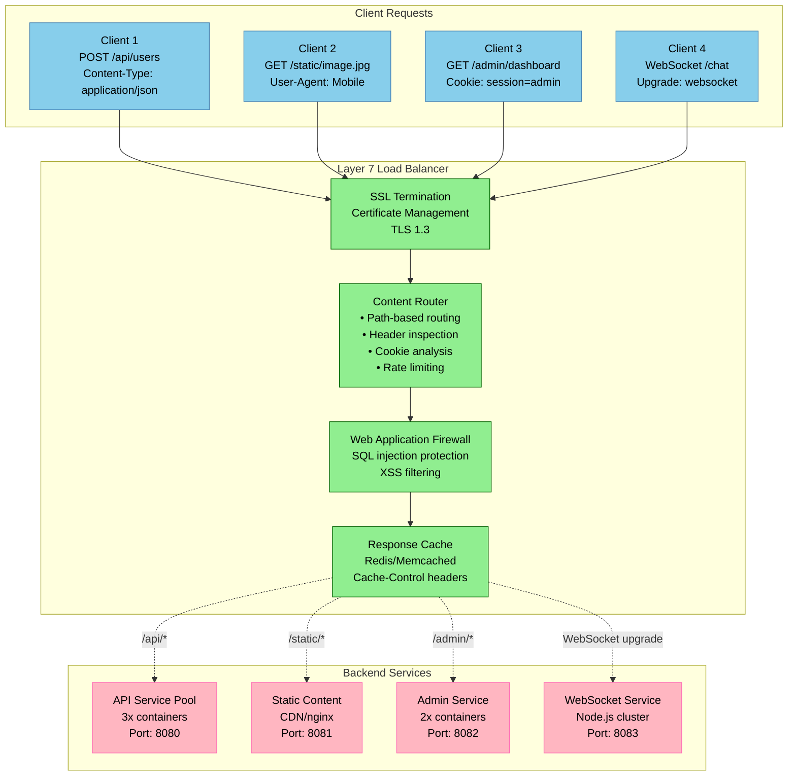

# Layer 7 Load Balancing (Application Layer)

## Overview

Layer 7 load balancing operates at the application layer, making routing decisions based on HTTP headers, URLs, cookies, and application data. This enables advanced traffic management, SSL termination, and content-based routing.

## Layer 7 Load Balancing Architecture



## Advanced HTTP Load Balancer Implementation

### Python AsyncIO HTTP Load Balancer

```python
import asyncio
import aiohttp
import ssl
import json
import time
import re
import hashlib
from urllib.parse import urlparse, parse_qs
from typing import Dict, List, Optional, Tuple, Any
from dataclasses import dataclass, field
from enum import Enum

class RoutingStrategy(Enum):
    PATH_BASED = "path_based"
    HEADER_BASED = "header_based"
    COOKIE_BASED = "cookie_based"
    WEIGHTED = "weighted"
    CANARY = "canary"

@dataclass
class Backend:
    name: str
    host: str
    port: int
    protocol: str = "http"
    weight: int = 1
    health_status: str = "healthy"
    active_connections: int = 0
    response_time_ms: float = 0.0
    ssl_context: Optional[ssl.SSLContext] = None

@dataclass
class RoutingRule:
    name: str
    strategy: RoutingStrategy
    pattern: str
    backends: List[Backend]
    conditions: Dict[str, Any] = field(default_factory=dict)
    rate_limit: Optional[int] = None
    cache_ttl: Optional[int] = None

class HTTPLoadBalancer:
    """Production-grade Layer 7 HTTP load balancer"""

    def __init__(self, listen_port: int = 8080, enable_ssl: bool = True):
        self.listen_port = listen_port
        self.enable_ssl = enable_ssl
        self.routing_rules: List[RoutingRule] = []
        self.backends: Dict[str, Backend] = {}

        # Performance tracking
        self.request_count = 0
        self.error_count = 0
        self.cache_hits = 0
        self.cache_misses = 0

        # Rate limiting
        self.rate_limit_store: Dict[str, List[float]] = {}

        # Response cache
        self.response_cache: Dict[str, Tuple[str, float, int]] = {}  # url -> (response, timestamp, ttl)

        # Session affinity
        self.session_store: Dict[str, str] = {}  # session_id -> backend_name

        # SSL configuration
        self.ssl_context = None
        if enable_ssl:
            self.setup_ssl()

    def setup_ssl(self):
        """Setup SSL context for HTTPS termination"""
        self.ssl_context = ssl.create_default_context(ssl.Purpose.CLIENT_AUTH)
        # In production, load actual certificates
        # self.ssl_context.load_cert_chain('server.crt', 'server.key')

    def add_backend(self, backend: Backend):
        """Add backend server to the pool"""
        self.backends[backend.name] = backend
        print(f"Added backend: {backend.name} ({backend.host}:{backend.port})")

    def add_routing_rule(self, rule: RoutingRule):
        """Add routing rule for request distribution"""
        self.routing_rules.append(rule)
        print(f"Added routing rule: {rule.name} ({rule.strategy.value})")

    def extract_client_ip(self, request: aiohttp.web.Request) -> str:
        """Extract real client IP considering proxy headers"""
        # Check for forwarded headers in order of preference
        forwarded_headers = [
            'X-Forwarded-For',
            'X-Real-IP',
            'CF-Connecting-IP',  # Cloudflare
            'X-Client-IP'
        ]

        for header in forwarded_headers:
            if header in request.headers:
                # X-Forwarded-For can contain multiple IPs
                ip = request.headers[header].split(',')[0].strip()
                if self.is_valid_ip(ip):
                    return ip

        # Fallback to remote address
        return request.remote

    def is_valid_ip(self, ip: str) -> bool:
        """Validate IP address format"""
        import ipaddress
        try:
            ipaddress.ip_address(ip)
            return True
        except ValueError:
            return False

    def check_rate_limit(self, client_ip: str, limit: int, window: int = 60) -> bool:
        """Check if client has exceeded rate limit"""
        now = time.time()

        if client_ip not in self.rate_limit_store:
            self.rate_limit_store[client_ip] = []

        # Clean old timestamps
        self.rate_limit_store[client_ip] = [
            timestamp for timestamp in self.rate_limit_store[client_ip]
            if now - timestamp < window
        ]

        # Check current count
        if len(self.rate_limit_store[client_ip]) >= limit:
            return False

        # Add current request
        self.rate_limit_store[client_ip].append(now)
        return True

    def get_cache_key(self, request: aiohttp.web.Request) -> str:
        """Generate cache key for request"""
        # Include method, path, and relevant headers
        key_parts = [
            request.method,
            request.path_qs,
            request.headers.get('Accept', ''),
            request.headers.get('Accept-Encoding', '')
        ]

        cache_key = '|'.join(key_parts)
        return hashlib.md5(cache_key.encode()).hexdigest()

    def check_cache(self, cache_key: str) -> Optional[Tuple[str, Dict[str, str]]]:
        """Check response cache"""
        if cache_key in self.response_cache:
            response_data, timestamp, ttl = self.response_cache[cache_key]

            if time.time() - timestamp < ttl:
                self.cache_hits += 1
                headers = {'X-Cache': 'HIT', 'X-Cache-Key': cache_key}
                return response_data, headers
            else:
                # Expired cache entry
                del self.response_cache[cache_key]

        self.cache_misses += 1
        return None

    def store_cache(self, cache_key: str, response_data: str, ttl: int):
        """Store response in cache"""
        self.response_cache[cache_key] = (response_data, time.time(), ttl)

    def match_routing_rule(self, request: aiohttp.web.Request) -> Optional[RoutingRule]:
        """Find matching routing rule for request"""
        for rule in self.routing_rules:
            if self.evaluate_rule(request, rule):
                return rule
        return None

    def evaluate_rule(self, request: aiohttp.web.Request, rule: RoutingRule) -> bool:
        """Evaluate if request matches routing rule"""
        if rule.strategy == RoutingStrategy.PATH_BASED:
            return re.match(rule.pattern, request.path)

        elif rule.strategy == RoutingStrategy.HEADER_BASED:
            header_name = rule.conditions.get('header_name')
            if header_name and header_name in request.headers:
                return re.match(rule.pattern, request.headers[header_name])

        elif rule.strategy == RoutingStrategy.COOKIE_BASED:
            cookie_name = rule.conditions.get('cookie_name')
            if cookie_name and cookie_name in request.cookies:
                return re.match(rule.pattern, request.cookies[cookie_name])

        elif rule.strategy == RoutingStrategy.CANARY:
            # Canary deployment based on percentage
            canary_percentage = rule.conditions.get('percentage', 0)
            client_ip = self.extract_client_ip(request)
            hash_value = int(hashlib.md5(client_ip.encode()).hexdigest(), 16)
            return (hash_value % 100) < canary_percentage

        return False

    def select_backend(self, rule: RoutingRule, request: aiohttp.web.Request) -> Optional[Backend]:
        """Select backend from rule's backend pool"""
        healthy_backends = [b for b in rule.backends if b.health_status == "healthy"]

        if not healthy_backends:
            return None

        # Check for session affinity
        session_id = request.cookies.get('session_id')
        if session_id and session_id in self.session_store:
            backend_name = self.session_store[session_id]
            backend = self.backends.get(backend_name)
            if backend and backend.health_status == "healthy":
                return backend

        # Weighted round robin selection
        total_weight = sum(b.weight for b in healthy_backends)
        if total_weight == 0:
            return healthy_backends[0]

        import random
        r = random.randint(1, total_weight)
        weight_sum = 0

        for backend in healthy_backends:
            weight_sum += backend.weight
            if r <= weight_sum:
                # Store session affinity if session exists
                if session_id:
                    self.session_store[session_id] = backend.name
                return backend

        return healthy_backends[0]

    async def forward_request(self, request: aiohttp.web.Request, backend: Backend) -> aiohttp.web.Response:
        """Forward request to backend server"""
        start_time = time.time()

        # Construct backend URL
        backend_url = f"{backend.protocol}://{backend.host}:{backend.port}{request.path_qs}"

        # Prepare headers (remove hop-by-hop headers)
        forward_headers = {}
        hop_by_hop_headers = {
            'connection', 'keep-alive', 'proxy-authenticate', 'proxy-authorization',
            'te', 'trailers', 'transfer-encoding', 'upgrade'
        }

        for name, value in request.headers.items():
            if name.lower() not in hop_by_hop_headers:
                forward_headers[name] = value

        # Add forwarding headers
        client_ip = self.extract_client_ip(request)
        forward_headers['X-Forwarded-For'] = client_ip
        forward_headers['X-Forwarded-Proto'] = 'https' if self.enable_ssl else 'http'
        forward_headers['X-Forwarded-Host'] = request.headers.get('Host', 'unknown')

        try:
            # Read request body
            body = await request.read()

            # Create HTTP session with timeout
            timeout = aiohttp.ClientTimeout(total=30, connect=5)

            async with aiohttp.ClientSession(timeout=timeout) as session:
                backend.active_connections += 1

                async with session.request(
                    method=request.method,
                    url=backend_url,
                    headers=forward_headers,
                    data=body,
                    ssl=backend.ssl_context
                ) as response:

                    # Read response
                    response_body = await response.read()

                    # Calculate response time
                    response_time = (time.time() - start_time) * 1000
                    backend.response_time_ms = response_time

                    # Prepare response headers
                    response_headers = {}
                    for name, value in response.headers.items():
                        if name.lower() not in hop_by_hop_headers:
                            response_headers[name] = value

                    # Add load balancer headers
                    response_headers['X-Served-By'] = backend.name
                    response_headers['X-Response-Time-Ms'] = str(int(response_time))

                    return aiohttp.web.Response(
                        body=response_body,
                        status=response.status,
                        headers=response_headers
                    )

        except Exception as e:
            self.error_count += 1
            print(f"Error forwarding request to {backend.name}: {e}")

            return aiohttp.web.Response(
                text=f"Backend error: {str(e)}",
                status=502,
                headers={'X-Error': 'Backend-Unavailable'}
            )
        finally:
            backend.active_connections -= 1

    async def handle_request(self, request: aiohttp.web.Request) -> aiohttp.web.Response:
        """Main request handler"""
        self.request_count += 1
        start_time = time.time()

        try:
            # Extract client information
            client_ip = self.extract_client_ip(request)

            # Find matching routing rule
            rule = self.match_routing_rule(request)
            if not rule:
                return aiohttp.web.Response(
                    text="No matching route found",
                    status=404,
                    headers={'X-Error': 'No-Route'}
                )

            # Check rate limiting
            if rule.rate_limit and not self.check_rate_limit(client_ip, rule.rate_limit):
                return aiohttp.web.Response(
                    text="Rate limit exceeded",
                    status=429,
                    headers={
                        'X-RateLimit-Limit': str(rule.rate_limit),
                        'X-RateLimit-Reset': str(int(time.time()) + 60)
                    }
                )

            # Check cache for GET requests
            if request.method == 'GET' and rule.cache_ttl:
                cache_key = self.get_cache_key(request)
                cached_response = self.check_cache(cache_key)

                if cached_response:
                    response_data, cache_headers = cached_response
                    return aiohttp.web.Response(
                        text=response_data,
                        headers=cache_headers
                    )

            # Select backend
            backend = self.select_backend(rule, request)
            if not backend:
                return aiohttp.web.Response(
                    text="No healthy backends available",
                    status=503,
                    headers={'X-Error': 'No-Healthy-Backends'}
                )

            # Forward request
            response = await self.forward_request(request, backend)

            # Store in cache if cacheable
            if (request.method == 'GET' and rule.cache_ttl and
                response.status == 200 and 'text' in response.content_type):
                cache_key = self.get_cache_key(request)
                self.store_cache(cache_key, response.text, rule.cache_ttl)

            # Add performance headers
            total_time = (time.time() - start_time) * 1000
            response.headers['X-Total-Time-Ms'] = str(int(total_time))
            response.headers['X-Backend'] = backend.name

            return response

        except Exception as e:
            self.error_count += 1
            print(f"Error handling request: {e}")

            return aiohttp.web.Response(
                text="Internal server error",
                status=500,
                headers={'X-Error': 'Internal-Error'}
            )

    async def health_check_handler(self, request: aiohttp.web.Request) -> aiohttp.web.Response:
        """Health check endpoint"""
        healthy_backends = len([b for b in self.backends.values() if b.health_status == "healthy"])
        total_backends = len(self.backends)

        health_data = {
            'status': 'healthy' if healthy_backends > 0 else 'unhealthy',
            'backends': {
                'healthy': healthy_backends,
                'total': total_backends
            },
            'metrics': {
                'requests': self.request_count,
                'errors': self.error_count,
                'cache_hit_rate': self.cache_hits / (self.cache_hits + self.cache_misses)
                                 if (self.cache_hits + self.cache_misses) > 0 else 0
            }
        }

        return aiohttp.web.json_response(health_data)

    async def stats_handler(self, request: aiohttp.web.Request) -> aiohttp.web.Response:
        """Statistics endpoint"""
        stats = {
            'load_balancer': {
                'requests': self.request_count,
                'errors': self.error_count,
                'cache_hits': self.cache_hits,
                'cache_misses': self.cache_misses,
                'active_sessions': len(self.session_store)
            },
            'backends': {
                name: {
                    'host': backend.host,
                    'port': backend.port,
                    'health_status': backend.health_status,
                    'active_connections': backend.active_connections,
                    'response_time_ms': backend.response_time_ms
                }
                for name, backend in self.backends.items()
            },
            'routing_rules': [
                {
                    'name': rule.name,
                    'strategy': rule.strategy.value,
                    'pattern': rule.pattern,
                    'backends': len(rule.backends)
                }
                for rule in self.routing_rules
            ]
        }

        return aiohttp.web.json_response(stats)

    async def start_health_checks(self):
        """Start background health checking"""
        while True:
            for backend in self.backends.values():
                try:
                    # Simple HTTP health check
                    health_url = f"{backend.protocol}://{backend.host}:{backend.port}/health"

                    timeout = aiohttp.ClientTimeout(total=5)
                    async with aiohttp.ClientSession(timeout=timeout) as session:
                        async with session.get(health_url) as response:
                            if response.status == 200:
                                backend.health_status = "healthy"
                            else:
                                backend.health_status = "unhealthy"

                except Exception:
                    backend.health_status = "unhealthy"

            await asyncio.sleep(10)  # Health check every 10 seconds

    def setup_routes(self, app: aiohttp.web.Application):
        """Setup application routes"""
        app.router.add_route('*', '/health', self.health_check_handler)
        app.router.add_route('GET', '/stats', self.stats_handler)
        app.router.add_route('*', '/{path:.*}', self.handle_request)

    async def start_server(self):
        """Start the load balancer server"""
        app = aiohttp.web.Application(client_max_size=1024*1024*100)  # 100MB max request
        self.setup_routes(app)

        # Start health checking
        asyncio.create_task(self.start_health_checks())

        # Start server
        runner = aiohttp.web.AppRunner(app)
        await runner.setup()

        site = aiohttp.web.TCPSite(
            runner,
            '0.0.0.0',
            self.listen_port,
            ssl_context=self.ssl_context
        )

        await site.start()
        print(f"Layer 7 Load Balancer started on port {self.listen_port}")
        print(f"SSL enabled: {self.enable_ssl}")

        # Keep server running
        try:
            while True:
                await asyncio.sleep(1)
        except KeyboardInterrupt:
            print("Shutting down load balancer...")
        finally:
            await runner.cleanup()

# Production example configuration
async def main():
    # Create load balancer
    lb = HTTPLoadBalancer(listen_port=8080, enable_ssl=False)

    # Add backend servers
    api_backends = [
        Backend("api-01", "10.0.1.10", 8080, weight=3),
        Backend("api-02", "10.0.1.11", 8080, weight=2),
        Backend("api-03", "10.0.1.12", 8080, weight=1)
    ]

    static_backends = [
        Backend("static-01", "10.0.2.10", 8081),
        Backend("static-02", "10.0.2.11", 8081)
    ]

    admin_backends = [
        Backend("admin-01", "10.0.3.10", 8082)
    ]

    for backend in api_backends + static_backends + admin_backends:
        lb.add_backend(backend)

    # Add routing rules
    lb.add_routing_rule(RoutingRule(
        name="api_routes",
        strategy=RoutingStrategy.PATH_BASED,
        pattern=r"^/api/.*",
        backends=api_backends,
        rate_limit=1000,  # 1000 requests per minute
        cache_ttl=60      # Cache for 1 minute
    ))

    lb.add_routing_rule(RoutingRule(
        name="static_routes",
        strategy=RoutingStrategy.PATH_BASED,
        pattern=r"^/static/.*",
        backends=static_backends,
        cache_ttl=3600    # Cache for 1 hour
    ))

    lb.add_routing_rule(RoutingRule(
        name="admin_routes",
        strategy=RoutingStrategy.PATH_BASED,
        pattern=r"^/admin/.*",
        backends=admin_backends,
        conditions={"require_auth": True}
    ))

    lb.add_routing_rule(RoutingRule(
        name="canary_deployment",
        strategy=RoutingStrategy.CANARY,
        pattern="",
        backends=[api_backends[0]],  # Canary backend
        conditions={"percentage": 10}  # 10% of traffic
    ))

    # Start server
    await lb.start_server()

if __name__ == "__main__":
    asyncio.run(main())
```

## nginx Layer 7 Configuration

### Production nginx Configuration

```nginx
# nginx-layer7.conf - Production Layer 7 configuration

# Main context
user nginx;
worker_processes auto;
worker_rlimit_nofile 65535;
error_log /var/log/nginx/error.log warn;
pid /var/run/nginx.pid;

events {
    worker_connections 4096;
    use epoll;
    multi_accept on;
}

http {
    # Basic settings
    include /etc/nginx/mime.types;
    default_type application/octet-stream;

    sendfile on;
    tcp_nopush on;
    tcp_nodelay on;
    keepalive_timeout 65;
    keepalive_requests 1000;

    # Security headers
    server_tokens off;
    add_header X-Frame-Options DENY;
    add_header X-Content-Type-Options nosniff;
    add_header X-XSS-Protection "1; mode=block";
    add_header Strict-Transport-Security "max-age=31536000; includeSubDomains";

    # Gzip compression
    gzip on;
    gzip_vary on;
    gzip_min_length 1024;
    gzip_types
        text/plain
        text/css
        text/xml
        text/javascript
        application/javascript
        application/xml+rss
        application/json;

    # Rate limiting
    limit_req_zone $binary_remote_addr zone=api:10m rate=10r/s;
    limit_req_zone $binary_remote_addr zone=login:10m rate=1r/s;
    limit_conn_zone $binary_remote_addr zone=conn_limit_per_ip:10m;

    # Caching
    proxy_cache_path /var/cache/nginx/static levels=1:2 keys_zone=static_cache:10m
                     max_size=1g inactive=60m use_temp_path=off;
    proxy_cache_path /var/cache/nginx/api levels=1:2 keys_zone=api_cache:10m
                     max_size=100m inactive=10m use_temp_path=off;

    # Log format
    log_format detailed '$remote_addr - $remote_user [$time_local] '
                       '"$request" $status $bytes_sent '
                       '"$http_referer" "$http_user_agent" '
                       'rt=$request_time uct="$upstream_connect_time" '
                       'uht="$upstream_header_time" urt="$upstream_response_time" '
                       'backend="$upstream_addr" cache="$upstream_cache_status"';

    access_log /var/log/nginx/access.log detailed;

    # Backend definitions
    upstream api_backend {
        least_conn;

        server 10.0.1.10:8080 weight=3 max_fails=3 fail_timeout=30s;
        server 10.0.1.11:8080 weight=2 max_fails=3 fail_timeout=30s;
        server 10.0.1.12:8080 weight=1 max_fails=3 fail_timeout=30s;

        keepalive 32;
        keepalive_requests 1000;
        keepalive_timeout 60s;
    }

    upstream api_canary {
        server 10.0.1.20:8080 max_fails=2 fail_timeout=15s;
        keepalive 8;
    }

    upstream static_backend {
        least_conn;

        server 10.0.2.10:8081 weight=1 max_fails=2 fail_timeout=30s;
        server 10.0.2.11:8081 weight=1 max_fails=2 fail_timeout=30s;

        keepalive 16;
    }

    upstream admin_backend {
        server 10.0.3.10:8082 max_fails=2 fail_timeout=30s;
        server 10.0.3.11:8082 backup;

        keepalive 8;
    }

    upstream websocket_backend {
        ip_hash;  # Session persistence for WebSockets

        server 10.0.4.10:8083 max_fails=2 fail_timeout=30s;
        server 10.0.4.11:8083 max_fails=2 fail_timeout=30s;
        server 10.0.4.12:8083 max_fails=2 fail_timeout=30s;
    }

    # GeoIP for geographic routing (requires GeoIP module)
    # geoip_country /usr/share/GeoIP/GeoIP.dat;
    # map $geoip_country_code $geo_backend {
    #     default api_backend;
    #     US api_backend;
    #     GB eu_api_backend;
    #     DE eu_api_backend;
    #     JP asia_api_backend;
    # }

    # A/B testing with canary deployment
    split_clients "${remote_addr}${http_user_agent}${date_gmt}" $backend_pool {
        10% api_canary;    # 10% to canary
        *   api_backend;   # 90% to stable
    }

    # Main server block
    server {
        listen 80;
        listen [::]:80;
        server_name api.company.com;

        # Redirect HTTP to HTTPS
        return 301 https://$server_name$request_uri;
    }

    server {
        listen 443 ssl http2;
        listen [::]:443 ssl http2;
        server_name api.company.com;

        # SSL configuration
        ssl_certificate /etc/ssl/certs/company.com.crt;
        ssl_certificate_key /etc/ssl/private/company.com.key;
        ssl_protocols TLSv1.2 TLSv1.3;
        ssl_ciphers ECDHE+AESGCM:ECDHE+CHACHA20:DHE+AESGCM:DHE+CHACHA20:!aNULL:!SHA1;
        ssl_prefer_server_ciphers off;
        ssl_session_cache shared:SSL:10m;
        ssl_session_timeout 10m;

        # OCSP stapling
        ssl_stapling on;
        ssl_stapling_verify on;

        # Connection and request limits
        limit_conn conn_limit_per_ip 20;
        client_max_body_size 10M;

        # API routes with rate limiting and caching
        location /api/ {
            limit_req zone=api burst=20 nodelay;

            # Canary deployment routing
            proxy_pass http://$backend_pool;

            # Caching for GET requests
            proxy_cache api_cache;
            proxy_cache_valid 200 5m;
            proxy_cache_valid 404 1m;
            proxy_cache_key "$scheme$request_method$host$request_uri";
            proxy_cache_bypass $http_cache_control;
            add_header X-Cache-Status $upstream_cache_status;

            # Proxy settings
            proxy_set_header Host $host;
            proxy_set_header X-Real-IP $remote_addr;
            proxy_set_header X-Forwarded-For $proxy_add_x_forwarded_for;
            proxy_set_header X-Forwarded-Proto $scheme;
            proxy_set_header X-Request-ID $request_id;

            proxy_connect_timeout 5s;
            proxy_send_timeout 60s;
            proxy_read_timeout 60s;

            proxy_next_upstream error timeout invalid_header http_500 http_502 http_503 http_504;
            proxy_next_upstream_tries 3;
            proxy_next_upstream_timeout 10s;

            # CORS headers
            add_header Access-Control-Allow-Origin *;
            add_header Access-Control-Allow-Methods "GET, POST, PUT, DELETE, OPTIONS";
            add_header Access-Control-Allow-Headers "DNT,User-Agent,X-Requested-With,If-Modified-Since,Cache-Control,Content-Type,Range,Authorization";

            # Handle preflight requests
            if ($request_method = 'OPTIONS') {
                add_header Access-Control-Max-Age 1728000;
                add_header Content-Type 'text/plain; charset=utf-8';
                add_header Content-Length 0;
                return 204;
            }
        }

        # Static content with aggressive caching
        location /static/ {
            proxy_pass http://static_backend;

            proxy_cache static_cache;
            proxy_cache_valid 200 1h;
            proxy_cache_valid 404 5m;
            proxy_cache_key "$scheme$request_method$host$request_uri";

            # Long-term caching headers
            add_header Cache-Control "public, max-age=3600";
            add_header X-Cache-Status $upstream_cache_status;

            proxy_set_header Host $host;
            proxy_set_header X-Real-IP $remote_addr;
            proxy_set_header X-Forwarded-For $proxy_add_x_forwarded_for;
        }

        # Admin routes with authentication
        location /admin/ {
            # IP whitelist for admin access
            allow 10.0.0.0/8;
            allow 192.168.0.0/16;
            deny all;

            # Additional rate limiting for admin
            limit_req zone=login burst=5 nodelay;

            # Basic auth (in production, use OAuth/SAML)
            auth_basic "Admin Area";
            auth_basic_user_file /etc/nginx/.htpasswd;

            proxy_pass http://admin_backend;

            proxy_set_header Host $host;
            proxy_set_header X-Real-IP $remote_addr;
            proxy_set_header X-Forwarded-For $proxy_add_x_forwarded_for;
            proxy_set_header X-Forwarded-Proto $scheme;
            proxy_set_header X-Admin-User $remote_user;
        }

        # WebSocket support
        location /ws/ {
            proxy_pass http://websocket_backend;

            proxy_http_version 1.1;
            proxy_set_header Upgrade $http_upgrade;
            proxy_set_header Connection "upgrade";
            proxy_set_header Host $host;
            proxy_set_header X-Real-IP $remote_addr;
            proxy_set_header X-Forwarded-For $proxy_add_x_forwarded_for;
            proxy_set_header X-Forwarded-Proto $scheme;

            # WebSocket specific timeouts
            proxy_read_timeout 3600s;
            proxy_send_timeout 3600s;
        }

        # Health check endpoint
        location /nginx-health {
            access_log off;
            return 200 "healthy\n";
            add_header Content-Type text/plain;
        }

        # Metrics endpoint for monitoring
        location /nginx-status {
            stub_status on;
            access_log off;
            allow 127.0.0.1;
            allow 10.0.0.0/8;
            deny all;
        }

        # Security: Block common attack patterns
        location ~* \.(sql|bak|log|tar|gz|zip)$ {
            deny all;
        }

        location ~ /\. {
            deny all;
        }

        # Default location for unmatched routes
        location / {
            proxy_pass http://api_backend;

            proxy_set_header Host $host;
            proxy_set_header X-Real-IP $remote_addr;
            proxy_set_header X-Forwarded-For $proxy_add_x_forwarded_for;
            proxy_set_header X-Forwarded-Proto $scheme;
        }

        # Custom error pages
        error_page 500 502 503 504 /50x.html;
        location = /50x.html {
            root /usr/share/nginx/html;
        }

        error_page 404 /404.html;
        location = /404.html {
            root /usr/share/nginx/html;
        }
    }

    # Separate server for internal metrics
    server {
        listen 127.0.0.1:8080;
        server_name localhost;

        location /upstream-status {
            upstream_status;
            access_log off;
        }

        location /request-status {
            rtmp_stat all;
            rtmp_stat_stylesheet stat.xsl;
        }
    }
}
```

## Application-Aware Load Balancing

### Content-Based Routing Implementation

```python
import re
import json
from typing import Dict, List, Any, Optional
from dataclasses import dataclass
from enum import Enum

class ContentType(Enum):
    JSON_API = "json_api"
    STATIC_ASSET = "static_asset"
    FILE_UPLOAD = "file_upload"
    WEBSOCKET = "websocket"
    STREAMING = "streaming"

@dataclass
class ContentRule:
    content_type: ContentType
    patterns: List[str]
    backend_pool: str
    processing_options: Dict[str, Any]

class ApplicationAwareRouter:
    """Application-aware routing based on content analysis"""

    def __init__(self):
        self.content_rules: List[ContentRule] = []
        self.setup_default_rules()

    def setup_default_rules(self):
        """Setup default content-based routing rules"""

        # JSON API requests
        self.content_rules.append(ContentRule(
            content_type=ContentType.JSON_API,
            patterns=[
                r'Content-Type:\s*application/json',
                r'Accept:\s*application/json',
                r'^/(api|v1|v2)/'
            ],
            backend_pool="api_servers",
            processing_options={
                "enable_compression": True,
                "timeout": 30,
                "retry_count": 3,
                "circuit_breaker": True
            }
        ))

        # Static assets
        self.content_rules.append(ContentRule(
            content_type=ContentType.STATIC_ASSET,
            patterns=[
                r'\.(css|js|png|jpg|jpeg|gif|svg|ico|woff|woff2|ttf)$',
                r'^/static/',
                r'^/assets/',
                r'Cache-Control:\s*max-age'
            ],
            backend_pool="cdn_servers",
            processing_options={
                "enable_caching": True,
                "cache_ttl": 3600,
                "compression": "gzip",
                "edge_caching": True
            }
        ))

        # File uploads
        self.content_rules.append(ContentRule(
            content_type=ContentType.FILE_UPLOAD,
            patterns=[
                r'Content-Type:\s*multipart/form-data',
                r'Content-Length:\s*[1-9]\d{6,}',  # Large content (>1MB)
                r'^/upload'
            ],
            backend_pool="upload_servers",
            processing_options={
                "timeout": 300,  # 5 minutes for uploads
                "max_body_size": "100M",
                "streaming": True,
                "virus_scan": True
            }
        ))

        # WebSocket connections
        self.content_rules.append(ContentRule(
            content_type=ContentType.WEBSOCKET,
            patterns=[
                r'Upgrade:\s*websocket',
                r'Connection:\s*upgrade',
                r'^/ws/',
                r'^/socket.io/'
            ],
            backend_pool="websocket_servers",
            processing_options={
                "session_affinity": True,
                "timeout": 3600,  # 1 hour for persistent connections
                "heartbeat": 30
            }
        ))

        # Streaming content
        self.content_rules.append(ContentRule(
            content_type=ContentType.STREAMING,
            patterns=[
                r'Accept:\s*video/',
                r'Accept:\s*audio/',
                r'\.(mp4|mp3|avi|mov|flv|m3u8)$',
                r'Range:\s*bytes='
            ],
            backend_pool="streaming_servers",
            processing_options={
                "buffering": False,
                "timeout": 0,  # No timeout for streaming
                "bandwidth_limit": "10M"
            }
        ))

    def analyze_request_content(self, request_headers: Dict[str, str],
                               request_path: str,
                               request_body: Optional[bytes] = None) -> ContentType:
        """Analyze request to determine content type"""

        # Combine headers into searchable text
        headers_text = '\n'.join(f"{key}: {value}" for key, value in request_headers.items())

        for rule in self.content_rules:
            match_count = 0

            for pattern in rule.patterns:
                if re.search(pattern, headers_text, re.IGNORECASE):
                    match_count += 1
                elif re.search(pattern, request_path, re.IGNORECASE):
                    match_count += 1

            # If majority of patterns match, classify as this content type
            if match_count >= len(rule.patterns) // 2 + 1:
                return rule.content_type

        # Default to JSON API if no specific match
        return ContentType.JSON_API

    def get_routing_decision(self, content_type: ContentType) -> Dict[str, Any]:
        """Get routing decision based on content type"""
        for rule in self.content_rules:
            if rule.content_type == content_type:
                return {
                    "backend_pool": rule.backend_pool,
                    "processing_options": rule.processing_options,
                    "content_type": content_type.value
                }

        # Default routing
        return {
            "backend_pool": "default_servers",
            "processing_options": {"timeout": 30},
            "content_type": "unknown"
        }

# Machine Learning-based traffic classification
class MLTrafficClassifier:
    """Machine learning-based traffic classification for intelligent routing"""

    def __init__(self):
        self.feature_extractors = {
            'request_size': self._extract_request_size,
            'user_agent_category': self._extract_user_agent_category,
            'time_of_day': self._extract_time_of_day,
            'geographic_region': self._extract_geographic_region,
            'session_characteristics': self._extract_session_characteristics
        }

        # In production, this would be a trained ML model
        self.classification_rules = self._load_classification_rules()

    def _extract_request_size(self, request: Dict) -> str:
        """Extract request size category"""
        content_length = int(request.get('headers', {}).get('Content-Length', 0))

        if content_length == 0:
            return 'no_body'
        elif content_length < 1024:
            return 'small'
        elif content_length < 1024 * 1024:
            return 'medium'
        else:
            return 'large'

    def _extract_user_agent_category(self, request: Dict) -> str:
        """Extract user agent category"""
        user_agent = request.get('headers', {}).get('User-Agent', '').lower()

        if 'mobile' in user_agent or 'android' in user_agent or 'iphone' in user_agent:
            return 'mobile'
        elif 'bot' in user_agent or 'crawler' in user_agent:
            return 'bot'
        elif 'api' in user_agent or 'curl' in user_agent:
            return 'api_client'
        else:
            return 'browser'

    def _extract_time_of_day(self, request: Dict) -> str:
        """Extract time of day category"""
        import datetime
        hour = datetime.datetime.now().hour

        if 6 <= hour < 12:
            return 'morning'
        elif 12 <= hour < 18:
            return 'afternoon'
        elif 18 <= hour < 22:
            return 'evening'
        else:
            return 'night'

    def _extract_geographic_region(self, request: Dict) -> str:
        """Extract geographic region from IP"""
        # In production, use GeoIP database
        client_ip = request.get('client_ip', '')

        # Simplified geographic classification
        if client_ip.startswith('10.0.1.'):
            return 'us_east'
        elif client_ip.startswith('10.0.2.'):
            return 'us_west'
        elif client_ip.startswith('10.0.3.'):
            return 'europe'
        else:
            return 'unknown'

    def _extract_session_characteristics(self, request: Dict) -> str:
        """Extract session characteristics"""
        cookies = request.get('headers', {}).get('Cookie', '')

        if 'admin_session' in cookies:
            return 'admin'
        elif 'premium_user' in cookies:
            return 'premium'
        elif 'session_id' in cookies:
            return 'authenticated'
        else:
            return 'anonymous'

    def _load_classification_rules(self) -> Dict:
        """Load traffic classification rules"""
        return {
            'high_priority': {
                'conditions': [
                    {'session_characteristics': 'admin'},
                    {'session_characteristics': 'premium'},
                    {'user_agent_category': 'api_client', 'request_size': 'large'}
                ],
                'backend_pool': 'premium_servers',
                'priority': 1
            },
            'mobile_optimized': {
                'conditions': [
                    {'user_agent_category': 'mobile'}
                ],
                'backend_pool': 'mobile_servers',
                'priority': 2
            },
            'bot_traffic': {
                'conditions': [
                    {'user_agent_category': 'bot'}
                ],
                'backend_pool': 'bot_servers',
                'priority': 3
            },
            'regional_routing': {
                'conditions': [
                    {'geographic_region': 'us_east'},
                    {'geographic_region': 'us_west'},
                    {'geographic_region': 'europe'}
                ],
                'backend_pool': 'regional_servers',
                'priority': 4
            }
        }

    def classify_traffic(self, request: Dict) -> Dict[str, Any]:
        """Classify traffic and return routing decision"""
        # Extract features
        features = {}
        for name, extractor in self.feature_extractors.items():
            features[name] = extractor(request)

        # Apply classification rules
        for rule_name, rule in self.classification_rules.items():
            for condition in rule['conditions']:
                if all(features.get(key) == value for key, value in condition.items()):
                    return {
                        'rule_matched': rule_name,
                        'backend_pool': rule['backend_pool'],
                        'priority': rule['priority'],
                        'features': features
                    }

        # Default classification
        return {
            'rule_matched': 'default',
            'backend_pool': 'default_servers',
            'priority': 10,
            'features': features
        }

# Example usage
def demonstrate_intelligent_routing():
    """Demonstrate intelligent routing capabilities"""

    router = ApplicationAwareRouter()
    ml_classifier = MLTrafficClassifier()

    # Example requests
    test_requests = [
        {
            'path': '/api/users',
            'headers': {
                'Content-Type': 'application/json',
                'Accept': 'application/json',
                'User-Agent': 'Mobile App/1.0',
                'Cookie': 'session_id=abc123'
            },
            'client_ip': '10.0.1.100'
        },
        {
            'path': '/static/logo.png',
            'headers': {
                'Accept': 'image/png',
                'User-Agent': 'Mozilla/5.0 (iPhone; CPU iPhone OS 14_0)',
                'Cache-Control': 'max-age=3600'
            },
            'client_ip': '10.0.2.50'
        },
        {
            'path': '/upload/document',
            'headers': {
                'Content-Type': 'multipart/form-data',
                'Content-Length': '5242880',  # 5MB
                'User-Agent': 'Chrome/91.0'
            },
            'client_ip': '10.0.3.25'
        }
    ]

    print("Intelligent Routing Demonstration")
    print("=" * 50)

    for i, request in enumerate(test_requests, 1):
        print(f"\nRequest {i}: {request['path']}")

        # Content-based routing
        content_type = router.analyze_request_content(
            request['headers'],
            request['path']
        )
        content_routing = router.get_routing_decision(content_type)

        # ML-based classification
        ml_routing = ml_classifier.classify_traffic(request)

        print(f"  Content Type: {content_type.value}")
        print(f"  Content Routing: {content_routing['backend_pool']}")
        print(f"  ML Classification: {ml_routing['rule_matched']}")
        print(f"  ML Backend: {ml_routing['backend_pool']}")
        print(f"  Priority: {ml_routing['priority']}")

if __name__ == "__main__":
    demonstrate_intelligent_routing()
```

This comprehensive Layer 7 load balancing implementation provides production-ready HTTP load balancing with advanced features including SSL termination, content-based routing, caching, rate limiting, and machine learning-based traffic classification for intelligent request distribution.