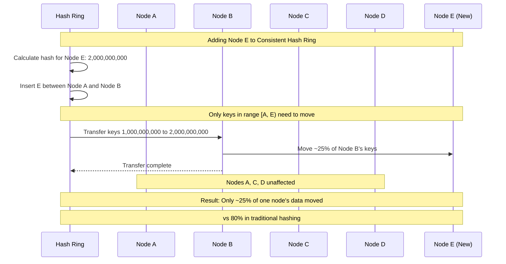
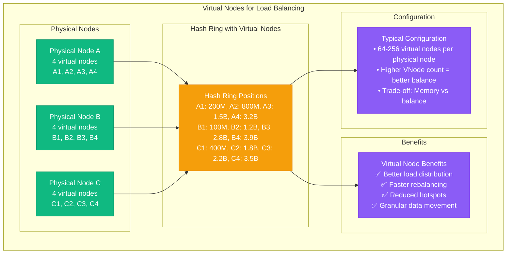
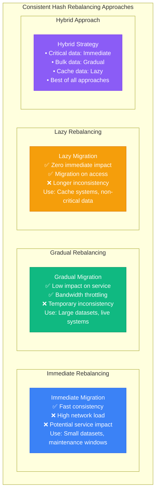

# Consistent Hashing

## Overview and Motivation

Consistent hashing solves the problem of minimizing data movement when nodes are added or removed from a distributed system, making it ideal for distributed caches and databases.

### Traditional Hashing Problems

```mermaid
graph TB
    subgraph Traditional Hashing Issues
        subgraph Initial State (4 nodes)
            HASH_INIT[Hash Function: hash(key) % 4]
            NODE0_INIT[Node 0: Keys 0,4,8,12,16...]
            NODE1_INIT[Node 1: Keys 1,5,9,13,17...]
            NODE2_INIT[Node 2: Keys 2,6,10,14,18...]
            NODE3_INIT[Node 3: Keys 3,7,11,15,19...]
        end

        subgraph After Adding Node (5 nodes)
            HASH_NEW[Hash Function: hash(key) % 5]
            PROBLEM[Problem: Most keys need to move!<br/>Key 4: Node 0 → Node 4<br/>Key 5: Node 1 → Node 0<br/>Key 6: Node 2 → Node 1<br/>Key 7: Node 3 → Node 2<br/>~80% of data moves!]
        end

        subgraph Impact
            IMPACT[Massive Data Movement<br/>• Cache invalidation<br/>• Network bandwidth saturation<br/>• Temporary unavailability<br/>• Poor user experience]
        end
    end

    NODE0_INIT --> PROBLEM
    NODE1_INIT --> PROBLEM
    NODE2_INIT --> PROBLEM
    NODE3_INIT --> PROBLEM

    HASH_NEW --> IMPACT
    PROBLEM --> IMPACT

    %% Apply 4-plane colors
    classDef edgeStyle fill:#3B82F6,stroke:#2563EB,color:#fff
    classDef serviceStyle fill:#10B981,stroke:#059669,color:#fff
    classDef stateStyle fill:#F59E0B,stroke:#D97706,color:#fff
    classDef controlStyle fill:#8B5CF6,stroke:#7C3AED,color:#fff

    class HASH_INIT,HASH_NEW edgeStyle
    class NODE0_INIT,NODE1_INIT,NODE2_INIT,NODE3_INIT serviceStyle
    class PROBLEM stateStyle
    class IMPACT controlStyle
```

## Consistent Hashing Algorithm

### Hash Ring Concept

```mermaid
graph LR
    subgraph Consistent Hash Ring
        subgraph Hash Ring (0 to 2^32-1)
            RING[Hash Ring<br/>360° circle<br/>0 to 4,294,967,295]

            NODE_A[Node A<br/>Hash: 1,000,000,000<br/>Owns: 750M - 1B]
            NODE_B[Node B<br/>Hash: 2,500,000,000<br/>Owns: 1B - 2.5B]
            NODE_C[Node C<br/>Hash: 3,800,000,000<br/>Owns: 2.5B - 3.8B]
            NODE_D[Node D<br/>Hash: 750,000,000<br/>Owns: 3.8B - 750M]

            KEY1[Key: "user:123"<br/>Hash: 1,200,000,000<br/>→ Node B]
            KEY2[Key: "user:456"<br/>Hash: 3,000,000,000<br/>→ Node C]
            KEY3[Key: "user:789"<br/>Hash: 500,000,000<br/>→ Node D]
        end

        subgraph Clockwise Assignment
            RULE[Assignment Rule:<br/>Key belongs to first node<br/>clockwise from key's position]
        end
    end

    KEY1 --> NODE_B
    KEY2 --> NODE_C
    KEY3 --> NODE_D

    RULE --> NODE_A
    RULE --> NODE_B
    RULE --> NODE_C
    RULE --> NODE_D

    %% Apply colors
    classDef edgeStyle fill:#3B82F6,stroke:#2563EB,color:#fff
    classDef serviceStyle fill:#10B981,stroke:#059669,color:#fff
    classDef stateStyle fill:#F59E0B,stroke:#D97706,color:#fff
    classDef controlStyle fill:#8B5CF6,stroke:#7C3AED,color:#fff

    class KEY1,KEY2,KEY3 edgeStyle
    class NODE_A,NODE_B,NODE_C,NODE_D serviceStyle
    class RING stateStyle
    class RULE controlStyle
```

### Node Addition/Removal Impact



## Virtual Nodes (VNodes)

### Virtual Node Distribution



## Implementation Examples

### Basic Consistent Hashing

```python
import hashlib
import bisect
from typing import List, Dict, Optional, Set

class ConsistentHash:
    def __init__(self, nodes: List[str] = None, virtual_nodes: int = 100):
        self.virtual_nodes = virtual_nodes
        self.ring: Dict[int, str] = {}
        self.sorted_keys: List[int] = []
        self.nodes: Set[str] = set()

        if nodes:
            for node in nodes:
                self.add_node(node)

    def _hash(self, key: str) -> int:
        """Generate hash for a key"""
        return int(hashlib.md5(key.encode()).hexdigest(), 16)

    def add_node(self, node: str) -> List[str]:
        """Add a node to the hash ring"""
        if node in self.nodes:
            return []

        self.nodes.add(node)
        moved_keys = []

        # Add virtual nodes
        for i in range(self.virtual_nodes):
            virtual_key = f"{node}:{i}"
            hash_value = self._hash(virtual_key)

            # Check if this position affects existing data
            if self.sorted_keys:
                successor_idx = bisect.bisect_right(self.sorted_keys, hash_value)
                if successor_idx < len(self.sorted_keys):
                    successor_hash = self.sorted_keys[successor_idx]
                    successor_node = self.ring[successor_hash]

                    # Keys between predecessor and this new node need to move
                    if successor_idx > 0:
                        predecessor_hash = self.sorted_keys[successor_idx - 1]
                        moved_keys.append(f"Range {predecessor_hash}-{hash_value} moves from {successor_node} to {node}")

            self.ring[hash_value] = node
            bisect.insort(self.sorted_keys, hash_value)

        return moved_keys

    def remove_node(self, node: str) -> List[str]:
        """Remove a node from the hash ring"""
        if node not in self.nodes:
            return []

        self.nodes.remove(node)
        moved_keys = []

        # Remove all virtual nodes
        keys_to_remove = []
        for hash_value, ring_node in self.ring.items():
            if ring_node == node:
                keys_to_remove.append(hash_value)

        for hash_value in keys_to_remove:
            # Find successor for data migration
            successor_hash = self._find_successor(hash_value)
            if successor_hash is not None:
                successor_node = self.ring[successor_hash]
                moved_keys.append(f"Data at {hash_value} moves to {successor_node}")

            del self.ring[hash_value]
            self.sorted_keys.remove(hash_value)

        return moved_keys

    def get_node(self, key: str) -> Optional[str]:
        """Get the node responsible for a key"""
        if not self.ring:
            return None

        hash_value = self._hash(key)
        successor_hash = self._find_successor(hash_value)

        if successor_hash is None:
            # Wrap around to the first node
            successor_hash = self.sorted_keys[0]

        return self.ring[successor_hash]

    def _find_successor(self, hash_value: int) -> Optional[int]:
        """Find the first node clockwise from hash_value"""
        idx = bisect.bisect_right(self.sorted_keys, hash_value)
        if idx < len(self.sorted_keys):
            return self.sorted_keys[idx]
        return None

    def get_nodes_for_key(self, key: str, count: int = 3) -> List[str]:
        """Get multiple nodes for replication"""
        if not self.ring or count <= 0:
            return []

        hash_value = self._hash(key)
        nodes = []
        seen_physical_nodes = set()

        # Start from the first successor
        idx = bisect.bisect_right(self.sorted_keys, hash_value)

        # Collect unique physical nodes
        for i in range(len(self.sorted_keys)):
            ring_idx = (idx + i) % len(self.sorted_keys)
            node = self.ring[self.sorted_keys[ring_idx]]

            if node not in seen_physical_nodes:
                nodes.append(node)
                seen_physical_nodes.add(node)

                if len(nodes) >= count:
                    break

        return nodes

    def get_ring_distribution(self) -> Dict[str, int]:
        """Get distribution of virtual nodes per physical node"""
        distribution = {}
        for node in self.ring.values():
            distribution[node] = distribution.get(node, 0) + 1
        return distribution

    def analyze_balance(self) -> Dict[str, float]:
        """Analyze load balance across nodes"""
        if not self.ring:
            return {}

        # Calculate the range each virtual node is responsible for
        node_ranges = {}
        total_range = 2**32

        for i, hash_value in enumerate(self.sorted_keys):
            node = self.ring[hash_value]

            if i == 0:
                # First node: from last node to this node (wrapping)
                range_size = hash_value + (total_range - self.sorted_keys[-1])
            else:
                # Range from previous node to this node
                range_size = hash_value - self.sorted_keys[i-1]

            if node not in node_ranges:
                node_ranges[node] = 0
            node_ranges[node] += range_size

        # Convert to percentages
        balance = {}
        for node, range_size in node_ranges.items():
            balance[node] = (range_size / total_range) * 100

        return balance

# Example usage and testing
def demonstrate_consistent_hashing():
    # Initialize with 3 nodes
    ch = ConsistentHash(['node1', 'node2', 'node3'], virtual_nodes=64)

    print("Initial ring distribution:")
    for node, count in ch.get_ring_distribution().items():
        print(f"  {node}: {count} virtual nodes")

    print("\nLoad balance analysis:")
    balance = ch.analyze_balance()
    for node, percentage in balance.items():
        print(f"  {node}: {percentage:.2f}% of key space")

    # Test key assignment
    test_keys = ['user:123', 'user:456', 'user:789', 'order:abc', 'order:def']
    print(f"\nKey assignments:")
    for key in test_keys:
        primary = ch.get_node(key)
        replicas = ch.get_nodes_for_key(key, 3)
        print(f"  {key}: primary={primary}, replicas={replicas}")

    # Add a new node
    print("\nAdding node4...")
    moved = ch.add_node('node4')
    print(f"Data movement summary: {len(moved)} ranges affected")

    print("\nNew load balance:")
    balance = ch.analyze_balance()
    for node, percentage in balance.items():
        print(f"  {node}: {percentage:.2f}% of key space")

    # Remove a node
    print("\nRemoving node2...")
    moved = ch.remove_node('node2')
    print(f"Data movement summary: {len(moved)} ranges affected")

    print("\nFinal load balance:")
    balance = ch.analyze_balance()
    for node, percentage in balance.items():
        print(f"  {node}: {percentage:.2f}% of key space")

if __name__ == "__main__":
    demonstrate_consistent_hashing()
```

### Advanced Consistent Hashing with Weights

```python
class WeightedConsistentHash(ConsistentHash):
    def __init__(self, nodes: Dict[str, float] = None):
        """
        Initialize with weighted nodes
        nodes: dict of {node_name: weight}
        """
        self.node_weights = nodes or {}
        super().__init__()

        if nodes:
            for node, weight in nodes.items():
                self.add_weighted_node(node, weight)

    def add_weighted_node(self, node: str, weight: float = 1.0) -> List[str]:
        """Add a node with specific weight"""
        if node in self.nodes:
            return []

        self.node_weights[node] = weight
        self.nodes.add(node)

        # Calculate virtual nodes based on weight
        # Base virtual nodes = 100, scaled by weight
        virtual_node_count = max(1, int(100 * weight))
        moved_keys = []

        for i in range(virtual_node_count):
            virtual_key = f"{node}:{i}"
            hash_value = self._hash(virtual_key)

            if self.sorted_keys:
                successor_idx = bisect.bisect_right(self.sorted_keys, hash_value)
                if successor_idx < len(self.sorted_keys):
                    successor_hash = self.sorted_keys[successor_idx]
                    successor_node = self.ring[successor_hash]

                    if successor_idx > 0:
                        predecessor_hash = self.sorted_keys[successor_idx - 1]
                        moved_keys.append(f"Range {predecessor_hash}-{hash_value} moves from {successor_node} to {node}")

            self.ring[hash_value] = node
            bisect.insort(self.sorted_keys, hash_value)

        return moved_keys

    def get_expected_load(self) -> Dict[str, float]:
        """Calculate expected load percentage based on weights"""
        if not self.node_weights:
            return {}

        total_weight = sum(self.node_weights.values())
        return {
            node: (weight / total_weight) * 100
            for node, weight in self.node_weights.items()
        }

# Example with weighted nodes
def demonstrate_weighted_hashing():
    # Create cluster with different capacity nodes
    nodes = {
        'small-node-1': 0.5,   # Half capacity
        'small-node-2': 0.5,   # Half capacity
        'large-node-1': 2.0,   # Double capacity
        'large-node-2': 2.0,   # Double capacity
        'medium-node-1': 1.0   # Standard capacity
    }

    wch = WeightedConsistentHash(nodes)

    print("Expected load distribution (based on weights):")
    expected = wch.get_expected_load()
    for node, percentage in expected.items():
        print(f"  {node}: {percentage:.2f}%")

    print("\nActual load distribution:")
    actual = wch.analyze_balance()
    for node, percentage in actual.items():
        print(f"  {node}: {percentage:.2f}%")

    print("\nLoad distribution accuracy:")
    for node in expected:
        expected_pct = expected[node]
        actual_pct = actual.get(node, 0)
        difference = abs(expected_pct - actual_pct)
        print(f"  {node}: expected={expected_pct:.2f}%, actual={actual_pct:.2f}%, diff={difference:.2f}%")

if __name__ == "__main__":
    demonstrate_weighted_hashing()
```

## Production Considerations

### Rebalancing Strategies



### Monitoring and Alerting

```yaml
# Consistent hashing monitoring metrics
consistent_hash_metrics:
  ring_balance:
    description: "Load balance across nodes in hash ring"
    query: "stddev(consistent_hash_node_load_percent)"
    alert_threshold: "> 15"  # Standard deviation > 15%
    severity: "warning"

  virtual_node_distribution:
    description: "Virtual nodes per physical node"
    query: "consistent_hash_virtual_nodes_per_physical_node"
    expected_range: "64-256"
    alert_on_deviation: true

  rebalancing_rate:
    description: "Data movement during rebalancing"
    query: "rate(consistent_hash_data_moved_bytes[5m])"
    alert_threshold: "> 100MB/s"
    severity: "info"

  node_addition_impact:
    description: "Percentage of data moved when adding nodes"
    target: "< 25%"  # Should move ~1/N of data where N is node count
    measurement_window: "1h"

  hash_collision_rate:
    description: "Hash collisions in ring"
    query: "consistent_hash_collisions_total"
    expected: "~0"
    alert_threshold: "> 0"
```

### Best Practices

```python
# Production-ready consistent hashing configuration
class ProductionConsistentHash:
    """Production configuration for consistent hashing"""

    # Recommended virtual node counts based on cluster size
    VIRTUAL_NODE_RECOMMENDATIONS = {
        'small_cluster': (1, 10, 64),      # 1-10 nodes: 64 vnodes
        'medium_cluster': (11, 50, 128),   # 11-50 nodes: 128 vnodes
        'large_cluster': (51, 200, 256),   # 51-200 nodes: 256 vnodes
        'xl_cluster': (201, float('inf'), 512)  # 200+ nodes: 512 vnodes
    }

    @staticmethod
    def recommend_virtual_nodes(cluster_size: int) -> int:
        """Recommend virtual node count based on cluster size"""
        for config_name, (min_size, max_size, vnodes) in ProductionConsistentHash.VIRTUAL_NODE_RECOMMENDATIONS.items():
            if min_size <= cluster_size <= max_size:
                return vnodes
        return 256  # Default fallback

    @staticmethod
    def validate_hash_function(hash_func) -> bool:
        """Validate hash function for uniform distribution"""
        # Test with sample data
        test_keys = [f"test_key_{i}" for i in range(10000)]
        hash_values = [hash_func(key) for key in test_keys]

        # Check distribution across hash space
        buckets = [0] * 100
        hash_max = 2**32
        for hash_val in hash_values:
            bucket = int((hash_val / hash_max) * 100)
            buckets[bucket] += 1

        # Calculate standard deviation
        mean = len(test_keys) / 100
        variance = sum((count - mean) ** 2 for count in buckets) / 100
        stddev = variance ** 0.5

        # Good hash function should have low standard deviation
        coefficient_of_variation = stddev / mean
        return coefficient_of_variation < 0.1  # Less than 10% variation

    @staticmethod
    def calculate_rebalance_cost(old_nodes: int, new_nodes: int) -> Dict[str, float]:
        """Calculate expected rebalancing cost"""
        if new_nodes > old_nodes:
            # Adding nodes
            added_nodes = new_nodes - old_nodes
            data_moved_percent = (added_nodes / new_nodes) * 100
            operation = "addition"
        else:
            # Removing nodes
            removed_nodes = old_nodes - new_nodes
            data_moved_percent = (removed_nodes / old_nodes) * 100
            operation = "removal"

        return {
            'operation': operation,
            'data_moved_percent': data_moved_percent,
            'network_impact': 'high' if data_moved_percent > 20 else 'medium' if data_moved_percent > 10 else 'low',
            'recommended_window': 'maintenance' if data_moved_percent > 30 else 'low_traffic'
        }

# Usage examples for production
if __name__ == "__main__":
    # Example: Planning cluster expansion
    current_nodes = 20
    target_nodes = 24

    recommended_vnodes = ProductionConsistentHash.recommend_virtual_nodes(target_nodes)
    print(f"Recommended virtual nodes for {target_nodes} node cluster: {recommended_vnodes}")

    rebalance_cost = ProductionConsistentHash.calculate_rebalance_cost(current_nodes, target_nodes)
    print(f"Rebalancing cost analysis: {rebalance_cost}")

    # Test hash function
    import hashlib
    def test_hash(key: str) -> int:
        return int(hashlib.sha256(key.encode()).hexdigest(), 16)

    is_good_hash = ProductionConsistentHash.validate_hash_function(test_hash)
    print(f"Hash function validation: {'PASS' if is_good_hash else 'FAIL'}")
```

This comprehensive guide provides the foundation for implementing and operating consistent hashing in production distributed systems, with practical examples and operational considerations.