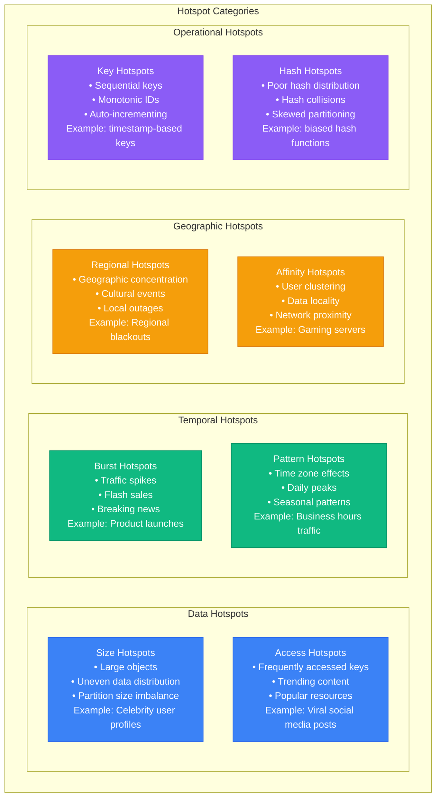
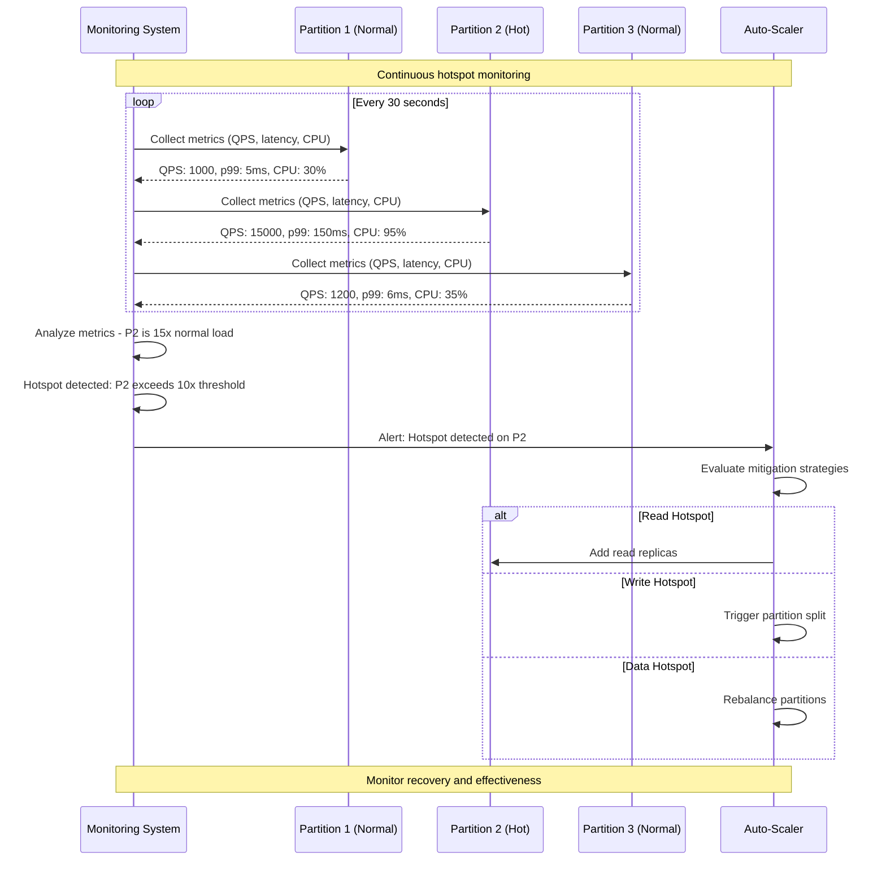
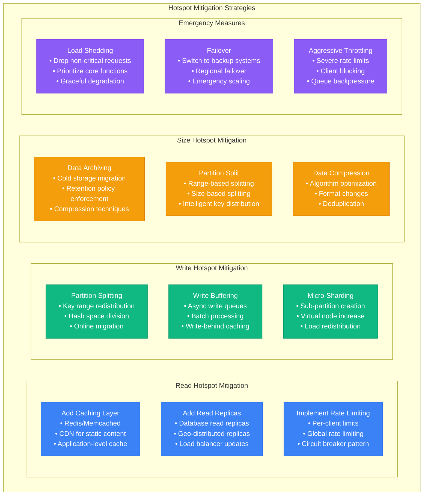

# Hotspot Detection and Mitigation

## Understanding Hotspots

Hotspots occur when certain partitions receive disproportionately high traffic, leading to performance bottlenecks and uneven resource utilization across a distributed system.

### Types of Hotspots



### Hotspot Detection Mechanisms



## Detection Strategies

### Real-Time Metrics Collection

```python
#!/usr/bin/env python3
# hotspot_detector.py

import time
import statistics
from typing import Dict, List, Tuple, Optional
from dataclasses import dataclass
from enum import Enum
import threading
from collections import defaultdict, deque

class HotspotType(Enum):
    READ_HOTSPOT = "read_hotspot"
    WRITE_HOTSPOT = "write_hotspot"
    SIZE_HOTSPOT = "size_hotspot"
    LATENCY_HOTSPOT = "latency_hotspot"
    ERROR_HOTSPOT = "error_hotspot"

@dataclass
class PartitionMetrics:
    partition_id: str
    timestamp: float
    requests_per_second: float
    read_qps: float
    write_qps: float
    avg_latency_ms: float
    p99_latency_ms: float
    cpu_usage_percent: float
    memory_usage_percent: float
    data_size_bytes: int
    error_rate_percent: float
    concurrent_connections: int

@dataclass
class HotspotAlert:
    partition_id: str
    hotspot_type: HotspotType
    severity: str  # low, medium, high, critical
    detected_at: float
    metrics: PartitionMetrics
    threshold_exceeded: str
    recommended_actions: List[str]

class HotspotDetector:
    def __init__(self, detection_config: Dict):
        self.config = detection_config
        self.metrics_history = defaultdict(lambda: deque(maxlen=100))
        self.active_hotspots = {}
        self.lock = threading.RLock()

    def add_metrics(self, metrics: PartitionMetrics):
        """Add new metrics for a partition"""
        with self.lock:
            self.metrics_history[metrics.partition_id].append(metrics)
            self._detect_hotspots(metrics)

    def _detect_hotspots(self, current_metrics: PartitionMetrics) -> List[HotspotAlert]:
        """Detect hotspots based on current metrics"""
        alerts = []
        partition_id = current_metrics.partition_id

        # Get baseline metrics for comparison
        baseline = self._calculate_baseline(partition_id)
        if not baseline:
            return alerts

        # Check each hotspot type
        alerts.extend(self._check_read_hotspot(current_metrics, baseline))
        alerts.extend(self._check_write_hotspot(current_metrics, baseline))
        alerts.extend(self._check_size_hotspot(current_metrics, baseline))
        alerts.extend(self._check_latency_hotspot(current_metrics, baseline))
        alerts.extend(self._check_error_hotspot(current_metrics, baseline))

        # Update active hotspots
        for alert in alerts:
            self.active_hotspots[f"{partition_id}:{alert.hotspot_type.value}"] = alert

        return alerts

    def _calculate_baseline(self, partition_id: str) -> Optional[Dict]:
        """Calculate baseline metrics from recent history"""
        history = self.metrics_history[partition_id]
        if len(history) < 10:  # Need enough history
            return None

        # Use metrics from 5-15 minutes ago as baseline (exclude recent spikes)
        baseline_metrics = [m for m in history if time.time() - m.timestamp > 300]
        if not baseline_metrics:
            return None

        return {
            'avg_qps': statistics.mean(m.requests_per_second for m in baseline_metrics),
            'avg_read_qps': statistics.mean(m.read_qps for m in baseline_metrics),
            'avg_write_qps': statistics.mean(m.write_qps for m in baseline_metrics),
            'avg_latency': statistics.mean(m.avg_latency_ms for m in baseline_metrics),
            'avg_p99_latency': statistics.mean(m.p99_latency_ms for m in baseline_metrics),
            'avg_cpu': statistics.mean(m.cpu_usage_percent for m in baseline_metrics),
            'avg_size': statistics.mean(m.data_size_bytes for m in baseline_metrics),
            'avg_error_rate': statistics.mean(m.error_rate_percent for m in baseline_metrics)
        }

    def _check_read_hotspot(self, metrics: PartitionMetrics, baseline: Dict) -> List[HotspotAlert]:
        """Check for read traffic hotspots"""
        alerts = []
        thresholds = self.config.get('read_hotspot', {})

        read_qps_multiplier = metrics.read_qps / max(baseline['avg_read_qps'], 1)
        absolute_threshold = thresholds.get('absolute_qps', 10000)

        if (read_qps_multiplier > thresholds.get('multiplier', 5.0) or
            metrics.read_qps > absolute_threshold):

            severity = self._calculate_severity(read_qps_multiplier, [2, 5, 10, 20])

            alerts.append(HotspotAlert(
                partition_id=metrics.partition_id,
                hotspot_type=HotspotType.READ_HOTSPOT,
                severity=severity,
                detected_at=time.time(),
                metrics=metrics,
                threshold_exceeded=f"Read QPS: {metrics.read_qps:.0f} ({read_qps_multiplier:.1f}x baseline)",
                recommended_actions=self._get_read_hotspot_actions(severity, metrics)
            ))

        return alerts

    def _check_write_hotspot(self, metrics: PartitionMetrics, baseline: Dict) -> List[HotspotAlert]:
        """Check for write traffic hotspots"""
        alerts = []
        thresholds = self.config.get('write_hotspot', {})

        write_qps_multiplier = metrics.write_qps / max(baseline['avg_write_qps'], 1)
        absolute_threshold = thresholds.get('absolute_qps', 5000)

        if (write_qps_multiplier > thresholds.get('multiplier', 3.0) or
            metrics.write_qps > absolute_threshold):

            severity = self._calculate_severity(write_qps_multiplier, [2, 3, 6, 12])

            alerts.append(HotspotAlert(
                partition_id=metrics.partition_id,
                hotspot_type=HotspotType.WRITE_HOTSPOT,
                severity=severity,
                detected_at=time.time(),
                metrics=metrics,
                threshold_exceeded=f"Write QPS: {metrics.write_qps:.0f} ({write_qps_multiplier:.1f}x baseline)",
                recommended_actions=self._get_write_hotspot_actions(severity, metrics)
            ))

        return alerts

    def _check_size_hotspot(self, metrics: PartitionMetrics, baseline: Dict) -> List[HotspotAlert]:
        """Check for data size hotspots"""
        alerts = []
        thresholds = self.config.get('size_hotspot', {})

        size_multiplier = metrics.data_size_bytes / max(baseline['avg_size'], 1)
        absolute_threshold = thresholds.get('absolute_bytes', 100 * 1024 * 1024 * 1024)  # 100GB

        if (size_multiplier > thresholds.get('multiplier', 3.0) or
            metrics.data_size_bytes > absolute_threshold):

            severity = self._calculate_severity(size_multiplier, [2, 3, 5, 10])

            alerts.append(HotspotAlert(
                partition_id=metrics.partition_id,
                hotspot_type=HotspotType.SIZE_HOTSPOT,
                severity=severity,
                detected_at=time.time(),
                metrics=metrics,
                threshold_exceeded=f"Data size: {metrics.data_size_bytes / (1024**3):.1f}GB ({size_multiplier:.1f}x baseline)",
                recommended_actions=self._get_size_hotspot_actions(severity, metrics)
            ))

        return alerts

    def _check_latency_hotspot(self, metrics: PartitionMetrics, baseline: Dict) -> List[HotspotAlert]:
        """Check for latency hotspots"""
        alerts = []
        thresholds = self.config.get('latency_hotspot', {})

        p99_multiplier = metrics.p99_latency_ms / max(baseline['avg_p99_latency'], 1)
        absolute_threshold = thresholds.get('absolute_p99_ms', 1000)

        if (p99_multiplier > thresholds.get('multiplier', 3.0) or
            metrics.p99_latency_ms > absolute_threshold):

            severity = self._calculate_severity(p99_multiplier, [2, 3, 5, 10])

            alerts.append(HotspotAlert(
                partition_id=metrics.partition_id,
                hotspot_type=HotspotType.LATENCY_HOTSPOT,
                severity=severity,
                detected_at=time.time(),
                metrics=metrics,
                threshold_exceeded=f"P99 latency: {metrics.p99_latency_ms:.1f}ms ({p99_multiplier:.1f}x baseline)",
                recommended_actions=self._get_latency_hotspot_actions(severity, metrics)
            ))

        return alerts

    def _check_error_hotspot(self, metrics: PartitionMetrics, baseline: Dict) -> List[HotspotAlert]:
        """Check for error rate hotspots"""
        alerts = []
        thresholds = self.config.get('error_hotspot', {})

        error_increase = metrics.error_rate_percent - baseline['avg_error_rate']
        absolute_threshold = thresholds.get('absolute_percent', 5.0)

        if (error_increase > thresholds.get('increase_threshold', 2.0) or
            metrics.error_rate_percent > absolute_threshold):

            # Error hotspots are always high severity
            severity = 'critical' if metrics.error_rate_percent > 10 else 'high'

            alerts.append(HotspotAlert(
                partition_id=metrics.partition_id,
                hotspot_type=HotspotType.ERROR_HOTSPOT,
                severity=severity,
                detected_at=time.time(),
                metrics=metrics,
                threshold_exceeded=f"Error rate: {metrics.error_rate_percent:.1f}% (+{error_increase:.1f}%)",
                recommended_actions=self._get_error_hotspot_actions(severity, metrics)
            ))

        return alerts

    def _calculate_severity(self, multiplier: float, thresholds: List[float]) -> str:
        """Calculate severity based on multiplier and thresholds"""
        if multiplier >= thresholds[3]:
            return 'critical'
        elif multiplier >= thresholds[2]:
            return 'high'
        elif multiplier >= thresholds[1]:
            return 'medium'
        else:
            return 'low'

    def _get_read_hotspot_actions(self, severity: str, metrics: PartitionMetrics) -> List[str]:
        """Get recommended actions for read hotspots"""
        actions = []

        if severity in ['low', 'medium']:
            actions.extend([
                "Add read replicas to distribute load",
                "Enable read-through caching",
                "Check for cache misses"
            ])
        elif severity == 'high':
            actions.extend([
                "Immediately add read replicas",
                "Enable aggressive caching",
                "Consider CDN for static content",
                "Implement request rate limiting"
            ])
        else:  # critical
            actions.extend([
                "Emergency: Add multiple read replicas",
                "Activate circuit breaker",
                "Implement immediate rate limiting",
                "Consider temporary load shedding"
            ])

        return actions

    def _get_write_hotspot_actions(self, severity: str, metrics: PartitionMetrics) -> List[str]:
        """Get recommended actions for write hotspots"""
        actions = []

        if severity in ['low', 'medium']:
            actions.extend([
                "Monitor for partition split needs",
                "Enable write batching",
                "Check key distribution"
            ])
        elif severity == 'high':
            actions.extend([
                "Plan partition split",
                "Implement write throttling",
                "Optimize write paths",
                "Check for write amplification"
            ])
        else:  # critical
            actions.extend([
                "Emergency: Split partition immediately",
                "Implement aggressive write throttling",
                "Consider temporary write blocking",
                "Scale up partition resources"
            ])

        return actions

    def _get_size_hotspot_actions(self, severity: str, metrics: PartitionMetrics) -> List[str]:
        """Get recommended actions for size hotspots"""
        actions = []

        if severity in ['low', 'medium']:
            actions.extend([
                "Plan data compaction",
                "Review data retention policies",
                "Consider partition split"
            ])
        elif severity == 'high':
            actions.extend([
                "Schedule partition split",
                "Implement data archiving",
                "Optimize storage format",
                "Add storage capacity"
            ])
        else:  # critical
            actions.extend([
                "Emergency: Split partition now",
                "Immediate data archiving",
                "Scale up storage urgently",
                "Consider emergency cleanup"
            ])

        return actions

    def _get_latency_hotspot_actions(self, severity: str, metrics: PartitionMetrics) -> List[str]:
        """Get recommended actions for latency hotspots"""
        actions = []

        if severity in ['low', 'medium']:
            actions.extend([
                "Optimize query performance",
                "Check for lock contention",
                "Review indexing strategy"
            ])
        elif severity == 'high':
            actions.extend([
                "Scale up partition resources",
                "Implement query timeouts",
                "Add performance monitoring",
                "Consider partition split"
            ])
        else:  # critical
            actions.extend([
                "Emergency: Scale resources immediately",
                "Implement aggressive timeouts",
                "Consider load shedding",
                "Emergency partition split"
            ])

        return actions

    def _get_error_hotspot_actions(self, severity: str, metrics: PartitionMetrics) -> List[str]:
        """Get recommended actions for error hotspots"""
        return [
            "Investigate error causes immediately",
            "Check system health",
            "Review recent deployments",
            "Implement circuit breaker",
            "Consider failover to backup"
        ]

    def get_active_hotspots(self) -> Dict[str, HotspotAlert]:
        """Get currently active hotspots"""
        with self.lock:
            # Remove old hotspots (older than 10 minutes)
            current_time = time.time()
            expired_keys = [
                key for key, alert in self.active_hotspots.items()
                if current_time - alert.detected_at > 600
            ]

            for key in expired_keys:
                del self.active_hotspots[key]

            return self.active_hotspots.copy()

    def get_hotspot_summary(self) -> Dict:
        """Get summary of hotspot detection"""
        active = self.get_active_hotspots()

        summary = {
            'total_active_hotspots': len(active),
            'by_type': defaultdict(int),
            'by_severity': defaultdict(int),
            'affected_partitions': set(),
            'recommendations': set()
        }

        for alert in active.values():
            summary['by_type'][alert.hotspot_type.value] += 1
            summary['by_severity'][alert.severity] += 1
            summary['affected_partitions'].add(alert.partition_id)
            summary['recommendations'].update(alert.recommended_actions)

        summary['affected_partitions'] = list(summary['affected_partitions'])
        summary['recommendations'] = list(summary['recommendations'])

        return summary

# Example usage
if __name__ == "__main__":
    # Configuration for hotspot detection
    config = {
        'read_hotspot': {
            'multiplier': 5.0,
            'absolute_qps': 10000
        },
        'write_hotspot': {
            'multiplier': 3.0,
            'absolute_qps': 5000
        },
        'size_hotspot': {
            'multiplier': 3.0,
            'absolute_bytes': 100 * 1024 * 1024 * 1024  # 100GB
        },
        'latency_hotspot': {
            'multiplier': 3.0,
            'absolute_p99_ms': 1000
        },
        'error_hotspot': {
            'increase_threshold': 2.0,
            'absolute_percent': 5.0
        }
    }

    detector = HotspotDetector(config)

    # Simulate metrics collection
    normal_partition = PartitionMetrics(
        partition_id="partition-1",
        timestamp=time.time(),
        requests_per_second=1000,
        read_qps=800,
        write_qps=200,
        avg_latency_ms=5,
        p99_latency_ms=15,
        cpu_usage_percent=30,
        memory_usage_percent=40,
        data_size_bytes=10 * 1024 * 1024 * 1024,  # 10GB
        error_rate_percent=0.1,
        concurrent_connections=100
    )

    hot_partition = PartitionMetrics(
        partition_id="partition-2",
        timestamp=time.time(),
        requests_per_second=15000,
        read_qps=12000,
        write_qps=3000,
        avg_latency_ms=50,
        p99_latency_ms=200,
        cpu_usage_percent=95,
        memory_usage_percent=85,
        data_size_bytes=50 * 1024 * 1024 * 1024,  # 50GB
        error_rate_percent=5.0,
        concurrent_connections=500
    )

    # Add baseline metrics
    for i in range(20):
        detector.add_metrics(normal_partition)
        time.sleep(0.1)

    # Add hot partition metrics
    detector.add_metrics(hot_partition)

    # Check for hotspots
    summary = detector.get_hotspot_summary()
    print("Hotspot Detection Summary:")
    print(f"Active hotspots: {summary['total_active_hotspots']}")
    print(f"By type: {dict(summary['by_type'])}")
    print(f"By severity: {dict(summary['by_severity'])}")
    print(f"Affected partitions: {summary['affected_partitions']}")
    print(f"Recommendations: {summary['recommendations'][:5]}")  # Show first 5
```

## Mitigation Techniques

### Immediate Response Strategies



### Automated Mitigation Implementation

```python
# Automated hotspot mitigation system
import asyncio
from typing import Dict, List
from enum import Enum

class MitigationAction(Enum):
    ADD_READ_REPLICA = "add_read_replica"
    ADD_CACHE_LAYER = "add_cache_layer"
    SPLIT_PARTITION = "split_partition"
    IMPLEMENT_THROTTLING = "implement_throttling"
    SCALE_RESOURCES = "scale_resources"
    ENABLE_CIRCUIT_BREAKER = "enable_circuit_breaker"
    ARCHIVE_DATA = "archive_data"
    LOAD_SHEDDING = "load_shedding"

class AutoMitigationEngine:
    def __init__(self, cloud_provider_api, database_api, cache_api):
        self.cloud_api = cloud_provider_api
        self.db_api = database_api
        self.cache_api = cache_api
        self.active_mitigations = {}

    async def execute_mitigation(self, alert: HotspotAlert) -> Dict:
        """Execute appropriate mitigation based on hotspot type and severity"""
        mitigation_plan = self._create_mitigation_plan(alert)
        results = []

        for action in mitigation_plan['actions']:
            try:
                result = await self._execute_action(action, alert)
                results.append(result)
            except Exception as e:
                results.append({
                    'action': action.value,
                    'status': 'failed',
                    'error': str(e)
                })

        return {
            'alert_id': f"{alert.partition_id}:{alert.hotspot_type.value}",
            'mitigation_plan': mitigation_plan,
            'execution_results': results,
            'timestamp': time.time()
        }

    def _create_mitigation_plan(self, alert: HotspotAlert) -> Dict:
        """Create mitigation plan based on hotspot characteristics"""
        plan = {
            'primary_actions': [],
            'secondary_actions': [],
            'emergency_actions': [],
            'estimated_time': 0,
            'risk_level': 'low'
        }

        if alert.hotspot_type == HotspotType.READ_HOTSPOT:
            if alert.severity in ['low', 'medium']:
                plan['primary_actions'] = [
                    MitigationAction.ADD_CACHE_LAYER,
                    MitigationAction.ADD_READ_REPLICA
                ]
                plan['estimated_time'] = 300  # 5 minutes
            elif alert.severity == 'high':
                plan['primary_actions'] = [
                    MitigationAction.ADD_READ_REPLICA,
                    MitigationAction.IMPLEMENT_THROTTLING
                ]
                plan['secondary_actions'] = [MitigationAction.ADD_CACHE_LAYER]
                plan['estimated_time'] = 180  # 3 minutes
                plan['risk_level'] = 'medium'
            else:  # critical
                plan['primary_actions'] = [MitigationAction.IMPLEMENT_THROTTLING]
                plan['emergency_actions'] = [
                    MitigationAction.ENABLE_CIRCUIT_BREAKER,
                    MitigationAction.LOAD_SHEDDING
                ]
                plan['estimated_time'] = 60  # 1 minute
                plan['risk_level'] = 'high'

        elif alert.hotspot_type == HotspotType.WRITE_HOTSPOT:
            if alert.severity in ['low', 'medium']:
                plan['primary_actions'] = [MitigationAction.SCALE_RESOURCES]
                plan['secondary_actions'] = [MitigationAction.SPLIT_PARTITION]
                plan['estimated_time'] = 600  # 10 minutes
            elif alert.severity == 'high':
                plan['primary_actions'] = [
                    MitigationAction.IMPLEMENT_THROTTLING,
                    MitigationAction.SPLIT_PARTITION
                ]
                plan['estimated_time'] = 900  # 15 minutes
                plan['risk_level'] = 'medium'
            else:  # critical
                plan['primary_actions'] = [MitigationAction.IMPLEMENT_THROTTLING]
                plan['emergency_actions'] = [
                    MitigationAction.SPLIT_PARTITION,
                    MitigationAction.LOAD_SHEDDING
                ]
                plan['estimated_time'] = 300  # 5 minutes
                plan['risk_level'] = 'high'

        elif alert.hotspot_type == HotspotType.SIZE_HOTSPOT:
            plan['primary_actions'] = [
                MitigationAction.ARCHIVE_DATA,
                MitigationAction.SPLIT_PARTITION
            ]
            plan['estimated_time'] = 1800  # 30 minutes
            plan['risk_level'] = 'low'

        return plan

    async def _execute_action(self, action: MitigationAction, alert: HotspotAlert) -> Dict:
        """Execute a specific mitigation action"""
        partition_id = alert.partition_id

        if action == MitigationAction.ADD_READ_REPLICA:
            return await self._add_read_replica(partition_id)
        elif action == MitigationAction.ADD_CACHE_LAYER:
            return await self._add_cache_layer(partition_id)
        elif action == MitigationAction.SPLIT_PARTITION:
            return await self._split_partition(partition_id)
        elif action == MitigationAction.IMPLEMENT_THROTTLING:
            return await self._implement_throttling(partition_id, alert.severity)
        elif action == MitigationAction.SCALE_RESOURCES:
            return await self._scale_resources(partition_id)
        elif action == MitigationAction.ENABLE_CIRCUIT_BREAKER:
            return await self._enable_circuit_breaker(partition_id)
        elif action == MitigationAction.ARCHIVE_DATA:
            return await self._archive_data(partition_id)
        elif action == MitigationAction.LOAD_SHEDDING:
            return await self._enable_load_shedding(partition_id, alert.severity)
        else:
            raise ValueError(f"Unknown action: {action}")

    async def _add_read_replica(self, partition_id: str) -> Dict:
        """Add read replica for partition"""
        # Implementation would interact with database API
        await asyncio.sleep(2)  # Simulate API call
        replica_id = f"{partition_id}-replica-{int(time.time())}"

        return {
            'action': 'add_read_replica',
            'status': 'success',
            'replica_id': replica_id,
            'estimated_ready_time': 300  # 5 minutes
        }

    async def _add_cache_layer(self, partition_id: str) -> Dict:
        """Add caching layer for partition"""
        await asyncio.sleep(1)  # Simulate API call
        cache_id = f"{partition_id}-cache-{int(time.time())}"

        return {
            'action': 'add_cache_layer',
            'status': 'success',
            'cache_id': cache_id,
            'cache_type': 'redis',
            'estimated_ready_time': 120  # 2 minutes
        }

    async def _split_partition(self, partition_id: str) -> Dict:
        """Split partition to distribute load"""
        await asyncio.sleep(5)  # Simulate complex operation
        new_partitions = [f"{partition_id}-split-1", f"{partition_id}-split-2"]

        return {
            'action': 'split_partition',
            'status': 'in_progress',
            'original_partition': partition_id,
            'new_partitions': new_partitions,
            'estimated_completion_time': 900  # 15 minutes
        }

    async def _implement_throttling(self, partition_id: str, severity: str) -> Dict:
        """Implement request throttling"""
        rate_limits = {
            'low': 1000,
            'medium': 500,
            'high': 200,
            'critical': 50
        }

        limit = rate_limits.get(severity, 100)
        await asyncio.sleep(0.5)  # Simulate configuration

        return {
            'action': 'implement_throttling',
            'status': 'success',
            'rate_limit_per_second': limit,
            'partition_id': partition_id,
            'estimated_effect_time': 30  # 30 seconds
        }

    async def _scale_resources(self, partition_id: str) -> Dict:
        """Scale up partition resources"""
        await asyncio.sleep(3)  # Simulate scaling operation

        return {
            'action': 'scale_resources',
            'status': 'success',
            'old_instance_type': 'r5.large',
            'new_instance_type': 'r5.xlarge',
            'estimated_ready_time': 600  # 10 minutes
        }

    async def _enable_circuit_breaker(self, partition_id: str) -> Dict:
        """Enable circuit breaker pattern"""
        await asyncio.sleep(0.2)  # Quick configuration change

        return {
            'action': 'enable_circuit_breaker',
            'status': 'success',
            'failure_threshold': 50,  # Percent
            'timeout_seconds': 30,
            'partition_id': partition_id
        }

    async def _archive_data(self, partition_id: str) -> Dict:
        """Archive old data to reduce partition size"""
        await asyncio.sleep(10)  # Simulate data movement

        return {
            'action': 'archive_data',
            'status': 'in_progress',
            'archive_location': f"s3://archives/{partition_id}/",
            'estimated_completion_time': 1800,  # 30 minutes
            'expected_size_reduction': '30%'
        }

    async def _enable_load_shedding(self, partition_id: str, severity: str) -> Dict:
        """Enable load shedding to protect system"""
        shed_percentages = {
            'high': 20,
            'critical': 50
        }

        shed_percent = shed_percentages.get(severity, 10)
        await asyncio.sleep(0.1)  # Quick configuration

        return {
            'action': 'enable_load_shedding',
            'status': 'success',
            'shed_percentage': shed_percent,
            'priority_preserved': ['authentication', 'payment'],
            'partition_id': partition_id
        }

# Example usage
async def main():
    # Mock APIs
    cloud_api = None
    db_api = None
    cache_api = None

    engine = AutoMitigationEngine(cloud_api, db_api, cache_api)

    # Create a critical read hotspot alert
    critical_alert = HotspotAlert(
        partition_id="partition-hot-1",
        hotspot_type=HotspotType.READ_HOTSPOT,
        severity="critical",
        detected_at=time.time(),
        metrics=None,  # Would contain actual metrics
        threshold_exceeded="Read QPS: 50,000 (25x baseline)",
        recommended_actions=[]
    )

    # Execute mitigation
    result = await engine.execute_mitigation(critical_alert)
    print("Mitigation execution result:")
    print(f"Alert ID: {result['alert_id']}")
    print(f"Plan: {result['mitigation_plan']}")
    print(f"Results: {result['execution_results']}")

if __name__ == "__main__":
    import time
    asyncio.run(main())
```

This comprehensive guide provides both the detection mechanisms and automated mitigation strategies needed to handle hotspots effectively in production distributed systems.