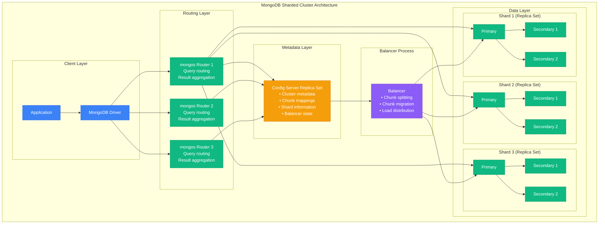
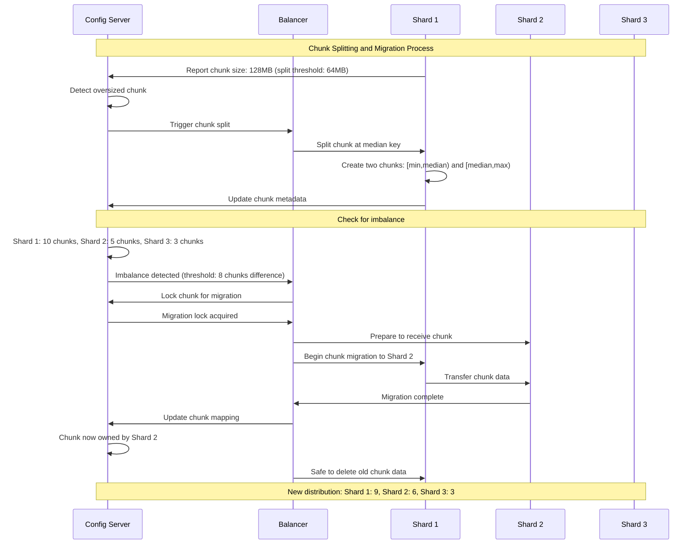

# MongoDB Sharding Architecture

## Overview of MongoDB Sharding

MongoDB uses horizontal sharding to distribute data across multiple shards (replica sets) using configurable shard keys, with automatic chunk splitting and migration managed by the sharding infrastructure.

### MongoDB Sharding Components



## Shard Key Strategies

### Shard Key Selection Patterns

```mermaid
graph TB
    subgraph "MongoDB Shard Key Strategies"
        subgraph "Ranged Sharding"
            RANGE_GOOD[Good Range Keys<br/>• Even distribution<br/>• High cardinality<br/>• Non-monotonic<br/>Example: email, user_id]
            RANGE_BAD[Bad Range Keys<br/>• Low cardinality<br/>• Monotonic increase<br/>• Hotspot prone<br/>Example: timestamp, _id]
        end

        subgraph "Hashed Sharding"
            HASH_GOOD[Hashed Key Benefits<br/>• Automatic distribution<br/>• Prevents hotspots<br/>• Works with any key<br/>Example: hashed _id]
            HASH_BAD[Hashed Key Limitations<br/>• No range queries<br/>• Random distribution<br/>• Less intuitive<br/>Loss of locality]
        end

        subgraph "Compound Shard Keys"
            COMPOUND[Compound Keys<br/>• Multiple fields<br/>• Hierarchical distribution<br/>• Better query targeting<br/>Example: {country: 1, city: 1, user_id: 1}]
        end

        subgraph "Zone Sharding"
            ZONES[Zone-based Sharding<br/>• Geographic distribution<br/>• Hardware-based zones<br/>• Compliance requirements<br/>Example: EU vs US data]
        end
    end

    RANGE_BAD --> RANGE_GOOD
    RANGE_GOOD --> HASH_GOOD
    HASH_BAD --> HASH_GOOD
    HASH_GOOD --> COMPOUND
    COMPOUND --> ZONES

    %% Apply colors
    classDef edgeStyle fill:#3B82F6,stroke:#2563EB,color:#fff
    classDef serviceStyle fill:#10B981,stroke:#059669,color:#fff
    classDef stateStyle fill:#F59E0B,stroke:#D97706,color:#fff
    classDef controlStyle fill:#8B5CF6,stroke:#7C3AED,color:#fff

    class RANGE_BAD,HASH_BAD edgeStyle
    class RANGE_GOOD,HASH_GOOD serviceStyle
    class COMPOUND stateStyle
    class ZONES controlStyle
```

### Chunk Distribution and Splitting



## Sharding Configuration and Setup

### MongoDB Sharding Setup Scripts

```javascript
// MongoDB sharding setup commands

// 1. Configure replica sets for config servers
rs.initiate({
  _id: "configReplSet",
  configsvr: true,
  members: [
    { _id: 0, host: "config1.mongodb.com:27019" },
    { _id: 1, host: "config2.mongodb.com:27019" },
    { _id: 2, host: "config3.mongodb.com:27019" }
  ]
});

// 2. Configure replica sets for each shard
// Shard 1
rs.initiate({
  _id: "shard1ReplSet",
  members: [
    { _id: 0, host: "shard1-primary.mongodb.com:27018" },
    { _id: 1, host: "shard1-secondary1.mongodb.com:27018" },
    { _id: 2, host: "shard1-secondary2.mongodb.com:27018" }
  ]
});

// Shard 2
rs.initiate({
  _id: "shard2ReplSet",
  members: [
    { _id: 0, host: "shard2-primary.mongodb.com:27018" },
    { _id: 1, host: "shard2-secondary1.mongodb.com:27018" },
    { _id: 2, host: "shard2-secondary2.mongodb.com:27018" }
  ]
});

// 3. Connect to mongos and add shards
sh.addShard("shard1ReplSet/shard1-primary.mongodb.com:27018");
sh.addShard("shard2ReplSet/shard2-primary.mongodb.com:27018");

// 4. Enable sharding on database
sh.enableSharding("ecommerce");

// 5. Create shard key indexes
use ecommerce;
db.users.createIndex({ "email": 1 });
db.orders.createIndex({ "customerId": 1, "orderDate": 1 });
db.products.createIndex({ "category": 1, "productId": 1 });

// 6. Shard collections with different strategies

// Range-based sharding on email
sh.shardCollection("ecommerce.users", { "email": 1 });

// Compound shard key for orders
sh.shardCollection("ecommerce.orders", { "customerId": 1, "orderDate": 1 });

// Hashed sharding for even distribution
sh.shardCollection("ecommerce.products", { "_id": "hashed" });

// 7. Configure chunk size (default: 64MB)
use config;
db.settings.save({ _id: "chunksize", value: 64 });

// 8. Enable/disable balancer
sh.startBalancer();
// sh.stopBalancer(); // Use during maintenance windows
```

### Shard Key Design Examples

```javascript
// Good shard key examples

// 1. User collection - email-based sharding
db.users.createIndex({ "email": 1 });
sh.shardCollection("app.users", { "email": 1 });

// Benefits:
// - High cardinality
// - Even distribution
// - Natural query pattern

// 2. Time-series data - compound key with bucketing
db.sensor_data.createIndex({ "deviceId": 1, "date": 1, "timestamp": 1 });
sh.shardCollection("iot.sensor_data", { "deviceId": 1, "date": 1 });

// Benefits:
// - Device-based distribution
// - Time-based locality
// - Efficient range queries

// 3. Multi-tenant application
db.tenant_data.createIndex({ "tenantId": 1, "userId": 1 });
sh.shardCollection("saas.tenant_data", { "tenantId": 1, "userId": 1 });

// Benefits:
// - Tenant isolation
// - Predictable distribution
// - Easy tenant migrations

// 4. Geographic distribution
db.user_profiles.createIndex({ "country": 1, "region": 1, "userId": 1 });
sh.shardCollection("global.user_profiles", { "country": 1, "region": 1, "userId": 1 });

// Use with zone sharding for data locality
sh.addShardTag("shard1", "US");
sh.addShardTag("shard2", "EU");
sh.addTagRange("global.user_profiles",
               { "country": "US", "region": MinKey, "userId": MinKey },
               { "country": "US", "region": MaxKey, "userId": MaxKey },
               "US");

// Bad shard key examples (avoid these)

// 1. Monotonic timestamp - creates hotspots
sh.shardCollection("logs.events", { "timestamp": 1 }); // BAD

// 2. Low cardinality - uneven distribution
sh.shardCollection("products.catalog", { "category": 1 }); // BAD

// 3. ObjectId as range key - monotonic
sh.shardCollection("content.posts", { "_id": 1 }); // BAD
// Better: use hashed
sh.shardCollection("content.posts", { "_id": "hashed" }); // GOOD
```

## Balancer and Chunk Management

### Chunk Lifecycle Management

```python
#!/usr/bin/env python3
# mongodb_chunk_analyzer.py

from pymongo import MongoClient
from pymongo.errors import ConnectionFailure
import time
from typing import Dict, List, Tuple
from datetime import datetime, timedelta

class MongoDBChunkAnalyzer:
    def __init__(self, mongos_uri: str):
        self.client = MongoClient(mongos_uri)
        self.config_db = self.client.config

    def get_chunk_distribution(self, database: str, collection: str) -> Dict:
        """Analyze chunk distribution across shards"""
        chunks = list(self.config_db.chunks.find({
            "ns": f"{database}.{collection}"
        }))

        shard_chunks = {}
        chunk_details = []

        for chunk in chunks:
            shard = chunk['shard']
            if shard not in shard_chunks:
                shard_chunks[shard] = []

            chunk_info = {
                'id': chunk['_id'],
                'min': chunk['min'],
                'max': chunk['max'],
                'shard': shard,
                'lastmod': chunk.get('lastmod', 'unknown')
            }

            shard_chunks[shard].append(chunk_info)
            chunk_details.append(chunk_info)

        return {
            'total_chunks': len(chunks),
            'chunks_per_shard': {shard: len(chunks) for shard, chunks in shard_chunks.items()},
            'shard_chunks': shard_chunks,
            'all_chunks': chunk_details
        }

    def get_balancer_status(self) -> Dict:
        """Get current balancer status and settings"""
        balancer_status = self.client.admin.command("balancerStatus")

        # Get balancer settings
        balancer_config = self.config_db.settings.find_one({"_id": "balancer"})

        # Get chunk size setting
        chunk_size_config = self.config_db.settings.find_one({"_id": "chunksize"})
        chunk_size = chunk_size_config.get('value', 64) if chunk_size_config else 64

        return {
            'balancer_running': balancer_status.get('inBalancerRound', False),
            'mode': balancer_status.get('mode', 'unknown'),
            'balancer_settings': balancer_config,
            'chunk_size_mb': chunk_size,
            'num_balancer_rounds': balancer_status.get('numBalancerRounds', 0)
        }

    def analyze_chunk_sizes(self, database: str, collection: str) -> Dict:
        """Analyze actual chunk sizes by sampling data"""
        db = self.client[database]
        coll = db[collection]

        chunks_info = self.get_chunk_distribution(database, collection)

        chunk_sizes = []
        large_chunks = []
        small_chunks = []

        for chunk in chunks_info['all_chunks'][:10]:  # Sample first 10 chunks
            # Estimate chunk size by counting documents
            try:
                min_query = chunk['min']
                max_query = chunk['max']

                # Build query for chunk range
                if '$minKey' in str(min_query) and '$maxKey' in str(max_query):
                    # Full collection chunk
                    count = coll.estimated_document_count()
                else:
                    # Range query for chunk
                    query = {}
                    for key, value in min_query.items():
                        if '$minKey' not in str(value):
                            query[key] = {"$gte": value}

                    for key, value in max_query.items():
                        if '$maxKey' not in str(value):
                            if key in query:
                                query[key]["$lt"] = value
                            else:
                                query[key] = {"$lt": value}

                    count = coll.count_documents(query)

                # Estimate size (rough approximation)
                avg_doc_size = 1024  # 1KB average document size
                estimated_size_mb = (count * avg_doc_size) / (1024 * 1024)

                chunk_size_info = {
                    'chunk_id': chunk['id'],
                    'shard': chunk['shard'],
                    'estimated_docs': count,
                    'estimated_size_mb': estimated_size_mb
                }

                chunk_sizes.append(chunk_size_info)

                # Categorize chunks
                if estimated_size_mb > 100:  # > 100MB
                    large_chunks.append(chunk_size_info)
                elif estimated_size_mb < 1:  # < 1MB
                    small_chunks.append(chunk_size_info)

            except Exception as e:
                print(f"Error analyzing chunk {chunk['id']}: {e}")

        return {
            'analyzed_chunks': len(chunk_sizes),
            'chunk_sizes': chunk_sizes,
            'large_chunks': large_chunks,
            'small_chunks': small_chunks,
            'avg_size_mb': sum(c['estimated_size_mb'] for c in chunk_sizes) / len(chunk_sizes) if chunk_sizes else 0
        }

    def get_migration_history(self, hours: int = 24) -> List[Dict]:
        """Get recent chunk migration history"""
        since_time = datetime.utcnow() - timedelta(hours=hours)

        migrations = list(self.config_db.changelog.find({
            "what": {"$in": ["moveChunk.start", "moveChunk.commit", "split"]},
            "time": {"$gte": since_time}
        }).sort("time", -1))

        return migrations

    def check_shard_imbalance(self, database: str, collection: str, threshold: int = 8) -> Dict:
        """Check for shard imbalance that might trigger migrations"""
        chunk_dist = self.get_chunk_distribution(database, collection)
        chunks_per_shard = chunk_dist['chunks_per_shard']

        if not chunks_per_shard:
            return {"balanced": True, "reason": "No chunks found"}

        min_chunks = min(chunks_per_shard.values())
        max_chunks = max(chunks_per_shard.values())
        imbalance = max_chunks - min_chunks

        is_balanced = imbalance <= threshold

        return {
            "balanced": is_balanced,
            "imbalance": imbalance,
            "threshold": threshold,
            "min_chunks": min_chunks,
            "max_chunks": max_chunks,
            "chunks_per_shard": chunks_per_shard,
            "recommendation": "Consider manual balancing" if not is_balanced else "Cluster is balanced"
        }

    def monitor_balancer_activity(self, duration_minutes: int = 10):
        """Monitor balancer activity for a specified duration"""
        print(f"Monitoring balancer activity for {duration_minutes} minutes...")

        start_time = time.time()
        end_time = start_time + (duration_minutes * 60)

        initial_status = self.get_balancer_status()
        print(f"Initial balancer status: {initial_status['mode']}")
        print(f"Balancer running: {initial_status['balancer_running']}")

        migration_count = 0
        last_round_count = initial_status['num_balancer_rounds']

        while time.time() < end_time:
            current_status = self.get_balancer_status()
            current_rounds = current_status['num_balancer_rounds']

            if current_rounds > last_round_count:
                migration_count += (current_rounds - last_round_count)
                print(f"Balancer rounds completed: {current_rounds} (+{current_rounds - last_round_count})")
                last_round_count = current_rounds

            # Check for recent migrations
            recent_migrations = self.get_migration_history(hours=1)
            recent_move_chunks = [m for m in recent_migrations if 'moveChunk' in m['what']]

            if recent_move_chunks:
                latest_migration = recent_move_chunks[0]
                print(f"Recent migration: {latest_migration['what']} at {latest_migration['time']}")

            time.sleep(30)  # Check every 30 seconds

        print(f"Monitoring complete. Total migration rounds observed: {migration_count}")

    def generate_sharding_report(self, database: str, collection: str) -> Dict:
        """Generate comprehensive sharding report"""
        report = {
            'timestamp': datetime.utcnow().isoformat(),
            'database': database,
            'collection': collection
        }

        # Chunk distribution
        report['chunk_distribution'] = self.get_chunk_distribution(database, collection)

        # Balancer status
        report['balancer_status'] = self.get_balancer_status()

        # Balance analysis
        report['balance_analysis'] = self.check_shard_imbalance(database, collection)

        # Recent migrations
        report['recent_migrations'] = self.get_migration_history(hours=24)

        # Chunk size analysis
        report['chunk_analysis'] = self.analyze_chunk_sizes(database, collection)

        return report

# Example usage
def main():
    # Connect to mongos
    analyzer = MongoDBChunkAnalyzer("mongodb://mongos1.example.com:27017/")

    try:
        # Generate comprehensive report
        report = analyzer.generate_sharding_report("ecommerce", "orders")

        print("=== MongoDB Sharding Report ===")
        print(f"Database: {report['database']}")
        print(f"Collection: {report['collection']}")
        print(f"Generated: {report['timestamp']}")

        # Chunk distribution
        chunk_dist = report['chunk_distribution']
        print(f"\nChunk Distribution:")
        print(f"  Total chunks: {chunk_dist['total_chunks']}")
        for shard, count in chunk_dist['chunks_per_shard'].items():
            print(f"  {shard}: {count} chunks")

        # Balance status
        balance = report['balance_analysis']
        print(f"\nBalance Analysis:")
        print(f"  Balanced: {balance['balanced']}")
        print(f"  Imbalance: {balance['imbalance']} chunks")
        print(f"  Recommendation: {balance['recommendation']}")

        # Balancer status
        balancer = report['balancer_status']
        print(f"\nBalancer Status:")
        print(f"  Running: {balancer['balancer_running']}")
        print(f"  Mode: {balancer['mode']}")
        print(f"  Chunk size: {balancer['chunk_size_mb']}MB")

        # Recent activity
        migrations = report['recent_migrations']
        print(f"\nRecent Activity:")
        print(f"  Migrations in last 24h: {len(migrations)}")

        if migrations:
            latest = migrations[0]
            print(f"  Latest: {latest['what']} at {latest['time']}")

    except ConnectionFailure as e:
        print(f"Failed to connect to MongoDB: {e}")
    except Exception as e:
        print(f"Error analyzing sharding: {e}")

if __name__ == "__main__":
    main()
```

## Zone Sharding and Geographic Distribution

### Zone-Based Sharding Configuration

```mermaid
graph TB
    subgraph "MongoDB Zone Sharding"
        subgraph "US Region"
            US_SHARD1[Shard US-1<br/>Tags: US, East]
            US_SHARD2[Shard US-2<br/>Tags: US, West]
        end

        subgraph "EU Region"
            EU_SHARD1[Shard EU-1<br/>Tags: EU, West]
            EU_SHARD2[Shard EU-2<br/>Tags: EU, Central]
        end

        subgraph "Asia Region"
            ASIA_SHARD1[Shard ASIA-1<br/>Tags: ASIA, Southeast]
        end

        subgraph "Data Routing Rules"
            US_RULE[US Users<br/>country: "US"<br/>→ US Region Shards]
            EU_RULE[EU Users<br/>country: "DE", "FR", "UK"<br/>→ EU Region Shards]
            ASIA_RULE[Asia Users<br/>country: "SG", "JP"<br/>→ Asia Region Shards]
        end

        subgraph "Compliance Benefits"
            GDPR[GDPR Compliance<br/>EU data stays in EU]
            LATENCY[Low Latency<br/>Regional data access]
            SOVEREIGNTY[Data Sovereignty<br/>Country-specific rules]
        end
    end

    US_RULE --> US_SHARD1
    US_RULE --> US_SHARD2
    EU_RULE --> EU_SHARD1
    EU_RULE --> EU_SHARD2
    ASIA_RULE --> ASIA_SHARD1

    US_SHARD1 --> LATENCY
    EU_SHARD1 --> GDPR
    ASIA_SHARD1 --> SOVEREIGNTY

    %% Apply colors
    classDef edgeStyle fill:#3B82F6,stroke:#2563EB,color:#fff
    classDef serviceStyle fill:#10B981,stroke:#059669,color:#fff
    classDef stateStyle fill:#F59E0B,stroke:#D97706,color:#fff
    classDef controlStyle fill:#8B5CF6,stroke:#7C3AED,color:#fff

    class US_RULE,EU_RULE,ASIA_RULE edgeStyle
    class US_SHARD1,US_SHARD2,EU_SHARD1,EU_SHARD2,ASIA_SHARD1 serviceStyle
    class GDPR,LATENCY,SOVEREIGNTY stateStyle
```

### Zone Sharding Implementation

```javascript
// Zone sharding configuration

// 1. Add shard tags for geographic zones
sh.addShardTag("shard-us-east-1", "US-EAST");
sh.addShardTag("shard-us-west-1", "US-WEST");
sh.addShardTag("shard-eu-west-1", "EU-WEST");
sh.addShardTag("shard-asia-se-1", "ASIA-SOUTHEAST");

// 2. Create shard key for geographic distribution
db.user_profiles.createIndex({ "country": 1, "state": 1, "userId": 1 });
sh.shardCollection("app.user_profiles", { "country": 1, "state": 1, "userId": 1 });

// 3. Define zone ranges for different regions

// US users
sh.addTagRange("app.user_profiles",
    { "country": "US", "state": "CA", "userId": MinKey },
    { "country": "US", "state": "NV", "userId": MaxKey },
    "US-WEST");

sh.addTagRange("app.user_profiles",
    { "country": "US", "state": "NY", "userId": MinKey },
    { "country": "US", "state": "VA", "userId": MaxKey },
    "US-EAST");

// EU users
sh.addTagRange("app.user_profiles",
    { "country": "DE", "state": MinKey, "userId": MinKey },
    { "country": "GB", "state": MaxKey, "userId": MaxKey },
    "EU-WEST");

// Asia users
sh.addTagRange("app.user_profiles",
    { "country": "SG", "state": MinKey, "userId": MinKey },
    { "country": "TH", "state": MaxKey, "userId": MaxKey },
    "ASIA-SOUTHEAST");

// 4. Monitor zone distribution
db.chunks.aggregate([
    { $match: { "ns": "app.user_profiles" } },
    { $group: { _id: "$shard", count: { $sum: 1 } } }
]);

// 5. Check tag ranges
sh.status();
```

## Performance Optimization and Monitoring

### MongoDB Sharding Metrics

```yaml
# MongoDB sharding monitoring configuration
mongodb_sharding_metrics:
  cluster_metrics:
    - name: mongodb_sharding_chunks_total
      description: "Total number of chunks across all shards"
      query: 'sum(mongodb_chunks_total) by (cluster)'

    - name: mongodb_sharding_chunk_migrations_total
      description: "Total chunk migrations"
      query: 'increase(mongodb_chunk_migrations_total[1h])'

    - name: mongodb_sharding_balancer_enabled
      description: "Balancer enabled status"
      query: 'mongodb_balancer_enabled'

  shard_metrics:
    - name: mongodb_shard_chunks_count
      description: "Number of chunks per shard"
      query: 'mongodb_chunks_total by (shard)'

    - name: mongodb_shard_size_bytes
      description: "Data size per shard"
      query: 'mongodb_shard_data_size_bytes by (shard)'

    - name: mongodb_shard_operations_rate
      description: "Operations per second per shard"
      query: 'rate(mongodb_operations_total[5m]) by (shard)'

  query_metrics:
    - name: mongodb_query_targeting_efficiency
      description: "Percentage of targeted queries vs broadcast"
      calculation: 'targeted_queries / total_queries * 100'

    - name: mongodb_scatter_gather_queries
      description: "Queries that hit multiple shards"
      query: 'mongodb_scatter_gather_total'

alerts:
  - name: MongoDBShardImbalance
    condition: 'max(mongodb_chunks_total) - min(mongodb_chunks_total) > 20'
    severity: warning
    message: "Shard chunk imbalance detected"

  - name: MongoDBHighChunkMigrations
    condition: 'rate(mongodb_chunk_migrations_total[1h]) > 10'
    severity: warning
    message: "High chunk migration rate"

  - name: MongoDBBalancerDisabled
    condition: 'mongodb_balancer_enabled == 0'
    severity: info
    message: "MongoDB balancer is disabled"

  - name: MongoDBOrphanedDocuments
    condition: 'mongodb_orphaned_documents_total > 1000'
    severity: warning
    message: "High number of orphaned documents"
```

### Best Practices and Common Pitfalls

```javascript
// MongoDB sharding best practices

// ✅ GOOD: High cardinality compound shard key
db.orders.createIndex({ "customerId": 1, "orderDate": 1 });
sh.shardCollection("shop.orders", { "customerId": 1, "orderDate": 1 });

// ❌ BAD: Monotonic shard key causing hotspots
sh.shardCollection("logs.events", { "timestamp": 1 }); // Avoid

// ✅ GOOD: Pre-splitting for known data distribution
for (let i = 0; i < 100; i++) {
    let splitPoint = { "customerId": `customer_${i.toString().padStart(3, '0')}` };
    sh.splitAt("shop.orders", splitPoint);
}

// ✅ GOOD: Query includes shard key for targeting
db.orders.find({ "customerId": "cust123", "status": "pending" });

// ❌ BAD: Query without shard key causes scatter-gather
db.orders.find({ "status": "pending" }); // Hits all shards

// ✅ GOOD: Disable balancer during maintenance
sh.stopBalancer();
// Perform maintenance
sh.startBalancer();

// ✅ GOOD: Monitor chunk distribution regularly
sh.status();
db.printShardingStatus();

// Check for jumbo chunks
db.chunks.find({ "jumbo": true });

// ✅ GOOD: Use explain to verify query targeting
db.orders.find({ "customerId": "cust123" }).explain("executionStats");
```

This comprehensive guide to MongoDB sharding demonstrates how to effectively distribute data across multiple shards while maintaining performance, scalability, and operational simplicity through proper shard key design and cluster management.