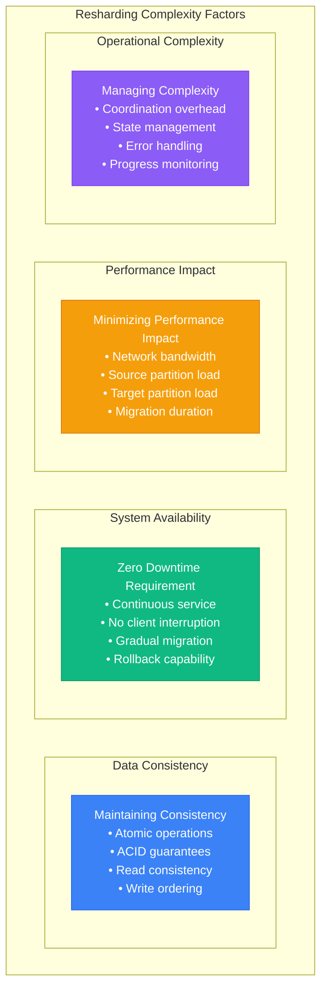
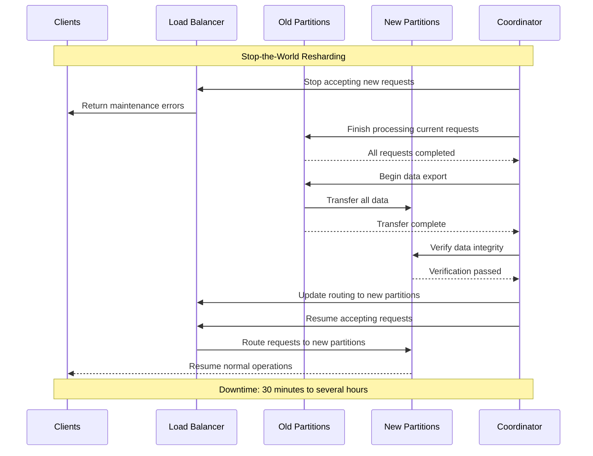
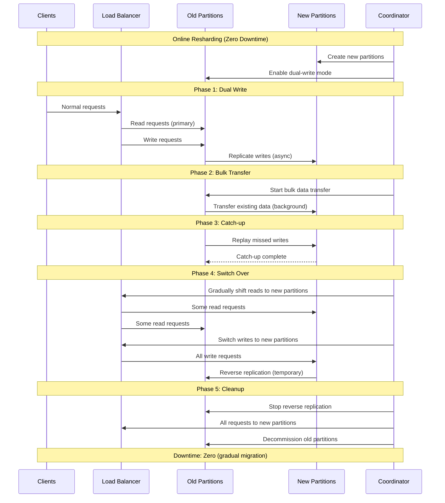
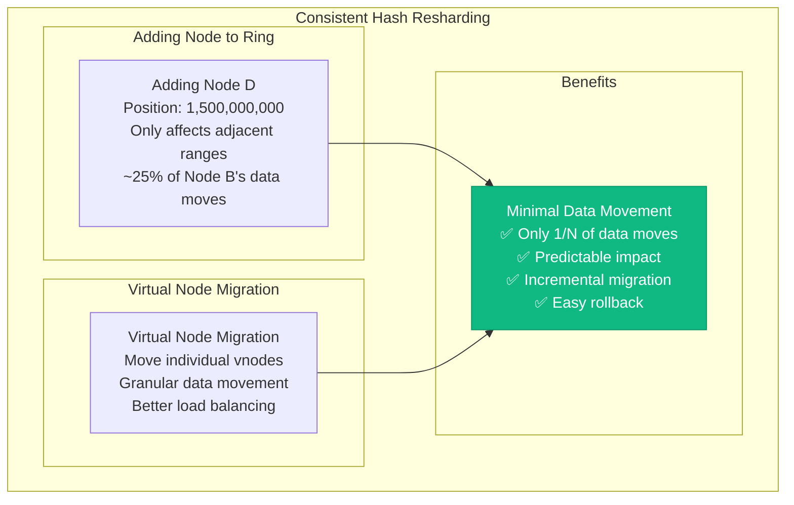
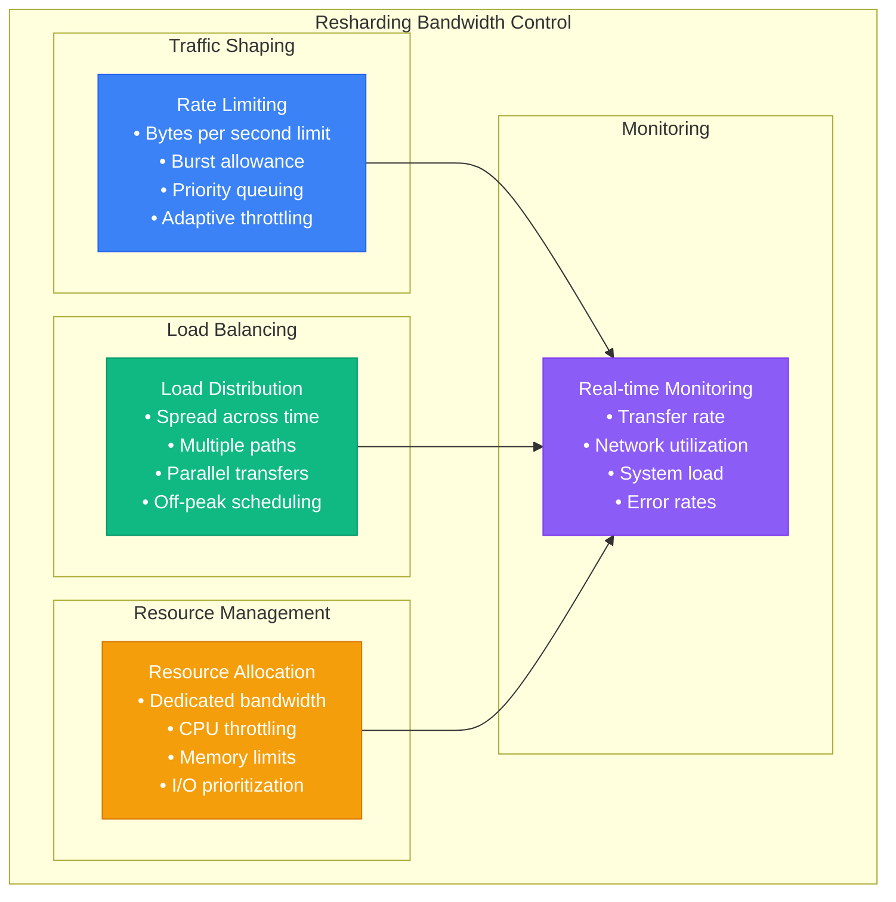

# Online Resharding Techniques

## Overview of Resharding

Online resharding is the process of redistributing data across partitions while maintaining system availability and consistency. This is essential for handling growth, rebalancing load, and adapting to changing access patterns.

### Resharding Challenges



## Stop-the-World vs Online Resharding

### Stop-the-World Approach



### Online Resharding Approach



## Resharding Patterns

### Range-Based Resharding

```mermaid
graph TB
    subgraph Range_Based_Partition_Split[Range-Based Partition Split]
        subgraph Before_Resharding[Before Resharding]
            BEFORE[Partition A<br/>Range: users_000 - users_999<br/>Size: 100GB<br/>Load: 50,000 QPS]
        end

        subgraph After_Resharding[After Resharding]
            AFTER1[Partition A1<br/>Range: users_000 - users_499<br/>Size: 50GB<br/>Load: 25,000 QPS]
            AFTER2[Partition A2<br/>Range: users_500 - users_999<br/>Size: 50GB<br/>Load: 25,000 QPS]
        end

        subgraph Split_Process[Split Process]
            SPLIT_STEPS[
                1. Determine split point (users_500)<br/>
                2. Create new partition A2<br/>
                3. Enable dual-write mode<br/>
                4. Transfer users_500-999 to A2<br/>
                5. Update routing table<br/>
                6. Remove old data from A1
            ]
        end
    end

    BEFORE --> SPLIT_STEPS
    SPLIT_STEPS --> AFTER1
    SPLIT_STEPS --> AFTER2

    %% Apply state plane color for data partitions
    classDef stateStyle fill:#F59E0B,stroke:#D97706,color:#fff
    classDef controlStyle fill:#8B5CF6,stroke:#7C3AED,color:#fff

    class BEFORE,AFTER1,AFTER2 stateStyle
    class SPLIT_STEPS controlStyle
```

### Hash-Based Resharding

```mermaid
graph LR
    subgraph Hash_Based_Resharding__3_to_4_nodes[Hash-Based Resharding (3 to 4 nodes)]
        subgraph Original_Hash_Ring[Original Hash Ring]
            ORIG[3 Nodes<br/>hash(key) % 3<br/>Node 0: 33.3%<br/>Node 1: 33.3%<br/>Node 2: 33.3%]
        end

        subgraph New_Hash_Ring[New Hash Ring]
            NEW[4 Nodes<br/>hash(key) % 4<br/>Node 0: 25%<br/>Node 1: 25%<br/>Node 2: 25%<br/>Node 3: 25%]
        end

        subgraph Migration_Impact[Migration Impact]
            IMPACT[Data Movement<br/>~75% of keys move<br/>Requires careful coordination<br/>High network usage]
        end
    end

    ORIG --> NEW
    NEW --> IMPACT

    %% Apply state plane color
    classDef stateStyle fill:#F59E0B,stroke:#D97706,color:#fff
    class ORIG,NEW,IMPACT stateStyle
```

### Consistent Hash Resharding



## Implementation Strategies

### Multi-Phase Online Migration

```python
#!/usr/bin/env python3
# online_resharding.py

import asyncio
import time
import logging
from typing import Dict, List, Optional, Set
from enum import Enum
from dataclasses import dataclass, field
import threading

class MigrationPhase(Enum):
    PLANNING = "planning"
    PREPARATION = "preparation"
    DUAL_WRITE = "dual_write"
    BULK_TRANSFER = "bulk_transfer"
    CATCH_UP = "catch_up"
    SWITCH_OVER = "switch_over"
    CLEANUP = "cleanup"
    COMPLETED = "completed"
    FAILED = "failed"

class MigrationStatus(Enum):
    PENDING = "pending"
    RUNNING = "running"
    PAUSED = "paused"
    COMPLETED = "completed"
    FAILED = "failed"
    CANCELLED = "cancelled"

@dataclass
class PartitionRange:
    start_key: str
    end_key: str
    partition_id: str

@dataclass
class MigrationTask:
    task_id: str
    source_partition: str
    target_partition: str
    key_range: PartitionRange
    phase: MigrationPhase
    status: MigrationStatus
    progress_percent: float = 0.0
    start_time: Optional[float] = None
    end_time: Optional[float] = None
    error_message: Optional[str] = None
    transferred_keys: int = 0
    total_keys: int = 0
    transferred_bytes: int = 0
    total_bytes: int = 0

class OnlineReshardingEngine:
    def __init__(self, partition_manager, data_store, routing_service):
        self.partition_manager = partition_manager
        self.data_store = data_store
        self.routing_service = routing_service
        self.active_migrations: Dict[str, MigrationTask] = {}
        self.migration_lock = threading.RLock()
        self.is_running = True

    async def start_resharding(self, source_partitions: List[str],
                              target_layout: List[PartitionRange]) -> str:
        """Start online resharding process"""
        migration_id = f"migration_{int(time.time())}"

        logging.info(f"Starting resharding {migration_id}")

        try:
            # Phase 1: Planning
            migration_plan = await self._create_migration_plan(
                source_partitions, target_layout)

            # Phase 2: Preparation
            await self._prepare_target_partitions(target_layout)

            # Phase 3-7: Execute migration phases
            for task in migration_plan:
                await self._execute_migration_task(task)

            logging.info(f"Resharding {migration_id} completed successfully")
            return migration_id

        except Exception as e:
            logging.error(f"Resharding {migration_id} failed: {e}")
            await self._rollback_migration(migration_id)
            raise

    async def _create_migration_plan(self, source_partitions: List[str],
                                   target_layout: List[PartitionRange]) -> List[MigrationTask]:
        """Create detailed migration plan"""
        tasks = []

        for source_partition in source_partitions:
            # Get current partition range and data
            source_range = await self.partition_manager.get_partition_range(source_partition)
            source_stats = await self.partition_manager.get_partition_stats(source_partition)

            # Find overlapping target partitions
            overlapping_targets = self._find_overlapping_partitions(source_range, target_layout)

            for target_range in overlapping_targets:
                # Calculate intersection range
                intersection = self._calculate_intersection(source_range, target_range)

                if intersection:
                    task = MigrationTask(
                        task_id=f"{source_partition}_to_{target_range.partition_id}",
                        source_partition=source_partition,
                        target_partition=target_range.partition_id,
                        key_range=intersection,
                        phase=MigrationPhase.PLANNING,
                        status=MigrationStatus.PENDING,
                        total_keys=await self._estimate_keys_in_range(source_partition, intersection),
                        total_bytes=await self._estimate_bytes_in_range(source_partition, intersection)
                    )
                    tasks.append(task)

        return tasks

    async def _prepare_target_partitions(self, target_layout: List[PartitionRange]):
        """Prepare target partitions for migration"""
        for partition_range in target_layout:
            # Create partition if it doesn't exist
            if not await self.partition_manager.partition_exists(partition_range.partition_id):
                await self.partition_manager.create_partition(
                    partition_range.partition_id,
                    partition_range.start_key,
                    partition_range.end_key
                )

            # Initialize partition with proper configuration
            await self.partition_manager.configure_partition(
                partition_range.partition_id,
                replication_factor=3,
                consistency_level="strong"
            )

    async def _execute_migration_task(self, task: MigrationTask):
        """Execute a single migration task through all phases"""
        with self.migration_lock:
            self.active_migrations[task.task_id] = task

        try:
            task.start_time = time.time()
            task.status = MigrationStatus.RUNNING

            # Phase 1: Enable dual-write mode
            await self._enable_dual_write(task)

            # Phase 2: Bulk data transfer
            await self._bulk_transfer_data(task)

            # Phase 3: Catch-up replication
            await self._catch_up_replication(task)

            # Phase 4: Switch over traffic
            await self._switch_over_traffic(task)

            # Phase 5: Cleanup old data
            await self._cleanup_old_data(task)

            task.status = MigrationStatus.COMPLETED
            task.end_time = time.time()
            task.progress_percent = 100.0

        except Exception as e:
            task.status = MigrationStatus.FAILED
            task.error_message = str(e)
            task.end_time = time.time()
            raise

        finally:
            with self.migration_lock:
                if task.task_id in self.active_migrations:
                    self.active_migrations[task.task_id] = task

    async def _enable_dual_write(self, task: MigrationTask):
        """Enable dual-write mode for the key range"""
        task.phase = MigrationPhase.DUAL_WRITE

        # Configure routing service to write to both partitions
        await self.routing_service.enable_dual_write(
            key_range=task.key_range,
            primary_partition=task.source_partition,
            secondary_partition=task.target_partition
        )

        # Wait for dual-write mode to be active across all nodes
        await asyncio.sleep(5)

        logging.info(f"Dual-write enabled for {task.task_id}")

    async def _bulk_transfer_data(self, task: MigrationTask):
        """Transfer existing data in bulk"""
        task.phase = MigrationPhase.BULK_TRANSFER

        # Use streaming cursor to avoid loading all data into memory
        cursor = await self.data_store.create_range_cursor(
            partition=task.source_partition,
            start_key=task.key_range.start_key,
            end_key=task.key_range.end_key,
            batch_size=1000
        )

        batch_count = 0
        while await cursor.has_next():
            batch = await cursor.get_next_batch()

            # Transfer batch to target partition
            await self.data_store.bulk_insert(
                partition=task.target_partition,
                records=batch
            )

            # Update progress
            task.transferred_keys += len(batch)
            task.transferred_bytes += sum(len(str(record)) for record in batch)
            task.progress_percent = min(90.0, (task.transferred_keys / task.total_keys) * 80)

            batch_count += 1
            if batch_count % 100 == 0:
                logging.info(f"Transferred {task.transferred_keys}/{task.total_keys} keys for {task.task_id}")

            # Rate limiting to avoid overwhelming the system
            await asyncio.sleep(0.01)

        await cursor.close()
        logging.info(f"Bulk transfer completed for {task.task_id}")

    async def _catch_up_replication(self, task: MigrationTask):
        """Catch up any writes that happened during bulk transfer"""
        task.phase = MigrationPhase.CATCH_UP

        # Get replication log from source partition
        replication_log = await self.data_store.get_replication_log(
            partition=task.source_partition,
            key_range=task.key_range,
            since_timestamp=task.start_time
        )

        # Apply missed changes to target partition
        for log_entry in replication_log:
            await self.data_store.apply_log_entry(
                partition=task.target_partition,
                log_entry=log_entry
            )

        # Verify data consistency
        consistency_check = await self._verify_data_consistency(task)
        if not consistency_check:
            raise Exception(f"Data consistency check failed for {task.task_id}")

        task.progress_percent = 95.0
        logging.info(f"Catch-up replication completed for {task.task_id}")

    async def _switch_over_traffic(self, task: MigrationTask):
        """Switch traffic from source to target partition"""
        task.phase = MigrationPhase.SWITCH_OVER

        # Gradually shift read traffic
        for read_percentage in [25, 50, 75, 100]:
            await self.routing_service.set_read_traffic_split(
                key_range=task.key_range,
                source_percentage=100 - read_percentage,
                target_percentage=read_percentage
            )

            # Monitor for errors
            await asyncio.sleep(30)
            error_rate = await self._monitor_error_rate(task.target_partition)
            if error_rate > 0.01:  # 1% error rate threshold
                raise Exception(f"High error rate {error_rate} during traffic switch")

        # Switch write traffic
        await self.routing_service.switch_write_traffic(
            key_range=task.key_range,
            from_partition=task.source_partition,
            to_partition=task.target_partition
        )

        # Disable dual-write mode
        await self.routing_service.disable_dual_write(task.key_range)

        task.progress_percent = 98.0
        logging.info(f"Traffic switched over for {task.task_id}")

    async def _cleanup_old_data(self, task: MigrationTask):
        """Clean up data from source partition"""
        task.phase = MigrationPhase.CLEANUP

        # Wait for any in-flight requests to complete
        await asyncio.sleep(60)

        # Remove migrated data from source partition
        await self.data_store.delete_range(
            partition=task.source_partition,
            start_key=task.key_range.start_key,
            end_key=task.key_range.end_key
        )

        # Update partition metadata
        await self.partition_manager.update_partition_range(
            partition=task.source_partition,
            exclude_range=task.key_range
        )

        task.progress_percent = 100.0
        logging.info(f"Cleanup completed for {task.task_id}")

    async def _verify_data_consistency(self, task: MigrationTask) -> bool:
        """Verify data consistency between source and target"""
        # Sample-based verification for large datasets
        sample_keys = await self.data_store.sample_keys_in_range(
            partition=task.source_partition,
            key_range=task.key_range,
            sample_size=1000
        )

        for key in sample_keys:
            source_value = await self.data_store.get(task.source_partition, key)
            target_value = await self.data_store.get(task.target_partition, key)

            if source_value != target_value:
                logging.error(f"Consistency check failed for key {key}")
                return False

        return True

    async def _monitor_error_rate(self, partition: str) -> float:
        """Monitor error rate for a partition"""
        metrics = await self.partition_manager.get_partition_metrics(partition)
        return metrics.get('error_rate', 0.0)

    async def _rollback_migration(self, migration_id: str):
        """Rollback failed migration"""
        logging.warning(f"Rolling back migration {migration_id}")

        # Disable dual-write modes
        for task in self.active_migrations.values():
            if task.status == MigrationStatus.RUNNING:
                try:
                    await self.routing_service.disable_dual_write(task.key_range)
                except Exception as e:
                    logging.error(f"Error disabling dual-write during rollback: {e}")

        # Remove any partially migrated data
        # (Implementation depends on specific storage system)

    def get_migration_status(self, migration_id: str) -> Dict:
        """Get status of ongoing migration"""
        with self.migration_lock:
            relevant_tasks = [
                task for task in self.active_migrations.values()
                if migration_id in task.task_id
            ]

        if not relevant_tasks:
            return {"status": "not_found"}

        total_progress = sum(task.progress_percent for task in relevant_tasks) / len(relevant_tasks)

        return {
            "migration_id": migration_id,
            "overall_progress": total_progress,
            "total_tasks": len(relevant_tasks),
            "completed_tasks": len([t for t in relevant_tasks if t.status == MigrationStatus.COMPLETED]),
            "failed_tasks": len([t for t in relevant_tasks if t.status == MigrationStatus.FAILED]),
            "tasks": [
                {
                    "task_id": task.task_id,
                    "phase": task.phase.value,
                    "status": task.status.value,
                    "progress": task.progress_percent,
                    "transferred_keys": task.transferred_keys,
                    "total_keys": task.total_keys,
                    "error": task.error_message
                }
                for task in relevant_tasks
            ]
        }

    def _find_overlapping_partitions(self, source_range: PartitionRange,
                                   target_layout: List[PartitionRange]) -> List[PartitionRange]:
        """Find target partitions that overlap with source range"""
        overlapping = []
        for target_range in target_layout:
            if self._ranges_overlap(source_range, target_range):
                overlapping.append(target_range)
        return overlapping

    def _ranges_overlap(self, range1: PartitionRange, range2: PartitionRange) -> bool:
        """Check if two ranges overlap"""
        return not (range1.end_key <= range2.start_key or range2.end_key <= range1.start_key)

    def _calculate_intersection(self, range1: PartitionRange, range2: PartitionRange) -> Optional[PartitionRange]:
        """Calculate intersection of two ranges"""
        if not self._ranges_overlap(range1, range2):
            return None

        start_key = max(range1.start_key, range2.start_key)
        end_key = min(range1.end_key, range2.end_key)

        return PartitionRange(
            start_key=start_key,
            end_key=end_key,
            partition_id=range2.partition_id  # Use target partition ID
        )

    async def _estimate_keys_in_range(self, partition: str, key_range: PartitionRange) -> int:
        """Estimate number of keys in a range"""
        # Implementation would use sampling or metadata
        return 100000  # Placeholder

    async def _estimate_bytes_in_range(self, partition: str, key_range: PartitionRange) -> int:
        """Estimate bytes in a range"""
        # Implementation would use sampling or metadata
        return 1024 * 1024 * 1024  # Placeholder: 1GB

# Example usage
async def main():
    # Mock dependencies
    partition_manager = None
    data_store = None
    routing_service = None

    engine = OnlineReshardingEngine(partition_manager, data_store, routing_service)

    # Define target layout (split partition into 3)
    target_layout = [
        PartitionRange("users_000", "users_333", "partition_1"),
        PartitionRange("users_333", "users_666", "partition_2"),
        PartitionRange("users_666", "users_999", "partition_3")
    ]

    try:
        migration_id = await engine.start_resharding(
            source_partitions=["original_partition"],
            target_layout=target_layout
        )

        # Monitor progress
        while True:
            status = engine.get_migration_status(migration_id)
            print(f"Migration progress: {status['overall_progress']:.1f}%")

            if status['overall_progress'] >= 100.0:
                break

            await asyncio.sleep(10)

    except Exception as e:
        print(f"Migration failed: {e}")

if __name__ == "__main__":
    asyncio.run(main())
```

## Performance Optimization

### Bandwidth Management



### Parallel Migration Strategies

```python
# Parallel migration implementation
import asyncio
from concurrent.futures import ThreadPoolExecutor
import time

class ParallelMigrationEngine:
    def __init__(self, max_concurrent_migrations: int = 4):
        self.max_concurrent_migrations = max_concurrent_migrations
        self.semaphore = asyncio.Semaphore(max_concurrent_migrations)
        self.executor = ThreadPoolExecutor(max_workers=max_concurrent_migrations * 2)

    async def parallel_bulk_transfer(self, task: MigrationTask):
        """Execute bulk transfer with multiple parallel streams"""

        # Split key range into chunks for parallel processing
        chunks = self._split_range_into_chunks(task.key_range, self.max_concurrent_migrations)

        # Create transfer tasks for each chunk
        transfer_tasks = []
        for i, chunk in enumerate(chunks):
            transfer_task = asyncio.create_task(
                self._transfer_chunk(task, chunk, f"chunk_{i}")
            )
            transfer_tasks.append(transfer_task)

        # Wait for all transfers to complete
        results = await asyncio.gather(*transfer_tasks, return_exceptions=True)

        # Handle any failures
        for i, result in enumerate(results):
            if isinstance(result, Exception):
                logging.error(f"Chunk {i} transfer failed: {result}")
                raise result

    async def _transfer_chunk(self, task: MigrationTask, chunk_range: PartitionRange, chunk_id: str):
        """Transfer a single chunk of data"""
        async with self.semaphore:  # Limit concurrent transfers
            logging.info(f"Starting transfer for {chunk_id} in {task.task_id}")

            cursor = await self.data_store.create_range_cursor(
                partition=task.source_partition,
                start_key=chunk_range.start_key,
                end_key=chunk_range.end_key,
                batch_size=500  # Smaller batches for parallel transfers
            )

            transferred_in_chunk = 0
            while await cursor.has_next():
                batch = await cursor.get_next_batch()

                # Transfer with retry logic
                await self._transfer_batch_with_retry(task.target_partition, batch)

                transferred_in_chunk += len(batch)

                # Update overall task progress (thread-safe)
                async with task._progress_lock:
                    task.transferred_keys += len(batch)
                    task.progress_percent = min(90.0, (task.transferred_keys / task.total_keys) * 80)

                # Adaptive rate limiting based on system load
                await self._adaptive_sleep()

            await cursor.close()
            logging.info(f"Completed transfer for {chunk_id}: {transferred_in_chunk} keys")

    async def _transfer_batch_with_retry(self, target_partition: str, batch: List, max_retries: int = 3):
        """Transfer batch with exponential backoff retry"""
        for attempt in range(max_retries):
            try:
                await self.data_store.bulk_insert(
                    partition=target_partition,
                    records=batch
                )
                return
            except Exception as e:
                if attempt == max_retries - 1:
                    raise

                wait_time = (2 ** attempt) * 0.1  # Exponential backoff
                logging.warning(f"Batch transfer failed (attempt {attempt + 1}), retrying in {wait_time}s: {e}")
                await asyncio.sleep(wait_time)

    async def _adaptive_sleep(self):
        """Adaptive sleep based on system load"""
        # Get system metrics
        cpu_usage = await self._get_cpu_usage()
        network_usage = await self._get_network_usage()

        # Calculate sleep time based on load
        if cpu_usage > 80 or network_usage > 80:
            sleep_time = 0.1  # Slow down if system is under pressure
        elif cpu_usage > 60 or network_usage > 60:
            sleep_time = 0.05
        else:
            sleep_time = 0.01  # Minimal sleep for normal conditions

        await asyncio.sleep(sleep_time)

    def _split_range_into_chunks(self, key_range: PartitionRange, num_chunks: int) -> List[PartitionRange]:
        """Split a key range into chunks for parallel processing"""
        # Simplified implementation - would need proper key distribution logic
        chunks = []

        start_key = key_range.start_key
        end_key = key_range.end_key

        # For string keys, split based on character ranges
        # This is a simplified approach - production would use proper partitioning
        for i in range(num_chunks):
            chunk_start = start_key if i == 0 else f"{start_key}_{i:03d}"
            chunk_end = end_key if i == num_chunks - 1 else f"{start_key}_{i+1:03d}"

            chunks.append(PartitionRange(
                start_key=chunk_start,
                end_key=chunk_end,
                partition_id=key_range.partition_id
            ))

        return chunks

    async def _get_cpu_usage(self) -> float:
        """Get current CPU usage percentage"""
        # Would integrate with system monitoring
        return 45.0  # Placeholder

    async def _get_network_usage(self) -> float:
        """Get current network usage percentage"""
        # Would integrate with network monitoring
        return 30.0  # Placeholder
```

## Monitoring and Rollback

### Comprehensive Monitoring

```yaml
# Resharding monitoring dashboard
resharding_metrics:
  progress_metrics:
    - name: migration_progress_percent
      description: "Overall migration progress"
      query: "max(migration_progress) by (migration_id)"
      visualization: "gauge"

    - name: migration_transfer_rate
      description: "Data transfer rate"
      query: "rate(migration_bytes_transferred[5m])"
      unit: "bytes/sec"

    - name: migration_keys_per_second
      description: "Key transfer rate"
      query: "rate(migration_keys_transferred[5m])"
      unit: "keys/sec"

  performance_metrics:
    - name: source_partition_load
      description: "Load on source partitions during migration"
      query: "partition_requests_per_second{partition=~'source_.*'}"
      alert_threshold: "> 1.5 * baseline"

    - name: target_partition_load
      description: "Load on target partitions during migration"
      query: "partition_requests_per_second{partition=~'target_.*'}"
      alert_threshold: "> 0.8 * capacity"

    - name: migration_error_rate
      description: "Error rate during migration"
      query: "rate(migration_errors_total[5m]) / rate(migration_operations_total[5m])"
      alert_threshold: "> 0.01"  # 1%

  consistency_metrics:
    - name: dual_write_lag
      description: "Lag between primary and secondary writes"
      query: "dual_write_lag_seconds"
      alert_threshold: "> 1.0"

    - name: consistency_check_failures
      description: "Data consistency check failures"
      query: "rate(consistency_check_failures_total[5m])"
      alert_threshold: "> 0"

alerts:
  - name: "MigrationStalled"
    condition: "increase(migration_progress_percent[10m]) == 0"
    severity: "warning"
    message: "Migration progress stalled for 10 minutes"

  - name: "HighMigrationErrorRate"
    condition: "migration_error_rate > 0.05"
    severity: "critical"
    message: "Migration error rate exceeds 5%"

  - name: "SourcePartitionOverload"
    condition: "source_partition_load > 2 * baseline"
    severity: "warning"
    message: "Source partition under high load during migration"
```

This comprehensive guide to online resharding provides the techniques and implementations needed to redistribute data across partitions while maintaining system availability and performance.