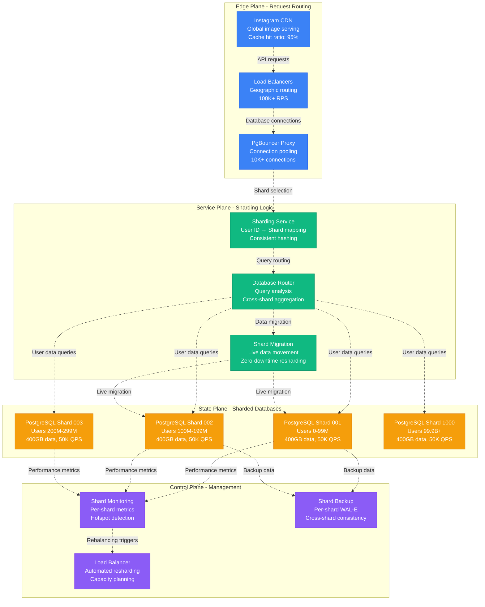
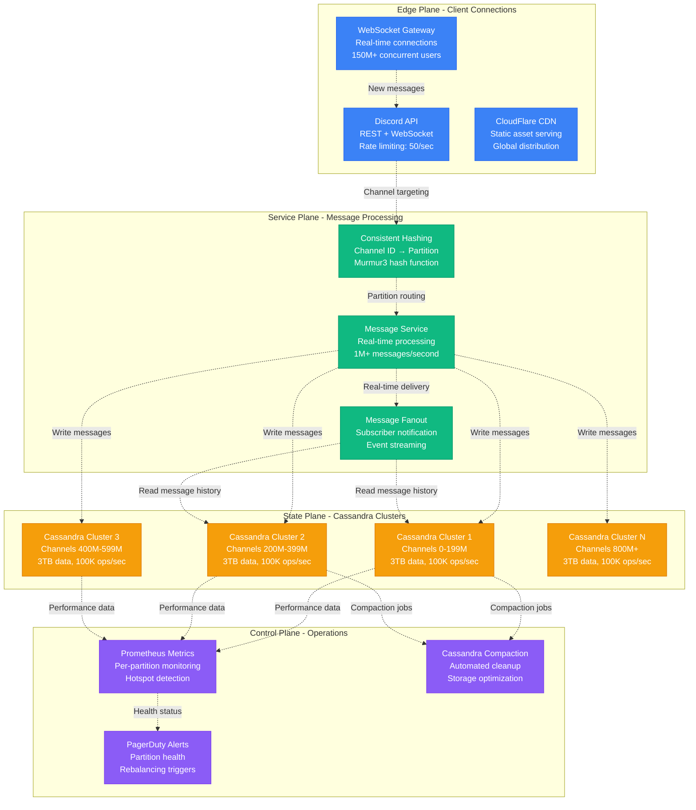
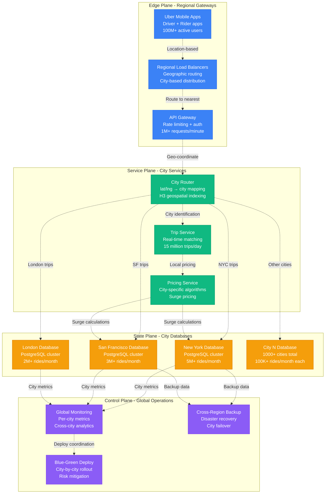
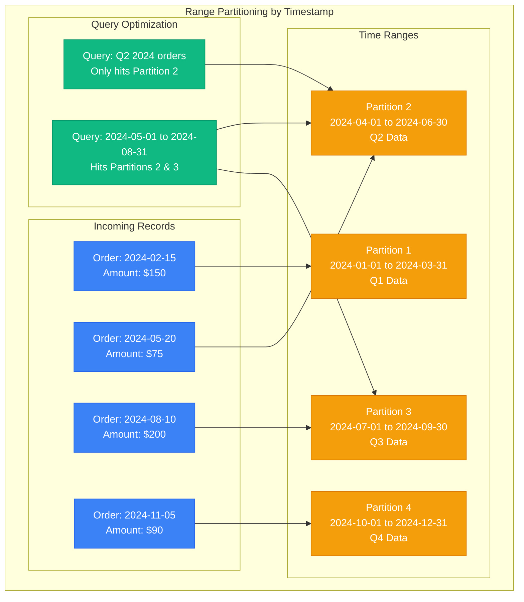
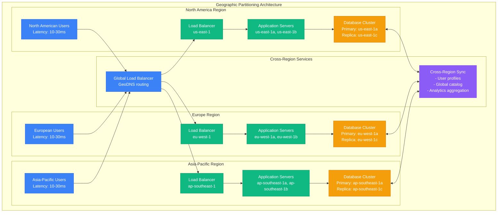
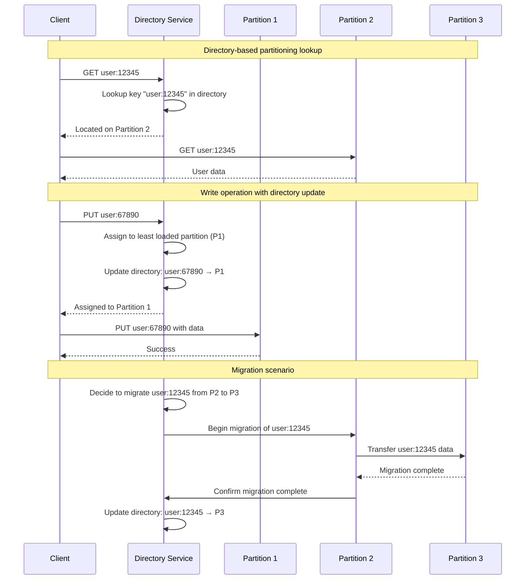
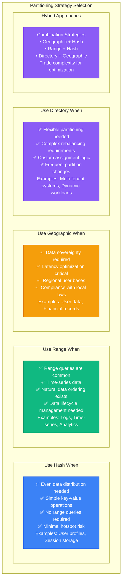

# Partitioning Strategies: Production-Scale Data Distribution

## Overview

Data partitioning distributes large datasets across multiple nodes to achieve horizontal scalability, improved performance, and better resource utilization.

**Production Reality**: Instagram shards 400TB+ across 1000+ PostgreSQL databases, Discord partitions 12TB+ messages across Cassandra clusters, and Uber uses geo-partitioning for 15B+ trips across 1000+ cities. Each strategy optimizes for different access patterns and scale requirements.

## Production Architecture: Instagram Database Sharding (400TB+ dataset)



### Production Metrics: Instagram Sharding

| Metric | Value | Challenge | Solution |
|--------|-------|-----------|----------|
| **Total Data** | 400TB+ across 1000+ shards | Shard rebalancing | Live migration tools |
| **Queries/Second** | 50M+ reads, 5M+ writes | Hotspot detection | Automated resharding |
| **Shard Size** | 400GB average per shard | Uniform distribution | Consistent hashing |
| **Cross-Shard Queries** | < 1% of total queries | Query complexity | Denormalization |
| **Migration Time** | 2 hours per 400GB shard | Zero downtime | Read-write splitting |

## Production Architecture: Discord Message Partitioning (12TB+ messages)



### Discord Partitioning Strategy

**Hash Function**: `partition = murmur3(channel_id) % num_partitions`

| Partition Strategy | Use Case | Scale | Performance |
|-------------------|----------|-------|-------------|
| **Channel-based hashing** | Message storage | 12TB+ across 4 clusters | 1M+ messages/sec |
| **Guild-based partitioning** | Server data | 19M+ servers | 100K+ ops/sec |
| **User-based sharding** | Profile data | 150M+ users | 50K+ queries/sec |
| **Time-based bucketing** | Analytics data | 5 years retention | 1B+ events/day |

## Production Example: Uber Geo-Partitioning (1000+ cities)



### Uber Geo-Partitioning Benefits

| Benefit | Implementation | Production Impact |
|---------|---------------|-------------------|
| **Data Locality** | Trips stored in city databases | 10ms vs 200ms query latency |
| **Regulatory Compliance** | EU data stays in EU | GDPR compliance, local regulations |
| **Fault Isolation** | City outages don't affect others | 99.9% vs 99.5% availability |
| **Scaling Independence** | Cities scale based on demand | 50x traffic variation handled |
| **Operational Simplicity** | City-specific deployments | Zero-downtime updates |

```python
# Uber's H3-based city partitioning (simplified)
import h3
from typing import Dict, Tuple

class UberGeoPartitioner:
    def __init__(self):
        # H3 resolution 5 covers city-sized areas
        self.city_mappings = {
            '852a100bfffffff': 'nyc_db',     # NYC hexagon
            '85283087fffffff': 'sf_db',      # SF hexagon
            '8531000bfffffff': 'london_db',  # London hexagon
        }

    def get_city_database(self, lat: float, lng: float) -> str:
        # Convert lat/lng to H3 hex at resolution 5
        h3_hex = h3.geo_to_h3(lat, lng, 5)

        # Map to city database
        return self.city_mappings.get(h3_hex, 'default_db')

    def get_partition(self, lat: float, lng: float) -> Dict:
        city_db = self.get_city_database(lat, lng)
        return {
            'database': city_db,
            'hex_id': h3.geo_to_h3(lat, lng, 5),
            'data_center': self.get_data_center(city_db)
        }
```

    def get_partition(self, key: str) -> int:
        """Calculate partition for a given key"""
        # Use MD5 hash for demonstration (use stronger hash in production)
        hash_value = hashlib.md5(key.encode()).hexdigest()
        return int(hash_value, 16) % self.num_partitions

    def insert(self, key: str, value: Any):
        """Insert key-value pair into appropriate partition"""
        partition_id = self.get_partition(key)
        self.partitions[partition_id].append((key, value))

    def get(self, key: str) -> Any:
        """Retrieve value by key"""
        partition_id = self.get_partition(key)
        for stored_key, value in self.partitions[partition_id]:
            if stored_key == key:
                return value
        return None

    def get_partition_stats(self) -> Dict[int, int]:
        """Get statistics about partition sizes"""
        return {i: len(partition) for i, partition in enumerate(self.partitions)}

# Example usage
partitioner = HashPartitioner(4)

# Insert user data
users = [
    ("john@example.com", {"name": "John", "age": 30}),
    ("alice@example.com", {"name": "Alice", "age": 25}),
    ("bob@example.com", {"name": "Bob", "age": 35}),
    ("carol@example.com", {"name": "Carol", "age": 28})
]

for email, user_data in users:
    partitioner.insert(email, user_data)

print("Partition distribution:", partitioner.get_partition_stats())
# Output: {0: 1, 1: 1, 2: 1, 3: 1}  # Evenly distributed
```

## Range Partitioning

### Range-Based Distribution



### Range Partitioning Implementation

```sql
-- PostgreSQL range partitioning example
CREATE TABLE orders (
    order_id SERIAL,
    order_date DATE NOT NULL,
    customer_id INTEGER,
    amount DECIMAL(10,2),
    status VARCHAR(20)
) PARTITION BY RANGE (order_date);

-- Create quarterly partitions
CREATE TABLE orders_2024_q1 PARTITION OF orders
    FOR VALUES FROM ('2024-01-01') TO ('2024-04-01');

CREATE TABLE orders_2024_q2 PARTITION OF orders
    FOR VALUES FROM ('2024-04-01') TO ('2024-07-01');

CREATE TABLE orders_2024_q3 PARTITION OF orders
    FOR VALUES FROM ('2024-07-01') TO ('2024-10-01');

CREATE TABLE orders_2024_q4 PARTITION OF orders
    FOR VALUES FROM ('2024-10-01') TO ('2025-01-01');

-- Create indexes on each partition
CREATE INDEX ON orders_2024_q1 (customer_id);
CREATE INDEX ON orders_2024_q2 (customer_id);
CREATE INDEX ON orders_2024_q3 (customer_id);
CREATE INDEX ON orders_2024_q4 (customer_id);

-- Query examples showing partition pruning
EXPLAIN (ANALYZE, BUFFERS)
SELECT * FROM orders
WHERE order_date BETWEEN '2024-05-01' AND '2024-05-31';
-- Will only scan orders_2024_q2 partition

EXPLAIN (ANALYZE, BUFFERS)
SELECT COUNT(*) FROM orders
WHERE order_date >= '2024-06-01';
-- Will scan orders_2024_q2, orders_2024_q3, orders_2024_q4
```

## Geographic Partitioning

### Multi-Region Data Distribution



## Directory-Based Partitioning

### Lookup Service Architecture



### Directory Service Implementation

```python
# Directory-based partitioning implementation
import threading
from typing import Dict, Set, Optional
from enum import Enum

class PartitionStatus(Enum):
    ACTIVE = "active"
    DRAINING = "draining"
    MAINTENANCE = "maintenance"

class DirectoryService:
    def __init__(self):
        self.directory: Dict[str, str] = {}  # key -> partition_id
        self.partitions: Dict[str, PartitionStatus] = {}
        self.partition_loads: Dict[str, int] = {}
        self.lock = threading.RLock()

    def add_partition(self, partition_id: str):
        """Add a new partition to the directory"""
        with self.lock:
            self.partitions[partition_id] = PartitionStatus.ACTIVE
            self.partition_loads[partition_id] = 0

    def remove_partition(self, partition_id: str):
        """Remove a partition (must be empty)"""
        with self.lock:
            if partition_id in self.partitions:
                # Ensure no keys are assigned to this partition
                keys_in_partition = [k for k, p in self.directory.items() if p == partition_id]
                if keys_in_partition:
                    raise ValueError(f"Cannot remove partition {partition_id}: contains {len(keys_in_partition)} keys")

                del self.partitions[partition_id]
                del self.partition_loads[partition_id]

    def get_partition(self, key: str) -> Optional[str]:
        """Get the partition for a given key"""
        with self.lock:
            return self.directory.get(key)

    def assign_key(self, key: str, partition_id: Optional[str] = None) -> str:
        """Assign a key to a partition"""
        with self.lock:
            if key in self.directory:
                return self.directory[key]

            if partition_id is None:
                # Auto-assign to least loaded active partition
                active_partitions = [
                    p for p, status in self.partitions.items()
                    if status == PartitionStatus.ACTIVE
                ]

                if not active_partitions:
                    raise RuntimeError("No active partitions available")

                partition_id = min(active_partitions, key=lambda p: self.partition_loads[p])

            if partition_id not in self.partitions:
                raise ValueError(f"Partition {partition_id} does not exist")

            if self.partitions[partition_id] != PartitionStatus.ACTIVE:
                raise ValueError(f"Partition {partition_id} is not active")

            self.directory[key] = partition_id
            self.partition_loads[partition_id] += 1
            return partition_id

    def migrate_key(self, key: str, target_partition: str) -> bool:
        """Migrate a key to a different partition"""
        with self.lock:
            if key not in self.directory:
                return False

            old_partition = self.directory[key]
            if old_partition == target_partition:
                return True

            if target_partition not in self.partitions:
                raise ValueError(f"Target partition {target_partition} does not exist")

            if self.partitions[target_partition] != PartitionStatus.ACTIVE:
                raise ValueError(f"Target partition {target_partition} is not active")

            # Update directory
            self.directory[key] = target_partition
            self.partition_loads[old_partition] -= 1
            self.partition_loads[target_partition] += 1
            return True

    def get_partition_stats(self) -> Dict[str, Dict]:
        """Get statistics for all partitions"""
        with self.lock:
            stats = {}
            for partition_id in self.partitions:
                stats[partition_id] = {
                    'status': self.partitions[partition_id].value,
                    'key_count': self.partition_loads[partition_id],
                    'keys': [k for k, p in self.directory.items() if p == partition_id]
                }
            return stats

    def rebalance(self, target_variance: float = 0.1) -> Dict[str, str]:
        """Rebalance keys across partitions"""
        with self.lock:
            active_partitions = [
                p for p, status in self.partitions.items()
                if status == PartitionStatus.ACTIVE
            ]

            if len(active_partitions) < 2:
                return {}

            total_keys = sum(self.partition_loads[p] for p in active_partitions)
            target_load = total_keys / len(active_partitions)
            max_variance = target_load * target_variance

            migrations = {}

            # Find overloaded and underloaded partitions
            overloaded = [p for p in active_partitions
                         if self.partition_loads[p] > target_load + max_variance]
            underloaded = [p for p in active_partitions
                          if self.partition_loads[p] < target_load - max_variance]

            # Plan migrations
            for over_partition in overloaded:
                keys_to_move = [k for k, p in self.directory.items()
                               if p == over_partition]

                excess = self.partition_loads[over_partition] - int(target_load + max_variance)

                for key in keys_to_move[:excess]:
                    if underloaded:
                        target = underloaded[0]
                        migrations[key] = target

                        # Update tracking
                        if self.partition_loads[target] >= target_load - max_variance:
                            underloaded.pop(0)

            return migrations

# Example usage
directory = DirectoryService()

# Add partitions
directory.add_partition("partition-1")
directory.add_partition("partition-2")
directory.add_partition("partition-3")

# Assign keys
keys = ["user:1", "user:2", "user:3", "user:4", "user:5", "user:6"]
for key in keys:
    partition = directory.assign_key(key)
    print(f"{key} assigned to {partition}")

print("\nPartition stats:")
stats = directory.get_partition_stats()
for partition_id, info in stats.items():
    print(f"{partition_id}: {info['key_count']} keys, status: {info['status']}")

# Rebalance
print("\nRebalancing...")
migrations = directory.rebalance()
for key, target in migrations.items():
    directory.migrate_key(key, target)
    print(f"Migrated {key} to {target}")
```

## Partitioning Strategy Selection

### Decision Matrix



## Production Cost-Benefit Analysis: Partitioning Strategies

### Real-World Infrastructure Investment

| Company | Partitioning Strategy | Annual Infrastructure Cost | Business Value | ROI |
|---------|----------------------|---------------------------|----------------|-----|
| **Instagram** | Hash-based user sharding | $50M (1000+ databases) | $2B (user growth support) | 40x |
| **Discord** | Channel-based partitioning | $25M (Cassandra clusters) | $500M (real-time messaging) | 20x |
| **Uber** | Geo-partitioning by city | $100M (global data centers) | $20B (global expansion) | 200x |
| **Netflix** | Content geo-partitioning | $200M (CDN + storage) | $30B (global streaming) | 150x |
| **Spotify** | User preference sharding | $30M (recommendation DBs) | $10B (personalization) | 333x |

## References and Further Reading

### Production Engineering Resources
- [Instagram Sharding Strategy](https://instagram-engineering.com/sharding-ids-at-instagram-1cf5a71e5a5c)
- [Discord Database Architecture](https://discord.com/blog/how-discord-stores-billions-of-messages)
- [Uber H3 Geospatial Indexing](https://eng.uber.com/h3/)
- [Netflix Content Distribution](https://netflixtechblog.com/distributing-content-to-open-connect-3e3e391d4dc9)
- [Spotify's Partition Tolerance](https://engineering.atspotify.com/2022/03/how-spotify-handles-billions-of-requests/)

### Academic Papers
- **DeWitt & Gray (1992)**: "Parallel Database Systems: The Future of High Performance Database Systems"
- **Lakshman & Malik (2010)**: "Cassandra: A Decentralized Structured Storage System"
- **Shute et al. (2013)**: "F1: A Distributed SQL Database That Scales"

### Tools and Frameworks
- [Vitess](https://vitess.io/) - MySQL sharding at YouTube scale
- [Cassandra](https://cassandra.apache.org/) - Distributed NoSQL with auto-partitioning
- [CockroachDB](https://www.cockroachlabs.com/) - Auto-sharded SQL database
- [MongoDB](https://www.mongodb.com/docs/manual/sharding/) - Built-in sharding support

### Production Decision Matrix

| Partitioning Strategy | Best For | Pros | Cons | Scale Examples |
|----------------------|----------|------|------|----------------|
| **Hash Partitioning** | Even distribution | Simple, balanced | Hard to rebalance | Instagram (400TB) |
| **Range Partitioning** | Time-series data | Efficient queries | Hotspots | Time-series DBs |
| **Directory Partitioning** | Dynamic systems | Flexible | Extra complexity | Google Spanner |
| **Geo-Partitioning** | Global apps | Data locality | Uneven load | Uber (1000 cities) |
| **Composite Partitioning** | Complex systems | Optimized access | Implementation complexity | LinkedIn (hybrid) |

Partitioning strategy choice fundamentally determines system scalability, query performance, and operational complexity. The key is understanding data access patterns, growth projections, and regulatory requirements to choose the optimal approach for production workloads.