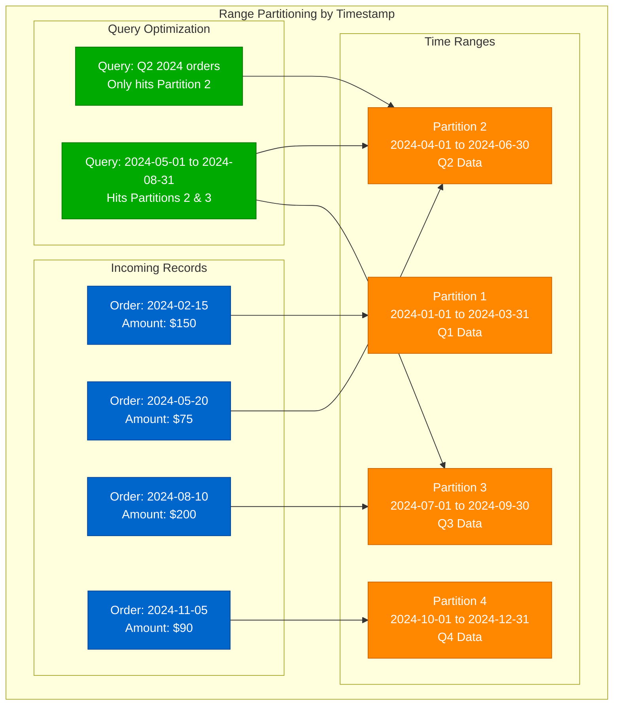
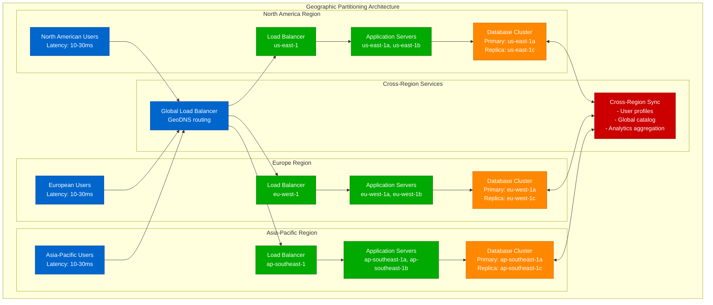
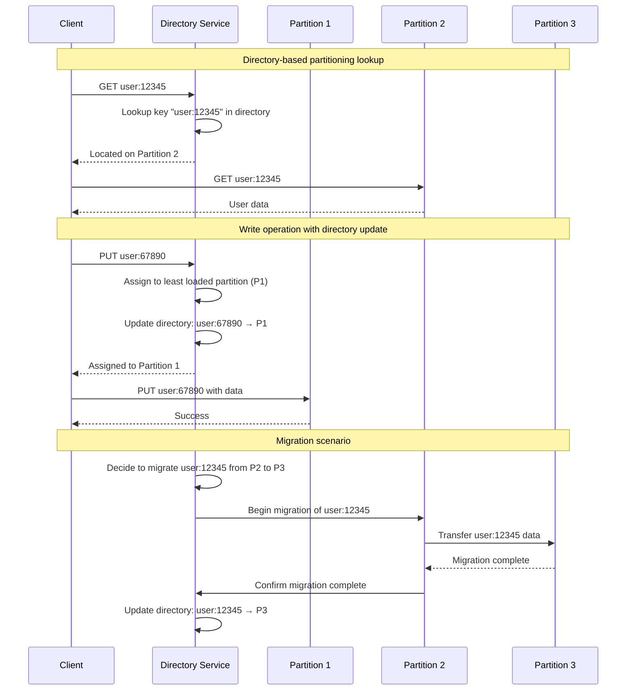
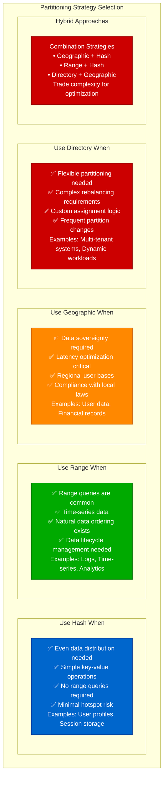

# Partitioning Strategies

## Overview of Partitioning Approaches

Data partitioning distributes large datasets across multiple nodes to achieve horizontal scalability, improved performance, and better resource utilization.

### Partitioning Strategy Comparison

```mermaid
graph TB
    subgraph "Partitioning Strategies Overview"
        subgraph "Hash Partitioning"
            HASH_DESC[Hash-based Distribution<br/>✅ Even data distribution<br/>✅ Simple to implement<br/>❌ Range queries difficult<br/>❌ Rebalancing complex]
            HASH_FUNC[Hash Function<br/>MD5, SHA-1, Murmur3<br/>partition = hash(key) % N]
        end

        subgraph "Range Partitioning"
            RANGE_DESC[Range-based Distribution<br/>✅ Efficient range queries<br/>✅ Natural data locality<br/>❌ Potential hotspots<br/>❌ Uneven distribution]
            RANGE_SPLIT[Range Boundaries<br/>A-F: Partition 1<br/>G-M: Partition 2<br/>N-Z: Partition 3]
        end

        subgraph "Directory Partitioning"
            DIR_DESC[Lookup-based Distribution<br/>✅ Flexible assignment<br/>✅ Easy rebalancing<br/>❌ Extra lookup overhead<br/>❌ Directory bottleneck]
            DIR_TABLE[Directory Service<br/>Key → Partition mapping<br/>Centralized or distributed]
        end

        subgraph "Geographic Partitioning"
            GEO_DESC[Location-based Distribution<br/>✅ Data locality<br/>✅ Regulatory compliance<br/>❌ Uneven geographic load<br/>❌ Cross-region queries]
            GEO_REGION[Regional Assignment<br/>US-East: Partition 1<br/>EU-West: Partition 2<br/>Asia-Pacific: Partition 3]
        end
    end

    %% Apply 4-plane colors
    classDef edgeStyle fill:#0066CC,stroke:#004499,color:#fff
    classDef serviceStyle fill:#00AA00,stroke:#007700,color:#fff
    classDef stateStyle fill:#FF8800,stroke:#CC6600,color:#fff
    classDef controlStyle fill:#CC0000,stroke:#990000,color:#fff

    class HASH_DESC,RANGE_DESC,DIR_DESC,GEO_DESC edgeStyle
    class HASH_FUNC,RANGE_SPLIT,DIR_TABLE,GEO_REGION serviceStyle
```

## Hash Partitioning

### Simple Hash Partitioning

```mermaid
graph LR
    subgraph "Hash Partitioning Example"
        subgraph "Input Data"
            USER1[User: john@example.com]
            USER2[User: alice@example.com]
            USER3[User: bob@example.com]
            USER4[User: carol@example.com]
        end

        subgraph "Hash Function"
            HASH[Hash Function<br/>MD5(key) % 4]
        end

        subgraph "Partitions"
            PART0[Partition 0<br/>Server: db-0.internal<br/>Users: carol@example.com]
            PART1[Partition 1<br/>Server: db-1.internal<br/>Users: alice@example.com]
            PART2[Partition 2<br/>Server: db-2.internal<br/>Users: bob@example.com]
            PART3[Partition 3<br/>Server: db-3.internal<br/>Users: john@example.com]
        end
    end

    USER1 --> HASH
    USER2 --> HASH
    USER3 --> HASH
    USER4 --> HASH

    HASH --> PART0
    HASH --> PART1
    HASH --> PART2
    HASH --> PART3

    %% Apply colors
    classDef edgeStyle fill:#0066CC,stroke:#004499,color:#fff
    classDev serviceStyle fill:#00AA00,stroke:#007700,color:#fff
    classDef stateStyle fill:#FF8800,stroke:#CC6600,color:#fff

    class USER1,USER2,USER3,USER4 edgeStyle
    class HASH serviceStyle
    class PART0,PART1,PART2,PART3 stateStyle
```

### Hash Partitioning Implementation

```python
# Python implementation of hash partitioning
import hashlib
from typing import List, Dict, Any

class HashPartitioner:
    def __init__(self, num_partitions: int):
        self.num_partitions = num_partitions
        self.partitions = [[] for _ in range(num_partitions)]

    def get_partition(self, key: str) -> int:
        """Calculate partition for a given key"""
        # Use MD5 hash for demonstration (use stronger hash in production)
        hash_value = hashlib.md5(key.encode()).hexdigest()
        return int(hash_value, 16) % self.num_partitions

    def insert(self, key: str, value: Any):
        """Insert key-value pair into appropriate partition"""
        partition_id = self.get_partition(key)
        self.partitions[partition_id].append((key, value))

    def get(self, key: str) -> Any:
        """Retrieve value by key"""
        partition_id = self.get_partition(key)
        for stored_key, value in self.partitions[partition_id]:
            if stored_key == key:
                return value
        return None

    def get_partition_stats(self) -> Dict[int, int]:
        """Get statistics about partition sizes"""
        return {i: len(partition) for i, partition in enumerate(self.partitions)}

# Example usage
partitioner = HashPartitioner(4)

# Insert user data
users = [
    ("john@example.com", {"name": "John", "age": 30}),
    ("alice@example.com", {"name": "Alice", "age": 25}),
    ("bob@example.com", {"name": "Bob", "age": 35}),
    ("carol@example.com", {"name": "Carol", "age": 28})
]

for email, user_data in users:
    partitioner.insert(email, user_data)

print("Partition distribution:", partitioner.get_partition_stats())
# Output: {0: 1, 1: 1, 2: 1, 3: 1}  # Evenly distributed
```

## Range Partitioning

### Range-Based Distribution



### Range Partitioning Implementation

```sql
-- PostgreSQL range partitioning example
CREATE TABLE orders (
    order_id SERIAL,
    order_date DATE NOT NULL,
    customer_id INTEGER,
    amount DECIMAL(10,2),
    status VARCHAR(20)
) PARTITION BY RANGE (order_date);

-- Create quarterly partitions
CREATE TABLE orders_2024_q1 PARTITION OF orders
    FOR VALUES FROM ('2024-01-01') TO ('2024-04-01');

CREATE TABLE orders_2024_q2 PARTITION OF orders
    FOR VALUES FROM ('2024-04-01') TO ('2024-07-01');

CREATE TABLE orders_2024_q3 PARTITION OF orders
    FOR VALUES FROM ('2024-07-01') TO ('2024-10-01');

CREATE TABLE orders_2024_q4 PARTITION OF orders
    FOR VALUES FROM ('2024-10-01') TO ('2025-01-01');

-- Create indexes on each partition
CREATE INDEX ON orders_2024_q1 (customer_id);
CREATE INDEX ON orders_2024_q2 (customer_id);
CREATE INDEX ON orders_2024_q3 (customer_id);
CREATE INDEX ON orders_2024_q4 (customer_id);

-- Query examples showing partition pruning
EXPLAIN (ANALYZE, BUFFERS)
SELECT * FROM orders
WHERE order_date BETWEEN '2024-05-01' AND '2024-05-31';
-- Will only scan orders_2024_q2 partition

EXPLAIN (ANALYZE, BUFFERS)
SELECT COUNT(*) FROM orders
WHERE order_date >= '2024-06-01';
-- Will scan orders_2024_q2, orders_2024_q3, orders_2024_q4
```

## Geographic Partitioning

### Multi-Region Data Distribution



## Directory-Based Partitioning

### Lookup Service Architecture



### Directory Service Implementation

```python
# Directory-based partitioning implementation
import threading
from typing import Dict, Set, Optional
from enum import Enum

class PartitionStatus(Enum):
    ACTIVE = "active"
    DRAINING = "draining"
    MAINTENANCE = "maintenance"

class DirectoryService:
    def __init__(self):
        self.directory: Dict[str, str] = {}  # key -> partition_id
        self.partitions: Dict[str, PartitionStatus] = {}
        self.partition_loads: Dict[str, int] = {}
        self.lock = threading.RLock()

    def add_partition(self, partition_id: str):
        """Add a new partition to the directory"""
        with self.lock:
            self.partitions[partition_id] = PartitionStatus.ACTIVE
            self.partition_loads[partition_id] = 0

    def remove_partition(self, partition_id: str):
        """Remove a partition (must be empty)"""
        with self.lock:
            if partition_id in self.partitions:
                # Ensure no keys are assigned to this partition
                keys_in_partition = [k for k, p in self.directory.items() if p == partition_id]
                if keys_in_partition:
                    raise ValueError(f"Cannot remove partition {partition_id}: contains {len(keys_in_partition)} keys")

                del self.partitions[partition_id]
                del self.partition_loads[partition_id]

    def get_partition(self, key: str) -> Optional[str]:
        """Get the partition for a given key"""
        with self.lock:
            return self.directory.get(key)

    def assign_key(self, key: str, partition_id: Optional[str] = None) -> str:
        """Assign a key to a partition"""
        with self.lock:
            if key in self.directory:
                return self.directory[key]

            if partition_id is None:
                # Auto-assign to least loaded active partition
                active_partitions = [
                    p for p, status in self.partitions.items()
                    if status == PartitionStatus.ACTIVE
                ]

                if not active_partitions:
                    raise RuntimeError("No active partitions available")

                partition_id = min(active_partitions, key=lambda p: self.partition_loads[p])

            if partition_id not in self.partitions:
                raise ValueError(f"Partition {partition_id} does not exist")

            if self.partitions[partition_id] != PartitionStatus.ACTIVE:
                raise ValueError(f"Partition {partition_id} is not active")

            self.directory[key] = partition_id
            self.partition_loads[partition_id] += 1
            return partition_id

    def migrate_key(self, key: str, target_partition: str) -> bool:
        """Migrate a key to a different partition"""
        with self.lock:
            if key not in self.directory:
                return False

            old_partition = self.directory[key]
            if old_partition == target_partition:
                return True

            if target_partition not in self.partitions:
                raise ValueError(f"Target partition {target_partition} does not exist")

            if self.partitions[target_partition] != PartitionStatus.ACTIVE:
                raise ValueError(f"Target partition {target_partition} is not active")

            # Update directory
            self.directory[key] = target_partition
            self.partition_loads[old_partition] -= 1
            self.partition_loads[target_partition] += 1
            return True

    def get_partition_stats(self) -> Dict[str, Dict]:
        """Get statistics for all partitions"""
        with self.lock:
            stats = {}
            for partition_id in self.partitions:
                stats[partition_id] = {
                    'status': self.partitions[partition_id].value,
                    'key_count': self.partition_loads[partition_id],
                    'keys': [k for k, p in self.directory.items() if p == partition_id]
                }
            return stats

    def rebalance(self, target_variance: float = 0.1) -> Dict[str, str]:
        """Rebalance keys across partitions"""
        with self.lock:
            active_partitions = [
                p for p, status in self.partitions.items()
                if status == PartitionStatus.ACTIVE
            ]

            if len(active_partitions) < 2:
                return {}

            total_keys = sum(self.partition_loads[p] for p in active_partitions)
            target_load = total_keys / len(active_partitions)
            max_variance = target_load * target_variance

            migrations = {}

            # Find overloaded and underloaded partitions
            overloaded = [p for p in active_partitions
                         if self.partition_loads[p] > target_load + max_variance]
            underloaded = [p for p in active_partitions
                          if self.partition_loads[p] < target_load - max_variance]

            # Plan migrations
            for over_partition in overloaded:
                keys_to_move = [k for k, p in self.directory.items()
                               if p == over_partition]

                excess = self.partition_loads[over_partition] - int(target_load + max_variance)

                for key in keys_to_move[:excess]:
                    if underloaded:
                        target = underloaded[0]
                        migrations[key] = target

                        # Update tracking
                        if self.partition_loads[target] >= target_load - max_variance:
                            underloaded.pop(0)

            return migrations

# Example usage
directory = DirectoryService()

# Add partitions
directory.add_partition("partition-1")
directory.add_partition("partition-2")
directory.add_partition("partition-3")

# Assign keys
keys = ["user:1", "user:2", "user:3", "user:4", "user:5", "user:6"]
for key in keys:
    partition = directory.assign_key(key)
    print(f"{key} assigned to {partition}")

print("\nPartition stats:")
stats = directory.get_partition_stats()
for partition_id, info in stats.items():
    print(f"{partition_id}: {info['key_count']} keys, status: {info['status']}")

# Rebalance
print("\nRebalancing...")
migrations = directory.rebalance()
for key, target in migrations.items():
    directory.migrate_key(key, target)
    print(f"Migrated {key} to {target}")
```

## Partitioning Strategy Selection

### Decision Matrix



This comprehensive overview of partitioning strategies provides the foundation for choosing the right approach based on data access patterns, scalability requirements, and operational constraints.