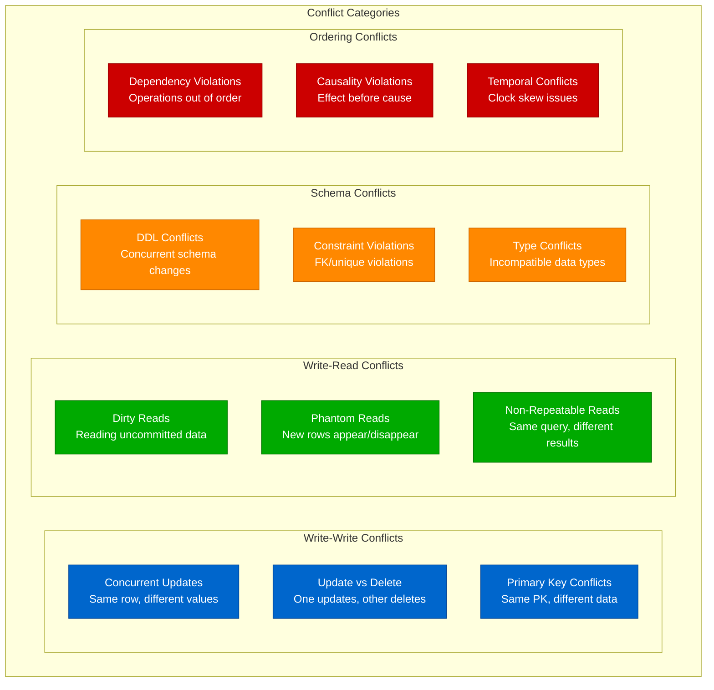
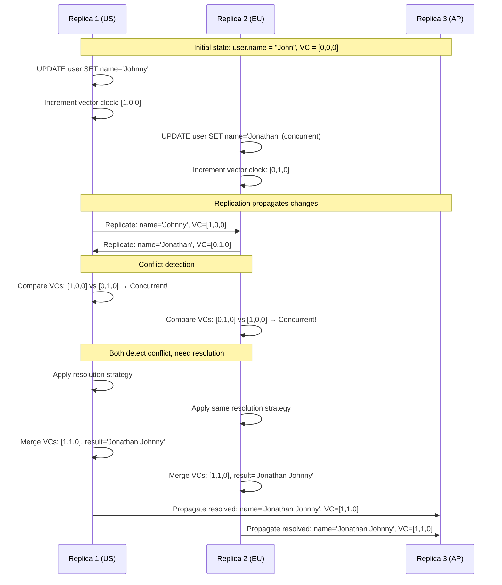
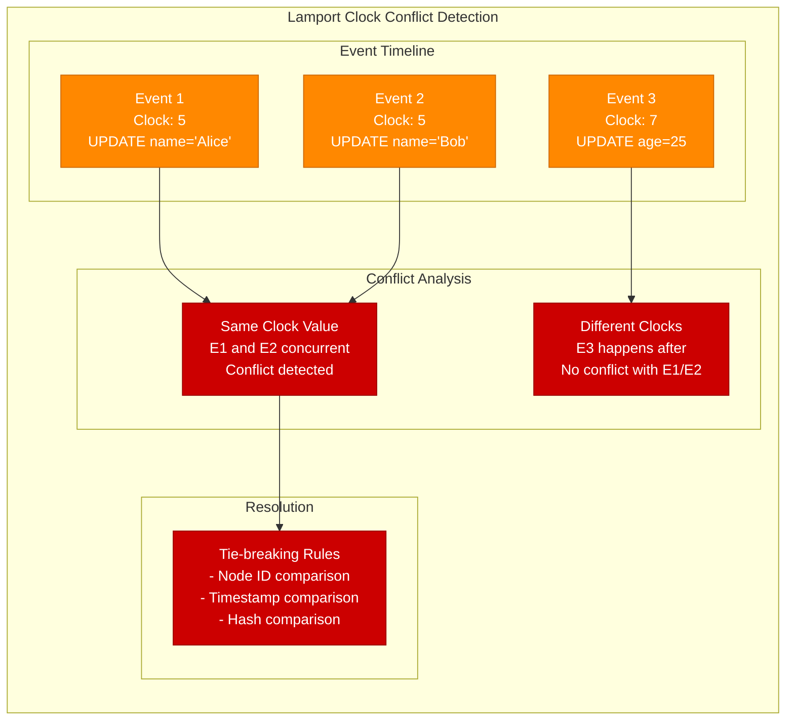
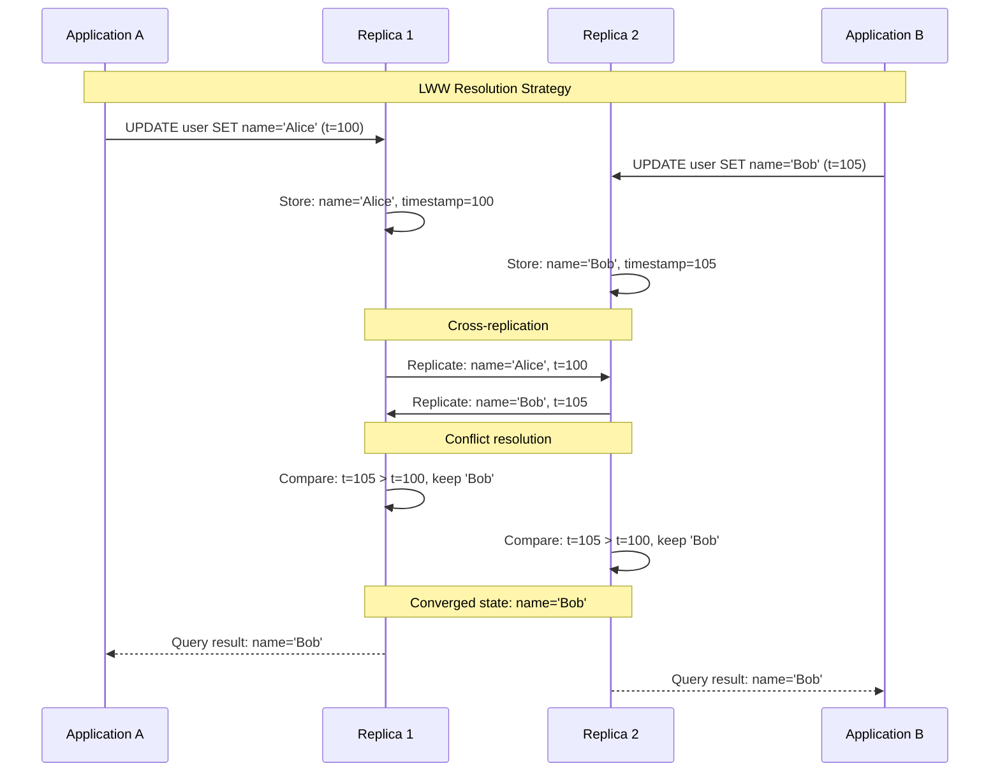
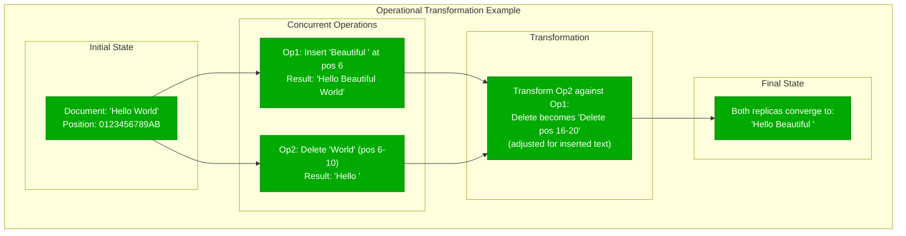
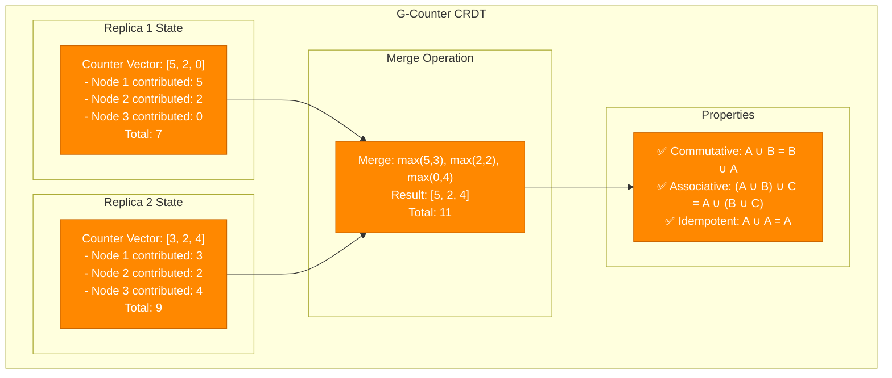
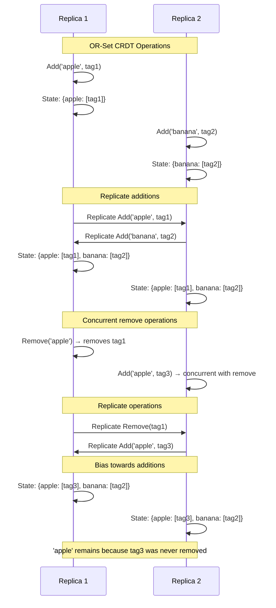

# Replication Conflict Resolution

## Understanding Replication Conflicts

Conflicts occur when multiple replicas concurrently modify the same data, requiring resolution strategies to maintain consistency across distributed systems.

### Types of Replication Conflicts



### Conflict Detection Mechanisms

#### Vector Clock-Based Detection



#### Logical Clock-Based Detection



## Conflict Resolution Strategies

### Last-Writer-Wins (LWW)



### Operational Transformation (OT)



### Conflict-free Replicated Data Types (CRDTs)

#### G-Counter (Grow-only Counter)



#### OR-Set (Observed-Remove Set)



## Production Conflict Resolution Examples

### PostgreSQL Logical Replication Conflicts

```sql
-- PostgreSQL conflict resolution configuration
CREATE SUBSCRIPTION my_subscription
    CONNECTION 'host=primary.db port=5432 dbname=mydb'
    PUBLICATION my_publication
    WITH (
        -- Conflict resolution strategy
        conflict_resolution = 'apply_remote',  -- or 'keep_local', 'error'

        -- Handle specific conflict types
        on_conflict_action = 'apply_remote',

        -- Logging conflicts
        log_replication_commands = on,
        log_min_messages = 'info'
    );

-- Monitor conflicts
SELECT
    schemaname,
    tablename,
    conflicts,
    last_conflict_time,
    conflict_type,
    conflict_resolution
FROM pg_stat_subscription_conflicts
WHERE conflicts > 0;

-- Custom conflict resolution function
CREATE OR REPLACE FUNCTION resolve_user_conflict()
RETURNS trigger AS $$
BEGIN
    -- Custom logic for user table conflicts
    IF TG_OP = 'UPDATE' AND OLD.updated_at > NEW.updated_at THEN
        -- Keep the newer version based on updated_at timestamp
        RETURN OLD;
    ELSE
        RETURN NEW;
    END IF;
END;
$$ LANGUAGE plpgsql;

-- Apply conflict resolution trigger
CREATE TRIGGER user_conflict_resolver
    BEFORE UPDATE ON users
    FOR EACH ROW
    WHEN (NEW.version_vector != OLD.version_vector)
    EXECUTE FUNCTION resolve_user_conflict();
```

### MySQL Group Replication Conflict Resolution

```sql
-- MySQL Group Replication conflict handling
SET GLOBAL group_replication_consistency = 'EVENTUAL';

-- Configure conflict detection
SET GLOBAL group_replication_single_primary_mode = OFF;  -- Multi-primary
SET GLOBAL group_replication_enforce_update_everywhere_checks = ON;

-- Monitor conflicts
SELECT
    CHANNEL_NAME,
    LAST_CONFLICT_FREE_TRANSACTION,
    COUNT_CONFLICTS_DETECTED,
    COUNT_TRANSACTIONS_CHECKED,
    LAST_CONFLICT_FREE_TRANSACTION_TIMESTAMP
FROM performance_schema.replication_group_member_stats;

-- Custom conflict resolution using application logic
DELIMITER //
CREATE PROCEDURE resolve_inventory_conflict(
    IN p_product_id INT,
    IN p_old_quantity INT,
    IN p_new_quantity_1 INT,
    IN p_new_quantity_2 INT
)
BEGIN
    DECLARE resolved_quantity INT;

    -- Business logic: always use the higher quantity for inventory
    SET resolved_quantity = GREATEST(p_new_quantity_1, p_new_quantity_2);

    UPDATE products
    SET quantity = resolved_quantity,
        last_updated = NOW(),
        conflict_resolved = TRUE
    WHERE product_id = p_product_id;

    -- Log the conflict resolution
    INSERT INTO conflict_log (
        table_name,
        record_id,
        conflict_type,
        resolution_strategy,
        old_value,
        conflicting_values,
        resolved_value,
        resolved_at
    ) VALUES (
        'products',
        p_product_id,
        'concurrent_update',
        'highest_value',
        p_old_quantity,
        CONCAT(p_new_quantity_1, ',', p_new_quantity_2),
        resolved_quantity,
        NOW()
    );
END //
DELIMITER ;
```

### Application-Level Conflict Resolution

```python
# Python application-level conflict resolution
import json
from datetime import datetime
from typing import Dict, Any, Optional

class ConflictResolver:
    def __init__(self):
        self.strategies = {
            'last_writer_wins': self._lww_resolve,
            'merge_fields': self._merge_resolve,
            'custom_business_logic': self._business_resolve,
            'user_intervention': self._user_resolve
        }

    def resolve_conflict(self,
                        current_record: Dict[str, Any],
                        incoming_record: Dict[str, Any],
                        strategy: str = 'last_writer_wins') -> Dict[str, Any]:
        """Main conflict resolution entry point"""

        if strategy not in self.strategies:
            raise ValueError(f"Unknown strategy: {strategy}")

        # Log the conflict
        self._log_conflict(current_record, incoming_record, strategy)

        # Apply resolution strategy
        resolved = self.strategies[strategy](current_record, incoming_record)

        # Add resolution metadata
        resolved['_conflict_resolved'] = True
        resolved['_resolution_strategy'] = strategy
        resolved['_resolved_at'] = datetime.now().isoformat()

        return resolved

    def _lww_resolve(self, current: Dict, incoming: Dict) -> Dict:
        """Last-Writer-Wins resolution"""
        current_ts = current.get('updated_at', '1970-01-01T00:00:00Z')
        incoming_ts = incoming.get('updated_at', '1970-01-01T00:00:00Z')

        if incoming_ts > current_ts:
            return incoming
        elif current_ts > incoming_ts:
            return current
        else:
            # Tie-breaker: use record with higher ID
            current_id = current.get('id', 0)
            incoming_id = incoming.get('id', 0)
            return incoming if incoming_id > current_id else current

    def _merge_resolve(self, current: Dict, incoming: Dict) -> Dict:
        """Field-level merge resolution"""
        merged = current.copy()

        # Merge strategies per field type
        for key, incoming_value in incoming.items():
            if key.startswith('_'):
                continue  # Skip metadata fields

            current_value = current.get(key)

            if key in ['tags', 'categories']:  # Lists - union
                if isinstance(current_value, list) and isinstance(incoming_value, list):
                    merged[key] = list(set(current_value + incoming_value))

            elif key in ['counters', 'stats']:  # Counters - sum
                if isinstance(current_value, dict) and isinstance(incoming_value, dict):
                    merged_counters = current_value.copy()
                    for counter_key, counter_value in incoming_value.items():
                        merged_counters[counter_key] = (
                            merged_counters.get(counter_key, 0) + counter_value
                        )
                    merged[key] = merged_counters

            elif key == 'description':  # Text - append
                if current_value and incoming_value and current_value != incoming_value:
                    merged[key] = f"{current_value}\n---\n{incoming_value}"
                elif incoming_value:
                    merged[key] = incoming_value

            else:  # Default: use newer value
                current_ts = current.get('updated_at', '1970-01-01T00:00:00Z')
                incoming_ts = incoming.get('updated_at', '1970-01-01T00:00:00Z')
                if incoming_ts >= current_ts:
                    merged[key] = incoming_value

        return merged

    def _business_resolve(self, current: Dict, incoming: Dict) -> Dict:
        """Business logic-specific resolution"""
        record_type = current.get('type', 'unknown')

        if record_type == 'user_profile':
            return self._resolve_user_profile(current, incoming)
        elif record_type == 'inventory_item':
            return self._resolve_inventory(current, incoming)
        elif record_type == 'financial_transaction':
            return self._resolve_financial(current, incoming)
        else:
            # Fallback to LWW
            return self._lww_resolve(current, incoming)

    def _resolve_user_profile(self, current: Dict, incoming: Dict) -> Dict:
        """User profile specific resolution"""
        resolved = current.copy()

        # Email updates require verification - keep current if verified
        if 'email' in incoming and current.get('email_verified'):
            if not incoming.get('email_verified'):
                # Don't override verified email with unverified
                pass
            else:
                resolved['email'] = incoming['email']

        # Preference fields - merge
        if 'preferences' in incoming:
            current_prefs = current.get('preferences', {})
            incoming_prefs = incoming['preferences']
            resolved['preferences'] = {**current_prefs, **incoming_prefs}

        # Privacy settings - most restrictive wins
        privacy_fields = ['profile_public', 'email_public', 'phone_public']
        for field in privacy_fields:
            if field in incoming:
                current_val = current.get(field, True)
                incoming_val = incoming[field]
                # Most restrictive (False) wins
                resolved[field] = current_val and incoming_val

        return resolved

    def _resolve_inventory(self, current: Dict, incoming: Dict) -> Dict:
        """Inventory item specific resolution"""
        resolved = current.copy()

        # Quantity: use the higher value (safety stock)
        if 'quantity' in incoming:
            current_qty = current.get('quantity', 0)
            incoming_qty = incoming['quantity']
            resolved['quantity'] = max(current_qty, incoming_qty)

        # Price: use the lower value (customer benefit)
        if 'price' in incoming:
            current_price = current.get('price', float('inf'))
            incoming_price = incoming['price']
            resolved['price'] = min(current_price, incoming_price)

        # Status: prioritize 'out_of_stock' and 'discontinued'
        if 'status' in incoming:
            current_status = current.get('status', 'active')
            incoming_status = incoming['status']

            priority = {
                'discontinued': 0,
                'out_of_stock': 1,
                'low_stock': 2,
                'active': 3
            }

            if priority.get(incoming_status, 3) < priority.get(current_status, 3):
                resolved['status'] = incoming_status

        return resolved

    def _user_resolve(self, current: Dict, incoming: Dict) -> Dict:
        """Queue for manual user resolution"""
        conflict_record = {
            'conflict_id': f"{current.get('id', 'unknown')}_{datetime.now().timestamp()}",
            'current_record': current,
            'incoming_record': incoming,
            'conflict_fields': self._find_conflicting_fields(current, incoming),
            'created_at': datetime.now().isoformat(),
            'status': 'pending_resolution'
        }

        # Store in conflict resolution queue
        self._queue_for_manual_resolution(conflict_record)

        # Return current record unchanged for now
        return current

    def _find_conflicting_fields(self, current: Dict, incoming: Dict) -> list:
        """Identify which fields have conflicts"""
        conflicts = []
        all_keys = set(current.keys()) | set(incoming.keys())

        for key in all_keys:
            if key.startswith('_'):
                continue

            current_val = current.get(key)
            incoming_val = incoming.get(key)

            if current_val != incoming_val:
                conflicts.append({
                    'field': key,
                    'current_value': current_val,
                    'incoming_value': incoming_val
                })

        return conflicts

    def _log_conflict(self, current: Dict, incoming: Dict, strategy: str):
        """Log conflict for monitoring and analysis"""
        conflict_log = {
            'timestamp': datetime.now().isoformat(),
            'record_id': current.get('id', 'unknown'),
            'record_type': current.get('type', 'unknown'),
            'strategy': strategy,
            'conflicting_fields': len(self._find_conflicting_fields(current, incoming)),
            'current_version': current.get('version', 'unknown'),
            'incoming_version': incoming.get('version', 'unknown')
        }

        # Send to monitoring system
        print(f"CONFLICT: {json.dumps(conflict_log)}")

    def _queue_for_manual_resolution(self, conflict_record: Dict):
        """Queue conflict for manual resolution"""
        # In production, this would integrate with a workflow system
        print(f"QUEUED FOR MANUAL RESOLUTION: {conflict_record['conflict_id']}")
```

## Monitoring Conflict Resolution

```yaml
# Prometheus metrics for conflict monitoring
conflict_metrics:
  - name: replication_conflicts_total
    type: counter
    labels: [database, table, conflict_type, resolution_strategy]
    description: "Total number of replication conflicts detected"

  - name: conflict_resolution_duration_seconds
    type: histogram
    labels: [resolution_strategy]
    description: "Time taken to resolve conflicts"

  - name: manual_resolution_queue_size
    type: gauge
    description: "Number of conflicts waiting for manual resolution"

  - name: conflict_resolution_success_rate
    type: gauge
    labels: [strategy]
    description: "Success rate of automatic conflict resolution"

# Grafana alerts
alerts:
  - name: "High Conflict Rate"
    condition: "rate(replication_conflicts_total[5m]) > 10"
    severity: "warning"
    message: "Replication conflict rate is high"

  - name: "Manual Resolution Queue Full"
    condition: "manual_resolution_queue_size > 100"
    severity: "critical"
    message: "Too many conflicts require manual resolution"
```

This comprehensive guide to replication conflict resolution provides the strategies, implementations, and monitoring needed to handle conflicts in distributed database systems effectively.